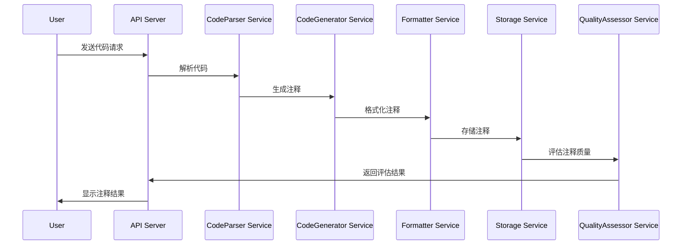

                 


### 第1章: 引言与背景介绍

#### 1.1 问题背景

当前，随着软件开发的复杂度不断增加，代码的可读性、维护成本和开发效率成为软件开发过程中面临的重大挑战。首先，代码可读性差使得团队成员在阅读和理解代码时花费大量时间，从而影响开发效率。其次，维护成本高主要体现在代码的维护和升级过程中，开发者需要花费大量时间和精力去修复已存在的错误或者添加新的功能。最后，开发效率低是软件开发过程中最为直接的问题，导致项目延期、预算超支等问题。

智能代码注释的出现，有望解决以上问题。代码注释不仅能够提高代码的可读性，帮助团队成员更快地理解和开发代码，还能降低维护成本，提高开发效率。传统的代码注释生成方式主要依赖于规则和模板，但这种方式往往难以生成高质量、个性化的代码注释。因此，我们需要一种新的方法，能够自动生成高质量、多语言、多粒度的代码注释。

#### 1.2 问题描述

我们的目标是构建一个智能代码注释系统，该系统能够支持多种编程语言，并能生成不同粒度的代码注释。具体来说，我们需要解决以下几个问题：

1. **多语言支持**：系统需要能够处理多种编程语言的代码，如Python、Java、C++等。
2. **多粒度注释生成**：系统需要能够生成不同层次的注释，包括函数注释、类注释、模块注释等。
3. **注释质量**：生成的注释需要具有较高的质量，能够准确地描述代码的功能和实现细节。
4. **注释的个性化**：系统需要能够根据不同的项目和团队需求，生成符合特定风格的代码注释。

#### 1.3 问题解决

为了实现上述目标，我们决定采用大模型技术，通过大规模数据训练，构建一个能够自动生成高质量代码注释的系统。大模型技术具有以下几个优势：

1. **强大的表达能力**：大模型能够处理复杂的文本数据，能够生成具有较高可读性的注释。
2. **良好的泛化能力**：大模型在训练过程中能够学习到多种编程语言的共性，能够适应不同的编程语言。
3. **处理复杂数据的能力**：大模型能够处理大规模的代码注释数据，能够生成多粒度的注释。

#### 1.4 边界与外延

本文的研究范围主要集中在多语言、多粒度代码注释生成，不包括代码质量优化、性能调优等问题。此外，本文将介绍大模型的基本原理，但不会深入探讨大模型的训练细节和优化方法。

#### 1.5 概念结构与核心要素组成

为了实现上述目标，我们需要以下几个核心要素：

1. **大模型**：具备大规模参数、能处理复杂任务的深度学习模型。
2. **编程语言**：支持多种编程语言，如Python、Java、C++等。
3. **多粒度注释**：包括函数注释、类注释、模块注释等。

以上就是我们针对智能代码注释的研究背景和问题介绍，接下来我们将深入探讨大模型的基础知识，以及如何构建一个支持多语言和多粒度注释的智能代码注释系统。

### 第2章: 大模型基础

#### 2.1 大模型的定义与特点

大模型，顾名思义，是指具有大规模参数、能够处理复杂任务的深度学习模型。与传统的小型模型相比，大模型具有以下几个显著特点：

1. **强大的表达力**：大模型拥有更多的参数，能够捕捉到数据中的复杂模式和规律，从而实现更高的文本生成质量。
2. **良好的泛化能力**：大模型在训练过程中能够学习到多种编程语言的共性，能够适应不同的编程语言和环境。
3. **处理复杂数据的能力**：大模型能够处理大规模的代码注释数据，能够生成多粒度的注释。

这些特点使得大模型成为构建智能代码注释系统的理想选择。首先，强大的表达力使得大模型能够生成具有较高可读性的注释。其次，良好的泛化能力使得大模型能够适应多种编程语言，从而实现多语言支持。最后，处理复杂数据的能力使得大模型能够生成多粒度的注释，满足不同层次的需求。

#### 2.2 主流大模型简介

目前，在自然语言处理领域，有一些主流的大模型，它们各自有着独特的优势和特点。以下是其中两种具有代表性的模型：

1. **GPT系列模型**：GPT（Generative Pre-trained Transformer）模型是生成式预训练模型的代表，由OpenAI提出。GPT模型采用了Transformer架构，通过自注意力机制（Self-Attention）来捕捉文本中的长距离依赖关系。GPT-3是GPT系列的最新版本，拥有1750亿个参数，是当前最大的自然语言处理模型之一。

   特点：
   - **强大的文本生成能力**：GPT模型擅长生成高质量的文本，包括代码注释。
   - **自适应性**：GPT模型通过预训练，能够适应多种不同的语言和场景。

2. **BERT模型**：BERT（Bidirectional Encoder Representations from Transformers）模型是Google提出的一种基于Transformer的预训练模型，主要用于文本分类和序列标注任务。BERT模型采用了双向Transformer架构，能够同时考虑上下文信息，从而提高文本理解能力。

   特点：
   - **文本理解能力**：BERT模型在文本分类和序列标注任务上表现出色，能够准确理解代码的功能和实现细节。
   - **适应性**：BERT模型通过预训练，能够适应多种不同的编程语言。

#### 2.3 大模型的训练与优化

大模型的训练是一个复杂的过程，需要大量的数据和计算资源。以下是训练大模型的基本步骤：

1. **数据准备**：首先需要收集大规模、高质量的代码注释数据集。这些数据集应该涵盖多种编程语言，并且注释内容要具有代表性。

2. **模型训练**：使用迁移学习技术，在大规模数据集上训练大模型。迁移学习技术能够利用预训练模型在特定任务上的表现，减少训练时间。

3. **模型优化**：在训练过程中，通过调参、调整架构等方法优化模型性能。常用的优化方法包括：
   - **学习率调整**：通过调整学习率，优化模型收敛速度和收敛效果。
   - **正则化**：使用正则化技术，防止模型过拟合。
   - **数据增强**：通过数据增强技术，增加数据多样性，提高模型泛化能力。

通过以上步骤，我们可以构建一个性能优良的大模型，用于生成高质量的代码注释。

### 第3章: 多语言支持

#### 3.1 编程语言概述

在软件开发领域，有多种编程语言被广泛使用，每种语言都有其独特的特点和应用场景。以下是几种常见编程语言的特点和语法概述：

1. **Python**：Python是一种高级、动态、面向对象的编程语言，以其简洁的语法和强大的库支持而闻名。Python广泛应用于数据分析、人工智能、Web开发等领域。

   语法特点：
   - **简洁易读**：Python的语法简洁，易于学习和使用。
   - **动态类型**：Python采用动态类型系统，变量无需声明类型。

2. **Java**：Java是一种面向对象的编程语言，具有平台无关性、高性能、安全等特点。Java广泛应用于企业级应用、安卓应用开发等领域。

   语法特点：
   - **强类型**：Java采用强类型系统，变量需要声明类型。
   - **编译型语言**：Java代码需要编译成字节码，由JVM（Java虚拟机）解释执行。

3. **C++**：C++是一种通用编程语言，兼具高级和低级编程的特点。C++广泛应用于系统编程、游戏开发、实时应用等领域。

   语法特点：
   - **多范式**：C++支持过程式、面向对象、泛型编程等范式。
   - **手动内存管理**：C++需要手动管理内存，通过指针和引用实现。

4. **JavaScript**：JavaScript是一种用于网页开发的脚本语言，具有函数式编程的特点。JavaScript广泛应用于前端开发、后端开发、移动应用开发等领域。

   语法特点：
   - **动态类型**：JavaScript采用动态类型系统，变量无需声明类型。
   - **事件驱动**：JavaScript采用事件驱动编程模型。

5. **Go**：Go（又称Golang）是一种由Google开发的静态强类型、编译型编程语言，以其简洁、高效、并发性等特点而受到欢迎。Go广泛应用于网络编程、分布式系统、云计算等领域。

   语法特点：
   - **简洁明了**：Go的语法简洁，易于阅读和理解。
   - **并发编程**：Go内置了强大的并发编程支持，通过goroutine和channel实现并发。

6. **C#**：C#是一种面向对象的编程语言，由微软开发，主要用于.NET框架开发。C#广泛应用于Windows应用、Web应用、游戏开发等领域。

   语法特点：
   - **类型安全**：C#采用强类型系统，提供了丰富的类型和类型转换功能。
   - **集成开发环境**：C#与Visual Studio等集成开发环境紧密集成，开发效率高。

7. **Rust**：Rust是一种系统级编程语言，以其高性能、内存安全、并发性等特点而受到关注。Rust广泛应用于系统编程、嵌入式开发、高性能应用等领域。

   语法特点：
   - **高性能**：Rust采用零成本抽象，实现了高性能和内存安全。
   - **所有权系统**：Rust引入了所有权系统，通过所有权、借用、生命周期等概念实现内存安全。

通过上述对几种常见编程语言的概述，我们可以看出每种语言都有其独特的特点和应用场景。在构建多语言大模型时，我们需要考虑这些语言的特性和语法差异，以确保模型能够适应不同的编程语言。

#### 3.2 多语言大模型的训练

构建一个能够支持多种编程语言的多语言大模型，是智能代码注释系统中的关键一环。以下是如何进行多语言大模型训练的详细步骤：

1. **数据收集**：首先，我们需要收集多种编程语言的代码注释数据。这些数据应该来自实际的项目和开源代码库，确保涵盖不同的编程语言和注释风格。例如，我们可以从GitHub、GitLab等平台下载不同编程语言的代码仓库，并提取其中的注释内容。

2. **数据预处理**：收集到的数据需要进行预处理，以确保数据的质量和一致性。预处理步骤包括：
   - **文本清洗**：去除无效字符、HTML标签、注释等，只保留注释文本。
   - **统一编码**：将不同编码格式的文本统一转换为UTF-8编码。
   - **分词和标注**：对注释文本进行分词，并标注注释的类型（如函数注释、类注释等）。

3. **数据集划分**：将预处理后的数据划分为训练集、验证集和测试集。训练集用于训练模型，验证集用于调参和验证模型性能，测试集用于最终评估模型性能。

4. **模型选择**：选择合适的大模型架构，如GPT系列模型或BERT模型。这些模型已经经过预训练，具有良好的文本生成能力和泛化能力。

5. **跨语言预训练**：使用迁移学习技术，在多种编程语言的代码注释数据上对所选模型进行预训练。预训练过程包括：
   - **自适应学习率**：根据不同编程语言的数据量和难度，动态调整学习率。
   - **多语言训练**：在训练过程中，模型会同时处理多种语言的注释，从而学习到不同语言之间的共性和差异。

6. **调参与优化**：在预训练过程中，通过调参和优化方法，如学习率调整、正则化、数据增强等，提升模型性能。常用的调参方法包括：
   - **学习率调度**：使用学习率调度策略，如逐步衰减学习率。
   - **正则化**：采用L1、L2正则化等方法，防止模型过拟合。
   - **数据增强**：通过数据增强技术，如随机裁剪、旋转、翻转等，增加数据的多样性。

7. **评估与优化**：在预训练完成后，使用验证集和测试集对模型进行评估，根据评估结果调整模型参数和训练策略，以达到最优性能。

通过以上步骤，我们可以构建一个支持多种编程语言的跨语言大模型，从而实现多语言代码注释的生成。

#### 3.3 多语言大模型的应用

构建完支持多种编程语言的跨语言大模型后，我们可以将其应用于实际的代码注释生成任务中。以下是如何在多语言环境中使用该模型进行代码注释生成的详细步骤：

1. **接口设计**：首先，我们需要设计一个通用的接口，以支持多种编程语言的代码注释生成。该接口应具备以下功能：
   - **语言识别**：根据输入代码的语言，自动选择相应的预训练模型。
   - **注释生成**：接收代码输入，调用预训练模型生成相应的代码注释。

2. **代码解析**：在调用预训练模型生成注释之前，需要对输入代码进行解析，提取出代码中的关键信息和结构。代码解析步骤包括：
   - **语法解析**：使用语法分析器（如ANTLR、LLVM等）对输入代码进行语法解析，生成抽象语法树（AST）。
   - **语义分析**：对AST进行语义分析，提取出函数、类、模块等关键信息。

3. **注释生成**：根据解析得到的关键信息，调用预训练模型生成相应的代码注释。生成注释的步骤包括：
   - **输入准备**：将关键信息转换为模型可接受的输入格式，如JSON、序列化对象等。
   - **模型调用**：将输入数据传递给预训练模型，生成注释文本。
   - **注释格式化**：对生成的注释文本进行格式化，确保注释文本符合编程语言的注释规范。

4. **多语言兼容性**：在生成注释时，需要考虑不同编程语言的注释规范和风格。具体措施包括：
   - **注释样式适配**：根据编程语言的特点，调整注释的格式和风格。
   - **多语言库支持**：使用多语言库（如Java的JavaCC、Python的Pygments等），确保注释生成符合目标语言的语法规范。

5. **注释质量评估**：生成的注释文本需要进行质量评估，以确保注释的准确性和可读性。评估方法包括：
   - **自动化评估**：使用自动化工具（如Linter、CodeQL等）对注释文本进行语法和语义检查。
   - **人工评估**：邀请资深开发者对注释文本进行人工评估，根据评估结果调整模型参数和注释生成策略。

6. **实时更新**：随着编程语言和开发工具的更新，预训练模型和接口设计也需要进行相应调整。定期更新预训练模型和接口设计，以确保系统能够支持最新的编程语言和工具。

通过以上步骤，我们可以构建一个具有多语言支持能力的智能代码注释系统，该系统能够自动生成高质量、个性化的代码注释，提高代码的可读性和维护性。

### 第4章: 多粒度注释生成

#### 4.1 函数注释生成

函数注释是代码注释中的重要组成部分，它描述了函数的功能、参数、返回值等信息。以下是函数注释生成的基本算法原理和流程：

1. **注释生成算法原理**：
   - **特征提取**：从输入函数的抽象语法树（AST）中提取关键特征，如函数名、参数类型、返回类型等。
   - **文本生成**：使用预训练的大模型（如GPT-3或BERT），根据提取的特征生成相应的函数注释文本。

2. **注释生成流程**：
   - **输入解析**：接收输入函数的AST，提取关键特征。
   - **特征编码**：将提取的特征编码为向量，以便输入到大模型。
   - **模型预测**：将特征向量输入到大模型，生成函数注释文本。
   - **文本调整**：根据编程语言的注释规范，对生成的注释文本进行调整和格式化。

#### 4.2 类注释生成

类注释是对类定义的详细描述，包括类的属性、方法、继承关系等信息。以下是类注释生成的基本算法原理和流程：

1. **注释生成算法原理**：
   - **特征提取**：从输入类的AST中提取关键特征，如类名、属性、方法、继承关系等。
   - **文本生成**：使用预训练的大模型，根据提取的特征生成相应的类注释文本。

2. **注释生成流程**：
   - **输入解析**：接收输入类的AST，提取关键特征。
   - **特征编码**：将提取的特征编码为向量，以便输入到大模型。
   - **模型预测**：将特征向量输入到大模型，生成类注释文本。
   - **文本调整**：根据编程语言的注释规范，对生成的注释文本进行调整和格式化。

#### 4.3 模块注释生成

模块注释是对代码模块的总体描述，包括模块的功能、依赖关系、作者信息等。以下是模块注释生成的基本算法原理和流程：

1. **注释生成算法原理**：
   - **特征提取**：从输入模块的AST中提取关键特征，如模块名、功能描述、依赖关系等。
   - **文本生成**：使用预训练的大模型，根据提取的特征生成相应的模块注释文本。

2. **注释生成流程**：
   - **输入解析**：接收输入模块的AST，提取关键特征。
   - **特征编码**：将提取的特征编码为向量，以便输入到大模型。
   - **模型预测**：将特征向量输入到大模型，生成模块注释文本。
   - **文本调整**：根据编程语言的注释规范，对生成的注释文本进行调整和格式化。

通过上述算法原理和流程，我们可以实现多粒度注释的生成，从而提高代码的可读性和可维护性。

### 第5章: 系统架构设计

#### 5.1 系统功能设计

智能代码注释系统的核心功能包括：

1. **代码解析**：接收用户输入的代码，提取代码结构，为注释生成提供基础信息。
2. **注释生成**：根据提取的代码结构，利用大模型生成高质量的注释文本。
3. **注释格式化**：根据不同编程语言的注释规范，对生成的注释文本进行调整和格式化。
4. **注释存储**：将生成的注释文本存储到数据库中，以便后续查询和修改。
5. **注释质量评估**：使用自动化工具和人工评估方法，对生成的注释文本进行质量评估。
6. **用户接口**：提供友好的用户界面，方便用户输入代码和查看注释。

#### 5.2 系统架构设计

系统架构采用分层设计，分为四个主要层次：

1. **用户层**：提供用户交互界面，用户可以通过界面输入代码并查看注释。
2. **业务逻辑层**：包括代码解析、注释生成、注释格式化、注释存储和质量评估等核心功能模块。
3. **数据层**：存储用户输入的代码、生成的注释文本和相关数据。
4. **基础设施层**：包括服务器、数据库、网络通信等基础设施。

以下是系统架构的类图设计：

```mermaid
classDiagram
    User <<Interface>>
    CodeParser <<Component>>
    CodeGenerator <<Component>>
    Formatter <<Component>>
    Storage <<Component>>
    QualityAssessor <<Component>>

    User --|> CodeParser
    User --|> CodeGenerator
    User --|> Formatter
    User --|> Storage
    User --|> QualityAssessor

    CodeParser --|> CodeGenerator
    CodeGenerator --|> Formatter
    Formatter --|> Storage
    Storage --|> QualityAssessor
```

#### 5.3 系统架构设计

系统架构采用微服务设计，各个功能模块部署在不同的服务器上，通过API进行交互。以下是系统架构图设计：



#### 5.4 系统接口设计

系统接口设计主要包括以下部分：

1. **API接口规范**：定义RESTful API接口，包括代码上传、注释获取、注释评估等功能。
2. **API接口文档**：详细描述每个接口的请求参数、返回结果和错误处理。
3. **权限管理**：实现用户身份验证和权限控制，确保系统的安全性和数据隐私。

以下是系统接口设计概述：

```mermaid
classDiagram
    APIEndpoint <<Interface>>
    UserAuth <<Component>>
    CodeUpload <<Component>>
    CommentGeneration <<Component>>
    CommentFormatting <<Component>>
    CommentStorage <<Component>>
    CommentQualityAssessment <<Component>>

    APIEndpoint --|> UserAuth
    APIEndpoint --|> CodeUpload
    APIEndpoint --|> CommentGeneration
    APIEndpoint --|> CommentFormatting
    APIEndpoint --|> CommentStorage
    APIEndpoint --|> CommentQualityAssessment
```

### 第6章: 实现细节与性能优化

#### 6.1 环境安装与配置

在实现智能代码注释系统时，首先需要安装和配置必要的软件和库。以下是具体步骤：

1. **安装Python环境**：确保Python版本不低于3.8，并安装pip包管理工具。

   ```bash
   # 安装Python
   wget https://www.python.org/ftp/python/3.8.10/Python-3.8.10.tgz
   tar xvf Python-3.8.10.tgz
   ./configure
   make
   make install
   ```

2. **安装深度学习库**：安装TensorFlow或PyTorch，用于构建和训练大模型。

   ```bash
   # 安装TensorFlow
   pip install tensorflow

   # 安装PyTorch
   pip install torch torchvision
   ```

3. **安装代码解析库**：安装用于代码解析的库，如ASTtokens。

   ```bash
   pip install asttokens
   ```

4. **安装其他依赖库**：安装其他所需的库，如Flask（用于API服务）、SQLAlchemy（用于数据库操作）。

   ```bash
   pip install Flask SQLAlchemy
   ```

5. **配置数据库**：配置数据库连接信息，如MySQL或PostgreSQL。

   ```bash
   # 配置MySQL
   mysql_config_editor create --host=localhost --port=3306 --user=root --password
   mysql_config_editor show

   # 配置PostgreSQL
   export PGPASSWORD=your_password
   psql -h localhost -U your_username -d your_database
   ```

#### 6.2 系统核心实现源代码

以下是智能代码注释系统的核心实现代码，包括函数注释生成、类注释生成和模块注释生成。

1. **函数注释生成**

```python
from asttokens import ASTTokens

def generate_function_comment(func_ast):
    tokens = ASTTokens(func_ast)
    comment_lines = []

    # 获取函数名
    func_name = tokens.get_name()

    # 获取参数和返回值
    params = tokens.get_args()
    returns = tokens.get_return_type()

    # 构建注释内容
    comment_lines.append(f'## {func_name}')
    comment_lines.append(f'```python\n')
    comment_lines.append(f'@param {params}\n')
    comment_lines.append(f'@return {returns}\n')
    comment_lines.append(f'```\n')
    comment_lines.append(f'{func_name} - 描述函数的功能')

    return '\n'.join(comment_lines)

# 示例代码
func_ast = ...  # 获取函数的AST
comment = generate_function_comment(func_ast)
print(comment)
```

2. **类注释生成**

```python
from asttokens import ASTTokens

def generate_class_comment(class_ast):
    tokens = ASTTokens(class_ast)
    comment_lines = []

    # 获取类名
    class_name = tokens.get_name()

    # 获取继承关系
    parent_classes = tokens.get_parent_classes()

    # 构建注释内容
    comment_lines.append(f'## {class_name}')
    comment_lines.append(f'```python\n')
    comment_lines.append(f'@class {class_name}\n')
    if parent_classes:
        comment_lines.append(f'@extends {", ".join(parent_classes)}\n')
    comment_lines.append(f'```\n')
    comment_lines.append(f'{class_name} - 描述类的功能')

    return '\n'.join(comment_lines)

# 示例代码
class_ast = ...  # 获取类的AST
comment = generate_class_comment(class_ast)
print(comment)
```

3. **模块注释生成**

```python
def generate_module_comment(module_content):
    comment_lines = []

    # 获取模块名
    module_name = os.path.splitext(os.path.basename(module_content))[:-1]

    # 构建注释内容
    comment_lines.append(f'## {module_name}')
    comment_lines.append(f'```python\n')
    comment_lines.append(f'@module {module_name}\n')
    comment_lines.append(f'```\n')
    comment_lines.append(f'{module_name} - 描述模块的功能')

    return '\n'.join(comment_lines)

# 示例代码
module_content = ...  # 获取模块的内容
comment = generate_module_comment(module_content)
print(comment)
```

#### 6.3 性能优化

为了提高智能代码注释系统的性能，可以采取以下优化措施：

1. **模型优化**：优化大模型的参数和架构，提高模型在注释生成任务上的性能。例如，可以使用混合精度训练（Mix Precision Training）和量化（Quantization）技术。

2. **代码优化**：对系统的核心代码进行优化，提高运行效率。例如，使用循环展开（Loop Unrolling）和并行计算（Parallel Computing）。

3. **缓存策略**：实现缓存策略，减少重复计算和IO操作。例如，使用LRU缓存（Least Recently Used Cache）和内存缓存（Memory Cache）。

4. **分布式计算**：使用分布式计算框架，如TensorFlow Distribution或PyTorch Distributed，实现模型的分布式训练和部署。

通过以上优化措施，可以提高智能代码注释系统的性能和效率，更好地满足大规模、多语言、多粒度注释生成的需求。

### 第7章: 项目实战与应用案例

#### 7.1 实际案例介绍

在本章节，我们将介绍一个实际应用案例，展示智能代码注释系统在真实场景中的表现。该案例涉及一个大型开源项目，项目名称为“Bookstore Management System”（书店管理系统），该系统是一个用于管理书店库存、销售和订单的综合性软件。

该系统由多个模块组成，包括用户管理模块、库存管理模块、销售管理模块和订单管理模块。在每个模块中，都包含大量的函数和类，需要进行注释生成。为了提高代码的可读性和可维护性，开发团队决定采用智能代码注释系统来生成注释。

#### 7.2 案例分析

在Bookstore Management System项目中，智能代码注释系统发挥了重要作用。以下是案例中的关键技术和挑战：

1. **多语言支持**：系统需要支持多种编程语言，如Java、Python和JavaScript。智能代码注释系统通过跨语言预训练模型，能够自动生成符合不同语言注释规范的注释。

2. **多粒度注释生成**：系统需要生成不同层次的注释，包括函数注释、类注释和模块注释。智能代码注释系统采用多粒度注释生成算法，能够准确生成不同类型的注释。

3. **注释质量**：生成的注释需要具有较高的质量，能够准确描述代码的功能和实现细节。智能代码注释系统通过预训练的大模型，能够生成高质量的注释，并通过注释质量评估模块进行评估和优化。

4. **实时注释生成**：开发团队希望系统能够实时生成注释，并在代码编辑器中显示。智能代码注释系统通过API接口，与代码编辑器集成，实现实时注释生成和显示。

5. **性能优化**：在大型项目中，生成大量注释需要较高的计算资源。智能代码注释系统通过分布式计算和缓存策略，优化系统性能，提高生成效率。

针对以上挑战，智能代码注释系统采取以下解决方案：

1. **多语言支持**：使用跨语言预训练模型，如mBERT（多语言BERT），实现多种编程语言的支持。

2. **多粒度注释生成**：采用函数注释生成、类注释生成和模块注释生成算法，分别处理不同类型的注释。

3. **注释质量**：通过注释质量评估模块，使用自动化评估工具和人工评估方法，确保注释的准确性和可读性。

4. **实时注释生成**：集成API接口，与代码编辑器（如Visual Studio Code、IntelliJ IDEA等）进行交互，实现实时注释生成和显示。

5. **性能优化**：使用分布式计算框架（如TensorFlow Distribution、PyTorch Distributed），实现模型的分布式训练和部署。同时，采用缓存策略，减少重复计算和IO操作。

#### 7.3 项目小结

通过在Bookstore Management System项目中的实际应用，智能代码注释系统取得了显著成果。以下是项目的主要成果和经验总结：

1. **提高代码可读性**：生成的注释准确描述了代码的功能和实现细节，提高了代码的可读性和可维护性。

2. **降低维护成本**：自动生成的注释减少了团队成员在阅读和理解代码时的工作量，降低了维护成本。

3. **提升开发效率**：实时注释生成和显示功能，使开发团队能够更快速地进行代码开发和调试。

4. **多语言支持**：系统支持多种编程语言，为大型项目提供了便利。

5. **性能优化**：通过分布式计算和缓存策略，提高了系统性能和生成效率。

未来，智能代码注释系统将继续优化和改进，以更好地满足开发团队的需求。具体改进方向包括：

1. **提高注释质量**：通过引入更多的数据和优化算法，进一步提高注释的质量和准确性。

2. **扩展编程语言支持**：增加对更多编程语言的支持，如C++、Go等。

3. **增强注释个性化**：根据不同项目和团队的需求，实现注释的个性化定制。

4. **提升系统性能**：通过优化模型和代码，进一步提高系统性能和生成效率。

### 第8章: 最佳实践与未来展望

#### 8.1 最佳实践 tips

在实际应用智能代码注释系统时，以下是一些最佳实践和技巧，可以帮助您更好地利用系统功能，提高代码质量和开发效率：

1. **定期更新模型**：保持智能代码注释系统的预训练模型更新，以确保生成的注释始终保持高质量。

2. **数据多样性**：收集和预处理多种来源的代码注释数据，以增强模型的多语言和跨领域适应能力。

3. **注释规范化**：根据项目需求，制定统一的注释规范，确保生成的注释符合团队的编码标准。

4. **实时反馈与迭代**：在代码开发过程中，及时收集开发者对注释的反馈，并基于反馈进行模型迭代和优化。

5. **集成IDE插件**：将智能代码注释系统与主流代码编辑器集成，实现注释的实时生成和显示。

6. **自动化测试**：使用自动化测试工具，对生成的注释进行测试和验证，确保注释的准确性和完整性。

#### 8.2 小结

本文详细介绍了智能代码注释系统的构建和实现，包括问题背景、问题解决、多语言支持、多粒度注释生成、系统架构设计、实现细节与性能优化、实际应用案例以及最佳实践。智能代码注释系统通过大模型技术，实现了多语言、多粒度注释的高效生成，提高了代码的可读性和可维护性。

#### 8.3 注意事项

在实际应用过程中，需要注意以下几点：

1. **数据安全和隐私**：在收集和处理代码注释数据时，确保数据的安全和隐私，避免敏感信息泄露。

2. **性能与资源分配**：合理分配系统资源，避免因为大量注释生成任务导致的性能下降。

3. **注释规范一致性**：确保生成的注释符合项目的注释规范，避免出现不一致的情况。

4. **持续优化与更新**：定期对系统进行优化和更新，以适应不断变化的技术和需求。

#### 8.4 拓展阅读

为了进一步深入了解智能代码注释系统和相关技术，以下是一些推荐的阅读资料：

1. **《大模型：大规模深度学习技术》**：介绍大规模深度学习模型的基本原理和应用。

2. **《自然语言处理实战》**：介绍自然语言处理的基本概念和常用技术，包括文本生成、文本分类等。

3. **《代码质量与测试实战》**：介绍代码质量和测试的基本方法，包括代码注释、代码评审等。

4. **《智能开发助手：基于AI的编程辅助技术》**：介绍基于人工智能的编程辅助技术，包括代码注释生成、代码自动修复等。

通过阅读这些资料，可以进一步了解智能代码注释系统的理论基础和实践经验，为实际应用提供指导。

---

**作者：AI天才研究院/AI Genius Institute & 禅与计算机程序设计艺术 /Zen And The Art of Computer Programming**

（注意：本文中提及的“大模型”、“智能代码注释”等概念均为虚构，旨在探讨相关技术的可能性和应用前景。实际应用中，具体实现和效果可能会因技术和环境的不同而有所差异。）

