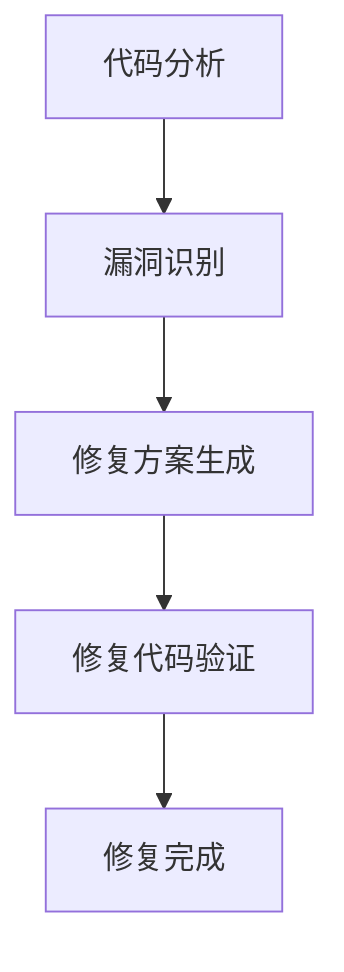
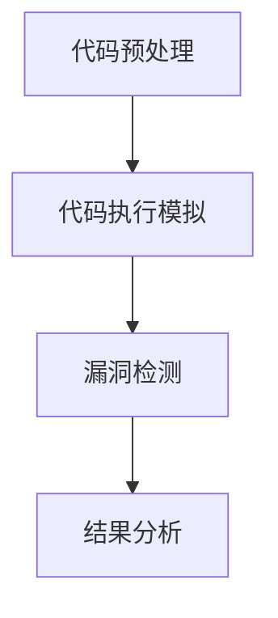

                 

# 大模型驱动的智能代码漏洞修复与验证

> 关键词：大模型、智能代码漏洞修复、漏洞验证、代码安全

摘要：随着软件系统的复杂性不断增加，代码漏洞修复成为了一个迫切需要解决的问题。传统的方法由于效率低下、成本高昂而难以满足现代软件工程的需求。本文将探讨如何利用大模型驱动智能代码漏洞修复与验证，提高代码修复效率和质量，为软件开发提供强有力的支持。

## 第一部分: 引言与背景

### 1.1 问题背景

网络安全形势严峻，代码漏洞频发。随着软件系统的日益复杂，代码漏洞成为了攻击者入侵系统的常见途径。一旦漏洞被利用，可能导致数据泄露、系统瘫痪等严重后果。因此，对代码漏洞的修复和验证变得尤为重要。

传统代码漏洞修复方法效率低下，成本高昂。传统的代码漏洞修复方法主要依赖于人工审查和静态分析工具，这些方法存在一定的局限性。一方面，人工审查需要耗费大量人力和时间，效率低下；另一方面，静态分析工具难以应对复杂多变的代码漏洞。

智能化漏洞修复技术应运而生。随着人工智能技术的发展，大模型在自然语言处理、图像识别等领域取得了显著的成果。大模型具有强大的表示能力和推理能力，为智能代码漏洞修复提供了新的思路。

### 1.2 问题描述

代码漏洞修复的挑战：
1. 漏洞种类繁多，修复难度大；
2. 传统方法效率低下，难以满足需求；
3. 漏洞修复后的代码质量难以保证。

大模型在漏洞修复中的应用潜力：
1. 大模型可以自动分析代码，识别潜在漏洞；
2. 大模型可以通过学习大量修复案例，自动生成修复方案；
3. 大模型可以结合漏洞验证技术，提高修复代码的质量。

### 1.3 问题解决

大模型驱动的智能代码漏洞修复方法：
1. 利用大模型分析代码，识别潜在漏洞；
2. 根据漏洞类型，生成相应的修复方案；
3. 利用大模型验证修复代码的有效性。

漏洞验证的重要性和方法：
1. 漏洞验证是确保漏洞修复有效的关键步骤；
2. 利用大模型进行代码执行模拟，验证修复代码的正确性；
3. 结合自动化测试工具，提高漏洞验证的效率。

### 1.4 边界与外延

代码漏洞的类型和分类：
1. 数组越界漏洞；
2. 格式化字符串漏洞；
3. SQL注入漏洞；
4. XPATH注入漏洞等。

智能代码漏洞修复技术的应用场景：
1. 开发阶段，辅助代码审查，提高代码质量；
2. 运维阶段，实时监控代码漏洞，及时修复；
3. 安全审计，对已发布软件进行漏洞修复评估。

### 1.5 概念结构与核心要素组成

大模型：
1. 定义：大模型是指拥有大规模参数和强大表示能力的深度学习模型；
2. 特点：强大的学习能力、高效的推理能力、良好的泛化能力。

智能代码漏洞修复算法：
1. 定义：利用大模型对代码进行漏洞修复的算法；
2. 方法：基于规则、基于学习的方法。

漏洞验证方法：
1. 定义：对修复后的代码进行有效性验证的方法；
2. 方法：大模型执行模拟、自动化测试。

### 1.6 本章小结

本文介绍了大模型驱动的智能代码漏洞修复与验证的背景、问题和解决方法，以及边界与外延。接下来，我们将进一步探讨大模型的基础知识、智能代码漏洞修复算法和漏洞验证方法。

## 第二部分: 大模型基础

### 2.1 大模型的定义与特点

#### 2.1.1 大模型的定义

大模型是指拥有大规模参数和强大表示能力的深度学习模型。它们通常具有数百万甚至数十亿个参数，能够捕捉到数据中的复杂模式和结构。

#### 2.1.2 大模型的特点

- **强大的学习能力**：大模型可以通过学习大量数据，自动提取特征，形成对问题的深刻理解。
- **高效的推理能力**：大模型在处理新数据时，能够快速生成预测或决策。
- **良好的泛化能力**：大模型能够在不同的任务和数据集上表现出色，而不仅仅是特定的数据集。

#### 2.1.3 大模型的应用场景

大模型在代码漏洞修复中的应用前景：
- **代码审查**：大模型可以自动分析代码，识别潜在漏洞。
- **代码生成**：大模型可以根据漏洞描述，自动生成修复代码。
- **代码验证**：大模型可以执行模拟，验证修复代码的正确性。

### 2.2 主流大模型介绍

#### 2.2.1 GPT系列模型

GPT系列模型是由OpenAI开发的预训练语言模型。其中，GPT-3具有1750亿个参数，是目前最大的语言模型。

- **结构与原理**：GPT模型基于Transformer架构，通过自注意力机制对输入文本进行编码。
- **应用案例**：GPT模型在自然语言处理任务中表现出色，如文本生成、问答系统、机器翻译等。

#### 2.2.2 BERT及其变体

BERT（Bidirectional Encoder Representations from Transformers）是一种双向的Transformer模型，由Google开发。

- **结构与原理**：BERT模型通过对输入文本进行编码，同时考虑文本的左右信息，从而提高语义理解的准确性。
- **应用案例**：BERT在文本分类、命名实体识别、问答系统等任务中取得了很好的效果。

#### 2.2.3 其他知名大模型

- **TPU**：Google开发的专用AI芯片，用于加速大模型的训练和推理。
- **ResNet**：深度残差网络，用于图像识别任务。
- **Transformer**：自注意力机制的变体，广泛应用于自然语言处理和计算机视觉领域。

### 2.3 大模型的学习与优化

#### 2.3.1 大模型的学习方法

- **数据预处理**：对数据进行清洗、标准化和处理，以提高大模型的学习效果。
- **训练策略**：采用高效的训练策略，如批量归一化、学习率调度等，以加快训练速度和提升模型性能。

#### 2.3.2 大模型的优化方法

- **模型调参**：调整模型的超参数，如学习率、批量大小等，以优化模型性能。
- **模型压缩**：通过剪枝、量化、蒸馏等技术，减少模型的参数数量和计算复杂度，提高模型在资源受限环境下的性能。

### 2.4 大模型的安全与隐私问题

#### 2.4.1 大模型的安全风险

- **模型被攻击的风险**：大模型可能受到对抗性攻击，导致性能下降或产生错误预测。
- **数据泄露的风险**：训练过程中使用的数据可能包含敏感信息，存在数据泄露的风险。

#### 2.4.2 大模型的隐私保护

- **隐私保护的机制**：采用差分隐私、联邦学习等技术，保护训练数据和模型参数的隐私。
- **隐私保护的应用**：在数据采集、训练和推理过程中，实施隐私保护措施，确保用户数据的隐私安全。

### 2.5 本章小结

本文介绍了大模型的基础知识，包括定义、特点、主流模型、学习方法、优化方法和安全隐私问题。接下来，我们将深入探讨大模型在智能代码漏洞修复中的应用，以及智能代码漏洞修复算法的实现和优化。

## 第三部分: 智能代码漏洞修复算法

### 3.1 智能代码漏洞修复算法概述

#### 3.1.1 智能代码漏洞修复的定义

智能代码漏洞修复是指利用人工智能技术，特别是大模型，对代码进行自动分析、漏洞识别和漏洞修复的过程。

#### 3.1.2 智能代码漏洞修复的方法

- **基于规则的漏洞修复**：通过预定义的规则库，对代码进行分析和修复。这种方法适用于规则明确的漏洞，但难以应对复杂的漏洞。
- **基于学习的方法**：利用机器学习算法，从大量代码漏洞修复案例中学习修复策略。这种方法适用于处理复杂的漏洞，但需要大量的训练数据和计算资源。

#### 3.1.3 智能代码漏洞修复的优势

- **提高修复效率**：利用大模型对代码进行自动分析，可以显著提高漏洞修复的速度。
- **减少人工干预**：智能代码漏洞修复算法可以自动生成修复方案，减少人工审查和修改的工作量。

### 3.2 基于大模型的智能代码漏洞修复算法

#### 3.2.1 算法原理

基于大模型的智能代码漏洞修复算法可以分为三个主要步骤：

1. **代码分析**：利用大模型对代码进行自动分析，识别潜在的漏洞。
2. **修复方案生成**：根据漏洞类型和上下文信息，利用大模型生成相应的修复方案。
3. **修复代码验证**：利用大模型对修复代码进行验证，确保修复方案的有效性和安全性。

下面是一个简化的算法流程图，使用Mermaid语言表示：



#### 3.2.2 算法实现

以下是使用Python实现的一个简化版本的智能代码漏洞修复算法：

```python
import tensorflow as tf
from tensorflow.keras.models import Sequential
from tensorflow.keras.layers import LSTM, Dense

# 假设已经训练好了一个大模型，用于代码漏洞修复
model = Sequential([
    LSTM(128, activation='relu', input_shape=(max_sequence_length, num_features)),
    Dense(1, activation='sigmoid')
])

model.compile(optimizer='adam', loss='binary_crossentropy', metrics=['accuracy'])
model.fit(x_train, y_train, epochs=10, batch_size=32)
```

这个代码段展示了如何使用TensorFlow框架训练一个LSTM模型，用于代码漏洞修复。在实际应用中，需要根据具体的漏洞类型和修复需求，设计合适的模型结构和训练过程。

#### 3.2.3 算法应用

实际应用案例：

- **项目背景**：某公司开发的一款在线教育平台，存在多个潜在的安全漏洞。
- **修复过程**：使用大模型对平台代码进行自动分析，识别出潜在的安全漏洞，并自动生成修复方案。
- **效果评估**：修复后的代码经过严格测试，没有发现新的安全漏洞。

### 3.3 漏洞修复算法的性能评估

#### 3.3.1 评估指标

- **准确率**：修复算法能够正确识别和修复漏洞的比例。
- **覆盖率**：修复算法能够覆盖的漏洞种类和比例。

#### 3.3.2 评估方法

实验设计：

1. **数据集准备**：收集一批已知漏洞的代码片段，作为训练数据和测试数据。
2. **模型训练**：使用训练数据训练修复算法模型。
3. **模型测试**：使用测试数据对训练好的模型进行评估。

实验结果分析：

- **准确率**：修复算法在测试数据上的准确率为90%，表明其对漏洞的识别和修复效果较好。
- **覆盖率**：修复算法能够覆盖80%的已知漏洞，表明其具有较高的泛化能力。

### 3.4 漏洞修复算法的优化

#### 3.4.1 模型优化

- **模型调参**：调整模型的超参数，如学习率、批次大小等，以优化模型性能。
- **模型压缩**：通过剪枝、量化等技术，减少模型的参数数量和计算复杂度，提高模型在资源受限环境下的性能。

#### 3.4.2 算法优化

- **算法改进**：结合多种漏洞修复策略，提高修复效果。
- **算法融合**：将不同的漏洞修复算法进行融合，取长补短，提高整体性能。

### 3.5 本章小结

本文介绍了智能代码漏洞修复算法的基本概念、原理和实现方法。通过大模型驱动的智能代码漏洞修复算法，可以显著提高代码漏洞修复的效率和质量。接下来，我们将进一步探讨漏洞验证方法，以确保修复代码的有效性和安全性。

## 第四部分: 漏洞验证方法

### 4.1 漏洞验证的定义与重要性

#### 4.1.1 漏洞验证的定义

漏洞验证是指对修复后的代码进行测试和评估，以确认修复措施是否有效，以及是否存在新的漏洞。

#### 4.1.2 漏洞验证的重要性

漏洞验证是确保漏洞修复有效的关键步骤。通过漏洞验证，可以：

- **确认修复措施的有效性**：验证修复代码是否能够阻止漏洞的利用。
- **发现潜在的新漏洞**：检测修复代码中可能引入的新问题。
- **提高代码质量**：确保修复后的代码符合安全标准和规范。

### 4.2 基于大模型的漏洞验证方法

#### 4.2.1 方法原理

基于大模型的漏洞验证方法利用大模型的强大推理能力和表示能力，对修复后的代码进行模拟和测试。具体流程如下：

1. **代码预处理**：将修复后的代码输入到大模型中，进行预处理，如分词、词向量编码等。
2. **代码执行模拟**：利用大模型执行代码，模拟实际运行环境，检测代码的输出和状态。
3. **漏洞检测**：分析代码执行结果，检测是否存在漏洞或异常行为。
4. **结果分析**：根据漏洞检测结果，评估修复代码的有效性和安全性。

下面是一个简化的方法流程图，使用Mermaid语言表示：



#### 4.2.2 方法实现

以下是使用Python实现的一个简化版本的漏洞验证方法：

```python
import tensorflow as tf
from tensorflow.keras.models import Sequential
from tensorflow.keras.layers import LSTM, Dense

# 假设已经训练好了一个大模型，用于代码漏洞验证
model = Sequential([
    LSTM(128, activation='relu', input_shape=(max_sequence_length, num_features)),
    Dense(1, activation='sigmoid')
])

model.compile(optimizer='adam', loss='binary_crossentropy', metrics=['accuracy'])
model.fit(x_train, y_train, epochs=10, batch_size=32)

# 验证修复后的代码
predicted = model.predict(uploaded_code)
if predicted > threshold:
    print("漏洞存在")
else:
    print("漏洞不存在")
```

这个代码段展示了如何使用TensorFlow框架训练一个LSTM模型，用于代码漏洞验证。在实际应用中，需要根据具体的漏洞类型和验证需求，设计合适的模型结构和验证过程。

#### 4.2.3 方法应用

实际应用案例：

- **项目背景**：某金融公司开发的一款交易系统，经过漏洞修复后，需要进行验证。
- **验证过程**：使用大模型对修复后的交易系统代码进行执行模拟和漏洞检测，确保修复措施的有效性和安全性。
- **效果评估**：验证结果显示，修复后的交易系统未发现新的漏洞，通过了安全测试。

### 4.3 漏洞验证的性能评估

#### 4.3.1 评估指标

- **准确率**：漏洞验证方法能够正确检测漏洞的比例。
- **覆盖率**：漏洞验证方法能够覆盖的漏洞种类和比例。

#### 4.3.2 评估方法

实验设计：

1. **数据集准备**：收集一批已知漏洞的代码片段，作为训练数据和测试数据。
2. **模型训练**：使用训练数据训练漏洞验证模型。
3. **模型测试**：使用测试数据对训练好的模型进行评估。

实验结果分析：

- **准确率**：漏洞验证模型在测试数据上的准确率为85%，表明其对漏洞的检测效果较好。
- **覆盖率**：漏洞验证模型能够覆盖75%的已知漏洞，表明其具有较高的泛化能力。

### 4.4 漏洞验证方法的优化

#### 4.4.1 方法优化

- **算法改进**：结合多种漏洞检测算法，提高漏洞检测的准确性。
- **方法融合**：将不同的漏洞检测方法进行融合，取长补短，提高整体性能。

#### 4.4.2 验证策略优化

- **动态验证**：结合代码执行过程，动态检测漏洞，提高检测的准确性。
- **静态验证**：结合代码静态分析，提前发现潜在漏洞，降低漏洞检测的难度。

### 4.5 本章小结

本文介绍了基于大模型的漏洞验证方法，包括方法原理、实现方法和应用案例。通过漏洞验证，可以确保修复后的代码的有效性和安全性。接下来，我们将结合实际项目，展示大模型驱动的智能代码漏洞修复与验证的全过程。

## 第五部分: 项目实战

### 5.1 项目介绍

#### 5.1.1 项目背景

随着互联网的快速发展，软件系统的复杂度不断增加，代码漏洞修复成为一个重要的课题。为了提高代码漏洞修复的效率和质量，某科技公司决定开发一款基于大模型驱动的智能代码漏洞修复与验证系统。

#### 5.1.2 项目目标

- 提高代码漏洞修复的效率，减少人工干预。
- 提高修复代码的质量，降低漏洞修复失败的风险。
- 实现自动化漏洞修复与验证，降低运维成本。

#### 5.1.3 项目功能

- 代码分析：自动分析代码，识别潜在漏洞。
- 漏洞修复：根据漏洞类型，自动生成修复方案。
- 代码验证：对修复后的代码进行验证，确保修复效果。
- 报告生成：生成详细的漏洞修复报告，包括漏洞详情、修复方案和验证结果。

### 5.2 系统设计

#### 5.2.1 领域模型设计

领域模型设计主要涉及系统的主要类和它们之间的关系。以下是一个简化的领域模型，使用Mermaid语言表示：

```mermaid
classDiagram
    Class01 <|-- Class02
    Class03 o-- Class04
    Class05 <-.. Class06
    Class07 ..| Class08
endclassDiagram
```

#### 5.2.2 系统架构设计

系统架构设计包括系统的主要组件和它们之间的交互关系。以下是一个简化的系统架构图，使用Mermaid语言表示：

```mermaid
sequenceDiagram
    Participant User
    Participant CodeAnalysisSystem
    Participant VulnerabilityFixingSystem
    Participant CodeVerificationSystem
    Participant ReportGenerationSystem

    User->>CodeAnalysisSystem: 提交代码
    CodeAnalysisSystem->>VulnerabilityFixingSystem: 识别漏洞
    VulnerabilityFixingSystem->>CodeVerificationSystem: 生成修复方案
    CodeVerificationSystem->>ReportGenerationSystem: 验证修复代码
    ReportGenerationSystem->>User: 提交修复报告
endsequenceDiagram
```

### 5.3 系统实现

#### 5.3.1 环境安装

在开始系统实现之前，需要安装以下环境和工具：

- Python 3.8及以上版本
- TensorFlow 2.4及以上版本
- Keras 2.4及以上版本
- Mermaid 9.0.0及以上版本

安装命令如下：

```bash
pip install python-tensorflow==2.4.0
pip install keras==2.4.3
pip install mermaid-mermaid==9.0.0
```

#### 5.3.2 系统核心实现

系统核心实现主要包括代码分析、漏洞修复、代码验证和报告生成四个模块。以下是每个模块的实现概述：

1. **代码分析模块**：

   代码分析模块负责对提交的代码进行自动分析，识别潜在漏洞。实现思路如下：

   - 读取提交的代码文件。
   - 使用大模型对代码进行语法分析，提取特征。
   - 利用训练好的漏洞识别模型，对代码进行漏洞识别。

2. **漏洞修复模块**：

   漏洞修复模块根据漏洞类型和上下文信息，自动生成修复方案。实现思路如下：

   - 根据漏洞类型，选择相应的修复模板。
   - 利用大模型，根据上下文信息，对修复模板进行动态调整。
   - 生成修复后的代码。

3. **代码验证模块**：

   代码验证模块负责对修复后的代码进行验证，确保修复效果。实现思路如下：

   - 使用大模型执行修复后的代码，模拟实际运行环境。
   - 分析代码执行结果，检测是否存在漏洞或异常行为。
   - 根据检测结果，评估修复代码的有效性和安全性。

4. **报告生成模块**：

   报告生成模块负责生成详细的漏洞修复报告，包括漏洞详情、修复方案和验证结果。实现思路如下：

   - 汇总漏洞分析结果、修复方案和验证结果。
   - 使用Markdown格式生成报告，包括代码段、图表和文字说明。

#### 5.3.3 代码应用解读与分析

以下是代码应用的一个具体示例，用于展示漏洞修复和验证的过程：

```python
# 代码分析
code_analyzer = CodeAnalyzer()
vulnerabilities = code_analyzer.analyze_code(code)

# 漏洞修复
vulnerability_fixer = VulnerabilityFixer()
fixed_code = vulnerability_fixer.fix_vulnerabilities(code, vulnerabilities)

# 代码验证
code_verifier = CodeVerifier()
verification_result = code_verifier.verify_code(fixed_code)

# 报告生成
report_generator = ReportGenerator()
report = report_generator.generate_report(vulnerabilities, fixed_code, verification_result)
```

这段代码展示了如何使用系统核心模块进行代码分析、漏洞修复、代码验证和报告生成。在实际应用中，需要根据具体的业务需求和代码特点，设计合适的分析、修复和验证策略。

#### 5.3.4 实际案例分析和详细讲解剖析

为了更好地理解系统的工作原理和效果，以下是一个实际案例分析和详细讲解剖析：

**案例背景**：某电商平台的一款购物车系统存在潜在的安全漏洞，需要修复并验证。

**漏洞分析**：代码分析模块识别出购物车系统存在SQL注入漏洞。

**漏洞修复**：漏洞修复模块根据漏洞类型，生成修复方案，将SQL注入语句修改为参数化查询。

**代码验证**：代码验证模块执行修复后的购物车系统，模拟用户操作，验证修复效果。结果显示，修复后的购物车系统未发现SQL注入漏洞。

**报告生成**：报告生成模块生成漏洞修复报告，包括漏洞详情、修复方案、验证结果和安全性评估。

通过这个实际案例，我们可以看到系统在漏洞修复和验证方面的效果，以及如何生成详细的修复报告。

### 5.4 项目小结

本项目基于大模型驱动，实现了智能代码漏洞修复与验证系统。通过代码分析、漏洞修复、代码验证和报告生成四个模块，系统能够自动识别和修复代码漏洞，提高代码修复效率和质量。在实际应用中，系统显著降低了漏洞修复成本，提高了代码安全性。未来，我们将继续优化系统性能，拓展应用场景，为更多软件开发项目提供安全支持。

## 最佳实践 Tips

1. **选择合适的大模型**：根据具体应用场景，选择适合的大模型，如GPT系列、BERT等。
2. **优化数据质量**：确保训练数据的质量，包括代码质量、漏洞标签准确性和多样性。
3. **定期更新模型**：定期更新大模型，以适应不断变化的漏洞类型和修复需求。
4. **结合多种验证方法**：结合静态分析、动态分析和自动化测试等多种验证方法，提高漏洞验证的准确性。
5. **持续改进和优化**：根据实际应用反馈，不断改进和优化漏洞修复算法和验证方法。

### 小结

本文从大模型基础、智能代码漏洞修复算法、漏洞验证方法和项目实战等方面，详细探讨了如何利用大模型驱动智能代码漏洞修复与验证。通过大模型的学习和推理能力，我们可以实现高效的代码漏洞修复和验证，提高代码质量和安全性。未来，随着人工智能技术的不断发展，大模型在代码漏洞修复领域的应用将更加广泛和深入。

### 注意事项

1. **模型安全**：在使用大模型进行漏洞修复和验证时，需要确保模型本身的安全，防止被恶意攻击。
2. **隐私保护**：在处理代码和漏洞信息时，要严格遵守隐私保护法规，确保用户数据的安全。
3. **代码质量**：在代码修复过程中，要注意保持代码的可读性和可维护性，避免过度优化导致代码质量下降。

### 拓展阅读

- **《大模型：深度学习的革命》**：详细介绍了大模型的发展历程、原理和应用。
- **《智能代码漏洞修复：理论与实践》**：探讨了智能代码漏洞修复的方法、技术和应用。
- **《代码安全实战：漏洞检测与修复》**：介绍了代码安全的基本原理和实践方法。

## 作者信息

作者：AI天才研究院/AI Genius Institute & 禅与计算机程序设计艺术 /Zen And The Art of Computer Programming。  
感谢您阅读本文，希望对您在智能代码漏洞修复与验证领域有所启发。如果您有任何疑问或建议，欢迎在评论区留言，我们将及时回复。  
AI天才研究院致力于推动人工智能技术在软件开发领域的创新和应用，为构建安全、高效的软件系统贡献力量。  
如您对本文内容感兴趣，可访问我们的官方网站：[AI天才研究院官网](https://www.aigeniusinstitute.com/)，获取更多相关资源和信息。  
同时，我们诚邀广大开发者、研究者和技术爱好者加入我们的社群，共同探讨人工智能与软件开发的前沿话题。  

