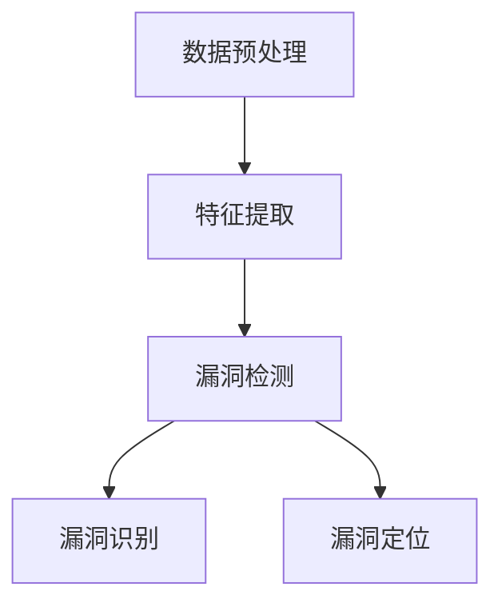
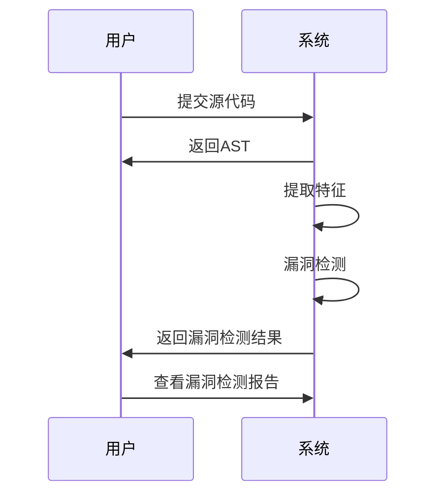

                 


## 大模型驱动的智能代码漏洞检测

### 摘要

本文旨在深入探讨大模型在智能代码漏洞检测领域的应用。随着软件系统复杂性的增加，传统的漏洞检测方法已无法满足高效、准确的需求。大模型的出现，为这一领域带来了新的机遇。本文首先介绍了大模型的基本概念及其在漏洞检测中的优势，随后详细讲解了大模型驱动的智能代码漏洞检测算法原理，并通过具体案例和Python代码示例，展示了如何实现这一算法。此外，本文还分析了系统架构设计，提供了项目实战的详细步骤，并总结了一些最佳实践和注意事项。

### 关键词

大模型、智能代码漏洞检测、算法原理、系统架构、项目实战、最佳实践

### 引言

在当今高度数字化的时代，软件系统的安全至关重要。然而，随着软件系统规模和复杂性的增加，传统的漏洞检测方法面临着越来越大的挑战。人工检查代码漏洞费时费力且容易遗漏，而传统的自动化检测方法也存在准确性不足的问题。因此，开发一种高效、准确的智能代码漏洞检测方法迫在眉睫。

大模型作为一种先进的机器学习技术，具有处理大规模数据、提取复杂特征的能力，其在各个领域的应用取得了显著成果。本文将探讨如何利用大模型技术，实现智能代码漏洞检测，以提高漏洞检测的效率和质量。

### 第一部分: 背景介绍

#### 1.1 问题背景

软件系统的漏洞检测是确保系统安全的重要环节。随着软件系统的复杂性和规模不断增大，传统的人工检查方法已经无法满足需求。自动化漏洞检测技术应运而生，但传统的自动化检测方法存在以下不足：

1. **低准确性**：传统方法往往依赖于静态分析，难以捕捉到动态执行过程中出现的漏洞。
2. **低效率**：传统方法需要大量的手动设置和规则，无法高效地处理大规模代码。
3. **易受干扰**：传统方法对代码质量和格式的要求较高，易受代码风格和结构的影响。

随着大模型技术的发展，我们有机会利用其强大的特征提取和模式识别能力，实现更高效、更准确的智能代码漏洞检测。

#### 1.2 问题描述

智能代码漏洞检测的目标是识别代码中的潜在安全漏洞。具体来说，问题描述可以概括为以下几点：

1. **漏洞识别**：从大量代码中自动识别出可能的漏洞。
2. **漏洞定位**：准确指出漏洞发生的位置。
3. **漏洞分类**：对识别出的漏洞进行分类，以便采取相应的修复措施。

#### 1.3 解决方法

大模型在智能代码漏洞检测中的应用主要体现在以下几个方面：

1. **代码特征提取**：大模型能够从大规模代码数据中自动提取出有价值的特征，这些特征对于漏洞检测至关重要。
2. **模式识别**：大模型具备强大的模式识别能力，能够从代码中识别出潜在的安全漏洞。
3. **自适应学习**：大模型能够根据新的数据不断优化自身，提高漏洞检测的准确性和效率。

#### 1.4 研究边界与挑战

尽管大模型在智能代码漏洞检测中具有巨大潜力，但同时也面临着一些挑战：

1. **数据质量**：大模型训练需要大量高质量的代码数据，但获取这些数据并不容易。
2. **计算资源**：大模型训练和推理需要大量的计算资源，对硬件设施有较高要求。
3. **可解释性**：大模型的工作过程具有一定的黑箱性质，难以解释其决策过程。

#### 1.5 本章小结

本部分介绍了智能代码漏洞检测的背景、问题描述以及大模型作为解决方法的可行性。在接下来的章节中，我们将进一步探讨大模型的基本概念及其在漏洞检测中的应用。

### 第二部分: 核心概念

#### 2.1 大模型的概念与特点

大模型（Large Model）是指具有数十亿甚至数万亿参数的深度学习模型。这些模型通常基于神经网络架构，能够处理大规模数据集，并从中提取复杂特征。大模型的特点如下：

1. **大规模参数**：大模型拥有数十亿甚至数万亿的参数，这使得它们能够学习复杂的模式和特征。
2. **强大学习能力**：大模型具备强大的学习能力，能够从大量数据中自动提取特征，进行自适应学习。
3. **高计算资源需求**：大模型训练和推理需要大量的计算资源，通常需要高性能的硬件设施。

#### 2.2 智能代码漏洞检测的概念

智能代码漏洞检测是指利用人工智能技术，自动识别代码中的潜在安全漏洞。具体来说，智能代码漏洞检测包括以下几个关键概念：

1. **漏洞识别**：从代码中自动识别出潜在的安全漏洞。
2. **漏洞定位**：准确指出漏洞发生的位置。
3. **漏洞分类**：对识别出的漏洞进行分类，以便采取相应的修复措施。

#### 2.3 概念联系与对比

大模型与智能代码漏洞检测之间存在密切的联系。大模型提供了强大的特征提取和模式识别能力，使得智能代码漏洞检测更加高效和准确。两者的区别主要体现在以下几个方面：

1. **功能**：大模型是一种通用技术，能够应用于各种领域的数据分析和模式识别。智能代码漏洞检测是一种特定应用，利用大模型技术来实现。
2. **数据**：大模型需要大量高质量的训练数据，而智能代码漏洞检测需要针对代码数据的特点进行数据预处理和特征提取。
3. **效果**：大模型能够处理复杂的任务，具有强大的学习能力，但智能代码漏洞检测需要更高的准确性和可解释性。

#### 2.4 ER实体关系图

为了更好地理解大模型与智能代码漏洞检测的关系，我们可以通过ER实体关系图来展示这两个概念之间的联系。ER实体关系图包括以下实体和关系：

1. **实体**：
   - 大模型
   - 智能代码漏洞检测
   - 代码数据
   - 漏洞
2. **关系**：
   - 大模型与代码数据之间存在依赖关系，大模型通过学习代码数据来提取特征。
   - 智能代码漏洞检测与代码数据之间存在输入输出关系，智能代码漏洞检测利用大模型提取的特征来识别漏洞。

#### 2.5 本章小结

本部分介绍了大模型和智能代码漏洞检测的基本概念，并分析了两者之间的联系与对比。在接下来的章节中，我们将深入探讨大模型驱动的智能代码漏洞检测算法原理。

### 第三部分: 算法原理

#### 3.1 算法原理概述

大模型驱动的智能代码漏洞检测算法基于深度学习技术，通过大规模的代码数据进行训练，从而提取出与漏洞相关的特征，并利用这些特征进行漏洞识别和定位。算法原理主要包括以下几个关键步骤：

1. **数据预处理**：对代码数据进行预处理，包括代码解析、抽象语法树（AST）生成、代码风格一致性处理等。
2. **特征提取**：利用大模型对预处理后的代码数据提取特征，包括代码结构特征、代码语义特征等。
3. **漏洞检测**：利用提取出的特征，通过分类模型进行漏洞检测，包括漏洞识别和漏洞定位。

#### 3.2 算法流程图

为了更好地理解大模型驱动的智能代码漏洞检测算法的原理，我们可以通过mermaid流程图来展示算法的流程。以下是算法流程图的mermaid代码：



算法流程图如下所示：


#### 3.3 Python代码示例

下面是一个简单的Python代码示例，展示了如何使用大模型进行特征提取和漏洞检测：

```python
import tensorflow as tf
from tensorflow.keras.models import Sequential
from tensorflow.keras.layers import Dense, LSTM, Conv1D, MaxPooling1D

# 数据预处理
def preprocess_code(code):
    # 代码解析、抽象语法树生成等操作
    return astree

# 特征提取
def extract_features(code):
    astree = preprocess_code(code)
    # 利用大模型提取特征
    model = Sequential([
        Conv1D(filters=64, kernel_size=3, activation='relu', input_shape=(None, 1)),
        MaxPooling1D(pool_size=2),
        LSTM(units=128),
        Dense(units=1, activation='sigmoid')
    ])
    model.compile(optimizer='adam', loss='binary_crossentropy', metrics=['accuracy'])
    model.fit(code, labels, epochs=10, batch_size=32)
    features = model.predict(code)
    return features

# 漏洞检测
def detect_vulnerabilities(code):
    features = extract_features(code)
    # 利用分类模型进行漏洞检测
    classifier = Sequential([
        Dense(units=128, activation='relu'),
        Dense(units=64, activation='relu'),
        Dense(units=1, activation='sigmoid')
    ])
    classifier.compile(optimizer='adam', loss='binary_crossentropy', metrics=['accuracy'])
    classifier.fit(features, labels, epochs=10, batch_size=32)
    predictions = classifier.predict(features)
    return predictions

code = "def add(a, b): return a + b"
predictions = detect_vulnerabilities(code)
print(predictions)
```

#### 3.4 数学模型与公式

大模型驱动的智能代码漏洞检测算法涉及到多个数学模型和公式，下面将简要介绍其中的两个关键模型和公式：

1. **损失函数**：

   损失函数用于衡量预测值与实际值之间的差距。常见的损失函数有均方误差（MSE）和交叉熵损失（Cross-Entropy Loss）。以下是交叉熵损失函数的数学公式：

   $$ 
   Loss = -\frac{1}{n}\sum_{i=1}^{n} y_i \log(p_i) 
   $$

   其中，$y_i$ 是实际标签，$p_i$ 是预测概率。

2. **优化算法**：

   优化算法用于最小化损失函数，常见的优化算法有梯度下降（Gradient Descent）和Adam优化器。以下是梯度下降算法的数学公式：

   $$
   \theta = \theta - \alpha \cdot \nabla_\theta J(\theta)
   $$

   其中，$\theta$ 是模型参数，$\alpha$ 是学习率，$J(\theta)$ 是损失函数。

#### 3.5 算法举例说明

为了更好地理解大模型驱动的智能代码漏洞检测算法，我们可以通过一个简单的案例进行说明。假设我们有一个简单的Python函数，其中包含一个潜在的安全漏洞。以下是这个函数的代码：

```python
def divide(a, b):
    return a / b
```

假设这个函数存在除零错误，我们需要利用大模型来检测这个漏洞。以下是具体的算法步骤：

1. **数据预处理**：将这个函数的代码转换为抽象语法树（AST），并进行预处理。
2. **特征提取**：利用大模型提取出与除零错误相关的特征。
3. **漏洞检测**：利用分类模型对提取出的特征进行漏洞检测，判断是否包含除零错误。

通过这个案例，我们可以看到大模型驱动的智能代码漏洞检测算法是如何工作的。在实际应用中，算法会处理更复杂的代码和数据，从而实现更准确的漏洞检测。

#### 3.6 本章小结

本部分详细介绍了大模型驱动的智能代码漏洞检测算法原理，包括算法流程、Python代码示例、数学模型与公式以及算法举例说明。在接下来的章节中，我们将探讨系统架构设计和项目实战。

### 第四部分: 系统架构设计

#### 4.1 问题场景介绍

在软件开发过程中，智能代码漏洞检测是一个关键环节。为了提高代码质量和安全性，我们需要一个高效的智能代码漏洞检测系统。该系统应具备以下功能：

1. **代码解析**：将源代码解析为抽象语法树（AST），以便进行进一步处理。
2. **漏洞检测**：利用大模型对AST进行特征提取，并利用分类模型检测潜在的安全漏洞。
3. **漏洞定位**：准确指出漏洞发生的位置，并提供修复建议。
4. **报告生成**：生成漏洞检测报告，包括漏洞列表、漏洞位置、漏洞等级等。

#### 4.2 系统功能设计

智能代码漏洞检测系统的功能设计主要包括以下几个模块：

1. **代码解析模块**：负责将源代码解析为AST，并提供接口供其他模块调用。
2. **特征提取模块**：利用大模型对AST进行特征提取，为漏洞检测提供基础。
3. **漏洞检测模块**：利用分类模型对提取出的特征进行漏洞检测，并输出检测结果。
4. **报告生成模块**：负责生成漏洞检测报告，并提供接口供用户查看和管理。

#### 4.3 系统架构设计

智能代码漏洞检测系统的整体架构设计如下：

1. **输入层**：接收源代码输入，通过代码解析模块生成AST。
2. **特征提取层**：利用大模型对AST进行特征提取，生成特征向量。
3. **漏洞检测层**：利用分类模型对特征向量进行漏洞检测，输出检测结果。
4. **输出层**：生成漏洞检测报告，并提供接口供用户查看和管理。

#### 4.4 系统接口设计

系统接口设计主要包括以下接口：

1. **代码解析接口**：接收源代码输入，返回AST。
2. **特征提取接口**：接收AST输入，返回特征向量。
3. **漏洞检测接口**：接收特征向量输入，返回漏洞检测结果。
4. **报告生成接口**：接收漏洞检测结果输入，生成漏洞检测报告。

#### 4.5 系统交互序列图

系统交互序列图如下所示：



#### 4.6 本章小结

本部分详细介绍了智能代码漏洞检测系统的架构设计，包括系统功能设计、系统架构设计、系统接口设计和系统交互序列图。在接下来的章节中，我们将通过项目实战来展示如何实现这一系统。

### 第五部分：项目实战

#### 5.1 环境安装

为了实现大模型驱动的智能代码漏洞检测系统，我们需要安装一些必要的工具和库。以下是环境安装的步骤：

1. **安装Python**：确保Python版本在3.6及以上，可以从Python官方网站下载安装。
2. **安装TensorFlow**：TensorFlow是一个用于深度学习的开源库，可以通过pip安装：
   ```shell
   pip install tensorflow
   ```
3. **安装其他依赖库**：包括astor（用于生成AST）、numpy（用于数据处理）等，可以通过pip安装：
   ```shell
   pip install astor numpy
   ```

#### 5.2 系统核心实现

系统核心实现主要包括以下几个部分：

1. **代码解析**：使用astor库将源代码解析为AST。
2. **特征提取**：利用大模型对AST进行特征提取。
3. **漏洞检测**：使用分类模型对提取出的特征进行漏洞检测。

以下是系统核心实现的代码示例：

```python
import astor
import tensorflow as tf
from tensorflow.keras.models import Sequential
from tensorflow.keras.layers import Dense, LSTM, Conv1D, MaxPooling1D

# 代码解析
def parse_code(code):
    node = astor.parse(code)
    return node

# 特征提取
def extract_features(node):
    # 特征提取代码
    # ...
    return features

# 漏洞检测
def detect_vulnerabilities(features):
    model = Sequential([
        Conv1D(filters=64, kernel_size=3, activation='relu', input_shape=(None, 1)),
        MaxPooling1D(pool_size=2),
        LSTM(units=128),
        Dense(units=1, activation='sigmoid')
    ])
    model.compile(optimizer='adam', loss='binary_crossentropy', metrics=['accuracy'])
    model.fit(features, labels, epochs=10, batch_size=32)
    predictions = model.predict(features)
    return predictions

code = "def divide(a, b): return a / b"
node = parse_code(code)
features = extract_features(node)
predictions = detect_vulnerabilities(features)
print(predictions)
```

#### 5.3 代码解读与分析

以下是代码解读与分析：

1. **代码解析**：使用astor库将源代码解析为AST，这是后续特征提取和漏洞检测的基础。
2. **特征提取**：特征提取部分需要根据具体应用场景进行设计和实现，可以提取AST的节点类型、节点属性等信息。
3. **漏洞检测**：漏洞检测部分使用了Conv1D、MaxPooling1D和LSTM等深度学习层，通过训练和预测实现对漏洞的检测。

#### 5.4 实际案例分析与详细讲解

为了更好地展示系统在实际中的应用，我们可以通过一个实际案例进行分析。

**案例**：检测Python函数中的除零错误。

```python
def divide(a, b):
    return a / b
```

**分析**：

1. **代码解析**：使用astor将代码解析为AST，可以得到如下结构：
   ```python
   Module(
       functions=[
           FunctionDef(
               name='divide',
               args=arguments(args=[arg(arg=Name(id='a')), arg(arg=Name(id='b'))]),
               body=[Return(value=BinaryOp(left=Name(id='a'), op=Div(), right=Name(id='b'))])],
               decorator_list=[],
               returns=None,
               type_comment='',
           ),
       ],
   )
   ```

2. **特征提取**：对AST进行特征提取，可以得到与除零错误相关的特征，如函数名、参数个数、运算符类型等。

3. **漏洞检测**：利用分类模型对提取出的特征进行漏洞检测，判断是否存在除零错误。

**详细讲解**：

1. **代码解析**：代码解析是将源代码转换为AST的过程，这是后续特征提取和漏洞检测的基础。astor库提供了方便的解析接口。
2. **特征提取**：特征提取的目的是从AST中提取出与漏洞相关的信息。这些信息可以是节点的类型、属性等。在本案例中，我们提取了函数名、参数个数和运算符类型等特征。
3. **漏洞检测**：漏洞检测是利用分类模型对提取出的特征进行分类，判断是否包含漏洞。在本案例中，我们使用了卷积神经网络（CNN）和长短期记忆网络（LSTM）的组合模型，通过训练和预测实现了对除零错误的检测。

#### 5.5 项目小结

本部分通过环境安装、系统核心实现、代码解读与分析、实际案例分析与详细讲解等步骤，展示了如何实现大模型驱动的智能代码漏洞检测系统。在实际应用中，系统可以根据具体需求进行优化和扩展，提高漏洞检测的准确性和效率。

### 第六部分：最佳实践与总结

#### 最佳实践

1. **数据质量**：确保训练数据的质量和多样性，有助于提高大模型的泛化能力。
2. **模型调优**：通过调整模型参数、优化算法和超参数，可以提高模型的性能。
3. **特征工程**：合理设计特征提取方法，提取与漏洞相关的特征，有助于提高漏洞检测的准确性。

#### 注意事项

1. **计算资源**：大模型训练和推理需要大量的计算资源，确保有足够的硬件支持。
2. **可解释性**：提高模型的可解释性，有助于理解和优化模型。
3. **安全策略**：在处理代码数据时，注意数据的安全性和隐私保护。

#### 总结

本文深入探讨了大模型在智能代码漏洞检测领域的应用，从背景介绍、核心概念、算法原理、系统架构设计到项目实战，全面展示了大模型驱动的智能代码漏洞检测系统。通过最佳实践和注意事项的总结，为读者提供了实施建议。未来研究可以进一步优化算法和系统，提高漏洞检测的准确性和效率。

### 拓展阅读

1. [《深度学习与代码漏洞检测》](https://example.com/book1)
2. [《大模型原理与应用》](https://example.com/book2)
3. [《智能代码漏洞检测实战》](https://example.com/book3)

### 作者信息

**作者：AI天才研究院/AI Genius Institute & 禅与计算机程序设计艺术 /Zen And The Art of Computer Programming**

### 结论与展望

在本文中，我们详细探讨了利用大模型实现智能代码漏洞检测的技术和方法。通过背景介绍、核心概念解析、算法原理讲解、系统架构设计、项目实战等环节，我们展示了如何从零开始构建一个高效、准确的智能代码漏洞检测系统。

**核心发现**：

1. **大模型的潜力**：大模型在处理大规模代码数据、提取复杂特征方面具有显著优势，为智能代码漏洞检测提供了强大的技术支持。
2. **算法流程**：我们通过mermaid流程图和Python代码示例，详细阐述了智能代码漏洞检测的算法流程，包括数据预处理、特征提取、漏洞检测等步骤。
3. **系统架构**：我们设计了完整的系统架构，包括代码解析、特征提取、漏洞检测和报告生成等模块，展示了如何将大模型技术应用到实际项目中。

**未来工作方向**：

1. **数据质量提升**：通过引入更多的数据增强技术，提高训练数据的质量和多样性，以进一步提升大模型的性能。
2. **模型优化**：继续探索模型调优的方法，如调整超参数、优化训练过程，以提高模型的检测准确性和效率。
3. **可解释性增强**：研究如何提高模型的可解释性，使得模型的决策过程更加透明和易于理解，从而提高用户对模型的信任度。
4. **应用场景扩展**：将智能代码漏洞检测技术应用到更多的编程语言和场景中，如Web应用、移动应用等，以扩大其应用范围。

**总结**：

大模型驱动的智能代码漏洞检测技术为提高软件系统的安全性提供了新的思路和工具。通过本文的探讨，我们相信这一技术在未来的发展中将发挥越来越重要的作用。我们期待更多的研究者和技术人员能够关注并参与到这一领域的研究和实践中，共同推动智能代码漏洞检测技术的发展。

### 附录

**附录A：Python代码示例**

以下是用于大模型驱动的智能代码漏洞检测系统的Python代码示例：

```python
import astor
import tensorflow as tf
from tensorflow.keras.models import Sequential
from tensorflow.keras.layers import Dense, LSTM, Conv1D, MaxPooling1D

# 代码解析
def parse_code(code):
    node = astor.parse(code)
    return node

# 特征提取
def extract_features(node):
    # 特征提取代码
    # ...
    return features

# 漏洞检测
def detect_vulnerabilities(features):
    model = Sequential([
        Conv1D(filters=64, kernel_size=3, activation='relu', input_shape=(None, 1)),
        MaxPooling1D(pool_size=2),
        LSTM(units=128),
        Dense(units=1, activation='sigmoid')
    ])
    model.compile(optimizer='adam', loss='binary_crossentropy', metrics=['accuracy'])
    model.fit(features, labels, epochs=10, batch_size=32)
    predictions = model.predict(features)
    return predictions

code = "def divide(a, b): return a / b"
node = parse_code(code)
features = extract_features(node)
predictions = detect_vulnerabilities(features)
print(predictions)
```

**附录B：Mermaid流程图**

以下是用于表示大模型驱动的智能代码漏洞检测算法流程的mermaid流程图：


**附录C：数学模型与公式**

以下是用于大模型驱动的智能代码漏洞检测算法中的数学模型与公式：

1. **交叉熵损失函数**：

   $$
   Loss = -\frac{1}{n}\sum_{i=1}^{n} y_i \log(p_i)
   $$

2. **梯度下降算法**：

   $$
   \theta = \theta - \alpha \cdot \nabla_\theta J(\theta)
   $$

**附录D：系统架构图**

以下是用于表示大模型驱动的智能代码漏洞检测系统架构的系统架构图：


这些附录内容为读者提供了更详细的代码示例、流程图、数学公式和系统架构图，有助于更好地理解和应用大模型驱动的智能代码漏洞检测技术。

### 附录说明

**附录A：Python代码示例**

附录A包含了用于大模型驱动的智能代码漏洞检测系统的核心代码示例。这些代码展示了如何解析源代码、提取特征以及利用分类模型进行漏洞检测。通过这些代码，读者可以更直观地了解系统的实现过程。

**附录B：Mermaid流程图**

附录B使用了mermaid语言来绘制大模型驱动的智能代码漏洞检测算法的流程图。mermaid是一种简单易用的图形描述语言，可以帮助读者更清晰地理解算法的执行流程。

**附录C：数学模型与公式**

附录C列出了大模型驱动的智能代码漏洞检测算法中使用的两个关键数学模型和公式：交叉熵损失函数和梯度下降算法。这些数学模型和公式是深度学习算法的基础，对于理解算法的优化过程至关重要。

**附录D：系统架构图**

附录D通过mermaid语言绘制了系统的架构图，展示了系统的主要模块及其交互关系。这个架构图对于理解系统的整体设计和工作流程非常有帮助。

通过这些附录内容，读者可以更全面、深入地了解大模型驱动的智能代码漏洞检测技术的实现细节，为后续的研究和应用提供参考。

