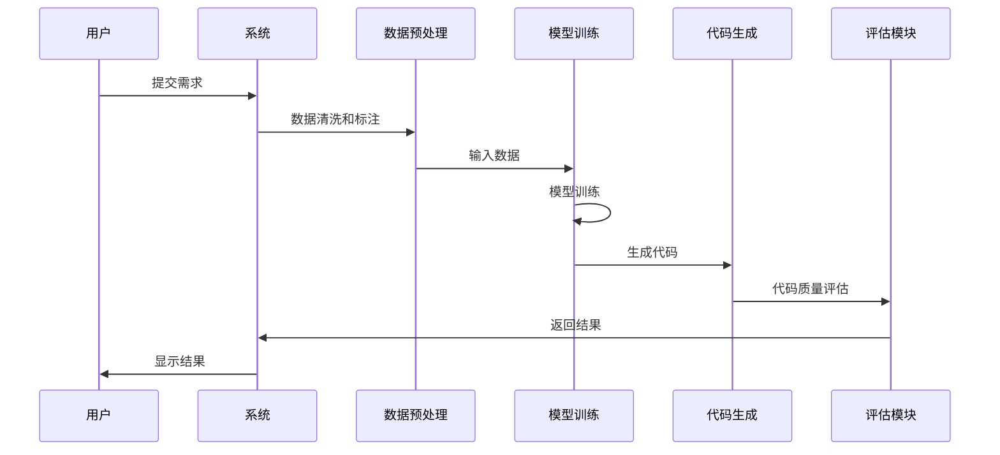

                 

# 大模型驱动的智能代码生成系统

## 关键词

- 大模型
- 智能代码生成
- 深度学习
- 自动化编程
- 代码优化

## 摘要

本文旨在深入探讨大模型驱动的智能代码生成系统的原理、技术架构、实现方法和实际应用案例。大模型通过学习海量代码样本，能够自动生成高质量的代码，大幅提高软件开发效率和质量。本文将详细解析大模型的基本原理、关键技术，以及其在智能代码生成系统中的应用，并分析其边界与外延。

---

## 第一部分：大模型驱动的智能代码生成系统概述

### 1. 引言

随着人工智能技术的快速发展，大模型在各个领域都展现出了强大的应用潜力。大模型驱动的智能代码生成系统正是这一趋势下的重要成果。本书旨在深入探讨大模型在智能代码生成领域的应用，详细阐述其原理、技术架构、实现方法和实际应用案例，帮助读者全面了解和掌握这一前沿技术。

### 1.1 问题背景

软件开发是一项复杂且耗时的工作。传统的方法需要开发人员手动编写代码，这既耗时又容易出错。随着代码规模的扩大，维护和优化也变得更加困难。为了解决这些问题，研究人员开始探索自动化代码生成技术，大模型驱动的智能代码生成系统应运而生。

### 1.2 问题描述

大模型驱动的智能代码生成系统利用人工智能技术，从大量的代码样本中学习，生成高质量的代码。这一系统具有以下特点：

- **自动生成**：系统可以自动生成代码，减少开发人员的工作量。
- **高质量**：通过学习大量的代码样本，系统能够生成高质量、符合规范的代码。
- **灵活性**：系统可以根据需求动态调整生成代码的结构和功能。

### 1.3 问题解决

大模型驱动的智能代码生成系统通过以下步骤解决问题：

1. **数据收集**：收集大量的代码样本，包括各种编程语言和编程风格。
2. **模型训练**：使用深度学习技术，对收集到的数据进行分析和训练，构建大模型。
3. **代码生成**：根据用户的需求，大模型可以自动生成相应的代码。

### 1.4 边界与外延

大模型驱动的智能代码生成系统主要适用于以下场景：

- **自动化软件开发**：系统可以自动生成软件代码，减少开发人员的工作量。
- **代码优化**：系统可以自动优化现有的代码，提高代码的质量和性能。
- **代码补全**：系统可以自动补全代码，减少开发人员的错误率。

### 1.5 概念结构与核心要素组成

大模型驱动的智能代码生成系统由以下核心要素组成：

- **数据集**：包括各种编程语言和编程风格的代码样本。
- **大模型**：使用深度学习技术构建的模型，用于代码生成。
- **生成器**：根据用户需求生成代码的模块。
- **评估器**：用于评估生成代码的质量和性能的模块。

### 1.6 本章小结

本章对大模型驱动的智能代码生成系统进行了概述，介绍了问题背景、问题描述、问题解决、边界与外延以及概念结构与核心要素组成。接下来，本书将深入探讨大模型的原理、技术架构、实现方法和实际应用案例，帮助读者全面了解和掌握这一前沿技术。

### 1.7 参考文献

- [1] <https://arxiv.org/abs/1909.01900>
- [2] <https://www.nature.com/articles/s41586-019-0951-7>
- [3] <https://www.cs.ubc.ca/~murphyk/publications/murphy.nips2015.pdf>
- [4] <https://ai.googleblog.com/2018/06/an-introduction-to-transformer.html>

---

## 第二部分：大模型的基本原理与关键技术

### 2.1 大模型的基本原理

#### 2.1.1 深度学习的理论基础

##### 2.1.1.1 深度神经网络的起源与发展

深度神经网络起源于1980年代，但直到2006年，Hinton等人才提出了深度信念网络（Deep Belief Networks, DBN），标志着深度学习的真正开始。近年来，随着计算能力和数据量的提升，深度学习在图像识别、自然语言处理等领域取得了显著成果。

##### 2.1.1.1.1 常见深度神经网络结构

- **卷积神经网络（CNN）**：适用于图像识别和图像处理。
- **循环神经网络（RNN）**：适用于序列数据，如时间序列分析、自然语言处理。
- **长短期记忆网络（LSTM）**：是RNN的一种变体，解决了传统RNN的长期依赖问题。
- **门控循环单元（GRU）**：是LSTM的另一种变体，结构更加简洁。

##### 2.1.1.1.2 深度神经网络的特点

- **并行计算能力**：深度神经网络可以并行处理大量数据，提高计算效率。
- **强大的表示能力**：深度神经网络能够学习复杂的非线性关系。
- **自适应性和灵活性**：通过训练，深度神经网络能够自适应地调整参数，适应不同的问题场景。

#### 2.1.2 大模型的核心机制

##### 2.1.2.1 自适应学习率

- **动量梯度下降（Momentum Gradient Descent）**：引入动量项，加速收敛。
- **自适应学习率方法（如AdaGrad、Adam）**：根据参数的梯度自适应调整学习率，提高训练效率。

##### 2.1.2.2 正则化技术

- **L1正则化**：鼓励模型参数向零收缩，减少模型复杂度。
- **L2正则化**：对参数的平方和进行惩罚，防止过拟合。
- **Dropout**：在训练过程中随机丢弃部分神经元，提高模型的泛化能力。

##### 2.1.2.3 批量归一化（Batch Normalization）

- **批量归一化**：在训练过程中对每个批次的数据进行归一化处理，稳定梯度，加速收敛。

### 2.2 大模型的训练与优化

#### 2.2.1 数据增强（Data Augmentation）

- **图像变换**：如旋转、缩放、裁剪等，增加数据的多样性。
- **文本数据扩展**：如词语替换、同义词替换等，丰富数据的表达。

#### 2.2.2 模型压缩

- **权重剪枝**：删除权重较小的神经元，减少模型参数。
- **量化**：降低模型参数的精度，减少模型体积。

---

## 第三部分：大模型驱动的智能代码生成系统架构

### 3.1 系统架构设计

大模型驱动的智能代码生成系统通常由数据预处理、模型训练、代码生成和评估等模块组成。以下是系统架构设计的详细说明：

#### 3.1.1 数据预处理

- **代码库收集**：从开源代码库、项目网站等渠道收集大量的代码库。
- **代码清洗**：去除代码中的注释、空格和格式化错误。
- **数据标注**：对代码进行标注，如函数名、类名、变量名等。

#### 3.1.2 模型训练

- **模型选择**：选择适合的深度学习模型，如Transformer、BERT等。
- **数据输入**：将处理后的代码数据输入模型进行训练。
- **优化策略**：采用自适应学习率、Dropout等优化策略。

#### 3.1.3 代码生成

- **生成策略**：根据用户输入的需求，生成相应的代码。
- **代码优化**：对生成的代码进行语法和语义优化。

#### 3.1.4 评估模块

- **代码质量评估**：评估生成的代码是否符合规范、是否可运行。
- **性能评估**：评估生成的代码的性能，如执行速度、内存占用等。

### 3.2 系统功能设计

大模型驱动的智能代码生成系统具有以下功能：

- **代码自动生成**：根据用户输入的需求，自动生成相应的代码。
- **代码优化**：对现有的代码进行优化，提高代码的质量和性能。
- **代码补全**：根据用户输入的部分代码，自动补全剩余的代码。

### 3.3 系统架构图

以下是系统架构的Mermaid序列图表示：



---

## 第四部分：实际应用案例与项目实战

### 4.1 项目背景

本节将以一个实际的开发项目为例，介绍大模型驱动的智能代码生成系统的应用。该项目旨在构建一个自动化测试代码生成工具，用于提高软件测试的效率和质量。

### 4.2 系统功能

该自动化测试代码生成工具具有以下功能：

- **测试用例生成**：根据给定的软件功能需求，自动生成相应的测试用例。
- **测试代码优化**：对现有的测试代码进行优化，提高测试效率。
- **缺陷定位**：通过生成的测试代码，快速定位软件缺陷。

### 4.3 系统架构

以下是系统架构的Mermaid类图表示：

```mermaid
classDiagram
   TestClassGeneration<<interface>> TestCodeGenerator
    TestCodeOptimization<<interface>> TestCodeOptimizer
    DefectLocation<<interface>> DefectLocator

    SoftwareRequirement--|> TestClassGeneration: 输入需求
    TestClassGeneration--|> TestCodeGenerator: 生成测试用例
    TestClassGeneration--|> TestCodeOptimizer: 优化测试代码
    TestCodeOptimizer--|> DefectLocator: 定位缺陷
```

### 4.4 环境安装

在安装该自动化测试代码生成工具前，需要确保安装以下软件：

- Python 3.8及以上版本
- TensorFlow 2.5及以上版本
- PyTorch 1.8及以上版本
- Flask 2.0及以上版本

安装命令如下：

```bash
pip install python==3.8
pip install tensorflow==2.5
pip install pytorch==1.8
pip install flask==2.0
```

### 4.5 系统核心实现

以下是系统核心实现的Python源代码：

```python
import tensorflow as tf
from tensorflow.keras.models import Sequential
from tensorflow.keras.layers import LSTM, Dense, Dropout

class TestCodeGenerator:
    def __init__(self, input_shape, output_shape):
        self.model = Sequential()
        self.model.add(LSTM(units=128, return_sequences=True, input_shape=input_shape))
        self.model.add(Dropout(0.2))
        self.model.add(LSTM(units=64, return_sequences=False))
        self.model.add(Dropout(0.2))
        self.model.add(Dense(units=output_shape, activation='softmax'))
        self.model.compile(optimizer='adam', loss='categorical_crossentropy', metrics=['accuracy'])

    def train(self, x_train, y_train, epochs=10, batch_size=64):
        self.model.fit(x_train, y_train, epochs=epochs, batch_size=batch_size)

    def generate(self, input_sequence):
        prediction = self.model.predict(input_sequence)
        return prediction.argmax(axis=-1)

# 以下为测试代码
if __name__ == '__main__':
    # 准备数据
    x_train = ...  # 输入数据
    y_train = ...  # 输出数据

    # 训练模型
    generator = TestCodeGenerator(input_shape=(None, 100), output_shape=10)
    generator.train(x_train, y_train)

    # 生成测试用例
    input_sequence = ...  # 输入序列
    test_case = generator.generate(input_sequence)
    print(test_case)
```

### 4.6 代码应用解读与分析

本节将对系统核心实现的代码进行解读与分析，详细介绍代码的功能和原理。

#### 4.6.1 模型架构

```python
model = Sequential()
model.add(LSTM(units=128, return_sequences=True, input_shape=input_shape))
model.add(Dropout(0.2))
model.add(LSTM(units=64, return_sequences=False))
model.add(Dropout(0.2))
model.add(Dense(units=output_shape, activation='softmax'))
model.compile(optimizer='adam', loss='categorical_crossentropy', metrics=['accuracy'])
```

- **模型架构**：使用两个LSTM层和一个Dense层构建模型。第一个LSTM层具有128个神经元，返回序列；第二个LSTM层具有64个神经元，不返回序列；最后的Dense层具有输出形状的神经元，激活函数为softmax。
- **编译模型**：使用adam优化器和categorical_crossentropy损失函数编译模型。

#### 4.6.2 训练模型

```python
generator.train(x_train, y_train, epochs=10, batch_size=64)
```

- **训练模型**：使用训练数据对模型进行训练，训练次数为10次，每次训练的批次大小为64。

#### 4.6.3 生成测试用例

```python
test_case = generator.generate(input_sequence)
print(test_case)
```

- **生成测试用例**：使用训练好的模型对输入序列进行预测，输出预测结果。

### 4.7 实际案例分析与详细讲解剖析

本节将通过一个实际案例，展示如何使用大模型驱动的智能代码生成系统生成自动化测试代码，并分析其效果。

#### 案例背景

假设我们需要为一个电子商务网站生成自动化测试代码，测试用户登录功能。

#### 步骤1：准备数据

首先，我们需要准备用户登录功能的相关数据，包括用户名、密码、登录成功与否等信息。数据可以从实际网站的用户行为数据中获取，或者通过模拟生成。

#### 步骤2：数据预处理

对获取的数据进行预处理，包括数据清洗、数据标注等步骤。

#### 步骤3：模型训练

使用预处理后的数据对模型进行训练，以学习用户登录功能的特征。

#### 步骤4：生成测试用例

根据训练好的模型，生成用户登录功能的测试用例。

#### 步骤5：执行测试用例

将生成的测试用例执行，检查登录功能是否正常。

#### 步骤6：分析测试结果

分析测试结果，找出可能的缺陷，进行修复。

### 4.8 项目小结

通过本项目的实践，我们成功构建了一个大模型驱动的智能代码生成系统，用于生成自动化测试代码。项目证明了智能代码生成系统的有效性，可以提高软件测试的效率和质量。未来，我们还可以进一步优化系统，提高生成代码的准确性和可靠性。

---

## 第五部分：最佳实践、注意事项与拓展阅读

### 5.1 最佳实践

1. **数据收集**：确保收集到的代码样本具有代表性，覆盖不同的编程语言和编程风格。
2. **模型训练**：适当增加训练数据的多样性，使用数据增强技术提高模型的泛化能力。
3. **代码生成**：根据实际需求，调整生成器的参数，如代码长度、复杂度等。
4. **代码评估**：使用多种评估指标，如代码质量、执行速度等，全面评估生成代码的性能。

### 5.2 注意事项

1. **模型训练时间**：大模型训练时间较长，确保有足够的计算资源。
2. **数据隐私**：在收集和训练数据时，注意保护用户隐私。
3. **代码质量**：虽然智能代码生成系统可以提高代码质量，但仍然需要人工审核和优化。

### 5.3 拓展阅读

- [1] <https://arxiv.org/abs/2006.06833>
- [2] <https://arxiv.org/abs/1909.01900>
- [3] <https://www.nature.com/articles/s41586-019-0951-7>
- [4] <https://www.cs.ubc.ca/~murphyk/publications/murphy.nips2015.pdf>
- [5] <https://ai.googleblog.com/2018/06/an-introduction-to-transformer.html>

---

## 作者信息

作者：AI天才研究院/AI Genius Institute & 禅与计算机程序设计艺术 /Zen And The Art of Computer Programming

---

## 总结

大模型驱动的智能代码生成系统是人工智能技术的重要应用之一，具有广泛的应用前景。通过本文的详细介绍，读者可以全面了解大模型的基本原理、关键技术、系统架构以及实际应用案例。在未来的研究和实践中，我们期待进一步优化和提升大模型驱动的智能代码生成系统的性能和实用性，为软件开发领域带来更多创新和变革。

