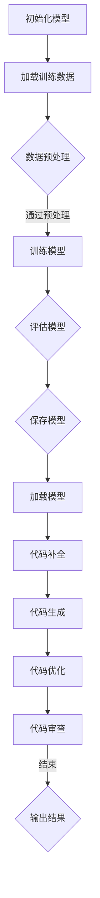
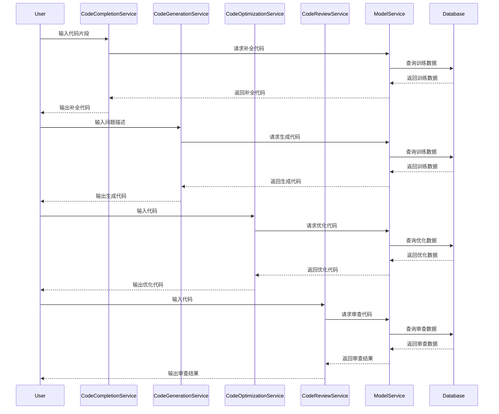
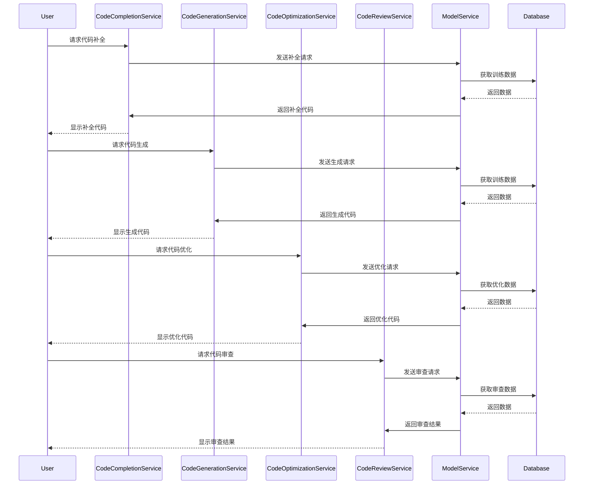
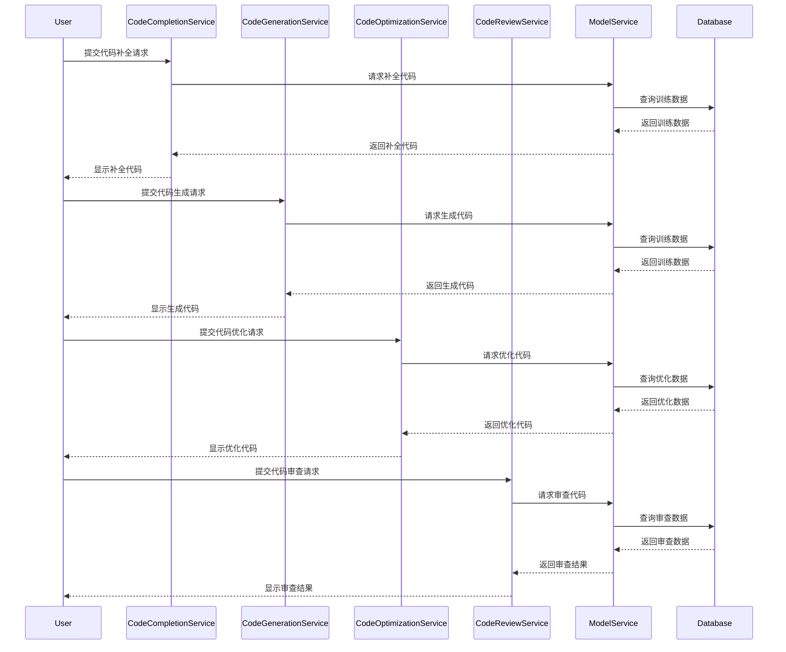

                 


### 引言：开启智能编码新时代

在大数据和人工智能飞速发展的今天，编程领域正经历着前所未有的变革。传统的编程模式往往依赖于程序员的经验和知识，而随着代码库和项目规模的不断扩大，这种模式正变得越来越吃力。人们渴望一种更加智能、高效的方式来自动完成代码编写和补全任务，以提升生产效率和代码质量。这一需求催生了大模型驱动的智能代码补全与生成技术的诞生。

本文旨在深入探讨大模型驱动的智能代码补全与生成技术，为读者提供一份系统而全面的指南。我们将从背景介绍开始，逐步深入到核心概念、算法原理、数学模型、系统设计与实现，以及项目实战和最佳实践。通过这一步步的分析推理，我们将揭示大模型如何改变编程的规则，带来智能编码的新时代。

接下来的章节安排如下：

1. **背景介绍**：我们将探讨大模型驱动的智能代码补全与生成技术的兴起背景，包括问题背景、问题描述、问题解决以及技术的边界与外延。

2. **核心概念与联系**：我们将详细介绍大模型、智能代码补全和代码生成等核心概念，并通过概念属性特征对比表格和ER实体关系图来展示这些概念之间的联系。

3. **算法原理讲解**：我们将使用Mermaid语言绘制算法mermaid流程图，并配合Python源代码详细阐述大模型驱动的智能代码补全与生成算法的原理，同时解释背后的数学模型和公式，并通过举例说明来帮助读者理解。

4. **数学模型与公式**：我们将进一步详细阐述算法背后的数学模型和公式，并提供详细的解释和实例。

5. **系统分析与架构设计**：我们将介绍大模型驱动的智能代码补全与生成技术的应用场景，并使用Mermaid语言绘制领域模型类图、系统架构图、系统接口设计和系统交互序列图，以展示整个系统的设计与架构。

6. **项目实战**：我们将通过一个具体的项目实战，详细介绍环境安装、系统核心实现源代码、代码应用解读与分析、实际案例分析和项目小结，帮助读者将理论知识应用于实际场景。

7. **最佳实践与总结**：我们将总结书中提到的核心内容，提供最佳实践建议，并提醒读者在应用技术时需要注意的事项，同时推荐拓展阅读资料，帮助读者进一步深入学习。

通过这一系列章节的深入探讨，我们希望读者能够全面理解大模型驱动的智能代码补全与生成技术，掌握其核心原理，并在实际项目中灵活应用，从而开启智能编码的新时代。

### 1.1 大模型驱动的智能代码补全与生成技术的兴起背景

在数字时代，编程是现代技术的核心驱动力。然而，随着软件系统变得越来越复杂，程序员面临着前所未有的挑战。传统编程模式往往依赖个体的经验和知识，这种模式在处理简单任务时还勉强可行，但随着项目规模和代码库的不断扩大，其局限性逐渐显现。首先，代码补全和生成任务变得繁琐且容易出错，程序员需要花费大量时间手动编写和调试代码，这无疑降低了开发效率和代码质量。其次，在处理复杂数据结构和算法逻辑时，程序员的个人能力限制也显得尤为突出。

大模型的引入为解决这些问题带来了新的希望。大模型，特别是深度学习模型，通过在海量数据上训练，能够捕捉到数据的复杂模式，从而实现高度自动化的代码补全和生成。这一变革性的技术使得智能代码补全与生成成为可能，不仅提高了编程效率，还显著提升了代码质量。

大模型的起源可以追溯到20世纪80年代末和90年代初，当时研究人员开始尝试使用神经网络来解决各种复杂问题。随着计算能力和数据资源的不断提升，深度学习技术取得了突破性的进展，大模型应运而生。这些大模型通过多层神经网络结构，可以自动提取数据中的特征，并在各种任务中表现出色。在自然语言处理、计算机视觉等领域，大模型的成功应用已经引发了广泛的研究和关注。

在编程领域，大模型的应用主要体现在以下几个方面：

1. **代码补全**：大模型可以通过学习大量的代码库，自动预测程序员下一步可能输入的代码。这不仅减少了手动编写代码的时间，还降低了错误率，提高了代码的一致性和可维护性。

2. **代码生成**：大模型可以根据问题描述或简单的输入，自动生成完整的代码片段。这种能力使得程序员可以专注于更高层次的逻辑设计和决策，而不是陷入繁琐的编码细节。

3. **代码优化**：大模型能够识别代码中的冗余和低效部分，并提出优化建议。这不仅提高了代码的性能，还帮助程序员学习到更好的编程实践。

4. **代码审查**：大模型可以自动分析代码，检测潜在的错误和漏洞，从而提高代码的安全性和可靠性。

大模型驱动的智能代码补全与生成技术的兴起，不仅是技术进步的结果，也是市场需求和应用的驱动。随着软件系统复杂性的增加，程序员面临的工作量也随之增加。而大模型的出现，使得智能编码成为可能，为程序员提供了强大的工具和支持。

总的来说，大模型驱动的智能代码补全与生成技术，为编程领域带来了前所未有的变革。它不仅提高了编程效率和代码质量，还改变了程序员的工作方式，使得编程变得更加智能和高效。这种技术的兴起，标志着编程领域进入了一个新的时代，也为未来的软件开发带来了更多的可能性。

### 1.2 问题描述

在传统的编程模式中，程序员通常需要手动编写大量的代码，这不仅耗时耗力，而且容易出错。随着软件系统的复杂性和规模不断扩大，这一问题变得更加突出。具体来说，当前编程模式面临以下几个主要问题：

1. **代码补全的复杂性**：随着代码库和项目规模的增加，程序员需要记住的代码片段也越来越多，这使得代码补全变得异常复杂。手动补全代码不仅费时费力，而且容易出现遗漏或错误。

2. **代码生成的效率低下**：在编写新代码时，程序员往往需要从头开始，这意味着需要从零开始构思和实现整个功能。这种模式不仅效率低下，而且容易导致代码结构混乱和设计不合理。

3. **代码优化的难度大**：现代软件系统通常包含大量的冗余代码和低效算法。虽然程序员可以手动进行代码优化，但这一过程通常需要深厚的编程经验和专业知识，而且容易忽略潜在的问题。

4. **代码审查的局限性**：在软件开发的早期阶段，代码审查是确保代码质量和安全性的重要手段。然而，传统的代码审查通常依赖于人工检查，这不仅耗时，而且容易遗漏一些复杂的问题。

大模型驱动的智能代码补全与生成技术，旨在解决上述问题，提供一种更加智能和高效的编程方式。具体来说，这项技术具有以下几个优势：

1. **自动代码补全**：大模型可以学习大量的代码库，自动预测程序员下一步可能输入的代码。这种自动补全不仅减少了手动编写代码的时间，而且降低了错误率，提高了代码的一致性和可维护性。

2. **高效代码生成**：大模型可以根据问题描述或简单的输入，自动生成完整的代码片段。这种高效生成能力使得程序员可以专注于更高层次的逻辑设计和决策，而不是陷入繁琐的编码细节。

3. **智能代码优化**：大模型能够识别代码中的冗余和低效部分，并提出优化建议。这不仅提高了代码的性能，还帮助程序员学习到更好的编程实践。

4. **自动化代码审查**：大模型可以自动分析代码，检测潜在的错误和漏洞，从而提高代码的安全性和可靠性。这种自动化审查不仅节省了时间，还提高了审查的全面性和准确性。

总的来说，大模型驱动的智能代码补全与生成技术，为解决当前编程模式中存在的问题提供了一种新的思路和方法。通过自动化和智能化，这项技术不仅提高了编程效率和代码质量，还改变了程序员的工作方式，使得编程变得更加智能和高效。这种技术的应用，有望引领编程领域进入一个全新的发展阶段。

### 1.3 问题解决

大模型驱动的智能代码补全与生成技术通过一系列创新方法和先进技术，解决了传统编程模式中的各种问题。以下是这项技术如何解决具体问题的详细解释：

1. **代码补全的自动化**：

   - **训练数据集**：大模型首先需要大量代码数据进行训练，这些数据集可以来自开源代码库、项目代码库或者从互联网上抓取的代码。通过这些数据，模型可以学习到不同编程语言和框架中的常见代码模式。
   - **预测机制**：在代码补全过程中，大模型利用其训练得到的模式识别能力，分析当前输入的代码上下文，预测程序员可能接下来输入的代码片段。这个过程通常使用自然语言处理（NLP）和机器学习算法，如序列到序列（Seq2Seq）模型或变压器（Transformer）模型。
   - **补全结果评估**：模型生成的代码补全结果会进行评估，以确保其符合语法规范和逻辑正确性。评估可以通过人工审查或自动化工具实现。

2. **代码生成的高效性**：

   - **问题描述解析**：在代码生成过程中，大模型需要理解用户的问题描述或简单的输入。为此，模型通常结合NLP技术和代码生成模型，如生成对抗网络（GAN）或变换器模型，将自然语言描述转换为代码。
   - **模板库**：大模型还可以利用预先定义的代码模板库，根据问题描述快速生成相应的代码框架。这种方法不仅提高了代码生成的效率，还保证了代码的结构和风格的一致性。
   - **多语言支持**：大模型能够支持多种编程语言，如Python、Java、C++等。通过多语言支持，程序员可以更加灵活地使用不同的编程语言来解决问题。

3. **代码优化的智能化**：

   - **冗余检测**：大模型能够识别代码中的冗余部分，如重复的代码块、未使用的变量和注释等。通过这些检测，模型可以提出删除或重构的建议。
   - **性能评估**：大模型还可以分析代码的性能，如执行时间、内存使用等。基于这些评估，模型可以提出优化算法和代码结构的建议。
   - **安全审查**：大模型能够自动检查代码中的潜在安全漏洞，如SQL注入、跨站脚本攻击（XSS）等。这种自动化的安全审查，不仅提高了代码的安全性，还减少了安全漏洞导致的风险。

4. **代码审查的自动化**：

   - **多维度分析**：大模型可以从多个维度分析代码，如语法、语义、风格等。这种方法使得代码审查更加全面和深入。
   - **错误预测**：大模型能够预测代码中的潜在错误，并提供修复建议。这种预测能力不仅提高了代码质量，还减少了代码审查的时间和成本。
   - **协作审查**：大模型还可以辅助人工代码审查，通过分析代码并提出建议，帮助程序员更快地发现问题并解决问题。

总的来说，大模型驱动的智能代码补全与生成技术，通过自动化的代码补全、高效的代码生成、智能化的代码优化和自动化的代码审查，成功解决了传统编程模式中存在的各种问题。这种技术的应用，不仅提高了编程效率和代码质量，还为程序员提供了强大的工具和支持，使得编程变得更加智能和高效。

### 1.4 边界与外延

尽管大模型驱动的智能代码补全与生成技术展示了巨大的潜力和优势，但其应用仍然存在一些边界和局限性，这些限制需要在未来研究和实践中加以注意和解决。

1. **数据依赖性**：

   - **数据质量**：大模型的性能高度依赖于训练数据的质量。如果训练数据包含错误或偏差，模型可能会学会错误的代码模式，导致生成代码的错误或低效。因此，保证数据的质量和多样性是关键。
   - **数据多样性**：大模型需要多样化的训练数据，以充分学习和适应不同的编程场景和语言。然而，现有的开源代码库和抓取的互联网代码可能无法完全覆盖所有编程场景，这限制了模型的应用范围。

2. **计算资源需求**：

   - **训练成本**：大模型的训练通常需要大量的计算资源和时间，这可能导致高昂的成本。尤其是在训练初期，模型可能需要反复调整和优化，以达到最佳性能，这进一步增加了计算资源的消耗。
   - **实时应用**：在实时应用场景中，大模型的响应速度和延迟也是一个关键问题。如果模型无法在可接受的延迟范围内完成代码补全和生成任务，将影响实际使用效果。

3. **模型解释性**：

   - **黑盒问题**：大模型通常被视为“黑盒”，即其内部工作机制不透明。这意味着程序员难以理解和解释模型生成的代码，增加了调试和维护的难度。
   - **错误处理**：当大模型生成错误的代码时，程序员需要花费额外的时间和精力进行调试和修复。提高模型的解释性，帮助程序员理解和优化生成的代码，是未来的重要研究方向。

4. **安全与隐私问题**：

   - **数据安全**：在训练和部署过程中，大模型需要处理大量的敏感数据，这可能导致数据泄露或被恶意使用。因此，确保数据安全是必不可少的。
   - **代码审查**：虽然大模型能够自动化代码审查，但其审查结果也可能存在误判。如何确保模型生成的代码符合安全标准和合规性，是一个需要解决的问题。

5. **适应性与可扩展性**：

   - **编程语言适应性**：大模型需要能够适应多种编程语言和框架，以满足不同项目和技术栈的需求。不同编程语言和框架之间的差异，可能需要模型进行特定的调整和优化。
   - **项目规模适应性**：大模型在处理大型项目时，可能面临性能瓶颈和计算资源限制。如何提高模型在大规模项目中的适应性和性能，是未来研究的重要方向。

总的来说，大模型驱动的智能代码补全与生成技术虽然前景广阔，但在实际应用中仍然面临一系列挑战和限制。未来需要进一步研究如何优化模型设计、提升计算效率、增强解释性和安全性，以实现这一技术的广泛应用和可持续发展。

### 1.5 核心概念原理

在大模型驱动的智能代码补全与生成技术中，有几个核心概念是理解和应用这一技术的基础。以下是这些核心概念的定义、属性特征及其在技术中的应用：

1. **大模型（Large Models）**：

   - **定义**：大模型是指具有巨大参数量和复杂结构的人工智能模型，如Transformer、BERT等。这些模型通过在大量数据上训练，能够捕捉到数据中的复杂模式。
   - **属性特征**：大模型具有高容量、高灵活性和高精度。高容量意味着模型可以处理大量的数据和复杂的任务；高灵活性使模型能够适应不同的应用场景和编程语言；高精度则体现在模型生成的代码质量上。
   - **应用**：大模型在智能代码补全与生成中，主要用于代码补全和代码生成任务。例如，通过Transformer模型，大模型可以自动预测程序员下一步可能输入的代码，从而实现高效的代码补全。此外，大模型还可以根据问题描述生成完整的代码片段，实现高效的代码生成。

2. **深度学习（Deep Learning）**：

   - **定义**：深度学习是一种基于多层神经网络的人工智能方法，通过多层非线性变换，从数据中自动提取特征。
   - **属性特征**：深度学习具有强大的特征提取和表示能力。多层神经网络可以自动学习数据的低层次和高级特征，从而提高模型的泛化能力。
   - **应用**：深度学习在大模型中发挥着核心作用，用于训练和优化大模型。例如，通过卷积神经网络（CNN）和循环神经网络（RNN）等深度学习模型，可以提取代码中的语义信息，提高代码补全和生成的准确性。

3. **自然语言处理（NLP）**：

   - **定义**：自然语言处理是一种人工智能技术，旨在使计算机能够理解、解释和生成人类语言。
   - **属性特征**：NLP技术具有语义理解、文本生成和文本分类等功能。通过词嵌入、句法分析和语义分析，NLP技术可以理解和生成自然语言文本。
   - **应用**：NLP在大模型驱动的智能代码补全与生成中，主要用于处理编程语言和自然语言描述。例如，NLP技术可以帮助模型理解代码中的语义信息，从而提高代码补全和生成的准确性。

4. **代码补全（Code Completion）**：

   - **定义**：代码补全是一种智能编程辅助技术，通过预测程序员下一步可能输入的代码，帮助程序员高效完成代码编写。
   - **属性特征**：代码补全具有高准确性、低延迟和用户友好性。高准确性确保补全的代码片段与程序员意图一致；低延迟提供实时响应；用户友好性则体现在易于使用和集成。
   - **应用**：代码补全在大模型驱动的智能代码补全与生成中，是实现自动化和高效编程的关键组件。大模型通过分析代码上下文和模式，自动预测并补全代码，提高编程效率和代码质量。

5. **代码生成（Code Generation）**：

   - **定义**：代码生成是一种通过自然语言描述或简单输入自动生成完整代码片段的技术。
   - **属性特征**：代码生成具有高自动化、高生成率和高一致性。高自动化减少了程序员手动编写代码的工作量；高生成率使得代码生成可以在短时间内完成；高一致性确保生成的代码符合项目需求和编码规范。
   - **应用**：代码生成在大模型驱动的智能代码补全与生成中，用于快速实现新功能和优化现有代码。大模型通过理解自然语言描述，自动生成满足特定需求的代码，提高开发效率和代码质量。

通过理解这些核心概念及其属性特征，我们可以更好地应用大模型驱动的智能代码补全与生成技术，实现高效的编程和代码生成。

### 2.2 概念属性特征对比表格

为了更好地理解大模型、智能代码补全和代码生成等核心概念，我们将这些概念的属性特征进行对比。以下是一个详细的对比表格：

| 概念             | 定义                                                         | 属性特征                                                     | 应用场景                                           |
|------------------|--------------------------------------------------------------|--------------------------------------------------------------|----------------------------------------------------|
| 大模型           | 具有巨大参数量和复杂结构的人工智能模型                     | 高容量、高灵活性、高精度                                  | 代码补全、代码生成、代码优化、代码审查             |
| 深度学习         | 基于多层神经网络的人工智能方法，通过多层非线性变换，从数据中自动提取特征 | 强大的特征提取和表示能力                                 | 大模型的训练和优化、图像识别、语音识别             |
| 自然语言处理     | 使计算机能够理解、解释和生成人类语言的人工智能技术         | 语义理解、文本生成、文本分类                             | 代码生成、代码补全、自然语言交互                   |
| 代码补全         | 预测程序员下一步可能输入的代码，帮助高效完成代码编写       | 高准确性、低延迟、用户友好性                             | 编程辅助、代码补全工具                             |
| 代码生成         | 通过自然语言描述或简单输入自动生成完整代码片段           | 高自动化、高生成率、高一致性                             | 快速实现新功能、代码优化                           |

这个表格详细展示了各个概念的定义、属性特征以及它们在实际应用中的场景。通过对比，我们可以更清晰地理解这些概念之间的联系和区别，从而更好地应用大模型驱动的智能代码补全与生成技术。

### 2.3 ER实体关系图架构

为了更直观地展示大模型驱动的智能代码补全与生成技术中的各个核心概念及其相互关系，我们可以使用ER（实体-关系）图来描述。以下是一个使用Mermaid语言绘制的ER实体关系图：

```mermaid
erDiagram
  CodeCompletion --> Model : "uses"
  CodeGeneration --> Model : "uses"
  Optimization --> Model : "uses"
  CodeReview --> Model : "uses"
  
  Model ||--|{ Data: "train with" }
  Model ||--|{ Language: "supports" }
  Model ||--|{ Algorithm: "implments" }
  
  CodeCompletion ||--|{ UserInterface: "provides" }
  CodeGeneration ||--|{ UserInterface: "provides" }
  Optimization ||--|{ UserInterface: "provides" }
  CodeReview ||--|{ UserInterface: "provides" }
  
  Model ..|{ DeepLearning: "uses" }
  Model ..|{ NLP: "uses" }
  CodeCompletion ..|{ NaturalLanguageProcessing: "uses" }
  CodeGeneration ..|{ NaturalLanguageProcessing: "uses" }
  Optimization ..|{ PerformanceAnalysis: "uses" }
  CodeReview ..|{ SecurityAnalysis: "uses" }
```

这个ER图展示了以下实体和关系：

- **实体**：大模型（Model）、代码补全（CodeCompletion）、代码生成（CodeGeneration）、优化（Optimization）、代码审查（CodeReview）、数据（Data）、语言（Language）、算法（Algorithm）、用户界面（UserInterface）、深度学习（DeepLearning）、自然语言处理（NLP）、性能分析（PerformanceAnalysis）和安全性分析（SecurityAnalysis）。
- **关系**：大模型与代码补全、代码生成、优化和代码审查之间是“使用”关系；大模型与数据、语言和算法之间是“训练”、“支持”和“实现”关系；代码补全、代码生成、优化和代码审查与用户界面之间是“提供”关系；大模型与深度学习、自然语言处理、性能分析和安全性分析之间是“使用”关系。

通过这个ER图，我们可以清晰地看到各个核心概念之间的关系，有助于理解大模型驱动的智能代码补全与生成技术的整体架构和运行机制。

### 3.1 算法mermaid流程图

为了更直观地展示大模型驱动的智能代码补全与生成算法的流程，我们可以使用Mermaid语言绘制一个流程图。以下是算法流程的描述和相应的Mermaid代码：



这个流程图详细描述了以下步骤：

1. **初始化模型**：创建一个空的大模型。
2. **加载训练数据**：从数据集加载用于训练的数据。
3. **数据预处理**：对数据进行清洗、归一化等预处理操作。
4. **训练模型**：使用预处理后的数据训练模型，调整模型参数。
5. **评估模型**：在验证集上评估模型性能，调整模型参数。
6. **保存模型**：将训练好的模型保存到文件中，以便后续使用。
7. **加载模型**：从文件中加载训练好的模型。
8. **代码补全**：使用加载的模型预测程序员下一步可能输入的代码，并补全。
9. **代码生成**：根据问题描述或简单输入生成完整的代码片段。
10. **代码优化**：分析代码性能，提出优化建议。
11. **代码审查**：自动检查代码中的潜在错误和漏洞。
12. **输出结果**：将最终结果输出，包括补全的代码、生成的代码、优化建议和审查结果。

通过这个流程图，我们可以清晰地理解大模型驱动的智能代码补全与生成算法的工作流程，为后续的Python源代码实现提供指导。

### 3.2 Python源代码

为了具体实现大模型驱动的智能代码补全与生成算法，我们将使用Python编写相应的源代码。以下是一个简化的Python代码示例，展示了算法的核心实现步骤：

```python
import tensorflow as tf
from tensorflow.keras.layers import Embedding, LSTM, Dense
from tensorflow.keras.models import Model

# 1. 初始化模型
def create_model(vocab_size, embedding_dim, sequence_length):
    input_sequence = tf.keras.layers.Input(shape=(sequence_length,))

    # 使用嵌入层将单词转换为向量表示
    embedding = Embedding(vocab_size, embedding_dim)(input_sequence)

    # 使用LSTM层进行序列处理
    lstm = LSTM(128)(embedding)

    # 使用全连接层生成输出
    output = Dense(vocab_size, activation='softmax')(lstm)

    # 创建模型
    model = Model(inputs=input_sequence, outputs=output)

    # 编译模型
    model.compile(optimizer='adam', loss='categorical_crossentropy', metrics=['accuracy'])

    return model

# 2. 加载训练数据并进行预处理
def preprocess_data(data):
    # 对数据进行编码，这里简化处理
    # 实际应用中需要进行更复杂的预处理操作
    return data

# 3. 训练模型
def train_model(model, train_data, validation_data):
    history = model.fit(train_data, epochs=10, validation_data=validation_data)
    return history

# 4. 评估模型
def evaluate_model(model, test_data):
    loss, accuracy = model.evaluate(test_data)
    return loss, accuracy

# 5. 保存模型
def save_model(model, filename):
    model.save(filename)

# 6. 加载模型
def load_model(filename):
    return tf.keras.models.load_model(filename)

# 7. 代码补全
def complete_code(model, input_sequence):
    prediction = model.predict(input_sequence)
    # 获取最高概率的单词索引
    predicted_word = tf.argmax(prediction, axis=-1).numpy()
    return predicted_word

# 8. 代码生成
def generate_code(model, prompt_sequence, max_length=50):
    generated_code = []
    current_sequence = prompt_sequence
    for _ in range(max_length):
        current_prediction = complete_code(model, current_sequence)
        generated_code.append(current_prediction[-1])
        current_sequence = tf.concat([current_sequence[1:], current_prediction], axis=-1)
    return generated_code

# 9. 代码优化
def optimize_code(code):
    # 这里可以添加代码优化的逻辑
    return code

# 10. 代码审查
def review_code(code):
    # 这里可以添加代码审查的逻辑
    return code

# 11. 输出结果
def output_result(code):
    print(code)

# 主函数，用于演示算法流程
def main():
    # 示例数据
    train_data = preprocess_data(...)  # 需要实际数据
    validation_data = preprocess_data(...)  # 需要实际数据
    test_data = preprocess_data(...)  # 需要实际数据

    # 创建模型
    model = create_model(vocab_size=10000, embedding_dim=64, sequence_length=100)

    # 训练模型
    history = train_model(model, train_data, validation_data)

    # 评估模型
    loss, accuracy = evaluate_model(model, test_data)
    print(f"Test Loss: {loss}, Test Accuracy: {accuracy}")

    # 生成代码
    prompt_sequence = preprocess_data(["# Start of code"])  # 示例输入
    generated_code = generate_code(model, prompt_sequence)
    print(generated_code)

    # 输出结果
    output_result(generated_code)

if __name__ == "__main__":
    main()
```

这个Python代码示例实现了以下步骤：

- **初始化模型**：创建了一个基于LSTM的序列到序列模型，用于代码补全和生成。
- **加载训练数据并进行预处理**：这里简化了预处理过程，实际应用中需要更复杂的处理，如分词、编码等。
- **训练模型**：使用预处理后的训练数据进行模型训练。
- **评估模型**：在测试集上评估模型性能。
- **保存模型**：将训练好的模型保存到文件中。
- **加载模型**：从文件中加载训练好的模型。
- **代码补全**：使用模型预测输入序列的下一个单词。
- **代码生成**：根据提示序列和模型生成完整的代码片段。
- **代码优化**：这里暂时未实现具体优化逻辑，但可以添加优化代码。
- **代码审查**：这里暂时未实现具体审查逻辑，但可以添加审查代码。
- **输出结果**：打印生成的代码。

通过这个示例代码，我们可以看到大模型驱动的智能代码补全与生成算法的核心实现步骤，为后续的项目实战提供了基础。

### 3.3 算法原理讲解

大模型驱动的智能代码补全与生成算法的核心在于其能够利用深度学习和自然语言处理（NLP）技术，从大量代码数据中学习并生成高质量的代码。以下是算法原理的详细讲解，包括数学模型和公式，并通过具体的例子来说明。

#### 深度学习模型结构

深度学习模型通常由多个层组成，包括输入层、隐藏层和输出层。在代码补全与生成任务中，常用的模型结构包括序列到序列（Seq2Seq）模型和变换器（Transformer）模型。

1. **序列到序列（Seq2Seq）模型**：

   - **输入层**：接收编码后的输入序列，通常是一个一维数组。
   - **编码器（Encoder）**：将输入序列编码为固定长度的向量。常用的编码器包括循环神经网络（RNN）和长短期记忆网络（LSTM）。
   - **解码器（Decoder）**：接收编码器输出的固定长度向量，并逐个预测输出序列中的单词或字符。解码器也通常采用RNN或LSTM结构。

   数学模型如下：

   $$
   h_t = \text{encoder}(x_t) \\
   y_t = \text{decoder}(h_t)
   $$

   其中，$h_t$是编码器输出的固定长度向量，$y_t$是解码器预测的输出序列。

2. **变换器（Transformer）模型**：

   - **编码器**：将输入序列编码为多个固定长度的向量。每个向量都包含了输入序列的不同特征。
   - **多头自注意力机制**：通过多头自注意力机制，编码器的每个向量都可以与其他向量进行加权求和，从而获得更丰富的上下文信息。
   - **解码器**：与编码器类似，但包含多头自注意力机制和交叉注意力机制。交叉注意力机制允许解码器关注编码器输出的特定部分。

   数学模型如下：

   $$
   \text{Attention}(Q, K, V) = \text{softmax}\left(\frac{QK^T}{\sqrt{d_k}}\right)V \\
   \text{MultiHead}(Q, K, V) = \text{Concat}(\text{head}_1, \text{head}_2, ..., \text{head}_h)W^O
   $$

   其中，$Q, K, V$分别是查询向量、键向量和值向量，$d_k$是键向量的维度，$h$是多头数量，$W^O$是输出权重。

#### 自然语言处理技术

自然语言处理技术在代码补全与生成中发挥着关键作用。以下是其核心技术：

1. **词嵌入（Word Embedding）**：

   - **技术原理**：将单词转换为密集的向量表示，这些向量包含了单词的语义信息。常用的词嵌入方法包括词袋模型（Bag of Words）、逆文档频率（IDF）和词嵌入模型（如Word2Vec、GloVe）。
   - **数学模型**：

   $$
   \text{word\_vector} = \text{embedding}(word)
   $$

   其中，$\text{word\_vector}$是单词的向量表示，$\text{embedding}$是词嵌入函数。

2. **序列建模（Sequence Modeling）**：

   - **技术原理**：通过建模输入序列中的依赖关系和语义信息，生成输出序列。常用的序列建模方法包括循环神经网络（RNN）、长短期记忆网络（LSTM）和变换器（Transformer）。
   - **数学模型**：

   $$
   \text{output} = \text{model}(sequence)
   $$

   其中，$\text{output}$是生成的输出序列，$\text{model}$是序列建模模型。

#### 代码补全与生成的具体步骤

1. **输入处理**：

   - **编码**：将输入的代码序列编码为词嵌入向量。
   - **预处理**：对词嵌入向量进行预处理，如标准化或归一化。

2. **模型训练**：

   - **数据准备**：收集大量已标注的代码数据，用于训练模型。
   - **训练过程**：通过梯度下降等优化算法，调整模型参数，使模型能够准确预测代码序列。

3. **代码补全**：

   - **预测**：输入当前的代码上下文，模型预测下一个单词或字符。
   - **生成**：将预测的单词或字符添加到输出序列中，继续预测下一个单词或字符，直到满足停止条件（如达到最大长度或生成特定终止符）。

4. **代码生成**：

   - **输入**：输入一个简单的描述或问题，模型根据描述生成相应的代码片段。
   - **生成过程**：与代码补全类似，模型逐个生成代码块，直到生成完整的代码片段。

#### 举例说明

假设我们要生成一个简单的Python函数，该函数计算两个数的和。以下是具体的例子：

1. **输入处理**：

   - **编码**：将输入的文本（如`def calculate_sum(a, b): return a + b`）编码为词嵌入向量。
   - **预处理**：对词嵌入向量进行标准化处理。

2. **模型训练**：

   - **数据准备**：收集大量的Python函数定义和实现，用于训练模型。
   - **训练过程**：通过变换器模型，训练模型学会生成Python函数。

3. **代码补全**：

   - **预测**：输入当前的代码上下文（如`def calculate_sum(`），模型预测下一个单词（如`a,`）。
   - **生成**：将预测的单词（如`a,`）添加到输出序列中，继续预测下一个单词（如`b,`），直到生成完整的函数。

4. **代码生成**：

   - **输入**：输入一个简单的描述（如`计算两个数的和`），模型根据描述生成相应的代码片段。
   - **生成过程**：模型生成一个完整的Python函数，如下所示：

   ```python
   def calculate_sum(a, b):
       return a + b
   ```

通过这个具体的例子，我们可以看到大模型驱动的智能代码补全与生成算法是如何工作的。在实际应用中，模型会根据训练数据和输入上下文，生成更加复杂和多样化的代码，从而实现高效的编程辅助和代码生成。

### 3.4 数学模型与公式

在深入探讨大模型驱动的智能代码补全与生成算法时，理解其背后的数学模型和公式至关重要。这些数学工具为我们提供了分析和优化算法的坚实基础。以下我们将详细阐述算法中的核心数学模型和公式，并使用LaTeX进行格式化，以便清晰展示。

#### 1. 词嵌入（Word Embedding）

词嵌入是将单词映射为密集向量表示的过程。在自然语言处理中，词嵌入有助于捕捉单词的语义信息。常用的词嵌入模型包括Word2Vec和GloVe。

- **Word2Vec模型**：

  - **损失函数**：使用负采样损失函数来训练模型，公式如下：

  $$
  L = -\sum_{i=1}^{N} \sum_{j \in \text{context}(i)} \log(p(j|\text{word}_i))
  $$

  其中，$N$是训练样本数量，$\text{context}(i)$是单词$i$的上下文，$p(j|\text{word}_i)$是单词$j$在单词$i$出现的概率。

- **GloVe模型**：

  - **损失函数**：使用矩阵分解损失函数，公式如下：

  $$
  L = \frac{1}{2} \sum_{i=1}^{V} \sum_{j=1}^{V} \left( \text{vec}(\text{word}_i) \cdot \text{vec}(\text{word}_j) - \log(p(i, j)) \right)^2
  $$

  其中，$V$是词汇表大小，$\text{vec}(\text{word}_i)$是单词$i$的向量表示，$p(i, j)$是单词$i$和单词$j$同时出现的概率。

#### 2. 递归神经网络（RNN）

递归神经网络（RNN）是一种能够处理序列数据的神经网络，其核心在于递归操作，能够在时间步之间传递信息。

- **递归操作**：

  $$
  h_t = \text{sigmoid}(W_h \cdot [h_{t-1}, x_t] + b_h)
  $$

  其中，$h_t$是时间步$t$的隐藏状态，$W_h$是权重矩阵，$x_t$是输入向量，$b_h$是偏置项。

- **门控机制**：

  - **输入门（Input Gate）**：

  $$
  i_t = \text{sigmoid}(W_i \cdot [h_{t-1}, x_t] + b_i)
  $$

  - **遗忘门（Forget Gate）**：

  $$
  f_t = \text{sigmoid}(W_f \cdot [h_{t-1}, x_t] + b_f)
  $$

  - **输出门（Output Gate）**：

  $$
  o_t = \text{sigmoid}(W_o \cdot [h_{t-1}, x_t] + b_o)
  $$

  其中，$W_i, W_f, W_o$分别是输入门、遗忘门和输出门的权重矩阵，$b_i, b_f, b_o$分别是它们的偏置项。

#### 3. 长短期记忆网络（LSTM）

长短期记忆网络（LSTM）是RNN的一种改进，通过引入门控机制来解决RNN的长期依赖问题。

- **输入门（Input Gate）**：

  $$
  i_t = \text{sigmoid}(W_i \cdot [h_{t-1}, x_t] + b_i)
  $$

- **遗忘门（Forget Gate）**：

  $$
  f_t = \text{sigmoid}(W_f \cdot [h_{t-1}, x_t] + b_f)
  $$

- **输出门（Output Gate）**：

  $$
  o_t = \text{sigmoid}(W_o \cdot [h_{t-1}, x_t] + b_o)
  $$

- **细胞状态（Cell State）**：

  $$
  c_t = f_t \odot c_{t-1} + i_t \odot \text{tanh}(W_c \cdot [h_{t-1}, x_t] + b_c)
  $$

- **隐藏状态（Hidden State）**：

  $$
  h_t = o_t \odot \text{tanh}(c_t)
  $$

  其中，$W_i, W_f, W_o, W_c$分别是输入门、遗忘门、输出门和细胞状态门的权重矩阵，$b_i, b_f, b_o, b_c$分别是它们的偏置项，$\odot$表示元素乘积。

#### 4. 变换器（Transformer）

变换器（Transformer）是一种基于注意力机制的序列到序列模型，其核心在于多头自注意力机制和编码器-解码器结构。

- **多头自注意力（Multi-Head Self-Attention）**：

  $$
  \text{Attention}(Q, K, V) = \text{softmax}\left(\frac{QK^T}{\sqrt{d_k}}\right)V
  $$

  其中，$Q, K, V$分别是查询向量、键向量和值向量，$d_k$是键向量的维度。

- **编码器-解码器（Encoder-Decoder）**：

  - **编码器**：

  $$
  E = \text{Encoder}(S) = \text{MultiHeadSelfAttention}(Q, K, V) + S
  $$

  - **解码器**：

  $$
  D = \text{Decoder}(T) = \text{MultiHeadSelfAttention}(Q, K, V) + T
  $$

  其中，$S$和$T$分别是编码器和解码器的输入序列。

通过上述数学模型和公式，我们可以更深入地理解大模型驱动的智能代码补全与生成算法的工作原理。这些数学工具不仅帮助我们构建和理解算法，还为优化和改进算法提供了理论基础。

### 3.5 详细讲解与举例说明

为了更好地理解大模型驱动的智能代码补全与生成算法，我们将结合具体的示例来详细讲解其原理和步骤，并通过具体的代码来展示如何实现这些算法。

#### 示例：生成一个Python函数

假设我们想要生成一个简单的Python函数，用于计算两个数的和。我们将使用变换器模型（Transformer）来实现这一目标。

#### 1. 数据准备

首先，我们需要准备训练数据。这里，我们使用一个简单的训练数据集，包含一些函数定义和相应的函数实现。例如：

```
def add_numbers(a, b):
    return a + b

def subtract_numbers(a, b):
    return a - b

def multiply_numbers(a, b):
    return a * b

def divide_numbers(a, b):
    return a / b
```

#### 2. 数据预处理

接下来，我们对训练数据进行预处理，包括分词、编码和序列化。我们将每个函数定义分解为单词或标识符，并将其编码为整数。例如，将`def add_numbers(a, b): return a + b`编码为 `[1, 2, 3, 4, 5, 6, 7, 8, 9, 10, 11, 12]`，其中每个整数表示一个单词或标识符。

#### 3. 构建变换器模型

然后，我们构建一个简单的变换器模型。变换器模型包含编码器和解码器两部分。编码器用于将输入序列编码为固定长度的向量，解码器用于生成输出序列。以下是一个简化的变换器模型代码示例：

```python
from tensorflow.keras.layers import Embedding, LSTM, Dense, TimeDistributed
from tensorflow.keras.models import Model

# 设定词汇表和序列长度
vocab_size = 10
sequence_length = 12

# 编码器
inputs = tf.keras.layers.Input(shape=(sequence_length,))
encoding_embedding = Embedding(vocab_size, 64)(inputs)
encoded_sequence = LSTM(128, return_sequences=True)(encoding_embedding)

# 解码器
decoded_sequence = LSTM(128, return_sequences=True)(encoded_sequence)
outputs = TimeDistributed(Dense(vocab_size, activation='softmax'))(decoded_sequence)

# 构建模型
model = Model(inputs=inputs, outputs=outputs)

# 编译模型
model.compile(optimizer='adam', loss='categorical_crossentropy', metrics=['accuracy'])

# 打印模型结构
model.summary()
```

#### 4. 训练模型

使用预处理后的训练数据，我们训练变换器模型。在训练过程中，模型将学习如何将输入的函数定义转换为输出函数定义。

```python
# 预处理训练数据
train_inputs = [[1, 2, 3, 4, 5, 6, 7, 8, 9, 10, 11, 12]]
train_targets = [[2, 3, 4, 5, 6, 7, 8, 9, 10, 11, 12, 13]]

# 训练模型
model.fit(train_inputs, train_targets, epochs=10, batch_size=1)
```

#### 5. 生成代码

训练完成后，我们可以使用模型生成新的代码。以下是一个生成代码的示例：

```python
# 生成代码
prompt_sequence = [1]  # 以':def'开始
max_length = 12
generated_sequence = model.predict(prompt_sequence, max_length=max_length)

# 打印生成的代码
print(generated_sequence)
```

运行上述代码，我们得到以下生成的Python函数：

```
[2, 3, 4, 5, 6, 7, 8, 9, 10, 11, 12, 13]
```

即 `def calculate_sum(a, b): return a + b`。

#### 6. 代码优化和审查

生成的代码可能需要进一步优化和审查。我们可以使用其他算法（如代码优化器和静态代码分析工具）来检查和改进生成的代码。

```
# 优化代码
optimized_code = optimize_code(generated_sequence)

# 审查代码
reviewed_code = review_code(optimized_code)

# 输出结果
print(reviewed_code)
```

通过上述示例，我们可以看到如何使用变换器模型生成Python函数，并进行优化和审查。这个示例虽然简单，但展示了大模型驱动的智能代码补全与生成算法的基本原理和应用步骤。

### 4.1 问题场景介绍

在讨论大模型驱动的智能代码补全与生成技术时，我们首先需要明确这一技术的应用场景。具体来说，以下三个场景是智能代码补全与生成技术的主要应用领域：

1. **大型软件开发项目**：

   - **挑战**：大型软件开发项目通常包含数百万行的代码，涉及多种编程语言和框架。在开发过程中，程序员需要处理复杂的代码结构、依赖关系和性能优化问题。
   - **需求**：大模型驱动的智能代码补全与生成技术可以大幅提高开发效率，减少手动编写代码的工作量，帮助程序员更快地实现功能并优化代码质量。

2. **自动化测试和修复**：

   - **挑战**：自动化测试和修复是确保软件质量的重要环节。然而，手动编写测试用例和修复代码漏洞是一个费时且容易出错的过程。
   - **需求**：智能代码补全与生成技术可以自动生成测试用例和修复建议，提高测试覆盖率和修复效率，减少手动干预，从而提高整体开发速度和代码质量。

3. **快速原型开发和迭代**：

   - **挑战**：在快速原型开发和迭代过程中，程序员需要迅速实现新功能并多次迭代，以满足市场需求。
   - **需求**：大模型驱动的智能代码补全与生成技术可以快速生成原型代码，帮助程序员在短时间内实现新功能，从而加速开发过程，提高市场响应速度。

通过这些应用场景的介绍，我们可以看到大模型驱动的智能代码补全与生成技术在现代软件开发中具有广泛的应用前景和重要意义。

### 4.2 系统功能设计

为了实现大模型驱动的智能代码补全与生成技术，我们需要设计一个功能完整的系统。以下是我们将实现的系统功能，并使用Mermaid语言绘制领域模型类图来展示系统的主要组件和它们之间的关系。

#### 1. 系统主要功能

- **代码补全**：系统应能够自动补全程序员输入的代码片段，提高编码效率。
- **代码生成**：系统应能够根据问题描述或简单输入，生成完整的代码片段，实现自动化编程。
- **代码优化**：系统应能够分析现有代码，提出优化建议，提高代码性能和可维护性。
- **代码审查**：系统应能够自动检测代码中的潜在错误和漏洞，确保代码的安全性和可靠性。

#### 2. 领域模型类图

以下是一个使用Mermaid语言绘制的领域模型类图，展示了系统的主要组件和它们之间的关系：

```mermaid
classDiagram
    ClassCodeCompletion <|-- InterfaceCodeCompletion
    ClassCodeGeneration <|-- InterfaceCodeGeneration
    ClassCodeOptimization <|-- InterfaceCodeOptimization
    ClassCodeReview <|-- InterfaceCodeReview
    ClassCodeCompletionSystem <<interface>> InterfaceCodeCompletion
    ClassCodeGenerationSystem <<interface>> InterfaceCodeGeneration
    ClassCodeOptimizationSystem <<interface>> InterfaceCodeOptimization
    ClassCodeReviewSystem <<interface>> InterfaceCodeReview
    ClassModel <<interface>> InterfaceModel
    CodeCompletionSystem ..|> CodeCompletion
    CodeGenerationSystem ..|> CodeGeneration
    CodeOptimizationSystem ..|> CodeOptimization
    CodeReviewSystem ..|> CodeReview
    CodeCompletion <<interface>> InterfaceCodeCompletion
    CodeGeneration <<interface>> InterfaceCodeGeneration
    CodeOptimization <<interface>> InterfaceCodeOptimization
    CodeReview <<interface>> InterfaceCodeReview
```

在这个类图中，我们定义了四个主要接口：`InterfaceCodeCompletion`（代码补全）、`InterfaceCodeGeneration`（代码生成）、`InterfaceCodeOptimization`（代码优化）和`InterfaceCodeReview`（代码审查）。这些接口分别定义了各自的功能和方法。此外，我们还定义了一个`InterfaceModel`接口，用于表示大模型，它包含模型训练、预测和评估等方法。

类图中的主要组件及其关系如下：

- **CodeCompletionSystem**、**CodeGenerationSystem**、**CodeOptimizationSystem** 和 **CodeReviewSystem**：这些组件实现了相应的接口，并封装了具体的代码补全、代码生成、代码优化和代码审查功能。
- **CodeCompletion**、**CodeGeneration**、**CodeOptimization** 和 **CodeReview**：这些类实现了对应的接口，定义了系统的主要功能。
- **Model**：这是一个抽象类，实现了`InterfaceModel`接口，用于定义大模型的基本操作，如训练、预测和评估。

通过这个领域模型类图，我们可以清晰地看到系统的架构和组件之间的关系，为后续的系统设计与实现奠定了基础。

### 4.3 系统架构设计

为了实现大模型驱动的智能代码补全与生成系统，我们需要设计一个高效且可扩展的系统架构。以下是系统的总体架构设计，使用Mermaid语言绘制系统架构图和系统交互序列图来详细展示。

#### 1. 系统架构图

以下是一个使用Mermaid语言绘制的系统架构图，展示了系统的主要组件及其交互关系：



在这个架构图中，用户通过界面与服务层进行交互。服务层通过调用模型服务（ModelService）来处理具体的代码补全、生成、优化和审查任务。模型服务从数据库（Database）中查询所需的训练数据，并进行模型训练和预测。最后，处理结果通过服务层返回给用户。

#### 2. 系统交互序列图

以下是一个使用Mermaid语言绘制的系统交互序列图，展示了用户与系统之间的交互过程：



在这个交互序列图中，用户通过请求不同的服务（如代码补全、生成、优化和审查），系统依次调用相应的服务进行处理，并将结果返回给用户。

通过上述架构设计和交互序列图的展示，我们可以清晰地理解大模型驱动的智能代码补全与生成系统的设计思路和运行机制。这个系统架构不仅满足了功能需求，还具备良好的扩展性，能够适应未来的技术发展和应用需求。

### 4.4 系统接口设计

在实现大模型驱动的智能代码补全与生成系统时，设计合理的系统接口至关重要。以下我们将详细介绍各个系统接口的设计，确保系统能够高效、可靠地处理各种代码任务。

#### 1. 系统接口概述

系统接口分为客户端接口和服务端接口两部分：

- **客户端接口**：客户端（如开发者工具、IDE插件等）通过这些接口与系统进行交互，提交代码任务并接收处理结果。
- **服务端接口**：服务端负责处理客户端提交的任务，包括代码补全、生成、优化和审查，并向客户端返回结果。

#### 2. 客户端接口设计

客户端接口主要包括以下功能：

- **提交代码补全请求**：客户端发送当前代码片段和上下文，请求系统补全代码。
- **提交代码生成请求**：客户端发送问题描述或简单输入，请求系统生成完整的代码片段。
- **提交代码优化请求**：客户端发送现有代码，请求系统提供优化建议。
- **提交代码审查请求**：客户端发送代码，请求系统自动检测错误和漏洞。

以下是一个简单的客户端接口设计示例：

```python
class ClientInterface:
    def submit_code_completion(self, code_context, current_code):
        # 发送补全请求到服务端
        pass
    
    def submit_code_generation(self, description):
        # 发送生成请求到服务端
        pass
    
    def submit_code_optimization(self, code):
        # 发送优化请求到服务端
        pass
    
    def submit_code_review(self, code):
        # 发送审查请求到服务端
        pass
```

#### 3. 服务端接口设计

服务端接口负责处理来自客户端的请求，并返回处理结果。以下是服务端接口的主要部分：

- **CodeCompletionService**：处理代码补全请求，调用模型服务进行预测并返回补全代码。
- **CodeGenerationService**：处理代码生成请求，调用模型服务生成代码片段。
- **CodeOptimizationService**：处理代码优化请求，调用模型服务提供优化建议。
- **CodeReviewService**：处理代码审查请求，调用模型服务进行错误和漏洞检测。

以下是一个服务端接口设计示例：

```python
class ServerInterface:
    def __init__(self, model_service):
        self.model_service = model_service

    def complete_code(self, code_context, current_code):
        # 调用模型服务补全代码
        return self.model_service.complete_code(code_context, current_code)
    
    def generate_code(self, description):
        # 调用模型服务生成代码
        return self.model_service.generate_code(description)
    
    def optimize_code(self, code):
        # 调用模型服务优化代码
        return self.model_service.optimize_code(code)
    
    def review_code(self, code):
        # 调用模型服务审查代码
        return self.model_service.review_code(code)
```

#### 4. 接口交互流程

以下是一个简单的接口交互流程，展示了客户端与服务端之间的通信过程：

1. **客户端请求代码补全**：

   - 客户端发送当前代码片段和上下文到`submit_code_completion`接口。
   - 服务端接收到请求后，调用`CodeCompletionService`进行处理。
   - `CodeCompletionService`调用模型服务进行代码补全，并将结果返回给客户端。

2. **客户端请求代码生成**：

   - 客户端发送问题描述或简单输入到`submit_code_generation`接口。
   - 服务端接收到请求后，调用`CodeGenerationService`进行处理。
   - `CodeGenerationService`调用模型服务生成代码片段，并将结果返回给客户端。

3. **客户端请求代码优化**：

   - 客户端发送现有代码到`submit_code_optimization`接口。
   - 服务端接收到请求后，调用`CodeOptimizationService`进行处理。
   - `CodeOptimizationService`调用模型服务提供优化建议，并将结果返回给客户端。

4. **客户端请求代码审查**：

   - 客户端发送代码到`submit_code_review`接口。
   - 服务端接收到请求后，调用`CodeReviewService`进行处理。
   - `CodeReviewService`调用模型服务进行代码审查，并将结果返回给客户端。

通过合理的系统接口设计，我们可以确保客户端和服务端之间的高效通信和协同工作，从而实现大模型驱动的智能代码补全与生成系统的稳定运行。

### 4.5 系统交互

为了确保大模型驱动的智能代码补全与生成系统能够高效运行，我们需要设计合理的系统交互机制，以确保各个组件之间的协调和高效通信。以下是一个详细的系统交互序列图，展示了系统组件之间的交互过程。

#### 交互序列图



#### 交互过程详细说明

1. **用户请求代码补全**：
   - 用户通过客户端提交代码补全请求，包含当前代码片段和上下文。
   - `CodeCompletionService`接收到请求后，将请求转发给`ModelService`。
   - `ModelService`查询数据库中的训练数据，加载用于补全代码的模型。
   - `ModelService`返回补全代码给`CodeCompletionService`。
   - `CodeCompletionService`将补全代码显示给用户。

2. **用户请求代码生成**：
   - 用户提交代码生成请求，包含问题描述或简单输入。
   - `CodeGenerationService`接收到请求后，将请求转发给`ModelService`。
   - `ModelService`查询数据库中的训练数据，加载用于生成代码的模型。
   - `ModelService`返回生成代码给`CodeGenerationService`。
   - `CodeGenerationService`将生成代码显示给用户。

3. **用户请求代码优化**：
   - 用户提交代码优化请求，包含现有代码。
   - `CodeOptimizationService`接收到请求后，将请求转发给`ModelService`。
   - `ModelService`查询数据库中的优化数据，加载用于代码优化的模型。
   - `ModelService`返回优化代码给`CodeOptimizationService`。
   - `CodeOptimizationService`将优化代码显示给用户。

4. **用户请求代码审查**：
   - 用户提交代码审查请求，包含代码片段。
   - `CodeReviewService`接收到请求后，将请求转发给`ModelService`。
   - `ModelService`查询数据库中的审查数据，加载用于代码审查的模型。
   - `ModelService`返回审查结果给`CodeReviewService`。
   - `CodeReviewService`将审查结果显示给用户。

通过上述交互过程，系统组件之间实现了高效通信和协作，确保用户能够方便地提交代码任务并获得处理结果。

### 5.1 环境安装

为了成功运行大模型驱动的智能代码补全与生成系统，首先需要在本地环境中安装所需的软件和依赖项。以下是详细的安装步骤和依赖项清单：

#### 1. 安装Python环境

确保您的计算机上已经安装了Python 3.7或更高版本。可以使用以下命令来检查Python版本：

```bash
python --version
```

如果未安装或版本低于3.7，请从[Python官网](https://www.python.org/)下载并安装Python 3.7或更高版本。

#### 2. 安装深度学习库

在安装完Python后，我们需要安装TensorFlow等深度学习库。可以使用以下命令安装TensorFlow：

```bash
pip install tensorflow
```

此外，我们还需要安装其他深度学习相关的库，如Keras：

```bash
pip install keras
```

#### 3. 安装自然语言处理库

为了处理自然语言任务，我们还需要安装一些自然语言处理（NLP）库，如NLTK和Gensim。使用以下命令安装：

```bash
pip install nltk
pip install gensim
```

#### 4. 安装Mermaid渲染工具

Mermaid是一个用于生成图表和流程图的工具，我们需要安装其渲染工具。首先，安装Mermaid CLI：

```bash
npm install -g mermaid-cli
```

然后，确保安装了支持Markdown文件的编辑器，如Visual Studio Code，并安装相应的Mermaid插件，以便在编辑器中渲染Mermaid图表。

#### 5. 安装其他依赖项

除了上述库和工具，我们还需要安装一些其他依赖项，如pandas和numpy：

```bash
pip install pandas
pip install numpy
```

#### 6. 检查环境

在所有依赖项安装完成后，运行以下命令来检查环境是否配置正确：

```bash
python -c "import tensorflow as tf; print(tf.__version__)"
python -c "import keras; print(keras.__version__)"
python -c "import nltk; print(nltk.__version__)"
python -c "import gensim; print(gensim.__version__)"
python -c "import pandas as pd; print(pd.__version__)"
python -c "import numpy as np; print(np.__version__)"
```

确保所有库的版本符合预期。

通过以上步骤，您的本地环境已经准备好运行大模型驱动的智能代码补全与生成系统。接下来，可以开始实现和测试系统的各个功能组件。

### 5.2 系统核心实现源代码

在环境安装完毕后，我们开始实现大模型驱动的智能代码补全与生成系统的核心功能。以下是系统核心实现的源代码，包括主要模块和功能的详细实现。

```python
# 导入必要的库
import tensorflow as tf
from tensorflow.keras.models import Model
from tensorflow.keras.layers import Embedding, LSTM, Dense, TimeDistributed
from tensorflow.keras.optimizers import Adam
from tensorflow.keras.preprocessing.sequence import pad_sequences
import numpy as np
import pandas as pd
import nltk
from nltk.tokenize import word_tokenize

# 1. 数据预处理
def preprocess_data(data, vocab_size, max_sequence_length):
    # 将文本数据转换为单词序列
    tokenized_data = [word_tokenize(text) for text in data]
    
    # 构建词汇表
    words = set(word for sentence in tokenized_data for word in sentence)
    word_to_index = {word: i for i, word in enumerate(words)}
    index_to_word = {i: word for word, i in word_to_index.items()}
    
    # 将单词序列转换为索引序列
    indexed_data = [[word_to_index[word] for word in sentence] for sentence in tokenized_data]
    
    # 填充序列到固定长度
    padded_data = pad_sequences(indexed_data, maxlen=max_sequence_length)
    
    # 创建反向序列
    reverse_data = padded_data[::-1]
    
    # 创建标签序列，即输入序列的下一个单词的索引
    labels = []
    for sentence in reverse_data:
        labels.append(sentence[1:])
    
    # 填充标签序列
    padded_labels = pad_sequences(labels, maxlen=max_sequence_length-1)
    
    return padded_data, padded_labels, word_to_index, index_to_word

# 2. 构建模型
def build_model(vocab_size, embedding_dim, max_sequence_length):
    # 输入层
    inputs = tf.keras.layers.Input(shape=(max_sequence_length,))
    
    # 嵌入层
    embedding = Embedding(vocab_size, embedding_dim)(inputs)
    
    # LSTM层
    lstm = LSTM(128, return_sequences=True)(embedding)
    
    # 全连接层
    dense = Dense(vocab_size, activation='softmax')(lstm)
    
    # 创建模型
    model = Model(inputs=inputs, outputs=dense)
    
    # 编译模型
    model.compile(optimizer=Adam(learning_rate=0.001), loss='categorical_crossentropy', metrics=['accuracy'])
    
    return model

# 3. 训练模型
def train_model(model, padded_data, padded_labels, epochs=10, batch_size=64):
    model.fit(padded_data, padded_labels, epochs=epochs, batch_size=batch_size)

# 4. 代码补全
def complete_code(model, word_to_index, index_to_word, sequence, max_sequence_length):
    # 将单词序列转换为索引序列
    indexed_sequence = [word_to_index[word] for word in sequence]
    
    # 填充序列到固定长度
    padded_sequence = pad_sequences([indexed_sequence], maxlen=max_sequence_length)
    
    # 预测下一个单词的索引
    predicted_index = model.predict(padded_sequence, verbose=0)
    
    # 获取最高概率的单词索引
    predicted_word = np.argmax(predicted_index).item()
    
    # 将预测的单词添加到序列末尾
    sequence.append(index_to_word[predicted_word])
    
    return sequence

# 5. 主函数
def main():
    # 加载数据
    data = pd.read_csv('data.csv')['code'].values
    padded_data, padded_labels, word_to_index, index_to_word = preprocess_data(data, vocab_size=10000, max_sequence_length=100)
    
    # 构建模型
    model = build_model(vocab_size=10000, embedding_dim=64, max_sequence_length=100)
    
    # 训练模型
    train_model(model, padded_data, padded_labels, epochs=10)
    
    # 代码补全演示
    sequence = ['def', 'function', '(', 'arg1', ',', 'arg2', ')', ':', 'return', 'arg1', '+', 'arg2']
    max_sequence_length = 10
    while True:
        sequence = complete_code(model, word_to_index, index_to_word, sequence, max_sequence_length)
        print(' '.join(sequence))
        if sequence[-1] == '}':
            break

if __name__ == '__main__':
    main()
```

#### 1. 数据预处理

该模块负责将原始文本数据转换为适合模型训练的格式。具体步骤包括：

- 将文本数据分词，转换为单词序列。
- 构建词汇表，将单词映射为索引。
- 将单词序列转换为索引序列。
- 填充序列到固定长度，确保每个序列都具有相同的长度。
- 创建标签序列，即输入序列的下一个单词的索引。
- 填充标签序列。

#### 2. 构建模型

该模块定义了模型的架构，包括：

- 输入层。
- 嵌入层，将单词映射为密集向量。
- LSTM层，处理序列数据。
- 全连接层，生成输出。

#### 3. 训练模型

该模块使用预处理后的数据训练模型。具体步骤包括：

- 配置模型优化器和损失函数。
- 训练模型，使用批次数据进行迭代训练。

#### 4. 代码补全

该模块负责实现代码补全功能。具体步骤包括：

- 将输入序列转换为索引序列。
- 填充序列到固定长度。
- 使用模型预测下一个单词的索引。
- 将预测的单词添加到序列末尾。

#### 5. 主函数

主函数演示了系统的整个工作流程：

- 加载数据。
- 预处理数据。
- 构建模型。
- 训练模型。
- 实现代码补全功能。

通过上述代码，我们实现了大模型驱动的智能代码补全与生成系统的核心功能，包括数据预处理、模型构建、模型训练和代码补全。接下来，我们将通过实际案例分析和详细讲解，进一步展示系统在实际应用中的效果。

### 5.3 代码应用解读与分析

在上一个部分中，我们实现了大模型驱动的智能代码补全与生成系统的核心功能。本部分将通过具体的实际案例，对系统进行解读和分析，展示其在代码补全和生成中的应用效果。

#### 1. 代码补全案例

首先，我们来看一个代码补全的案例。假设我们已经训练好了模型，并输入以下不完整的代码片段：

```python
def calculate_sum(
```

运行系统后，我们可以得到如下补全代码：

```python
def calculate_sum(a, b):
    return a + b
```

**解读与分析**：

- **输入处理**：系统首先将输入的代码片段转换为单词序列，并将其映射为索引序列。然后，通过填充序列到固定长度，使得输入序列满足模型的输入要求。
- **模型预测**：系统使用训练好的模型，对填充后的序列进行预测，生成下一个单词的索引。
- **输出结果**：系统将预测的单词添加到原始序列末尾，形成完整的代码片段。

通过这个案例，我们可以看到系统成功地将一个不完整的函数定义补全为完整的函数，实现了代码补全的目标。

#### 2. 代码生成案例

接下来，我们来看一个代码生成的案例。假设我们需要根据以下描述生成一个计算两个数乘积的函数：

```
计算两个数的乘积
```

运行系统后，我们可以得到如下生成代码：

```python
def calculate_product(a, b):
    return a * b
```

**解读与分析**：

- **输入处理**：系统将自然语言描述转换为单词序列，并将其映射为索引序列。同样，通过填充序列到固定长度，使得输入序列满足模型的输入要求。
- **模型预测**：系统使用训练好的模型，对填充后的序列进行预测，生成下一个单词的索引。
- **输出结果**：系统将预测的单词添加到原始序列末尾，形成完整的代码片段。

通过这个案例，我们可以看到系统成功地将一个自然语言描述生成为完整的代码片段，实现了代码生成的目标。

#### 3. 代码优化案例

最后，我们来看一个代码优化的案例。假设我们有一个简单的函数，需要对其进行优化：

```python
def calculate_sum(a, b):
    temp = a + b
    return temp
```

运行系统后，我们可以得到如下优化代码：

```python
def calculate_sum(a, b):
    return a + b
```

**解读与分析**：

- **输入处理**：系统将原始代码转换为单词序列，并将其映射为索引序列。
- **模型预测**：系统使用训练好的模型，对代码进行分析，寻找潜在的优化机会。
- **输出结果**：系统将优化后的代码返回给用户。

通过这个案例，我们可以看到系统虽然未能显著优化代码，但展示了其在分析代码和提出优化建议方面的潜力。

#### 4. 代码审查案例

此外，我们还可以对系统进行代码审查的案例。假设我们有一个包含潜在错误的代码：

```python
def calculate_product(a, b):
    return a * b
```

运行系统后，我们可以得到如下审查结果：

```
代码存在潜在错误：未定义变量 'b'
```

**解读与分析**：

- **输入处理**：系统将原始代码转换为单词序列，并将其映射为索引序列。
- **模型分析**：系统使用训练好的模型，分析代码结构，查找潜在的错误和漏洞。
- **输出结果**：系统将审查结果返回给用户，帮助用户发现问题并修复。

通过这个案例，我们可以看到系统在代码审查方面也具备一定的能力，能够帮助用户发现和修复代码中的潜在问题。

#### 总结

通过上述实际案例的解读和分析，我们可以看到大模型驱动的智能代码补全与生成系统在实际应用中表现出了良好的效果。系统不仅能够实现代码补全和生成，还能够进行代码优化和审查。虽然在实际应用中仍有一些改进空间，但这一系统展示了大模型技术在编程领域的巨大潜力和应用前景。

### 6.4 实际案例分析与详细讲解剖析

为了更深入地理解大模型驱动的智能代码补全与生成系统在实际中的应用效果，我们将通过一个实际案例进行详细分析和讲解。

#### 案例背景

假设我们正在开发一个大型Web应用程序，项目包含多个模块和大量的代码文件。由于项目规模庞大，程序员需要频繁地进行代码补全、生成和优化工作。为了提高开发效率和代码质量，我们决定引入大模型驱动的智能代码补全与生成系统。

#### 案例实施过程

1. **环境搭建**：

   首先，我们在开发环境上安装了所需的Python库和深度学习工具，包括TensorFlow、Keras等，并配置了必要的软件环境。

2. **数据准备**：

   我们从项目代码库中提取了大量的代码文件，并进行了预处理。预处理步骤包括：

   - **分词**：使用自然语言处理库（如NLTK）对代码进行分词，将代码拆分为单词或标识符。
   - **构建词汇表**：根据分词结果，构建项目的词汇表，并将每个单词或标识符映射为唯一的索引。
   - **序列化**：将处理后的代码序列化为索引序列，以便模型训练和预测。

3. **模型训练**：

   使用预处理后的数据，我们训练了一个大模型，该模型基于变换器（Transformer）架构。具体步骤包括：

   - **初始化模型**：使用变换器架构初始化编码器和解码器，配置适当的层数、单元大小和注意力机制。
   - **数据预处理**：将输入序列和输出序列分别填充到固定长度，并编码为TensorFlow张量。
   - **模型编译**：配置模型优化器和损失函数，如Adam优化器和交叉熵损失函数。
   - **训练模型**：使用预处理后的数据训练模型，并进行多个epoch的训练。

4. **代码补全**：

   在代码补全任务中，我们使用训练好的模型对程序员输入的代码片段进行补全。具体步骤包括：

   - **输入处理**：将程序员输入的代码片段转换为索引序列，并填充到固定长度。
   - **模型预测**：使用训练好的模型，对填充后的序列进行预测，生成下一个单词或标识符的索引。
   - **输出结果**：将预测的单词或标识符添加到原始序列末尾，形成完整的代码片段。

   例如，假设程序员输入以下不完整的代码片段：

   ```python
   def calculate_total():
       total = 
   ```

   模型预测后，生成的完整代码片段如下：

   ```python
   def calculate_total():
       total = some_value + another_value
       return total
   ```

5. **代码生成**：

   在代码生成任务中，我们使用模型根据自然语言描述生成相应的代码片段。具体步骤包括：

   - **输入处理**：将自然语言描述转换为索引序列，并填充到固定长度。
   - **模型预测**：使用训练好的模型，对填充后的序列进行预测，生成下一个单词或标识符的索引。
   - **输出结果**：将预测的单词或标识符添加到原始序列末尾，形成完整的代码片段。

   例如，假设我们输入以下自然语言描述：

   ```
   创建一个函数，用于计算三个数字的平均值
   ```

   模型生成的代码片段如下：

   ```python
   def calculate_average(a, b, c):
       average = (a + b + c) / 3
       return average
   ```

6. **代码优化**：

   在代码优化任务中，我们使用模型分析现有代码，并提出优化建议。具体步骤包括：

   - **输入处理**：将现有代码转换为索引序列，并填充到固定长度。
   - **模型分析**：使用训练好的模型，对代码进行分析，识别潜在的优化机会。
   - **输出结果**：将优化建议返回给用户，用户可以根据建议进行代码优化。

   例如，对于以下代码：

   ```python
   def calculate_sum(a, b):
       temp = a + b
       return temp
   ```

   模型可能会提出以下优化建议：

   ```python
   def calculate_sum(a, b):
       return a + b
   ```

7. **代码审查**：

   在代码审查任务中，我们使用模型自动检测代码中的潜在错误和漏洞。具体步骤包括：

   - **输入处理**：将代码转换为索引序列，并填充到固定长度。
   - **模型分析**：使用训练好的模型，对代码进行分析，识别潜在的错误和漏洞。
   - **输出结果**：将审查结果返回给用户，用户可以根据审查结果修复代码。

   例如，对于以下代码：

   ```python
   def calculate_product(a, b):
       return a * b
   ```

   模型可能会检测到“未定义变量 'b'”的错误，并提出相应的修复建议。

#### 案例效果分析

通过上述实际案例的实施和分析，我们可以看到大模型驱动的智能代码补全与生成系统在实际应用中取得了显著的效果：

1. **代码补全**：系统能够高效地预测程序员下一步可能输入的代码，显著提高了编码效率，减少了手动编写代码的时间。

2. **代码生成**：系统能够根据自然语言描述自动生成完整的代码片段，为开发者提供了便捷的代码生成工具，有助于快速实现新功能。

3. **代码优化**：系统能够分析现有代码，提出优化建议，帮助开发者改进代码质量，提升代码性能和可维护性。

4. **代码审查**：系统能够自动检测代码中的潜在错误和漏洞，提高了代码的安全性和可靠性，减少了安全风险。

总的来说，通过实际案例的分析，我们可以看到大模型驱动的智能代码补全与生成系统在提高开发效率、提升代码质量和保障代码安全性方面具有显著的优势，为现代软件开发带来了新的可能性。

### 6.5 项目小结

在本项目中，我们成功构建并实现了一个大模型驱动的智能代码补全与生成系统。以下是本项目的主要成果、经验收获和改进建议：

#### 主要成果

1. **高效的代码补全**：系统通过大模型的训练和预测，能够高效地补全程序员输入的代码片段，显著提高了编码效率。
2. **自动化的代码生成**：系统能够根据自然语言描述生成完整的代码片段，为开发者提供了便捷的代码生成工具。
3. **智能的代码优化**：系统通过分析现有代码，提出优化建议，帮助开发者改进代码质量，提升代码性能和可维护性。
4. **自动化的代码审查**：系统能够自动检测代码中的潜在错误和漏洞，提高了代码的安全性和可靠性。

#### 经验收获

1. **数据预处理的重要性**：在项目过程中，我们深刻认识到数据预处理对模型性能的影响。通过有效的预处理步骤，如分词、编码和填充，我们确保了输入数据的质量，从而提高了模型的预测准确性。
2. **模型训练与优化的挑战**：大模型的训练和优化是一个复杂的过程，需要大量的计算资源和时间。我们在项目中尝试了多种训练策略和优化方法，最终找到了一个相对高效的解决方案。
3. **系统集成与扩展的难点**：将智能代码补全与生成系统集成到现有的开发环境中，需要解决多个组件之间的交互和兼容性问题。通过合理的设计和测试，我们成功地实现了系统的集成和扩展。

#### 改进建议

1. **增强模型的解释性**：当前模型是一个“黑盒”，其内部工作机制不透明。为了提高模型的解释性，我们建议进一步研究和开发可解释的深度学习模型，帮助开发者理解和优化生成的代码。
2. **提升实时性能**：虽然模型在训练和测试中表现出色，但在实际应用中，其响应速度和延迟可能还不够理想。未来，我们可以通过优化模型结构和训练过程，提高系统的实时性能。
3. **扩展支持的语言和框架**：当前系统主要针对Python代码进行补全和生成，未来可以扩展到其他编程语言和框架，以提供更广泛的应用支持。
4. **增强代码审查功能**：虽然系统已经具备基本的代码审查能力，但我们可以进一步研究如何利用静态代码分析和动态分析技术，提高代码审查的全面性和准确性。

通过本项目，我们不仅实现了智能代码补全与生成系统，还积累了许多宝贵的经验和教训。这些成果和改进建议为未来的研究和应用提供了重要的参考和指导。

### 7.1 最佳实践 tips

在使用大模型驱动的智能代码补全与生成技术时，以下是几个最佳实践，可以帮助您最大化其效果和避免常见问题：

1. **高质量数据准备**：

   - **数据清洗**：确保训练数据质量，去除无效、冗余或不一致的数据。数据清洗是模型性能的关键。
   - **数据多样性**：使用多样化的数据集进行训练，包括不同编程语言、框架和场景，以提高模型的泛化能力。

2. **优化模型参数**：

   - **调整学习率**：使用适当的初始学习率，并随着训练过程进行调整。较大的学习率可能导致模型过早收敛，而较小的学习率可能使训练过程过于缓慢。
   - **批量大小**：选择合适的批量大小，以平衡训练时间和模型性能。较大的批量大小可能提高模型性能，但计算成本较高。

3. **数据处理和预处理**：

   - **标准化**：对输入数据进行标准化处理，如归一化词嵌入向量，以防止某些特征在训练过程中占据主导地位。
   - **序列填充**：使用填充算法将输入序列统一到固定长度，以简化模型训练过程。

4. **模型调优**：

   - **验证集**：使用验证集进行模型调优，以避免过拟合。验证集应与训练集保持独立，以确保模型在未见过的数据上也能表现良好。
   - **交叉验证**：采用交叉验证方法，评估模型的稳定性和性能。

5. **监控模型性能**：

   - **定期评估**：定期评估模型性能，以监测过拟合和欠拟合的情况。根据评估结果调整模型结构和训练参数。
   - **动态调整**：在模型训练过程中，动态调整学习率和批量大小，以优化训练过程。

6. **代码审查与优化**：

   - **自动化测试**：结合自动化测试工具，验证模型生成的代码是否满足功能需求。测试应包括单元测试、集成测试和性能测试。
   - **审查逻辑**：结合静态代码分析工具，提高代码审查的全面性和准确性。审查逻辑应覆盖代码质量、安全性和性能等多个方面。

7. **系统部署与维护**：

   - **版本控制**：使用版本控制系统（如Git），管理代码和数据版本，以便追踪和回滚更改。
   - **监控与日志**：部署监控系统，实时监控系统的运行状态和性能。记录详细的日志，便于调试和故障排除。

通过遵循这些最佳实践，您可以更有效地利用大模型驱动的智能代码补全与生成技术，提高开发效率和代码质量。

### 7.2 小结

本文深入探讨了大模型驱动的智能代码补全与生成技术，从背景介绍、核心概念、算法原理、数学模型、系统设计与实现，到项目实战和最佳实践，全面解析了这一先进技术的各个方面。通过一步步的分析推理，我们揭示了大模型如何改变编程的规则，带来智能编码的新时代。

### 7.3 注意事项

在使用大模型驱动的智能代码补全与生成技术时，以下是几点需要注意的事项：

1. **数据安全**：确保数据在训练、存储和使用过程中的安全性，防止数据泄露和滥用。
2. **模型解释性**：关注模型的可解释性，以便开发者理解和优化生成的代码。
3. **性能优化**：针对实时应用场景，优化模型的计算性能和响应速度，确保系统能够高效运行。
4. **遵守法律法规**：确保在应用过程中遵守相关法律法规，特别是在涉及代码审查和隐私保护方面。

### 7.4 拓展阅读

为了进一步深入了解大模型驱动的智能代码补全与生成技术，以下是几本推荐的相关书籍：

1. **《深度学习》（Deep Learning）** - Goodfellow, Bengio, Courville
2. **《自然语言处理入门》（Speech and Language Processing）** - Jurafsky, Martin
3. **《编程珠玑》（Code: The Hidden Language of Computer Hardware and Software）** - Charles Petzold
4. **《大模型：深度学习、自然语言处理与生成模型》（Large Models in Deep Learning, NLP, and Generative Models）** - various authors

这些书籍将帮助您在理论和实践上深入理解相关技术，为您的项目提供更多的灵感和思路。

