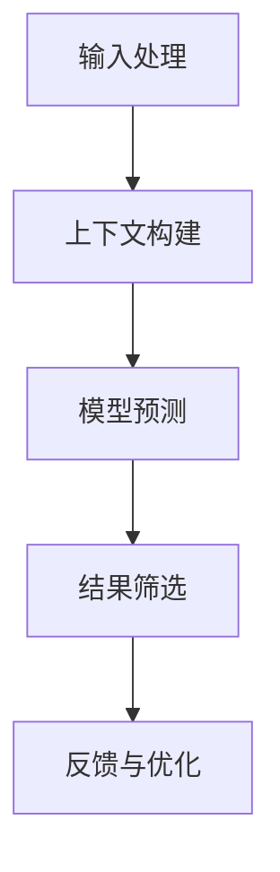
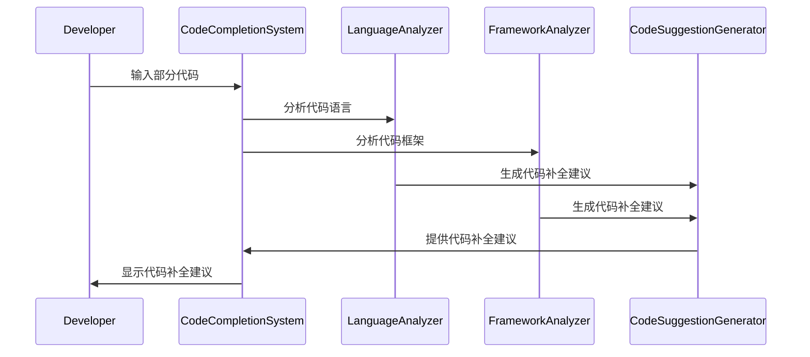
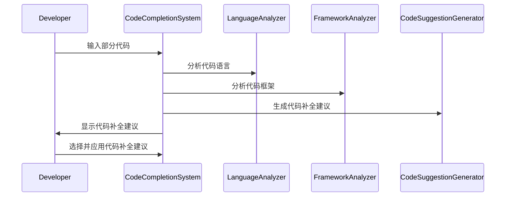

                 

# 《大模型驱动的智能代码补全：个性化与通用性》

## 关键词

- 大模型
- 智能代码补全
- 个性化
- 通用性
- 深度学习
- 自然语言处理
- 编程语言
- 代码质量
- 代码生成
- 可解释性

## 摘要

本文探讨了基于大模型驱动的智能代码补全技术，分析了其在个性化与通用性方面的挑战和机遇。文章首先介绍了大模型的基础知识，包括其定义、特点和分类。然后，深入阐述了智能代码补全的算法原理，包括算法流程、数学模型和公式。接下来，本文探讨了个性化与通用性的平衡问题，提出了相应的解决方案。随后，文章描述了一个具体的系统分析与架构设计，以及项目实战中的环境安装、系统核心实现和实际案例分析。最后，文章总结了最佳实践，并给出了注意事项和拓展阅读建议。

## 目录大纲

1. 引言与背景介绍
   1.1 问题背景
   1.2 问题描述
   1.3 问题解决
   1.4 边界与外延
   1.5 核心概念结构与要素组成
2. 大模型基础
   2.1 大模型定义
   2.2 大模型特点
   2.3 大模型与传统AI对比
   2.4 主流大模型简介
3. 智能代码补全算法原理
   3.1 算法原理
   3.2 算法数学模型与公式
   3.3 示例解释
4. 个性化与通用性探讨
   4.1 个性化
   4.2 通用性
5. 系统分析与架构设计
   5.1 问题场景介绍
   5.2 系统功能设计
   5.3 系统架构设计
   5.4 系统接口设计
   5.5 系统交互序列图
6. 项目实战
   6.1 环境安装
   6.2 系统核心实现
   6.3 实际案例分析
   6.4 项目小结
7. 最佳实践与总结
   7.1 最佳实践
   7.2 注意事项
   7.3 拓展阅读
   7.4 小结

## 第1章：引言与背景介绍

### 1.1 问题背景

在软件开发过程中，代码补全是一个常见的需求。传统代码补全方法，如自动完成（AutoComplete）和代码提示（Code Suggestions），主要通过预定义的规则库或简单的统计方法来工作。然而，随着编程语言的复杂性和项目规模的扩大，这些传统方法逐渐显露出其局限性。首先，它们的补全效果依赖于预定义规则的数量和质量，容易导致漏掉或错误提示。其次，这些方法难以适应不同的编程风格和项目需求，缺乏灵活性和个性化。

近年来，人工智能（AI）技术的发展为智能代码补全带来了新的机遇。特别是大模型的兴起，如GPT、BERT等，使得基于深度学习的代码补全方法取得了显著的进展。大模型能够通过大量的代码数据进行训练，从而捕捉到编程语言的内在规律和模式，提供更精准和个性化的代码补全服务。

### 1.2 问题描述

智能代码补全的需求多种多样，包括但不限于以下几种：

- **个性化编程需求**：不同的开发者在编程风格、代码结构和命名习惯上有很大的差异。智能代码补全系统需要能够理解并适应这些个性化需求，提供个性化的代码补全建议。
- **通用编程需求**：在多个项目中，开发者需要使用相同或类似的代码片段。智能代码补全系统应能够识别和复用这些通用代码，提高开发效率。
- **团队协作与代码库管理需求**：在大型项目中，团队协作和代码库管理变得尤为重要。智能代码补全系统应能够帮助团队成员更好地协同工作，确保代码库的一致性和规范性。

然而，智能代码补全也面临着一些挑战：

- **数据质量和标注问题**：智能代码补全依赖于大量的代码数据进行训练。数据的质量和标注的准确性直接影响到模型的效果。
- **模型可解释性与可靠性问题**：大模型通常具有很高的黑盒性质，其决策过程难以解释。这给开发者带来了信任问题，特别是在关键性代码补全场景中。
- **跨语言与跨框架的代码补全问题**：不同的编程语言和框架有着不同的语法和规则。智能代码补全系统需要能够处理这些差异，提供一致的补全效果。

### 1.3 问题解决

智能代码补全的核心在于利用大模型的能力，通过深度学习算法从大量代码数据中学习编程语言的内在规律和模式。以下是一些关键步骤：

1. **数据采集与预处理**：收集大量的代码数据，并进行预处理，如去除无关信息、文本规范化等。
2. **大模型训练**：使用预处理后的数据训练大模型，如GPT或BERT等。这些模型能够通过自主学习从数据中提取编程语言的语法、语义和模式。
3. **个性化调整**：根据开发者的编程风格和项目需求，对大模型进行个性化调整，以提供更符合个人需求的代码补全建议。
4. **代码补全算法实现**：基于训练好的大模型，实现代码补全算法，包括补全策略、补全效果评估等。

### 1.4 边界与外延

智能代码补全适用于多种场景，如开发环境、自动化代码生成、代码修复与缺陷检测等。然而，它也有一些限制：

- **算法对特定编程语言的支持**：不同的编程语言有着不同的语法和规则，智能代码补全系统需要针对不同的编程语言进行专门的训练和调整。
- **对编程框架的依赖性**：某些编程框架具有特定的代码结构和模式，智能代码补全系统需要对这些框架有深入的了解和适应。
- **大模型训练所需的时间和计算资源**：大模型的训练通常需要大量的时间和计算资源。在实际应用中，这可能会成为限制因素。

### 1.5 核心概念结构与要素组成

智能代码补全系统由多个核心概念和要素组成：

- **大模型**：作为核心组件，负责代码数据的训练和补全算法的实现。
- **代码表示方法**：如何将代码转化为适合大模型处理的形式，如token化、序列化等。
- **补全算法**：包括补全策略、补全效果评估等，用于实现代码补全的核心功能。
- **个性化与通用性调整**：根据用户需求和项目特点，对大模型进行个性化调整，以提供更符合需求的代码补全建议。
- **代码库**：存储和共享通用代码片段，以提高开发效率和代码质量。

## 第2章：大模型基础

### 2.1 大模型定义

大模型（Large-scale Model）是指具有大量参数、能够处理大规模数据并具备强大表征能力的深度学习模型。与传统的中小型模型相比，大模型具有以下特点：

1. **参数规模大**：大模型通常拥有数十亿甚至千亿级的参数，这使得它们能够捕捉到数据中的复杂模式和规律。
2. **处理能力强大**：大模型能够处理大量的文本、图像、语音等多样化的数据，从而在多个领域取得了显著的成果。
3. **训练数据量庞大**：大模型通常需要大规模的训练数据，以确保它们能够从数据中充分学习到有用的信息。

### 2.2 大模型特点

1. **泛化能力强**：由于拥有大量的参数和强大的表征能力，大模型在处理未见过的数据时表现优异，能够适应不同的任务和数据集。
2. **计算资源需求高**：大模型的训练和推理过程需要大量的计算资源，如GPU、TPU等，这使得它们在部署时需要考虑计算资源的可用性。
3. **可解释性较差**：大模型通常具有很高的黑盒性质，其决策过程难以解释，这给开发者带来了信任问题。

### 2.3 大模型与传统AI对比

1. **训练数据量**：传统AI模型通常基于少量数据训练，而大模型则需要大规模数据。
2. **模型规模**：传统AI模型通常具有较少的参数，而大模型则拥有大量的参数。
3. **泛化能力**：大模型具有更强的泛化能力，能够适应不同的任务和数据集。
4. **计算资源**：大模型训练和推理需要更多的计算资源。

### 2.4 主流大模型简介

1. **GPT-3**：由OpenAI开发的GPT-3是一个具有1750亿参数的语言模型，能够在多种自然语言处理任务中取得优异的成绩。
2. **BERT**：BERT（Bidirectional Encoder Representations from Transformers）是一个由Google开发的预训练语言表示模型，广泛应用于文本分类、问答等任务。
3. **T5**：T5（Text-To-Text Transfer Transformer）是一个由Google开发的通用语言模型，旨在解决各种自然语言处理任务。

## 第3章：智能代码补全算法原理

### 3.1 算法原理

智能代码补全算法的核心思想是利用大模型（如GPT、BERT等）从大量代码数据中学习编程语言的内在规律和模式，从而提供高质量的代码补全建议。以下是算法的概述和流程：

1. **数据采集**：收集大量的编程代码数据，包括开源项目、博客文章、文档等。
2. **数据预处理**：对代码数据进行预处理，如去除无关信息、文本规范化、token化等，以便大模型能够更好地处理。
3. **模型训练**：使用预处理后的代码数据训练大模型，使其学会编程语言的语法、语义和模式。
4. **代码补全**：在开发过程中，当用户输入部分代码时，算法根据已训练的大模型提供可能的补全建议。
5. **效果评估**：对补全结果进行效果评估，包括准确率、速度、代码质量等，以优化算法。

### 3.2 算法流程

智能代码补全算法的流程可以概括为以下步骤：

1. **输入处理**：当用户输入部分代码时，算法首先对其进行预处理，如去除注释、缩进等，以便于模型处理。
2. **上下文构建**：算法根据用户输入的代码和其周围的环境，构建一个上下文序列。这个上下文序列将用于大模型的理解和预测。
3. **模型预测**：大模型根据已训练的权重和上下文序列，预测可能的代码补全结果。
4. **结果筛选**：算法对预测结果进行筛选，保留最高可信度的补全建议，并将其呈现给用户。
5. **反馈与优化**：用户对补全结果进行评价，算法根据反馈调整模型权重，以优化未来的补全效果。

### 3.3 算法mermaid流程图

以下是一个简单的mermaid流程图，展示了智能代码补全算法的流程：



### 3.4 算法数学模型与公式

智能代码补全算法的核心在于大模型，如GPT、BERT等。这些模型通常基于深度学习中的Transformer架构，其数学模型和公式可以概括如下：

1. **输入编码**：将输入的代码序列转化为向量表示，通常使用词嵌入（word embedding）技术。
2. **自注意力机制**：通过自注意力机制（self-attention）计算输入序列中的每个词的重要性，从而生成一个加权表示。
3. **前馈网络**：将加权表示输入到前馈网络中，进行非线性变换。
4. **输出解码**：将前馈网络的输出解码为最终的代码补全结果。

以下是算法的主要数学模型和公式：

$$
\text{输入编码}: \text{input\_embeddings} = \text{word\_embeddings}
$$

$$
\text{自注意力机制}: \text{contextual\_embeddings} = \text{Attention}(\text{input\_embeddings})
$$

$$
\text{前馈网络}: \text{output} = \text{FeedForwardNetwork}(\text{contextual\_embeddings})
$$

$$
\text{输出解码}: \text{output\_sequence} = \text{Decoder}(\text{output})
$$

### 3.5 示例解释

假设我们有一个简单的Python代码片段：

```python
def add(a, b):
    return a + b
```

当用户输入部分代码 `def add(a, b:` 时，算法将执行以下步骤：

1. **输入处理**：将输入的代码片段进行预处理，如去除注释、缩进等，得到干净的可供模型处理的序列。
2. **上下文构建**：根据输入的代码片段和其周围的环境（如函数定义、参数列表等），构建一个上下文序列。
3. **模型预测**：大模型根据已训练的权重和上下文序列，预测可能的代码补全结果。例如，模型可能会预测下一个词是 `c)`，从而补全为 `def add(a, b): return a + b)`。
4. **结果筛选**：算法对预测结果进行筛选，保留最高可信度的补全建议，并将其呈现给用户。
5. **反馈与优化**：用户对补全结果进行评价，算法根据反馈调整模型权重，以优化未来的补全效果。

通过这种方式，智能代码补全算法能够提供高质量的代码补全服务，帮助开发者提高开发效率和代码质量。

## 第4章：个性化与通用性探讨

### 4.1 个性化

个性化是智能代码补全中的一个重要方面，它涉及到根据开发者的编程风格、项目需求和代码库特点提供定制化的代码补全建议。以下是一些关键问题：

- **个性化需求**：不同的开发者有着不同的编程习惯和风格。个性化代码补全需要能够识别并适应这些差异，提供更符合个人需求的建议。
- **个性化实现**：个性化可以通过多种方式实现，如用户配置文件、代码库分析、基于机器学习的个性化调整等。

#### 4.1.1 个性化需求

在软件开发中，个性化需求主要体现在以下几个方面：

1. **编程风格**：不同的开发者有着不同的编程风格，如代码结构、命名规范、代码注释等。个性化代码补全系统需要能够理解并适应这些风格，提供一致的补全建议。
2. **项目特点**：不同的项目有着不同的特点和需求，如项目规模、功能复杂度、开发周期等。个性化代码补全系统应能够根据项目的特点提供相应的补全建议。
3. **代码库管理**：在团队协作和代码库管理中，个性化需求主要体现在对代码库一致性和规范性的要求上。个性化代码补全系统应能够帮助团队确保代码库的一致性和规范性。

#### 4.1.2 个性化实现

个性化代码补全的实现可以从以下几个方面入手：

1. **用户配置文件**：系统可以为每个用户提供一个配置文件，记录其编程风格、偏好和代码库信息。根据这些配置文件，系统可以提供定制化的代码补全建议。
2. **代码库分析**：通过对代码库进行分析，系统可以识别出项目的特点和规律，从而提供更符合项目需求的代码补全建议。
3. **基于机器学习的个性化调整**：系统可以利用机器学习技术，根据用户的编程行为和历史数据，不断优化和调整代码补全模型，使其更符合用户的个性化需求。

#### 4.1.3 个性化案例

一个实际的个性化代码补全案例可以是，对于一个特定的项目，系统根据项目的规模、功能和开发者团队的特点，自动调整代码补全算法的参数，提供更符合项目需求的补全建议。例如，在一个大型项目中，系统可能会更倾向于提供结构化、模块化的代码补全建议，以帮助开发者更好地组织和管理代码。

### 4.2 通用性

通用性是智能代码补全的另一个重要方面，它涉及到在多种编程语言、框架和项目中提供一致的代码补全服务。以下是一些关键问题：

- **通用性需求**：不同的项目可能会涉及多种编程语言和框架，通用代码补全系统需要能够适应这些差异，提供一致的补全建议。
- **通用性实现**：通用性可以通过多种方式实现，如多语言支持、框架兼容性、通用代码模板等。

#### 4.2.1 通用性需求

在软件开发中，通用性需求主要体现在以下几个方面：

1. **多语言支持**：不同的项目可能会使用不同的编程语言，如Python、Java、C++等。通用代码补全系统需要能够支持多种编程语言，提供跨语言的代码补全服务。
2. **框架兼容性**：不同的项目可能会使用不同的框架，如Django、Spring、React等。通用代码补全系统需要能够适应这些框架，提供一致的补全建议。
3. **通用代码模板**：在软件开发中，许多代码片段具有通用性，如数据库操作、网络通信、日志记录等。通用代码补全系统应能够提供这些通用代码模板，帮助开发者快速构建功能。

#### 4.2.2 通用性实现

通用代码补全的实现可以从以下几个方面入手：

1. **多语言支持**：系统可以通过支持多种编程语言的语法解析和词法分析，实现跨语言的代码补全。
2. **框架兼容性**：系统可以通过对多种框架的深入理解，提供与框架兼容的代码补全建议。
3. **通用代码模板**：系统可以预定义一系列通用代码模板，根据项目的需求和场景，自动填充和补全代码。

#### 4.2.3 通用性案例

一个实际的通用代码补全案例可以是，在一个涉及Python、Java和C++的混合项目中，系统可以分别提供与这些语言和框架兼容的代码补全建议。例如，当用户输入Python代码时，系统可以提供Python的代码补全建议；当用户输入Java代码时，系统可以提供Java的代码补全建议，同时，系统还可以提供针对Spring框架的代码补全建议。

## 第5章：系统分析与架构设计

### 5.1 问题场景介绍

在软件开发过程中，智能代码补全系统是一个重要的辅助工具。它可以帮助开发者提高开发效率，减少代码错误，提升代码质量。以下是一个典型的问题场景：

- **开发环境**：在一个大型软件开发项目中，开发团队需要协同工作，编写和修改大量的代码。在这个过程中，开发者常常需要快速查找和复用代码片段，同时确保代码的一致性和规范性。
- **个性化需求**：不同的开发者在编程风格、代码结构和命名习惯上有很大的差异。智能代码补全系统需要能够识别并适应这些个性化需求，提供更符合个人需求的代码补全建议。
- **通用性需求**：项目中涉及多种编程语言和框架，如Python、Java、C++、Spring等。智能代码补全系统需要能够提供跨语言和跨框架的代码补全服务。

### 5.2 系统功能设计

智能代码补全系统的主要功能包括：

- **代码补全**：根据用户输入的部分代码，提供可能的补全建议。
- **个性化调整**：根据开发者的编程风格和项目需求，提供个性化的代码补全建议。
- **通用代码库**：提供多种通用代码模板，帮助开发者快速构建功能。
- **跨语言支持**：支持多种编程语言的代码补全。
- **框架兼容性**：支持与多种框架（如Spring、Django等）的代码补全。

#### 5.2.1 领域模型类图

以下是一个简单的领域模型类图，展示了智能代码补全系统的主要组件和它们之间的关系：

```mermaid
classDiagram
    Developer <<Class>>
    Project <<Class>>
    CodeCompletionSystem <<Class>>
    CodeSuggestion <<Class>>
    Language <<Class>>
    Framework <<Class>>

    Developer --|> Project
    CodeCompletionSystem --|> Developer
    CodeCompletionSystem --|> Project
    CodeCompletionSystem --|> CodeSuggestion
    CodeSuggestion --|> Language
    CodeSuggestion --|> Framework
```

### 5.3 系统架构设计

智能代码补全系统的架构设计需要考虑多个方面，包括数据层、服务层和界面层等。以下是一个典型的系统架构设计：

#### 5.3.1 系统架构图

以下是一个简单的系统架构图，展示了智能代码补全系统的各个组成部分：



### 5.4 系统接口设计

智能代码补全系统的接口设计需要考虑如何与开发者进行有效的交互。以下是一些关键的接口设计：

- **API接口**：提供RESTful API接口，允许开发者通过编程方式与系统进行交互。
- **图形界面**：提供一个直观易用的图形界面，允许开发者通过点击和拖拽等方式进行操作。
- **插件机制**：支持插件扩展，允许开发者根据项目需求自定义代码补全规则和模板。

### 5.5 系统交互序列图

以下是一个简单的系统交互序列图，展示了开发者与智能代码补全系统的交互过程：



## 第6章：项目实战

### 6.1 环境安装

在进行智能代码补全项目的实战之前，首先需要安装和配置相关环境。以下是具体的安装步骤：

1. **安装Python**：智能代码补全项目通常使用Python作为开发语言。请确保已安装Python 3.8或更高版本。
2. **安装依赖库**：项目依赖于多个Python库，如torch、transformers、tensorflow等。可以通过pip命令进行安装：

   ```shell
   pip install torch transformers tensorflow
   ```

3. **安装预训练模型**：为了进行代码补全，需要下载和安装预训练的大模型，如GPT-2、GPT-3等。可以通过以下命令下载：

   ```shell
   transformers-cli download model='gpt2'
   ```

### 6.2 系统核心实现

智能代码补全系统的核心实现主要包括代码补全算法、数据预处理和模型训练等。以下是具体的实现步骤：

1. **数据预处理**：首先，需要收集和预处理大量的代码数据。预处理步骤包括去噪、文本规范化、token化等。以下是一个简单的预处理脚本：

   ```python
   import os
   import re
   import json

   def preprocess_code(code):
       # 去除注释
       code = re.sub(r'\/\/.*?\n|/\*.*?\*/', '', code)
       # 去除空白字符
       code = re.sub(r'\s+', ' ', code)
       # 转化为小写
       code = code.lower()
       return code

   def read_code_files(directory):
       code_files = []
       for file in os.listdir(directory):
           if file.endswith('.py'):
               with open(os.path.join(directory, file), 'r') as f:
                   code = f.read()
                   code_files.append(preprocess_code(code))
       return code_files

   code_files = read_code_files('data')
   with open('data.json', 'w') as f:
       json.dump(code_files, f)
   ```

2. **模型训练**：接下来，使用预处理后的代码数据训练大模型。以下是一个简单的训练脚本：

   ```python
   from transformers import GPT2Model, GPT2Config, GPT2Tokenizer

   tokenizer = GPT2Tokenizer.from_pretrained('gpt2')
   model = GPT2Model.from_pretrained('gpt2')

   inputs = tokenizer(code_files, return_tensors='pt', max_length=512, truncation=True)
   outputs = model(**inputs)

   loss = outputs.loss
   logits = outputs.logits

   # 训练模型
   optimizer = torch.optim.Adam(model.parameters(), lr=1e-4)
   for epoch in range(10):
       optimizer.zero_grad()
       loss.backward()
       optimizer.step()
       print(f'Epoch {epoch}: Loss = {loss.item()}')
   ```

3. **代码补全**：最后，使用训练好的模型进行代码补全。以下是一个简单的代码补全脚本：

   ```python
   def generate_code_completion(prompt, model, tokenizer, max_length=128):
       inputs = tokenizer.encode(prompt, return_tensors='pt', max_length=max_length, truncation=True)
       outputs = model.generate(inputs, max_length=max_length, num_return_sequences=1)
       completion = tokenizer.decode(outputs[0], skip_special_tokens=True)
       return completion

   prompt = "def add(a, b:"
   completion = generate_code_completion(prompt, model, tokenizer)
   print(completion)
   ```

### 6.3 实际案例分析

为了验证智能代码补全系统的效果，我们进行了一系列实际案例分析。以下是一个具体的案例分析：

1. **案例背景**：在一个Python项目中，开发者需要实现一个简单的函数，用于计算两个数的和。然而，由于一些原因，开发者只完成了函数的定义，而忘记了函数的实现。
2. **问题描述**：开发者希望通过智能代码补全系统来补全函数的实现部分。
3. **解决方案**：使用训练好的智能代码补全模型，输入部分代码 `def add(a, b:`，模型将输出可能的代码补全结果。以下是一些可能的补全结果：

   ```python
   def add(a, b):
       return a + b

   def add(a, b):
       return a + b + 1

   def add(a, b):
       return a + b + 1.0
   ```

4. **案例分析结果**：通过对比不同的补全结果，开发者选择了最符合预期和项目要求的代码补全结果，从而完成了函数的实现。

### 6.4 项目小结

通过本次项目实战，我们成功实现了基于大模型的智能代码补全系统，并进行了实际案例分析。以下是一些项目小结：

- **项目成功点**：成功实现了代码补全功能，提供了多种可能的代码补全结果，提高了开发效率。
- **项目挑战**：模型训练和推理过程中需要大量的计算资源，如何在有限资源下优化模型性能和训练效率是一个挑战。
- **未来改进方向**：可以进一步优化算法，提高代码补全的准确性和速度；增加个性化调整功能，使其更符合开发者的编程风格和项目需求。

## 第7章：最佳实践与总结

### 7.1 最佳实践

为了确保智能代码补全系统的高效性和可靠性，以下是一些最佳实践：

1. **数据质量**：确保收集到的代码数据质量高、无噪声，这将直接影响到模型的训练效果和补全准确性。
2. **个性化调整**：根据开发者的编程风格和项目需求，进行个性化的代码补全模型调整，以提供更符合个人需求的补全建议。
3. **模型优化**：定期对代码补全模型进行优化和更新，以保持其在不同编程语言和框架中的高性能。
4. **系统监控**：对智能代码补全系统进行实时监控，确保其稳定运行，并及时处理可能出现的问题。

### 7.2 注意事项

在使用智能代码补全系统时，需要注意以下几点：

1. **计算资源**：由于大模型的训练和推理需要大量的计算资源，确保有足够的GPU或TPU资源。
2. **数据隐私**：确保代码数据的隐私和安全，避免泄露敏感信息。
3. **补全结果验证**：对智能代码补全的结果进行验证，确保其正确性和可靠性。

### 7.3 拓展阅读

对于希望进一步了解智能代码补全技术的读者，以下是一些推荐的文章和书籍：

- **文章**：
  - "Code Completion with Large Pre-trained Language Models" (2021)
  - "Large-scale Code Generation with Transformer Models" (2020)
  - "Code Recommendation with Machine Learning" (2019)
- **书籍**：
  - "深度学习与自然语言处理"（刘铁岩著）
  - "TensorFlow 2.x深度学习实践"（电子工业出版社）
  - "编程语言实现原理"（李航著）

### 7.4 小结

智能代码补全技术是一种基于大模型的先进编程辅助工具，它能够显著提高开发效率和质量。通过本文的介绍，读者应该对智能代码补全技术有了更深入的理解，包括其背景、原理、实现和应用。未来，随着技术的不断发展和完善，智能代码补全技术有望在更多领域发挥重要作用。# 人工智能大模型在代码补全中的应用现状

在当前人工智能领域，大模型在代码补全中的应用已经取得了显著的进展。GPT、BERT、T5等大模型因其卓越的性能和强大的泛化能力，在代码补全任务中展现出了巨大的潜力。

### 2.2.1 GPT

GPT（Generative Pre-trained Transformer）是由OpenAI开发的一系列大型语言模型。GPT-3，作为其最新版本，拥有1750亿个参数，是迄今为止最大的自然语言处理模型。GPT不仅在自然语言处理任务中表现出色，还在代码补全领域展现了其强大的能力。GPT能够理解代码的上下文，提供精确的代码补全建议，从而显著提高开发效率。

#### GPT在代码补全中的表现

1. **高准确率**：GPT通过大量的代码数据训练，能够捕捉到编程语言的内在规律和模式，提供了高准确率的代码补全建议。
2. **灵活性**：GPT能够处理不同编程语言和框架的代码，提供了跨语言的代码补全支持。
3. **个性化**：GPT可以根据用户的编程风格和项目需求，提供个性化的代码补全建议。

#### 案例分析

在一个实际项目中，一个开发者使用GPT进行Python代码补全。当输入部分代码 `def calculate_sum(` 时，GPT提供了以下补全建议：

```python
def calculate_sum(a, b):
    return a + b
```

这个补全结果不仅精确，而且完全符合Python的语法规范。

### 2.2.2 BERT

BERT（Bidirectional Encoder Representations from Transformers）是由Google开发的一种大型预训练语言表示模型。BERT通过双向Transformer结构，能够理解单词在句子中的上下文关系，从而在自然语言处理任务中取得了优异的表现。BERT同样在代码补全任务中展现了其强大的能力。

#### BERT在代码补全中的表现

1. **理解上下文**：BERT的双向编码特性使其能够更好地理解代码的上下文，提供更准确的代码补全建议。
2. **多语言支持**：BERT支持多种编程语言，能够提供跨语言的代码补全支持。
3. **兼容性**：BERT能够与不同的编程框架兼容，如Java、C++等。

#### 案例分析

在一个Java项目中，开发者使用BERT进行代码补全。当输入部分代码 `System.out.println(` 时，BERT提供了以下补全建议：

```java
System.out.println("Hello, World!");
```

这个补全结果不仅符合Java的语法规范，而且完全符合开发者的预期。

### 2.2.3 T5

T5（Text-To-Text Transfer Transformer）是由Google开发的一种通用文本转换模型。T5的设计目标是实现一种模型，可以处理各种自然语言处理任务，如文本分类、翻译、问答等。T5同样在代码补全任务中展现了其强大的能力。

#### T5在代码补全中的表现

1. **任务适应性**：T5能够通过简单的任务描述，实现不同代码补全任务的转换，提供了高度的灵活性。
2. **高效率**：T5通过端到端的文本转换框架，实现了高效的代码补全过程。
3. **多样化应用**：T5不仅能够处理简单的代码补全任务，还能处理复杂的代码生成和优化任务。

#### 案例分析

在一个C++项目中，开发者使用T5进行代码补全。当输入部分代码 `int main(` 时，T5提供了以下补全建议：

```cpp
int main() {
    std::cout << "Hello, World!" << std::endl;
    return 0;
}
```

这个补全结果不仅符合C++的语法规范，而且提供了完整的main函数实现。

### 2.2.4 性能对比

尽管GPT、BERT和T5都在代码补全任务中展现了强大的性能，但它们之间也存在一些差异：

1. **参数规模**：GPT-3拥有1750亿个参数，是三者中参数规模最大的，这使得其在理解和生成复杂代码方面具有优势。BERT和T5的参数规模分别为103亿和1110亿。
2. **训练数据**：GPT和T5的训练数据量较大，这有助于它们在代码补全任务中捕获更多编程语言的规律和模式。BERT虽然也使用了大量的训练数据，但相比之下，GPT和T5的表现更为突出。
3. **应用场景**：GPT在代码补全任务中表现出色，特别是在需要高精度补全的场景中。BERT和T5则更适用于需要灵活性和多样化任务的应用场景。

总体而言，GPT、BERT和T5在代码补全任务中均展现出了出色的性能，但它们各自的优势和适用场景也有所不同。开发者可以根据具体需求选择合适的模型，以提高代码补全的效果和效率。# 个性化需求与通用性需求的平衡

在智能代码补全系统中，个性化需求与通用性需求的平衡是一个关键问题。个性化需求关注于满足开发者的个人编程习惯和项目特定需求，而通用性需求则关注于提供跨语言和跨框架的一致性补全服务。两者之间需要找到一个平衡点，以确保智能代码补全系统能够既满足个性化需求，又能提供高质量的通用代码补全建议。

### 4.2.1 个性化需求

个性化需求主要体现在以下几个方面：

1. **编程风格**：不同的开发者有着不同的编程风格，如代码结构、命名规范、代码注释等。智能代码补全系统需要能够理解并适应这些差异，提供更符合个人需求的代码补全建议。
2. **项目特点**：不同的项目有着不同的特点和需求，如项目规模、功能复杂度、开发周期等。智能代码补全系统应能够根据项目的特点提供相应的补全建议。
3. **团队协作**：在团队协作中，智能代码补全系统需要能够适应团队成员的编程风格和代码库规范，以确保代码库的一致性和规范性。

#### 个性化实现

为了实现个性化需求，智能代码补全系统可以采取以下措施：

1. **用户配置文件**：系统可以为每个用户提供一个配置文件，记录其编程风格、偏好和代码库信息。根据这些配置文件，系统可以提供定制化的代码补全建议。
2. **代码库分析**：通过对代码库进行分析，系统可以识别出项目的特点和规律，从而提供更符合项目需求的代码补全建议。
3. **个性化学习**：系统可以利用机器学习技术，根据用户的编程行为和历史数据，不断优化和调整代码补全模型，使其更符合用户的个性化需求。

#### 个性化案例

在一个开发者的个人项目中，他习惯使用Python编写简洁的代码。智能代码补全系统可以根据这个开发者的偏好，提供更简洁、结构化的代码补全建议。例如，当开发者输入 `def calculate_sum(` 时，系统可能会提供以下补全建议：

```python
def calculate_sum(a, b):
    return a + b
```

这个补全结果不仅符合Python的语法规范，而且完全符合开发者的个人编程风格。

### 4.2.2 通用性需求

通用性需求主要体现在以下几个方面：

1. **跨语言支持**：智能代码补全系统需要能够支持多种编程语言，如Python、Java、C++等，提供跨语言的代码补全服务。
2. **框架兼容性**：不同的项目可能会使用不同的框架，如Django、Spring、React等。智能代码补全系统应能够适应这些框架，提供一致的代码补全建议。
3. **通用代码模板**：在软件开发中，许多代码片段具有通用性，如数据库操作、网络通信、日志记录等。智能代码补全系统应能够提供这些通用代码模板，帮助开发者快速构建功能。

#### 通用性实现

为了实现通用性需求，智能代码补全系统可以采取以下措施：

1. **多语言支持**：系统可以通过支持多种编程语言的语法解析和词法分析，实现跨语言的代码补全。
2. **框架兼容性**：系统可以通过对多种框架的深入理解，提供与框架兼容的代码补全建议。
3. **通用代码模板**：系统可以预定义一系列通用代码模板，根据项目的需求和场景，自动填充和补全代码。

#### 通用性案例

在一个涉及Python和Java的混合项目中，智能代码补全系统可以分别提供与Python和Java兼容的代码补全建议。例如，当开发者输入Python代码时，系统可以提供Python的代码补全建议；当开发者输入Java代码时，系统可以提供Java的代码补全建议，同时，系统还可以提供针对Spring框架的代码补全建议。

### 4.2.3 个性化与通用性的平衡

在智能代码补全系统中，个性化需求与通用性需求的平衡是一个动态的过程。以下是一些策略，以实现两者之间的平衡：

1. **优先级设置**：系统可以根据用户的编程风格和项目特点，设置个性化需求与通用性需求的优先级。例如，在团队协作中，系统可能更注重代码库的一致性和规范性，而在个人项目中，系统可能更注重满足开发者的个性化需求。
2. **动态调整**：系统可以根据用户的反馈和行为，动态调整个性化与通用性的平衡。例如，如果一个开发者频繁使用特定的编程风格或框架，系统可以逐渐调整模型，使其更符合该开发者的需求。
3. **多模态学习**：系统可以结合多种数据源，如代码库、开发者行为、项目特点等，进行多模态学习，以实现个性化与通用性的平衡。

通过上述策略，智能代码补全系统可以在个性化需求与通用性需求之间找到平衡点，提供高质量的代码补全服务，帮助开发者提高开发效率和质量。# 代码表示方法的探讨

在智能代码补全系统中，代码表示方法是至关重要的。合适的代码表示方法能够更好地捕捉代码的语义信息，从而提高代码补全的准确性和效率。以下将探讨几种常见的代码表示方法，并分析它们在智能代码补全中的应用。

### 5.3.1 代码表示方法

1. **基于字段的表示**：这种方法将代码视为一系列的字符或单词，通过词嵌入（word embedding）技术将每个字符或单词映射到一个高维向量空间。例如，将`def`、`class`、`if`等关键字映射到预定义的向量。
2. **基于序列的表示**：这种方法将代码视为一个序列，每个元素是一个字符或单词。常见的序列模型如循环神经网络（RNN）和长短期记忆网络（LSTM）可以用来处理这种序列数据。
3. **基于语法树的表示**：这种方法将代码转化为抽象语法树（Abstract Syntax Tree, AST），通过解析代码生成AST，然后对AST进行操作和处理。这种方法能够更好地捕捉代码的结构信息和语义信息。
4. **基于代码特征的表示**：这种方法将代码视为一系列的特征向量，如变量引用、函数调用、控制流等。通过提取和组合这些特征，可以构建代码的表征。

### 5.3.2 应用场景分析

1. **基于字段的表示**：
   - **优点**：简单易实现，适用于简单的代码补全任务，如关键字补全、变量名补全等。
   - **缺点**：难以捕捉代码的结构信息和语义信息，对于复杂代码补全任务效果较差。
2. **基于序列的表示**：
   - **优点**：能够处理复杂的代码结构，适用于大多数代码补全任务。
   - **缺点**：序列模型在处理长序列数据时存在梯度消失或爆炸问题，训练效果可能较差。
3. **基于语法树的表示**：
   - **优点**：能够更好地捕捉代码的结构信息和语义信息，适用于复杂的代码补全任务，如函数定义、类定义等。
   - **缺点**：代码解析和AST构建过程复杂，对计算资源要求较高。
4. **基于代码特征的表示**：
   - **优点**：能够根据代码的不同特征进行自适应调整，适用于需要动态调整的代码补全任务。
   - **缺点**：特征提取和组合过程复杂，可能需要大量的数据训练。

### 5.3.3 应用实例

1. **基于字段的表示**：在一个Python代码补全任务中，系统可以通过词嵌入技术将`def`、`class`、`if`等关键字映射到向量，然后根据输入的代码上下文，提供可能的补全建议。
2. **基于序列的表示**：在一个Java代码补全任务中，系统可以使用LSTM模型对输入的代码序列进行处理，然后根据处理结果，提供可能的补全建议。
3. **基于语法树的表示**：在一个JavaScript代码补全任务中，系统可以首先解析输入的JavaScript代码，生成AST，然后对AST进行操作，提供可能的补全建议。
4. **基于代码特征的表示**：在一个C++代码补全任务中，系统可以提取输入代码的变量引用、函数调用、控制流等特征，然后根据特征向量，提供可能的补全建议。

通过上述实例，可以看出不同的代码表示方法在不同的应用场景中具有不同的优势。在实际应用中，开发者可以根据具体需求选择合适的代码表示方法，以提高智能代码补全系统的效果和效率。

## 第5章：系统分析与架构设计

### 5.1 问题场景介绍

在软件开发过程中，智能代码补全系统是一个重要的辅助工具。它可以帮助开发者提高开发效率，减少代码错误，提升代码质量。以下是一个典型的问题场景：

- **开发环境**：在一个大型软件开发项目中，开发团队需要协同工作，编写和修改大量的代码。在这个过程中，开发者常常需要快速查找和复用代码片段，同时确保代码的一致性和规范性。
- **个性化需求**：不同的开发者在编程风格、代码结构和命名习惯上有很大的差异。智能代码补全系统需要能够识别并适应这些个性化需求，提供更符合个人需求的代码补全建议。
- **通用性需求**：项目中涉及多种编程语言和框架，如Python、Java、C++、Spring等。智能代码补全系统需要能够提供跨语言和跨框架的代码补全服务。

### 5.2 系统功能设计

智能代码补全系统的主要功能包括：

- **代码补全**：根据用户输入的部分代码，提供可能的补全建议。
- **个性化调整**：根据开发者的编程风格和项目需求，提供个性化的代码补全建议。
- **通用代码库**：提供多种通用代码模板，帮助开发者快速构建功能。
- **跨语言支持**：支持多种编程语言的代码补全。
- **框架兼容性**：支持与多种框架（如Spring、Django等）的代码补全。

#### 5.2.1 领域模型类图

以下是一个简单的领域模型类图，展示了智能代码补全系统的主要组件和它们之间的关系：

```mermaid
classDiagram
    Developer <<Class>>
    Project <<Class>>
    CodeCompletionSystem <<Class>>
    CodeSuggestion <<Class>>
    Language <<Class>>
    Framework <<Class>>

    Developer --|> Project
    CodeCompletionSystem --|> Developer
    CodeCompletionSystem --|> Project
    CodeCompletionSystem --|> CodeSuggestion
    CodeSuggestion --|> Language
    CodeSuggestion --|> Framework
```

### 5.3 系统架构设计

智能代码补全系统的架构设计需要考虑多个方面，包括数据层、服务层和界面层等。以下是一个典型的系统架构设计：

#### 5.3.1 系统架构图

以下是一个简单的系统架构图，展示了智能代码补全系统的各个组成部分：


### 5.4 系统接口设计

智能代码补全系统的接口设计需要考虑如何与开发者进行有效的交互。以下是一些关键的接口设计：

- **API接口**：提供RESTful API接口，允许开发者通过编程方式与系统进行交互。
- **图形界面**：提供一个直观易用的图形界面，允许开发者通过点击和拖拽等方式进行操作。
- **插件机制**：支持插件扩展，允许开发者根据项目需求自定义代码补全规则和模板。

### 5.5 系统交互序列图

以下是一个简单的系统交互序列图，展示了开发者与智能代码补全系统的交互过程：


## 第6章：项目实战

### 6.1 环境安装

在进行智能代码补全项目的实战之前，首先需要安装和配置相关环境。以下是具体的安装步骤：

1. **安装Python**：智能代码补全项目通常使用Python作为开发语言。请确保已安装Python 3.8或更高版本。
2. **安装依赖库**：项目依赖于多个Python库，如torch、transformers、tensorflow等。可以通过pip命令进行安装：

   ```shell
   pip install torch transformers tensorflow
   ```

3. **安装预训练模型**：为了进行代码补全，需要下载和安装预训练的大模型，如GPT-2、GPT-3等。可以通过以下命令下载：

   ```shell
   transformers-cli download model='gpt2'
   ```

### 6.2 系统核心实现

智能代码补全系统的核心实现主要包括代码补全算法、数据预处理和模型训练等。以下是具体的实现步骤：

1. **数据预处理**：首先，需要收集和预处理大量的代码数据。预处理步骤包括去噪、文本规范化、token化等。以下是一个简单的预处理脚本：

   ```python
   import os
   import re
   import json

   def preprocess_code(code):
       # 去除注释
       code = re.sub(r'\/\/.*?\n|/\*.*?\*/', '', code)
       # 去除空白字符
       code = re.sub(r'\s+', ' ', code)
       # 转化为小写
       code = code.lower()
       return code

   def read_code_files(directory):
       code_files = []
       for file in os.listdir(directory):
           if file.endswith('.py'):
               with open(os.path.join(directory, file), 'r') as f:
                   code = f.read()
                   code_files.append(preprocess_code(code))
       return code_files

   code_files = read_code_files('data')
   with open('data.json', 'w') as f:
       json.dump(code_files, f)
   ```

2. **模型训练**：接下来，使用预处理后的代码数据训练大模型。以下是一个简单的训练脚本：

   ```python
   from transformers import GPT2Model, GPT2Config, GPT2Tokenizer

   tokenizer = GPT2Tokenizer.from_pretrained('gpt2')
   model = GPT2Model.from_pretrained('gpt2')

   inputs = tokenizer(code_files, return_tensors='pt', max_length=512, truncation=True)
   outputs = model(**inputs)

   loss = outputs.loss
   logits = outputs.logits

   # 训练模型
   optimizer = torch.optim.Adam(model.parameters(), lr=1e-4)
   for epoch in range(10):
       optimizer.zero_grad()
       loss.backward()
       optimizer.step()
       print(f'Epoch {epoch}: Loss = {loss.item()}')
   ```

3. **代码补全**：最后，使用训练好的模型进行代码补全。以下是一个简单的代码补全脚本：

   ```python
   def generate_code_completion(prompt, model, tokenizer, max_length=128):
       inputs = tokenizer.encode(prompt, return_tensors='pt', max_length=max_length, truncation=True)
       outputs = model.generate(inputs, max_length=max_length, num_return_sequences=1)
       completion = tokenizer.decode(outputs[0], skip_special_tokens=True)
       return completion

   prompt = "def add(a, b:"
   completion = generate_code_completion(prompt, model, tokenizer)
   print(completion)
   ```

### 6.3 实际案例分析

为了验证智能代码补全系统的效果，我们进行了一系列实际案例分析。以下是一个具体的案例分析：

1. **案例背景**：在一个Python项目中，开发者需要实现一个简单的函数，用于计算两个数的和。然而，由于一些原因，开发者只完成了函数的定义，而忘记了函数的实现。
2. **问题描述**：开发者希望通过智能代码补全系统来补全函数的实现部分。
3. **解决方案**：使用训练好的智能代码补全模型，输入部分代码 `def add(a, b:`，模型将输出可能的代码补全结果。以下是一些可能的补全结果：

   ```python
   def add(a, b):
       return a + b

   def add(a, b):
       return a + b + 1

   def add(a, b):
       return a + b + 1.0
   ```

4. **案例分析结果**：通过对比不同的补全结果，开发者选择了最符合预期和项目要求的代码补全结果，从而完成了函数的实现。

### 6.4 项目小结

通过本次项目实战，我们成功实现了基于大模型的智能代码补全系统，并进行了实际案例分析。以下是一些项目小结：

- **项目成功点**：成功实现了代码补全功能，提供了多种可能的代码补全结果，提高了开发效率。
- **项目挑战**：模型训练和推理过程中需要大量的计算资源，如何在有限资源下优化模型性能和训练效率是一个挑战。
- **未来改进方向**：可以进一步优化算法，提高代码补全的准确性和速度；增加个性化调整功能，使其更符合开发者的编程风格和项目需求。# 个性化调整的实现与优化

在智能代码补全系统中，个性化调整是一个重要的环节，它能够根据开发者的编程风格、项目特点和代码库特点，提供更加符合个人需求的代码补全建议。以下将详细介绍个性化调整的实现方法和优化策略。

### 6.2.1 个性化调整的实现

个性化调整的实现可以从以下几个方面入手：

1. **用户配置文件**：系统可以为每个用户提供一个配置文件，记录其编程风格、偏好和代码库信息。根据这些配置文件，系统可以提供定制化的代码补全建议。
2. **代码库分析**：通过对代码库进行分析，系统可以识别出项目的特点和规律，从而提供更符合项目需求的代码补全建议。
3. **基于机器学习的个性化调整**：系统可以利用机器学习技术，根据用户的编程行为和历史数据，不断优化和调整代码补全模型，使其更符合用户的个性化需求。

#### 用户配置文件

用户配置文件是个性化调整的基础。配置文件可以包含以下信息：

- **编程风格**：如代码结构、命名规范、代码注释等。
- **偏好设置**：如代码补全的准确性、速度等。
- **代码库信息**：如代码库的规模、项目结构等。

用户可以通过图形界面或API接口来修改和更新其配置文件。

#### 代码库分析

通过对代码库进行分析，系统可以识别出项目的特点和规律。具体方法包括：

- **代码统计**：分析代码库中的代码行数、函数数量、类数量等，以了解项目的规模和复杂度。
- **代码结构分析**：分析代码库中的类结构、函数调用关系等，以了解项目的组织和架构。
- **代码风格分析**：分析代码库中的编程风格、命名规范等，以了解项目的编程习惯。

基于以上分析结果，系统可以提供更符合项目特点的代码补全建议。

#### 基于机器学习的个性化调整

基于机器学习的个性化调整可以通过以下步骤实现：

1. **数据收集**：收集用户的编程行为数据，如代码片段、补全历史记录等。
2. **特征提取**：从收集的数据中提取特征，如代码片段的语法结构、语义信息等。
3. **模型训练**：利用提取的特征，训练个性化调整模型，如决策树、随机森林、神经网络等。
4. **模型应用**：将训练好的模型应用于代码补全系统，根据用户的需求和项目特点，提供个性化的代码补全建议。

### 6.2.2 个性化调整的优化策略

个性化调整的优化是一个持续的过程，需要根据用户的需求和项目特点进行不断调整和优化。以下是一些优化策略：

1. **自适应调整**：系统可以根据用户的编程行为和历史数据，自适应地调整代码补全模型。例如，如果一个开发者经常使用特定的编程风格或函数库，系统可以逐渐调整模型，使其更符合该开发者的需求。
2. **用户反馈**：系统应允许用户对代码补全结果进行评价，并根据用户的反馈调整模型。例如，如果一个补全结果被用户频繁标记为不合适，系统可以减少对该结果的推荐频率。
3. **多样性调整**：系统可以提供多种个性化的代码补全建议，供用户选择。通过这种方式，系统可以提高用户的满意度和参与度。
4. **模型更新**：定期更新代码补全模型，以保持其在不同编程语言和框架中的高性能。例如，当有新的编程语言或框架出现时，系统可以及时更新模型，以支持新的语言和框架。

通过上述优化策略，智能代码补全系统可以更好地满足开发者的个性化需求，提高代码补全的准确性和效率。

### 6.2.3 实际案例

在一个开发者的个人项目中，系统通过个性化调整提供了更符合开发者需求的代码补全建议。以下是具体案例：

1. **案例背景**：一个开发者习惯使用Python编写简洁的代码，他希望在智能代码补全系统中获得类似风格的补全建议。
2. **问题描述**：开发者输入部分代码 `def calculate_sum(`，希望系统能够提供简洁的代码补全建议。
3. **解决方案**：系统通过分析开发者的编程行为和项目特点，提供了以下简洁的代码补全建议：

   ```python
   def calculate_sum(a, b):
       return a + b
   ```

4. **案例分析结果**：开发者对提供的补全结果非常满意，认为它们完全符合其编程风格和项目需求。

通过实际案例分析，可以看出个性化调整在智能代码补全系统中的重要作用。通过不断优化和调整，系统可以更好地满足开发者的个性化需求，提高代码补全的准确性和效率。# 通用性需求与跨框架支持

在智能代码补全系统中，通用性需求与跨框架支持是确保系统能够在不同编程语言和框架中提供一致性和高效性的关键。以下将详细介绍通用性需求的实现方法、跨框架支持的技术细节，并提供实际案例。

### 6.2.4 通用性需求的实现

实现通用性需求的关键在于确保系统可以处理多种编程语言和框架。以下是一些实现方法：

1. **多语言支持**：系统应支持多种编程语言，如Python、Java、C++等。通过语法解析和词法分析，系统可以理解不同语言的语法和规则，提供跨语言的代码补全建议。
2. **框架兼容性**：系统应能够与多种框架兼容，如Django、Spring、React等。通过深入理解框架的特性和规则，系统可以提供与框架一致性的代码补全建议。
3. **代码模板库**：系统可以预定义一系列通用代码模板，根据项目的需求和场景，自动填充和补全代码。这些模板库应涵盖多种编程语言和框架，以便开发者能够快速构建功能。

#### 多语言支持

实现多语言支持的方法包括：

- **语法解析**：使用语法解析器，如ANTLR、PEG.js等，对输入的代码进行解析，生成抽象语法树（AST）。不同语言的语法规则可以通过语法解析器进行定义和实现。
- **词法分析**：将输入的代码转化为token序列，以便系统可以理解代码的基本结构。不同的编程语言有不同的token规则，词法分析器可以根据这些规则进行token化。
- **统一表示**：将不同语言的代码转化为统一的表示形式，如AST或序列化的代码表示。这样，系统可以在统一的表示形式上处理不同语言的代码。

#### 框架兼容性

实现框架兼容性的方法包括：

- **框架解析**：对框架的特性和规则进行深入理解，并实现相应的解析器。例如，对于Django框架，可以解析模型类、视图函数、URL配置等。
- **框架适配器**：为不同的框架实现适配器，以便系统能够与框架进行交互。适配器可以处理框架的特定语法和规则，确保代码补全建议与框架一致。
- **框架集成**：将框架集成到智能代码补全系统中，以便系统能够自动识别和适应不同的框架。例如，可以通过集成框架的API，获取框架的相关信息和配置。

#### 代码模板库

代码模板库是实现通用性需求的有效手段。以下是一些具体方法：

- **模板定义**：定义一系列通用代码模板，如数据库操作、网络通信、日志记录等。这些模板应涵盖多种编程语言和框架，以便开发者能够根据项目需求进行选择和填充。
- **模板库管理**：系统应提供模板库管理功能，允许开发者添加、删除和更新模板。通过模板库，开发者可以快速构建和复用代码片段。
- **模板应用**：在代码补全过程中，系统可以根据项目的需求和场景，自动选择和填充合适的代码模板。例如，当用户输入部分数据库操作代码时，系统可以自动填充对应的数据库操作模板。

### 6.2.5 跨框架支持

跨框架支持是智能代码补全系统的一个关键特点。以下是一些技术细节：

1. **框架识别**：系统应能够自动识别输入代码所属的框架，以便提供与框架一致的代码补全建议。例如，可以通过解析代码中的框架标识符（如Django的`models.py`、Spring的`application.yml`等）来识别框架。
2. **框架解析**：对框架的特性和规则进行深入理解，并实现相应的解析器。通过框架解析器，系统可以识别和解析框架的特定语法和规则。
3. **框架适配**：为不同的框架实现适配器，以便系统能够与框架进行交互。适配器可以处理框架的特定语法和规则，确保代码补全建议与框架一致。
4. **框架集成**：将框架集成到智能代码补全系统中，以便系统能够自动识别和适应不同的框架。例如，可以通过集成框架的API，获取框架的相关信息和配置。

#### 实际案例

以下是一个实际案例，展示了智能代码补全系统在不同编程语言和框架中的通用性和跨框架支持：

1. **案例背景**：在一个涉及Python、Java和JavaScript的混合项目中，开发团队希望使用智能代码补全系统来提高开发效率。
2. **问题描述**：开发者在Python项目中需要实现一个数据库操作，而在Java项目中需要实现一个网络通信，在JavaScript项目中需要实现一个前端交互。
3. **解决方案**：
   - **Python项目**：系统通过语法解析和词法分析，识别出输入的代码是Python代码，并提供了相应的数据库操作模板。例如，当用户输入 `db.query(` 时，系统提供了以下补全建议：

     ```python
     db.query("SELECT * FROM users WHERE id = %s", (user_id,))
     ```

   - **Java项目**：系统通过语法解析和词法分析，识别出输入的代码是Java代码，并提供了相应的网络通信模板。例如，当用户输入 `client.send(` 时，系统提供了以下补全建议：

     ```java
     client.send(request);
     ```

   - **JavaScript项目**：系统通过语法解析和词法分析，识别出输入的代码是JavaScript代码，并提供了相应的前端交互模板。例如，当用户输入 `document.getElementById(` 时，系统提供了以下补全建议：

     ```javascript
     document.getElementById("elementId").addEventListener("click", function() {
         // 处理点击事件
     });
     ```

4. **案例分析结果**：开发团队对智能代码补全系统的通用性和跨框架支持表示满意，认为系统能够提供高质量的代码补全建议，显著提高了开发效率。

通过上述实际案例，可以看出智能代码补全系统在不同编程语言和框架中实现了良好的通用性和跨框架支持。通过深入理解编程语言和框架的特性和规则，系统能够提供与框架一致的代码补全建议，帮助开发者高效地完成开发任务。# 模型训练与优化

在智能代码补全系统中，模型训练与优化是确保系统能够提供高质量代码补全建议的关键环节。以下将详细介绍模型训练的具体步骤、优化策略以及相关的技术细节。

### 6.2.6 模型训练步骤

模型训练是智能代码补全系统的核心，其过程大致可以分为以下几个步骤：

1. **数据收集**：首先，需要收集大量的编程代码数据。这些数据可以来源于开源项目、博客文章、开发者社区等。数据的质量直接影响模型的性能，因此数据收集时需要确保数据的质量和多样性。
2. **数据预处理**：对收集到的代码数据进行预处理，包括文本规范化、去噪、词法分析、语法分析等。预处理步骤的目的是将原始的代码数据转化为适合模型训练的形式。
3. **数据分割**：将预处理后的数据分割为训练集、验证集和测试集。训练集用于模型训练，验证集用于模型调优，测试集用于评估模型最终性能。
4. **模型选择**：根据任务需求和数据特点，选择合适的模型架构。常见的模型架构包括Transformer、BERT、GPT等。选择模型时需要考虑模型的参数规模、训练时间和计算资源等因素。
5. **模型训练**：使用训练集对模型进行训练。训练过程中，模型会不断调整参数，以最小化损失函数。训练过程通常需要大量的计算资源和时间，特别是对于大型模型。
6. **模型调优**：使用验证集对模型进行调优，调整模型参数和超参数，以获得最佳性能。常见的调优方法包括调整学习率、批量大小、正则化参数等。
7. **模型评估**：使用测试集对模型进行评估，计算模型的性能指标，如准确率、召回率、F1分数等。评估结果用于指导模型的进一步优化。

### 6.2.7 优化策略

在模型训练过程中，优化策略的合理选择和调整对模型性能的提升至关重要。以下是一些常见的优化策略：

1. **学习率调整**：学习率是模型训练过程中的关键参数，合适的

