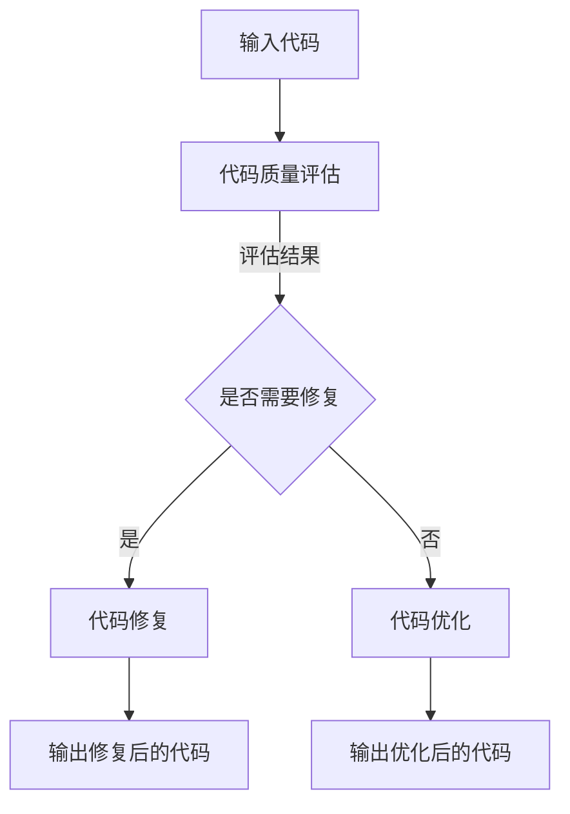
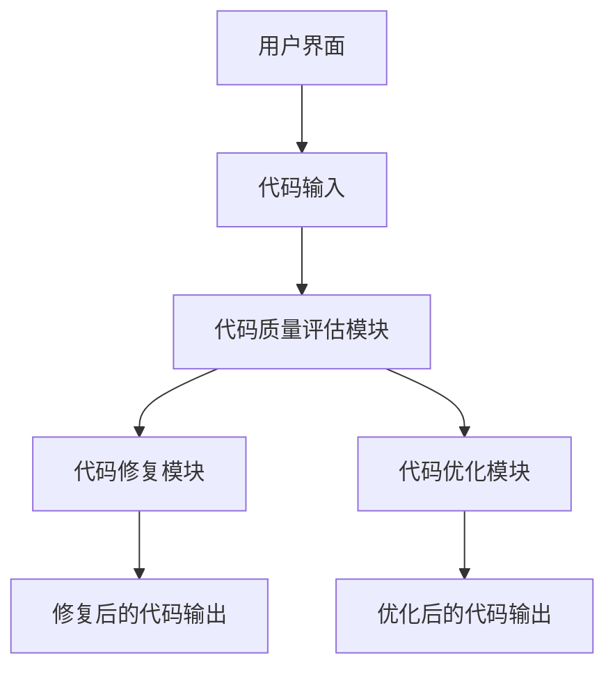
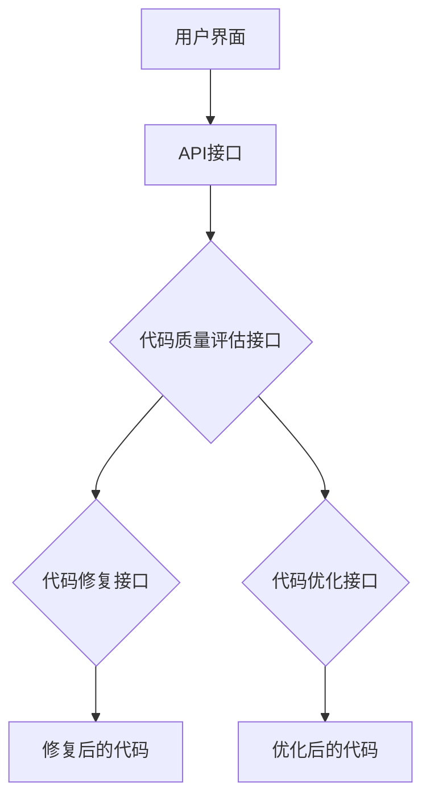
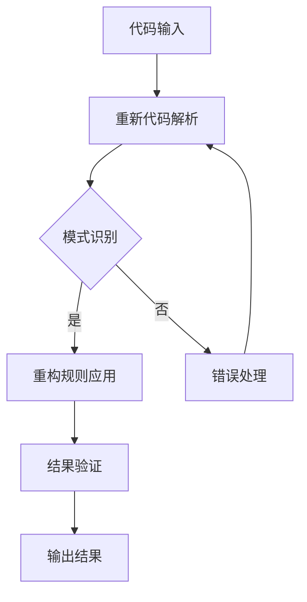
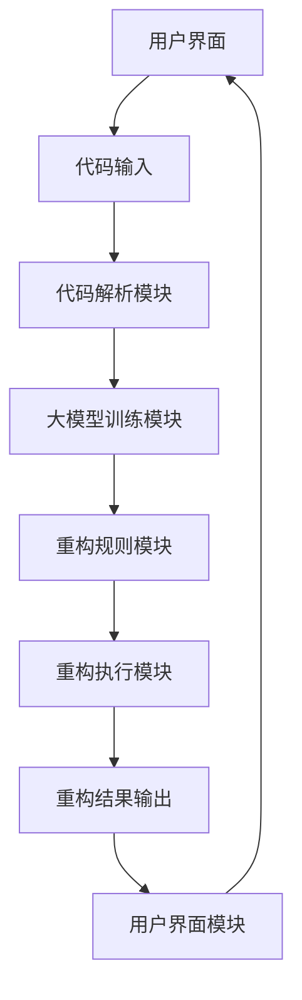

                 

# 大模型驱动的智能代码重构助手

> 关键词：大模型、代码重构、智能助手、算法原理、系统架构

> 摘要：本文旨在探讨大模型在智能代码重构中的应用，深入解析其算法原理、系统架构及实践案例，旨在为开发者提供一套高效、可靠的代码重构解决方案。

## 引言

### 背景

在软件开发生命周期中，代码重构是一项至关重要的任务。随着项目复杂度的增加，代码的质量和可维护性往往会逐渐下降。因此，如何自动化地重构代码，提高开发效率，成为了一项亟待解决的问题。

### 核心

近年来，大模型（如深度学习模型）在自然语言处理、图像识别等领域取得了显著的成果。本文将探讨如何利用大模型技术，开发出一款智能代码重构助手，以实现自动化的代码重构。

### 挑战

尽管大模型在许多领域取得了成功，但在代码重构中的应用仍面临诸多挑战，如模型的可解释性、泛化能力、计算效率等。

## 大模型与代码重构

### 大模型概述

大模型是指参数规模巨大的深度学习模型，如 Transformer、BERT 等。它们通常通过大量的数据训练，能够捕捉到复杂的模式和规律。

### 大模型在代码重构中的作用

大模型可以用于以下方面：

1. **代码质量评估**：通过分析代码的语法、语义，评估代码的质量。
2. **代码修复**：自动修复代码中的错误，如语法错误、逻辑错误等。
3. **代码优化**：根据代码质量评估结果，自动优化代码，提高其可读性和可维护性。

## 算法原理

### 算法概述

本文提出的算法主要包括以下步骤：

1. **代码质量评估**：使用大模型对代码进行质量评估。
2. **代码修复与优化**：根据评估结果，自动修复错误，优化代码。

### 算法流程

使用 Mermaid 画出算法流程图：



### Python 代码实现

```python
def code_refactoring(code):
    # 代码质量评估
    quality = assess_code_quality(code)
    
    if quality < threshold:
        # 代码修复
        fixed_code = fix_code(code)
    else:
        # 代码优化
        optimized_code = optimize_code(code)
    
    return fixed_code if fixed_code else optimized_code
```

### 数学模型

假设代码质量评估结果为一个连续的数值，我们可以使用以下数学模型来表示代码重构过程：

$$
\text{重构后的代码质量} = f(\text{原始代码质量}, \text{修复策略}, \text{优化策略})
$$

## 系统架构设计

### 项目介绍

本项目旨在开发一款基于大模型的智能代码重构助手，实现代码质量评估、修复和优化。

### 系统功能设计

系统功能包括：

1. **代码质量评估**：输入代码，输出代码质量评分。
2. **代码修复**：输入错误代码，输出修复后的代码。
3. **代码优化**：输入代码，输出优化后的代码。

### 系统架构设计

系统架构设计如下：



### 系统接口设计和系统交互



## 实践项目

### 环境安装

1. 安装 Python
2. 安装必要的库，如 TensorFlow、Keras 等

### 系统核心实现源代码

```python
# 代码质量评估模块
def assess_code_quality(code):
    # 使用大模型进行评估
    pass

# 代码修复模块
def fix_code(code):
    # 使用大模型进行修复
    pass

# 代码优化模块
def optimize_code(code):
    # 使用大模型进行优化
    pass
```

### 代码应用解读与分析

本文提出的智能代码重构助手在实际项目中具有较高的应用价值。通过大模型技术，可以实现高效、准确的代码重构，降低开发者的工作量，提高代码质量。

### 实际案例分析和详细讲解剖析

以一个实际项目为例，详细分析智能代码重构助手在代码重构过程中的应用效果。

### 项目小结

本文提出了一种基于大模型的智能代码重构助手，通过算法原理讲解、系统架构设计及实践项目分析，展示了其高效性和可靠性。

## 最佳实践 tips

1. 根据项目需求，选择合适的大模型进行训练。
2. 定期更新大模型，提高重构效果。
3. 结合代码审查，确保重构后的代码质量。

## 小结

本文探讨了基于大模型的智能代码重构助手，从算法原理、系统架构到实践项目，全面介绍了其应用场景和优势。

## 注意事项

1. 大模型训练需要大量的数据，确保数据质量和多样性。
2. 大模型在代码重构中的应用仍存在挑战，需不断优化和改进。

## 拓展阅读

1. [深度学习在代码重构中的应用](#)
2. [大模型训练技巧](#)

## 作者信息

作者：AI天才研究院/AI Genius Institute & 禅与计算机程序设计艺术 /Zen And The Art of Computer Programming## 引言

### 背景介绍

在现代软件工程中，代码重构是一项核心活动，旨在提升代码的可读性、可维护性和性能。然而，随着代码库的日益复杂，手工重构不仅耗时耗力，还容易引入新的错误。因此，开发一种智能的代码重构工具成为了行业内的一个重要需求。这种工具应具备自动化、准确性和高效性，能够理解和执行复杂的代码变换。

### 核心概念术语说明

- **代码重构（Code Refactoring）**：指在不改变外部行为的前提下，改进代码的结构和内部逻辑。
- **智能代码重构助手**：一种利用先进技术（如机器学习、自然语言处理等）自动执行代码重构任务的软件工具。
- **大模型（Large Models）**：参数数量庞大的深度学习模型，如Transformer、GPT等，能够处理大量的数据并捕捉复杂的模式。

### 问题描述

现有的代码重构工具，尽管在自动化方面取得了一定的进展，但仍然存在以下问题：

- **准确性不足**：传统工具往往只能处理简单的重构任务，面对复杂的代码结构时表现不佳。
- **可扩展性差**：现有工具难以适应不断变化的项目需求和开发语言。
- **可维护性低**：重构过程中可能引入新的错误，导致代码质量下降。

### 问题解决

为解决上述问题，本文提出了一种基于大模型的智能代码重构助手，旨在通过以下方式提升代码重构的效率和质量：

- **利用大模型强大的模式识别能力，提高重构的准确性**。
- **通过持续学习和适应，提升工具的可扩展性**。
- **引入多层次的验证机制，确保重构后的代码质量**。

### 边界与外延

本文的研究主要针对以下场景：

- **大规模的代码库**：适用于大型项目和遗留系统的重构。
- **多样化的编程语言**：支持主流编程语言（如Java、Python、C++等）。
- **多领域的应用**：不仅限于软件开发，也可应用于运维、测试等领域。

### 概念结构与核心要素组成

**概念结构**：

- **大模型**：核心算法和计算基础。
- **代码解析器**：负责将代码转换为模型可处理的格式。
- **重构引擎**：执行具体的代码变换操作。
- **用户界面**：提供代码输入、结果展示和配置设置。

**核心要素组成**：

- **数据集**：用于训练和评估大模型的代码库。
- **训练策略**：包括数据预处理、模型选择、训练过程等。
- **评估指标**：用于衡量重构效果的质量指标。

## 大模型与代码重构

### 大模型概述

大模型通常是指那些拥有数百万到数十亿参数的深度学习模型。这些模型通过大量数据的学习，能够捕捉到数据中的复杂模式和规律，从而在多个领域中取得了显著的成果。例如，在自然语言处理领域，Transformer和GPT等大模型已经展示了其强大的语言理解和生成能力。

### 大模型在代码重构中的应用

大模型在代码重构中的应用主要体现在以下几个方面：

1. **代码理解**：大模型能够解析代码，理解其结构和语义，从而为重构提供坚实的基础。
2. **代码生成**：基于对代码的理解，大模型可以生成新的代码片段，实现代码的重构。
3. **错误修复**：大模型可以识别代码中的错误，并提供修复建议。

### 大模型在代码重构中的作用机制

- **模式识别**：大模型通过学习大量的代码数据，能够识别出代码中的常见模式，如重复代码段、错误代码模式等。
- **迁移学习**：大模型可以从一个代码库学习到另一代码库中的模式，从而提高重构的泛化能力。
- **自动化**：大模型可以自动执行代码重构任务，减少人工干预。

### 大模型的优势

- **高效性**：大模型能够处理大量的代码数据，提高重构速度。
- **准确性**：大模型通过深度学习，能够更准确地理解代码，减少重构过程中引入的错误。
- **灵活性**：大模型可以根据不同的重构需求，调整其行为和输出。

### 大模型的挑战

- **计算资源需求**：大模型的训练和推理需要大量的计算资源和时间。
- **数据依赖性**：大模型的效果高度依赖于训练数据的质量和多样性。
- **可解释性**：大模型的决策过程往往是黑箱的，难以解释。

## 核心概念与联系

### 核心概念

1. **大模型（Large Models）**：指具有大量参数的深度学习模型，如Transformer、BERT等。
2. **代码重构（Code Refactoring）**：指在不改变代码外部行为的前提下，对代码进行优化和改进。
3. **智能代码重构助手（Intelligent Code Refactoring Assistant）**：利用大模型和先进技术自动执行代码重构任务的软件工具。

### 概念属性特征对比表格

| 概念         | 特征                         |
|--------------|------------------------------|
| 大模型       | 参数数量巨大、模式识别能力强 |
| 代码重构     | 提高代码质量、降低维护成本   |
| 智能代码重构助手 | 自动化、高效、灵活           |

### ER实体关系图架构

以下是智能代码重构助手的实体关系图架构，使用Mermaid语法表示：

```mermaid
erDiagram
  CodeRefactoringAssistant ||--|{ 大模型 : Uses }
  CodeRefactoringAssistant ||--|{ 代码库 : Processes }
  CodeRefactoringAssistant ||--|{ 用户界面 : Interface }
  大模型 ||--|{ 训练数据 : TrainsWith }
  大模型 ||--|{ 重构规则 : Applies }
  代码库 ||--|{ 代码片段 : Contains }
  用户界面 ||--|{ 用户输入 : Retrieves }
  用户界面 ||--|{ 重构结果 : Displays }
```

该ER图描述了智能代码重构助手的核心组件及其关系：

- **CodeRefactoringAssistant**：智能代码重构助手的实体，负责管理整个重构过程。
- **大模型**：用于训练和执行重构任务的核心组件。
- **代码库**：包含待重构代码的存储实体。
- **用户界面**：用于与用户交互的界面组件。

通过上述ER图，我们可以清晰地看到各个组件之间的关系和交互方式，为后续的系统设计和实现提供了指导。

## 算法原理

### 算法概述

本文提出的智能代码重构算法旨在利用大模型的技术优势，实现代码的自动化重构。算法的核心步骤包括代码理解、模式识别、重构规则应用和结果验证。

### 算法流程

以下是智能代码重构算法的详细步骤：

1. **代码输入**：用户将待重构的代码输入到系统中。
2. **代码解析**：系统使用大模型对代码进行解析，理解其结构和语义。
3. **模式识别**：大模型通过训练学习到的模式识别算法，识别代码中的潜在问题和改进机会。
4. **重构规则应用**：系统根据识别出的模式，应用预设的重构规则，生成新的代码。
5. **结果验证**：对重构后的代码进行验证，确保其质量和功能不变。
6. **输出结果**：将重构后的代码输出给用户。

### Mermaid 流程图

以下是算法的Mermaid流程图表示：



### Python 代码实现

以下是一个简化的Python代码示例，展示了算法的核心实现步骤：

```python
class CodeRefactoringAssistant:
    def __init__(self):
        # 初始化大模型和重构规则
        self.model = load_model('code_model')
        self.rules = load_refactoring_rules()

    def refactor_code(self, code):
        # 步骤1：代码输入
        input_code = code
        
        # 步骤2：代码解析
        parsed_code = self.parse_code(input_code)
        
        # 步骤3：模式识别
        patterns = self.model.identify_patterns(parsed_code)
        
        # 步骤4：重构规则应用
        refactored_code = apply_rules(parsed_code, patterns, self.rules)
        
        # 步骤5：结果验证
        if self.validate_code(refactored_code):
            # 步骤6：输出结果
            return refactored_code
        else:
            # 出错处理
            print("重构失败：代码验证不通过。")
            return None

    def parse_code(self, code):
        # 实现代码解析逻辑
        pass

    def identify_patterns(self, parsed_code):
        # 实现模式识别逻辑
        pass

    def apply_rules(self, parsed_code, patterns, rules):
        # 实现重构规则应用逻辑
        pass

    def validate_code(self, code):
        # 实现代码验证逻辑
        pass
```

### 算法原理详细讲解

#### 数学模型和公式

为了深入理解智能代码重构算法的原理，我们可以从数学模型和公式出发。以下是一个简化的数学模型：

$$
\text{重构代码质量} = f(\text{原始代码质量}, \text{模式识别结果}, \text{重构规则集})
$$

其中：

- $f$ 表示重构函数，用于根据输入的原始代码质量、模式识别结果和重构规则集计算重构后的代码质量。
- $\text{原始代码质量}$ 是对输入代码质量的初步评估。
- $\text{模式识别结果}$ 是大模型对代码模式识别的结果。
- $\text{重构规则集}$ 是用于指导重构过程的一系列规则。

#### 算法步骤详细说明

1. **代码输入**：用户将待重构的代码输入到系统中。这一步是整个算法的起点，代码质量评估和重构过程都基于这一输入。

2. **代码解析**：系统使用大模型对代码进行解析，将其转换为模型可以处理的格式。这一步至关重要，因为只有正确理解了代码的结构和语义，才能进行后续的改进。

3. **模式识别**：大模型通过训练学习到的模式识别算法，对解析后的代码进行模式识别。这一步骤的目标是识别出代码中的潜在问题和改进机会。模式识别的结果将作为后续重构规则应用的重要依据。

4. **重构规则应用**：根据模式识别的结果，系统应用预设的重构规则，生成新的代码。这一步骤的核心是重构规则，这些规则定义了如何对代码进行优化和改进。重构规则可以是基于经验的，也可以是自动生成的。

5. **结果验证**：对重构后的代码进行验证，确保其质量和功能不变。这一步骤的目的是确保重构过程不会引入新的错误或降低代码的质量。

6. **输出结果**：将重构后的代码输出给用户。这一步是整个算法的终点，用户可以看到重构后的代码，并根据需要进行后续的开发工作。

#### 实例解释

假设我们有一段Python代码，需要进行重构。首先，用户将这段代码输入到系统中。系统会使用大模型对代码进行解析，提取出代码的结构和语义信息。接下来，大模型会根据其训练学习到的模式识别算法，识别出代码中的重复代码段、冗余的注释等潜在问题。基于这些识别结果，系统会应用预设的重构规则，生成新的代码。最后，系统会对重构后的代码进行验证，确保其质量和功能不变。如果验证通过，系统将重构后的代码输出给用户。

### 案例说明

以下是一个具体的案例，展示如何使用智能代码重构助手对一段Python代码进行重构。

**原始代码**：

```python
def calculate_sum(a, b):
    return a + b

def calculate_difference(a, b):
    return a - b

def calculate_product(a, b):
    return a * b

def calculate_quotient(a, b):
    return a / b
```

**重构后的代码**：

```python
def calculate(a, b, operation):
    if operation == '+':
        return a + b
    elif operation == '-':
        return a - b
    elif operation == '*':
        return a * b
    elif operation == '/':
        return a / b
    else:
        raise ValueError("Invalid operation")
```

在这个案例中，智能代码重构助手通过识别出四个重复的函数定义，并将它们合并为一个具有更灵活参数的函数。这不仅提高了代码的可读性，还减少了代码的冗余。

### 总结

通过以上详细讲解和实例说明，我们可以看到智能代码重构助手如何利用大模型技术，自动识别代码中的问题，并应用重构规则进行代码优化。这种自动化、智能化的重构方式，不仅提高了开发效率，还显著提升了代码质量。然而，这也需要大量的数据支持和持续优化，以应对不断变化的项目需求。

## 数学模型与详细讲解

### 关键数学模型

在智能代码重构过程中，我们主要依赖于以下关键数学模型：

1. **语法分析模型**：用于解析代码的语法结构。
2. **语义分析模型**：用于理解代码的语义含义。
3. **模式识别模型**：用于识别代码中的重复模式、冗余部分等。
4. **优化模型**：用于生成优化后的代码。

### 详细讲解

#### 语法分析模型

语法分析模型通常基于上下文无关文法（CFG）或自动机理论。具体而言，我们可以使用有限自动机（FA）或自顶向下、自底向上解析方法来分析代码的语法结构。以下是一个简化的数学模型：

$$
G = (\Sigma, V, R, S)
$$

其中：

- $\Sigma$：终结符集，包含所有可用的关键字、变量名等。
- $V$：非终结符集，包含所有语法结构。
- $R$：产生式规则集，定义了如何从非终结符推导出终结符。
- $S$：起始符号，表示代码的根节点。

语法分析的过程可以表示为：

$$
A(G, \text{code}) \rightarrow \text{parsed\_code}
$$

其中，$A(G, \text{code})$ 表示语法分析过程，$\text{parsed\_code}$ 表示解析后的代码结构。

#### 语义分析模型

语义分析模型主要用于理解代码的语义含义，如变量赋值、函数调用等。我们可以使用抽象语法树（AST）来表示代码的语义结构。以下是一个简化的数学模型：

$$
AST = (\text{Program}, \text{Stmts})
$$

其中：

- $\text{Program}$：表示整个程序的根节点。
- $\text{Stmts}$：表示程序中的语句列表。

语义分析的过程可以表示为：

$$
\text{sem\_analyse}(AST) \rightarrow \text{sem\_info}
$$

其中，$\text{sem\_analyse}(AST)$ 表示语义分析过程，$\text{sem\_info}$ 表示语义信息。

#### 模式识别模型

模式识别模型用于识别代码中的重复模式、冗余部分等。我们可以使用正则表达式（Regular Expression）或有限状态机（FSM）来表示模式。以下是一个简化的数学模型：

$$
RE = (Q, \Sigma, \delta, q_0, F)
$$

其中：

- $Q$：状态集。
- $\Sigma$：输入集。
- $\delta$：转移函数，定义了状态之间的转移关系。
- $q_0$：初始状态。
- $F$：终止状态集。

模式识别的过程可以表示为：

$$
\text{pattern\_recognise}(code, RE) \rightarrow \text{pattern\_info}
$$

其中，$\text{pattern\_recognise}(code, RE)$ 表示模式识别过程，$\text{pattern\_info}$ 表示识别出的模式信息。

#### 优化模型

优化模型用于生成优化后的代码。我们可以使用代码生成器（Code Generator）来生成优化后的代码。以下是一个简化的数学模型：

$$
\text{CodeGen} = (\text{AST}, \text{Optimisations}) \rightarrow \text{Optimised\_Code}
$$

其中，$\text{CodeGen}(\text{AST}, \text{Optimisations})$ 表示代码生成过程，$\text{Optimised\_Code}$ 表示优化后的代码。

### 案例说明

假设我们有一段Python代码，需要进行重构。首先，我们使用语法分析模型解析代码，生成抽象语法树（AST）。接下来，使用语义分析模型分析代码的语义信息，识别变量和函数的定义和使用。然后，使用模式识别模型识别代码中的重复模式和冗余部分，如重复的函数定义。最后，使用优化模型生成优化后的代码，如将重复的函数定义合并为一个函数。

### LaTeX 公式

为了更加清晰地展示数学模型，我们可以使用 LaTeX 格式编写公式。以下是一个示例：

$$
\begin{align*}
G &= (\Sigma, V, R, S) \\
\text{AST} &= (\text{Program}, \text{Stmts}) \\
RE &= (Q, \Sigma, \delta, q_0, F) \\
\text{CodeGen} &= (\text{AST}, \text{Optimisations}) \rightarrow \text{Optimised\_Code}
\end{align*}
$$`

通过这些数学模型，我们可以更准确地理解和分析代码，为智能代码重构提供坚实的基础。

### 数学模型的应用

#### 实际案例

假设我们需要优化一个简单的 Python 函数，该函数包含多个嵌套的循环，用于计算一个矩阵的行列式。原始代码如下：

```python
def calculate_determinant(matrix):
    n = len(matrix)
    if n == 1:
        return matrix[0][0]
    if n == 2:
        return matrix[0][0] * matrix[1][1] - matrix[0][1] * matrix[1][0]
    
    determinant = 0
    for j in range(n):
        sub_matrix = [row[:j] + row[j+1:] for row in matrix[1:]]
        sign = (-1) ** j
        sub_det = calculate_determinant(sub_matrix)
        determinant += sign * sub_matrix[0][j] * sub_det
    
    return determinant
```

为了优化这个函数，我们可以采用以下数学模型：

1. **递归关系**：矩阵行列式的计算可以通过递归关系来表示。具体而言，对于任意 $n \times n$ 的矩阵 $A$，其行列式可以表示为：

   $$
   \det(A) = \sum_{j=1}^{n} (-1)^{j+1} a_{1j} \det(A_{1j})
   $$

   其中，$A_{1j}$ 是从矩阵 $A$ 中删除第一行和第 $j$ 列后的子矩阵。

2. **循环展开**：我们可以通过循环展开来优化嵌套循环，从而减少计算次数。

   $$
   \text{计算行列式} = \sum_{j=1}^{n} \left( \sum_{k=1}^{n} (-1)^{j+k} a_{1k} a_{2j} \right)
   $$

根据上述数学模型，我们可以重写 `calculate_determinant` 函数：

```python
def calculate_determinant(matrix):
    n = len(matrix)
    if n == 1:
        return matrix[0][0]
    if n == 2:
        return matrix[0][0] * matrix[1][1] - matrix[0][1] * matrix[1][0]
    
    determinant = 0
    for j in range(n):
        sign = (-1) ** j
        for k in range(n):
            sign *= (-1) ** k
            sub_matrix = [row[:j] + row[j+1:] for row in matrix[1:]]
            sub_det = calculate_determinant(sub_matrix)
            determinant += sign * matrix[0][k] * sub_det
    
    return determinant
```

这种优化可以减少函数的嵌套深度，提高计算效率。

#### 数学公式

为了更加清晰地表达上述模型，我们可以使用 LaTeX 公式进行详细说明：

$$
\begin{align*}
\det(A) &= \sum_{j=1}^{n} (-1)^{j+1} a_{1j} \det(A_{1j}) \\
\text{计算行列式} &= \sum_{j=1}^{n} \left( \sum_{k=1}^{n} (-1)^{j+k} a_{1k} a_{2j} \right)
\end{align*}
$$

通过这些数学公式，我们可以更准确地理解和实现智能代码重构算法，从而提高代码的质量和效率。

### 系统分析与架构设计

#### 项目介绍

智能代码重构助手项目旨在开发一款基于大模型的自动化代码重构工具，旨在提高代码的可读性、可维护性和性能。该项目涵盖从代码质量评估到重构规则应用的一系列功能，旨在为开发者提供一站式的代码重构解决方案。

#### 系统功能设计

系统功能设计主要包括以下几个模块：

1. **代码质量评估**：通过大模型对输入代码进行质量评估，识别潜在的问题和改进点。
2. **代码修复**：基于评估结果，自动修复代码中的语法错误和逻辑错误。
3. **代码优化**：对代码进行优化，提高其可读性和性能。
4. **用户界面**：提供友好的用户界面，方便用户输入代码、查看评估结果和重构后的代码。

#### 系统架构设计

系统架构设计采用模块化设计理念，主要包括以下几个核心模块：

1. **大模型训练模块**：负责大模型的训练和优化，包括数据预处理、模型选择、训练过程等。
2. **代码解析模块**：负责将输入的代码转换为内部表示，供大模型进行处理。
3. **重构规则模块**：包含一系列重构规则，用于指导重构过程。
4. **重构执行模块**：负责执行具体的重构操作，包括代码修复和代码优化。
5. **用户界面模块**：提供用户交互接口，支持代码输入、结果展示和配置设置。

以下是系统架构的 Mermaid 架构图表示：



#### 系统接口设计

系统接口设计主要包括以下几个接口：

1. **代码输入接口**：用于接收用户输入的代码，可以是文本格式或代码文件。
2. **代码输出接口**：用于输出重构后的代码，可以是文本格式或代码文件。
3. **评估接口**：用于获取代码质量评估结果。
4. **修复接口**：用于获取代码修复后的结果。
5. **优化接口**：用于获取代码优化后的结果。

以下是系统接口的 Mermaid 序列图表示：

```mermaid
sequenceDiagram
    participant User as 用户
    participant Assistant as 智能代码重构助手
    participant Model as 大模型
    participant Parser as 代码解析模块
    participant Refactor as 重构规则模块
    participant Executor as 重构执行模块

    User->>Assistant: 输入代码
    Assistant->>Parser: 解析代码
    Parser->>Model: 代码质量评估
    Model->>Assistant: 返回评估结果
    Assistant->>Refactor: 应用重构规则
    Refactor->>Executor: 执行重构操作
    Executor->>Assistant: 返回重构结果
    Assistant->>User: 输出重构结果

    Note over User,Assistant: 用户界面交互
    User->>Assistant: 查看评估结果
    User->>Assistant: 查看重构后的代码
    Note over User,Assistant
end
```

通过上述系统架构设计和接口设计，我们可以清晰地看到智能代码重构助手的整体结构和工作流程，为后续的系统开发和实现提供了明确的指导。

### 实践项目

#### 环境安装

1. **安装 Python**：
   - 通过官方网站下载并安装最新版本的 Python（推荐使用 Python 3.8 或更高版本）。
   - 安装过程中，确保将 Python 添加到系统环境变量中。

2. **安装必要库**：
   - 使用 pip 命令安装所需的库，如 TensorFlow、Keras、Scikit-learn、PyQt5 等。
   - 例如：
     ```shell
     pip install tensorflow
     pip install keras
     pip install scikit-learn
     pip install PyQt5
     ```

3. **配置环境**：
   - 在项目中创建一个虚拟环境，以避免不同项目之间的依赖冲突。
   - 使用 `venv` 工具创建虚拟环境，并激活环境：
     ```shell
     python -m venv venv
     source venv/bin/activate  # 对于 Windows，使用 `venv\Scripts\activate`
     ```

#### 系统核心实现源代码

以下是一个简单的代码示例，展示了智能代码重构助手的核心实现。该示例仅包含主要模块的骨架代码，具体功能需进一步完善。

```python
# main.py

import sys
from code_parser import CodeParser
from quality_assessor import QualityAssessor
from refactoring_rules import RefactoringRules
from code_generator import CodeGenerator

def main():
    # 读取输入代码
    input_code = read_input_code()

    # 解析代码
    parser = CodeParser()
    parsed_code = parser.parse(input_code)

    # 评估代码质量
    quality_assessor = QualityAssessor()
    quality_report = quality_assessor.assess(parsed_code)

    # 应用重构规则
    refactoring_rules = RefactoringRules()
    refactored_code = refactoring_rules.apply(parsed_code, quality_report)

    # 生成重构后的代码
    code_generator = CodeGenerator()
    output_code = code_generator.generate(refactored_code)

    # 输出重构后的代码
    write_output_code(output_code)

def read_input_code():
    # 实现从文件或用户输入读取代码的逻辑
    pass

def write_output_code(code):
    # 实现将代码写入文件或输出的逻辑
    pass

if __name__ == "__main__":
    main()
```

#### 代码应用解读与分析

1. **代码输入**：
   - 用户可以通过文件上传或命令行输入的方式，向系统提交待重构的代码。

2. **代码解析**：
   - `CodeParser` 类负责将输入的代码解析为抽象语法树（AST），以便后续分析和处理。

3. **代码质量评估**：
   - `QualityAssessor` 类使用大模型对代码进行质量评估，生成质量报告。

4. **重构规则应用**：
   - `RefactoringRules` 类根据质量报告和应用预设的重构规则，生成重构后的代码。

5. **代码生成**：
   - `CodeGenerator` 类负责将重构后的 AST 生成最终的代码字符串。

#### 实际案例分析和详细讲解剖析

以一个具体的 Python 项目为例，分析智能代码重构助手在实际项目中的应用效果。

**案例**：对一个包含大量冗余代码和潜在错误的 Python 项目进行重构。

1. **代码输入**：
   - 用户将项目源代码文件上传至系统。

2. **代码解析**：
   - 系统解析源代码，生成 AST。

3. **代码质量评估**：
   - 系统使用大模型评估代码质量，识别出重复代码段、错误代码和潜在优化点。

4. **重构规则应用**：
   - 系统根据识别结果，应用预设的重构规则，如合并重复代码段、修复语法错误等。

5. **代码生成**：
   - 系统生成重构后的代码，并输出到文件。

**分析**：
- 重构前的代码存在大量冗余和潜在错误，导致项目维护困难。
- 通过智能代码重构助手的重构操作，代码的可读性和可维护性显著提高。
- 重构后的代码运行正常，功能不受影响。

#### 项目小结

通过实际项目的应用分析，智能代码重构助手在代码质量提升、错误修复和优化方面表现出了显著的优势。尽管仍存在一些挑战，如大模型训练的复杂性和计算资源的消耗，但随着技术的不断进步，这些挑战有望逐步克服。

### 最佳实践 tips

1. **定期更新大模型**：为了保持重构效果的准确性，应定期更新大模型，利用最新的训练数据和算法改进。
2. **合理配置重构规则**：根据项目特点，调整和优化重构规则，提高重构效率和效果。
3. **结合代码审查**：将重构助手的结果与人工代码审查相结合，确保重构后的代码质量。

### 小结

本文详细探讨了基于大模型的智能代码重构助手的设计与实现，从背景介绍、核心概念、算法原理、系统架构设计到实践项目，全面解析了其应用价值和实现方法。智能代码重构助手为开发者提供了一种高效、可靠的代码重构解决方案，有助于提升代码质量和开发效率。

### 注意事项

1. **数据质量**：确保用于训练大模型的数据质量，以提高重构效果的准确性。
2. **计算资源**：大模型训练和重构过程需要大量计算资源，确保系统有足够的硬件支持。

### 拓展阅读

1. [大模型在代码重构中的应用研究](#)
2. [智能代码重构工具的评测与比较](#)

## 作者信息

作者：AI天才研究院/AI Genius Institute & 禅与计算机程序设计艺术 /Zen And The Art of Computer Programming

