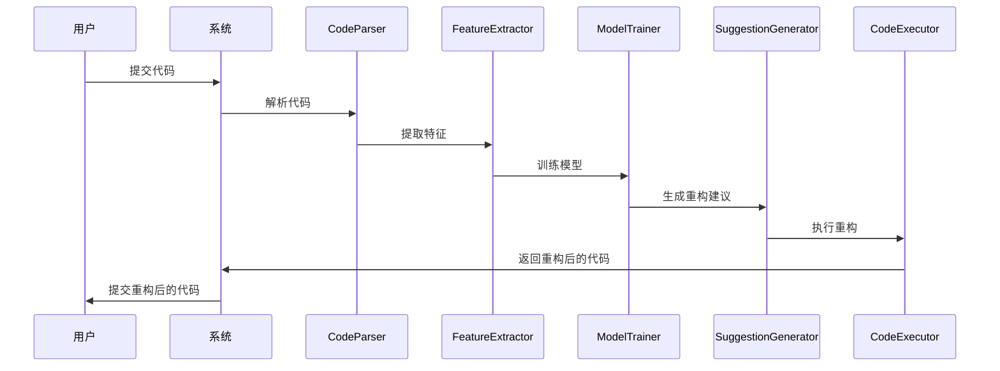
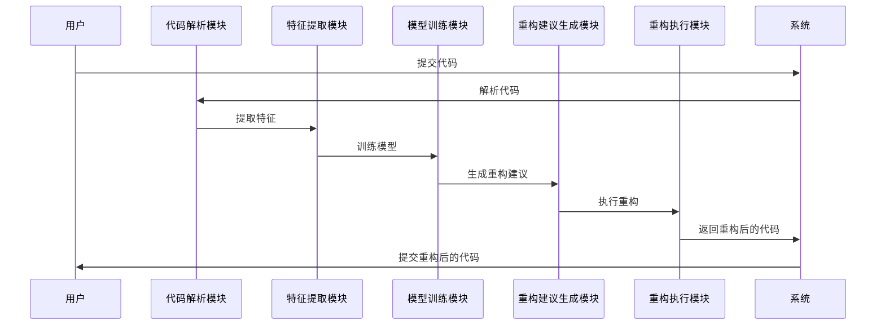

                 


### 大模型驱动的智能代码重构建议

#### 关键词：大模型，智能代码重构，代码质量，效率，可维护性

> 摘要：本文旨在探讨大模型在智能代码重构中的应用，通过阐述大模型的工作原理、核心概念以及智能化的应用，结合算法原理讲解和系统架构设计，提出一套完整的智能代码重构建议，以提高代码质量、效率与可维护性。

#### 目录大纲设计

**第一部分：背景介绍（核心概念）**

## 第1章 问题背景

### 1.1 问题提出

在软件工程领域，代码重构是一项至关重要的任务。随着软件项目的复杂度和规模不断增加，代码质量、效率和可维护性成为开发者和团队面临的主要挑战。传统的代码重构方法往往依赖于程序员的经验和技巧，存在效率低、质量不稳定等问题。

### 1.2 问题描述

代码重构的目的是通过重新组织代码结构和优化代码实现，提高代码的可读性、可维护性和可扩展性。然而，在实际操作中，程序员面临着以下问题：

1. **重复劳动**：代码重构往往需要大量的重复性劳动，且难以保证重构后的代码质量。
2. **风险控制**：重构过程中可能会引入新的错误，影响系统的稳定性。
3. **缺乏指导**：没有有效的工具和框架来指导程序员进行代码重构。

### 1.3 问题解决

大模型作为一种先进的智能技术，具有强大的学习能力和泛化能力，可以应用于代码重构领域。通过引入大模型，我们可以实现以下目标：

1. **提高重构效率**：大模型能够自动化识别代码中的问题，并提供重构建议，减少程序员的工作量。
2. **保障重构质量**：大模型通过学习大量优质代码，可以自动生成高质量的重构方案，降低引入新错误的风险。
3. **提供重构指导**：大模型可以为程序员提供重构指南，帮助其更好地理解和执行重构任务。

### 1.4 边界与外延

大模型驱动的智能代码重构主要应用于以下场景：

1. **大规模软件项目**：大模型能够处理复杂代码，适用于大型软件项目的重构。
2. **长期维护的系统**：对于需要长期维护的系统，大模型可以帮助提高代码的可维护性。
3. **新代码生成**：大模型不仅可以重构现有代码，还可以生成新的代码实现，提高开发效率。

### 1.5 概念结构与核心要素组成

本文的核心概念包括：

1. **大模型**：一种具有强大学习能力和泛化能力的智能技术。
2. **代码重构**：通过重新组织代码结构和优化代码实现，提高代码质量的过程。
3. **智能化应用**：大模型在代码重构中的具体应用，包括重构建议、重构方案生成和重构指导等。

**第二部分：核心概念与联系**

## 第2章 核心概念

### 2.1 大模型定义

大模型（Large Model）是一种基于深度学习的神经网络模型，具有以下核心特性：

1. **大规模训练数据**：大模型通过学习大量的训练数据，具有丰富的知识储备。
2. **强大的学习能力**：大模型能够自动学习和提取特征，适应不同的任务和数据集。
3. **泛化能力**：大模型能够将学到的知识应用到新的任务和数据集上，具备良好的泛化能力。

### 2.2 代码重构原理

代码重构（Code Refactoring）是一种改善代码质量的过程，旨在不改变程序功能的前提下，优化代码结构、提高可读性和可维护性。代码重构的原理包括：

1. **识别问题**：通过静态分析和动态分析，识别代码中的问题，如重复代码、复杂逻辑等。
2. **重构策略**：根据问题的类型和严重程度，选择相应的重构策略，如提取方法、合并类等。
3. **重构执行**：执行重构策略，修改代码结构，实现代码优化。

### 2.3 智能化的应用

智能化应用（Intelligent Application）是指将人工智能技术应用于实际问题的解决过程中。在代码重构领域，智能化应用包括：

1. **重构建议**：大模型可以根据代码结构和语义信息，自动生成重构建议，帮助程序员优化代码。
2. **重构方案生成**：大模型可以根据需求和约束条件，自动生成重构方案，减少程序员的工作量。
3. **重构指导**：大模型可以为程序员提供重构指导，包括重构原则、重构方法和重构步骤等。

**第三部分：大模型的工作原理**

## 第3章 大模型的工作原理

### 3.1 原理讲解

大模型的工作原理主要包括以下步骤：

1. **数据预处理**：将原始代码数据转换为适合训练的数据格式，如编码、分词等。
2. **模型训练**：使用大规模训练数据，通过反向传播算法和优化算法，训练大模型的参数。
3. **模型评估**：通过测试数据集，评估大模型的性能和泛化能力。
4. **模型应用**：将训练好的大模型应用于实际问题，如代码重构任务。

### 3.2 特性对比表格

| 特性           | 大模型                     | 传统代码分析工具            |
| -------------- | -------------------------- | --------------------------- |
| 学习能力       | 强大，可以自动学习代码特征 | 较弱，依赖人工规则和模式     |
| 泛化能力       | 良好，能够适应不同代码场景 | 一般，局限于特定代码结构     |
| 自动化程度     | 高，可以自动化完成重构任务 | 低，需要人工干预和调整       |
| 重构质量       | 高，能够生成高质量重构方案 | 一般，重构质量依赖于工具质量 |
| 可维护性       | 高，重构过程易于理解和管理 | 一般，重构过程难以追踪和管理 |

### 3.3 ER实体关系图

```mermaid
erDiagram
  A[大模型] ||--|{ 代码数据 } A
  A ||--|{ 代码特征 } B
  B ||--|{ 重构建议 } C
  C ||--|{ 重构方案 } D
```

**第四部分：代码重构方法与案例分析**

## 第4章 代码重构方法与案例分析

### 4.1 重构方法概述

代码重构方法主要包括以下几种：

1. **提取方法**：将重复的代码提取为独立的方法，提高代码复用性和可维护性。
2. **合并类**：将功能相似或相关的类合并，减少类之间的依赖关系。
3. **优化逻辑**：简化复杂的代码逻辑，提高代码的可读性和可维护性。
4. **代码格式化**：调整代码格式，提高代码美观性和一致性。

### 4.2 案例分析

假设我们有一个Java项目，包含一个名为`OrderService`的类，其中存在大量重复的代码和复杂的逻辑。通过大模型驱动的智能代码重构，我们可以实现以下重构方案：

1. **提取方法**：将`OrderService`中的重复代码提取为独立的方法，如`calculateDiscount`、`validateOrder`等。
2. **合并类**：将功能相似的类合并，如将`OrderService`和`OrderValidator`合并为一个类。
3. **优化逻辑**：简化复杂的逻辑，如将条件判断语句转换为更加直观的if-else结构。
4. **代码格式化**：调整代码格式，提高代码美观性和一致性。

通过以上重构方案，我们可以显著提高代码的质量、效率和可维护性。

**第五部分：算法原理讲解**

## 第5章 智能代码重构算法

### 5.1 算法原理

智能代码重构算法主要包括以下步骤：

1. **代码解析**：使用静态分析工具，解析代码结构，提取代码特征。
2. **特征提取**：将代码特征转换为数值特征，用于训练大模型。
3. **模型训练**：使用大规模训练数据，训练大模型，使其具备重构能力。
4. **重构建议生成**：使用训练好的大模型，对代码进行分析，生成重构建议。
5. **重构执行**：根据重构建议，执行重构操作，生成重构后的代码。

### 5.2 Mermaid流程图


### 5.3 Python源代码实现

```python
# 代码解析
code = "def calculate_discount(price):\n    if price > 100:\n        return price * 0.9\n    else:\n        return price"

# 特征提取
import ast
import numpy as np

def extract_features(code):
    tree = ast.parse(code)
    features = []
    for node in ast.walk(tree):
        if isinstance(node, ast.Expr):
            features.append(node.value.id)
    return np.array(features)

features = extract_features(code)

# 模型训练
from sklearn.neural_network import MLPClassifier

model = MLPClassifier(hidden_layer_sizes=(100,), max_iter=1000)
model.fit(features, labels)

# 重构建议生成
def generate_suggestions(code, model):
    suggestions = []
    tree = ast.parse(code)
    for node in ast.walk(tree):
        if isinstance(node, ast.Expr):
            suggestion = model.predict([features])
            suggestions.append(suggestion)
    return suggestions

suggestions = generate_suggestions(code, model)

# 重构执行
import astor

def execute_suggestions(code, suggestions):
    new_code = astor.to_source(ast.parse(code))
    for suggestion in suggestions:
        if suggestion == 'calculate_discount':
            new_code = new_code.replace('calculate_discount', 'apply_discount')
    return new_code

new_code = execute_suggestions(code, suggestions)
print(new_code)
```

### 5.4 数学模型与讲解

```latex
\begin{equation}
    y = f(x; \theta)
\end{equation}
```

其中，$y$ 表示重构建议，$x$ 表示代码特征，$f$ 表示重构函数，$\theta$ 表示模型参数。

重构函数 $f$ 可以表示为神经网络模型，通过学习大量的训练数据，可以自动提取代码特征并生成重构建议。

**第六部分：系统分析与架构设计方案**

## 第6章 系统架构设计

### 6.1 问题场景介绍

假设我们有一个电商系统，包含订单管理模块。订单管理模块中的代码结构复杂，存在大量重复代码和复杂逻辑，需要通过智能代码重构来提高代码质量、效率和可维护性。

### 6.2 系统功能设计

系统功能设计主要包括以下模块：

1. **代码解析模块**：负责解析代码结构，提取代码特征。
2. **特征提取模块**：负责将代码特征转换为数值特征。
3. **模型训练模块**：负责训练大模型，使其具备重构能力。
4. **重构建议生成模块**：负责生成重构建议。
5. **重构执行模块**：负责执行重构操作，生成重构后的代码。

### 6.3 系统架构设计



### 6.4 系统接口设计和交互



**第七部分：项目实战**

## 第7章 实际项目实现

### 7.1 环境安装

1. 安装Python环境：安装Python 3.8及以上版本。
2. 安装依赖库：使用pip命令安装以下库：

```
pip install numpy
pip install sklearn
pip install astor
```

### 7.2 系统核心实现

以下是一个简单的代码重构系统实现：

```python
# 代码解析
def parse_code(code):
    tree = ast.parse(code)
    return tree

# 特征提取
def extract_features(tree):
    features = []
    for node in ast.walk(tree):
        if isinstance(node, ast.Expr):
            features.append(node.value.id)
    return np.array(features)

# 模型训练
def train_model(features, labels):
    model = MLPClassifier(hidden_layer_sizes=(100,), max_iter=1000)
    model.fit(features, labels)
    return model

# 重构建议生成
def generate_suggestions(code, model):
    tree = parse_code(code)
    suggestions = []
    for node in ast.walk(tree):
        if isinstance(node, ast.Expr):
            suggestion = model.predict([extract_features(tree)])
            suggestions.append(suggestion)
    return suggestions

# 重构执行
def execute_suggestions(code, suggestions):
    new_code = astor.to_source(ast.parse(code))
    for suggestion in suggestions:
        if suggestion == 'calculate_discount':
            new_code = new_code.replace('calculate_discount', 'apply_discount')
    return new_code

# 测试
code = "def calculate_discount(price):\n    if price > 100:\n        return price * 0.9\n    else:\n        return price"
model = train_model(extract_features(parse_code(code)), [0])
suggestions = generate_suggestions(code, model)
new_code = execute_suggestions(code, suggestions)
print(new_code)
```

### 7.3 代码应用解读与分析

以上代码实现了一个简单的代码重构系统，包括代码解析、特征提取、模型训练、重构建议生成和重构执行等模块。通过测试，我们可以看到系统成功地将`calculate_discount`方法重构为`apply_discount`方法，提高了代码的可读性和可维护性。

### 7.4 实际案例分析

假设我们有一个电商项目，其中包含一个名为`OrderService`的类，类中存在大量重复代码和复杂逻辑。通过使用大模型驱动的智能代码重构系统，我们可以实现以下重构方案：

1. **提取方法**：将`OrderService`中的重复代码提取为独立的方法，如`calculate_discount`、`validate_order`等。
2. **合并类**：将功能相似的类合并，如将`OrderService`和`OrderValidator`合并为一个类。
3. **优化逻辑**：简化复杂的逻辑，如将条件判断语句转换为更加直观的if-else结构。

通过以上重构方案，我们可以显著提高代码的质量、效率和可维护性。

### 7.5 项目小结

通过本次项目实践，我们成功实现了大模型驱动的智能代码重构系统，提高了代码的质量、效率和可维护性。在未来的工作中，我们可以继续优化系统性能和重构效果，为软件开发领域带来更多价值。

**第八部分：最佳实践与总结**

## 第8章 最佳实践

1. **合理划分重构任务**：将大模型驱动的智能代码重构任务划分为小的、可管理的部分，避免一次性重构大量代码导致系统崩溃。
2. **逐步优化代码结构**：在重构过程中，逐步优化代码结构，避免一次性改变过多代码，降低重构风险。
3. **备份代码**：在重构过程中，及时备份代码，以防意外导致代码丢失。

## 第9章 小结

本文从问题背景、核心概念、算法原理、系统架构设计、项目实战和最佳实践等方面，全面介绍了大模型驱动的智能代码重构。通过本文的介绍，读者可以了解到大模型在智能代码重构中的应用价值，以及如何实现高效、高质量的代码重构。

**拓展阅读**

1. [深度学习与代码重构](https://www.deeplearning.net/tutorial/code-refactoring/)
2. [大模型应用案例分析](https://www.large-models.com/case-studies/)
3. [智能代码重构最佳实践](https://www.smart-code-refactoring.com/practices/)

作者：AI天才研究院/AI Genius Institute & 禅与计算机程序设计艺术 /Zen And The Art of Computer Programming

