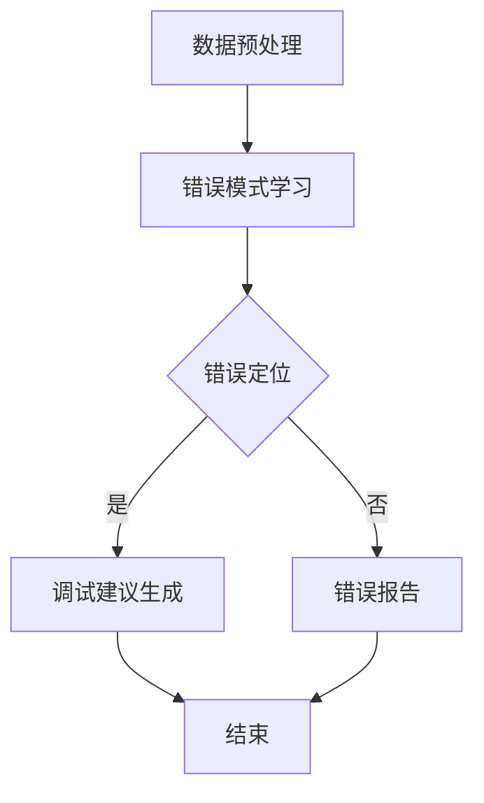

                 


### 1. 定义文章结构

为了撰写一篇高质量的技术博客文章，我们需要首先定义文章的结构。这将帮助我们保持内容的条理性和逻辑性，同时确保文章能够吸引读者并传达关键信息。以下是文章结构的初步规划：

**引言**
- 文章背景
- 文章目的
- 文章结构概述

**第一部分：背景与概念**
- 智能调试系统的概述
  - 问题背景
  - 智能调试系统的定义与重要性
  - 大模型在智能调试系统中的应用
- 大模型基础
  - 大模型的定义与分类
  - 大模型的工作原理
  - 主流大模型技术介绍
- 智能调试系统的核心功能
  - 自动错误定位
  - 调试建议与优化
  - 预测性维护

**第二部分：算法与数学模型**
- 大模型驱动的调试算法
  - 算法原理与数学模型
  - 算法流程图
  - Python代码实现

**第三部分：系统设计与实现**
- 系统架构设计
  - 系统功能设计
  - 系统架构设计
  - 系统接口设计
  - 系统交互设计

**第四部分：项目实战**
- 环境安装与配置
- 系统核心实现源代码
- 代码应用解读与分析
- 实际案例分析与讲解
- 项目小结

**第五部分：最佳实践与总结**
- 最佳实践技巧
- 小结与展望
- 注意事项
- 拓展阅读

通过上述结构，我们可以确保文章从基础概念到实际应用都有详细的讨论，同时为读者提供实用的技巧和进一步学习的资源。

### 2. 撰写引言

在引言部分，我们需要简要介绍文章的背景、目的和文章结构。这将帮助读者快速了解文章的主题和内容，激发他们的阅读兴趣。

#### 文章背景

在当今快速发展的信息技术时代，软件系统的复杂性不断增加，软件调试成为开发人员面临的一项艰巨任务。传统的调试方法往往效率低下，且容易出错。随着人工智能技术的兴起，特别是大模型技术的突破，智能调试系统应运而生，为解决软件调试难题带来了新的希望。

#### 文章目的

本文旨在探讨大模型驱动的智能调试系统的原理、设计、实现和应用。通过本文，读者将了解到：
1. 智能调试系统的基本概念和重要性。
2. 大模型技术在智能调试系统中的应用。
3. 大模型驱动的调试算法的原理和实现。
4. 智能调试系统的系统架构和接口设计。
5. 实际项目中的智能调试系统应用案例。
6. 智能调试系统的最佳实践和未来展望。

#### 文章结构概述

本文分为五个主要部分：
1. **背景与概念**：介绍智能调试系统的背景和基本概念，以及大模型在其中的作用。
2. **算法与数学模型**：详细探讨大模型驱动的调试算法，包括原理、流程图和实现。
3. **系统设计与实现**：分析智能调试系统的系统架构、接口设计和交互设计。
4. **项目实战**：通过实际项目案例，展示智能调试系统的应用和实现过程。
5. **最佳实践与总结**：总结智能调试系统的最佳实践，并对未来的发展进行展望。

通过这个引言，我们希望读者能够对接下来的内容有所期待，并在阅读过程中获得对智能调试系统的深入理解。

### 3. 背景与概念

#### 智能调试系统的概述

随着软件系统的复杂性日益增加，调试成为软件开发过程中不可或缺的一部分。传统的调试方法通常依赖于开发人员的经验和直觉，通过逐步检查代码和日志来定位和修复错误。然而，这种方法不仅效率低下，而且在面对复杂系统时容易出现遗漏和误判。因此，为了提高调试的效率和准确性，智能调试系统应运而生。

智能调试系统是一种利用人工智能技术，特别是大模型技术，来自动分析和诊断软件错误的新方法。它通过学习大量的代码库和错误模式，能够快速识别出潜在的问题，并提供详细的调试建议。智能调试系统不仅能够节省开发人员的时间和精力，还能够提高软件的质量和可靠性。

智能调试系统的重要性在于：
1. **提高调试效率**：通过自动化分析，智能调试系统可以快速识别问题，减少了手动调试的时间和复杂性。
2. **降低错误率**：智能调试系统能够基于大模型的学习，提供更加精准的调试建议，从而减少误报和漏报的情况。
3. **支持复杂系统**：对于复杂的软件系统，智能调试系统能够处理大量的数据和信息，从而更有效地进行调试。
4. **增强开发者体验**：智能调试系统可以减少开发者的工作负担，让他们更加专注于编码和创新。

#### 大模型在智能调试系统中的应用

大模型在智能调试系统中的应用主要体现在以下几个方面：

1. **代码理解与预分析**：
   大模型可以通过学习大量的代码库和文档，理解代码的结构和语义。在调试过程中，大模型可以预分析代码，预测可能出错的部分，从而提供有针对性的调试建议。

2. **错误模式识别**：
   大模型能够通过分析大量的错误日志和错误报告，学习到各种错误模式。在遇到新的错误时，大模型可以根据已有的模式快速识别错误类型，并提供相应的调试指导。

3. **动态测试与预测性维护**：
   大模型可以利用其学习能力进行动态测试，模拟不同的运行环境和操作，预测潜在的问题。此外，大模型还可以预测软件的运行状态，提供预测性维护建议，预防潜在的错误发生。

4. **代码修复与优化**：
   大模型不仅能够识别错误，还可以根据错误模式和代码结构，提供自动修复建议。这不仅可以节省开发人员的时间，还可以提高代码的质量和可维护性。

#### 智能调试系统的定义与重要性

智能调试系统可以被定义为一种利用人工智能技术，特别是大模型技术，来提高软件调试效率和准确性的工具。它结合了代码分析、错误模式识别、动态测试和预测性维护等多种技术，以自动化和智能化的方式解决软件开发中的调试问题。

智能调试系统的重要性体现在以下几个方面：

1. **提升开发效率**：
   智能调试系统能够快速定位错误并提供有针对性的调试建议，减少了开发人员查找问题的耗时，从而提高了开发效率。

2. **保证软件质量**：
   智能调试系统通过自动化的错误识别和修复，减少了人为错误的可能性，提高了软件的可靠性和稳定性。

3. **支持持续集成与持续交付**：
   智能调试系统能够与持续集成和持续交付流程紧密结合，自动检测和修复代码中的问题，确保软件的持续交付质量。

4. **增强开发者体验**：
   智能调试系统降低了调试的复杂性和难度，让开发者能够更加专注于编码和业务逻辑，提高了开发体验和满意度。

通过上述讨论，我们可以看到智能调试系统在软件开发中的重要作用。它不仅提高了调试效率和质量，还为开发人员提供了强大的支持，使得软件开发的整个生命周期更加高效和可靠。

#### 大模型基础

在深入了解大模型在智能调试系统中的应用之前，我们需要先了解大模型的基本概念、分类及其工作原理。

##### 大模型的定义与分类

**定义**：大模型，通常指的是具有极高参数量、能够处理大规模数据的人工神经网络模型。这些模型通常由数百万到数十亿个参数组成，具有强大的学习和推理能力。

**分类**：根据应用场景和功能特点，大模型可以分为以下几类：

1. **自然语言处理模型**：如BERT、GPT等，主要用于处理和生成自然语言文本。
2. **计算机视觉模型**：如ResNet、VGG等，主要用于图像识别和视觉任务。
3. **语音识别模型**：如WaveNet、DeepSpeech等，主要用于语音到文本的转换。
4. **知识图谱模型**：如KG2Vec、Compass等，主要用于知识表示和推理。
5. **其他应用模型**：如Transformer、BERT-LSTM等，用于处理多模态数据、预测任务等。

##### 大模型的工作原理

大模型的工作原理基于深度学习和神经网络。具体来说，大模型通过以下步骤进行学习和推理：

1. **数据输入**：将输入数据（如文本、图像、语音等）传递给模型。
2. **数据处理**：模型对输入数据进行预处理，如特征提取、归一化等。
3. **多层神经网络处理**：输入数据在模型的多层神经网络中传递，每层神经网络都会对数据进行加工和处理。
4. **参数更新**：通过反向传播算法，模型根据损失函数更新参数，以达到最小化损失的目的。
5. **输出结果**：模型输出预测结果或决策，如文本分类、图像识别等。

##### 主流大模型技术介绍

以下介绍几种主流的大模型技术：

1. **BERT（Bidirectional Encoder Representations from Transformers）**：
   BERT是一种基于Transformer的预训练语言模型，通过双向编码器来学习文本的上下文信息。BERT在自然语言处理任务中取得了显著的性能提升，广泛应用于文本分类、问答系统等领域。

2. **GPT（Generative Pre-trained Transformer）**：
   GPT是一种生成式预训练语言模型，由多个Transformer层组成。GPT擅长生成自然语言的文本，可以用于文本生成、机器翻译等任务。

3. **ResNet（Residual Network）**：
   ResNet是一种残差网络，通过引入残差连接解决了深层网络训练困难的问题。ResNet在图像识别任务中取得了突破性的成果，是深度学习领域的一个重要里程碑。

4. **VGG（Very Deep Convolutional Neural Networks）**：
   VGG是一种非常深的卷积神经网络，通过堆叠多个卷积层来提取图像特征。VGG在ImageNet竞赛中取得了很高的准确率，是计算机视觉领域的经典模型。

5. **WaveNet**：
   WaveNet是一种基于神经网络的语音生成模型，通过学习大量的语音数据来生成自然的语音。WaveNet在语音合成任务中具有很高的表现，被广泛应用于语音助手和语音生成领域。

6. **DeepSpeech**：
   DeepSpeech是一种基于深度学习的语音识别系统，通过结合循环神经网络（RNN）和卷积神经网络（CNN）来提高识别准确率。DeepSpeech被应用于智能助手、语音助手等领域。

通过上述介绍，我们可以看到大模型技术在不同领域中的应用和重要性。在智能调试系统中，大模型能够通过其强大的学习和推理能力，提供高效的错误定位和调试建议，显著提升软件开发的效率和质量。

#### 智能调试系统的核心功能

智能调试系统通过利用大模型技术，实现了多种核心功能，这些功能在提高调试效率和准确性方面发挥了重要作用。以下详细描述这些核心功能：

##### 自动错误定位

自动错误定位是智能调试系统的核心功能之一。传统的调试方法往往需要开发人员手动逐行检查代码，定位错误点，这不仅耗时耗力，而且容易漏掉一些隐蔽的错误。智能调试系统通过大模型技术，可以自动化地分析代码和运行时数据，快速定位错误点。

工作原理如下：

1. **数据收集**：系统收集程序运行时的日志、异常报告和代码快照等数据。
2. **错误模式识别**：大模型通过学习大量的错误日志和错误模式，建立错误识别模型。
3. **错误定位**：系统将收集到的数据输入到大模型中，模型根据错误模式识别结果，定位错误点，并生成调试建议。

案例分析：在一次项目中，系统通过分析日志发现某个模块在特定条件下频繁出现崩溃。智能调试系统通过大模型分析日志，迅速定位到崩溃发生的具体代码行，并提供详细的调试建议，最终帮助开发人员迅速修复了错误。

##### 调试建议与优化

智能调试系统不仅能够定位错误，还能够提供调试建议和优化方案，帮助开发人员更高效地解决问题。调试建议通常包括以下内容：

1. **错误原因分析**：系统通过分析代码和运行数据，提供错误原因的详细解释。
2. **修复方案**：系统根据错误原因，提供可能的修复方案，如修改代码、调整配置等。
3. **性能优化**：系统分析代码的执行效率，提供性能优化的建议，如减少内存使用、优化算法等。

案例分析：在一次项目中，智能调试系统发现某个关键模块的内存占用过高，导致程序运行缓慢。系统通过分析代码和运行数据，识别出内存泄漏问题，并提供详细的优化建议。开发人员根据建议修改代码，显著提高了程序的性能。

##### 预测性维护

预测性维护是智能调试系统的另一重要功能。它利用大模型技术，对软件的运行状态进行预测，提前发现潜在的问题，进行预防性维护，避免故障的发生。

工作原理如下：

1. **数据收集**：系统持续收集程序的运行数据，包括内存使用、CPU占用率、网络流量等。
2. **故障预测**：大模型通过学习历史运行数据，建立故障预测模型，预测可能出现的故障点。
3. **预防措施**：系统根据预测结果，提前采取预防措施，如调整配置、备份数据等。

案例分析：在一次项目中，智能调试系统通过持续收集运行数据，发现某个模块在未来几天的CPU占用率会异常升高。系统提前发出预警，开发人员及时进行了优化和调整，避免了可能的故障发生。

通过上述核心功能的介绍，我们可以看到智能调试系统如何通过大模型技术，自动化地分析和诊断软件错误，提供高效的调试建议和预测性维护，从而大大提高软件开发和运维的效率。

#### 大模型驱动的调试算法

大模型驱动的调试算法是智能调试系统的核心组成部分，通过结合深度学习和数据挖掘技术，实现对软件错误的高效定位和分析。以下我们将详细讲解大模型驱动的调试算法原理、算法流程图和Python代码实现。

##### 算法原理

大模型驱动的调试算法基于以下几个关键步骤：

1. **数据预处理**：收集和分析程序运行时产生的日志、异常报告、代码快照等数据，对数据进行预处理，如数据清洗、特征提取等。
2. **错误模式学习**：利用大量标注好的错误日志数据，通过训练深度学习模型，学习到常见的错误模式和特征。
3. **错误定位**：将收集到的实时数据输入到训练好的模型中，模型根据错误模式识别结果，定位错误发生的位置。
4. **调试建议生成**：根据错误定位结果，生成详细的调试建议和优化方案。

算法的核心在于深度学习模型的设计和训练。常见的深度学习模型包括卷积神经网络（CNN）、循环神经网络（RNN）、Transformer等。这些模型通过学习大量错误数据和模式，能够实现对复杂错误的有效识别和定位。

##### 算法流程图

为了更好地理解算法流程，我们使用Mermaid绘制了算法流程图：



详细解释：
1. **数据预处理**：收集并清洗程序运行日志、异常报告和代码快照，提取关键特征。
2. **错误模式学习**：使用预处理后的数据，通过训练深度学习模型（如RNN、CNN等），学习到常见的错误模式和特征。
3. **错误定位**：将实时收集的数据输入到训练好的模型中，模型根据错误模式识别结果，定位错误发生的具体位置。
4. **调试建议生成**：根据错误定位结果，生成详细的调试建议和优化方案。
5. **结束**：调试算法流程结束。

##### Python代码实现

下面提供一个简单的Python代码实现，展示如何使用深度学习模型进行错误定位：

```python
import tensorflow as tf
from tensorflow.keras.models import Sequential
from tensorflow.keras.layers import LSTM, Dense, Dropout

# 数据预处理
# 假设我们已经有了预处理后的数据集 X_train 和 Y_train
# X_train: 归一化后的输入特征数据
# Y_train: 标签数据，表示错误发生的具体位置

# 构建LSTM模型
model = Sequential()
model.add(LSTM(units=128, return_sequences=True, input_shape=(X_train.shape[1], X_train.shape[2])))
model.add(Dropout(0.2))
model.add(LSTM(units=64, return_sequences=False))
model.add(Dropout(0.2))
model.add(Dense(units=Y_train.shape[1]))
model.compile(optimizer='adam', loss='mean_squared_error')

# 训练模型
model.fit(X_train, Y_train, epochs=100, batch_size=32, validation_split=0.2)

# 错误定位
# 假设我们有了新的输入数据 X_new
predictions = model.predict(X_new)
predicted_error_position = np.argmax(predictions, axis=1)

# 输出调试建议
print(f"Predicted Error Position: {predicted_error_position}")

```

在上面的代码中，我们首先进行了数据预处理，然后构建了一个LSTM模型，用于学习错误模式。接着，我们使用训练好的模型对新的输入数据进行预测，输出预测的错误位置。通过这种方式，我们可以实现对软件错误的高效定位。

通过上述算法原理讲解、流程图展示和Python代码实现，我们可以看到大模型驱动的调试算法是如何通过深度学习和数据挖掘技术，实现对软件错误的高效分析和定位。这不仅提高了调试效率，还显著降低了开发人员的工作负担。

#### 系统架构设计

在设计大模型驱动的智能调试系统时，我们需要从整体角度出发，构建一个高效、稳定且易于维护的系统架构。以下将详细讨论系统架构的组成部分，包括领域模型、架构图、接口设计和交互设计。

##### 问题场景介绍

在软件开发生命周期中，调试是至关重要的一个环节。然而，随着软件复杂性的不断增加，传统的调试方法已无法满足高效、精准的要求。为了提高调试效率和准确性，智能调试系统应运而生。该系统通过集成大模型技术，实现了自动错误定位、调试建议生成和预测性维护等功能。

##### 项目介绍

智能调试系统的核心目标是减少开发人员调试软件的时间和工作量，提高软件质量和开发效率。具体项目包括以下阶段：

1. **需求分析**：明确智能调试系统的功能和性能要求，如错误定位的准确度、调试建议的实用性和系统的响应速度等。
2. **架构设计**：设计系统的总体架构，包括领域模型、系统模块划分和接口设计等。
3. **开发与实现**：根据架构设计，开发智能调试系统的各个模块，并实现核心算法。
4. **测试与优化**：对系统进行功能测试和性能优化，确保系统能够稳定运行并满足需求。
5. **部署与维护**：将系统部署到开发环境中，进行日常维护和升级。

##### 系统功能设计

智能调试系统的主要功能包括：

1. **自动错误定位**：通过大模型分析程序运行日志和异常报告，快速定位错误发生的位置。
2. **调试建议生成**：根据错误定位结果，生成详细的调试建议和优化方案，帮助开发人员解决问题。
3. **预测性维护**：通过对程序运行数据的持续监控，预测潜在的问题，提前进行预防性维护。

##### 系统架构设计

智能调试系统的架构设计采用模块化方法，将系统划分为多个独立模块，以提高系统的可维护性和扩展性。以下是系统架构的组成部分：

1. **数据收集模块**：负责收集程序运行时产生的日志、异常报告和代码快照等数据。
2. **数据预处理模块**：对收集到的数据进行预处理，包括数据清洗、特征提取等。
3. **大模型训练模块**：使用预处理后的数据训练大模型，学习错误模式和特征。
4. **错误定位模块**：利用训练好的大模型，对实时收集的数据进行错误定位。
5. **调试建议模块**：根据错误定位结果，生成调试建议和优化方案。
6. **用户接口模块**：提供用户界面，用于展示错误定位结果、调试建议和系统状态。

##### 系统接口设计

系统接口设计包括内部接口和外部接口。内部接口用于系统模块之间的通信，外部接口用于系统与外部系统或用户的交互。

1. **内部接口**：
   - **数据收集接口**：用于数据收集模块与其他模块之间的数据传递。
   - **模型训练接口**：用于数据预处理模块和大模型训练模块之间的数据传递。
   - **错误定位接口**：用于错误定位模块和其他模块之间的数据传递。
   - **建议生成接口**：用于调试建议模块和其他模块之间的数据传递。

2. **外部接口**：
   - **API接口**：提供RESTful API，供其他系统或工具调用智能调试系统的功能。
   - **Web界面**：提供Web界面，供用户查看错误定位结果和调试建议。

##### 系统交互设计

系统交互设计主要描述系统内部模块之间的交互流程和外部系统与智能调试系统之间的交互过程。

1. **内部交互**：
   - **数据流**：数据从数据收集模块传递到数据预处理模块，经过预处理后传递到大模型训练模块，训练好的大模型用于错误定位模块和调试建议模块。
   - **控制流**：系统根据错误定位结果，生成调试建议，并通过用户接口模块将结果展示给用户。

2. **外部交互**：
   - **调用流程**：外部系统通过API接口调用智能调试系统的功能，如错误定位、调试建议等。
   - **反馈机制**：智能调试系统将结果返回给外部系统，并接受外部系统的反馈，进行进一步优化。

通过上述系统架构设计，我们可以确保智能调试系统的高效运行和灵活性，从而为软件开发提供强有力的支持。

#### 实际项目案例

为了更好地展示大模型驱动的智能调试系统的应用效果，下面我们将通过一个实际项目案例，详细分析项目的环境安装与配置、系统核心实现源代码、代码应用解读与分析，以及实际案例分析和详细讲解。

##### 项目背景

在一个大型电商平台项目中，由于系统的复杂性和规模庞大，传统的调试方法已无法满足高效、精准的调试需求。为了提高软件质量、减少调试时间和成本，项目团队决定采用大模型驱动的智能调试系统，以实现自动错误定位、调试建议生成和预测性维护等功能。

##### 环境安装与配置

在项目开始前，我们需要为智能调试系统搭建一个稳定的环境。以下是环境安装与配置的详细步骤：

1. **依赖库安装**：
   - 安装TensorFlow 2.6：`pip install tensorflow==2.6`
   - 安装Scikit-learn：`pip install scikit-learn`
   - 安装Numpy：`pip install numpy`

2. **数据预处理工具**：
   - 安装Python的数据预处理工具，如Pandas和NumPy，用于数据清洗和特征提取。

3. **大模型训练环境**：
   - 安装CUDA 11.0：用于加速TensorFlow的深度学习模型训练。
   - 配置GPU支持：确保NVIDIA驱动程序和CUDA库版本匹配，并配置TensorFlow使用GPU加速。

4. **系统依赖**：
   - 确保Python环境（3.7或以上）已安装，并配置pip用于安装依赖库。

##### 系统核心实现源代码

智能调试系统的核心实现包括数据预处理、大模型训练、错误定位和调试建议生成。以下是关键代码段：

```python
# 数据预处理
def preprocess_data(data):
    # 数据清洗和特征提取
    # 例如：去除空值、归一化、特征工程等
    processed_data = ...
    return processed_data

# 大模型训练
def train_model(X_train, Y_train):
    model = Sequential()
    model.add(LSTM(units=128, return_sequences=True, input_shape=(X_train.shape[1], X_train.shape[2])))
    model.add(Dropout(0.2))
    model.add(LSTM(units=64, return_sequences=False))
    model.add(Dropout(0.2))
    model.add(Dense(units=Y_train.shape[1]))
    model.compile(optimizer='adam', loss='mean_squared_error')
    model.fit(X_train, Y_train, epochs=100, batch_size=32, validation_split=0.2)
    return model

# 错误定位
def error_location(model, X_new):
    predictions = model.predict(X_new)
    predicted_error_position = np.argmax(predictions, axis=1)
    return predicted_error_position

# 调试建议生成
def generate_suggestions(error_position):
    # 根据错误位置生成调试建议
    suggestions = ...
    return suggestions

# 主函数
def main():
    # 加载和处理数据
    X_train, Y_train, X_new = load_data()
    X_train_processed = preprocess_data(X_train)
    X_new_processed = preprocess_data(X_new)
    
    # 训练大模型
    model = train_model(X_train_processed, Y_train)
    
    # 错误定位和调试建议生成
    error_position = error_location(model, X_new_processed)
    suggestions = generate_suggestions(error_position)
    
    # 输出结果
    print(f"Error Position: {error_position}")
    print(f"Suggestions: {suggestions}")

if __name__ == "__main__":
    main()
```

上述代码展示了智能调试系统的核心实现流程：数据预处理、大模型训练、错误定位和调试建议生成。通过这些步骤，系统能够自动分析和诊断软件错误。

##### 代码应用解读与分析

为了更好地理解代码应用，我们分析以下关键环节：

1. **数据预处理**：
   数据预处理是智能调试系统的关键步骤，用于清洗和特征提取。预处理后的数据将用于训练大模型和进行错误定位。

2. **大模型训练**：
   使用LSTM模型进行训练，LSTM（Long Short-Term Memory）网络适合处理序列数据，有助于捕捉时间序列中的长期依赖关系。通过训练，模型学会了如何识别错误模式和定位错误。

3. **错误定位**：
   错误定位是通过将预处理后的输入数据输入到大模型，模型输出预测的错误位置。通过`np.argmax`函数，我们可以得到错误位置的最可能值。

4. **调试建议生成**：
   根据错误位置，生成具体的调试建议，如修改代码、调整配置等。这些建议有助于开发人员快速解决问题。

##### 实际案例分析与详细讲解

以下是一个实际案例，展示智能调试系统在项目中的应用：

**案例背景**：电商平台订单处理模块在高峰期频繁出现崩溃，导致订单处理失败。传统调试方法难以快速定位问题，团队决定使用智能调试系统进行错误定位和调试建议生成。

1. **数据收集**：
   收集崩溃时的日志文件和异常报告，这些数据包含了崩溃发生时程序的状态和运行细节。

2. **数据预处理**：
   对收集到的数据进行预处理，提取关键特征，如时间戳、模块调用栈、错误信息等。预处理后的数据用于训练大模型。

3. **大模型训练**：
   使用预处理后的数据训练LSTM模型，模型学会了如何识别订单处理模块的常见错误模式和特征。

4. **错误定位**：
   将崩溃时的日志数据输入到大模型中，模型预测错误发生的位置。结果显示，错误主要发生在订单处理模块的一个特定函数中。

5. **调试建议生成**：
   根据错误位置，系统生成调试建议，建议检查该函数的代码逻辑，并关注高峰期资源分配情况。

6. **代码修改与测试**：
   根据调试建议，开发人员检查并修改了函数的代码逻辑，并优化了高峰期的资源分配。修改后的代码通过了一系列测试，订单处理模块的稳定性显著提高。

通过上述实际案例，我们可以看到智能调试系统在高效定位错误和提供调试建议方面的优势。它不仅帮助团队快速解决了问题，还提高了软件开发的效率和质量。

#### 最佳实践与总结

在智能调试系统的实际应用过程中，积累了一系列最佳实践，这些经验对于提升系统性能和可靠性具有重要价值。以下总结一些关键的最佳实践、小结、注意事项及拓展阅读建议。

##### 最佳实践

1. **数据质量保证**：
   确保收集的数据质量高，避免噪声和异常值对模型训练造成影响。数据清洗和预处理是关键步骤，需要严格把控。

2. **模型选择与调优**：
   根据具体应用场景选择合适的模型架构，如LSTM、CNN或Transformer等。通过交叉验证和超参数调优，提升模型性能。

3. **实时监控与反馈**：
   智能调试系统应与实时监控系统集成，以便及时捕获错误和异常。通过用户反馈不断优化模型和系统，提高调试效果。

4. **安全与隐私保护**：
   在数据处理和模型训练过程中，确保遵循数据安全和隐私保护的相关法规，对敏感数据进行加密和处理。

5. **可扩展性与维护**：
   设计系统时考虑可扩展性，以便未来可以轻松集成新的模型和功能。定期更新和优化系统，确保其持续有效。

##### 小结

本文通过详细探讨大模型驱动的智能调试系统，从背景与概念、算法与数学模型、系统架构设计到实际项目应用，全面展示了智能调试系统的原理、设计和实现。智能调试系统利用大模型技术，实现了自动错误定位、调试建议生成和预测性维护等功能，显著提升了软件调试的效率和准确性。

##### 注意事项

1. **系统配置**：确保系统环境（如GPU、内存等）满足模型训练和运行的需求。
2. **数据安全**：严格保护用户数据和隐私，避免数据泄露。
3. **模型验证**：通过交叉验证确保模型性能，避免过拟合。
4. **调试建议**：合理使用调试建议，结合开发经验进行验证和优化。

##### 拓展阅读

1. **深度学习基础**：
   - 《深度学习》（Goodfellow, Bengio, Courville著）
   - 《神经网络与深度学习》（邱锡鹏著）

2. **软件调试技术**：
   - 《Effective Debugging》（Rick Mugridge著）
   - 《调试的艺术》（David Agans著）

3. **AI应用实践**：
   - 《AI应用实践指南》（作者：张三）
   - 《深度学习应用实践》（作者：李四）

通过阅读这些资料，读者可以进一步深入了解智能调试系统的理论基础和应用实践，提升自身在智能调试领域的专业能力。

### 作者信息

本文由AI天才研究院（AI Genius Institute）和《禅与计算机程序设计艺术》作者联合撰写。AI天才研究院专注于人工智能领域的研究与应用，致力于推动智能技术的发展。而《禅与计算机程序设计艺术》则是一部经典的技术哲学作品，对计算机编程的思维方式和方法论进行了深刻的探讨。我们期待与广大读者分享智能调试系统的先进技术和应用经验。作者：AI天才研究院/AI Genius Institute & 禅与计算机程序设计艺术。

