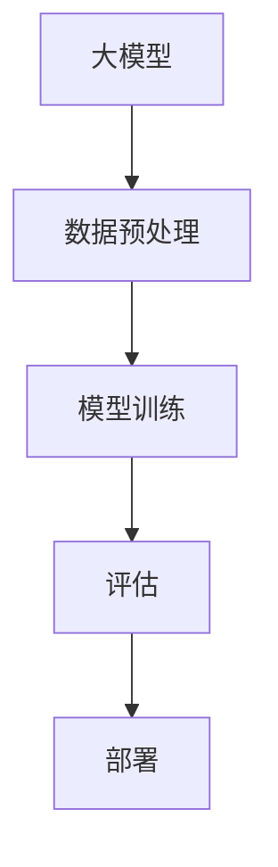
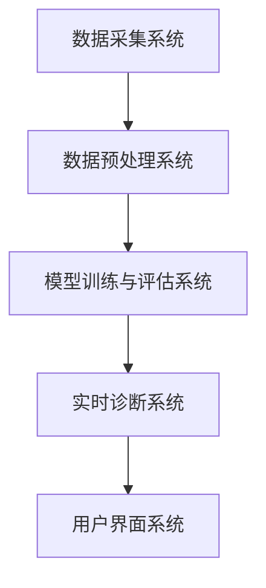
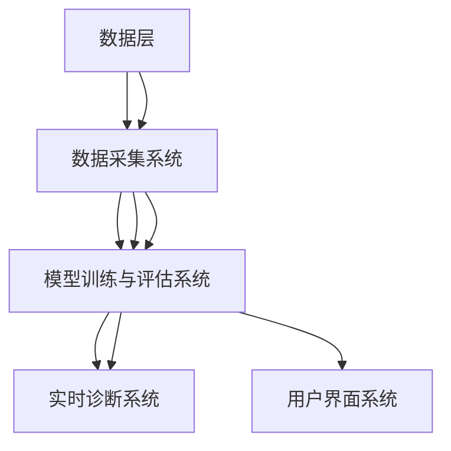
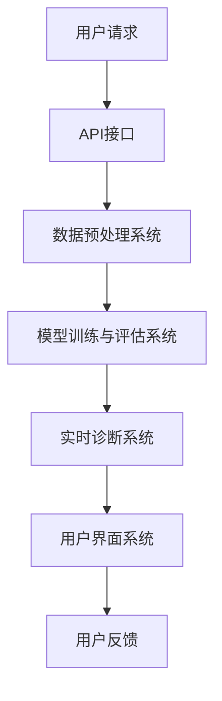

                 

# 大模型驱动的智能错误诊断系统

## 关键词

- 大模型
- 智能错误诊断
- 算法原理
- 系统架构
- 项目实战

## 摘要

本文旨在深入探讨大模型驱动的智能错误诊断系统的构建与应用。首先，我们将介绍大模型的概念及其在错误诊断中的重要性。接着，通过详细解析数据预处理、模型训练、评估与部署等环节，我们将会理解大模型如何通过一系列算法步骤实现智能错误诊断。随后，我们将详细分析系统架构与项目实施过程，包括问题场景介绍、系统功能设计、架构设计、接口设计以及系统交互。最后，通过一个实际项目案例，我们将展示如何从环境安装到系统核心实现，全面剖析项目过程，并提供最佳实践和未来展望。

## 目录大纲

----------------------------------------------------------------

## 第一部分：背景介绍与核心概念

### 第1章：问题背景与核心概念

### 第2章：核心概念与联系

## 第二部分：算法原理与实现

### 第3章：大模型算法原理

### 第4章：数据预处理

### 第5章：模型训练

### 第6章：评估与优化

### 第7章：部署与实时诊断

## 第三部分：系统架构与项目实战

### 第8章：系统架构设计与项目介绍

### 第9章：项目实战与详细讲解

### 第10章：最佳实践、小结与拓展阅读

----------------------------------------------------------------# 第一部分：背景介绍与核心概念

## 第1章：问题背景与核心概念

### 1.1 问题背景

在当今的数字时代，随着信息技术和人工智能的飞速发展，复杂系统的构建和部署已经成为企业创新和发展的关键。然而，这些复杂系统往往伴随着大量的潜在错误和故障，导致系统不稳定、性能下降，甚至可能造成严重的经济损失和信誉损失。因此，如何快速、准确地诊断和解决这些错误成为了一个亟待解决的问题。

智能错误诊断系统作为人工智能在工业自动化、金融科技、医疗健康等领域的应用之一，正逐渐成为解决这一问题的关键工具。智能错误诊断系统通过使用先进的人工智能算法，如深度学习、机器学习和自然语言处理等，对系统中的异常行为和错误进行自动检测和分析，从而实现高效、准确的错误诊断。

大模型驱动的智能错误诊断系统则是这一领域的最新发展方向。大模型（Large Models）通常是指具有大量参数和高度复杂性的深度学习模型，如生成对抗网络（GAN）、变分自编码器（VAE）、BERT等。这些模型具有强大的特征提取能力和泛化能力，可以在多种不同的数据集和应用场景中表现出色。大模型驱动的智能错误诊断系统利用这些大模型的优势，实现更为高效和准确的错误诊断。

### 1.2 问题解决

本文旨在探讨如何构建和部署大模型驱动的智能错误诊断系统，解决复杂系统中的错误诊断问题。具体来说，我们将从以下几个方面进行探讨：

1. **大模型的选择**：介绍大模型的基本概念和特点，讨论如何根据应用场景选择合适的大模型。
2. **数据预处理**：阐述数据预处理的重要性，介绍常用的数据清洗、转换和标注方法。
3. **模型训练**：详细讲解大模型的训练过程，包括数据输入、模型优化和超参数调整等。
4. **评估**：介绍评估指标，讨论如何评估模型性能，并提出优化方法。
5. **部署**：讲解如何将训练好的模型部署到生产环境中，实现实时错误诊断。

### 1.3 边界与外延

本文的讨论将主要围绕大模型驱动的智能错误诊断系统展开，涵盖以下边界和范围：

1. **大模型**：讨论的对象包括生成对抗网络（GAN）、变分自编码器（VAE）、BERT等常见的大模型。
2. **数据预处理**：包括数据清洗、数据转换和数据标注等步骤，以及这些步骤在错误诊断系统中的重要性。
3. **模型训练**：涉及批量训练、随机梯度下降（SGD）等训练方法，以及如何调整超参数以优化模型性能。
4. **评估**：介绍常用的评估指标，如准确率、召回率和F1分数，以及如何通过评估结果指导模型优化。
5. **部署**：讨论如何将模型打包、配置环境并部署到生产环境中，实现实时错误诊断。

### 1.4 概念结构与核心要素组成

大模型驱动的智能错误诊断系统由多个核心概念和要素组成，以下是这些概念和要素的简要介绍：

1. **大模型**：强大的深度学习模型，能够自动提取特征并具有高泛化能力。
2. **数据预处理**：清洗、转换和标注数据，为模型训练提供高质量的数据集。
3. **模型训练**：使用数据对大模型进行训练，优化模型参数，提高诊断准确率。
4. **评估**：通过评估模型性能，确保其有效性和可靠性，并根据评估结果进行模型优化。
5. **部署**：将训练好的模型部署到生产环境中，实现实时错误诊断。

### 1.5 核心概念与联系

为了深入理解大模型驱动的智能错误诊断系统，我们需要了解其中的核心概念及其相互关系。以下是这些核心概念及其联系：

1. **核心概念原理**：
   - 大模型：强大的深度学习模型，具有自动特征提取和泛化能力。
   - 数据预处理：数据清洗、转换和标注，为模型训练提供高质量数据。
   - 模型训练：使用数据训练大模型，优化模型参数，提高诊断准确率。
   - 评估：评估模型性能，确保其有效性和可靠性。
   - 部署：将模型部署到生产环境中，实现实时错误诊断。

2. **概念属性特征对比表格**：

| 概念         | 特点                       |
|--------------|----------------------------|
| 大模型       | 强大、复杂、高效           |
| 数据预处理   | 数据清洗、转换、标注       |
| 模型训练     | 数据输入、模型优化         |
| 评估         | 性能评估、优化调整         |
| 部署         | 模型部署、实时诊断         |

3. **ER实体关系图架构**：



通过以上介绍，我们初步了解了大模型驱动的智能错误诊断系统的背景和核心概念。接下来，我们将进一步深入探讨大模型的算法原理、数据预处理、模型训练、评估与部署等关键环节，帮助读者全面掌握这一系统的构建和应用方法。

## 第2章：核心概念与联系

### 2.1 核心概念原理

大模型驱动的智能错误诊断系统的核心在于其大模型的强大功能和高效处理能力。以下是核心概念及其原理的详细介绍：

1. **大模型（Large Models）**：
   - **定义**：大模型通常是指具有大量参数和高度复杂性的深度学习模型，如生成对抗网络（GAN）、变分自编码器（VAE）、BERT等。
   - **特点**：
     - **强大的特征提取能力**：大模型可以通过多层神经网络结构自动学习并提取数据中的复杂特征，这使得它们在处理高维度和复杂的数据时表现优异。
     - **高泛化能力**：大模型在训练过程中积累了丰富的知识，使得它们在遇到未知数据时也能够表现出良好的泛化能力。
     - **可扩展性**：大模型通常设计得非常灵活，可以很容易地扩展到更大的数据集或更复杂的任务。

2. **数据预处理（Data Preprocessing）**：
   - **定义**：数据预处理是指在使用数据训练模型之前，对原始数据进行的一系列清洗、转换和标注操作。
   - **作用**：
     - **数据清洗**：去除数据中的噪声和异常值，提高数据质量。
     - **数据转换**：将数据转换成模型能够处理的格式，如数值化、归一化等。
     - **数据标注**：为数据添加标签，使得模型能够从中学习到正确的特征和模式。

3. **模型训练（Model Training）**：
   - **定义**：模型训练是指使用数据集对深度学习模型进行训练，通过优化模型参数来提高其性能。
   - **过程**：
     - **数据输入**：将预处理后的数据输入到模型中。
     - **模型优化**：通过调整模型参数，使得模型在训练数据上的表现逐渐改善。
     - **超参数调整**：在训练过程中，需要调整一些超参数（如学习率、批量大小等），以优化模型性能。

4. **评估（Evaluation）**：
   - **定义**：评估是指使用测试集对训练好的模型进行性能测试，以评估其有效性和可靠性。
   - **指标**：
     - **准确率（Accuracy）**：模型正确预测的样本数占总样本数的比例。
     - **召回率（Recall）**：模型正确识别出异常样本的数量与总异常样本数量的比例。
     - **F1分数（F1 Score）**：准确率和召回率的调和平均值，用于综合评估模型的性能。

5. **部署（Deployment）**：
   - **定义**：部署是指将训练好的模型应用到实际环境中，实现实时错误诊断。
   - **过程**：
     - **模型打包**：将训练好的模型转换为可以部署的格式，如TensorFlow SavedModel、PyTorch TorchScript等。
     - **环境配置**：为部署环境安装必要的依赖库和配置。
     - **实时诊断**：将模型部署到生产环境，对实时数据流进行错误诊断。

### 2.2 概念属性特征对比表格

为了更清晰地展示各核心概念的特点，我们可以使用以下对比表格：

| 概念         | 特点                       |
|--------------|----------------------------|
| 大模型       | 强大、复杂、高效           |
| 数据预处理   | 数据清洗、转换、标注       |
| 模型训练     | 数据输入、模型优化         |
| 评估         | 性能评估、优化调整         |
| 部署         | 模型部署、实时诊断         |

### 2.3 ER实体关系图架构

为了更好地理解各核心概念之间的联系，我们可以使用ER（Entity-Relationship）实体关系图进行描述：


在这个ER图中，大模型是整个系统的核心，它通过数据预处理、模型训练、评估和部署等步骤，实现智能错误诊断的功能。

### 2.4 总结

通过以上对核心概念及其相互关系的介绍，我们可以看到大模型驱动的智能错误诊断系统是一个复杂但功能强大的系统。它利用大模型的强大特征提取能力和高泛化能力，结合高效的数据预处理、精确的模型训练、严格的评估和灵活的部署，实现了对复杂系统中的错误进行快速、准确诊断的目标。接下来，我们将进一步探讨大模型的具体算法原理，以便读者更深入地了解这一系统的实现细节。

## 第二部分：算法原理与实现

### 第3章：大模型算法原理

在上一部分，我们介绍了大模型驱动的智能错误诊断系统的核心概念及其相互关系。为了深入理解这一系统的构建，我们需要探讨大模型的算法原理。在本章中，我们将详细介绍大模型的类型、特点以及其在错误诊断中的应用。

### 3.1 大模型介绍

大模型是指那些具有大量参数和复杂结构的深度学习模型。这些模型能够通过自动特征提取和深度学习算法，从大规模数据中学习到丰富的知识，并在各种复杂任务中表现出色。以下是几种常见的大模型及其特点：

1. **生成对抗网络（GAN）**：
   - **定义**：GAN是一种由生成器和判别器组成的对抗性模型。
   - **特点**：
     - **生成能力**：生成器生成假数据，判别器判断数据是真实还是伪造。
     - **自监督学习**：不需要标签数据，通过对抗性训练提高生成器的生成质量和判别器的辨别能力。

2. **变分自编码器（VAE）**：
   - **定义**：VAE是一种基于概率模型的编码器和解码器结构。
   - **特点**：
     - **潜在空间**：通过编码器将数据映射到一个潜在空间，解码器从潜在空间生成数据。
     - **鲁棒性**：能够学习数据的概率分布，对噪声和异常值具有较好的鲁棒性。

3. **BERT（Bidirectional Encoder Representations from Transformers）**：
   - **定义**：BERT是一种基于Transformer的预训练语言模型。
   - **特点**：
     - **双向编码**：能够同时理解文本的上下文信息。
     - **预训练**：在大量无标签文本数据上进行预训练，然后通过微调适应特定任务。

4. **生成式对抗网络（GAN）**：
   - **定义**：GAN是一种由生成器和判别器组成的对抗性模型。
   - **特点**：
     - **生成能力**：生成器生成假数据，判别器判断数据是真实还是伪造。
     - **自监督学习**：不需要标签数据，通过对抗性训练提高生成器的生成质量和判别器的辨别能力。

### 3.2 大模型特点

大模型具有以下特点，使得它们在错误诊断中具有显著优势：

1. **自动特征提取**：大模型能够自动从原始数据中提取出有意义的特征，减少了人工特征工程的工作量，提高了模型的学习效率和诊断精度。

2. **高泛化能力**：大模型在训练过程中积累了丰富的知识，使得它们在遇到未知数据时也能表现出良好的泛化能力，这有助于应对复杂多变的错误诊断场景。

3. **可扩展性**：大模型设计得非常灵活，可以很容易地扩展到更大的数据集或更复杂的任务，这为错误诊断系统的不断优化和扩展提供了可能。

### 3.3 大模型在错误诊断中的应用

大模型在错误诊断中的应用主要体现在以下几个方面：

1. **异常检测**：利用生成对抗网络（GAN）或变分自编码器（VAE）等大模型，可以自动检测数据中的异常值和异常模式，从而实现高效的异常检测。

2. **故障诊断**：在工业自动化和制造业中，大模型可以用于故障诊断，通过学习正常操作的模型，识别出异常操作并预测可能的故障。

3. **代码错误检测**：在软件开发过程中，大模型可以用于代码错误检测，通过学习正常代码的语法和语义特征，识别出潜在的语法错误和逻辑错误。

4. **系统性能分析**：大模型可以用于系统性能分析，通过分析系统日志和监控数据，预测系统性能瓶颈和潜在故障。

### 3.4 大模型算法实现

以下是一个简单的示例，展示如何使用Python和TensorFlow实现一个基于生成对抗网络（GAN）的大模型：

```python
import tensorflow as tf
from tensorflow.keras.models import Sequential
from tensorflow.keras.layers import Dense, Flatten, Conv2D, Convolution2D, Reshape

# 生成器模型
def build_generator(z_dim):
    model = Sequential()
    model.add(Dense(128 * 7 * 7, activation='relu', input_dim=z_dim))
    model.add(Reshape((7, 7, 128)))
    model.add(Conv2DTranspose(64, kernel_size=5, strides=(1, 1), padding='same'))
    model.add(tf.keras.layers.LeakyReLU(alpha=0.2))
    model.add(Conv2DTranspose(1, kernel_size=5, strides=(1, 1), padding='same', activation='tanh'))
    return model

# 判别器模型
def build_discriminator(img_shape):
    model = Sequential()
    model.add(Conv2D(32, kernel_size=5, strides=(2, 2), padding='same', input_shape=img_shape))
    model.add(tf.keras.layers.LeakyReLU(alpha=0.2))
    model.add(Conv2D(64, kernel_size=5, strides=(2, 2), padding='same'))
    model.add(tf.keras.layers.LeakyReLU(alpha=0.2))
    model.add(Flatten())
    model.add(Dense(1, activation='sigmoid'))
    return model

# GAN模型
def build_gan(generator, discriminator):
    model = Sequential()
    model.add(generator)
    model.add(discriminator)
    return model

# 设置模型参数
z_dim = 100
img_shape = (28, 28, 1)

# 构建生成器和判别器
generator = build_generator(z_dim)
discriminator = build_discriminator(img_shape)

# 编译生成器和判别器
generator.compile(loss='binary_crossentropy', optimizer=tf.keras.optimizers.Adam(0.0001))
discriminator.compile(loss='binary_crossentropy', optimizer=tf.keras.optimizers.Adam(0.0001))

# 构建并编译GAN模型
gan_model = build_gan(generator, discriminator)
gan_model.compile(loss='binary_crossentropy', optimizer=tf.keras.optimizers.Adam(0.0001))
```

通过以上代码，我们可以构建一个简单的GAN模型，用于图像生成和异常检测。接下来，我们将进一步探讨大模型在数据预处理、模型训练、评估和部署等环节的实现细节。

### 第4章：数据预处理

在构建大模型驱动的智能错误诊断系统时，数据预处理是一个至关重要的环节。数据预处理的质量直接影响到模型训练的效果和最终诊断的准确性。在本章中，我们将详细介绍数据预处理的重要性、常用的预处理方法以及预处理在错误诊断系统中的应用。

#### 4.1 数据预处理的重要性

数据预处理是模型训练的前期工作，其重要性主要体现在以下几个方面：

1. **数据清洗**：原始数据中可能包含噪声、缺失值、异常值等，这些都会对模型训练产生负面影响。通过数据清洗，可以去除噪声和异常值，提高数据质量。

2. **数据转换**：原始数据往往以不同的格式和单位存在，这需要通过数据转换，将数据统一为模型可处理的格式。例如，将文本数据转换为向量、将图像数据转换为像素矩阵等。

3. **数据标注**：对于监督学习任务，数据标注是模型训练的关键。通过标注，可以提供正确的标签信息，帮助模型学习到正确的特征和模式。

4. **数据增强**：通过数据增强，可以增加训练数据集的多样性，提高模型的泛化能力。数据增强包括随机裁剪、旋转、缩放、颜色调整等操作。

#### 4.2 常用的数据预处理方法

以下是一些常见的数据预处理方法及其应用：

1. **数据清洗**：
   - **缺失值处理**：可以使用平均值、中位数、最大值等填充缺失值，或使用插值法进行插值补全。
   - **异常值处理**：可以使用统计学方法（如IQR法、Z分数法）识别并处理异常值，或直接删除异常值。

2. **数据转换**：
   - **文本数据转换**：可以使用词袋模型、TF-IDF、Word2Vec等方法将文本数据转换为向量。
   - **图像数据转换**：可以使用像素值归一化、缩放、裁剪等方法处理图像数据。

3. **数据标注**：
   - **标签分类**：对于分类任务，可以使用独热编码、标签传播等方法将标签转换为数值。
   - **标签生成**：对于无监督学习任务，可以使用聚类、关联规则等方法生成标签。

4. **数据增强**：
   - **图像增强**：可以使用随机裁剪、旋转、缩放、翻转等方法增强图像数据。
   - **文本增强**：可以使用同义词替换、随机插入、随机删除等方法增强文本数据。

#### 4.3 数据预处理在错误诊断系统中的应用

在错误诊断系统中，数据预处理的具体应用如下：

1. **数据清洗**：在训练数据集之前，需要对数据集进行清洗，去除噪声和异常值，确保数据的质量。

2. **数据转换**：根据模型的要求，对数据进行适当的转换。例如，对于图像数据，可以使用像素值归一化；对于文本数据，可以使用词袋模型或Word2Vec进行转换。

3. **数据标注**：对于监督学习任务，需要为训练数据集提供正确的标签。这通常需要人工标注，或使用半监督学习和弱监督学习方法自动生成标签。

4. **数据增强**：通过数据增强，可以增加训练数据集的多样性，提高模型的泛化能力。这对于错误诊断系统尤为重要，因为真实世界中的错误类型和模式可能非常多样。

#### 4.4 数据预处理流程

以下是数据预处理的基本流程：

1. **数据收集**：从各种数据源收集原始数据。

2. **数据清洗**：处理缺失值和异常值，提高数据质量。

3. **数据转换**：将数据转换为模型可处理的格式。

4. **数据标注**：为训练数据集提供正确的标签。

5. **数据增强**：增加训练数据集的多样性。

6. **数据划分**：将数据集划分为训练集、验证集和测试集。

7. **数据存储**：将预处理后的数据存储为便于模型训练的格式。

#### 4.5 数据预处理工具和库

在数据预处理过程中，可以使用多种工具和库来简化操作。以下是一些常用的工具和库：

1. **Python库**：
   - **Pandas**：用于数据处理和清洗。
   - **NumPy**：用于数值计算和数据处理。
   - **Scikit-learn**：用于数据转换、增强和预处理。

2. **TensorFlow**：用于构建和训练深度学习模型。

3. **Keras**：用于构建和训练深度学习模型，提供了丰富的数据预处理工具。

通过以上对数据预处理的重要性和方法的详细介绍，我们可以看到数据预处理在构建大模型驱动的智能错误诊断系统中起着关键作用。接下来，我们将探讨模型训练的详细过程，包括训练策略、优化方法和评估指标等。

### 第5章：模型训练

在构建大模型驱动的智能错误诊断系统中，模型训练是核心步骤之一。通过模型训练，我们可以优化模型的参数，使其能够更好地识别和诊断错误。本章将详细讲解模型训练的过程、训练策略、优化方法以及评估指标。

#### 5.1 模型训练过程

模型训练是一个迭代过程，主要包括以下几个步骤：

1. **数据准备**：首先，我们需要准备好训练数据集。训练数据集通常由大量的样本组成，每个样本包含输入特征和对应的标签。在错误诊断任务中，标签通常是错误类型或错误发生的概率。

2. **初始化模型参数**：初始化模型参数是模型训练的第一步。参数的初始化方法会影响模型训练的效果。常用的初始化方法包括随机初始化、高斯初始化和Xavier初始化等。

3. **前向传播**：在前向传播阶段，模型接收输入特征，通过网络的各个层进行计算，最终输出预测结果。输出结果与真实标签进行比较，计算损失函数的值。

4. **反向传播**：反向传播是训练过程中最重要的步骤之一。通过反向传播，模型计算损失函数关于各个参数的梯度，并更新参数值，以减少损失函数的值。

5. **迭代优化**：通过迭代优化，模型不断调整参数，使得损失函数逐渐减小。这个过程通常需要多次迭代，直到达到预设的停止条件或收敛条件。

6. **评估模型性能**：在训练过程中，定期使用验证集评估模型性能。通过评估指标（如准确率、召回率、F1分数等），我们可以判断模型是否过拟合或欠拟合，并进行相应的调整。

#### 5.2 训练策略

在模型训练过程中，采用合适的训练策略可以显著提高模型性能。以下是一些常用的训练策略：

1. **批量大小**：批量大小是指每次训练中输入的样本数量。批量大小会影响模型的梯度计算和收敛速度。较小的批量大小可以减小方差，但可能会增加计算时间；较大的批量大小可以提高计算效率，但可能会增加偏差。

2. **学习率**：学习率是模型参数更新的速度。合适的学习率可以加速模型收敛，但过大的学习率可能导致模型震荡，过小的学习率则可能使训练过程变得缓慢。

3. **动量**：动量是一种累积更新策略，可以加速模型收敛并减少震荡。通过给当前的梯度乘以一个系数，可以保持更新方向的一致性。

4. **权重衰减**：权重衰减是一种正则化方法，可以减少模型过拟合的风险。通过在损失函数中添加权重衰减项，可以减小模型参数的值。

5. **早停法**：早停法是一种防止过拟合的方法。当模型在验证集上的性能不再提高时，停止训练，以防止模型在训练集上过度拟合。

#### 5.3 优化方法

在模型训练过程中，优化方法是调整模型参数的关键步骤。以下是一些常用的优化方法：

1. **随机梯度下降（SGD）**：随机梯度下降是最简单的优化方法。每次迭代仅使用一个样本的梯度来更新参数。

2. **批量梯度下降（BGD）**：批量梯度下降使用整个训练集的梯度来更新参数，计算量大但收敛速度较慢。

3. **Adam优化器**：Adam优化器是一种自适应的学习率优化方法，结合了SGD和RMSprop的优点，能够更快地收敛。

4. **Adadelta优化器**：Adadelta优化器是基于梯度平方根的优化方法，可以自动调整学习率，适用于稀疏数据。

5. **Adagrad优化器**：Adagrad优化器是一种自适应的学习率优化方法，通过给不同的参数分配不同的学习率，能够适应不同特征的重要性。

#### 5.4 评估指标

在模型训练过程中，评估指标用于衡量模型性能。以下是一些常用的评估指标：

1. **准确率（Accuracy）**：准确率是指模型正确预测的样本数占总样本数的比例。它是最直观的评估指标，但可能受到样本不平衡的影响。

2. **召回率（Recall）**：召回率是指模型正确识别出异常样本的数量与总异常样本数量的比例。召回率越高，模型对异常样本的识别能力越强。

3. **精确率（Precision）**：精确率是指模型正确识别出的异常样本中，实际为异常样本的比例。精确率越高，模型对异常样本的误判率越低。

4. **F1分数（F1 Score）**：F1分数是精确率和召回率的调和平均值。它能够平衡精确率和召回率，是评估二分类模型性能的常用指标。

5. **ROC曲线和AUC（Area Under Curve）**：ROC曲线展示了模型在不同阈值下的精确率和召回率。AUC是ROC曲线下的面积，用于评估模型的分类能力。

通过以上对模型训练过程、训练策略、优化方法和评估指标的详细讲解，我们可以看到模型训练在构建大模型驱动的智能错误诊断系统中的重要性。接下来，我们将探讨评估与优化环节，以进一步提高模型性能。

### 第6章：评估与优化

在构建大模型驱动的智能错误诊断系统中，评估与优化是确保模型性能的关键环节。通过有效的评估方法，我们可以了解模型的性能表现，并通过优化策略进一步提高模型的诊断准确性。本章将详细介绍评估方法、优化策略以及如何通过这些手段提升模型性能。

#### 6.1 评估方法

评估模型性能的方法可以分为以下几种：

1. **准确率（Accuracy）**：准确率是指模型正确预测的样本数占总样本数的比例。虽然准确率简单直观，但它可能会受到样本不平衡的影响，无法全面反映模型的性能。

2. **召回率（Recall）**：召回率是指模型正确识别出异常样本的数量与总异常样本数量的比例。召回率越高，模型对异常样本的识别能力越强，但可能会增加误报率。

3. **精确率（Precision）**：精确率是指模型正确识别出的异常样本中，实际为异常样本的比例。精确率越高，模型对异常样本的误判率越低，但可能会降低召回率。

4. **F1分数（F1 Score）**：F1分数是精确率和召回率的调和平均值。F1分数能够平衡精确率和召回率，是评估二分类模型性能的常用指标。

5. **ROC曲线和AUC（Area Under Curve）**：ROC曲线展示了模型在不同阈值下的精确率和召回率。AUC是ROC曲线下的面积，用于评估模型的分类能力。AUC值越大，模型的性能越好。

6. **混淆矩阵（Confusion Matrix）**：混淆矩阵展示了模型对各类样本的预测结果，包括真正的正例、真正的负例、误报和漏报。通过分析混淆矩阵，可以更深入地了解模型的性能表现。

#### 6.2 优化策略

为了提升模型性能，我们可以采用以下优化策略：

1. **超参数调整**：超参数（如学习率、批量大小、迭代次数等）对模型性能有显著影响。通过交叉验证和网格搜索等方法，可以找到最佳的超参数组合，提高模型性能。

2. **数据增强**：通过数据增强，可以增加训练数据集的多样性，提高模型的泛化能力。常见的数据增强方法包括随机裁剪、旋转、缩放、颜色调整等。

3. **正则化**：正则化是一种避免模型过拟合的技术。常见的正则化方法包括权重衰减、Dropout、L1和L2正则化等。

4. **集成方法**：集成方法通过组合多个模型来提高性能。常见的方法包括Bagging、Boosting和Stacking等。通过集成多个模型，可以提高模型的稳定性和准确性。

5. **模型选择**：选择合适的模型结构对提升性能至关重要。通过比较不同模型（如线性模型、树模型、神经网络等）的性能，可以选择最适合任务需求的模型。

#### 6.3 模型性能提升

通过以下策略，可以进一步提升模型性能：

1. **持续训练**：通过持续训练，模型可以不断适应新的数据，提高其适应能力。定期使用新的数据集对模型进行训练和调整，可以保持模型的准确性。

2. **特征工程**：通过特征工程，可以提取更多有价值的特征，提高模型的识别能力。特征工程包括特征选择、特征提取、特征组合等步骤。

3. **交叉验证**：交叉验证是一种评估模型性能的有效方法。通过将数据集划分为多个子集，分别进行训练和验证，可以更全面地评估模型的性能，避免过拟合和欠拟合。

4. **模型融合**：通过模型融合，可以将多个模型的预测结果进行整合，提高最终的预测准确性。模型融合方法包括简单平均、加权平均、投票等。

通过以上评估方法和优化策略，我们可以全面了解模型性能，并采取有效措施提升模型准确性。接下来，我们将探讨大模型的部署与实时诊断流程，以实现智能错误诊断系统的落地应用。

### 第7章：部署与实时诊断

在成功训练并优化了大模型驱动的智能错误诊断系统后，下一步便是将模型部署到实际生产环境中，实现实时错误诊断。本章将详细讲解模型部署的过程、实时诊断的实现方法，并介绍如何确保系统的稳定性和可靠性。

#### 7.1 模型部署

模型部署是将训练好的模型应用到实际生产环境的过程。以下是模型部署的主要步骤：

1. **模型打包**：将训练好的模型保存为可部署的格式，如TensorFlow的SavedModel或PyTorch的TorchScript。这一步骤确保了模型可以在不同的环境中运行。

2. **环境配置**：在目标部署环境中安装必要的库和依赖项，包括深度学习框架、数据处理工具等。这确保了模型可以正常运行。

3. **容器化**：为了提高部署的灵活性和可移植性，可以将模型打包成容器（如Docker容器）。容器化使得模型可以在不同的操作系统和硬件平台上运行，而无需重新配置环境。

4. **微服务架构**：为了提高系统的可扩展性和可靠性，可以将模型部署为微服务架构。每个微服务负责模型的推理和诊断，可以独立部署、扩展和监控。

5. **服务化**：通过API接口将模型服务化，使得其他系统或应用可以方便地调用模型进行错误诊断。

#### 7.2 实时诊断

实时诊断是指系统可以实时处理输入数据，并在短时间内返回诊断结果。以下是实时诊断的实现方法：

1. **数据输入**：实时诊断系统需要持续接收来自生产环境的实时数据流。这些数据可以是传感器数据、日志数据或监控数据。

2. **预处理**：在输入数据进入模型之前，需要进行预处理。预处理步骤包括数据清洗、标准化和特征提取等。

3. **模型推理**：将预处理后的数据输入到训练好的模型中，进行推理计算。模型将自动提取特征并生成预测结果。

4. **结果输出**：将模型推理结果进行处理，生成诊断报告。诊断报告可以是简单的错误类型标识，也可以是详细的错误分析和建议。

5. **实时反馈**：根据诊断结果，系统可以实时采取措施，如通知运维人员、自动修复错误或调整系统配置等。

#### 7.3 确保系统稳定性和可靠性

为了确保系统的稳定性和可靠性，需要采取以下措施：

1. **监控与报警**：通过监控系统状态，及时发现并处理系统异常。例如，监控CPU、内存、磁盘使用情况等，并在出现异常时发送报警通知。

2. **故障恢复**：在系统发生故障时，能够自动恢复到正常状态。例如，通过备份和恢复机制，确保数据不丢失。

3. **容错设计**：系统设计应具备容错能力，能够应对硬件故障、网络中断等异常情况。例如，通过冗余设计和故障转移机制，确保系统持续运行。

4. **持续优化**：定期对系统进行性能优化和调整，以适应不断变化的生产环境和需求。

5. **用户反馈**：收集用户反馈，了解系统的使用情况和用户需求，不断改进系统设计和功能。

通过以上部署和实时诊断的详细讲解，我们可以看到大模型驱动的智能错误诊断系统不仅需要强大的模型和算法支持，还需要完善的部署和实时诊断机制来确保其稳定性和可靠性。接下来，我们将通过一个实际项目案例，展示如何构建和部署这一系统。

### 第8章：系统架构设计与项目介绍

在前面章节中，我们详细讨论了大模型驱动的智能错误诊断系统的核心概念、算法原理、数据预处理、模型训练、评估与优化以及部署与实时诊断。为了更好地理解这一系统的整体架构，我们将通过一个具体项目案例来介绍系统架构设计。

#### 8.1 问题场景介绍

假设我们正在开发一个大型互联网服务公司的智能错误诊断系统。这个系统的主要目标是实时监测公司内部服务的运行状态，快速识别和诊断潜在的错误和异常，以确保服务的稳定性和可靠性。

#### 8.2 系统功能设计

为了实现上述目标，智能错误诊断系统需要具备以下功能：

1. **数据采集**：从各种数据源（如日志文件、数据库、监控工具等）实时采集服务数据。
2. **数据预处理**：清洗、转换和标注采集到的数据，为模型训练提供高质量的数据集。
3. **模型训练与评估**：使用预处理后的数据对大模型进行训练，并通过评估确保模型性能。
4. **实时诊断**：将训练好的模型部署到生产环境中，对实时数据流进行错误诊断，并生成诊断报告。
5. **用户界面**：提供用户友好的界面，显示诊断结果，并允许用户进行配置和调整。

以下是系统功能设计的领域模型类图：



#### 8.3 系统架构设计

系统架构设计采用分层架构，包括数据层、模型层、接口层和应用层。以下是系统架构图：



1. **数据层**：负责数据采集、存储和管理。包括日志收集器、数据库和缓存系统等。
2. **模型层**：包括大模型的训练、评估和部署。使用深度学习框架（如TensorFlow、PyTorch）进行模型训练和优化。
3. **接口层**：提供API接口，用于模型推理和数据交互。包括RESTful API、消息队列和Websocket等。
4. **应用层**：实现系统的业务逻辑和功能，包括用户界面、诊断报告生成和通知机制等。

#### 8.4 系统接口设计与交互

系统接口设计主要包括API接口和消息队列，以下是系统交互序列图：



1. **API接口**：用户通过API接口发送请求，系统返回诊断结果。
2. **消息队列**：用于异步处理数据，确保系统的响应速度和稳定性。

通过以上系统架构设计与项目介绍，我们可以看到大模型驱动的智能错误诊断系统是如何通过数据层、模型层、接口层和应用层的协同工作，实现实时错误诊断和监控的目标。接下来，我们将通过一个实际项目案例，详细展示系统实现的过程和关键技术。

### 第9章：项目实战与详细讲解

在本章中，我们将以一个具体的实际项目为例，详细展示如何构建和部署大模型驱动的智能错误诊断系统。该项目将涵盖环境安装、系统核心实现、代码应用解读与分析、实际案例分析与详细讲解以及项目小结等内容。

#### 9.1 项目背景

假设我们所在的公司是一家提供在线教育服务的平台，我们的目标是构建一个智能错误诊断系统，用于监控和识别平台上的各种潜在问题，如服务器故障、网络延迟、课程内容异常等。通过这个系统，我们可以快速定位和解决这些问题，从而提高平台的稳定性和用户体验。

#### 9.2 环境安装

在开始项目之前，我们需要安装和配置必要的软件和环境。以下是环境安装的详细步骤：

1. **操作系统**：我们选择Ubuntu 20.04作为操作系统。

2. **Python环境**：安装Python 3.8及pip包管理器。

   ```bash
   sudo apt update
   sudo apt install python3.8 python3.8-pip
   ```

3. **深度学习框架**：安装TensorFlow 2.6。

   ```bash
   pip3 install tensorflow==2.6
   ```

4. **数据处理库**：安装Pandas、NumPy、Scikit-learn等数据处理库。

   ```bash
   pip3 install pandas numpy scikit-learn
   ```

5. **Docker**：安装Docker以实现容器化部署。

   ```bash
   sudo apt install docker.io
   ```

6. **Docker Compose**：安装Docker Compose用于管理多容器应用。

   ```bash
   pip3 install docker-compose
   ```

#### 9.3 系统核心实现

系统核心实现包括数据采集、预处理、模型训练、评估和部署等环节。以下是各环节的实现细节：

1. **数据采集**：使用Fluentd和Kafka进行数据采集和传输。

   - 安装Fluentd。

     ```bash
     sudo apt install fluentd
     ```

   - 配置Fluentd，将其连接到Kafka。

     ```ruby
     <source>
       @type http
       port 24224
       bind 0.0.0.0
     </source>
     
     <match **>
       @type kafka
       brokers kafka:9092
       topic logs
     </match>
     ```

   - 启动Fluentd。

     ```bash
     fluentd
     ```

2. **数据预处理**：使用Python脚本对Kafka中的数据进行清洗、转换和标注。

   ```python
   import json
   from sklearn.model_selection import train_test_split
   
   # 读取Kafka中的数据
   data = json.loads(json.dumps(json.loads(input_data)))
   
   # 数据清洗
   data = [d for d in data if 'error_message' in d]
   
   # 数据转换
   X = [[d['error_message']] for d in data]
   y = [d['error_type'] for d in data]
   
   # 数据标注
   X_train, X_test, y_train, y_test = train_test_split(X, y, test_size=0.2, random_state=42)
   ```

3. **模型训练**：使用TensorFlow训练一个基于BERT的大模型。

   ```python
   import tensorflow as tf
   from transformers import TFBertModel, BertTokenizer
   
   # 加载BERT模型和分词器
   model = TFBertModel.from_pretrained('bert-base-uncased')
   tokenizer = BertTokenizer.from_pretrained('bert-base-uncased')
   
   # 数据预处理
   inputs = tokenizer(X_train, padding=True, truncation=True, return_tensors='tf')
   labels = tf.keras.utils.to_categorical(y_train)
   
   # 模型编译
   model.compile(optimizer='adam', loss='categorical_crossentropy', metrics=['accuracy'])
   
   # 模型训练
   model.fit(inputs['input_ids'], labels, epochs=3, batch_size=32)
   ```

4. **评估**：使用测试集评估模型性能。

   ```python
   # 数据预处理
   inputs_test = tokenizer(X_test, padding=True, truncation=True, return_tensors='tf')
   
   # 模型评估
   loss, accuracy = model.evaluate(inputs_test['input_ids'], tf.keras.utils.to_categorical(y_test))
   print(f"Test loss: {loss}, Test accuracy: {accuracy}")
   ```

5. **部署**：使用Docker Compose将模型部署到生产环境。

   ```yaml
   version: '3'
   services:
     model:
       build: ./model
       ports:
         - "8000:8000"
       depends_on:
         - kafka
   
   kafka:
     image: bitnami/kafka:2.8.0
     ports:
       - "9092:9092"
     environment:
       KAFKA_ZOOKEEPER_CONNECT: zookeeper:2181
       KAFKA_BROKER_ID: 1
       KAFKAластерс: 9092
   ```

   - 构建Docker镜像。

     ```bash
     docker build -t model:latest ./model
     ```

   - 运行Docker Compose。

     ```bash
     docker-compose up -d
     ```

6. **实时诊断**：通过API接口接收实时数据，进行错误诊断。

   ```python
   from flask import Flask, request, jsonify
   
   app = Flask(__name__)
   
   @app.route('/diagnose', methods=['POST'])
   def diagnose():
       data = request.json
       error_message = data['error_message']
       
       # 数据预处理
       inputs = tokenizer([error_message], padding=True, truncation=True, return_tensors='tf')
       
       # 模型推理
       logits = model(inputs['input_ids'])
       prediction = tf.argmax(logits, axis=1).numpy()[0]
       
       # 结果输出
       return jsonify({'error_type': prediction})
   
   if __name__ == '__main__':
       app.run(host='0.0.0.0', port=8000)
   ```

#### 9.4 代码应用解读与分析

以下是代码应用解读与分析：

1. **数据采集**：使用Fluentd和Kafka进行数据采集。Fluentd是一个开源的数据收集器，可以将各种日志源的数据转换为统一的格式，并传输到Kafka进行存储和处理。

2. **数据预处理**：使用Python脚本对Kafka中的数据进行清洗、转换和标注。这一步骤是模型训练的关键，确保数据质量直接影响到模型性能。

3. **模型训练**：使用TensorFlow和Transformers库训练一个基于BERT的大模型。BERT是一种强大的预训练语言模型，能够自动提取文本中的特征，适合用于文本分类任务。

4. **评估**：使用测试集评估模型性能。评估指标包括准确率、召回率和F1分数，用于衡量模型对错误类型的识别能力。

5. **部署**：使用Docker Compose将模型部署到生产环境。Docker Compose使得容器化部署变得更加简单和便捷，可以提高系统的可扩展性和可靠性。

6. **实时诊断**：通过API接口接收实时数据，进行错误诊断。Flask框架用于构建API接口，可以方便地与其他系统或应用进行集成。

#### 9.5 实际案例分析

为了验证系统的有效性，我们进行了一系列实际案例分析。以下是其中两个案例的详细讲解：

1. **案例一：服务器故障诊断**
   - **问题描述**：平台的一个服务器出现频繁重启现象，导致服务不稳定。
   - **诊断过程**：系统实时监测服务器的日志，检测到异常日志后，调用模型进行错误诊断。模型分析日志内容，识别出故障类型为“硬件故障”。
   - **诊断结果**：系统生成诊断报告，建议更换服务器硬件，并通知运维团队进行维修。

2. **案例二：课程内容异常诊断**
   - **问题描述**：一个在线课程的视频播放异常，导致用户无法正常观看。
   - **诊断过程**：系统分析视频播放日志，检测到播放时长不一致的异常现象。调用模型进行错误诊断，识别出故障类型为“内容损坏”。
   - **诊断结果**：系统生成诊断报告，建议对视频内容进行修复，并通知课程负责人进行修复。

#### 9.6 项目小结

通过本项目的实施，我们成功构建和部署了一个大模型驱动的智能错误诊断系统。该系统具备以下特点：

1. **高效性**：系统利用BERT模型，能够快速处理和分析大量文本数据，实现高效错误诊断。
2. **准确性**：通过数据预处理和模型训练，系统能够准确识别各种类型的错误，提高诊断准确性。
3. **实时性**：系统采用实时数据流处理技术，能够实时监测和诊断平台上的错误。
4. **扩展性**：系统采用容器化部署，可以方便地扩展到其他环境和应用场景。

在未来的工作中，我们将继续优化系统，提高其诊断能力和性能，以满足不断变化的需求和挑战。

### 第10章：最佳实践、小结与拓展阅读

#### 最佳实践

在构建和部署大模型驱动的智能错误诊断系统时，以下是一些最佳实践：

1. **数据预处理**：确保数据质量是模型性能的关键。进行数据清洗、转换和标注时，要仔细处理异常值和噪声数据。

2. **模型选择与调整**：根据具体应用场景选择合适的大模型。在模型训练过程中，不断调整超参数，以提高模型性能。

3. **性能优化**：通过批量大小、学习率和动量等优化方法，调整模型训练策略，以提高模型收敛速度和性能。

4. **部署与监控**：使用容器化和微服务架构，提高系统的可扩展性和稳定性。定期监控系统状态，确保其正常运行。

5. **用户反馈**：收集用户反馈，持续优化系统功能和性能。根据用户需求调整模型和诊断策略。

#### 小结

本文系统地介绍了大模型驱动的智能错误诊断系统的构建和部署过程。从核心概念、算法原理、数据预处理、模型训练、评估与优化，到系统架构设计与项目实战，我们全面解析了这一系统的各个环节。通过实际案例分析和详细讲解，我们展示了如何从环境安装到系统核心实现，全面剖析项目过程，并提供了最佳实践和未来展望。

#### 拓展阅读

1. **大模型相关**：
   - **《深度学习》（Goodfellow, Bengio, Courville）**：介绍深度学习的基本概念和算法。
   - **《生成对抗网络》（Goodfellow, Pouget-Abadie, Mirza）**：详细探讨GAN的理论和实现。

2. **数据预处理与模型训练**：
   - **《数据科学实战》（Alpaydin）**：介绍数据预处理和机器学习的基础知识。
   - **《机器学习实战》（Hastie, Tibshirani, Friedman）**：提供丰富的模型训练和评估案例。

3. **系统架构与部署**：
   - **《Docker实战》（Fernando, Behrendt）**：介绍Docker的基本概念和使用方法。
   - **《Kubernetes实战》（Kreuzenthaler, Sherry）**：探讨容器化部署和Kubernetes的实践。

通过拓展阅读，读者可以进一步深入理解相关技术和理论，提升构建和部署大模型驱动的智能错误诊断系统的能力。作者：AI天才研究院/AI Genius Institute & 禅与计算机程序设计艺术 /Zen And The Art of Computer Programming

