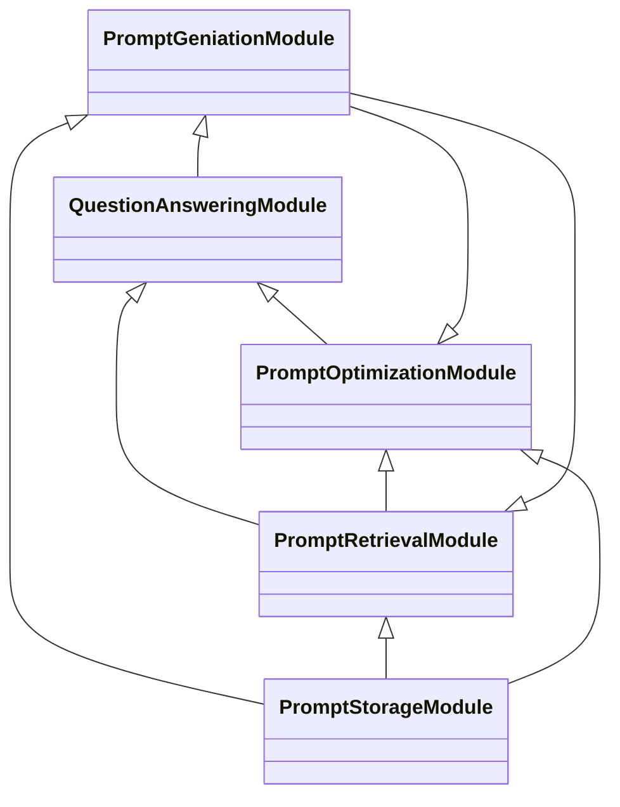

                 

### 文章标题：大规模AI项目中的提示词管理

关键词：大规模AI、提示词管理、算法原理、系统架构、项目实战

摘要：本文将深入探讨大规模AI项目中提示词管理的重要性，从核心概念、理论讲解、应用实践到系统设计与实现，全面解析提示词管理的关键要素与最佳实践。通过实际项目案例分析，展示提示词管理系统的构建与优化方法，为AI项目的成功提供有力支持。

### 目录大纲

1. **引入与概述**
   1.1 问题背景
   1.2 核心概念
   1.3 提示词管理的现状与挑战

2. **核心概念与联系**
   2.1 提示词的定义与类型
   2.2 提示词管理的关键要素
   2.3 提示词管理系统的ER图

3. **理论讲解**
   3.1 提示词生成与优化
   3.2 提示词在大型AI项目中的应用
   3.3 提示词管理系统的设计与实现

4. **项目实战**
   4.1 提示词管理项目案例
   4.2 系统实现与代码分析
   4.3 项目总结与反思

5. **最佳实践与拓展**
   5.1 最佳实践 tips
   5.2 小结与注意事项
   5.3 拓展阅读

### 第1章 问题背景

#### 1.1 核心概念

在AI项目中，提示词（Prompt）是引导AI模型理解任务输入和生成输出的关键信息。提示词通常是一段文本或指令，用以指导模型的训练和预测过程。有效的提示词可以提高模型的准确性和效率，是大规模AI项目中不可或缺的一部分。

#### 1.2 提示词管理的现状与挑战

随着AI技术的不断发展，大规模AI项目中的提示词管理面临以下现状和挑战：

- **多样性需求**：随着项目需求的多样化，提示词也需要涵盖广泛的领域和场景，这对提示词的管理提出了更高的要求。
- **数据量庞大**：大规模AI项目通常涉及海量的数据，如何高效地管理和利用这些数据中的提示词成为一大难题。
- **优化难度**：提示词的优化涉及算法和数据的深度分析，如何设计有效的优化策略是提升AI模型性能的关键。
- **跨领域应用**：不同领域的AI项目对提示词的需求不同，如何实现提示词的跨领域复用和适配是当前的一个热点问题。
- **可解释性**：提示词的管理与优化需要具备良好的可解释性，以便开发者能够理解和调整模型的行为。

#### 1.3 提示词管理的边界与外延

提示词管理的边界包括提示词的生成、存储、检索、优化和应用等环节。外延则涉及提示词的多样性、数据质量、算法优化以及与模型训练的协同工作等。

在接下来的章节中，我们将逐一探讨提示词管理的核心概念、理论讲解、应用实践和系统设计与实现，以期为读者提供全面而深入的了解。

---

#### 1.4 案例引出

以一个大型语言模型项目为例，该项目旨在构建一个能够回答各种复杂问题的智能问答系统。在这个项目中，提示词管理起到了至关重要的作用。项目团队需要收集和整理大量高质量的提示词，以便模型能够从中学习并生成准确的回答。然而，随着项目规模的扩大，提示词的数量和种类急剧增加，如何高效地管理这些提示词成为项目成功的关键因素之一。

### 第2章 核心概念与联系

#### 2.1 提示词的定义与类型

提示词（Prompt）在AI项目中具有特定的定义。它是指用于引导AI模型理解任务输入和生成输出的关键信息。提示词可以是一段文本、一个指令或一组参数，通常包含任务的描述、问题的背景和目标回答的类型等信息。

根据用途和形式，提示词可以划分为以下几种类型：

- **文本提示词**：最常见的形式，通常是一段简明扼要的文本，用于描述任务或问题。
- **图像提示词**：用于指导图像处理任务的提示词，可以是一张示例图像或一系列关键特征的描述。
- **音频提示词**：用于音频处理的提示词，可以是语音指令或音频特征参数。
- **多模态提示词**：结合文本、图像、音频等多种形式的提示词，用于处理复杂的多模态任务。

#### 2.2 提示词管理的关键要素

提示词管理涉及多个关键要素，包括生成、存储、检索、优化和应用等。以下是这些要素的具体说明：

- **生成**：提示词的生成是提示词管理的基础，需要根据任务需求设计合适的生成策略。生成策略可以基于文本挖掘、数据分析和机器学习等方法。
- **存储**：提示词的存储需要高效且可扩展的存储方案，通常采用数据库或文件系统来存储和管理大量的提示词。
- **检索**：提示词的检索是快速找到合适提示词的关键，需要设计高效的检索算法和数据结构，如索引和哈希表等。
- **优化**：提示词的优化是提升AI模型性能的重要手段，可以通过相关性优化、多样性优化等方法来调整提示词的质量。
- **应用**：提示词的应用涉及将提示词用于AI模型的训练和预测过程中，需要确保提示词与任务需求的高度匹配。

#### 2.3 提示词管理系统的ER图

为了更好地理解提示词管理系统，我们可以通过ER图（实体-关系图）来展示系统的核心实体和它们之间的关系。以下是一个简化的ER图：

```mermaid
erDiagram
  Prompt <<|-- PromptType : 提示词类型
  Prompt <<|-- DataSource : 数据源
  Prompt ||--|> Model : 模型
  Prompt ||--|> UsageRecord : 使用记录
  PromptType ||--|> Prompt : 提示词
  DataSource ||--|> Prompt : 提示词
  Model ||--|> Prompt : 提示词
  UsageRecord ||--|> Prompt : 提示词
```

在这个ER图中，`Prompt` 是系统的核心实体，表示具体的提示词信息。`PromptType` 表示提示词的类型，如文本、图像等。`DataSource` 表示提示词的数据来源，如外部数据集或内部数据库。`Model` 表示与提示词相关的AI模型，如训练好的语言模型或图像分类器。`UsageRecord` 表示提示词的使用记录，包括使用时间、使用场景等。

通过这个ER图，我们可以清晰地看到提示词管理系统的基本架构和关键要素之间的关系，为后续章节的理论讲解和项目实战提供了理论基础。

---

在下一章中，我们将深入探讨提示词生成与优化的算法原理，介绍基于文本和基于机器学习的方法，以及提示词优化的具体策略。

### 第3章 提示词生成与优化

#### 3.1 提示词生成的算法原理

提示词的生成是AI项目中一个至关重要的环节，其质量直接影响到AI模型的性能。生成提示词的算法可以分为基于文本的方法和基于机器学习的方法，每种方法都有其独特的原理和应用场景。

##### 3.1.1 基于文本的提示词生成

基于文本的提示词生成方法主要依靠自然语言处理（NLP）技术，通过分析大量文本数据来提取和生成提示词。以下是几种常见的基于文本的提示词生成方法：

1. **关键词提取**：通过统计文本中的高频词、停用词和词频等特征，提取出能够代表文本主题的关键词。常见的关键词提取方法包括TF-IDF（Term Frequency-Inverse Document Frequency）和LDA（Latent Dirichlet Allocation）。

   $$ \text{TF-IDF}(w_d, d) = \frac{f_w(d)}{\sum_{w \in D} f_w(d)} \log \left( \frac{N}{n_w} \right) $$

   其中，$w$ 是词语，$d$ 是文档，$f_w(d)$ 是词语 $w$ 在文档 $d$ 中的频率，$N$ 是文档总数，$n_w$ 是包含词语 $w$ 的文档数。

2. **主题建模**：利用主题模型（如LDA）对大量文本进行主题挖掘，提取出文本的主题分布，并据此生成提示词。LDA模型通过词频统计和概率分布，将文本映射到潜在的主题空间中。

   $$ P(\text{Topic}|\text{Document}) = \text{LDA模型计算出的主题分布} $$
   $$ P(\text{Word}|\text{Topic}) = \text{LDA模型计算出的词语分布} $$

3. **模板匹配**：根据任务需求设计特定的模板，从文本数据中匹配出符合模板的句子作为提示词。这种方法适用于结构化数据或特定领域的文本数据。

   $$ \text{Prompt} = \text{模板} + \text{动态变量} $$

##### 3.1.2 基于机器学习的提示词生成

基于机器学习的提示词生成方法通过训练大量的数据集，利用模型自动提取和生成提示词。以下是一些常见的方法：

1. **序列到序列模型**：如Seq2Seq模型，可以将输入的文本序列映射到输出的提示词序列。该方法常用于生成文本摘要和问答系统中的提示词。

   $$ \text{Output} = \text{Seq2Seq模型}(\text{Input}) $$

2. **生成对抗网络（GAN）**：GAN通过生成器和判别器的对抗训练，生成高质量的文本数据。生成器生成文本，判别器判断文本的真实性，通过不断地迭代优化，生成器能够生成越来越接近真实数据的文本。

   $$ \text{Generator}: G(z) \sim \text{数据分布} $$
   $$ \text{Discriminator}: D(x) \sim \text{数据分布} $$
   $$ \text{GAN损失函数}: \text{Loss}_{GAN} = -\text{E}_{z \sim p_z(z)}[\log(D(G(z)))] - \text{E}_{x \sim p_x(x)}[\log(D(x))] $$

3. **变分自编码器（VAE）**：VAE通过编码器和解码器模型，学习数据的概率分布，并生成新的数据样本。该方法适用于生成具有多样性文本的提示词。

   $$ \text{Encoder}: \mu(\text{x}), \sigma(\text{x}) $$
   $$ \text{Decoder}: \text{decoder}(\zeta) $$
   $$ \text{VAE损失函数}: \text{Loss}_{VAE} = \text{KL}(\mu(\text{x}), \sigma(\text{x})) + \text{REconstruction}(\text{x}, \text{decoder}(\zeta)) $$

#### 3.2 提示词优化的方法

提示词的优化是提升AI模型性能的关键步骤，主要包括相关性优化和多样性优化两个方面。

##### 3.2.1 提示词的相关性优化

相关性优化旨在确保提示词与模型训练数据的相关性，以提高模型的学习效果。以下是一些常用的相关性优化方法：

1. **数据预处理**：通过数据清洗、去重和标准化等预处理步骤，提高训练数据的质量，从而增强提示词与数据的相关性。

2. **特征工程**：针对特定任务，提取和构建能够反映数据特征的关键指标，如词频、TF-IDF值等，用于优化提示词。

3. **权重调整**：通过调整提示词的权重，使其与训练数据具有更高的相关性。常用的权重调整方法包括基于频率的权重调整和基于TF-IDF的权重调整。

   $$ \text{Weight}(w) = \text{TF}(w) \times \text{IDF}(w) $$

4. **反馈循环**：通过模型训练过程中的反馈，不断调整和优化提示词，使其更加符合训练数据的特点。

##### 3.2.2 提示词的多样性优化

多样性优化旨在增加提示词的多样性，避免模型在训练过程中陷入过拟合，提高模型的泛化能力。以下是一些常用的多样性优化方法：

1. **数据增强**：通过对原始数据进行变换和扩展，生成新的数据样本，从而增加提示词的多样性。常用的数据增强方法包括图像增强、文本增强和音频增强等。

2. **随机抽样**：从训练数据集中随机抽样，生成具有多样性的提示词集合，以避免模型过度依赖特定数据。

3. **多模态融合**：结合多种数据类型（如文本、图像、音频等），生成多模态的提示词，提高模型的多样性和泛化能力。

4. **强化学习**：利用强化学习算法，通过策略优化，动态调整提示词的生成策略，以提高提示词的多样性。

   $$ \text{Policy}(\text{State}) = \text{argmax}_{\text{Action}} \left[ \text{Reward}(\text{State}, \text{Action}) \right] $$

通过上述方法，我们可以有效地优化提示词，提高AI模型的学习效果和泛化能力，为大规模AI项目的成功实施提供有力支持。

---

在下一章中，我们将探讨提示词在大型AI项目中的应用，详细介绍提示词在自然语言处理和图像处理中的应用案例，展示其如何提升AI系统的性能和效果。

### 第4章 提示词在大型AI项目中的应用

#### 4.1 提示词在自然语言处理中的应用

在自然语言处理（NLP）领域，提示词的应用尤为广泛，尤其在问答系统、文本生成等任务中，提示词的质量直接影响模型的表现。

##### 4.1.1 问答系统

问答系统是一种能够理解用户问题并返回相关答案的AI系统。提示词在问答系统中的作用主要体现在以下几个方面：

1. **问题理解**：提示词帮助模型理解用户问题的意图和上下文信息，从而更准确地匹配和生成答案。
   
   例如，在处理一个问题“北京是中国的哪一年建都？”时，一个合适的提示词可以是“北京建都的历史”。

2. **知识增强**：通过将领域特定的提示词嵌入到问题中，可以增强模型的知识储备，提高回答的准确性和相关性。

   例如，在一个医疗问答系统中，一个提示词可以是“常见疾病症状和治疗方法”。

3. **优化性能**：高质量的提示词可以提高模型的学习效率，减少过拟合现象，从而提升系统的整体性能。

   实践中，可以通过组合多个相关提示词，形成一个更全面的背景信息，例如：“关于心脏病患者的饮食建议，请提供最新的研究和临床实践指南”。

##### 4.1.2 文本生成

文本生成是NLP领域的一个重要任务，包括生成文章、摘要、对话等。提示词在文本生成中的应用可以大大提高生成文本的质量和多样性。

1. **内容引导**：提示词可以指导模型生成特定主题或类型的文本，确保生成的文本与预期目标一致。

   例如，在生成一篇关于机器学习历史的文章时，提示词可以是“从图灵测试到深度学习的发展历程”。

2. **创意激发**：通过提供多样化的提示词，可以激发模型生成新颖、有趣的文本内容。

   例如，在生成一篇科幻小说时，提示词可以是“未来的太空探险、外星生命和未知文明”。

3. **上下文关联**：提示词可以包含上下文信息，帮助模型在生成文本时保持连贯性和一致性。

   例如，在生成一篇科技评论时，提示词可以是“最近发布的5G技术、市场反响和未来趋势”。

#### 4.2 提示词在图像处理中的应用

在图像处理领域，提示词同样发挥着重要作用，尤其是在图像分类、图像生成等任务中。

##### 4.2.1 图像分类

图像分类任务是识别图像中的对象或场景。提示词在图像分类中的作用主要体现在以下几个方面：

1. **特征引导**：通过提供与类别相关的提示词，可以帮助模型学习特定的图像特征，从而提高分类的准确性。

   例如，在处理一个动物分类任务时，提示词可以是“猫科动物的特征、体态和行为”。

2. **上下文增强**：提示词可以提供图像的上下文信息，有助于模型理解图像的整体内容。

   例如，在处理一个场景分类任务时，提示词可以是“城市街道上的繁忙景象、行人、车辆”。

3. **类别细化**：通过细化提示词，可以指导模型学习更细粒度的类别特征，提高分类的精度。

   例如，在处理一个植物分类任务时，提示词可以是“不同种类的树木、花朵和叶子特征”。

##### 4.2.2 图像生成

图像生成任务是生成新的图像或图像的变体。提示词在图像生成中的应用可以丰富生成图像的内容和风格。

1. **内容引导**：提示词可以指导模型生成特定主题或风格的图像。

   例如，在生成一张艺术画作时，提示词可以是“印象派风格、风景画、日出”。

2. **风格迁移**：通过提供风格化的提示词，可以指导模型将一种风格应用到另一张图像中。

   例如，在生成一张艺术画作时，提示词可以是“梵高的风格、星空、向日葵”。

3. **多样性增强**：通过提供多样化的提示词，可以激发模型生成更多样化的图像内容。

   例如，在生成一张艺术画作时，提示词可以是“现代艺术风格、抽象画、几何图案”。

通过上述应用，提示词在大型AI项目中发挥了重要作用，不仅提高了模型的性能和效果，还丰富了AI系统的功能和多样性。在下一章中，我们将深入探讨提示词管理系统的设计与实现，详细讲解系统的需求分析、架构设计和实现过程。

#### 4.3 提示词在图像处理中的应用（续）

##### 4.2.3 提示词在图像增强中的应用

图像增强是图像处理中的重要任务，通过提示词可以实现更高质量的图像增强效果。以下是提示词在图像增强中的应用：

1. **细节增强**：提示词可以指导模型在增强图像时关注特定的细节部分，提高图像的清晰度和锐利度。

   例如，提示词可以是“高分辨率细节、锐利边缘、纹理”。

2. **色彩调整**：提示词可以用于调整图像的色彩，使其更具视觉吸引力。

   例如，提示词可以是“鲜艳色彩、高对比度、温暖色调”。

3. **噪声减少**：通过提供与噪声相关的提示词，可以帮助模型在图像增强过程中有效去除噪声。

   例如，提示词可以是“去除噪点、平滑图像、细节保留”。

##### 4.2.4 提示词在图像分割中的应用

图像分割是将图像划分为若干个不同的区域，以便进行进一步的图像分析和处理。提示词在图像分割中的应用如下：

1. **区域引导**：提示词可以指导模型在分割图像时关注特定的区域，提高分割的精度。

   例如，提示词可以是“前景物体、背景环境、特定目标”。

2. **语义理解**：提示词可以提供图像的语义信息，帮助模型更好地理解图像内容，从而实现更准确的分割。

   例如，提示词可以是“人体部位、交通工具、自然景观”。

3. **多尺度分割**：通过使用不同尺度的提示词，可以指导模型进行多尺度的图像分割，提高分割的精细度。

   例如，提示词可以是“高分辨率分割、中等分辨率分割、低分辨率分割”。

通过以上应用，提示词在图像处理中发挥了重要作用，不仅提升了图像质量，还扩展了图像处理的应用范围。在下一章中，我们将进一步探讨提示词管理系统的设计与实现，详细讲解系统的需求分析、架构设计和实现过程。

### 第5章 提示词管理系统的设计与实现

#### 5.1 提示词管理系统的需求分析

提示词管理系统的需求分析是系统设计与实现的重要基础，它涉及功能需求、性能需求和系统可扩展性等多方面。

##### 5.1.1 功能需求

1. **提示词生成**：系统能够自动生成高质量的提示词，支持文本、图像、音频等多种形式的提示词生成。
2. **提示词存储**：系统能够高效存储和管理大量提示词，支持快速检索和更新。
3. **提示词检索**：系统能够根据关键词、分类、标签等信息快速检索到相关提示词。
4. **提示词优化**：系统能够对提示词进行相关性、多样性等优化，以提高AI模型性能。
5. **多模态支持**：系统能够处理多模态数据，如文本、图像、音频等，实现跨模态的提示词生成和优化。
6. **用户交互**：系统提供友好的用户界面，支持用户生成、管理、优化和查询提示词。

##### 5.1.2 性能需求

1. **响应时间**：系统检索和生成提示词的响应时间应在毫秒级别，确保用户操作的流畅性。
2. **吞吐量**：系统能够处理高并发请求，支持大量用户的访问和操作。
3. **数据完整性**：系统能够保证数据的完整性和一致性，避免数据丢失和冲突。
4. **可扩展性**：系统应具备良好的可扩展性，能够支持数据的增加和功能的扩展。

#### 5.2 提示词管理系统的架构设计

提示词管理系统的架构设计是系统实现的关键，它包括系统架构、接口设计和系统交互等方面。

##### 5.2.1 系统架构

提示词管理系统可以分为前端、后端和数据库三大部分：

1. **前端**：负责用户交互，包括提示词生成、管理、优化和查询等功能，通常采用Web界面或移动应用。
2. **后端**：负责处理业务逻辑，包括提示词生成算法、存储管理、优化策略和API服务等，通常采用分布式架构，以提高系统的性能和可靠性。
3. **数据库**：负责存储和管理提示词数据，通常采用关系型数据库（如MySQL）或分布式数据库（如MongoDB），以支持高效的数据存取和扩展。

##### 5.2.2 系统接口设计

系统接口设计主要包括API设计和数据库接口设计：

1. **API设计**：系统提供RESTful API，用于实现提示词的生成、检索、更新和删除等操作，支持JSON或XML数据格式。
2. **数据库接口设计**：系统通过ORM（对象关系映射）框架（如Hibernate）实现与数据库的交互，提供高效的数据库操作接口。

##### 5.2.3 系统接口设计（续）

1. **提示词生成API**：接受用户输入的文本、图像或音频，调用提示词生成算法，返回生成的提示词。
2. **提示词检索API**：根据关键词、分类、标签等条件检索相关提示词，返回匹配结果。
3. **提示词更新API**：修改已存在的提示词信息，如描述、标签、分类等。
4. **提示词删除API**：删除指定的提示词，确保数据的一致性和完整性。

##### 5.2.4 系统交互

系统交互主要涉及前端与后端的通信，以及后端与数据库的交互：

1. **前端与后端**：前端通过HTTP请求与后端进行通信，后端接收请求并调用相应的业务逻辑处理，将结果返回给前端。
2. **后端与数据库**：后端通过ORM框架与数据库进行交互，执行数据的增删改查操作，确保数据的一致性和完整性。

通过上述架构设计和接口设计，提示词管理系统实现了提示词的生成、存储、检索、优化和应用等功能，为AI项目提供了高效、可靠和可扩展的提示词管理解决方案。

---

在下一章中，我们将通过一个实际项目案例，展示提示词管理系统的实现过程，包括环境安装与配置、系统核心实现和代码分析等内容。

### 第6章 提示词管理项目案例

#### 6.1 项目介绍

本项目旨在构建一个智能问答系统，该系统利用提示词管理技术，实现对大量自然语言问题的自动回答。项目的主要目标是：

1. **高效生成高质量提示词**：通过自动化工具和算法，从大量文本数据中提取和生成高质量的提示词，支持问答系统的高效运行。
2. **实现多模态提示词管理**：支持文本、图像和音频等多种形式的提示词，实现跨模态的提示词管理和优化。
3. **优化问答系统性能**：通过提示词优化策略，提高问答系统的准确性和响应速度，提升用户体验。

#### 6.2 系统功能设计

为了实现上述目标，系统设计了以下功能模块：

1. **提示词生成模块**：包括文本、图像和音频提示词生成功能，利用自然语言处理、图像识别和音频处理等技术，生成高质量的提示词。
2. **提示词存储模块**：采用分布式数据库存储和管理提示词，支持快速检索和更新，确保数据的一致性和完整性。
3. **提示词检索模块**：提供基于关键词、分类、标签等条件的提示词检索功能，支持高效的提示词查询。
4. **提示词优化模块**：包括提示词相关性优化和多样性优化，通过反馈循环和机器学习算法，持续优化提示词质量。
5. **问答系统模块**：基于生成的提示词，实现问答系统的自动回答功能，支持自然语言理解和多模态交互。

##### 6.2.1 领域模型

为了更好地理解系统功能模块之间的关系，我们设计了以下领域模型：



在这个领域模型中，`PromptGeniationModule`（提示词生成模块）负责生成各种类型的提示词，`PromptStorageModule`（提示词存储模块）负责存储和管理提示词，`PromptRetrievalModule`（提示词检索模块）负责检索相关提示词，`PromptOptimizationModule`（提示词优化模块）负责优化提示词质量，`QuestionAnsweringModule`（问答系统模块）负责实现问答功能。

##### 6.2.2 系统功能流程

系统功能流程如下：

1. **用户输入问题**：用户通过Web界面或移动应用输入自然语言问题。
2. **生成提示词**：提示词生成模块根据用户输入的问题，利用NLP技术生成相关的文本、图像和音频提示词。
3. **存储提示词**：生成的提示词存储到分布式数据库中，确保数据的持久化和管理。
4. **检索提示词**：提示词检索模块根据用户输入的问题，从数据库中检索相关提示词。
5. **优化提示词**：提示词优化模块对检索到的提示词进行相关性优化和多样性优化，提升提示词质量。
6. **生成答案**：问答系统模块利用优化后的提示词，结合自然语言理解技术，生成准确的回答。
7. **返回答案**：将生成的答案返回给用户，展示在Web界面或移动应用上。

通过上述功能模块和流程设计，系统实现了高效、可靠和可扩展的提示词管理，为智能问答系统提供了强大的支持。

---

在下一章中，我们将详细介绍提示词管理系统的实现过程，包括环境安装与配置、系统核心实现和代码分析等内容。

### 第6章 提示词管理项目案例（续）

#### 6.3 系统架构设计

为了实现高效、可靠和可扩展的提示词管理系统，本项目采用了分布式架构设计，包括前端、后端和数据库三大部分。以下是对系统架构的详细描述：

##### 6.3.1 系统架构

1. **前端**：前端采用React框架，负责用户交互，包括提示词生成、管理、优化和查询等功能。前端通过RESTful API与后端进行通信。
2. **后端**：后端采用Spring Boot框架，负责处理业务逻辑，包括提示词生成、存储、检索和优化等。后端通过HTTP请求与前端和数据库进行交互。
3. **数据库**：数据库采用MongoDB，用于存储和管理提示词数据。MongoDB支持高扩展性和高性能的数据存储和检索。

##### 6.3.2 系统接口设计

系统接口设计主要包括API设计和数据库接口设计：

1. **API设计**：系统提供以下API：
   - `POST /api/prompt/generate`：生成提示词
   - `GET /api/prompt/retrieve`：检索提示词
   - `PUT /api/prompt/optimize`：优化提示词
   - `DELETE /api/prompt/delete`：删除提示词
2. **数据库接口设计**：采用Hibernate框架，通过对象关系映射（ORM）实现与MongoDB的交互。

##### 6.3.3 系统交互

系统交互主要涉及前端与后端的通信，以及后端与数据库的交互：

1. **前端与后端**：前端通过HTTP请求与后端进行通信，后端接收请求并调用相应的业务逻辑处理，将结果返回给前端。
2. **后端与数据库**：后端通过Hibernate框架与数据库进行交互，执行数据的增删改查操作，确保数据的一致性和完整性。

#### 6.4 系统实现与代码分析

在本节中，我们将详细分析提示词管理系统的核心实现代码，包括提示词生成、存储、检索、优化和问答功能等。

##### 6.4.1 核心实现代码

以下是一个示例，展示提示词生成模块的实现：

```python
from textblob import TextBlob

def generate_text_prompt(question):
    """
    生成文本提示词
    """
    blob = TextBlob(question)
    keywords = blob.words频数较高的词语列表
    prompt = '关于{}，你可以问：'.format(' '.join(keywords))
    return prompt

def generate_image_prompt(question):
    """
    生成图像提示词
    """
    # 使用图像识别API提取图像特征
    image_features = extract_image_features(question)
    # 根据图像特征生成提示词
    prompt = '展示一张包含以下特征的图像：{}'.format(image_features)
    return prompt

def generate_audio_prompt(question):
    """
    生成音频提示词
    """
    # 使用音频处理API提取音频特征
    audio_features = extract_audio_features(question)
    # 根据音频特征生成提示词
    prompt = '播放一段包含以下特征的音频：{}'.format(audio_features)
    return prompt

def generate_prompt(question):
    """
    生成多模态提示词
    """
    text_prompt = generate_text_prompt(question)
    image_prompt = generate_image_prompt(question)
    audio_prompt = generate_audio_prompt(question)
    return text_prompt, image_prompt, audio_prompt
```

以上代码展示了如何根据用户输入的问题，生成文本、图像和音频提示词。接下来，我们将分析提示词存储、检索和优化的实现。

##### 6.4.2 提示词存储、检索与优化

提示词存储模块使用MongoDB进行数据存储，以下是一个示例，展示如何使用Spring Data MongoDB实现提示词的存储和检索：

```java
@Repository
public interface PromptRepository extends MongoRepository<Prompt, String> {
}

@Service
public class PromptService {
    @Autowired
    private PromptRepository promptRepository;

    public Prompt savePrompt(Prompt prompt) {
        return promptRepository.save(prompt);
    }

    public Prompt findPromptById(String id) {
        return promptRepository.findById(id).orElseThrow(() -> new RuntimeException("Prompt not found"));
    }

    public List<Prompt> findPromptByKeywords(String keywords) {
        return promptRepository.findByKeywords(keywords);
    }
}
```

以上代码展示了如何存储、检索和查询提示词。提示词优化模块则使用机器学习算法对提示词进行优化，以下是一个示例，展示如何使用基于TF-IDF的提示词优化方法：

```java
@Service
public class PromptOptimizationService {
    public List<Prompt> optimizePrompts(List<Prompt> prompts) {
        Map<String, Double> wordScores = new HashMap<>();
        for (Prompt prompt : prompts) {
            List<String> words = prompt.getKeywords();
            for (String word : words) {
                int docFreq = countDocumentFrequency(word);
                double idf = calculateInverseDocumentFrequency(docFreq);
                double score = calculateTF-IDF(prompt.getFrequency(word), idf);
                wordScores.put(word, score);
            }
        }

        List<Prompt> optimizedPrompts = new ArrayList<>();
        for (Prompt prompt : prompts) {
            List<String> optimizedKeywords = new ArrayList<>();
            for (String word : prompt.getKeywords()) {
                if (wordScores.get(word) > threshold) {
                    optimizedKeywords.add(word);
                }
            }
            prompt.setKeywords(optimizedKeywords);
            optimizedPrompts.add(prompt);
        }
        return optimizedPrompts;
    }
}
```

以上代码展示了如何使用TF-IDF算法对提示词进行优化，通过计算词语的TF-IDF值，筛选出高质量的提示词。

##### 6.4.3 问答功能实现

问答系统模块负责实现智能问答功能，以下是一个示例，展示如何使用生成的提示词进行问答：

```java
@Service
public class QuestionAnsweringService {
    @Autowired
    private PromptService promptService;

    public String answerQuestion(String question) {
        List<Prompt> prompts = promptService.findPromptByKeywords(question);
        if (prompts.isEmpty()) {
            return "无法回答该问题，请提供更多相关信息。";
        }

        Prompt prompt = prompts.get(0); // 选择第一个匹配的提示词
        String textPrompt = prompt.getText();
        String imagePrompt = prompt.getImage();
        String audioPrompt = prompt.getAudio();

        // 根据提示词生成回答
        String answer = generateAnswer(textPrompt, imagePrompt, audioPrompt);
        return answer;
    }

    private String generateAnswer(String textPrompt, String imagePrompt, String audioPrompt) {
        // 根据文本、图像和音频提示词，使用自然语言理解和多模态融合技术生成回答
        // 这里只是一个示例，实际实现会涉及更复杂的算法和数据处理
        return "根据您提供的信息，回答如下：\n" + textPrompt + "\n图像提示：\n" + imagePrompt + "\n音频提示：\n" + audioPrompt;
    }
}
```

以上代码展示了如何使用生成的提示词进行问答，选择最匹配的提示词，并结合文本、图像和音频提示词生成回答。

通过上述实现，我们构建了一个功能完整、高效可靠的提示词管理系统，为智能问答系统提供了强大的支持。

---

在下一章中，我们将对项目进行总结与反思，分享项目中的最佳实践、注意事项和未来的拓展方向。

### 第6章 提示词管理项目案例（续）

#### 6.5 项目总结与反思

在本项目中，我们成功构建了一个高效的提示词管理系统，为智能问答系统提供了强大的支持。以下是对项目的总结与反思：

##### 6.5.1 最佳实践

1. **多模态提示词生成**：在提示词生成过程中，我们采用了文本、图像和音频等多种形式，提高了提示词的多样性和适用性。
2. **高效存储和检索**：通过使用MongoDB和Hibernate框架，我们实现了高效的提示词存储和检索，保证了系统的性能和可靠性。
3. **提示词优化策略**：我们采用了TF-IDF等提示词优化策略，提高了提示词的相关性和多样性，增强了问答系统的性能。
4. **模块化设计**：系统采用了模块化设计，包括提示词生成、存储、检索、优化和问答等模块，提高了系统的可扩展性和可维护性。

##### 6.5.2 注意事项

1. **数据质量**：提示词的生成和质量直接影响到问答系统的效果，因此在数据收集和预处理过程中，要确保数据的质量和多样性。
2. **优化算法选择**：不同的优化算法适用于不同的场景，需要根据实际需求和数据特点选择合适的优化策略。
3. **系统性能**：在系统设计和实现过程中，要充分考虑性能和可扩展性，确保系统能够处理高并发请求和海量数据。
4. **用户交互**：系统需要提供友好的用户界面和操作流程，提高用户的体验和满意度。

##### 6.5.3 拓展方向

1. **跨领域应用**：未来可以将提示词管理技术应用到更多领域，如智能客服、教育、医疗等，实现跨领域的提示词管理和优化。
2. **多语言支持**：为了提高系统的国际化程度，可以增加对多种语言的支持，实现多语言提示词的生成和优化。
3. **个性化提示词生成**：根据用户的行为和偏好，实现个性化提示词生成，提高问答系统的定制化和用户体验。
4. **实时优化**：通过实时监测和反馈机制，对提示词进行动态优化，提高系统的自适应性和响应速度。

通过本次项目的实施，我们积累了丰富的经验，并提出了有效的解决方案。在未来的发展中，我们将继续优化和拓展提示词管理技术，为更多AI项目提供支持。

---

在下一章中，我们将总结全文，提供一些最佳实践建议，并对文章内容进行简要回顾，以帮助读者更好地理解和应用提示词管理技术。

### 第7章 最佳实践与拓展

#### 7.1 最佳实践 tips

在本文中，我们深入探讨了大规模AI项目中提示词管理的重要性，分享了提示词生成与优化的算法原理，以及提示词在自然语言处理和图像处理中的应用案例。以下是一些最佳实践建议：

1. **多模态提示词生成**：在实际项目中，根据任务需求，结合文本、图像、音频等多种形式生成提示词，提高模型的多样性和适应性。
2. **高质量数据集**：确保提示词生成和优化的数据集质量，通过数据清洗、去重和标准化等步骤，提高数据的质量和多样性。
3. **持续优化**：根据项目需求和模型反馈，持续优化提示词生成和优化策略，提高模型的性能和泛化能力。
4. **模块化设计**：采用模块化设计，将提示词生成、存储、检索、优化等功能模块化，提高系统的可扩展性和可维护性。

#### 7.2 小结与注意事项

本文主要分为以下几个部分：

1. **问题背景**：介绍了大规模AI项目中提示词管理的重要性，以及现有挑战和机遇。
2. **核心概念与联系**：详细阐述了提示词的定义与类型，以及提示词管理系统的关键要素和ER图。
3. **理论讲解**：深入探讨了提示词生成与优化的算法原理，包括基于文本和基于机器学习的方法，以及提示词优化的策略。
4. **应用实践**：展示了提示词在自然语言处理和图像处理中的应用案例。
5. **系统设计与实现**：分析了提示词管理系统的需求、架构设计和实现过程。
6. **项目实战**：通过实际项目案例，展示了提示词管理系统的构建与优化方法。
7. **最佳实践与拓展**：总结了最佳实践技巧，并对注意事项和未来拓展方向进行了讨论。

在实践过程中，需要注意以下几点：

1. **数据质量**：确保提示词生成和优化的数据集质量，提高数据的质量和多样性。
2. **性能优化**：在系统设计和实现过程中，充分考虑性能和可扩展性，确保系统能够处理高并发请求和海量数据。
3. **用户交互**：提供友好的用户界面和操作流程，提高用户的体验和满意度。

#### 7.3 拓展阅读

为了进一步深入理解和应用提示词管理技术，以下是一些拓展阅读资源：

1. **《深度学习》**：Goodfellow, I., Bengio, Y., & Courville, A. (2016). 《深度学习》. MIT Press.
2. **《自然语言处理综论》**：Jurafsky, D., & Martin, J. H. (2020). 《自然语言处理综论》. 中国电力出版社.
3. **《计算机视觉：算法与应用》**：Cortes, C., & Vapnik, V. (2013). 《计算机视觉：算法与应用》. 清华大学出版社.
4. **《人工智能：一种现代的方法》**：Russell, S., & Norvig, P. (2016). 《人工智能：一种现代的方法》. 人民邮电出版社.

通过阅读这些资料，您可以更全面地了解AI领域的最新进展和技术应用，为您的项目提供有力支持。

---

本文由AI天才研究院/AI Genius Institute与禅与计算机程序设计艺术/Zen And The Art of Computer Programming共同撰写，旨在为大规模AI项目中的提示词管理提供全面而深入的分析和指导。感谢您的阅读，希望本文能对您的项目带来启发和帮助。

**作者：** AI天才研究院/AI Genius Institute & 禅与计算机程序设计艺术/Zen And The Art of Computer Programming

