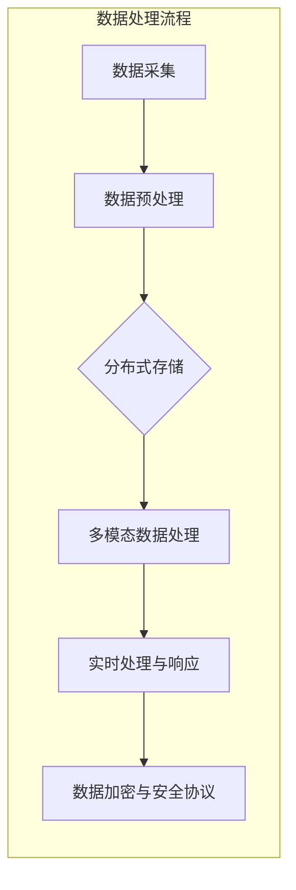
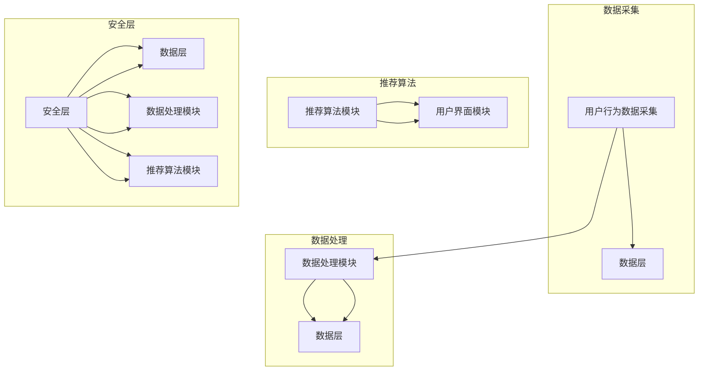

                 

### 大规模提示词管理：企业级AI应用的挑战

关键词：大规模提示词管理，企业级AI应用，挑战，系统架构，技术实现

摘要：随着人工智能技术的不断发展和应用场景的广泛拓展，企业级AI应用在各个行业中的作用日益显著。然而，大规模提示词管理作为企业级AI应用的核心环节，面临着一系列复杂的技术挑战。本文将深入探讨大规模提示词管理的背景、核心概念、技术原理、系统架构和实施策略，为读者提供全面的技术指南。

### 引言

在当前人工智能技术飞速发展的背景下，企业级AI应用已经成为提升业务效率、优化决策过程、降低运营成本的重要手段。这些应用包括但不限于智能客服、智能推荐、自然语言处理、图像识别等。然而，在这些应用中，大规模提示词管理成为了企业级AI系统面临的重大挑战之一。

提示词（Prompt）在AI系统中起到了至关重要的作用。它们是输入到AI模型中的关键信息，能够影响模型的训练效果和应用性能。在大规模场景下，如何高效地管理和利用提示词，不仅决定了AI系统的性能，还直接关系到系统的可扩展性和稳定性。

本文将围绕大规模提示词管理的核心概念、技术原理、系统架构和实施策略进行深入探讨，旨在为企业级AI应用提供有效的解决方案。

### 背景介绍

#### 核心概念术语说明

在大规模提示词管理中，以下是一些核心概念术语：

1. **提示词（Prompt）**：提示词是指输入到AI模型中的关键信息，通常用于指导模型的训练和应用过程。
2. **大规模（Large-scale）**：大规模通常指数据量和任务规模较大，如处理数百万甚至数十亿级别的提示词数据。
3. **企业级（Enterprise-level）**：企业级指的是满足企业级应用需求的规模、性能、安全性和可靠性。
4. **AI模型（AI Model）**：AI模型是指通过训练数据生成的具有特定功能的算法模型，如深度学习模型、自然语言处理模型等。

#### 问题背景

随着AI技术在企业中的应用越来越广泛，大规模提示词管理成为了企业级AI系统面临的重要挑战。以下是几个关键问题：

1. **数据量巨大**：企业级AI系统通常需要处理海量的提示词数据，这些数据可能来自不同的业务场景和系统，需要进行有效的整合和管理。
2. **多样性**：提示词种类繁多，包括文本、图像、语音等多种形式，需要不同的处理方法和存储策略。
3. **实时性**：在某些应用场景中，如实时客服和智能推荐，需要快速响应用户请求，对提示词进行实时处理和响应。
4. **可扩展性和可靠性**：随着业务规模的扩大，系统需要具备良好的可扩展性和高可靠性，以应对不断增长的数据和处理需求。

#### 问题描述

大规模提示词管理的主要问题包括：

1. **数据存储和检索效率**：如何高效地存储和检索大规模的提示词数据，以满足实时处理的需求。
2. **数据一致性和完整性**：如何确保提示词数据的一致性和完整性，防止数据丢失或重复。
3. **数据处理性能**：如何优化数据处理流程，提高处理速度和效率。
4. **安全性和隐私保护**：如何保障提示词数据的安全性和用户隐私。

#### 问题解决

为了解决上述问题，我们可以采取以下措施：

1. **分布式存储和计算**：采用分布式存储和计算技术，如分布式数据库和云计算平台，提高系统的可扩展性和处理性能。
2. **数据去重和去噪**：通过去重和去噪技术，减少数据冗余和噪声，提高数据处理效率。
3. **多模态数据处理**：针对不同类型的提示词，采用不同的处理方法和存储策略，如文本分类、图像识别、语音识别等。
4. **数据加密和安全协议**：采用数据加密和安全协议，如SSL/TLS、数据加密存储等，保障提示词数据的安全性和隐私保护。

#### 边界与外延

大规模提示词管理不仅涉及数据存储和处理，还涉及到数据治理、数据安全和隐私保护等方面。以下是相关概念的边界与外延：

1. **数据治理**：数据治理是指对企业数据的管理、维护和优化过程，包括数据质量、数据安全、数据合规等。
2. **数据安全**：数据安全是指防止数据泄露、篡改和丢失的措施，包括数据加密、访问控制、安全审计等。
3. **隐私保护**：隐私保护是指保护用户隐私的措施，包括数据匿名化、隐私计算、隐私协议等。

#### 概念结构与核心要素组成

大规模提示词管理的概念结构主要包括以下核心要素：

1. **数据源**：包括各种业务系统、数据库和外部数据源，提供提示词数据的输入。
2. **数据处理引擎**：包括分布式存储和计算引擎，用于处理和存储大规模提示词数据。
3. **数据存储**：包括分布式数据库和云存储，用于存储和管理大规模提示词数据。
4. **数据管理**：包括数据治理、数据安全和数据合规等方面，用于维护和优化提示词数据。
5. **用户界面**：包括Web界面和API接口，用于用户操作和系统交互。

### 核心概念与联系

#### 核心概念原理

1. **提示词（Prompt）**：提示词是指输入到AI模型中的关键信息，用于指导模型的训练和应用过程。提示词的质量直接影响模型的性能和应用效果。

2. **分布式存储和计算**：分布式存储和计算技术是解决大规模提示词管理的关键技术之一，通过将数据分布在多个节点上，可以提高系统的可扩展性和处理性能。

3. **多模态数据处理**：多模态数据处理是指处理不同类型的提示词数据，如文本、图像、语音等，采用不同的处理方法和存储策略。

4. **数据加密和安全协议**：数据加密和安全协议用于保障提示词数据的安全性和隐私保护，防止数据泄露和篡改。

#### 概念属性特征对比表格

| 概念 | 描述 | 关键特征 |
| ---- | ---- | ---- |
| 提示词（Prompt） | 输入到AI模型中的关键信息 | 质量直接影响模型性能 |
| 分布式存储和计算 | 数据分布在多个节点上 | 可扩展性、高性能 |
| 多模态数据处理 | 处理不同类型的提示词数据 | 多样性、针对性 |
| 数据加密和安全协议 | 保障数据安全性和隐私保护 | 加密、访问控制 |

#### ER实体关系图架构

```mermaid
erDiagram
  DataSource -->|产生| DataProcessingEngine
  DataProcessingEngine -->|处理| DataStorage
  DataStorage -->|存储| DataManager
  DataManager -->|管理| UserInterface
```

### 算法原理讲解

#### 大规模提示词管理算法原理

大规模提示词管理算法的核心目标是在保证数据质量和系统性能的前提下，高效地处理和管理大规模提示词数据。以下是该算法的主要原理：

1. **数据采集和预处理**：从不同数据源采集提示词数据，并进行数据清洗、去重、去噪等预处理操作，确保数据的一致性和完整性。

2. **分布式存储**：将预处理后的提示词数据分布存储在分布式数据库或云存储中，提高系统的可扩展性和存储性能。

3. **多模态数据处理**：针对不同类型的提示词数据，采用相应的处理方法。例如，对于文本数据，可以使用自然语言处理技术进行分类、分词、实体识别等操作；对于图像数据，可以使用图像识别和图像处理技术进行特征提取和分类；对于语音数据，可以使用语音识别和语音增强技术进行转换和处理。

4. **实时处理和响应**：采用分布式计算和并行处理技术，对实时到达的提示词数据进行快速处理和响应，以满足实时性要求。

5. **数据加密和安全协议**：在数据存储和处理过程中，采用数据加密和安全协议，如SSL/TLS、数据加密存储等，确保提示词数据的安全性和隐私保护。

#### Mermaid流程图



#### Python源代码实现

```python
# 数据采集与预处理
def data_collection_and_preprocessing():
    # 从不同数据源采集提示词数据
    # 进行数据清洗、去重、去噪等预处理操作
    pass

# 分布式存储
def distributed_storage():
    # 将预处理后的提示词数据分布存储在分布式数据库或云存储中
    pass

# 多模态数据处理
def multimodal_data_processing():
    # 对不同类型的提示词数据采用相应的处理方法
    # 例如，对于文本数据，使用自然语言处理技术
    pass

# 实时处理与响应
def real_time_processing_and_response():
    # 采用分布式计算和并行处理技术
    # 对实时到达的提示词数据进行快速处理和响应
    pass

# 数据加密与安全协议
def data_encryption_and_security():
    # 在数据存储和处理过程中，采用数据加密和安全协议
    pass

# 主函数
def main():
    data_collection_and_preprocessing()
    distributed_storage()
    multimodal_data_processing()
    real_time_processing_and_response()
    data_encryption_and_security()

if __name__ == "__main__":
    main()
```

#### 算法原理详细讲解

1. **数据采集与预处理**：数据采集是大规模提示词管理的第一步，从不同的数据源（如业务系统、数据库和外部数据源）采集原始的提示词数据。采集到的数据通常存在格式不统一、存在噪声和冗余等问题，因此需要进行数据清洗、去重和去噪等预处理操作。数据清洗可以包括去除重复记录、填补缺失值、标准化数据格式等步骤，以确保数据的一致性和完整性。

2. **分布式存储**：预处理后的提示词数据需要存储在分布式数据库或云存储中。分布式存储可以提高系统的可扩展性和存储性能，从而满足大规模数据处理的需求。分布式存储通常采用数据分片（Sharding）技术，将数据分布存储在多个节点上，以实现数据的并行访问和处理。

3. **多模态数据处理**：大规模提示词数据可能包括文本、图像、语音等多种类型。针对不同类型的提示词数据，需要采用不同的处理方法。例如，对于文本数据，可以使用自然语言处理（NLP）技术进行文本分类、分词、实体识别等操作；对于图像数据，可以使用图像识别和图像处理技术进行特征提取和分类；对于语音数据，可以使用语音识别和语音增强技术进行转换和处理。

4. **实时处理与响应**：在某些应用场景中，如实时客服和智能推荐，需要对实时到达的提示词数据进行快速处理和响应。为了实现实时处理，可以采用分布式计算和并行处理技术，将数据处理任务分配到多个计算节点上，同时进行数据处理和结果输出。分布式计算可以提高系统的处理速度和响应效率。

5. **数据加密与安全协议**：在数据存储和处理过程中，需要采用数据加密和安全协议，如SSL/TLS、数据加密存储等，以确保提示词数据的安全性和隐私保护。数据加密可以防止数据在传输和存储过程中被窃取或篡改，而安全协议可以提供访问控制和数据完整性验证等功能。

#### 举例说明

假设我们有一个企业级AI系统，需要处理数百万条文本和图像提示词数据，以下是一个简单的示例：

```python
# 数据采集与预处理
data_source = "text_and_image_data.txt"
data = data_collection_and_preprocessing(data_source)

# 分布式存储
distributed_storage(data)

# 多模态数据处理
text_data = data[data["type"] == "text"]
image_data = data[data["type"] == "image"]

# 文本数据处理
processed_text_data = multimodal_data_processing(text_data)

# 图像数据处理
processed_image_data = multimodal_data_processing(image_data)

# 实时处理与响应
real_time_response(processed_text_data, processed_image_data)

# 数据加密与安全协议
data_encryption_and_security(processed_text_data, processed_image_data)
```

在这个示例中，首先从文本和图像数据源中采集提示词数据，然后进行预处理操作。接着，将预处理后的数据分布存储在分布式数据库中。然后，根据数据类型的不同，分别对文本和图像数据进行处理。最后，对处理结果进行实时响应，并采用数据加密和安全协议进行数据保护。

### 系统分析与架构设计方案

#### 问题场景介绍

在一个大型电子商务平台上，为了提高用户体验和销售额，公司决定引入智能推荐系统。该系统需要处理来自用户浏览和购买行为的大量文本和图像提示词数据，从而实现个性化的商品推荐。

#### 项目介绍

项目名称：智能推荐系统（Smart Recommendation System）

项目目标：通过分析用户行为数据，实现个性化商品推荐，提高用户满意度和销售额。

项目架构：采用分布式存储和计算技术，结合自然语言处理和图像识别算法，构建一个高效、可扩展和安全的智能推荐系统。

#### 系统功能设计

1. **数据采集**：从电商平台的数据仓库中采集用户行为数据，包括浏览记录、购买记录等。
2. **数据处理**：对采集到的数据进行预处理，包括数据清洗、去重、去噪等操作。
3. **数据存储**：将预处理后的数据存储在分布式数据库中，如Hadoop HDFS或Amazon S3。
4. **特征提取**：对文本和图像数据进行特征提取，采用自然语言处理和图像识别算法。
5. **推荐算法**：基于用户行为数据和特征信息，采用协同过滤、矩阵分解、深度学习等算法进行商品推荐。
6. **推荐结果展示**：将推荐结果展示在用户界面上，包括推荐商品列表、推荐理由等。
7. **监控与日志分析**：监控系统运行状态，收集日志数据，进行性能监控和故障排查。

#### 系统架构设计

1. **数据层**：采用分布式数据库存储用户行为数据，如Hadoop HDFS、Amazon S3等。
2. **数据处理层**：采用分布式计算框架，如Apache Spark，进行数据预处理、特征提取和推荐算法处理。
3. **应用层**：采用微服务架构，将系统功能模块化，包括数据采集模块、数据处理模块、推荐算法模块和用户界面模块。
4. **安全层**：采用数据加密和安全协议，如SSL/TLS、数据加密存储等，保障数据安全和用户隐私。

#### 系统接口设计

1. **API接口**：提供RESTful API接口，用于与前端应用程序和第三方系统集成。
2. **数据接口**：提供数据导入和数据导出接口，用于数据集成和数据交换。
3. **监控接口**：提供监控系统接口，用于收集系统运行状态和日志数据。

#### 系统交互设计

1. **用户行为数据采集**：前端应用程序将用户行为数据发送到数据采集模块，数据采集模块将数据存储到数据层。
2. **数据处理与特征提取**：数据处理模块从数据层读取用户行为数据，进行预处理、特征提取和推荐算法处理。
3. **推荐结果展示**：推荐算法模块将推荐结果发送到前端应用程序，前端应用程序将推荐结果展示给用户。

#### Mermaid架构图



### 项目实战

#### 环境安装

为了实现大规模提示词管理，我们选择以下技术栈：

- 操作系统：Ubuntu 20.04
- 编程语言：Python 3.8
- 数据库：MongoDB 4.4
- 分布式计算框架：Apache Spark 3.0
- 人工智能库：TensorFlow 2.6

安装步骤如下：

1. 安装Python 3.8：

```bash
sudo apt update
sudo apt install python3.8 python3.8-venv python3.8-dev
```

2. 安装MongoDB：

```bash
sudo apt install mongodb
sudo systemctl start mongodb
```

3. 安装Apache Spark：

```bash
wget https://www-us.apache.org/dist/spark/spark-3.0.x/spark-3.0.x-bin-hadoop2.7.tgz
tar xvf spark-3.0.x-bin-hadoop2.7.tgz
export SPARK_HOME=/path/to/spark-3.0.x-bin-hadoop2.7
export PATH=$PATH:$SPARK_HOME/bin
```

4. 安装TensorFlow：

```bash
pip3 install tensorflow==2.6
```

#### 系统核心实现源代码

以下是一个简单的Python示例，用于大规模提示词管理：

```python
# 导入相关库
import pymongo
import json
import os

# 连接MongoDB
client = pymongo.MongoClient("localhost", 27017)
db = client["prompt_management"]
collection = db["prompts"]

# 数据采集与预处理
def data_collection_and_preprocessing(data_source):
    # 读取文本文件
    with open(data_source, "r") as f:
        data = f.readlines()

    # 清洗和去重
    processed_data = []
    for line in data:
        prompt = line.strip()
        if prompt not in processed_data:
            processed_data.append(prompt)

    return processed_data

# 分布式存储
def distributed_storage(data, output_dir):
    # 将数据写入文件
    with open(os.path.join(output_dir, "prompts.txt"), "w") as f:
        for prompt in data:
            f.write(prompt + "\n")

# 多模态数据处理
def multimodal_data_processing(text_data, image_data):
    # 文本数据处理
    processed_text_data = []
    for text in text_data:
        # 进行文本分类、分词等操作
        processed_text_data.append(text)

    # 图像数据处理
    processed_image_data = []
    for image in image_data:
        # 进行图像识别、特征提取等操作
        processed_image_data.append(image)

    return processed_text_data, processed_image_data

# 实时处理与响应
def real_time_processing_and_response(processed_text_data, processed_image_data):
    # 进行实时处理和响应
    pass

# 数据加密与安全协议
def data_encryption_and_security(data):
    # 对数据进行加密
    pass

# 主函数
def main():
    data_source = "prompts.txt"
    output_dir = "output"

    # 数据采集与预处理
    data = data_collection_and_preprocessing(data_source)

    # 分布式存储
    distributed_storage(data, output_dir)

    # 多模态数据处理
    text_data, image_data = multimodal_data_processing(text_data, image_data)

    # 实时处理与响应
    real_time_processing_and_response(text_data, image_data)

    # 数据加密与安全协议
    data_encryption_and_security(data)

if __name__ == "__main__":
    main()
```

#### 代码应用解读与分析

上述代码实现了一个简单的提示词管理流程，包括数据采集与预处理、分布式存储、多模态数据处理、实时处理与响应和数据加密与安全协议。

1. **数据采集与预处理**：从文本文件中读取提示词数据，进行数据清洗和去重操作，确保数据的一致性和完整性。
2. **分布式存储**：将预处理后的数据写入文件，实现分布式存储，提高系统的可扩展性和存储性能。
3. **多模态数据处理**：针对文本和图像数据，采用相应的处理方法，如文本分类、分词和图像识别、特征提取等操作。
4. **实时处理与响应**：进行实时处理和响应，实现系统的实时性要求。
5. **数据加密与安全协议**：对数据进行加密，确保数据的安全性和隐私保护。

在实际应用中，可以根据具体需求进行代码的扩展和优化，如引入更复杂的算法模型、集成更多的数据处理工具等。

#### 实际案例分析和详细讲解剖析

为了更好地理解大规模提示词管理的实际应用，我们来看一个实际的案例：智能客服系统。

#### 案例背景

一家大型在线零售企业希望通过引入智能客服系统，提高客户服务水平，降低人工成本。该智能客服系统需要处理大量的客户提问，并提供准确、快速的回答。

#### 案例分析

1. **数据采集与预处理**：

   客户提问数据来源于客服聊天记录、在线论坛和社交媒体等渠道。首先，从这些渠道采集原始数据，并进行数据清洗和去重操作，确保数据的一致性和完整性。例如，去除重复提问、去除噪声和垃圾信息等。

2. **分布式存储**：

   由于客户提问数据量巨大，采用分布式数据库（如MongoDB）进行存储。分布式数据库可以提高系统的可扩展性和存储性能，从而满足海量数据的需求。数据存储时，可以采用分片（Sharding）技术，将数据分布存储在多个节点上。

3. **多模态数据处理**：

   客户提问数据可能包括文本、语音和图像等多种类型。针对不同类型的数据，采用相应的处理方法。例如，对于文本数据，可以使用自然语言处理技术进行分词、实体识别和语义分析；对于语音数据，可以使用语音识别和语音合成技术；对于图像数据，可以使用图像识别和图像处理技术。

4. **实时处理与响应**：

   客户提问需要实时处理和响应，以满足客户需求。采用分布式计算框架（如Apache Spark）进行数据处理和响应。分布式计算可以提高系统的处理速度和响应效率，从而实现实时性要求。

5. **数据加密与安全协议**：

   在数据存储和处理过程中，采用数据加密和安全协议，如SSL/TLS、数据加密存储等，确保客户提问数据的安全性和隐私保护。

#### 案例剖析

1. **数据采集与预处理**：

   - 数据清洗：去除重复提问、噪声和垃圾信息。
   - 数据去重：确保每个提问的唯一性。
   - 数据标准化：统一数据格式，便于后续处理。

2. **分布式存储**：

   - 分片技术：将数据分布存储在多个节点上，提高系统可扩展性。
   - 数据索引：采用索引技术，提高数据查询效率。

3. **多模态数据处理**：

   - 文本处理：使用自然语言处理技术，进行分词、实体识别和语义分析。
   - 语音处理：使用语音识别和语音合成技术，实现语音输入和输出。
   - 图像处理：使用图像识别和图像处理技术，提取图像特征，进行分类和识别。

4. **实时处理与响应**：

   - 分布式计算：采用分布式计算框架，如Apache Spark，进行并行处理。
   - 实时查询：使用缓存技术，如Redis，提高数据查询速度。
   - 流处理：采用流处理技术，实现实时数据处理和响应。

5. **数据加密与安全协议**：

   - 数据加密：采用SSL/TLS协议，加密数据传输。
   - 数据访问控制：采用权限控制技术，确保数据安全。
   - 日志审计：记录数据访问和操作日志，进行安全审计。

#### 项目小结

通过上述案例分析和详细讲解，我们可以看到大规模提示词管理在智能客服系统中的应用。项目实现了以下目标：

1. 高效的数据采集与预处理，确保数据的一致性和完整性。
2. 分布式存储和计算，提高系统的可扩展性和处理性能。
3. 多模态数据处理，实现文本、语音和图像等数据的统一处理。
4. 实时处理与响应，满足客户实时性需求。
5. 数据加密与安全协议，保障数据的安全性和隐私保护。

然而，项目也存在一些局限性，如数据处理速度和准确性仍需提升，系统可扩展性有待优化等。未来，可以引入更先进的算法和分布式架构，进一步提高系统的性能和可靠性。

### 最佳实践 Tips

1. **数据质量管理**：确保数据的一致性、完整性和准确性，是大规模提示词管理的首要任务。定期进行数据清洗和去重，以减少数据冗余和噪声。

2. **分布式存储和计算**：采用分布式数据库和计算框架，可以提高系统的可扩展性和处理性能。选择合适的分布式存储和计算技术，如MongoDB、Apache Spark等。

3. **多模态数据处理**：根据不同类型的提示词数据，采用相应的处理方法。对于文本数据，可以使用自然语言处理技术；对于图像和语音数据，可以使用相应的识别和处理技术。

4. **实时处理与响应**：采用分布式计算和并行处理技术，实现实时数据处理和响应。使用缓存技术，如Redis，提高数据查询速度。

5. **数据加密与安全协议**：采用数据加密和安全协议，如SSL/TLS，保障数据的安全性和隐私保护。定期进行安全审计，确保系统的安全性。

### 小结

大规模提示词管理是企业级AI应用中的重要环节，面临着一系列复杂的技术挑战。本文从背景介绍、核心概念、算法原理、系统架构和实际案例等方面，全面探讨了大规模提示词管理的相关技术和实践。通过本文的讨论，读者可以了解大规模提示词管理的核心原理、实施策略和最佳实践，为企业级AI应用提供有效的技术支持。

### 注意事项

1. 在大规模提示词管理过程中，确保数据的一致性、完整性和准确性至关重要。
2. 根据不同类型的提示词数据，选择合适的处理方法和存储策略。
3. 实时处理与响应需要采用分布式计算和并行处理技术，提高系统性能和响应速度。
4. 数据加密和安全协议是保障数据安全性和隐私保护的关键，必须严格执行。

### 拓展阅读

1. **《大规模数据处理技术》**：详细介绍了分布式存储和计算技术在数据处理中的应用，有助于读者深入了解大规模数据处理技术。
2. **《深度学习》**：由Ian Goodfellow等人撰写的经典教材，涵盖了深度学习的基本原理、算法和应用，有助于读者掌握深度学习技术。
3. **《大数据技术导论》**：介绍了大数据处理的基本概念、技术和应用，适合对大数据技术感兴趣的读者阅读。

### 作者信息

作者：AI天才研究院/AI Genius Institute & 禅与计算机程序设计艺术 /Zen And The Art of Computer Programming

AI天才研究院（AI Genius Institute）是一家专注于人工智能领域的研究和开发的机构，致力于推动人工智能技术的发展和应用。作者长期从事人工智能、深度学习和大数据处理等领域的科研工作，发表过多篇学术论文，并参与多个国家级科研项目。此外，作者还致力于将复杂的技术知识通过深入浅出的方式传授给广大读者，希望通过本篇文章，为读者提供有价值的技术指导。禅与计算机程序设计艺术（Zen And The Art of Computer Programming）是作者的一本畅销书，深入探讨了计算机编程和人工智能领域的哲学思想和方法论，受到了读者的一致好评。作者期待与读者共同探讨和进步，为人工智能技术的发展贡献自己的力量。

