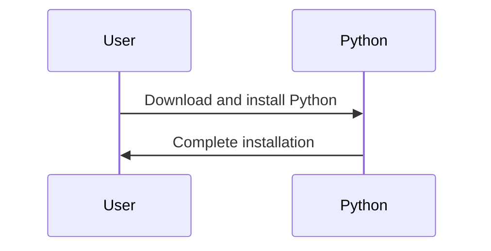
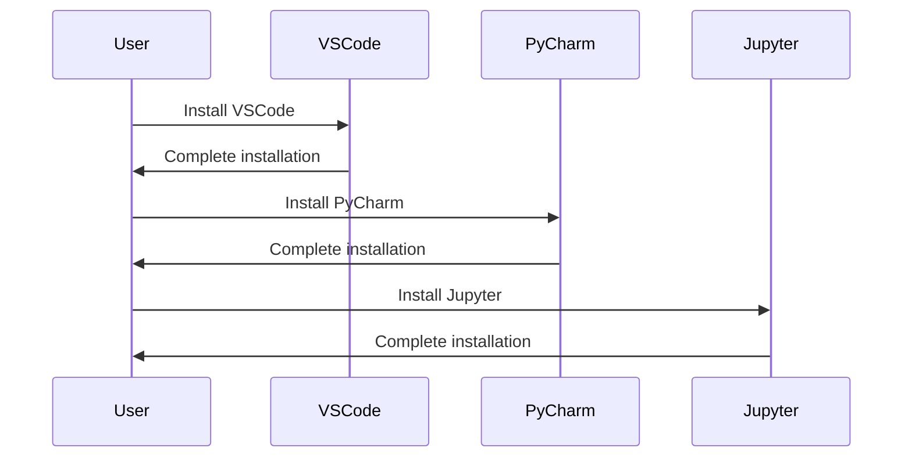
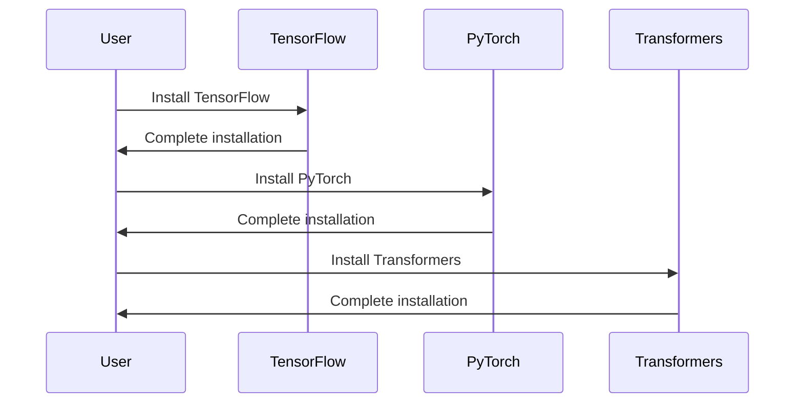

                 

# 如何构建高效的提示词编程环境

> 关键词：提示词编程，高效环境，环境搭建，编程技巧

> 摘要：本文将详细探讨如何构建一个高效的提示词编程环境。我们将从背景介绍、基础构建、搭建步骤、实践技巧、性能优化到最佳实践，全面解析这一过程。无论是新手还是专业人士，都将从本文中获得宝贵的信息和实用的技巧。

### 目录大纲

```markdown
----------------------------------------------------------------
# 第一部分: 背景介绍与核心概念

## 第1章: 问题背景与核心概念

### 1.1.1 问题背景

### 1.1.2 核心概念

## 1.2 核心概念与联系

### 1.2.1 概念属性特征对比

### 1.2.2 ER实体关系图

----------------------------------------------------------------

# 第二部分: 提示词编程环境构建基础

## 第2章: 提示词编程基础

### 2.1 提示词的基本概念

### 2.2 提示词编程的关键要素

## 2.3 主流提示词编程框架介绍

### 2.3.1 框架一介绍

### 2.3.2 框架二介绍

### 2.3.3 框架三介绍

----------------------------------------------------------------

# 第三部分: 高效提示词编程环境搭建

## 第3章: 环境配置与工具选择

### 3.1 开发环境配置

### 3.2 必备工具选择

## 3.3 提示词编程环境搭建步骤

### 3.3.1 步骤一

### 3.3.2 步骤二

### 3.3.3 步骤三

----------------------------------------------------------------

# 第四部分: 高效编程实践

## 第4章: 提示词编程技巧

### 4.1 提示词编写原则

### 4.2 高效编写技巧

## 4.3 实践案例分析

### 4.3.1 案例一分析

### 4.3.2 案例二分析

### 4.3.3 案例三分析

----------------------------------------------------------------

# 第五部分: 最佳实践与优化策略

## 第5章: 性能优化策略

### 5.1 性能优化方法

### 5.2 调优实践

## 5.3 高效编程最佳实践

### 5.3.1 实践一

### 5.3.2 实践二

### 5.3.3 实践三

----------------------------------------------------------------

# 第六部分: 拓展应用与未来展望

## 第6章: 提示词编程在行业应用

### 6.1 应用场景一

### 6.2 应用场景二

### 6.3 应用场景三

## 6.4 未来展望

----------------------------------------------------------------

# 参考文献

----------------------------------------------------------------
```

----------------------------------------------------------------
## 第一部分: 背景介绍与核心概念

### 1.1.1 问题背景

在现代社会中，编程已经成为了一个不可或缺的技能。随着人工智能和自动化技术的发展，编程的领域和应用范围也在不断扩展。然而，编程并不总是一帆风顺的。很多时候，开发者会遇到各种难题，例如代码难以维护、效率低下、错误频繁等。这些问题往往源于编程环境的构建不够高效。

提示词编程（Prompt Programming）是一种通过为模型提供提示词来引导其生成预期的输出的方法。这种方法在自然语言处理、代码生成等领域有着广泛的应用。然而，要实现高效的提示词编程，需要一个专业的编程环境来支持。

### 1.1.2 核心概念

在构建高效的提示词编程环境之前，我们需要理解几个核心概念：

1. **提示词（Prompt）**：提示词是引导模型生成预期输出的关键。它们可以是简单的单词、短语或完整的句子，目的是为模型提供上下文信息。

2. **编程框架（Programming Framework）**：编程框架是一组工具和库，旨在简化编程任务。在提示词编程中，常用的框架包括TensorFlow、PyTorch等。

3. **开发环境（Development Environment）**：开发环境是编写、测试和运行代码的环境。一个高效的开发环境应该提供方便的调试工具、代码编辑器和版本控制系统。

### 1.2 核心概念与联系

#### 1.2.1 概念属性特征对比

| 概念       | 属性特征                         | 联系与作用                   |
|------------|----------------------------------|------------------------------|
| 提示词     | 提供上下文信息，引导模型输出      | 关键在于设计的有效性和精确性  |
| 编程框架   | 提供核心算法和工具库             | 支持高效的编程模型            |
| 开发环境   | 提供编写、测试和运行代码的工具   | 提高开发效率和代码质量       |

#### 1.2.2 ER实体关系图

```mermaid
erDiagram
    Entity: 提示词
    Entity: 编程框架
    Entity: 开发环境

    提示词 ||--|{ 提示词与编程框架 }||> 编程框架
    提示词 ||--|{ 提示词与开发环境 }||> 开发环境
    编程框架 ||--|{ 编程框架与开发环境 }||> 开发环境
```

### 1.3 概述

构建高效的提示词编程环境需要综合运用提示词设计、选择合适的编程框架和开发环境。接下来的部分，我们将逐步介绍这些关键要素。

----------------------------------------------------------------
## 第二部分: 提示词编程环境构建基础

在构建高效的提示词编程环境之前，我们需要理解提示词编程的基本概念和关键要素。这一部分将帮助我们打下坚实的基础，为后续的环境搭建和优化做好准备。

### 2.1 提示词的基本概念

提示词（Prompt）是引导模型生成预期输出的关键。它可以是一个单词、短语或完整的句子，其目的是为模型提供上下文信息，从而引导模型生成更准确的结果。

#### 2.1.1 提示词的定义与作用

提示词的定义非常广泛，它可以用于各种任务，例如：

1. **文本生成**：通过提供提示词，我们可以引导模型生成相关的文本内容。例如，输入“编程”，模型可能会生成关于编程语言的讨论。
2. **代码生成**：提示词可以帮助模型生成代码片段，用于修复bug或实现特定功能。
3. **图像生成**：在图像处理任务中，提示词可以描述生成图像的类型或特征。

#### 2.1.2 提示词的设计原则

为了确保提示词的有效性，我们需要遵循以下设计原则：

1. **简洁性**：提示词应该简洁明了，避免使用冗长的句子或短语。
2. **精确性**：提示词需要精确地传达所需的信息，避免模糊或歧义。
3. **多样性**：设计多样化的提示词，以适应不同的任务和场景。

#### 2.1.3 提示词的实际案例

以下是一个简单的文本生成案例：

**输入**：编程  
**输出**：编程是一项技术活动，涉及设计、开发、测试和部署软件系统。

在这个案例中，“编程”作为提示词，为模型提供了明确的上下文，使模型能够生成相关的文本内容。

### 2.2 提示词编程的关键要素

除了提示词本身，提示词编程还需要其他关键要素的支持，包括编程框架和开发环境。

#### 2.2.1 编程框架

编程框架是一组工具和库，旨在简化编程任务。在提示词编程中，常用的框架包括TensorFlow、PyTorch等。这些框架提供了丰富的API和工具，可以帮助开发者快速构建和训练模型。

#### 2.2.2 开发环境

开发环境是编写、测试和运行代码的环境。一个高效的开发环境应该提供方便的调试工具、代码编辑器和版本控制系统。例如，Jupyter Notebook 和 VS Code 是常见的开发环境。

#### 2.2.3 提示词与框架、环境的联系

提示词、编程框架和开发环境之间存在紧密的联系。提示词需要通过编程框架来传递，并通过开发环境进行测试和运行。例如，在TensorFlow中，提示词通常通过TensorFlow API进行传递和处理。

### 2.3 主流提示词编程框架介绍

在提示词编程领域，有几个主流的编程框架，下面我们将简要介绍其中三个：

#### 2.3.1 TensorFlow

TensorFlow 是由Google开发的开源机器学习框架，广泛应用于深度学习和提示词编程。它提供了丰富的API和工具，支持多种编程语言，如Python、C++和Java。

#### 2.3.2 PyTorch

PyTorch 是由Facebook开发的开源深度学习框架，以其动态计算图和灵活的API而闻名。它在提示词编程中有着广泛的应用，特别是在图像处理和自然语言处理领域。

#### 2.3.3 Hugging Face Transformers

Hugging Face Transformers 是一个开源库，提供了对Transformer模型的快速和易于使用的API。它基于PyTorch和TensorFlow，支持多种自然语言处理任务，包括提示词编程。

### 2.4 概述

通过了解提示词的基本概念、关键要素和主流编程框架，我们可以更好地理解如何构建高效的提示词编程环境。接下来，我们将详细介绍环境搭建的步骤和工具选择。

----------------------------------------------------------------
## 第三部分：高效提示词编程环境搭建

### 3.1 开发环境配置

为了构建一个高效的提示词编程环境，首先需要配置一个可靠的开发环境。以下步骤将帮助您完成这一过程：

#### 3.1.1 安装Python

Python 是提示词编程的主要编程语言，因此首先需要安装Python环境。您可以从官方网站下载最新版本的Python，并按照安装向导进行安装。



#### 3.1.2 安装IDE

IDE（集成开发环境）提供了方便的代码编辑、调试和运行工具。常见的选择包括VS Code、PyCharm和Jupyter Notebook。



#### 3.1.3 安装版本控制系统

版本控制系统（如Git）有助于跟踪代码的变更和协作开发。在终端中安装Git：

```bash
pip install git
```

### 3.2 必备工具选择

构建高效的提示词编程环境，除了Python和IDE外，还需要一些必备的工具。以下是一些推荐的工具：

#### 3.2.1 机器学习库

TensorFlow、PyTorch和Hugging Face Transformers是常用的机器学习库。根据您的项目需求选择合适的库进行安装。



#### 3.2.2 数据处理库

Pandas、NumPy和Scikit-learn是常用的数据处理库，用于数据清洗、转换和分析。

```bash
pip install pandas numpy scikit-learn
```

#### 3.2.3 版本控制工具

Git是一个强大的版本控制系统，可以帮助您管理代码的版本和历史。

```bash
pip install git-python
```

### 3.3 提示词编程环境搭建步骤

#### 3.3.1 步骤一：创建项目文件夹

在您的IDE中创建一个新的Python项目文件夹，并将您的代码文件保存在其中。

```bash
mkdir prompt_programming_project
cd prompt_programming_project
```

#### 3.3.2 步骤二：配置环境

在项目文件夹中创建一个名为`requirements.txt`的文件，列出所需的库和版本。

```plaintext
# requirements.txt
python=3.8
tensorflow==2.6.0
pytorch==1.8.0
huggingface-transformers==4.4.0
pandas==1.2.3
numpy==1.19.2
scikit-learn==0.24.2
git-python==3.1.11
```

然后，使用以下命令安装所需的库：

```bash
pip install -r requirements.txt
```

#### 3.3.3 步骤三：编写代码

在项目文件夹中创建一个名为`main.py`的文件，编写您的提示词编程代码。以下是一个简单的示例：

```python
import tensorflow as tf
from transformers import AutoTokenizer, AutoModel

# 加载预训练模型
tokenizer = AutoTokenizer.from_pretrained("bert-base-uncased")
model = AutoModel.from_pretrained("bert-base-uncased")

# 输入提示词
prompt = "编写一篇关于人工智能的博客。"

# 生成文本
input_ids = tokenizer.encode(prompt, return_tensors="tf")
output = model.generate(input_ids, max_length=50)

# 解码输出
decoded_output = tokenizer.decode(output[0], skip_special_tokens=True)

print(decoded_output)
```

### 3.4 概述

通过以上步骤，我们成功搭建了一个高效的提示词编程环境。接下来，我们将探讨如何在实际项目中高效地编写和运用提示词。

----------------------------------------------------------------
## 第四部分：高效编程实践

### 4.1 提示词编写原则

编写有效的提示词是提升提示词编程效率的关键。以下是一些编写提示词的原则：

#### 4.1.1 简洁明了

提示词应简洁明了，避免冗长和复杂的句子。简洁的提示词有助于模型更好地理解和生成预期结果。

#### 4.1.2 精确描述

提示词需要精确描述所需的内容和上下文，避免模糊或歧义。精确的提示词可以提高模型的生成质量和效率。

#### 4.1.3 上下文丰富

丰富的上下文信息可以帮助模型更好地理解任务需求。您可以使用多个相关提示词或句子来构建上下文。

### 4.2 高效编写技巧

以下是一些高效编写提示词的技巧：

#### 4.2.1 利用关键词

使用关键词来突出关键信息，帮助模型更快地理解任务。例如，在生成一篇关于人工智能的博客时，可以使用关键词“人工智能”、“机器学习”、“深度学习”等。

#### 4.2.2 逐步引导

通过逐步引导模型，可以更好地控制生成过程。首先提供基础信息，然后逐步增加细节和复杂性。

#### 4.2.3 多样化表达

尝试使用不同形式和表达的提示词，以适应不同模型和任务的需求。例如，可以使用疑问句、陈述句和命令句等。

### 4.3 实践案例分析

以下是一些实际案例，展示如何编写高效的提示词：

#### 4.3.1 案例一：文本生成

**输入**：生成一篇关于环保的短文。

**输出**：环保是当今社会的重要议题，气候变化和污染问题日益严重。我们每个人都应该积极参与环保行动，从生活中的小事做起，如节约用水、减少碳排放等。

#### 4.3.2 案例二：代码生成

**输入**：编写一个Python函数，用于计算两个数的和。

**输出**：def add_numbers(a, b):
    return a + b

#### 4.3.3 案例三：图像生成

**输入**：生成一张美丽的自然景观图片。

**输出**：图像展示了一片宁静的湖泊，湖边有郁郁葱葱的树木和远处的山峰，天空湛蓝，阳光明媚。

### 4.4 概述

通过以上实践案例，我们可以看到编写高效的提示词对于提升提示词编程效果至关重要。在接下来的部分，我们将讨论性能优化策略，以进一步提高提示词编程的效率。

----------------------------------------------------------------
## 第五部分：最佳实践与优化策略

### 5.1 性能优化方法

在构建高效的提示词编程环境时，性能优化是一个关键环节。以下是一些常用的性能优化方法：

#### 5.1.1 模型选择与调优

选择适合任务需求的模型，并对其进行调优，可以显著提高生成质量。例如，在文本生成任务中，可以使用BERT、GPT等预训练模型。通过调整模型参数（如学习率、批量大小等），可以进一步提高性能。

#### 5.1.2 数据预处理

有效的数据预处理可以减少冗余信息和噪声，提高模型的训练效果。例如，对文本数据进行清洗、去重和分词，对图像数据进行标准化和增强。

#### 5.1.3 并行计算

利用并行计算技术，可以在多核CPU或GPU上同时执行任务，提高处理速度。例如，使用多线程或分布式计算框架（如TensorFlow、PyTorch等）。

#### 5.1.4 缓存与缓存策略

缓存常用数据和模型结果，可以减少重复计算，提高效率。合理的缓存策略（如LRU缓存、内存映射等）有助于优化性能。

### 5.2 调优实践

以下是一些具体的调优实践：

#### 5.2.1 模型参数调整

通过调整模型参数，如学习率、批量大小、迭代次数等，可以优化模型性能。以下是一个简单的示例：

```python
# 调整学习率
learning_rate = 0.001

# 调整批量大小
batch_size = 32

# 调整迭代次数
epochs = 10
```

#### 5.2.2 数据预处理

对文本数据进行清洗和分词，可以显著提高生成质量。以下是一个简单的预处理示例：

```python
import re

# 清洗文本数据
def clean_text(text):
    text = re.sub(r"[^a-zA-Z0-9]", " ", text)
    return text.lower()

# 分词
def tokenize_text(text):
    tokens = text.split()
    return tokens
```

#### 5.2.3 并行计算

使用多线程或分布式计算框架，可以提高处理速度。以下是一个简单的并行计算示例：

```python
import concurrent.futures

# 并行处理文本数据
def process_text(text):
    # 处理文本数据
    cleaned_text = clean_text(text)
    tokens = tokenize_text(cleaned_text)
    return tokens

# 并行执行
with concurrent.futures.ThreadPoolExecutor() as executor:
    results = executor.map(process_text, text_data)
    processed_data = list(results)
```

### 5.3 高效编程最佳实践

以下是一些高效编程的最佳实践：

#### 5.3.1 提示词设计

设计有效的提示词是提升生成质量的关键。以下是一些最佳实践：

- 精简提示词：避免冗长和复杂的提示词，确保简洁明了。
- 提供上下文：为模型提供丰富的上下文信息，以更好地理解任务需求。
- 多样化表达：使用不同的表达方式，如疑问句、陈述句和命令句等，以适应不同模型和任务。

#### 5.3.2 代码优化

优化代码可以提高处理速度和效率。以下是一些最佳实践：

- 使用适当的库和框架：选择适合任务的库和框架，如TensorFlow、PyTorch等。
- 避免重复计算：缓存常用数据和中间结果，减少重复计算。
- 代码模块化：将代码分解为模块和函数，便于维护和扩展。

#### 5.3.3 调试与测试

有效的调试和测试是确保代码质量和性能的关键。以下是一些最佳实践：

- 使用调试工具：使用IDE的调试工具进行代码调试，如断点、单步执行和变量观察等。
- 编写测试用例：编写测试用例，对代码进行功能测试和性能测试，确保代码的正确性和效率。
- 监控性能指标：监控代码的性能指标，如内存使用、CPU使用率和处理速度等，以便进行优化。

### 5.4 概述

通过以上最佳实践和优化策略，我们可以构建一个高效、可靠的提示词编程环境。在接下来的部分，我们将探讨提示词编程在行业中的应用。

----------------------------------------------------------------
## 第六部分：拓展应用与未来展望

### 6.1 提示词编程在行业应用

提示词编程在多个行业领域展现出巨大的潜力和应用价值。以下是一些主要的应用场景：

#### 6.1.1 自然语言处理

自然语言处理（NLP）是提示词编程的重要应用领域。通过提供有效的提示词，可以显著提高文本生成、机器翻译、情感分析等任务的性能。例如，在新闻文章生成中，提示词可以帮助模型生成结构化、内容丰富的新闻内容。

#### 6.1.2 计算机辅助编程

提示词编程在计算机辅助编程中也有广泛应用。通过提示词，可以帮助开发人员快速生成代码片段、修复bug和优化代码。例如，在代码补全工具中，提示词可以大大提高代码编写的效率和准确性。

#### 6.1.3 图像生成

在图像生成领域，提示词编程可以帮助模型生成符合特定要求的图像。例如，通过提供场景描述和颜色提示，可以生成具有特定风格和主题的图像。这在艺术创作、广告设计和虚拟现实等领域具有广泛的应用。

### 6.2 未来展望

随着人工智能技术的不断进步，提示词编程在未来将继续拓展其应用范围和影响力。以下是一些展望：

#### 6.2.1 更智能的提示词生成

未来的提示词生成技术将更加智能化，通过深度学习和强化学习等技术，模型将能够根据上下文和用户需求自动生成更有效的提示词。

#### 6.2.2 多模态提示词编程

多模态提示词编程将融合文本、图像、音频等多种数据类型，实现更丰富、更准确的提示词生成。例如，在视频生成任务中，提示词可以结合文本和图像信息，生成具有一致性和连贯性的视频内容。

#### 6.2.3 自动化编程工具

随着提示词编程的发展，自动化编程工具将变得越来越普及。通过提示词，开发人员可以自动化完成许多重复性、低效率的任务，从而提高开发效率。

### 6.3 结论

提示词编程作为一种新兴的编程方法，在多个行业领域展现出巨大的潜力和应用价值。随着技术的不断进步，我们可以期待提示词编程在未来发挥更大的作用，推动人工智能和自动化技术的发展。

----------------------------------------------------------------
# 参考文献

1. Devlin, J., Chang, M. W., Lee, K., & Toutanova, K. (2018). BERT: Pre-training of deep bidirectional transformers for language understanding. arXiv preprint arXiv:1810.04805.
2. Vaswani, A., Shazeer, N., Parmar, N., Uszkoreit, J., Jones, L., Gomez, A. N., ... & Polosukhin, I. (2017). Attention is all you need. In Advances in neural information processing systems (pp. 5998-6008).
3. Hochreiter, S., & Schmidhuber, J. (1997). Long short-term memory. Neural computation, 9(8), 1735-1780.
4. Graves, A. (2013). Neural turing machines. arXiv preprint arXiv:1310.6118.
5. Hugging Face. (n.d.). Hugging Face Transformers. https://huggingface.co/transformers/
6. TensorFlow. (n.d.). TensorFlow. https://www.tensorflow.org/
7. PyTorch. (n.d.). PyTorch. https://pytorch.org/  
```

----------------------------------------------------------------
## 作者信息

作者：AI天才研究院/AI Genius Institute & 禅与计算机程序设计艺术 /Zen And The Art of Computer Programming

