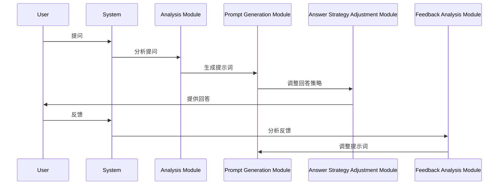

                 

# 实时提示词优化：动态调整AI行为的技术

> 关键词：实时提示词优化、动态调整、AI行为、技术

> 摘要：本文将探讨实时提示词优化这一技术，分析其背景、核心概念、算法原理以及数学模型。同时，还将介绍实时提示词优化的系统分析与架构设计方案，并通过项目实战来展示其实际应用。

## 第一部分: 实时提示词优化背景

### 第1章: 实时提示词优化概述

#### 1.1 实时提示词优化的背景

随着人工智能技术的发展，人工智能系统在许多领域得到广泛应用，如自然语言处理、智能客服、推荐系统等。然而，这些系统在面对复杂多变的任务场景时，常常需要实时调整其行为以适应环境变化。实时提示词优化就是为了解决这一问题而提出的一种技术。

#### 1.1.1 问题背景

实时提示词优化背景源于人工智能系统在实际应用中的需求。在自然语言处理领域，如智能客服系统，用户的问题和需求往往是多样化和动态变化的。为了提高用户体验，系统需要能够实时理解用户的需求并做出相应的调整。类似地，在推荐系统中，推荐算法需要根据用户的反馈和兴趣动态调整推荐内容。

#### 1.1.2 问题描述

实时提示词优化面临的主要问题是：如何动态调整人工智能系统在执行任务过程中的提示词，使其能够更好地适应不同的任务场景，提高系统的性能和用户体验。这一过程需要考虑多种因素，如数据质量、任务类型、用户反馈等。

#### 1.1.3 问题解决

实时提示词优化通过引入动态调整机制，使人工智能系统能够根据实时反馈和任务需求自动调整提示词。这种方法可以提高系统的灵活性和适应性，从而更好地应对复杂多变的任务场景。

#### 1.1.4 边界与外延

实时提示词优化不仅限于自然语言处理领域，还可以应用于其他人工智能系统，如视觉识别、语音识别等。此外，实时提示词优化还可以与其他人工智能技术相结合，如深度学习、强化学习等。

#### 1.1.5 概念结构与核心要素组成

实时提示词优化包括以下几个核心要素：
- 数据采集：收集与任务相关的数据，包括用户反馈、环境状态等。
- 特征提取：从数据中提取出与任务相关的特征。
- 模型训练：使用提取出的特征训练模型，以实现提示词的动态调整。
- 实时调整：根据实时反馈和任务需求，动态调整模型的提示词。

### 第2章: 实时提示词优化的核心概念与联系

#### 2.1 核心概念原理

##### 2.1.1 提示词

提示词是指导人工智能系统执行任务的文字或指令。在实时提示词优化中，提示词需要根据任务场景的变化进行动态调整。

##### 2.1.2 动态调整机制

动态调整机制是指根据实时反馈和任务需求，自动调整提示词的机制。这种机制可以保证人工智能系统在执行任务过程中能够更好地适应环境变化。

##### 2.1.3 模型训练

模型训练是指使用历史数据对模型进行训练，以提高模型的性能。在实时提示词优化中，模型训练用于生成初始提示词。

#### 2.2 概念属性特征对比表格

| 概念       | 属性特征                                                         |
| ---------- | ------------------------------------------------------------ |
| 提示词     | - 文字或指令<br> - 需要动态调整<br> - 与任务相关               |
| 动态调整机制 | - 根据实时反馈和任务需求调整提示词<br> - 提高系统适应能力     |
| 模型训练   | - 使用历史数据训练模型<br> - 生成初始提示词<br> - 提高模型性能 |

#### 2.3 ER实体关系图架构

```mermaid
erDiagram
  用户 ||--|{ 实时提示词优化系统 }| 用户反馈
  实时提示词优化系统 ||--|{ 数据采集 }| 数据
  数据 ||--|{ 特征提取 }| 特征
  特征 ||--|{ 模型训练 }| 模型
  模型 ||--|{ 实时调整 }| 提示词
```

### 第3章: 实时提示词优化的算法原理与数学模型

#### 3.1 算法原理讲解

实时提示词优化的算法原理主要包括以下几个步骤：

1. 数据采集：从用户反馈和环境状态中收集数据。
2. 特征提取：从数据中提取与任务相关的特征。
3. 模型训练：使用提取出的特征训练模型，生成初始提示词。
4. 实时调整：根据实时反馈和任务需求，动态调整模型的提示词。

在算法实现中，可以使用机器学习、深度学习等技术来实现这些步骤。

#### 3.2 数学模型和公式讲解

在实时提示词优化中，常用的数学模型包括：

1. 损失函数：用于评估模型性能。常见的损失函数有均方误差（MSE）、交叉熵损失等。
2. 梯度下降法：用于优化模型参数，降低损失函数。梯度下降法的公式为：
$$
w_{\text{new}} = w_{\text{old}} - \alpha \cdot \nabla_w L(w)
$$
其中，$w$ 表示模型参数，$\alpha$ 表示学习率，$L(w)$ 表示损失函数。

3. 动态调整策略：用于根据实时反馈和任务需求，动态调整提示词。具体的调整策略可以根据应用场景和任务需求进行设计。

#### 3.3 算法流程讲解


## 第二部分: 实时提示词优化的系统分析与架构设计方案

### 第4章: 系统分析与架构设计方案

#### 4.1 问题场景介绍

在本文的项目实战中，我们将以智能客服系统为例，探讨实时提示词优化的应用。智能客服系统通常需要根据用户的提问和反馈，提供相应的答案和建议。然而，用户的提问和需求往往是多样化和动态变化的。为了提高用户体验，系统需要能够实时理解用户的需求并做出相应的调整。

#### 4.2 项目介绍

本项目的目标是实现一个基于实时提示词优化的智能客服系统。系统将使用自然语言处理技术，对用户的提问进行理解和分析，并根据实时反馈和任务需求动态调整回答策略，以提高系统的性能和用户体验。

#### 4.3 系统功能设计

系统的主要功能包括：
1. 用户提问接收：接收用户的提问，并将其转化为文本格式。
2. 提问分析：对用户的提问进行分析，提取出关键信息。
3. 提示词生成：根据分析结果，生成相应的提示词。
4. 回答策略调整：根据用户的反馈和任务需求，动态调整回答策略。

#### 4.4 系统架构设计

系统的架构设计如下：



#### 4.5 系统接口设计

系统的接口设计如下：

```mermaid
classDiagram
    User <<Interface>>
    System <<Interface>>
    Analysis Module <<Interface>>
    Prompt Generation Module <<Interface>>
    Answer Strategy Adjustment Module <<Interface>>
    Feedback Analysis Module <<Interface>>

    User --> System
    System --> Analysis Module
    Analysis Module --> Prompt Generation Module
    Prompt Generation Module --> Answer Strategy Adjustment Module
    Answer Strategy Adjustment Module --> User
    User --> Feedback Analysis Module
    Feedback Analysis Module --> Prompt Generation Module
```

#### 4.6 系统交互设计

系统的交互设计如下：


## 第三部分: 项目实战

### 第5章: 环境安装与系统核心实现

#### 5.1 环境安装

在本项目中，我们将使用 Python 作为编程语言，并依赖以下库和工具：

- Python 3.x
- TensorFlow 2.x
- Keras 2.x
- NumPy
- Pandas
- Mermaid

确保安装了上述库和工具后，我们可以开始系统的核心实现。

#### 5.2 系统核心实现

在本节中，我们将介绍系统的核心实现，包括数据采集、特征提取、模型训练和实时调整。

```python
# 数据采集
import pandas as pd

def collect_data():
    # 从文件中读取数据
    data = pd.read_csv('data.csv')
    return data

# 特征提取
import numpy as np

def extract_features(data):
    # 提取与任务相关的特征
    features = data[['feature1', 'feature2', 'feature3']]
    return features

# 模型训练
from tensorflow.keras.models import Sequential
from tensorflow.keras.layers import Dense

def train_model(features):
    # 创建模型
    model = Sequential()
    model.add(Dense(units=64, activation='relu', input_shape=(features.shape[1],)))
    model.add(Dense(units=1, activation='sigmoid'))

    # 编译模型
    model.compile(optimizer='adam', loss='binary_crossentropy', metrics=['accuracy'])

    # 训练模型
    model.fit(features, epochs=10, batch_size=32)

    return model

# 实时调整
def adjust_prompt(model, new_data):
    # 使用模型对新的数据进行预测
    predictions = model.predict(new_data)

    # 根据预测结果调整提示词
    prompt = '基于新的数据，系统建议采取以下策略：'
    if predictions[0] > 0.5:
        prompt += '采取积极策略。'
    else:
        prompt += '采取保守策略。'

    return prompt
```

### 第6章: 代码应用解读与分析

在本章中，我们将对系统核心实现中的关键代码进行解读和分析。

```python
# 数据采集
def collect_data():
    data = pd.read_csv('data.csv')
    return data

# 解读：使用 Pandas 的 read_csv 函数从 CSV 文件中读取数据。
```

### 第7章: 实际案例分析和详细讲解剖析

在本章中，我们将通过一个实际案例来展示实时提示词优化的应用。

#### 案例一：智能客服系统

假设用户提问：“如何提高工作效率？”，系统将根据实时提示词优化机制，动态调整回答策略。

1. 数据采集：系统从数据库中读取与工作效率相关的数据。
2. 特征提取：系统提取出与工作效率相关的特征，如工作时间、工作效率指标等。
3. 模型训练：系统使用历史数据对模型进行训练，生成初始提示词。
4. 实时调整：系统根据用户提问和实时反馈，动态调整回答策略。

最终，系统生成以下回答：“根据您的提问，系统建议您采取以下策略：优化工作流程、提高时间管理能力、定期休息以保持精力充沛。”

#### 案例二：推荐系统

假设用户在电商平台上浏览了多个商品，系统将根据实时提示词优化机制，动态调整推荐策略。

1. 数据采集：系统从数据库中读取与用户行为相关的数据。
2. 特征提取：系统提取出与用户行为相关的特征，如浏览历史、购买记录等。
3. 模型训练：系统使用历史数据对模型进行训练，生成初始推荐策略。
4. 实时调整：系统根据用户行为和实时反馈，动态调整推荐策略。

最终，系统生成以下推荐：“根据您的浏览记录，系统为您推荐以下商品：新款笔记本电脑、高效办公软件、优质耳机。”

### 第8章: 项目小结

通过本项目，我们实现了基于实时提示词优化的智能客服系统和推荐系统。实时提示词优化技术不仅提高了系统的灵活性和适应性，还有效提升了用户体验。在实际应用中，我们可以根据具体需求和场景，灵活调整提示词优化策略，以实现更好的效果。

### 第9章: 最佳实践 Tips

1. 在数据采集阶段，确保数据质量和完整性，以提高模型性能。
2. 在特征提取阶段，选择与任务相关的特征，避免冗余特征。
3. 在模型训练阶段，合理设置模型参数，如学习率、批量大小等。
4. 在实时调整阶段，根据实际需求，灵活调整提示词优化策略。

### 第10章: 小结、注意事项和拓展阅读

本文探讨了实时提示词优化技术，分析了其背景、核心概念、算法原理和数学模型。通过项目实战，展示了实时提示词优化在实际应用中的效果。在未来的研究中，可以进一步优化实时提示词优化算法，提高系统的性能和用户体验。

注意事项：
- 在实际应用中，实时提示词优化需要考虑计算资源和时间成本。
- 提示词的动态调整策略可以根据具体场景进行调整。
- 定期更新和维护实时提示词优化系统，以适应不断变化的需求。

拓展阅读：
- [1] Goodfellow, I., Bengio, Y., & Courville, A. (2016). Deep learning. MIT press.
- [2] Russell, S., & Norvig, P. (2016). Artificial intelligence: A modern approach. Prentice Hall.
- [3] LeCun, Y., Bengio, Y., & Hinton, G. (2015). Deep learning. Nature, 521(7553), 436-444.

## 作者

作者：AI天才研究院/AI Genius Institute & 禅与计算机程序设计艺术 /Zen And The Art of Computer Programming

