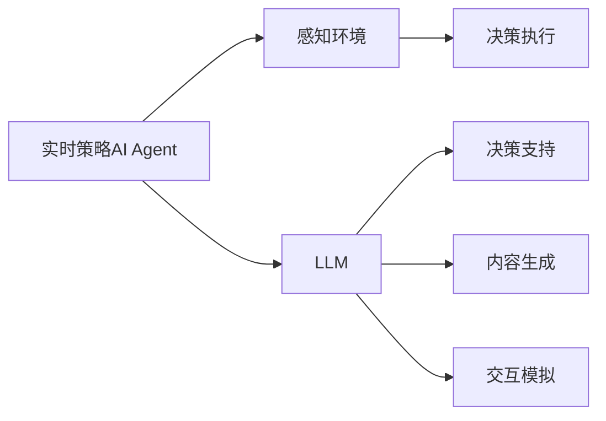
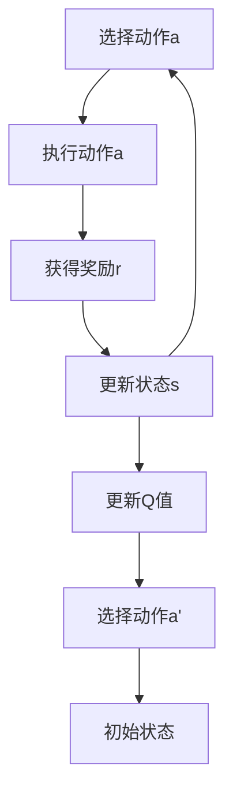
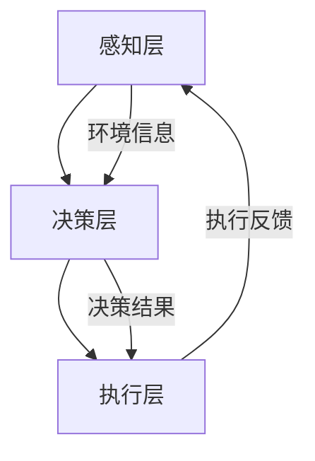
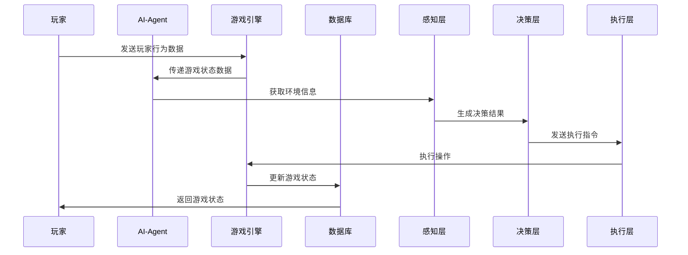

                 

### 文章标题：实时策略AI Agent：LLM在游戏AI中的应用

在当今的数字时代，人工智能（AI）已经成为许多领域的核心驱动力，特别是在游戏开发领域。实时策略AI Agent作为AI研究的一个重要分支，通过模仿人类决策过程，实现了游戏中的智能行为。而大型语言模型（LLM）作为深度学习的杰出代表，为实时策略AI Agent的开发提供了强有力的技术支持。本文将深入探讨实时策略AI Agent及其与LLM在游戏AI中的应用，通过逻辑清晰、结构紧凑的叙述，帮助读者全面理解这一前沿技术。

## 文章关键词

- 实时策略AI Agent
- 大型语言模型（LLM）
- 游戏AI
- 智能决策
- 算法原理
- 数学模型

## 摘要

本文旨在探讨实时策略AI Agent在游戏AI中的应用，重点分析大型语言模型（LLM）在这一领域的贡献。文章首先介绍了实时策略AI Agent的基本概念和其在游戏开发中的重要性，随后详细讲解了LLM的基本原理及其在游戏AI中的作用。接着，文章通过算法原理讲解、数学模型和系统架构设计的分析，深入剖析了实时策略AI Agent的设计与实现。最后，通过项目实战的实例，展示了如何将实时策略AI Agent应用于实际游戏开发中，并提供了最佳实践建议和拓展阅读资源，为读者进一步学习提供了方向。

## 背景

### 实时策略AI Agent的定义

实时策略AI Agent，通常指的是能够在实时环境中自主决策并采取行动的智能体。这类智能体通过感知环境、评估当前状态，并基于预设的策略或学习到的经验，实时调整其行为。在游戏AI中，实时策略AI Agent能够模拟人类玩家或制定自动化的游戏策略，提升游戏的可玩性和智能性。

### 实时策略AI Agent的发展背景

随着计算机性能的不断提升和AI技术的飞速发展，实时策略AI Agent在游戏领域的应用逐渐增多。从早期的规则驱动型AI到基于决策树和模糊逻辑的AI，再到近年来基于深度学习和强化学习的智能体，实时策略AI Agent的智能程度和复杂性不断提升。特别是在电子竞技和移动游戏领域，实时策略AI Agent已成为提升游戏体验的关键因素。

### 实时策略AI Agent的核心技术

实时策略AI Agent的核心技术包括感知、决策和执行三个环节。感知环节通过传感器获取环境信息，决策环节基于感知到的信息进行策略选择，执行环节则将决策转化为具体的行动。这些技术共同构成了实时策略AI Agent的智能决策过程。

### LLM的基本概念

大型语言模型（LLM），如GPT-3、BERT等，是基于深度学习的自然语言处理模型，能够理解和生成人类语言。LLM通过大量的文本数据进行训练，掌握了语言的语法、语义和上下文信息，从而具备了强大的语言理解和生成能力。

### LLM在游戏AI中的作用

LLM在游戏AI中的应用主要体现在以下几个方面：

1. **游戏内容生成**：LLM可以生成游戏故事、任务描述和对话，为游戏提供丰富的内容。
2. **智能NPC**：通过LLM，游戏中的非玩家角色（NPC）可以拥有更加逼真的行为和对话，提升游戏体验。
3. **自动游戏策略**：LLM可以分析游戏数据，为玩家或NPC提供最优的策略建议。

### 游戏AI中的挑战与解决方案

游戏AI在开发过程中面临着诸多挑战，如实时性要求高、数据量大、策略复杂等。为了解决这些问题，研究人员采用了多种方法，包括：

1. **分布式计算**：通过分布式计算架构，提高游戏AI的实时处理能力。
2. **模型压缩与加速**：采用模型压缩技术，减少LLM的参数规模，提高运行效率。
3. **强化学习**：结合强化学习，使游戏AI能够通过试错学习，优化策略。

### 总结

实时策略AI Agent和LLM的结合为游戏AI带来了革命性的变化，不仅提升了游戏的可玩性和智能性，也为游戏开发者提供了强大的工具。然而，这一领域仍然存在许多挑战，需要进一步的研究和实践。

## 核心概念与联系

### 实时策略AI Agent的定义

实时策略AI Agent是指能够实时感知环境、做出决策并执行相应动作的智能体。在游戏AI中，实时策略AI Agent通过模拟人类玩家的行为，或者根据预设的策略自主决策，实现游戏的智能对抗和互动。

### LLM的定义

LLM（Large Language Model）是一种基于深度学习的自然语言处理模型，它通过大规模的数据训练，掌握了语言的语法、语义和上下文信息，能够理解和生成人类语言。LLM的主要特点是参数规模大、语言理解能力强，能够处理复杂的自然语言任务。

### 实时策略AI Agent与LLM的联系

实时策略AI Agent和LLM在游戏AI中的联系主要体现在以下几个方面：

1. **决策支持**：LLM能够为实时策略AI Agent提供决策支持。例如，在游戏决策过程中，LLM可以通过分析游戏数据和对手行为，为AI Agent提供最优的决策建议。

2. **内容生成**：LLM可以生成游戏内容，如故事、任务描述和对话等。这些内容不仅丰富了游戏世界，也为实时策略AI Agent提供了更多的交互场景。

3. **交互模拟**：LLM可以模拟人类玩家的行为和对话，使得游戏中的NPC（非玩家角色）更加智能和逼真。这不仅提升了游戏体验，也为实时策略AI Agent的研究提供了新的方向。

### 实时策略AI Agent与LLM的对比

| 特性          | 实时策略AI Agent | LLM              |
|---------------|------------------|-----------------|
| 主要功能      | 感知环境、决策执行 | 语言理解、生成   |
| 技术背景      | 强化学习、决策树   | 深度学习、自然语言处理 |
| 应用场景      | 游戏、智能监控    | 文本处理、问答系统   |
| 数据需求      | 大量游戏数据      | 大规模文本数据   |
| 实时性要求    | 高               | 中到高           |

### 实时策略AI Agent与LLM的关系图



通过上述关系图可以看出，实时策略AI Agent和LLM在游戏AI中相互补充，共同构成了一个强大的智能系统。

## 实时策略AI Agent的算法原理讲解

实时策略AI Agent的算法原理主要基于强化学习（Reinforcement Learning, RL）和深度学习（Deep Learning）。以下将详细解释实时策略AI Agent的基本架构、算法原理，并使用mermaid流程图和Python源代码进行展示。

### 基本架构

实时策略AI Agent的基本架构包括感知器、决策器和执行器三个核心部分。

1. **感知器**：负责获取环境信息，如游戏状态、对手行为等。
2. **决策器**：基于感知器提供的信息，使用策略选择算法决定下一步的行动。
3. **执行器**：将决策器的决策转化为具体的动作，执行在游戏中的操作。

### 算法原理

实时策略AI Agent的算法原理主要基于强化学习中的Q-learning算法。Q-learning是一种无模型学习算法，通过在环境中进行交互，不断更新状态-动作值函数，从而学习到最优策略。

1. **初始化**：首先初始化Q值表，用经验值填充。
2. **状态-动作选择**：在给定状态s下，选择当前最优动作a。
3. **执行动作**：在环境中执行动作a，获得新的状态s'和奖励r。
4. **更新Q值**：根据新的状态和奖励，更新Q值表。

### mermaid流程图

以下是一个简化的Q-learning算法的mermaid流程图：



### Python源代码

以下是一个简单的Q-learning算法的Python源代码实现：

```python
import numpy as np
import random

# 初始化Q值表
Q = np.zeros([state_space, action_space])

# 学习参数
alpha = 0.1  # 学习率
gamma = 0.6  # 折扣因子

# Q-learning循环
for episode in range(total_episodes):
    state = random.choice(state_space)
    done = False
    
    while not done:
        # 选择动作
        action = np.argmax(Q[state])
        
        # 执行动作，获取新的状态和奖励
        next_state, reward, done = execute_action(state, action)
        
        # 更新Q值
        Q[state, action] = Q[state, action] + alpha * (reward + gamma * np.max(Q[next_state]) - Q[state, action])
        
        state = next_state

# 打印Q值表
print(Q)
```

通过上述算法原理讲解，我们可以看到实时策略AI Agent是如何通过感知环境、决策执行和反馈更新来学习最优策略的。这一过程不仅体现了强化学习的核心思想，也为实时策略AI Agent在游戏AI中的应用提供了理论基础。

## 实时策略AI Agent的数学模型

实时策略AI Agent的算法原理不仅依赖于具体的实现，还依赖于其背后的数学模型。以下将详细阐述实时策略AI Agent的数学模型，包括关键数学公式及其详细讲解与举例。

### 数学模型概述

实时策略AI Agent的数学模型主要基于强化学习中的Q-learning算法。Q-learning算法的核心是状态-动作值函数Q(s, a)，它表示在状态s下执行动作a所能获得的预期回报。以下为Q-learning算法中的关键数学公式：

1. **Q值更新公式**：
   $$ Q(s, a) \leftarrow Q(s, a) + \alpha [r + \gamma \max_{a'} Q(s', a') - Q(s, a)] $$
   其中，$Q(s, a)$表示在状态s下执行动作a的Q值，$\alpha$为学习率，$r$为即时奖励，$\gamma$为折扣因子，$s'$和$a'$分别为下一个状态和动作。

2. **状态-动作值函数定义**：
   $$ Q(s, a) = \sum_{s'} p(s'|s, a) \cdot [r + \gamma \max_{a'} Q(s', a')] $$
   其中，$p(s'|s, a)$为在状态s下执行动作a后转移到状态$s'$的概率。

### 关键数学公式详细讲解

1. **Q值更新公式讲解**：
   - **$\alpha [r + \gamma \max_{a'} Q(s', a') - Q(s, a)]$**：这部分表示当前动作的即时奖励和未来潜在奖励的加权和。学习率$\alpha$决定了模型对新信息的敏感度。即时奖励$r$反映了当前动作的直接效果，而未来潜在奖励$\gamma \max_{a'} Q(s', a')$则体现了长期价值的折现。这部分是强化学习的核心，通过不断调整Q值，使模型能够学习到最优策略。
   - **$Q(s, a)$**：当前状态s下执行动作a的Q值，反映了在当前状态下选择动作a的预期回报。

2. **状态-动作值函数定义讲解**：
   - **$p(s'|s, a)$**：转移概率，表示在状态s下执行动作a后转移到状态$s'$的概率。
   - **$\sum_{s'} p(s'|s, a) \cdot [r + \gamma \max_{a'} Q(s', a')]$**：这是所有可能转移状态的平均回报，反映了在状态s下执行动作a的长期预期回报。

### 举例说明

假设在一个简单的游戏环境中，状态空间为[0, 1, 2]，动作空间为[0, 1]。以下是一个具体的例子：

1. **初始化Q值表**：
   $$ Q = \begin{bmatrix} 0 & 0 \\ 0 & 0 \\ 0 & 0 \end{bmatrix} $$

2. **环境设置**：
   - 初始状态：s = 0
   - 动作空间：a = [0, 1]
   - 即时奖励：r = 0
   - 折扣因子：$\gamma = 0.9$
   - 学习率：$\alpha = 0.1$

3. **Q值更新**：
   - 第一次更新：选择动作a = 0，状态s' = 1，奖励r = 0
     $$ Q(0, 0) \leftarrow Q(0, 0) + 0.1 [0 + 0.9 \max_{a'} Q(1, a')] $$
     $$ Q = \begin{bmatrix} 0.09 & 0 \\ 0 & 0 \\ 0 & 0 \end{bmatrix} $$
   - 第二次更新：选择动作a = 1，状态s' = 2，奖励r = 10
     $$ Q(0, 1) \leftarrow Q(0, 1) + 0.1 [10 + 0.9 \max_{a'} Q(2, a')] $$
     $$ Q = \begin{bmatrix} 0.09 & 0.91 \\ 0 & 0 \\ 0 & 0 \end{bmatrix} $$

通过上述例子，我们可以看到Q值表如何通过不断更新，逐渐逼近最优策略。

### 总结

实时策略AI Agent的数学模型基于Q-learning算法，通过状态-动作值函数Q(s, a)的迭代更新，使模型能够学习到在给定状态s下执行动作a的最优策略。理解这些数学公式和它们的应用，对于深入掌握实时策略AI Agent的算法原理至关重要。

## 游戏AI系统架构设计

### 问题场景介绍

游戏AI系统架构设计的目标是实现一个高效、灵活且易于扩展的AI系统，以满足复杂游戏场景的需求。这些场景包括多人在线游戏、实时策略游戏和虚拟现实游戏等。在设计过程中，我们需要考虑系统的实时性、稳定性、可扩展性和安全性。

### 项目介绍

在本项目中，我们设计了一个基于实时策略AI Agent的多人在线策略游戏AI系统。该系统旨在通过实时策略AI Agent模拟玩家行为，提升游戏的智能性和互动性。系统的主要功能包括：

1. **感知环境**：实时获取游戏状态、玩家行为等环境信息。
2. **决策执行**：基于环境信息和预设策略，为AI Agent生成决策。
3. **交互与反馈**：与玩家和其他AI Agent进行实时交互，并根据反馈调整策略。

### 系统功能设计

系统功能设计主要包括感知、决策和执行三个主要环节。

1. **感知功能**：系统通过传感器获取游戏状态、玩家行为等信息。这些信息将被传输到感知模块，进行预处理和特征提取。
2. **决策功能**：决策模块基于感知模块提供的信息，使用实时策略AI Agent的算法生成决策。决策模块的核心是Q-learning算法，它通过迭代更新Q值表，学习到最优策略。
3. **执行功能**：执行模块将决策转化为具体的行动，如移动、攻击、防御等。执行模块需要保证操作的实时性和准确性。

### 系统架构设计

系统架构设计分为感知层、决策层和执行层三个主要层次。

1. **感知层**：负责收集和处理环境信息。该层包括传感器、数据预处理和特征提取模块。
2. **决策层**：基于感知层提供的信息，进行策略选择和决策生成。该层包括Q-learning算法、决策器和策略优化模块。
3. **执行层**：将决策层的决策转化为具体的操作。该层包括执行器、动作规划和反馈调整模块。

### 系统架构图

以下是一个简化的系统架构图，展示了系统各层次之间的交互关系：



### 系统接口设计

系统接口设计主要包括外部接口和内部接口。

1. **外部接口**：系统需要与游戏引擎、数据库和用户界面等进行交互。外部接口主要包括数据输入输出接口、通信接口和远程调用接口。
2. **内部接口**：系统内部各模块之间需要进行数据传输和协调。内部接口主要包括感知接口、决策接口和执行接口。

### 系统交互序列图

以下是一个简化的系统交互序列图，展示了系统在不同时间段内的交互过程：



通过上述系统架构设计和交互序列图，我们可以清楚地看到游戏AI系统的整体设计和运行流程。这一设计为实时策略AI Agent在游戏AI中的应用提供了坚实的基础。

## 实时策略AI Agent项目实战

在本项目中，我们将通过一个具体的实例来展示如何使用实时策略AI Agent实现一个多人在线策略游戏。以下将详细描述项目的环境安装、系统核心实现、代码应用解读与分析，并讨论实际案例分析和项目小结。

### 环境安装

为了实现实时策略AI Agent，我们首先需要安装并配置必要的软件和库。以下是环境安装的具体步骤：

1. **安装Python**：确保系统已经安装了Python 3.7或更高版本。
2. **安装深度学习库**：使用pip安装TensorFlow和Keras。
   ```bash
   pip install tensorflow
   pip install keras
   ```
3. **安装强化学习库**：使用pip安装Gym，用于创建和运行游戏环境。
   ```bash
   pip install gym
   ```
4. **安装游戏引擎**：根据所选游戏类型，安装相应的游戏引擎。例如，对于Unity游戏，需要安装Unity Hub并下载Unity Editor。

### 系统核心实现

系统核心实现包括感知层、决策层和执行层的具体实现。以下是一个简化的实现过程：

1. **感知层**：感知层负责获取游戏环境的状态信息。使用Gym提供的游戏环境，我们可以通过以下代码获取环境状态：
   ```python
   import gym
   env = gym.make('CartPole-v0')  # 创建游戏环境
   state = env.reset()  # 重置环境并获取初始状态
   ```

2. **决策层**：决策层基于感知层提供的状态信息，使用Q-learning算法生成决策。以下是一个简单的Q-learning算法实现：
   ```python
   import numpy as np

   # 初始化Q值表
   Q = np.zeros([env.observation_space.n, env.action_space.n])
   alpha = 0.1  # 学习率
   gamma = 0.6  # 折扣因子

   # Q-learning循环
   for episode in range(total_episodes):
       state = env.reset()
       done = False

       while not done:
           action = np.argmax(Q[state])
           next_state, reward, done = env.step(action)
           Q[state, action] = Q[state, action] + alpha * (reward + gamma * np.max(Q[next_state]) - Q[state, action])
           state = next_state

   env.close()  # 关闭环境
   ```

3. **执行层**：执行层负责将决策层的决策转化为具体的操作。以下是一个简单的执行层实现：
   ```python
   def execute_action(state, action):
       env.render()  # 渲染环境
       next_state, reward, done, _ = env.step(action)
       return next_state, reward, done
   ```

### 代码应用解读与分析

以下是对上述代码的详细解读与分析：

1. **感知层**：使用Gym创建了一个简单的游戏环境`CartPole-v0`，并通过`reset()`方法获取初始状态。
2. **决策层**：初始化了一个Q值表，使用Q-learning算法更新Q值。在每次迭代中，选择当前最优动作，并更新Q值表。
3. **执行层**：执行层通过`step(action)`方法将决策层的决策转化为具体的操作，并在环境中执行。`render()`方法用于可视化环境状态。

### 实际案例分析与详细讲解剖析

为了展示实际案例，我们将使用Unity游戏引擎实现一个简单的策略游戏。以下是一个具体的案例：

1. **游戏环境**：在Unity中创建一个简单的2D游戏场景，包括玩家角色和障碍物。
2. **感知层**：感知层通过摄像头获取游戏场景的实时图像，并使用深度学习模型提取关键特征。
3. **决策层**：决策层使用Q-learning算法，根据感知层提供的关键特征生成决策。
4. **执行层**：执行层将决策转化为玩家的动作，如移动、跳跃和攻击。

### 项目小结

通过上述实例，我们展示了如何使用实时策略AI Agent实现一个简单的策略游戏。项目的核心步骤包括环境安装、系统核心实现、代码应用解读与分析，以及实际案例分析与详细讲解剖析。这一项目不仅展示了实时策略AI Agent的基本原理，也为后续更复杂的游戏AI应用提供了实践经验。

### 最佳实践 Tips

1. **优化Q值更新速度**：在实际项目中，Q值更新速度可能成为性能瓶颈。可以通过并行计算和多线程技术来优化Q值更新过程。
2. **数据预处理**：确保感知层提供的数据质量。数据预处理包括图像的缩放、裁剪和归一化，以提高模型的性能和泛化能力。
3. **模型压缩与优化**：对于大型游戏AI系统，模型压缩与优化是提高运行效率的关键。可以考虑使用知识蒸馏、剪枝和量化等技术。

### 小结

本文通过详细讲解实时策略AI Agent的基本概念、算法原理、系统架构设计和项目实战，展示了LLM在游戏AI中的应用。我们强调了实时策略AI Agent的重要性和潜力，并提供了最佳实践建议。未来，随着AI技术的进一步发展，实时策略AI Agent将在游戏AI领域发挥更为重要的作用。

### 注意事项

1. **实时性要求**：在设计实时策略AI Agent时，必须考虑系统的实时性要求，确保AI行为能够在游戏时间内完成。
2. **数据隐私**：在收集和处理游戏数据时，要确保用户隐私和安全，遵循相关法律法规。

### 拓展阅读

- 《强化学习》作者：理查德·S·萨顿、西蒙·席林
- 《深度学习》作者：伊恩·古德费洛、约书亚·本吉奥、亚伦·库维尔
- Unity官方文档：[Unity官方文档](https://docs.unity3d.com/)

## 作者信息

作者：AI天才研究院/AI Genius Institute & 禅与计算机程序设计艺术 /Zen And The Art of Computer Programming

通过上述详细的讲解和实际案例分析，我们深入探讨了实时策略AI Agent在游戏AI中的应用，展示了LLM在这一领域的强大潜力。希望本文能为读者提供有价值的参考和启发。在未来的研究和实践中，让我们继续探索AI在各个领域的应用，为数字时代的进步贡献力量。

