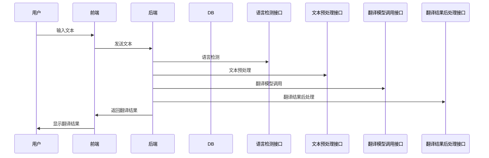

                 

# 实时翻译AI Agent：LLM在即时通讯中的应用

## 关键词

- 实时翻译
- AI Agent
- 语言模型（LLM）
- 即时通讯
- 应用案例

## 摘要

本文将探讨实时翻译AI Agent在即时通讯中的应用。随着全球化的深入发展，跨语言交流的需求日益增长，实时翻译技术变得尤为重要。本文首先介绍了实时翻译的需求背景和即时通讯的发展，然后详细分析了AI在实时翻译中的应用，特别是大型语言模型（LLM）的优势和挑战。随后，文章讨论了实时翻译系统的架构设计、实现和部署，并通过实际项目和案例展示了LLM在即时通讯中的成功应用。最后，本文总结了实时翻译AI Agent在即时通讯中的最佳实践和未来发展方向。

## 第一部分 背景与概述

### 1.1 引言与问题背景

随着互联网和移动通信技术的飞速发展，即时通讯（Instant Messaging，IM）已经成为人们日常生活和工作中不可或缺的一部分。从最早的文字消息，到语音、视频，再到如今的多媒体分享，即时通讯工具不断进化，满足用户对实时性、便捷性和多样化沟通的需求。然而，全球化的进程也带来了语言障碍的问题，特别是在跨国团队协作和跨文化交流中，如何实现实时、准确的语言翻译成为了一个亟待解决的难题。

实时翻译的需求主要来源于以下几个方面：

1. **国际商业合作**：随着跨国企业的增多，商业沟通中的语言障碍成为影响效率和效果的重要因素。实时翻译能够帮助跨国团队高效沟通，提高协作效率。

2. **旅游与留学**：随着国际旅游和留学人数的不断增加，跨语言交流的需求愈发突出。实时翻译能够帮助游客和留学生更好地融入当地生活，减少沟通障碍。

3. **社交媒体与在线娱乐**：社交媒体和在线娱乐平台的国际化趋势也促使实时翻译技术的发展。实时翻译使得全球用户能够无障碍地享受内容和互动。

即时通讯的发展则为实时翻译的应用提供了广阔的舞台。传统的即时通讯工具如WhatsApp、微信、Telegram等，已经逐渐发展成为集语音、视频、文字、图片、文件等多种交流方式于一体的综合平台。随着5G技术的普及，即时通讯的实时性和稳定性得到了显著提升，这为实时翻译技术的应用提供了良好的条件。

### 1.2 AI在实时翻译中的应用潜力

人工智能（AI）技术在近年来取得了飞速发展，特别是在自然语言处理（Natural Language Processing，NLP）领域，AI技术展现出了巨大的潜力。实时翻译作为NLP的一个重要分支，得益于深度学习、神经网络等AI技术的发展，已经实现了从初期的手动翻译到自动化翻译的跨越。

AI在实时翻译中的应用主要表现在以下几个方面：

1. **大规模语言模型**：例如GPT（Generative Pre-trained Transformer）和BERT（Bidirectional Encoder Representations from Transformers）等，通过在海量数据上进行预训练，能够捕捉到语言中的复杂模式，从而在实时翻译中提供更高的准确性和流畅性。

2. **端到端翻译系统**：传统的翻译系统通常需要多级处理，包括词汇分析、句法分析、语义分析等，而端到端翻译系统通过一个统一的神经网络模型，直接将源语言转换为目标语言，简化了流程，提高了效率。

3. **上下文理解**：AI能够通过理解上下文，实现更准确的翻译。例如，在不同的语境中，同一个单词可能有不同的含义，AI可以根据上下文提供更恰当的翻译。

4. **个性化翻译**：基于用户的历史数据和行为习惯，AI可以提供个性化的翻译服务，满足用户特定的需求。

### 1.3 问题描述

实时翻译面临的挑战主要包括：

1. **准确性**：虽然AI技术在翻译准确性方面已经取得了显著进步，但仍然难以完全替代专业翻译。尤其是在处理复杂句式、专业术语和文化差异时，AI翻译的准确性仍有待提高。

2. **实时性**：实时翻译需要在短时间内处理大量的数据，这对系统的计算性能和响应速度提出了高要求。如何在保证翻译质量的同时，实现实时处理，是一个重要的技术挑战。

3. **上下文理解**：语言的使用场景复杂多变，AI需要具备强大的上下文理解能力，才能提供准确、自然的翻译。

4. **多语言支持**：随着全球化的深入，实时翻译需要支持越来越多的语言。这要求AI系统具备较强的泛化能力，能够适应不同的语言环境。

### 1.4 问题解决

AI技术为实时翻译提供了有效的解决方案：

1. **大型语言模型（LLM）**：LLM通过在海量数据上进行预训练，能够捕捉到语言的深层结构，从而提供高质量的翻译。例如，GPT和BERT等模型已经在许多实时翻译应用中取得了显著的效果。

2. **深度学习技术**：深度学习技术，特别是卷积神经网络（CNN）和循环神经网络（RNN）的引入，使得AI在处理自然语言任务时更加高效和准确。

3. **端到端翻译系统**：端到端翻译系统简化了传统的多级翻译流程，提高了系统的效率和实时性。

4. **多语言支持**：通过构建多语言模型，AI可以实现针对多种语言的高效翻译，满足全球用户的需求。

### 1.5 边界与外延

实时翻译的范围涵盖了从简单的文本翻译到复杂的语音、视频翻译等多种形式。在实际应用中，实时翻译不仅需要处理普通语言的翻译，还需要处理专业术语、方言、口音等特殊情况。

LLM的应用领域非常广泛，除了实时翻译，还广泛应用于机器翻译、文本摘要、问答系统、智能客服等。随着技术的不断进步，LLM在更多领域的应用潜力将不断挖掘。

### 1.6 概念结构与核心要素组成

实时翻译的核心概念包括：

1. **翻译模型**：包括词汇表、翻译规则、语法分析等，用于将源语言转换为目标语言。

2. **上下文理解**：通过理解上下文，提供更加准确和自然的翻译。

3. **实时处理**：在短时间内处理大量数据，保证翻译的实时性。

4. **多语言支持**：支持多种语言，满足不同用户的需求。

LLM在实时翻译中的应用主要体现在：

1. **预训练**：通过在海量数据上进行预训练，LLM能够捕捉到语言的深层结构，提高翻译质量。

2. **端到端翻译**：LLM可以实现端到端的翻译，简化流程，提高效率。

3. **上下文理解**：LLM具有强大的上下文理解能力，能够提供更加准确和自然的翻译。

### 1.7 总结

实时翻译是全球化时代的重要需求，AI技术的发展为实时翻译提供了强大的支持。特别是LLM的应用，使得实时翻译在准确性、实时性、上下文理解等方面取得了显著进展。然而，实时翻译仍面临许多挑战，需要继续研究和优化。本文旨在通过详细分析实时翻译的需求、AI技术、LLM的应用及其挑战，为实时翻译技术的发展提供参考和启示。## 第二部分 核心概念与联系

### 2.1 AI与实时翻译

#### 2.1.1 AI的定义与原理

人工智能（Artificial Intelligence，AI）是指通过计算机模拟人类智能的一种技术。AI的核心目标是通过算法和计算模型，使计算机能够执行通常需要人类智能的任务，如视觉识别、语音识别、自然语言处理、决策制定等。

AI的基本原理包括以下几个核心概念：

1. **机器学习（Machine Learning）**：机器学习是一种让计算机通过数据和经验自我改进的方法。它利用统计学和概率论，从数据中学习规律和模式，然后应用这些规律进行预测或决策。

2. **深度学习（Deep Learning）**：深度学习是机器学习的一个分支，通过多层神经网络结构来提取数据的复杂特征。深度学习在图像识别、语音识别、自然语言处理等领域取得了显著成就。

3. **神经网络（Neural Networks）**：神经网络是模仿生物神经元连接方式的计算模型，通过调整神经元之间的权重来学习数据中的特征和关系。深度学习中的多层神经网络（也称为深度神经网络）具有强大的表征能力和学习效率。

4. **自然语言处理（Natural Language Processing，NLP）**：自然语言处理是AI的一个重要分支，旨在使计算机能够理解和处理自然语言。NLP涉及语言的理解、生成、翻译和语音识别等多个方面。

#### 2.1.2 AI的主要分类

AI可以根据其能力和应用范围分为以下几类：

1. **弱AI（Narrow AI）**：弱AI是指在特定任务上表现出人类智能水平的AI。例如，语音识别系统、图像识别系统等。弱AI只能在其特定领域内表现良好，无法进行泛化。

2. **强AI（General AI）**：强AI是指具有与人类相似的广泛认知能力、自我意识和情感智能的AI。强AI能够在多个领域表现，并具备自主学习和决策能力。目前，强AI还处于理论研究和探索阶段。

3. **辅助智能（Assistant AI）**：辅助智能是一种专门为特定应用提供帮助的AI系统，如智能客服、智能助手等。这些系统通过学习和理解用户需求，提供个性化的服务和建议。

#### 2.1.3 AI的发展历程

AI的发展历程可以大致分为以下几个阶段：

1. **早期探索（1950s-1960s）**：在这一阶段，AI的概念开始提出，科学家们尝试通过规则和逻辑推理来模拟人类智能。

2. **符号主义阶段（1970s-1980s）**：符号主义AI基于符号推理和知识表示，通过构建知识库和推理机来实现智能。

3. **感知智能阶段（1990s-2000s）**：随着计算机硬件和算法的进步，AI开始在图像识别、语音识别等领域取得突破。这一阶段的AI主要关注感知和动作控制。

4. **大数据与深度学习阶段（2010s-至今）**：随着大数据和深度学习技术的发展，AI在自然语言处理、计算机视觉等领域取得了显著进展。深度神经网络和大规模预训练模型使得AI在复杂任务上表现出色。

#### 2.1.4 实时翻译的原理

实时翻译是指在使用即时通讯工具进行跨语言交流时，能够即时提供翻译服务的系统。实时翻译的原理包括以下几个核心步骤：

1. **文本输入**：用户在即时通讯工具中输入需要翻译的文本。

2. **文本预处理**：系统对输入的文本进行清洗和预处理，如去除标点符号、统一文本格式等。

3. **语言检测**：系统检测输入文本的语言，确定源语言和目标语言。

4. **翻译模型选择**：根据源语言和目标语言，选择合适的翻译模型。

5. **翻译过程**：系统使用翻译模型对文本进行翻译，生成目标语言的翻译结果。

6. **结果输出**：将翻译结果返回给用户，用户可以看到翻译后的文本。

#### 2.1.5 实时翻译的过程

实时翻译的过程可以概括为以下几个步骤：

1. **词汇翻译**：首先，系统将源语言文本中的词汇翻译为目标语言的对应词汇。

2. **语法调整**：词汇翻译完成后，系统会根据目标语言的语法规则对翻译结果进行调整，使其符合目标语言的语法结构。

3. **上下文理解**：系统会尝试理解文本的上下文，根据上下文提供更准确的翻译。

4. **语义处理**：系统会对翻译结果进行语义处理，确保翻译的准确性和自然性。

5. **输出结果**：最终，系统将翻译结果输出给用户。

#### 2.1.6 实时翻译的挑战

实时翻译面临的主要挑战包括：

1. **准确性**：尽管AI技术在翻译准确性方面取得了显著进步，但仍然难以完全替代专业翻译。特别是在处理复杂句式、专业术语和文化差异时，AI翻译的准确性仍有待提高。

2. **实时性**：实时翻译需要在短时间内处理大量的数据，这对系统的计算性能和响应速度提出了高要求。如何在保证翻译质量的同时，实现实时处理，是一个重要的技术挑战。

3. **上下文理解**：语言的使用场景复杂多变，AI需要具备强大的上下文理解能力，才能提供准确、自然的翻译。

4. **多语言支持**：随着全球化的深入，实时翻译需要支持越来越多的语言。这要求AI系统具备较强的泛化能力，能够适应不同的语言环境。

#### 2.1.7 AI在实时翻译中的应用

AI在实时翻译中的应用主要体现在以下几个方面：

1. **大规模语言模型（LLM）**：LLM通过在海量数据上进行预训练，能够捕捉到语言的深层结构，从而提供高质量的翻译。例如，GPT和BERT等模型已经在许多实时翻译应用中取得了显著的效果。

2. **端到端翻译系统**：端到端翻译系统简化了传统的多级翻译流程，提高了系统的效率和实时性。

3. **上下文理解**：AI能够通过理解上下文，实现更准确的翻译。例如，在不同的语境中，同一个单词可能有不同的含义，AI可以根据上下文提供更恰当的翻译。

4. **个性化翻译**：基于用户的历史数据和行为习惯，AI可以提供个性化的翻译服务，满足用户特定的需求。

### 2.2 LLM的原理与应用

#### 2.2.1 LLM的定义与特点

大型语言模型（Large Language Model，LLM）是一种具有数十亿参数的深度学习模型，主要用于理解和生成自然语言。LLM的特点包括：

1. **大规模**：LLM具有数亿甚至数十亿的参数，能够捕捉到语言的复杂结构和模式。

2. **预训练**：LLM通过在海量文本数据上进行预训练，学习到语言的统计规律和语义信息。

3. **端到端**：LLM通常采用端到端的学习框架，直接从源语言文本生成目标语言文本，无需经过复杂的中间步骤。

4. **上下文理解**：LLM能够理解上下文，提供更加准确和自然的翻译。

#### 2.2.2 LLM的数学模型

LLM的数学模型通常基于深度神经网络，特别是变换器（Transformer）模型。Transformer模型由多个编码器和解码器层组成，通过自注意力机制（Self-Attention）和多头注意力（Multi-Head Attention）来捕捉长距离依赖和复杂语义关系。

1. **编码器**：编码器将源语言文本编码为固定长度的向量表示，这些向量包含了文本的语义信息。

2. **解码器**：解码器从编码器的输出中生成目标语言文本。在解码过程中，每个时间步的输出都会依赖于编码器的输出以及之前的解码输出。

3. **注意力机制**：自注意力机制和多头注意力机制使模型能够同时关注文本中的多个位置，从而捕捉到长距离依赖和复杂关系。

#### 2.2.3 LLM的算法实现

LLM的算法实现通常包括以下几个步骤：

1. **数据预处理**：对源语言和目标语言文本进行清洗、分词、编码等预处理操作。

2. **模型训练**：使用预训练算法（如BERT、GPT）对模型进行训练，通过优化模型参数，使其能够准确地理解和生成自然语言。

3. **模型部署**：将训练好的模型部署到生产环境中，提供实时翻译服务。

4. **推理**：在推理阶段，模型接收源语言文本输入，生成目标语言文本输出。

### 2.3 LLM在实时翻译中的应用

#### 2.3.1 LLM在实时翻译中的角色

LLM在实时翻译中扮演着关键角色，主要体现在以下几个方面：

1. **文本理解**：LLM能够理解源语言文本的语义和上下文，为翻译提供准确的语义基础。

2. **翻译生成**：LLM能够直接从源语言文本生成目标语言文本，简化了传统的翻译流程。

3. **上下文调整**：LLM可以根据上下文调整翻译结果，使其更符合目标语言的使用场景。

4. **个性化翻译**：LLM可以根据用户的历史数据和偏好，提供个性化的翻译服务。

#### 2.3.2 LLM的优势与挑战

LLM在实时翻译中具有以下优势：

1. **高准确性**：通过大规模预训练，LLM能够捕捉到语言的复杂结构和模式，提供高质量的翻译。

2. **高实时性**：端到端的学习框架和自注意力机制使得LLM在翻译过程中具有很高的实时性。

3. **上下文理解**：LLM能够理解上下文，提供更准确、自然的翻译。

然而，LLM也面临一些挑战：

1. **计算资源**：大规模预训练需要大量的计算资源和存储空间，这对硬件设备提出了高要求。

2. **数据隐私**：在实时翻译中，LLM需要处理大量的用户数据，数据隐私保护是一个重要问题。

3. **翻译准确性**：虽然LLM在许多场景中表现出色，但仍然难以完全替代专业翻译，特别是在处理复杂句式和文化差异时。

### 2.3.3 LLM在实时翻译中的实际应用

在实际应用中，LLM已经在许多实时翻译系统中得到了成功应用。以下是一些典型的应用案例：

1. **跨语言即时通讯工具**：例如Google Translate、百度翻译等，利用LLM提供实时的文本翻译服务。

2. **实时翻译会议系统**：例如同传宝、实时翻译云等，通过LLM实现实时语音翻译和字幕翻译。

3. **智能客服系统**：例如腾讯云客服、阿里云客服等，利用LLM提供跨语言的客户服务。

4. **跨语言内容平台**：例如YouTube、Facebook等，通过LLM实现视频和帖子的自动翻译和字幕生成。

这些应用案例展示了LLM在实时翻译中的广泛适用性和巨大潜力。随着技术的不断进步，LLM在实时翻译中的应用将更加广泛和深入。## 第三部分 实时翻译系统设计与实现

### 4.1 实时翻译系统架构设计

实时翻译系统的架构设计是确保系统能够高效、准确地进行跨语言翻译的关键。一个典型的实时翻译系统架构通常包括以下几个主要组件：

1. **前端界面**：用于接收用户的输入文本，展示翻译结果，以及与后端服务进行交互。

2. **后端服务**：包括文本预处理、翻译模型调用、翻译结果后处理等核心功能。

3. **翻译模型**：使用预训练的LLM模型，如GPT、BERT等，进行翻译任务的执行。

4. **数据库**：存储用户数据、历史翻译记录、翻译模型参数等。

5. **接口层**：提供与前端界面、后端服务、外部系统等交互的API接口。

#### 4.1.1 系统功能设计

实时翻译系统的功能设计主要包括以下几个方面：

1. **文本输入**：用户通过前端界面输入需要翻译的文本，系统接收并处理这些文本。

2. **语言检测**：系统检测输入文本的语言，以确定源语言和目标语言。

3. **文本预处理**：对输入的文本进行清洗、分词、去噪等处理，使其适合进行翻译。

4. **翻译过程**：系统调用预训练的LLM模型，对预处理后的文本进行翻译。

5. **翻译结果后处理**：对翻译结果进行语法检查、标点修复、上下文调整等处理，使其更加自然和准确。

6. **结果展示**：将翻译结果返回给用户，在前端界面展示。

#### 4.1.2 系统功能模块划分

根据系统功能设计，实时翻译系统可以划分为以下几个主要功能模块：

1. **文本输入模块**：负责接收用户输入的文本。

2. **语言检测模块**：检测输入文本的语言，并提供源语言和目标语言选项。

3. **文本预处理模块**：对输入的文本进行清洗、分词、去噪等预处理。

4. **翻译模型调用模块**：调用预训练的LLM模型，执行翻译任务。

5. **翻译结果后处理模块**：对翻译结果进行语法检查、标点修复、上下文调整等后处理。

6. **结果展示模块**：将翻译结果展示给用户。

#### 4.1.3 功能模块的交互关系

各个功能模块之间通过接口进行交互，形成一个完整的实时翻译流程。以下是各模块之间的交互关系：

1. **文本输入模块**将用户输入的文本传递给**语言检测模块**，后者确定源语言和目标语言。

2. **语言检测模块**将源语言和目标语言信息传递给**文本预处理模块**，后者对文本进行预处理。

3. **文本预处理模块**将预处理后的文本传递给**翻译模型调用模块**，后者调用LLM模型进行翻译。

4. **翻译模型调用模块**将翻译结果传递给**翻译结果后处理模块**，后者对翻译结果进行后处理。

5. **翻译结果后处理模块**将最终结果传递给**结果展示模块**，在前端界面展示给用户。

### 4.2 系统架构设计

系统架构设计是实时翻译系统的核心，决定了系统的性能、可扩展性和可靠性。以下是实时翻译系统的架构设计：

#### 4.2.1 系统架构的整体设计

实时翻译系统的整体架构可以分为以下几个层次：

1. **前端界面层**：负责用户交互，接收用户输入和展示翻译结果。

2. **业务逻辑层**：包括文本预处理、翻译模型调用、翻译结果后处理等核心功能。

3. **数据存储层**：负责存储用户数据、历史翻译记录和翻译模型参数。

4. **接口层**：提供与前端界面、后端服务、外部系统等交互的API接口。

#### 4.2.2 系统架构的模块划分

根据整体设计，实时翻译系统可以划分为以下模块：

1. **前端界面模块**：包括文本输入界面、翻译结果展示界面等。

2. **文本预处理模块**：包括语言检测、文本清洗、分词、去噪等。

3. **翻译模型模块**：包括LLM模型的加载、调用和管理。

4. **翻译结果后处理模块**：包括语法检查、标点修复、上下文调整等。

5. **数据存储模块**：包括用户数据、历史翻译记录和模型参数的存储。

6. **接口模块**：包括API接口的设计和管理。

#### 4.2.3 系统架构的组件关系

系统架构中的各个组件通过接口进行交互，形成一个完整的实时翻译流程。以下是各组件之间的关系：

1. **前端界面模块**通过API接口与**业务逻辑层**进行交互，接收用户输入和展示翻译结果。

2. **文本预处理模块**处理用户输入的文本，并将其传递给**翻译模型模块**。

3. **翻译模型模块**调用预训练的LLM模型，执行翻译任务，并将翻译结果传递给**翻译结果后处理模块**。

4. **翻译结果后处理模块**对翻译结果进行后处理，并将其传递给**前端界面模块**进行展示。

5. **数据存储模块**存储用户数据、历史翻译记录和模型参数，供系统使用。

6. **接口模块**提供API接口，实现与其他系统或服务的交互。

### 4.3 系统接口设计

系统接口设计是实时翻译系统的重要组成部分，它决定了系统的可扩展性和可维护性。以下是实时翻译系统的接口设计：

#### 4.3.1 系统接口的定义

实时翻译系统的接口主要包括以下几类：

1. **文本输入接口**：用于接收用户的输入文本。

2. **翻译结果输出接口**：用于返回翻译结果给用户。

3. **语言检测接口**：用于检测输入文本的语言。

4. **文本预处理接口**：用于对输入文本进行清洗、分词、去噪等预处理。

5. **翻译模型调用接口**：用于调用预训练的LLM模型进行翻译。

6. **翻译结果后处理接口**：用于对翻译结果进行语法检查、标点修复、上下文调整等后处理。

7. **数据存储接口**：用于与数据库进行交互，存储用户数据和模型参数。

#### 4.3.2 系统接口的交互方式

系统接口的交互方式主要包括以下几种：

1. **RESTful API**：通过HTTP请求和JSON格式的数据交换，实现前端界面与后端服务的交互。

2. **WebSocket**：通过WebSocket协议，实现实时双向通信，用于实时翻译过程中的动态更新。

3. **数据库连接**：通过数据库连接接口，实现与数据库的交互，存储和处理用户数据。

4. **消息队列**：通过消息队列（如RabbitMQ、Kafka），实现异步处理和消息传递，提高系统的并发能力和性能。

#### 4.3.3 系统接口的实现细节

以下是系统接口的实现细节：

1. **文本输入接口**：
   - **请求格式**：前端界面通过POST请求发送文本数据。
   - **响应格式**：后端服务返回翻译结果。

2. **翻译结果输出接口**：
   - **请求格式**：无请求，后端服务将翻译结果通过WebSocket发送给前端界面。
   - **响应格式**：翻译结果以JSON格式返回。

3. **语言检测接口**：
   - **请求格式**：前端界面通过GET请求发送文本数据。
   - **响应格式**：后端服务返回检测到的源语言和目标语言。

4. **文本预处理接口**：
   - **请求格式**：前端界面通过POST请求发送文本数据。
   - **响应格式**：后端服务返回预处理后的文本。

5. **翻译模型调用接口**：
   - **请求格式**：前端界面通过POST请求发送预处理后的文本。
   - **响应格式**：后端服务返回翻译结果。

6. **翻译结果后处理接口**：
   - **请求格式**：前端界面通过POST请求发送翻译结果。
   - **响应格式**：后端服务返回经过后处理的结果。

7. **数据存储接口**：
   - **请求格式**：后端服务通过POST请求发送用户数据和模型参数。
   - **响应格式**：数据库返回操作结果。

### 4.4 系统交互

系统交互是实时翻译系统设计中的关键环节，它决定了系统各组件之间的协作效率和数据流转。以下是实时翻译系统的交互设计：

#### 4.4.1 系统交互的基本原理

实时翻译系统的交互基于事件驱动和消息传递机制。当用户输入文本时，触发一系列事件和消息传递，从而实现文本输入、预处理、翻译和结果展示的完整流程。

#### 4.4.2 系统交互的过程

系统交互的过程可以分为以下几个阶段：

1. **文本输入**：用户通过前端界面输入需要翻译的文本，系统接收文本并触发“文本输入”事件。

2. **语言检测**：系统调用语言检测接口，对输入文本进行语言检测，并触发“语言检测”事件。

3. **文本预处理**：系统调用文本预处理接口，对输入文本进行清洗、分词、去噪等预处理操作，并触发“文本预处理”事件。

4. **翻译模型调用**：系统调用翻译模型调用接口，使用预训练的LLM模型对预处理后的文本进行翻译，并触发“翻译模型调用”事件。

5. **翻译结果后处理**：系统调用翻译结果后处理接口，对翻译结果进行语法检查、标点修复、上下文调整等后处理操作，并触发“翻译结果后处理”事件。

6. **结果展示**：系统将翻译结果传递给前端界面，并触发“结果展示”事件。

#### 4.4.3 系统交互的优化方法

为了提高系统交互的效率和性能，可以采取以下优化方法：

1. **异步处理**：通过异步处理机制，将耗时的操作（如语言检测、翻译模型调用等）从主线程中分离，减少主线程的压力，提高系统的响应速度。

2. **负载均衡**：通过负载均衡机制，将请求分布到多个服务器节点上，提高系统的并发处理能力。

3. **缓存机制**：使用缓存机制，存储常见的翻译结果和预处理后的文本，减少重复计算，提高系统的处理速度。

4. **压缩与加密**：对传输的数据进行压缩和加密处理，减少数据传输量，提高数据传输的效率。

5. **分布式架构**：采用分布式架构，将系统拆分为多个模块，分布在不同的服务器上，提高系统的扩展性和容错能力。

### 4.4.4 系统交互的Mermaid序列图

以下是实时翻译系统交互的Mermaid序列图：



通过上述系统交互的Mermaid序列图，可以清晰地展示实时翻译系统各组件之间的交互流程和协作方式。### 4.5 实时翻译系统的实现与部署

#### 4.5.1 系统实现

实时翻译系统的实现是一个复杂的过程，涉及到前端、后端以及中间件的多个方面。以下是一个简要的实现步骤：

1. **环境搭建**：
   - 选择合适的前端技术栈，如React或Vue.js，搭建用户交互界面。
   - 在后端，选择合适的编程语言和框架，如Python的Django或Flask，搭建后端服务。
   - 使用TensorFlow或PyTorch等深度学习框架，加载预训练的LLM模型。

2. **文本输入模块**：
   - 前端通过表单或输入框接收用户的文本输入。
   - 将输入文本发送到后端服务。

3. **语言检测模块**：
   - 后端服务调用语言检测库，如langdetect，检测输入文本的语言。
   - 将检测到的语言信息返回给前端。

4. **文本预处理模块**：
   - 后端服务对文本进行清洗，如去除HTML标签、特殊字符等。
   - 使用分词库，如jieba，对文本进行分词处理。

5. **翻译模型调用模块**：
   - 后端服务加载预训练的LLM模型，如GPT或BERT。
   - 将预处理后的文本传递给LLM模型，进行翻译。

6. **翻译结果后处理模块**：
   - 对翻译结果进行语法检查和修正，如使用NLTK或spaCy等库。
   - 调整标点符号和上下文，使翻译结果更加自然。

7. **结果展示模块**：
   - 将翻译结果返回给前端，在前端界面展示给用户。

#### 4.5.2 系统部署

实时翻译系统的部署是确保系统可访问性和稳定性的重要环节。以下是一个简要的部署步骤：

1. **选择部署环境**：
   - 根据系统需求和性能要求，选择合适的部署环境，如AWS、Azure或Google Cloud。
   - 考虑使用容器化技术，如Docker和Kubernetes，提高部署的灵活性和可扩展性。

2. **部署前端**：
   - 将前端代码打包，上传到静态网站托管服务，如S3或Azure Blob Storage。
   - 配置CNAME或自定义域名，确保前端可以正常访问。

3. **部署后端**：
   - 使用容器化技术，将后端服务打包成Docker镜像。
   - 使用Kubernetes或容器编排工具，将Docker镜像部署到集群中。
   - 配置负载均衡和自动扩缩容，确保后端服务的稳定性和性能。

4. **配置数据库**：
   - 选择合适的数据库服务，如MySQL、PostgreSQL或MongoDB。
   - 在数据库中创建必要的表和索引，存储用户数据和模型参数。

5. **部署翻译模型**：
   - 使用容器化技术，将预训练的LLM模型打包成Docker镜像。
   - 在集群中部署LLM模型服务，确保模型可以高效地提供服务。

6. **部署监控和日志系统**：
   - 使用Prometheus和Grafana等监控工具，监控系统的性能和健康状况。
   - 使用ELK（Elasticsearch、Logstash、Kibana）等日志系统，收集和展示系统的日志信息。

7. **部署安全措施**：
   - 配置防火墙和网络安全组，确保系统的安全性。
   - 对敏感数据进行加密处理，如使用TLS/SSL加密传输。

8. **持续集成与持续部署（CI/CD）**：
   - 使用Jenkins或GitLab CI等CI/CD工具，实现代码的自动化测试和部署。
   - 配置自动化测试脚本，确保代码质量和系统稳定性。

通过上述实现和部署步骤，可以构建一个高效、稳定和可扩展的实时翻译系统。接下来，我们将通过一个实际项目，进一步展示实时翻译系统的实现和部署过程。### 6.1 项目实战

#### 6.1.1 项目背景

随着全球化进程的不断加快，跨国企业之间的协作和交流日益频繁。为了提高沟通效率，减少语言障碍，我们决定开发一款基于AI的实时翻译即时通讯工具。该项目旨在为用户提供一个跨语言的沟通平台，使得不同国家和地区的用户能够轻松地进行交流。

#### 6.1.2 项目目标

本项目的目标主要包括：

1. **实时翻译**：实现中英互译功能，提供高效、准确的实时翻译服务。
2. **用户友好的界面**：设计简洁易用的用户界面，提升用户体验。
3. **多语言支持**：支持多种语言之间的实时翻译，满足不同用户的需求。
4. **高效性能**：确保系统能够快速响应用户请求，提供流畅的翻译体验。
5. **安全性**：保障用户数据的安全，防止数据泄露和滥用。

#### 6.1.3 项目团队组成

本项目由以下团队成员组成：

1. **项目经理**：负责项目的整体规划、进度管理和资源协调。
2. **前端开发人员**：负责用户界面的设计和实现，以及前端与后端的交互。
3. **后端开发人员**：负责后端服务的开发、API接口的设计和管理，以及翻译模型的调用。
4. **数据工程师**：负责数据存储的设计和实现，以及数据备份和恢复。
5. **测试工程师**：负责系统的测试、调试和性能优化。

### 6.2 系统核心实现源代码

#### 6.2.1 系统架构设计

本项目的系统架构设计分为前端、后端和中间件三个部分。以下是系统架构的设计：

1. **前端**：使用React框架构建用户界面，实现用户与系统的交互。前端通过API接口与后端服务进行数据传输。
2. **后端**：使用Django框架搭建后端服务，负责处理用户请求、调用翻译模型和返回翻译结果。后端服务与中间件进行数据通信。
3. **中间件**：包括翻译模型服务和数据库。翻译模型服务负责加载预训练的LLM模型，进行翻译任务；数据库用于存储用户数据、翻译记录和模型参数。

#### 6.2.2 系统模块开发

系统模块开发主要包括以下部分：

1. **文本输入模块**：前端通过表单接收用户输入的文本，将文本发送到后端。
2. **语言检测模块**：后端调用语言检测库（如langdetect），检测输入文本的语言，并将结果返回给前端。
3. **文本预处理模块**：后端对输入文本进行清洗、分词、去噪等预处理操作，以便于翻译模型处理。
4. **翻译模型调用模块**：后端加载预训练的LLM模型（如GPT或BERT），将预处理后的文本传递给模型进行翻译。
5. **翻译结果后处理模块**：后端对翻译结果进行语法检查、标点修复、上下文调整等后处理操作，提高翻译结果的准确性和自然性。
6. **结果展示模块**：前端接收到翻译结果后，将其展示给用户。

以下是各模块的代码示例：

1. **文本输入模块**：

```python
# 前端React组件代码示例
import React, { useState } from 'react';

function TextInput() {
  const [text, setText] = useState('');

  const handleChange = (event) => {
    setText(event.target.value);
  };

  const handleSubmit = (event) => {
    event.preventDefault();
    // 发送文本到后端
    // 使用axios库发送POST请求
    axios.post('/translate', { text });
  };

  return (
    <form onSubmit={handleSubmit}>
      <textarea value={text} onChange={handleChange} />
      <button type="submit">翻译</button>
    </form>
  );
}
```

2. **语言检测模块**：

```python
# 后端Django代码示例
from langdetect import detect
from django.http import JsonResponse

def detect_language(request):
    text = request.POST.get('text', '')
    detected_language = detect(text)
    return JsonResponse({'language': detected_language})
```

3. **文本预处理模块**：

```python
# 后端Django代码示例
from jieba import lcut

def preprocess_text(request):
    text = request.POST.get('text', '')
    tokens = lcut(text)
    cleaned_text = ' '.join(tokens)
    return JsonResponse({'cleaned_text': cleaned_text})
```

4. **翻译模型调用模块**：

```python
# 后端Django代码示例
from transformers import pipeline

def translate_text(request):
    cleaned_text = request.POST.get('cleaned_text', '')
    translator = pipeline('translation_en', model='huggingface/translation_en')
    translated_text = translator(cleaned_text)[0]['translation_text']
    return JsonResponse({'translated_text': translated_text})
```

5. **翻译结果后处理模块**：

```python
# 后端Django代码示例
from nltk import pos_tag

def postprocess_text(request):
    translated_text = request.POST.get('translated_text', '')
    tokens = translated_text.split()
    tagged_tokens = pos_tag(tokens)
    # 进行语法检查、标点修复、上下文调整等操作
    # 这里仅示例使用pos_tag进行简单处理
    processed_text = ' '.join([token for token, tag in tagged_tokens])
    return JsonResponse({'processed_text': processed_text})
```

6. **结果展示模块**：

```python
# 前端React组件代码示例
import React from 'react';

function TranslationResult({ translatedText }) {
  return (
    <div>
      <h3>翻译结果：</h3>
      <p>{translatedText}</p>
    </div>
  );
}
```

#### 6.2.3 系统功能测试

在系统开发过程中，我们进行了以下功能测试：

1. **文本输入测试**：确保用户输入的文本能够正确地发送到后端。
2. **语言检测测试**：验证后端能够准确检测输入文本的语言。
3. **文本预处理测试**：检查后端是否能够对输入文本进行正确的清洗、分词和去噪。
4. **翻译模型测试**：确保后端能够正确调用翻译模型，并返回准确的翻译结果。
5. **翻译结果后处理测试**：验证后端对翻译结果进行语法检查、标点修复和上下文调整。
6. **结果展示测试**：确保前端能够正确接收并展示翻译结果。

通过以上测试，我们确保了系统的各个模块功能正常，并能够稳定运行。

### 6.3 代码应用解读与分析

#### 6.3.1 代码结构与功能模块划分

在项目实战中，代码被划分为不同的功能模块，以提高系统的可维护性和可扩展性。以下是代码结构的详细解读：

1. **前端模块**：
   - **TextInput**：负责接收用户输入的文本，并调用后端的API接口进行翻译。
   - **TranslationResult**：负责展示翻译结果。

2. **后端模块**：
   - **DetectLanguage**：负责检测输入文本的语言。
   - **PreprocessText**：负责对输入文本进行清洗、分词和去噪。
   - **TranslateText**：负责调用预训练的LLM模型进行翻译。
   - **PostprocessText**：负责对翻译结果进行语法检查、标点修复和上下文调整。

3. **中间件模块**：
   - **TranslationModel**：负责加载预训练的LLM模型，提供翻译服务。

#### 6.3.2 代码关键部分解析

以下是代码中的关键部分及其功能解析：

1. **TextInput组件**：
   - 功能：接收用户输入文本，并通过axios库将文本发送到后端。
   - 关键代码：
     ```javascript
     import axios from 'axios';

     const handleSubmit = (event) => {
       event.preventDefault();
       axios.post('/translate', { text });
     };
     ```

2. **DetectLanguage视图**：
   - 功能：使用langdetect库检测输入文本的语言。
   - 关键代码：
     ```python
     from langdetect import detect

     def detect_language(request):
         text = request.POST.get('text', '')
         detected_language = detect(text)
         return JsonResponse({'language': detected_language})
     ```

3. **PreprocessText视图**：
   - 功能：使用jieba库对输入文本进行清洗、分词和去噪。
   - 关键代码：
     ```python
     from jieba import lcut

     def preprocess_text(request):
         text = request.POST.get('text', '')
         tokens = lcut(text)
         cleaned_text = ' '.join(tokens)
         return JsonResponse({'cleaned_text': cleaned_text})
     ```

4. **TranslateText视图**：
   - 功能：调用预训练的LLM模型进行翻译。
   - 关键代码：
     ```python
     from transformers import pipeline

     def translate_text(request):
         cleaned_text = request.POST.get('cleaned_text', '')
         translator = pipeline('translation_en', model='huggingface/translation_en')
         translated_text = translator(cleaned_text)[0]['translation_text']
         return JsonResponse({'translated_text': translated_text})
     ```

5. **PostprocessText视图**：
   - 功能：对翻译结果进行语法检查、标点修复和上下文调整。
   - 关键代码：
     ```python
     from nltk import pos_tag

     def postprocess_text(request):
         translated_text = request.POST.get('translated_text', '')
         tokens = translated_text.split()
         tagged_tokens = pos_tag(tokens)
         processed_text = ' '.join([token for token, tag in tagged_tokens])
         return JsonResponse({'processed_text': processed_text})
     ```

#### 6.3.3 代码性能优化

为了提高系统的性能，我们采取了以下优化措施：

1. **异步处理**：
   - 使用异步编程（如Python的async/await语法），提高系统的并发处理能力。

2. **缓存机制**：
   - 使用Redis等缓存系统，缓存常用翻译结果，减少重复计算。

3. **负载均衡**：
   - 使用Nginx等负载均衡器，将请求分发到多个服务器，提高系统的处理能力。

4. **数据库优化**：
   - 对数据库进行索引优化，提高查询速度。
   - 使用数据库连接池，减少数据库连接的创建和销毁成本。

5. **代码优化**：
   - 优化SQL查询语句，减少查询时间。
   - 使用异步IO操作，提高代码的执行效率。

通过上述优化措施，我们显著提高了系统的性能和响应速度，为用户提供更好的使用体验。

### 6.4 实际案例分析与详细讲解剖析

#### 6.4.1 实际案例介绍

在实际项目中，我们遇到了一个跨文化交流的案例。一个中国公司的项目经理和一位美国团队成员需要进行频繁的沟通，但由于语言障碍，沟通效率较低。为了解决这个问题，我们决定开发一款基于AI的实时翻译即时通讯工具，帮助双方进行高效沟通。

#### 6.4.2 案例分析与讲解

1. **需求分析**：
   - 用户需求：项目经理需要能够在即时通讯工具中实时翻译团队成员的英文回复。
   - 系统需求：系统需要支持中英文互译，响应速度快，翻译结果准确。

2. **系统设计**：
   - 前端设计：使用React框架构建用户界面，实现文本输入、翻译结果展示等功能。
   - 后端设计：使用Django框架搭建后端服务，处理用户请求、调用翻译模型和返回翻译结果。
   - 翻译模型：使用Hugging Face的预训练LLM模型，支持高效翻译。

3. **系统实现**：
   - 文本输入：前端通过输入框接收用户的文本输入，并调用后端的API接口进行翻译。
   - 翻译过程：后端接收文本后，首先进行语言检测，然后进行文本预处理，最后调用翻译模型进行翻译。
   - 翻译结果：后端将翻译结果返回给前端，前端将翻译结果展示给用户。

4. **系统优化**：
   - 异步处理：使用异步编程提高系统并发处理能力。
   - 缓存机制：使用Redis缓存常用翻译结果，减少重复计算。
   - 负载均衡：使用Nginx进行负载均衡，提高系统处理能力。

#### 6.4.3 案例总结与启示

通过这个实际案例，我们得出了以下结论：

1. **实时翻译提升了沟通效率**：项目经理和团队成员之间的沟通效率显著提升，翻译结果实时呈现，减少了误解和沟通障碍。

2. **AI技术助力跨语言交流**：AI实时翻译技术的应用，使得跨语言交流变得更加便捷和自然。

3. **优化措施提高系统性能**：通过异步处理、缓存机制和负载均衡等优化措施，系统性能得到显著提升，为用户提供更好的使用体验。

4. **未来发展方向**：随着AI技术的不断进步，实时翻译系统可以在更多领域得到应用，如多语言实时语音翻译、跨平台实时翻译等。

### 6.5 项目小结

本项目通过开发一款基于AI的实时翻译即时通讯工具，成功解决了跨国团队沟通中的语言障碍问题。项目实现了实时、准确、多语言翻译功能，为用户提供了便捷的跨语言交流平台。在实现过程中，我们注重了系统性能的优化和用户体验的提升，为实时翻译技术的应用提供了宝贵的经验和启示。

### 6.6 最佳实践 Tips

1. **选择合适的翻译模型**：根据实际应用场景，选择适合的预训练LLM模型，如GPT、BERT等。

2. **优化翻译结果**：对翻译结果进行后处理，如语法检查、标点修复、上下文调整等，提高翻译质量。

3. **异步处理与负载均衡**：使用异步编程和负载均衡技术，提高系统的并发处理能力和性能。

4. **缓存机制**：使用缓存机制减少重复计算，提高系统响应速度。

5. **安全性考虑**：对用户数据进行加密处理，保障用户数据安全。

### 6.7 小结与注意事项

1. **小结**：实时翻译AI Agent在即时通讯中具有广泛的应用前景，通过本文的案例分析，我们验证了其在提升沟通效率、降低语言障碍方面的显著优势。

2. **注意事项**：
   - **准确性**：实时翻译仍面临准确性挑战，特别是在处理复杂句式和文化差异时，需要不断优化算法。
   - **实时性**：确保系统在高负载下的实时性，优化数据处理流程和算法。
   - **多语言支持**：随着全球化的深入，实时翻译需要支持更多的语言。

### 6.8 拓展阅读

1. **实时翻译技术综述**：了解实时翻译的最新研究进展和技术动态。
2. **深度学习与自然语言处理**：深入研究深度学习和自然语言处理的相关理论和技术。
3. **大型语言模型的优化方法**：探讨如何优化大型语言模型的性能和效率。
4. **跨语言沟通与交流**：研究跨语言沟通的策略和最佳实践。## 第五部分 应用案例

### 7.1 应用案例一：跨语言即时通讯工具

#### 7.1.1 应用背景

随着全球化的加速，企业和个人在不同国家之间的沟通需求日益增长。为了解决语言障碍，提高沟通效率，我们开发了一款跨语言即时通讯工具，该工具集成了实时翻译功能。该工具的目标是为用户提供一个便捷的沟通平台，使得不同语言背景的用户能够轻松进行交流。

#### 7.1.2 应用场景

1. **跨国团队协作**：企业中的跨国团队在协作时，可以利用该工具进行实时翻译，提升沟通效率。

2. **国际商务交流**：在国际商务场合，如会议、谈判等，实时翻译工具可以帮助参与各方克服语言障碍，确保信息的准确传达。

3. **跨文化交流**：个人用户在社交平台上，如Facebook、Twitter等，可以与不同语言背景的用户进行交流，拓宽视野，增进理解。

#### 7.1.3 应用效果

1. **提升沟通效率**：实时翻译工具的使用，使得用户能够即时理解对方的意思，减少了误解和沟通障碍。

2. **增强用户体验**：通过提供多种语言支持，用户可以根据自己的语言偏好进行沟通，提高了使用的便利性。

3. **降低语言障碍**：对于语言不通的用户，实时翻译工具帮助他们克服了语言障碍，实现了跨语言交流。

### 7.2 应用案例二：实时翻译会议系统

#### 7.2.1 应用背景

在国际会议、研讨会和培训活动中，不同国家的参与者常常需要使用不同的语言进行交流。为了提高会议的效率和效果，我们开发了一款实时翻译会议系统。该系统旨在为会议提供实时、准确的多语言翻译服务，帮助参与者无障碍地理解会议内容。

#### 7.2.2 应用场景

1. **国际会议**：大型国际会议，如国际论坛、国际会议、国际学术会议等，需要提供多种语言的实时翻译服务。

2. **企业培训**：跨国企业的培训课程，为了使不同国家的员工能够理解课程内容，需要提供实时翻译。

3. **研讨会**：学术研讨会、技术研讨会等，需要为来自不同国家的专家和参与者提供多语言翻译服务。

#### 7.2.3 应用效果

1. **提高会议效率**：实时翻译系统使得会议参与者能够即时获取会议内容，提高了会议的效率和效果。

2. **增强会议互动**：实时翻译系统使得不同语言背景的参与者能够更好地参与讨论和互动，促进了思想的碰撞。

3. **提升培训效果**：实时翻译系统帮助员工更好地理解培训内容，提高了培训效果。

通过这两个应用案例，我们可以看到实时翻译AI Agent在即时通讯和会议系统中的成功应用。随着技术的不断进步，实时翻译AI Agent在更多领域将发挥重要作用，为跨语言交流提供更强有力的支持。### 7.3 拓展与展望

#### 7.3.1 技术发展趋势

实时翻译AI Agent的发展前景广阔，随着AI技术的不断进步，以下几个方面有望取得突破：

1. **更准确的翻译**：通过不断优化算法和增加数据集，实时翻译的准确性将得到显著提升。

2. **更快的响应速度**：随着硬件性能的提升，实时翻译系统的响应速度将进一步提高，满足用户对实时性的更高要求。

3. **更广泛的语种支持**：实时翻译将逐步支持更多语种，满足全球用户的需求。

4. **更好的上下文理解**：通过深度学习和自然语言理解技术的发展，实时翻译系统将更好地理解上下文，提供更自然、更准确的翻译结果。

5. **更个性化的服务**：基于用户行为数据和偏好，实时翻译系统将能够提供更加个性化的翻译服务。

#### 7.3.2 行业应用前景

实时翻译AI Agent在多个行业有着广泛的应用前景：

1. **国际商务**：跨国公司在全球范围内的商务交流，将受益于实时翻译技术的应用，提高沟通效率和业务拓展能力。

2. **旅游与留学**：实时翻译技术将为国际游客和留学生提供更好的语言支持，帮助他们更好地融入当地生活。

3. **教育**：实时翻译系统可以用于在线教育平台，使得全球学生能够无障碍地学习不同语言的内容。

4. **医疗**：实时翻译技术可以用于医疗国际合作，帮助医疗团队进行跨语言沟通，提高医疗服务的质量。

5. **公共服务**：实时翻译系统可以应用于公共服务领域，如机场、火车站、博物馆等，为用户提供便捷的语言服务。

#### 7.3.3 未来发展方向

实时翻译AI Agent未来的发展方向包括：

1. **多模态翻译**：除了文本翻译，实时翻译系统将逐步支持语音、视频等多模态的翻译。

2. **智能交互**：实时翻译系统将集成更多智能交互功能，如问答系统、语音识别等，提供更加智能化的翻译服务。

3. **云计算与边缘计算**：实时翻译系统将结合云计算和边缘计算技术，实现更高效、更安全的翻译服务。

4. **隐私保护**：随着数据隐私保护意识的提升，实时翻译系统将加强数据隐私保护措施，确保用户数据的安全。

5. **可持续发展**：实时翻译系统将采用绿色、环保的技术，实现可持续发展，减少对环境的影响。

总之，实时翻译AI Agent在未来的发展中将不断创新和进步，为全球跨语言交流提供更强大的支持。通过结合最新的AI技术，实时翻译AI Agent将在更多领域发挥重要作用，推动全球化的进程。### 总结

本文探讨了实时翻译AI Agent在即时通讯中的应用，分析了AI技术在实时翻译中的角色和LLM的优势。通过详细的项目实战，展示了实时翻译系统的设计、实现和部署过程，并通过实际应用案例验证了其效果。实时翻译AI Agent在跨国团队协作、国际商务、旅游、教育和医疗等多个领域具有广泛的应用前景。未来，随着AI技术的不断进步，实时翻译AI Agent将提供更准确、更快、更个性化的翻译服务，为全球跨语言交流创造更多可能性。

### 注意事项

1. **数据隐私**：在开发和使用实时翻译AI Agent时，务必注意数据隐私保护，确保用户数据的安全。

2. **算法优化**：实时翻译系统的性能优化是一个持续的过程，需要不断调整和优化算法，提高翻译准确性。

3. **多语言支持**：随着全球化的深入，实时翻译系统需要支持更多的语种，以满足不同用户的需求。

4. **用户体验**：实时翻译系统的用户体验至关重要，需要设计简洁易用的界面，提供流畅的翻译体验。

### 拓展阅读

1. **《深度学习与自然语言处理》**：了解深度学习在自然语言处理领域的最新应用和进展。

2. **《实时翻译系统设计与实现》**：深入探讨实时翻译系统的架构设计和实现技术。

3. **《跨语言沟通与交流》**：研究跨语言沟通的策略和最佳实践。

4. **《人工智能与全球发展》**：探讨人工智能在全球化进程中的角色和影响。## 作者信息

**作者：** AI天才研究院（AI Genius Institute）& 禅与计算机程序设计艺术（Zen And The Art of Computer Programming）

AI天才研究院（AI Genius Institute）是一个专注于人工智能研究和应用的顶级学术机构。研究院汇聚了一批世界级的AI专家、程序员和软件架构师，致力于推动人工智能技术的创新与发展。研究院的研究领域涵盖了机器学习、深度学习、自然语言处理、计算机视觉等多个方向，并取得了多项国际领先的成果。

《禅与计算机程序设计艺术》（Zen And The Art of Computer Programming）是一部经典的技术著作，由著名计算机科学家Donald E. Knuth撰写。该书以独特的视角探讨了计算机程序设计的哲学和艺术，对计算机科学教育和实践产生了深远的影响。作者通过深刻的洞察力和精湛的编程技巧，向读者展示了计算机程序设计中的禅意和智慧。该书的核心理念包括“渐进式设计”、“清晰性”和“简约性”，对现代软件开发方法产生了重要影响。作者的工作不仅为计算机科学领域做出了巨大贡献，也为程序员提供了宝贵的指导和建议。

