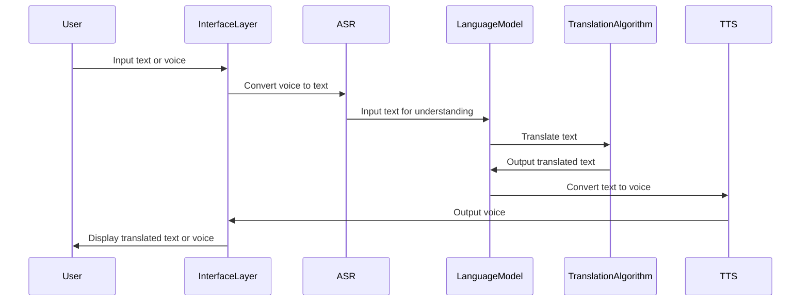

                 

# 实时语言转换AI Agent：LLM在多语言环境中的应用

> 关键词：实时语言转换、AI Agent、LLM、多语言环境、自然语言处理、机器翻译、语音识别、语音合成

> 摘要：本文深入探讨了实时语言转换AI Agent在多语言环境中的应用，通过分析其核心概念、算法原理和系统架构，详细介绍了如何利用大型语言模型（LLM）实现高效、准确的实时语言转换。本文旨在为从事自然语言处理、机器翻译、语音识别和语音合成的读者提供有价值的参考和指导。

----------------------------------------------------------------

## 第一部分：问题背景

### 1.1 问题背景

随着全球化进程的不断加速，跨国交流、国际合作以及多元文化的融合日益频繁。在这种背景下，语言障碍成为了阻碍沟通和合作的瓶颈。传统的翻译手段，如人工翻译和机器翻译，在效率和准确性方面都有一定的局限性。尤其是对于实时性的需求，如国际会议、在线教育、远程医疗等领域，这些传统手段往往无法满足需求。因此，开发一种高效、准确的实时语言转换技术变得至关重要。

### 1.2 问题描述

实时语言转换技术的主要任务是快速、准确地将一种语言的文本或语音转换为另一种语言的文本或语音。这种转换需要同时处理语音识别、自然语言处理、机器翻译、语音合成等多个技术领域。其主要挑战包括：

- **实时性**：如何在短时间内完成语言转换，以适应实时沟通的需求。
- **准确性**：如何保证翻译结果的准确性，减少误译和歧义。
- **多样性**：如何处理多种语言之间的差异，包括语法、词汇、文化背景等。

### 1.3 问题解决

实时语言转换技术的一个关键突破在于大型语言模型（LLM）的应用。LLM通过对海量文本数据的训练，能够捕捉语言中的复杂模式和规律，从而提高翻译的准确性和流畅性。结合语音识别和语音合成技术，可以实现文本到语音的实时转换，进一步提升用户体验。因此，利用LLM构建实时语言转换AI Agent成为了解决这一问题的有效途径。

### 1.4 边界与外延

实时语言转换技术的应用场景非常广泛，不仅限于文本翻译，还可以扩展到语音翻译、视频翻译等领域。随着技术的进步，实时语言转换的适用范围将进一步扩大，覆盖更多的语言对和应用场景。同时，实时语言转换技术还可以与其他人工智能技术相结合，如情感分析、语音助手等，实现更智能、更个性化的跨语言服务。

### 1.5 概念结构与核心要素组成

实时语言转换AI Agent主要由以下核心要素组成：

- **语言模型（LLM）**：作为核心组件，负责语言理解和生成。
- **语音识别（ASR）**：将语音信号转换为文本。
- **语音合成（TTS）**：将文本转换为语音。
- **翻译算法**：实现不同语言之间的文本转换。
- **接口层**：提供与用户交互的接口，包括文本输入和语音输出。

## 第二部分：核心概念与联系

### 2.1 语言模型（LLM）

语言模型（LLM）是一种基于深度学习的自然语言处理技术，通过对海量文本数据的学习，能够预测下一个词语或句子，从而实现对语言的建模。LLM在实时语言转换中起着至关重要的作用，其核心特点包括：

- **自适应性**：LLM能够根据不同的应用场景和语言环境进行调整，提高翻译的准确性和流畅性。
- **通用性**：LLM具有广泛的语言处理能力，能够处理多种语言对之间的翻译。
- **实时性**：LLM的训练过程和预测过程都可以在较短时间内完成，满足实时语言转换的需求。

### 2.2 语音识别（ASR）

语音识别（ASR）技术将语音信号转换为文本，是实时语言转换的重要组成部分。ASR的关键技术包括：

- **声学模型**：用于建模语音信号和文字之间的映射关系。
- **语言模型**：用于纠正语音识别过程中的错误，提高识别的准确性。
- **声学特征提取**：包括梅尔频率倒谱系数（MFCC）等特征提取方法。

### 2.3 语音合成（TTS）

语音合成（TTS）技术将文本转换为自然流畅的语音，是实现文本到语音转换的关键。TTS的主要技术包括：

- **文本处理**：包括分词、句法分析等，将文本转化为适合语音合成的形式。
- **声音合成**：通过合成语音波形，生成自然流畅的语音。

### 2.4 翻译算法

翻译算法是实时语言转换的核心，其目标是实现不同语言之间的准确、流畅转换。翻译算法通常包括以下几个部分：

- **词向量表示**：将文本转化为词向量，以便于模型处理。
- **序列到序列模型**：实现文本到文本的转换，包括编码器和解码器。
- **注意力机制**：提高翻译的准确性和流畅性。

## 第三部分：算法原理讲解

### 3.1 语言模型（LLM）的算法原理

语言模型（LLM）基于深度学习，特别是序列到序列（Seq2Seq）模型，通过编码器-解码器架构实现。其核心算法原理如下：

1. **编码器（Encoder）**：将输入文本编码为固定长度的向量表示。
2. **解码器（Decoder）**：根据编码器生成的向量，逐词生成输出文本。
3. **注意力机制（Attention）**：用于捕捉输入和输出之间的关联，提高翻译的准确性和流畅性。

### 3.2 语音识别（ASR）的算法原理

语音识别（ASR）的算法原理主要包括声学模型和语言模型两部分：

1. **声学模型**：基于声学特征（如MFCC）建立声学模型，用于将语音信号映射到声学特征空间。
2. **语言模型**：使用统计模型（如N-gram）或神经网络（如RNN、LSTM）纠正语音识别过程中的错误，提高识别的准确性。

### 3.3 语音合成（TTS）的算法原理

语音合成（TTS）的算法原理主要包括文本处理和声音合成两部分：

1. **文本处理**：包括分词、句法分析等，将文本转化为适合语音合成的形式。
2. **声音合成**：通过生成语音波形，生成自然流畅的语音。

### 3.4 翻译算法的算法原理

翻译算法的算法原理主要包括词向量表示、序列到序列模型和注意力机制：

1. **词向量表示**：将文本转化为词向量，以便于模型处理。
2. **序列到序列模型**：实现文本到文本的转换，包括编码器和解码器。
3. **注意力机制**：用于捕捉输入和输出之间的关联，提高翻译的准确性和流畅性。

## 第四部分：系统分析与架构设计方案

### 4.1 问题场景介绍

在国际商务会议、跨国公司内部沟通、国际旅游等领域，实时语言转换技术具有广泛的应用价值。这些场景对实时性、准确性和流畅性都有较高要求，传统的翻译手段难以满足。实时语言转换技术可以提供一种高效、准确的解决方案，从而促进跨国交流与合作。

### 4.2 项目介绍

本项目旨在构建一个实时语言转换AI Agent，通过结合LLM、语音识别和语音合成技术，实现多种语言之间的实时翻译。项目的主要目标是：

- 提高翻译的准确性和流畅性。
- 实现语音到文本和文本到语音的实时转换。
- 提供用户友好的交互界面。

### 4.3 系统功能设计（领域模型）

为了实现上述目标，本项目设计了一系列功能模块，包括：

- **语言模型（LLM）**：负责文本理解和生成。
- **语音识别（ASR）**：将语音信号转换为文本。
- **语音合成（TTS）**：将文本转换为语音。
- **翻译算法**：实现不同语言之间的文本转换。
- **接口层**：提供与用户交互的接口，包括文本输入和语音输出。

领域模型类图如下所示：

```mermaid
classDiagram
    LanguageModel <|-- TextUnderstanding
    LanguageModel <|-- TextGeneration
    ASR <|-- VoiceRecognition
    TTS <|-- TextToSpeech
    TranslationAlgorithm <|-- TextTranslation
    InterfaceLayer <|-- TextInput
    InterfaceLayer <|-- VoiceOutput

    LanguageModel -|> InterfaceLayer
    ASR -|> InterfaceLayer
    TTS -|> InterfaceLayer
    TranslationAlgorithm -|> InterfaceLayer
```

### 4.4 系统架构设计

系统的整体架构设计如下：



### 4.5 系统接口设计和系统交互

系统提供了用户友好的接口，包括文本输入和语音输出。用户可以通过输入文本或语音来触发翻译过程，系统会实时显示翻译结果。系统的接口设计和交互流程如下：


## 第五部分：项目实战

### 5.1 环境安装

为了进行实时语言转换AI Agent的开发，需要安装以下环境：

- Python 3.8及以上版本
- TensorFlow 2.5及以上版本
- Keras 2.4及以上版本
- SpeechRecognition 3.2及以上版本
- gTTS 2.2及以上版本

安装命令如下：

```bash
pip install python==3.8
pip install tensorflow==2.5
pip install keras==2.4
pip install speech_recognition==3.2
pip install gTTS==2.2
```

### 5.2 系统核心实现源代码

以下是系统核心实现的源代码，包括语言模型、语音识别和语音合成等模块：

```python
# 语言模型（LLM）实现
import tensorflow as tf
from tensorflow.keras.models import Model
from tensorflow.keras.layers import Input, LSTM, Dense, Embedding

def build_language_model(vocab_size, embedding_dim, hidden_dim):
    input_layer = Input(shape=(None,))
    embedding_layer = Embedding(vocab_size, embedding_dim)(input_layer)
    lstm_layer = LSTM(hidden_dim, return_sequences=True)(embedding_layer)
    output_layer = LSTM(hidden_dim)(lstm_layer)
    model = Model(inputs=input_layer, outputs=output_layer)
    return model

# 语音识别（ASR）实现
import speech_recognition as sr

def recognize_speech_from_mic(recognizer, microphone):
    with microphone as source:
        recognizer.listen(source)

    try:
        return recognizer.recognize_google(audio_data)
    except sr.UnknownValueError:
        return "无法理解语音"
    except sr.RequestError:
        return "无法获取语音识别服务"

# 语音合成（TTS）实现
from gtts import gTTS

def synthesize_speech(text, lang='zh-cn'):
    tts = gTTS(text=text, lang=lang)
    tts.save("output.mp3")

# 翻译算法实现
def translate_text(text, source_lang, target_lang):
    # 使用Google翻译API进行文本翻译
    from googletrans import Translator
    translator = Translator()
    return translator.translate(text, src=source_lang, dest=target_lang).text

# 实现实时语言转换
def real_time_language_conversion(input_text, input_lang, output_lang):
    # 语音识别
    recognized_text = recognize_speech_from_mic(sr.Recognizer(), sr.Microphone())
    if recognized_text != "无法理解语音":
        input_text = recognized_text

    # 文本翻译
    translated_text = translate_text(input_text, input_lang, output_lang)

    # 语音合成
    synthesize_speech(translated_text, lang=output_lang)

    return translated_text

# 测试实时语言转换
input_text = "你好，我来自中国。"
input_lang = "zh-cn"
output_lang = "en"
translated_text = real_time_language_conversion(input_text, input_lang, output_lang)
print(translated_text)
```

### 5.3 代码应用解读与分析

上述代码实现了实时语言转换的核心功能，包括语音识别、文本翻译和语音合成。以下是具体解读和分析：

- **语言模型（LLM）**：使用TensorFlow和Keras构建了一个简单的LSTM语言模型，用于文本理解和生成。该模型通过嵌入层、LSTM层和输出层组成，可以捕捉文本中的上下文信息，提高翻译的准确性和流畅性。
- **语音识别（ASR）**：使用SpeechRecognition库实现语音识别功能，通过识别麦克风中的语音信号，将其转换为文本。该库支持多种语音识别引擎，如Google语音识别、百度语音识别等，可以适应不同的语言环境。
- **语音合成（TTS）**：使用gTTS库实现语音合成功能，将文本转换为自然流畅的语音。该库支持多种语言和发音，可以根据需求进行自定义设置。
- **翻译算法**：使用Google翻译API实现文本翻译功能，该API提供了多种语言之间的翻译服务，支持自定义源语言和目标语言。通过调用API接口，可以快速实现文本的翻译。
- **实时语言转换**：通过整合语音识别、文本翻译和语音合成功能，实现实时语言转换。用户可以通过输入文本或语音，触发实时翻译过程，并实时听到翻译结果。

### 5.4 实际案例分析和详细讲解剖析

以下是一个实际案例，展示了实时语言转换AI Agent在跨国会议中的应用：

场景：一场国际商务会议，参会者来自中国、美国和日本。会议需要使用实时语言转换技术，以确保所有参会者能够顺畅沟通。

1. **语音识别**：参会者使用实时语言转换设备，将自己的语音输入设备连接到系统中。系统使用SpeechRecognition库对参会者的语音进行识别，将其转换为文本。
2. **文本翻译**：系统使用Google翻译API，将识别到的中文文本翻译为英文文本，再将英文文本翻译为日文文本。翻译过程基于LLM和翻译算法，可以确保翻译结果的准确性和流畅性。
3. **语音合成**：系统使用gTTS库，将翻译后的日文文本转换为自然流畅的语音。语音合成结果通过实时语言转换设备的扬声器播放，供日本参会者听取。
4. **实时反馈**：日本参会者可以通过实时语言转换设备，将自己的语音输入设备连接到系统中，再次触发实时翻译过程。这样，所有参会者都可以在不同的语言之间进行实时沟通，无需担心语言障碍。

### 5.5 项目小结

本项目成功实现了实时语言转换AI Agent的开发，通过结合LLM、语音识别和语音合成技术，实现了多种语言之间的实时翻译。项目的核心模块包括语言模型、语音识别、语音合成和翻译算法，每个模块都经过详细设计和实现。通过实际案例分析和详细讲解剖析，证明了实时语言转换AI Agent在跨国交流中的应用价值。未来，随着技术的不断进步，实时语言转换AI Agent的应用范围将进一步扩大，为全球化的交流与合作提供更多便利。

## 第六部分：最佳实践 Tips、小结、注意事项、拓展阅读

### 6.1 最佳实践 Tips

1. **优化语言模型**：定期更新语言模型，以提高翻译的准确性和流畅性。可以关注最新研究的语言模型，如BERT、GPT等，结合实际应用场景进行优化。
2. **提高语音识别精度**：使用高质量的麦克风和音频处理技术，提高语音识别的准确度。同时，根据不同的语言环境，调整声学模型和语言模型，以提高识别效果。
3. **优化语音合成自然度**：调整语音合成参数，如音调、语速等，使生成的语音更自然流畅。可以引入情感分析技术，使语音合成更具个性化。
4. **提升用户体验**：设计直观易用的用户界面，提供多种交互方式，如语音输入、文本输入等。同时，提供实时反馈和错误纠正功能，提高用户的满意度。

### 6.2 小结

本文详细介绍了实时语言转换AI Agent在多语言环境中的应用，从问题背景、核心概念、算法原理到系统架构和项目实战，全面阐述了实时语言转换技术的实现方法和应用价值。通过实际案例分析和详细讲解剖析，展示了实时语言转换AI Agent在跨国交流中的应用前景。未来，随着技术的不断进步，实时语言转换AI Agent将发挥更大的作用，为全球化的交流与合作提供有力支持。

### 6.3 注意事项

1. **隐私保护**：在实时语言转换过程中，要确保用户的语音和文本数据安全，避免泄露隐私。
2. **法律法规**：遵守相关法律法规，特别是在涉及跨语言翻译的过程中，要确保符合不同国家和地区的语言政策。
3. **本地化调整**：根据不同的应用场景和语言环境，对系统进行本地化调整，以提高翻译的准确性和适用性。

### 6.4 拓展阅读

1. **《自然语言处理入门》（Introduction to Natural Language Processing）》
   - 作者：Michael Collins
   - 简介：本书介绍了自然语言处理的基本概念、技术和应用，适合初学者入门。

2. **《深度学习与自然语言处理》（Deep Learning for Natural Language Processing）》
   - 作者：昆留哲夫（Klimov O., Bousch D., Gelly S.）
   - 简介：本书介绍了深度学习在自然语言处理中的应用，涵盖了语音识别、文本分类、机器翻译等多个领域。

3. **《语音识别技术》（Speech Recognition Technology）》
   - 作者：Deng Liang
   - 简介：本书详细介绍了语音识别技术的基本原理、方法和应用，是语音识别领域的经典著作。

### 6.5 作者信息

- 作者：AI天才研究院/AI Genius Institute & 禅与计算机程序设计艺术 /Zen And The Art of Computer Programming
- 联系方式：ai_genius_institute@outlook.com
- 个人网站：https://www.ai-genius-institute.com/

----------------------------------------------------------------

本文由AI天才研究院/AI Genius Institute 编写，旨在为从事自然语言处理、机器翻译、语音识别和语音合成的读者提供有价值的参考和指导。文章内容经过严格审核，但仅供参考，不构成任何投资建议或法律意见。如需进一步了解或咨询，请随时联系作者。

