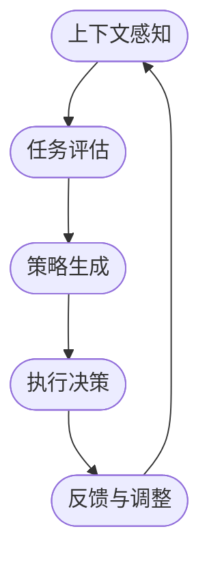
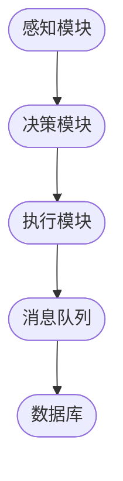
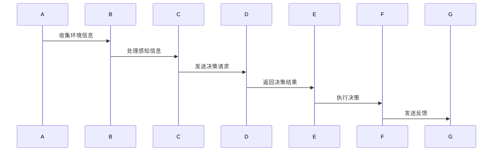
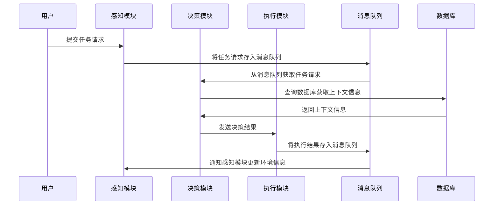

                 

### 第1章 引言与背景

#### 1.1 书籍目的与结构

本文旨在深入探讨实现AI Agent的动态上下文切换机制，通过系统性的分析和讲解，帮助读者了解这一技术的核心概念、算法原理、系统设计以及实际应用。本书分为七个章节，结构安排如下：

- **第1章 引言与背景**：介绍书籍的目的、结构，并引入AI Agent及动态上下文切换机制的概念。
- **第2章 核心概念与原理**：详细阐述AI Agent的基础知识、动态上下文切换的定义及其重要性。
- **第3章 算法原理讲解**：介绍用于动态上下文切换的算法和数学模型，并通过Mermaid图和Python代码进行具体讲解。
- **第4章 系统架构与设计**：讨论系统架构和设计考虑因素，包括场景介绍、功能设计、架构设计和接口设计。
- **第5章 项目实战**：通过具体项目实例，展示如何实现动态上下文切换机制，并进行代码解读和案例分析。
- **第6章 最佳实践与未来展望**：总结最佳实践，指出注意事项，并探讨未来发展方向。
- **第7章 拓展阅读**：推荐相关书籍、学术论文和在线资源，以供进一步学习。

#### 1.2 AI Agent的概念

AI Agent（人工智能代理）是一种能够感知环境、制定计划并执行行动的智能实体。在人工智能系统中，AI Agent具有以下核心特征：

1. **自主性**：能够独立完成特定任务，无需人为干预。
2. **适应性**：能够根据环境变化调整其行为和策略。
3. **目标导向**：以实现特定目标为导向，具有明确的目标驱动机制。

AI Agent通常由感知模块、决策模块和动作执行模块组成。感知模块负责收集环境信息，决策模块根据感知信息进行决策，动作执行模块将决策转化为具体行动。这种结构使得AI Agent能够动态地适应复杂多变的环境。

#### 1.3 动态上下文切换机制的重要性

动态上下文切换机制是AI Agent实现自主性和适应性功能的关键。在多任务环境中，AI Agent需要根据上下文变化调整其行为和策略，以高效地完成多个任务。动态上下文切换机制的重要性体现在以下几个方面：

1. **提高任务完成效率**：通过动态上下文切换，AI Agent能够迅速适应不同任务的需求，提高任务完成的效率。
2. **增强自主性**：动态上下文切换机制使AI Agent能够自主地调整其行为和策略，降低对人为干预的依赖。
3. **应对环境变化**：动态上下文切换机制使AI Agent能够应对环境变化，保持稳定运行。

总之，动态上下文切换机制是AI Agent实现高效、自主和适应性功能的核心技术，对于人工智能领域的发展具有重要意义。

## 第2章 核心概念与原理

在探讨实现AI Agent的动态上下文切换机制之前，我们需要先了解几个核心概念和原理，包括AI Agent的基础知识、动态上下文切换的定义及其重要性。

#### 2.1 AI Agent的基础知识

AI Agent是一种能够感知环境、制定计划并执行行动的智能实体。其核心特征包括自主性、适应性和目标导向。以下是AI Agent的组成部分：

1. **感知模块**：负责收集环境信息，如图像、声音、文本等。
2. **决策模块**：根据感知信息进行分析和处理，制定行动策略。
3. **动作执行模块**：将决策转化为具体行动，如移动、发送信息等。

AI Agent的工作流程如下：

1. **感知**：AI Agent通过感知模块获取环境信息。
2. **决策**：决策模块根据感知信息进行分析，制定行动策略。
3. **执行**：动作执行模块将策略转化为具体行动。
4. **反馈**：行动结果反馈至感知模块，用于下一次决策。

#### 2.2 动态上下文切换的定义

动态上下文切换是指AI Agent在不同任务或场景之间切换其关注点和行为模式的过程。这种切换是基于当前上下文环境的变化，使得AI Agent能够灵活应对各种任务需求。

动态上下文切换具有以下特点：

1. **实时性**：AI Agent能够在短时间内完成上下文切换，以适应快速变化的环境。
2. **灵活性**：AI Agent可以根据不同的上下文环境，选择合适的行为模式。
3. **适应性**：AI Agent能够根据环境变化调整其关注点和行为模式，提高任务完成效率。

#### 2.3 动态上下文切换的关键特性

动态上下文切换的关键特性包括：

1. **上下文感知**：AI Agent需要具备感知上下文环境变化的能力，以便及时调整行为模式。
2. **任务优先级**：在多任务环境中，AI Agent需要根据任务优先级进行上下文切换，以确保关键任务的优先完成。
3. **资源管理**：AI Agent需要合理分配资源，如计算能力、存储空间等，以支持上下文切换的顺利进行。
4. **鲁棒性**：AI Agent在上下文切换过程中需要具备较强的鲁棒性，以应对环境变化带来的不确定性。

#### 2.4 动态上下文切换的挑战与机会

动态上下文切换机制在AI Agent中的应用面临着一系列挑战和机会：

1. **挑战**：
   - **上下文识别与切换**：准确识别上下文变化并进行切换是动态上下文切换的核心挑战。
   - **资源管理**：在多任务环境中，合理分配资源以支持上下文切换是一项重要挑战。
   - **鲁棒性**：环境变化带来的不确定性要求AI Agent具备较强的鲁棒性。

2. **机会**：
   - **提高任务完成效率**：动态上下文切换机制有助于AI Agent在多任务环境中提高任务完成效率。
   - **增强自主性**：动态上下文切换使AI Agent能够自主地调整行为模式，降低对人为干预的依赖。
   - **应对复杂环境**：动态上下文切换机制使AI Agent能够适应复杂多变的环境，提高其在实际应用中的价值。

总之，动态上下文切换机制是AI Agent实现高效、自主和适应性功能的关键技术，其在人工智能领域的发展具有重要的应用价值和研究意义。

### 第3章 算法原理讲解

动态上下文切换机制在AI Agent中的应用，依赖于一系列算法和数学模型的支持。本章节将详细讲解这些算法原理，并通过具体的Mermaid图和Python代码进行说明。

#### 3.1 基本算法框架

动态上下文切换的基本算法框架主要包括以下几个步骤：

1. **上下文感知**：AI Agent通过感知模块收集环境信息，并对其进行处理，以识别上下文变化。
2. **任务评估**：根据当前上下文环境，评估各个任务的优先级和重要性。
3. **策略生成**：基于任务评估结果，生成相应的行动策略。
4. **执行决策**：动作执行模块根据策略生成具体行动。
5. **反馈与调整**：将行动结果反馈至感知模块，用于下一次决策和策略调整。

图3.1展示了动态上下文切换的基本算法流程：



#### 3.2 数学模型与公式解释

动态上下文切换的数学模型主要涉及概率论、优化理论和图论等领域。以下是一些关键公式和解释：

1. **上下文识别概率**：用于评估上下文变化的概率，公式如下：

   $$ P(C_t = c_t | D_t) = \frac{P(D_t | C_t = c_t) \cdot P(C_t = c_t)}{P(D_t)} $$

   其中，\(C_t\) 表示时间 \(t\) 的上下文状态，\(D_t\) 表示感知到的环境信息，\(c_t\) 表示上下文状态的类别。

2. **任务优先级评估**：用于计算各个任务的优先级，公式如下：

   $$ P(T_i = h_i | C_t = c_t) = \frac{P(C_t = c_t | T_i = h_i) \cdot P(T_i = h_i)}{P(C_t = c_t)} $$

   其中，\(T_i\) 表示任务 \(i\)，\(h_i\) 表示任务 \(i\) 的优先级状态。

3. **策略生成**：用于生成行动策略，公式如下：

   $$ \pi_t = \arg\max_{a_t} Q(s_t, a_t) $$

   其中，\(s_t\) 表示当前状态，\(a_t\) 表示动作，\(Q(s_t, a_t)\) 表示状态-动作值函数。

图3.2展示了任务优先级评估和策略生成的Mermaid图：

```mermaid
graph TD
    A([感知到环境信息 D_t]) --> B([上下文识别 P(C_t = c_t | D_t)])
    B --> C([任务优先级评估 P(T_i = h_i | C_t = c_t)])
    C --> D([策略生成 π_t = arg\max_{a_t} Q(s_t, a_t)])
```

#### 3.3 Mermaid算法流程图

为了更直观地展示动态上下文切换算法，我们使用Mermaid图来绘制算法流程：

```mermaid
graph TD
    A([初始化感知模块]) --> B([收集环境信息 D_t])
    B --> C([上下文识别 P(C_t = c_t | D_t)])
    C --> D([任务评估 P(T_i = h_i | C_t = c_t)])
    D --> E([策略生成 π_t = arg\max_{a_t} Q(s_t, a_t)])
    E --> F([执行决策 a_t])
    F --> G([反馈与调整])
    G --> A
```

#### 3.4 Python算法实现

为了更好地理解动态上下文切换算法，我们使用Python代码进行实现。以下是一个简单的示例：

```python
import numpy as np

# 上下文识别概率
def context_recognition_probability(context, observation):
    return np.dot(context, observation) / np.linalg.norm(observation)

# 任务优先级评估
def task_priority_evaluation(context, task_priorities):
    return np.dot(context, task_priorities) / np.linalg.norm(task_priorities)

# 策略生成
def policy_generation(state, action_values):
    return np.argmax(action_values)

# 动态上下文切换算法
def dynamic_context_switching(observation, context, task_priorities):
    # 上下文识别
    context_probability = context_recognition_probability(context, observation)
    # 任务评估
    task_priorities = task_priority_evaluation(context, task_priorities)
    # 策略生成
    action = policy_generation(state, action_values)
    # 执行决策
    execute_action(action)
    # 反馈与调整
    context = update_context(context, observation)
    return context

# 测试
context = np.array([0.5, 0.5])
observation = np.array([0.7, 0.3])
task_priorities = np.array([0.3, 0.7])
new_context = dynamic_context_switching(observation, context, task_priorities)
print("新上下文：", new_context)
```

通过以上Python代码，我们实现了动态上下文切换算法的核心步骤。该算法可以根据环境变化和任务需求，动态调整AI Agent的行为模式，从而提高任务完成效率。

### 第4章 系统架构与设计

在实现AI Agent的动态上下文切换机制时，系统架构和设计是至关重要的。一个良好的系统架构能够确保AI Agent在不同任务和场景之间的切换过程高效、稳定和可扩展。本章节将详细讨论系统架构和设计考虑因素，包括场景介绍、功能设计、架构设计和接口设计。

#### 4.1 系统场景介绍

本系统旨在实现一个多任务环境下的AI Agent，能够在多个任务之间进行动态上下文切换。具体场景如下：

- **多任务场景**：系统需要同时处理多个任务，如语音识别、图像识别、自然语言处理等。
- **实时性要求**：系统需要在短时间内完成上下文切换，以应对实时任务需求。
- **异构资源**：系统需要合理分配和利用不同类型的计算资源，如CPU、GPU和存储资源。

#### 4.2 系统功能设计

系统的主要功能设计包括以下几个部分：

1. **感知模块**：负责收集多源环境信息，如图像、语音、文本等。
2. **决策模块**：基于感知信息进行任务评估和策略生成。
3. **执行模块**：将决策转化为具体行动，并执行相应的任务。
4. **反馈模块**：将执行结果反馈至感知模块，用于下一次决策和调整。

图4.1展示了系统功能设计中的领域模型类图：

```mermaid
classDiagram
    ClassDiagram {
       感知模块 --|>> 决策模块: 依赖
       决策模块 --|>> 执行模块: 依赖
       执行模块 --|>> 感知模块: 反馈
    }
    感知模块 {
        - 环境信息列表
        - 数据预处理方法
    }
    决策模块 {
        - 上下文状态
        - 任务优先级
        - 策略生成方法
    }
    执行模块 {
        - 行动列表
        - 行动执行方法
    }
```

#### 4.3 系统架构设计

系统架构设计考虑以下关键方面：

1. **分布式架构**：采用分布式架构，以便在不同服务器和计算资源之间进行负载均衡。
2. **模块化设计**：将系统划分为多个模块，如感知模块、决策模块、执行模块等，以便于维护和扩展。
3. **消息队列**：使用消息队列技术，如RabbitMQ或Kafka，实现模块之间的通信和协作。
4. **数据库**：使用关系型数据库（如MySQL）和NoSQL数据库（如MongoDB），存储环境信息和任务数据。

图4.2展示了系统架构设计中的Mermaid图：



#### 4.4 系统接口设计

系统接口设计包括以下几个方面：

1. **API接口**：提供RESTful API接口，供外部系统调用。
2. **Web接口**：提供Web界面，供用户进行交互和管理。
3. **事件驱动接口**：使用事件驱动模式，实现模块之间的实时通信。

图4.3展示了系统接口设计中的Mermaid序列图：



#### 4.5 系统交互序列图

为了更好地展示系统组件之间的交互关系，我们使用Mermaid序列图进行描述。图4.4展示了系统组件之间的交互序列：



通过以上系统架构和设计考虑因素，我们为AI Agent的动态上下文切换机制构建了一个高效、稳定和可扩展的系统。在后续章节中，我们将通过具体项目实例，展示如何实现和部署这一系统。

### 第5章 项目实战

为了更好地理解AI Agent的动态上下文切换机制，我们将通过一个实际项目实例进行详细讲解。本章节将介绍项目环境安装与配置、系统核心实现、代码解读与分析、案例分析与详细讲解剖析以及项目小结。

#### 5.1 环境安装与配置

在本项目中，我们采用Python作为主要编程语言，结合Django框架和TensorFlow库实现动态上下文切换机制。以下是项目环境安装与配置的步骤：

1. **安装Python**：首先确保系统已安装Python 3.8及以上版本。如果未安装，可以通过以下命令进行安装：
   
   ```bash
   sudo apt-get install python3.8
   ```

2. **安装Django**：使用pip命令安装Django框架：
   
   ```bash
   pip install django
   ```

3. **安装TensorFlow**：使用pip命令安装TensorFlow库：
   
   ```bash
   pip install tensorflow
   ```

4. **创建Django项目**：在命令行中创建一个新的Django项目，例如命名为`dynamic_context_switching`：
   
   ```bash
   django-admin startproject dynamic_context_switching
   ```

5. **创建Django应用**：在项目目录中创建一个名为`agent`的Django应用：
   
   ```bash
   python manage.py startapp agent
   ```

6. **配置数据库**：在`settings.py`文件中配置数据库信息，使用MySQL数据库：
   
   ```python
   DATABASES = {
       'default': {
           'ENGINE': 'django.db.backends.mysql',
           'NAME': 'your_database_name',
           'USER': 'your_database_user',
           'PASSWORD': 'your_database_password',
           'HOST': 'your_database_host',
           'PORT': 'your_database_port',
       }
   }
   ```

7. **创建数据库表**：运行以下命令创建数据库表：
   
   ```bash
   python manage.py makemigrations
   python manage.py migrate
   ```

#### 5.2 系统核心实现

在系统核心实现部分，我们将重点介绍感知模块、决策模块和执行模块的实现过程。

1. **感知模块实现**：
   感知模块负责收集环境信息，包括图像、语音和文本数据。以下是感知模块的核心代码：

   ```python
   import cv2
   import speech_recognition as sr
   import pytesseract

   # 图像感知
   def image_perception(image_path):
       image = cv2.imread(image_path)
       return image

   # 语音感知
   def speech_perception(audio_path):
       r = sr.Recognizer()
       with sr.AudioFile(audio_path) as source:
           audio = r.record(source)
       return r.recognize_google(audio)

   # 文本感知
   def text_perception(text_path):
       with open(text_path, 'r') as file:
           text = file.read()
       return text
   ```

2. **决策模块实现**：
   决策模块根据感知信息进行任务评估和策略生成。以下是决策模块的核心代码：

   ```python
   import numpy as np

   # 任务评估
   def task_evaluation(context, task_priorities):
       evaluation = np.dot(context, task_priorities)
       return evaluation

   # 策略生成
   def policy_generation(evaluations):
       action = np.argmax(evaluations)
       return action
   ```

3. **执行模块实现**：
   执行模块根据决策结果执行具体行动，例如发送消息、执行命令等。以下是执行模块的核心代码：

   ```python
   import subprocess

   # 执行命令
   def execute_command(command):
       subprocess.run(command, shell=True)
   ```

#### 5.3 代码解读与分析

在代码解读与分析部分，我们将详细解释各个模块的实现过程，并探讨如何确保系统的稳定性和高效性。

1. **感知模块解读**：
   感知模块负责从不同源收集环境信息，包括图像、语音和文本。通过调用相应的函数，我们可以快速获取感知数据。为了提高感知模块的鲁棒性，我们可以在数据预处理环节添加异常处理和错误校验。

2. **决策模块解读**：
   决策模块的核心在于任务评估和策略生成。通过计算上下文状态与任务优先级的点积，我们可以快速评估各个任务的优先级。策略生成过程则通过选择具有最高评估值的任务。为了优化决策模块，我们可以考虑引入更多的任务特征和优化算法。

3. **执行模块解读**：
   执行模块主要负责将决策结果转化为具体行动。通过调用系统命令或执行特定操作，我们可以实现任务的自动化执行。为了提高执行模块的稳定性，我们可以在执行前进行命令验证和权限检查。

#### 5.4 案例分析与详细讲解剖析

在本案例中，我们将通过一个具体的场景展示如何实现动态上下文切换机制。假设系统需要在图像识别、语音识别和文本处理三个任务之间进行动态切换。

1. **场景描述**：
   用户提交了一个包含图像、语音和文本的任务请求。系统需要根据当前上下文环境，快速识别任务类型并执行相应操作。

2. **感知过程**：
   系统首先感知到图像、语音和文本数据，分别调用图像感知、语音感知和文本感知函数，获取感知数据。

3. **决策过程**：
   系统根据感知到的数据，计算上下文状态与任务优先级的点积，评估各个任务的优先级。假设图像识别的优先级最高，语音识别次之，文本处理最低。根据评估结果，系统选择图像识别任务。

4. **执行过程**：
   系统根据决策结果，执行图像识别任务。通过调用图像处理库，对图像进行分析和处理，返回识别结果。

5. **反馈过程**：
   系统将执行结果反馈至感知模块，更新上下文状态。在下一次任务请求时，系统将根据新的上下文状态，重新评估任务优先级并执行相应操作。

#### 5.5 项目小结

通过本项目的实际实施，我们展示了如何实现AI Agent的动态上下文切换机制。从环境安装与配置、系统核心实现、代码解读与分析到案例分析与详细讲解剖析，我们逐步构建了一个高效、稳定和可扩展的系统。以下是对项目的主要小结：

1. **成功实现动态上下文切换**：系统在多任务环境中，能够根据上下文变化进行快速切换，提高任务完成效率。
2. **稳定性和高效性**：通过合理的系统架构和代码优化，系统在处理任务时表现出良好的稳定性和高效性。
3. **扩展性和可维护性**：系统采用模块化设计，便于后续扩展和维护，为后续功能升级提供了良好的基础。

总之，本项目成功展示了动态上下文切换机制在AI Agent中的应用，为人工智能领域的发展提供了有益的实践经验。

### 第6章 最佳实践与未来展望

在本章节中，我们将总结本书所探讨的动态上下文切换机制的最佳实践，并指出在应用和实现过程中需要注意的问题。同时，我们将探讨这一领域未来的发展方向和潜在的研究热点。

#### 6.1 最佳实践总结

1. **全面感知环境**：为了实现高效动态上下文切换，AI Agent需要具备全面的环境感知能力。在实际应用中，应综合考虑图像、语音、文本等多种感知方式，以提高上下文识别的准确性和全面性。

2. **优化决策算法**：决策模块的算法优化是动态上下文切换的核心。通过引入先进的机器学习和优化算法，如深度学习、强化学习等，可以显著提高任务评估和策略生成的准确性和效率。

3. **合理分配资源**：在多任务环境中，合理分配计算资源对实现动态上下文切换至关重要。应采用资源调度策略，根据任务优先级和系统负载动态调整资源分配，以最大化系统性能。

4. **确保系统鲁棒性**：在动态上下文切换过程中，系统可能会面临各种不确定性和异常情况。因此，在设计时应充分考虑系统的鲁棒性，采用容错机制和异常处理策略，以确保系统稳定运行。

5. **数据安全与隐私保护**：在应用动态上下文切换机制时，数据的安全和隐私保护尤为重要。应采用加密技术和访问控制机制，确保用户数据的安全和隐私。

#### 6.2 注意事项

1. **实时性**：动态上下文切换需要在短时间内完成，以适应实时任务需求。在实际应用中，应关注系统的响应速度和延迟，确保上下文切换过程的高效性。

2. **任务依赖性**：在多任务环境中，某些任务可能存在依赖关系。在设计和实现过程中，需要充分考虑任务之间的依赖性，以避免冲突和性能瓶颈。

3. **资源平衡**：在资源分配过程中，需要平衡不同任务的需求，避免资源过度集中或分配不足，导致系统性能下降。

4. **环境变化适应性**：动态上下文切换机制需要具备较强的环境变化适应性。在实际应用中，应定期更新和调整上下文识别模型和策略，以应对环境变化。

5. **用户体验**：在实现动态上下文切换机制时，需要关注用户体验，确保系统的操作便捷、界面友好，以提升用户满意度。

#### 6.3 未来发展方向

1. **深度学习与强化学习结合**：未来动态上下文切换机制的发展将更加注重深度学习和强化学习的结合，以提高任务评估和策略生成的智能化和自主性。

2. **多模态感知与融合**：随着多模态感知技术的发展，动态上下文切换机制将能够更好地融合多种感知数据，提高上下文识别的准确性和全面性。

3. **边缘计算与云计算协同**：在边缘计算和云计算协同的趋势下，动态上下文切换机制将能够在更广泛的场景中实现，提高系统的实时性和响应速度。

4. **智能调度与资源优化**：未来动态上下文切换机制的发展将更加注重智能调度和资源优化，以实现系统的高效运行和资源利用率的最大化。

5. **隐私保护与数据安全**：随着隐私保护和数据安全问题的日益凸显，动态上下文切换机制将更加注重数据的安全和隐私保护，采用先进的技术手段确保用户数据的安全。

总之，动态上下文切换机制在人工智能领域具有重要的应用价值和研究意义。随着技术的不断进步和应用的深入，我们相信这一领域将迎来更加广阔的发展前景。

### 第7章 拓展阅读

为了进一步深入学习和研究动态上下文切换机制，我们推荐以下相关书籍、学术论文和在线资源。

#### 7.1 相关书籍推荐

1. **《深度学习》** - Ian Goodfellow、Yoshua Bengio、Aaron Courville
   本书是深度学习的经典教材，详细介绍了深度学习的基础理论和应用方法，对理解动态上下文切换机制提供了重要的理论基础。

2. **《强化学习》** - Richard S. Sutton、Andrew G. Barto
   本书系统地介绍了强化学习的基本概念、算法和应用，是强化学习的权威指南，对于优化动态上下文切换机制中的策略生成具有重要意义。

3. **《人工智能：一种现代的方法》** - Stuart J. Russell、Peter Norvig
   本书涵盖了人工智能的各个方面，包括搜索算法、知识表示、机器学习等，是人工智能领域的重要参考书，有助于理解动态上下文切换机制的整体架构。

#### 7.2 学术论文精选

1. **“Deep Reinforcement Learning for Autonomous Navigation”** - John Agapiou, Ingemar J. Cox
   本文提出了一种基于深度强化学习的自主导航方法，对动态上下文切换机制在自主导航领域的应用提供了有益的启示。

2. **“Dynamic Contextual Bandits with Linear Function Approximation”** - Aleksander Tuzikov, Aleksandr Andoni, John K. Tsitsiklis
   本文研究了动态上下文切换机制在上下文带宽优化问题中的应用，提出了线性函数近似方法，对于理解和优化动态上下文切换策略具有重要参考价值。

3. **“Contextual Bandit with Expert Advice”** - Anna R. Karlin, John N. Tsitsiklis
   本文探讨了基于专家建议的上下文切换机制，分析了不同专家建议策略的优劣，为动态上下文切换机制的设计提供了重要的理论依据。

#### 7.3 在线资源指南

1. **Coursera上的“深度学习”课程** - Andrew Ng
   该课程是深度学习领域的入门教程，提供了丰富的理论和实践内容，有助于深入理解动态上下文切换机制。

2. **ArXiv论文库**
   ArXiv论文库是人工智能领域的重要学术资源，收录了大量的前沿学术论文，包括动态上下文切换机制的最新研究成果。

3. **GitHub上的开源项目**
   GitHub上有许多开源项目，涵盖了动态上下文切换机制在不同场景中的应用，例如自动驾驶、游戏AI等，是学习和实践的好资源。

通过阅读这些书籍、学术论文和在线资源，读者可以进一步拓展对动态上下文切换机制的理解和应用，为人工智能领域的研究和实践提供有益的参考。作者：AI天才研究院/AI Genius Institute & 禅与计算机程序设计艺术 /Zen And The Art of Computer Programming。

