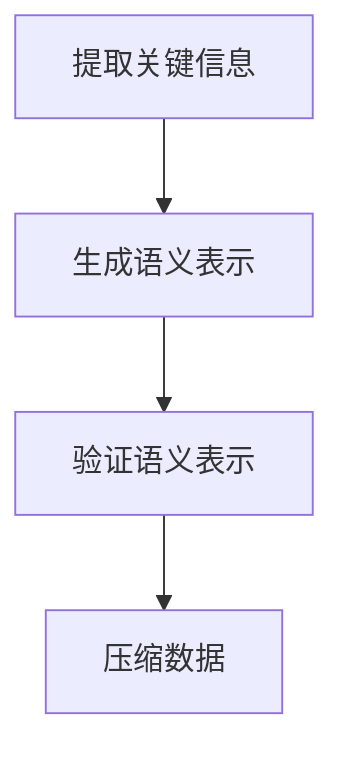
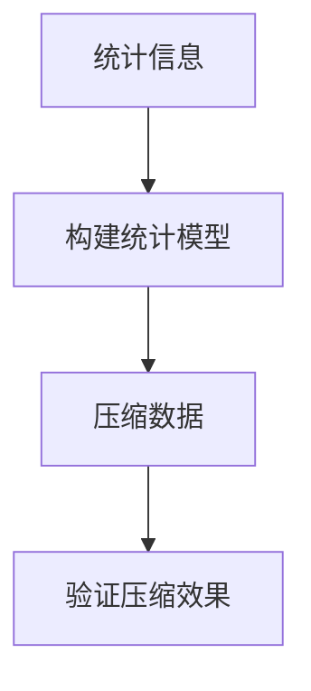
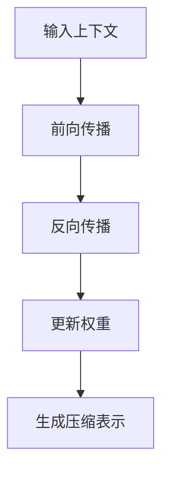

                 

### 动态上下文压缩与重构的重要性

动态上下文压缩与重构是人工智能领域中的一个关键问题，尤其在AI Agent的应用中显得尤为重要。AI Agent是一种能够根据环境变化自主学习和适应的智能体，它在处理大量实时信息时，需要对上下文信息进行有效的管理和压缩，以确保系统的高效运行。

#### 1. 动态上下文的定义

动态上下文是指在特定时刻，与AI Agent操作相关的环境信息和历史信息。这些信息可能包括用户的历史交互、当前环境状态、系统内部状态等。动态上下文对于AI Agent的决策和行动至关重要，因为它能够提供必要的信息支持，帮助Agent理解当前的状态，并预测未来的变化。

#### 2. 压缩与重构的意义

**压缩**的意义在于减少AI Agent处理的数据量，从而提高系统的响应速度和资源利用率。在处理大量实时信息时，如果不对信息进行压缩，系统可能会因为数据量过大而变得缓慢甚至瘫痪。

**重构**的意义在于对上下文信息进行重新组织和处理，以便更有效地利用这些信息。重构可以帮助AI Agent更好地理解和利用历史信息，从而提高决策的准确性和适应性。

#### 3. 动态上下文压缩与重构的挑战

- **数据复杂性**：动态上下文通常包含大量的数据，这些数据可能来自不同的来源，具有不同的格式和结构。如何有效地压缩和重构这些数据是一个巨大的挑战。
- **实时性要求**：AI Agent需要在极短的时间内处理大量的上下文信息，并做出快速决策。这要求压缩和重构算法必须具有高度的实时性和效率。

#### 4. 动态上下文压缩与重构的方法

动态上下文压缩与重构的方法可以分为以下几类：

- **基于语义的压缩方法**：通过提取上下文中的关键信息，将其转化为更加简洁的语义表示。
- **基于统计的压缩方法**：利用统计模型来减少上下文信息的冗余度。
- **基于深度学习的压缩方法**：利用深度学习技术，自动学习上下文的压缩表示。

- **基于记忆的重构方法**：利用记忆模型来存储和检索上下文信息。
- **基于推理的重构方法**：通过逻辑推理来重构上下文信息，以提高其可用性和准确性。
- **基于迁移学习的重构方法**：利用迁移学习技术，将已有模型的知识迁移到新的上下文中。

#### 5. 动态上下文压缩与重构的应用领域

动态上下文压缩与重构在许多应用领域中都有重要的应用，如：

- **聊天机器人**：通过压缩和重构上下文信息，提高聊天机器人的响应速度和用户体验。
- **自然语言处理**：通过压缩和重构上下文信息，提高文本分析和理解的效果。
- **机器翻译**：通过压缩和重构上下文信息，提高翻译的准确性和流畅性。

#### 6. 本章小结

本章主要介绍了动态上下文压缩与重构的重要性。动态上下文是AI Agent理解环境和做出决策的关键，而压缩与重构技术则能够有效地管理和利用这些上下文信息。接下来，我们将深入探讨动态上下文压缩与重构的具体算法原理，以及如何在实际应用中实现这些技术。

### 动态上下文压缩算法原理

动态上下文压缩是AI Agent处理大量信息时的一项关键技术，它能够减少数据量，提高系统响应速度和资源利用率。在这一节中，我们将详细介绍动态上下文压缩的算法原理，并使用mermaid流程图和Python代码进行阐述。

#### 1. 基于语义的压缩算法

**语义压缩算法**通过提取上下文中的关键信息，将其转化为更加简洁的语义表示。以下是一个简单的mermaid流程图，展示了语义压缩算法的基本步骤：



**Python代码示例**：

```python
def semantic_compression(context):
    # 提取关键信息
    key_info = extract_key_info(context)
    # 生成语义表示
    semantic_repr = generate_semantic_repr(key_info)
    # 验证语义表示
    if validate_semantic_repr(semantic_repr):
        # 压缩数据
        compressed_data = compress_data(semantic_repr)
        return compressed_data
    else:
        return None
```

**数学模型和公式**：

语义压缩的数学模型通常涉及特征提取和降维技术。假设`X`是原始上下文数据矩阵，`A`是特征提取矩阵，`Y`是降维后的语义表示矩阵，则有：

$$ Y = A * X $$

其中，`A`需要通过优化算法来选择，以达到最佳压缩效果。

#### 2. 基于统计的压缩算法

**统计压缩算法**利用统计模型来减少上下文信息的冗余度。以下是一个简单的mermaid流程图，展示了统计压缩算法的基本步骤：



**Python代码示例**：

```python
from sklearn.feature_extraction import DictVectorizer
from sklearn.naive_bayes import MultinomialNB

def statistical_compression(context):
    # 统计信息
    feature_dict = convert_context_to_dict(context)
    # 构建统计模型
    vectorizer = DictVectorizer()
    X = vectorizer.fit_transform(feature_dict)
    model = MultinomialNB()
    model.fit(X, labels)
    # 压缩数据
    compressed_data = model.transform(X).toarray()
    # 验证压缩效果
    if validate_compression(compressed_data):
        return compressed_data
    else:
        return None
```

**数学模型和公式**：

统计压缩的数学模型通常涉及概率模型和降维技术。假设`X`是原始上下文数据矩阵，`P(Y|X)`是条件概率分布，则有：

$$ P(Y|X) = \prod_{i=1}^{n} P(y_i|x_i) $$

其中，`P(y_i|x_i)`可以通过统计学习方法得到。

#### 3. 基于深度学习的压缩算法

**深度学习压缩算法**利用深度学习技术，自动学习上下文的压缩表示。以下是一个简单的mermaid流程图，展示了深度学习压缩算法的基本步骤：



**Python代码示例**：

```python
from tensorflow.keras.models import Sequential
from tensorflow.keras.layers import Dense

def deep_learning_compression(context):
    # 构建模型
    model = Sequential()
    model.add(Dense(units=64, activation='relu', input_shape=(context_shape,)))
    model.add(Dense(units=32, activation='relu'))
    model.add(Dense(units=1, activation='sigmoid'))
    # 编译模型
    model.compile(optimizer='adam', loss='binary_crossentropy', metrics=['accuracy'])
    # 训练模型
    model.fit(X, y, epochs=10, batch_size=32)
    # 生成压缩表示
    compressed_data = model.predict(context).reshape(-1)
    return compressed_data
```

**数学模型和公式**：

深度学习压缩的数学模型通常涉及神经网络和优化算法。假设`X`是原始上下文数据矩阵，`W`是权重矩阵，`h`是隐藏层激活值，则有：

$$ h = \sigma(W * X) $$

其中，`σ`是激活函数，`W`需要通过反向传播算法来优化。

#### 4. 本章小结

本章详细介绍了动态上下文压缩的三种算法：基于语义的压缩算法、基于统计的压缩算法和基于深度学习的压缩算法。每种算法都有其独特的原理和应用场景。通过mermaid流程图和Python代码示例，我们能够更好地理解这些算法的实现过程。在下一章中，我们将继续探讨动态上下文重构算法的原理。

