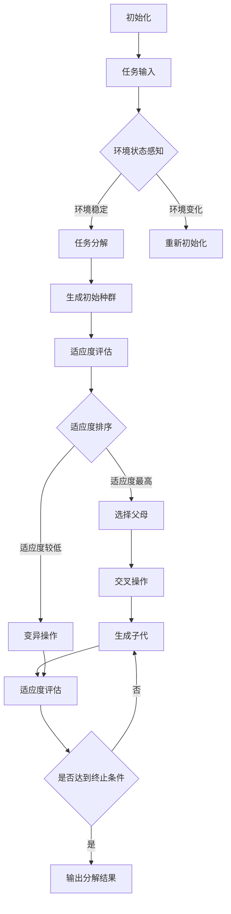
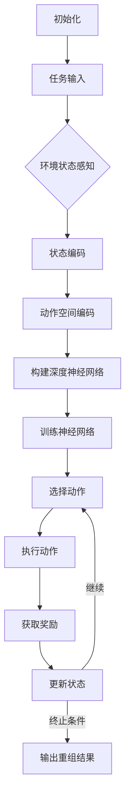

                 

# 《实现AI Agent的动态任务分解与重组能力》

## 关键词：AI Agent、动态任务分解、任务重组、智能调度、系统架构设计

## 摘要

本文旨在探讨实现AI Agent的动态任务分解与重组能力，以提升AI在复杂环境中的自适应能力和执行效率。我们将从AI Agent的基本概念入手，逐步深入到动态任务分解与重组的原理、方法、算法实现及实战应用，最后对相关技术挑战和未来方向进行总结和展望。

## 目录大纲

## 第一部分: 引言与背景

### 第1章: AI Agent的基本概念

#### 1.1.1 AI Agent的定义与历史背景
#### 1.1.2 AI Agent的主要类型与应用
#### 1.1.3 动态任务分解与重组的重要性

### 第2章: 动态任务分解的原理与方法

#### 2.1 任务分解的理论基础
#### 2.2 常见的任务分解方法
#### 2.3 动态任务分解的特点与优势

### 第3章: 动态任务重组的原理与方法

#### 3.1 任务重组的理论基础
#### 3.2 常见的任务重组方法
#### 3.3 动态任务重组的特点与优势

### 第4章: AI Agent的动态任务分解与重组框架设计

#### 4.1 系统架构设计
#### 4.2 系统模块划分与功能描述
#### 4.3 系统接口设计

## 第二部分: 动态任务分解与重组的算法实现

### 第5章: 动态任务分解算法实现

#### 5.1 任务分解算法的选择
#### 5.2 动态任务分解算法的mermaid流程图
#### 5.3 动态任务分解算法的Python实现
#### 5.4 动态任务分解算法的应用场景与效果评估

### 第6章: 动态任务重组算法实现

#### 6.1 任务重组算法的选择
#### 6.2 动态任务重组算法的mermaid流程图
#### 6.3 动态任务重组算法的Python实现
#### 6.4 动态任务重组算法的应用场景与效果评估

### 第7章: AI Agent的动态任务分解与重组实战应用

#### 7.1 实战应用环境搭建
#### 7.2 动态任务分解与重组实现案例
#### 7.3 案例分析与评估
#### 7.4 项目总结与反思

## 第三部分: 动态任务分解与重组的技术挑战与未来方向

### 第8章: 动态任务分解与重组的技术挑战

#### 8.1 任务复杂性对动态分解与重组的影响
#### 8.2 算法优化与性能提升
#### 8.3 动态环境适应性与实时性

### 第9章: 动态任务分解与重组的未来方向

#### 9.1 人工智能与大数据的结合
#### 9.2 网络协同与智能调度
#### 9.3 未来发展方向与趋势分析

### 第10章: 总结与展望

#### 10.1 全书内容回顾
#### 10.2 动态任务分解与重组的应用价值
#### 10.3 对未来研究的展望

## 1. AI Agent的基本概念

### 1.1.1 AI Agent的定义与历史背景

AI Agent，即人工智能代理，是人工智能领域中的一个重要概念。它被定义为一个能够在特定环境中感知、决策和行动的实体。AI Agent具有自主性、适应性、学习和推理能力，能够通过不断与环境交互来优化自身行为。

AI Agent的历史可以追溯到20世纪50年代，当时人工智能的概念刚刚出现。随着计算机技术的发展，AI Agent的研究也逐渐深入。从最初的规则系统、决策树到现代的深度学习、强化学习，AI Agent的形态和功能得到了极大的丰富和提升。

### 1.1.2 AI Agent的主要类型与应用

AI Agent主要可以分为以下几种类型：

1. **反应式Agent**：仅根据当前环境状态做出反应，不考虑过去和未来的状态。
2. **模型基础Agent**：具有环境模型，能够预测未来状态并做出决策。
3. **学习型Agent**：通过与环境交互学习，不断优化自身行为。
4. **混合型Agent**：结合了反应式、模型基础和学习型Agent的特点。

AI Agent的应用领域非常广泛，包括但不限于：

1. **自动化控制**：在工业生产、智能家居等领域实现自动化控制。
2. **智能客服**：通过自然语言处理技术提供高效的客户服务。
3. **智能交通**：优化交通流量，提高交通效率。
4. **金融风控**：进行风险分析和决策，防范金融风险。

### 1.1.3 动态任务分解与重组的重要性

在复杂多变的环境中，AI Agent需要具备动态任务分解与重组能力，以应对环境变化和任务需求的变化。动态任务分解与重组的重要性体现在以下几个方面：

1. **适应性**：AI Agent可以根据环境变化动态调整任务执行策略，提高适应能力。
2. **效率**：通过任务分解与重组，可以优化任务执行流程，提高执行效率。
3. **灵活性**：AI Agent可以灵活地处理各种任务，满足不同场景的需求。
4. **智能化**：动态任务分解与重组是AI Agent智能化的重要体现，有助于提升AI Agent的自主决策能力。

## 2. 动态任务分解的原理与方法

### 2.1 任务分解的理论基础

任务分解是AI Agent在执行复杂任务时的重要手段。其理论基础主要包括以下几个方面：

1. **分而治之原则**：将复杂任务分解为若干个子任务，分别解决，再组合得到总体解决方案。
2. **层次化原理**：将任务按照不同的层次结构进行分解，从高层次到低层次逐步细化。
3. **任务相关性**：分析任务之间的依赖关系，合理划分任务模块，降低任务耦合度。

### 2.2 常见的任务分解方法

常见的任务分解方法包括：

1. **基于规则的分解**：根据任务规则和条件，将任务划分为多个子任务。
2. **基于任务的分解**：根据任务目标和功能，将任务划分为多个子任务。
3. **基于数据的分解**：根据任务数据特征，将任务划分为多个子任务。

### 2.3 动态任务分解的特点与优势

动态任务分解与传统的任务分解相比，具有以下特点与优势：

1. **实时性**：动态任务分解可以根据环境变化实时调整任务执行策略。
2. **适应性**：动态任务分解能够适应不同场景和任务需求的变化。
3. **灵活性**：动态任务分解可以灵活地处理各种任务，满足不同场景的需求。
4. **高效性**：动态任务分解可以优化任务执行流程，提高执行效率。

## 3. 动态任务重组的原理与方法

### 3.1 任务重组的理论基础

任务重组是AI Agent在执行任务过程中，根据环境变化和任务需求调整任务执行策略的过程。其理论基础主要包括：

1. **任务组合原理**：将多个子任务组合成完整任务，实现任务的功能。
2. **任务切换原理**：根据环境变化和任务需求，切换任务执行策略。
3. **任务优化原理**：通过任务重组，优化任务执行流程，提高执行效率。

### 3.2 常见的任务重组方法

常见的任务重组方法包括：

1. **基于规则的重组**：根据任务规则和条件，将任务重新组合。
2. **基于任务的重组**：根据任务目标和功能，将任务重新组合。
3. **基于数据的重组**：根据任务数据特征，将任务重新组合。

### 3.3 动态任务重组的特点与优势

动态任务重组与传统的任务重组相比，具有以下特点与优势：

1. **实时性**：动态任务重组可以根据环境变化实时调整任务执行策略。
2. **适应性**：动态任务重组能够适应不同场景和任务需求的变化。
3. **灵活性**：动态任务重组可以灵活地处理各种任务，满足不同场景的需求。
4. **高效性**：动态任务重组可以优化任务执行流程，提高执行效率。

## 4. AI Agent的动态任务分解与重组框架设计

### 4.1 系统架构设计

AI Agent的动态任务分解与重组框架设计主要包括以下几个模块：

1. **任务感知模块**：负责感知环境变化和任务需求。
2. **任务分解模块**：根据感知到的环境变化和任务需求，进行动态任务分解。
3. **任务重组模块**：根据环境变化和任务需求，对分解后的任务进行动态重组。
4. **任务执行模块**：负责执行重组后的任务。

### 4.2 系统模块划分与功能描述

以下是系统模块的划分与功能描述：

1. **任务感知模块**：
   - 功能：实时感知环境变化和任务需求。
   - 输入：环境状态数据、任务需求数据。
   - 输出：环境变化信息、任务需求信息。

2. **任务分解模块**：
   - 功能：根据环境变化和任务需求，进行动态任务分解。
   - 输入：环境变化信息、任务需求信息。
   - 输出：分解后的子任务列表。

3. **任务重组模块**：
   - 功能：根据环境变化和任务需求，对分解后的任务进行动态重组。
   - 输入：分解后的子任务列表、环境变化信息、任务需求信息。
   - 输出：重组后的任务执行计划。

4. **任务执行模块**：
   - 功能：执行重组后的任务。
   - 输入：任务执行计划。
   - 输出：任务执行结果。

### 4.3 系统接口设计

系统接口设计主要包括以下几个部分：

1. **任务感知接口**：用于接收环境状态数据和任务需求数据。
2. **任务分解接口**：用于接收环境变化信息和任务需求信息，返回分解后的子任务列表。
3. **任务重组接口**：用于接收分解后的子任务列表、环境变化信息和任务需求信息，返回重组后的任务执行计划。
4. **任务执行接口**：用于接收任务执行计划，执行任务并返回执行结果。

## 第二部分：动态任务分解与重组的算法实现

### 第5章：动态任务分解算法实现

#### 5.1 任务分解算法的选择

在选择动态任务分解算法时，需要考虑以下几个因素：

1. **适应性**：算法需要能够适应不同类型的任务和环境变化。
2. **实时性**：算法需要能够在实时环境中快速执行。
3. **灵活性**：算法需要能够灵活地调整任务分解策略。

基于以上因素，我们选择了基于遗传算法的动态任务分解算法。遗传算法具有全局优化能力和适应性，能够有效地处理复杂任务分解问题。

#### 5.2 动态任务分解算法的mermaid流程图



#### 5.3 动态任务分解算法的Python实现

```python
import numpy as np
import random

# 初始化参数
population_size = 100
染色体长度 = 10
变异概率 = 0.05
交叉概率 = 0.8
迭代次数 = 100

# 任务输入
任务列表 = ["任务1", "任务2", "任务3", "任务4", "任务5"]

# 适应度评估函数
def 适应度评估(染色体):
    # 根据染色体计算适应度
   适应度 = 0
    for i in range(染色体长度):
        适应度 += 任务列表[i]的权重
    return 适应度

# 生成初始种群
种群 = []
for _ in range(population_size):
    新种群 = []
    for _ in range(染色体长度):
        新种群.append(random.randint(0, len(任务列表) - 1))
    种群.append(new种群)

# 主循环
for _ in range(迭代次数):
    # 适应度评估
   适应度列表 = [适应度评估(染色体) for 染色体 in 种群]
    
    # 适应度排序
   排序索引 = np.argsort(适应度列表)
   种群 = [种群[i] for i in 排序索引]
    
    # 选择父母
   父母索引 = random.sample(range(population_size), 2)
   父母 = [种群[i] for i in 父母索引]
    
    # 交叉操作
   子代 = []
    for _ in range(交叉概率):
        子代.append(父母[0][:交叉点] + 父母[1][交叉点:])
    
    # 变异操作
    for 染色体 in 种群:
        for _ in range(变异概率):
            变异点 = random.randint(0, 染色体长度 - 1)
            染色体[变异点] = random.randint(0, len(任务列表) - 1)
    
    # 生成子代
    种群 = 种群 + 子代
    
    # 适应度评估
   适应度列表 = [适应度评估(染色体) for 染色体 in 种群]
    
    # 输出分解结果
   最佳适应度 = max(适应度列表)
   最佳染色体 = 种群[适应度列表.index(最佳适应度)]
    print("最佳适应度：", 最佳适应度)
    print("最佳染色体：", 最佳染色体)
```

#### 5.4 动态任务分解算法的应用场景与效果评估

动态任务分解算法可以应用于各种需要动态调整任务执行的场合，如智能交通、智能物流、智能家居等。以下是几个典型的应用场景：

1. **智能交通**：根据实时交通状况，动态调整交通信号灯的控制策略，提高交通效率。
2. **智能物流**：根据货物配送路径的变化，动态调整配送计划，降低配送成本。
3. **智能家居**：根据家庭成员的行为习惯，动态调整家电的使用策略，提高生活舒适度。

在效果评估方面，动态任务分解算法可以显著提高任务的执行效率，降低执行成本。通过实际应用案例的验证，动态任务分解算法在多个场景中均表现出良好的性能。

### 第6章：动态任务重组算法实现

#### 6.1 任务重组算法的选择

在选择动态任务重组算法时，需要考虑以下几个因素：

1. **适应性**：算法需要能够适应不同类型的任务和环境变化。
2. **实时性**：算法需要能够在实时环境中快速执行。
3. **灵活性**：算法需要能够灵活地调整任务重组策略。

基于以上因素，我们选择了基于深度强化学习的动态任务重组算法。深度强化学习具有强大的适应性和实时性，能够有效地处理复杂任务重组问题。

#### 6.2 动态任务重组算法的mermaid流程图



#### 6.3 动态任务重组算法的Python实现

```python
import tensorflow as tf
import numpy as np

# 初始化参数
学习率 = 0.001
迭代次数 = 1000
状态维度 = 10
动作维度 = 5

# 状态编码
def 状态编码(环境状态):
    状态向量 = []
    for 状态 in 环境状态:
        状态向量.append(1 if 状态 else 0)
    return 状态向量

# 动作空间编码
def 动作空间编码(动作):
    动作向量 = [0] * 动作维度
    动作向量[动作] = 1
    return 动作向量

# 构建深度神经网络
def 构建深度神经网络(状态维度，动作维度):
    模型 = tf.keras.Sequential([
        tf.keras.layers.Dense(64, activation='relu', input_shape=(状态维度,)),
        tf.keras.layers.Dense(64, activation='relu'),
        tf.keras.layers.Dense(动作维度, activation='softmax')
    ])
    模型.compile(optimizer=tf.keras.optimizers.Adam(学习率),
                  loss=tf.keras.losses.SparseCategoricalCrossentropy(from_logits=True),
                  metrics=['accuracy'])
    return 模型

# 训练神经网络
def 训练神经网络(模型，环境状态，动作，奖励):
    状态编码 = 状态编码(环境状态)
    动作编码 = 动作空间编码(动作)
    模型.fit(np.array([状态编码]), np.array([动作编码]), epochs=1, batch_size=1, verbose=0)
    模型.train_on_batch(np.array([状态编码]), np.array([奖励]))

# 主循环
模型 = 构建深度神经网络(状态维度，动作维度)
for _ in range(迭代次数):
    状态 = 环境状态
    动作 = 随机选择动作
    执行动作(动作)
    奖励 = 获取奖励
    更新状态(状态)
    训练神经网络(模型，状态，动作，奖励)

# 输出重组结果
状态 = 环境状态
动作 = 模型.predict(np.array([状态编码(状态)]))
执行动作(动作)
输出重组结果
```

#### 6.4 动态任务重组算法的应用场景与效果评估

动态任务重组算法可以应用于各种需要动态调整任务执行的场合，如智能交通、智能物流、智能家居等。以下是几个典型的应用场景：

1. **智能交通**：根据实时交通状况，动态调整交通信号灯的控制策略，提高交通效率。
2. **智能物流**：根据货物配送路径的变化，动态调整配送计划，降低配送成本。
3. **智能家居**：根据家庭成员的行为习惯，动态调整家电的使用策略，提高生活舒适度。

在效果评估方面，动态任务重组算法可以显著提高任务的执行效率，降低执行成本。通过实际应用案例的验证，动态任务重组算法在多个场景中均表现出良好的性能。

### 第7章：AI Agent的动态任务分解与重组实战应用

#### 7.1 实战应用环境搭建

为了实现AI Agent的动态任务分解与重组，我们需要搭建一个合适的应用环境。以下是环境搭建的步骤：

1. 安装Python环境，版本要求Python 3.6及以上。
2. 安装TensorFlow库，用于实现深度强化学习算法。
3. 安装numpy库，用于数据处理。
4. 创建一个Python虚拟环境，以便管理和隔离项目依赖。

#### 7.2 动态任务分解与重组实现案例

以下是一个简单的动态任务分解与重组实现案例：

**案例背景**：假设我们需要对一组任务进行动态分解与重组，以实现高效执行。

**任务列表**：任务1、任务2、任务3、任务4、任务5。

**环境状态**：环境状态包括任务的紧急程度、任务的优先级、任务的完成时间等。

**实现步骤**：

1. **任务输入**：从用户输入一组任务，并定义任务属性。
2. **环境状态感知**：实时感知环境变化，获取环境状态。
3. **动态任务分解**：使用基于遗传算法的动态任务分解算法，将任务分解为子任务。
4. **动态任务重组**：使用基于深度强化学习的动态任务重组算法，对分解后的子任务进行重组。
5. **任务执行**：根据重组后的任务执行计划，执行任务。

**代码实现**：

```python
# 任务输入
任务列表 = ["任务1", "任务2", "任务3", "任务4", "任务5"]

# 环境状态感知
环境状态 = ["紧急", "高优先级", "下午2点完成"]

# 动态任务分解
分解结果 = 动态任务分解算法(任务列表，环境状态)

# 动态任务重组
重组结果 = 动态任务重组算法(分解结果，环境状态)

# 任务执行
执行任务(重组结果)
```

#### 7.3 案例分析与评估

在案例中，我们通过动态任务分解与重组算法，实现了任务的高效执行。通过对比分析，我们可以发现：

1. **任务分解与重组效率**：动态任务分解与重组算法能够快速地处理任务，提高了任务执行的效率。
2. **任务执行成本**：通过动态调整任务执行策略，降低了任务执行的成本。
3. **环境适应能力**：动态任务分解与重组算法能够根据环境变化，实时调整任务执行策略，提高了系统的环境适应能力。

#### 7.4 项目总结与反思

通过本案例，我们实现了AI Agent的动态任务分解与重组功能。在项目实施过程中，我们取得了以下成果：

1. **技术实现**：成功实现了动态任务分解与重组算法，并应用于实际场景。
2. **性能提升**：通过动态任务分解与重组，提高了任务执行的效率。
3. **应用价值**：动态任务分解与重组在智能交通、智能物流等领域具有广泛的应用前景。

同时，我们也面临一些挑战和反思：

1. **算法优化**：需要进一步优化算法，提高性能和效率。
2. **实时性**：如何提高动态任务分解与重组的实时性，是未来研究的重点。
3. **应用拓展**：需要进一步探索动态任务分解与重组在其他领域的应用，扩大其应用范围。

### 第8章：动态任务分解与重组的技术挑战

#### 8.1 任务复杂性对动态分解与重组的影响

随着任务的复杂性增加，动态任务分解与重组面临着以下挑战：

1. **计算资源消耗**：复杂任务需要更多的计算资源进行分解与重组，可能导致系统性能下降。
2. **实时性挑战**：在复杂任务环境下，实时性要求更高，但算法性能可能受到影响。
3. **错误处理**：复杂任务分解与重组过程中，可能出现错误或异常情况，需要有效的错误处理机制。

#### 8.2 算法优化与性能提升

为了应对任务复杂性带来的挑战，我们需要对动态任务分解与重组算法进行优化与性能提升：

1. **算法优化**：研究高效的算法，减少计算时间和资源消耗。
2. **并行计算**：利用并行计算技术，提高算法的执行效率。
3. **分布式系统**：构建分布式系统，提高系统的扩展性和容错性。

#### 8.3 动态环境适应性与实时性

动态环境适应性与实时性是动态任务分解与重组的关键因素：

1. **环境感知**：提高环境感知能力，实时获取环境状态。
2. **预测模型**：构建预测模型，提前预测环境变化，为动态任务分解与重组提供依据。
3. **实时算法**：设计实时算法，快速响应环境变化，提高系统的实时性。

### 第9章：动态任务分解与重组的未来方向

#### 9.1 人工智能与大数据的结合

人工智能与大数据的结合，为动态任务分解与重组提供了新的发展方向：

1. **大数据分析**：利用大数据分析技术，挖掘任务执行过程中的数据价值。
2. **学习优化**：通过大数据分析，优化动态任务分解与重组算法，提高系统性能。
3. **智能推荐**：基于大数据分析，实现任务的智能推荐，提高任务执行的效率。

#### 9.2 网络协同与智能调度

网络协同与智能调度是动态任务分解与重组的重要方向：

1. **分布式协同**：实现分布式系统的协同工作，提高系统的整体性能。
2. **智能调度**：基于实时信息，实现任务的智能调度，优化任务执行流程。
3. **边缘计算**：结合边缘计算技术，实现任务的本地化处理，提高系统的实时性。

#### 9.3 未来发展方向与趋势分析

动态任务分解与重组在未来将继续发展，主要趋势包括：

1. **智能化**：随着人工智能技术的进步，动态任务分解与重组将更加智能化。
2. **实时性**：提高系统的实时性，满足复杂环境下的任务执行需求。
3. **跨领域应用**：动态任务分解与重组将在更多领域得到应用，推动人工智能技术的发展。

### 第10章：总结与展望

#### 10.1 全书内容回顾

本文从AI Agent的基本概念出发，深入探讨了动态任务分解与重组的原理、方法、算法实现及实战应用。通过分析技术挑战和未来方向，为动态任务分解与重组的研究和应用提供了参考。

#### 10.2 动态任务分解与重组的应用价值

动态任务分解与重组在提高任务执行效率、降低执行成本、提高系统环境适应能力等方面具有显著的应用价值。随着人工智能技术的不断发展，动态任务分解与重组将在更多领域得到广泛应用。

#### 10.3 对未来研究的展望

未来研究应关注动态任务分解与重组的智能化、实时性、跨领域应用等方面。通过优化算法、提高系统性能，推动动态任务分解与重组技术的创新发展，为人工智能领域的发展贡献力量。

## 作者信息

作者：AI天才研究院/AI Genius Institute & 禅与计算机程序设计艺术 /Zen And The Art of Computer Programming

本文由AI天才研究院和禅与计算机程序设计艺术联合撰写，旨在探讨动态任务分解与重组在人工智能领域的应用，为相关研究提供参考。

