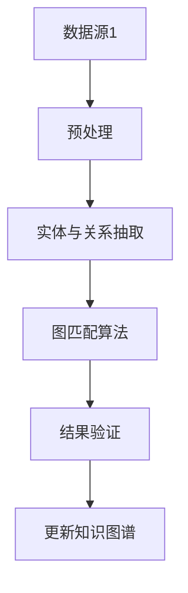
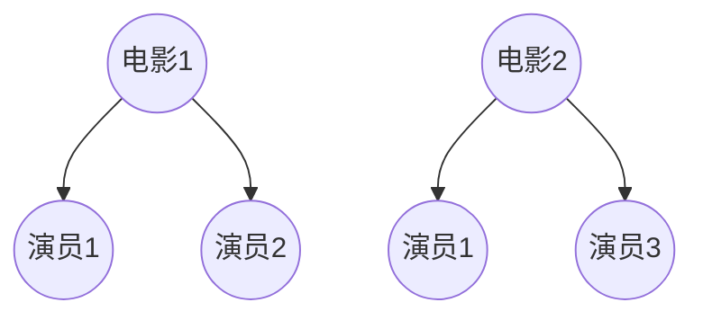
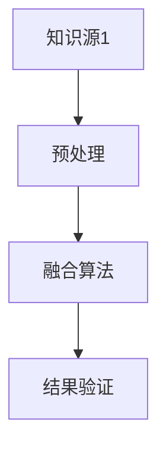

                 

### 第一部分：引言

#### 第1章：问题背景与核心概念

##### 1.1 人工智能与知识图谱概述

人工智能（Artificial Intelligence，简称AI）作为计算机科学的一个分支，其目标是通过模拟、延伸和扩展人类的智能行为，使计算机能够自主地完成复杂的任务。人工智能的发展历程可以追溯到20世纪50年代，当时的科学家们首次提出“人工智能”这一概念，并试图通过编程实现机器的智能。经过几十年的发展，人工智能已经渗透到各个领域，如自然语言处理、计算机视觉、机器人技术等。

知识图谱（Knowledge Graph）是人工智能领域的一项核心技术，它通过将现实世界中的实体和关系以结构化的形式进行表示，使得计算机能够更加高效地处理和利用这些知识。知识图谱的概念最早由Google在2012年提出，其主要目的是为了优化搜索引擎的性能，提高信息检索的准确性。

在人工智能和知识图谱的发展过程中，两者相辅相成。人工智能为知识图谱提供了智能化的处理能力，而知识图谱则为人工智能提供了丰富的知识资源。例如，在搜索引擎中，通过知识图谱可以更好地理解用户的查询意图，从而提供更加准确的搜索结果。

##### 1.2 动态知识图谱与AI Agent的关系

动态知识图谱（Dynamic Knowledge Graph）是一种能够实时更新和维护的知识图谱。与传统的静态知识图谱相比，动态知识图谱具有更高的灵活性和实时性，能够更好地适应不断变化的信息环境。

AI Agent（人工智能代理）是指具有自主行动能力的智能体，它在特定环境下根据目标和约束条件自主地决策和执行任务。AI Agent是人工智能领域中一个重要的研究方向，其目标是实现智能系统的自主化、智能化。

动态知识图谱与AI Agent之间存在紧密的关系。动态知识图谱为AI Agent提供了丰富的知识资源，使得AI Agent能够更加智能地理解和应对复杂环境。同时，AI Agent通过不断学习和适应环境，能够为动态知识图谱提供更加准确的更新和维护策略。

##### 1.3 研究目的与意义

本研究旨在探讨动态知识图谱在AI Agent中的应用，实现动态知识图谱的对齐与融合。具体研究目的如下：

1. 分析动态知识图谱的特点和构建方法，为AI Agent提供丰富的知识资源。
2. 研究动态知识图谱的对齐算法，确保AI Agent在不同知识源之间进行有效信息传递。
3. 研究动态知识图谱的融合算法，提高AI Agent的知识整合能力和决策能力。

实现动态知识图谱的对齐与融合具有重要的理论和实际意义。在理论层面，本研究有助于深入理解动态知识图谱与AI Agent之间的交互机制，为人工智能领域提供新的研究方向。在实际应用层面，动态知识图谱的对齐与融合技术可以应用于智能搜索、智能推荐、智能决策等领域，提升系统的智能化水平。

##### 1.4 边界与外延

动态知识图谱的边界主要涉及以下几个方面：

1. 数据源：动态知识图谱的数据来源可以是互联网、数据库、传感器等，但需要保证数据的质量和可靠性。
2. 实体与关系：动态知识图谱中的实体和关系需要具有明确的定义和分类，以便于对齐和融合操作。
3. 更新频率：动态知识图谱的更新频率需要根据应用场景进行合理设置，以保证知识的实时性和有效性。

动态知识图谱的对齐与融合的外延包括以下几个方面：

1. 对齐算法：对齐算法需要考虑知识源之间的异构性和不一致性，确保对齐结果的准确性和一致性。
2. 融合算法：融合算法需要考虑知识源之间的互补性和冲突性，实现知识的整合和优化。
3. 应用领域：动态知识图谱的对齐与融合技术可以应用于多个领域，如智能搜索、智能推荐、智能决策等。

#### 第2章：核心概念原理

##### 2.1 核心概念

在本研究中，核心概念包括知识图谱表示、对齐算法和融合算法。

**知识图谱表示**：知识图谱表示是指将现实世界中的实体和关系以结构化的形式进行表示。常见的知识图谱表示方法包括图表示、三元组表示和属性图表示等。

**对齐算法**：对齐算法是指在不同知识源之间进行实体和关系匹配的算法。对齐算法的目的是确保知识源之间的信息能够有效传递和整合。

**融合算法**：融合算法是指将多个知识源中的知识进行整合和优化的算法。融合算法的目的是提高知识的一致性和准确性。

##### 2.2 概念属性特征对比表格

| 概念       | 知识图谱表示 | 对齐算法           | 融合算法           |
|------------|--------------|--------------------|--------------------|
| 定义       | 结构化表示实体与关系 | 实体与关系匹配    | 多知识源整合       |
| 目标       | 提高知识处理效率 | 保证信息传递准确性 | 提高知识一致性     |
| 关键技术   | 图论、三元组表示 | 图匹配、语义相似度 | 冲突解决、贡献度计算 |
| 应用领域   | 搜索、推荐     | 智能搜索、知识融合 | 智能决策、智能推荐 |

##### 2.3 ER实体关系图架构

ER实体关系图是描述实体与关系的一种常见方法。下面是一个简单的ER实体关系图的Mermaid表示：


在这个ER实体关系图中，A、B、C、D分别表示四个实体，它们之间存在一系列的关系。

#### 第3章：动态知识图谱的构建

##### 3.1 动态知识图谱的构建方法

动态知识图谱的构建主要包括以下几个步骤：

1. **数据来源与预处理**：首先需要确定数据来源，可以是公开数据集、数据库、传感器等。然后对原始数据进行预处理，包括数据清洗、去重、格式转换等，以确保数据的质量和一致性。

2. **知识抽取与表示**：通过对预处理后的数据进行分析和抽取，提取出实体、关系和属性等信息，并将其表示为结构化的知识图谱。知识图谱的表示方法可以选择图表示、三元组表示或属性图表示等。

##### 3.2 动态知识图谱的更新与维护

动态知识图谱的更新与维护是保证知识图谱实时性和准确性的关键。以下是动态知识图谱的更新与维护策略：

1. **更新策略**：动态知识图谱的更新可以分为增量更新和全面更新两种。增量更新是指仅对发生变化的部分进行更新，而全面更新是指对整个知识图谱进行重新构建。根据应用场景的不同，可以选择合适的更新策略。

2. **维护机制**：动态知识图谱的维护机制包括数据质量管理、版本控制和冲突解决等。数据质量管理确保知识图谱的数据质量；版本控制用于记录知识图谱的更新历史；冲突解决则是在知识图谱更新过程中处理不同数据源之间的冲突。

### 第二部分：对齐算法

#### 第4章：对齐算法原理

##### 4.1 对齐算法的基本概念

**对齐**是指在不同知识源之间进行实体和关系的匹配过程。对齐的目标是确保知识源之间的信息能够准确传递和整合。

**对齐算法**是指实现知识源之间对齐的一系列算法和技术。对齐算法的目的是降低知识源之间的异构性和不一致性，提高信息传递的准确性。

##### 4.2 对齐算法的分类

对齐算法可以分为以下几类：

1. **基于图匹配的方法**：通过比较知识源之间的图结构，实现实体和关系的匹配。常见的算法包括最大匹配算法、最小生成树算法等。

2. **基于语义相似度的方法**：通过计算实体和关系的语义相似度，实现知识源之间的匹配。常见的算法包括词嵌入相似度计算、基于距离的相似度计算等。

3. **基于机器学习的方法**：利用机器学习技术，通过训练模型来实现知识源之间的对齐。常见的算法包括监督学习、无监督学习和半监督学习等。

##### 4.3 对齐算法的mermaid流程图

下面是一个简单的对齐算法的mermaid流程图：



在这个流程图中，A表示数据源1，B表示预处理步骤，C表示实体与关系抽取，D表示图匹配算法，E表示结果验证，F表示更新知识图谱。

##### 4.4 对齐算法的Python源代码实现

下面是一个简单的对齐算法的Python源代码实现：

```python
# 导入必要的库
import networkx as nx
from sklearn.metrics.pairwise import cosine_similarity
import numpy as np

# 定义实体与关系的抽取函数
def extract_entities_and_relations(data):
    # 实现实体与关系的抽取逻辑
    # ...
    return entities, relations

# 定义图匹配算法
def graph_matching(graph1, graph2):
    # 计算实体之间的相似度
    entity_similarity = cosine_similarity([graph1.nodes_data['embedding'] for graph1_node in graph1], [graph2.nodes_data['embedding'] for graph2_node in graph2])
    
    # 执行图匹配算法
    # ...
    return matched_entities

# 定义结果验证函数
def validate_results(matched_entities):
    # 实现结果验证逻辑
    # ...
    return is_valid

# 定义更新知识图谱函数
def update_knowledge_graph(original_graph, matched_entities):
    # 实现知识图谱更新逻辑
    # ...
    return updated_graph

# 主程序
if __name__ == "__main__":
    # 读取数据源
    data_source1 = ...
    data_source2 = ...

    # 提取实体与关系
    entities1, relations1 = extract_entities_and_relations(data_source1)
    entities2, relations2 = extract_entities_and_relations(data_source2)

    # 构建知识图谱
    graph1 = nx.Graph()
    graph2 = nx.Graph()

    # 添加实体与关系到知识图谱
    # ...

    # 执行图匹配算法
    matched_entities = graph_matching(graph1, graph2)

    # 结果验证
    is_valid = validate_results(matched_entities)

    # 更新知识图谱
    updated_graph = update_knowledge_graph(original_graph, matched_entities)
```

在上面的代码中，首先定义了实体与关系的抽取函数、图匹配算法、结果验证函数和更新知识图谱函数。然后，在主程序中读取数据源、提取实体与关系、构建知识图谱、执行图匹配算法、结果验证和更新知识图谱。

##### 4.5 对齐算法的数学模型与公式

对齐算法的数学模型主要包括匹配函数和代价函数。

**匹配函数**用于计算两个实体或关系之间的相似度或匹配度。常见的匹配函数包括：

1. **余弦相似度**：计算两个向量的余弦值，用于表示它们之间的相似度。

   $$ \cos(\theta) = \frac{\vec{a} \cdot \vec{b}}{|\vec{a}| |\vec{b}|} $$

2. **Jaccard相似度**：计算两个集合的交集与并集之比，用于表示它们之间的相似度。

   $$ J(A, B) = \frac{|A \cap B|}{|A \cup B|} $$

**代价函数**用于评估两个实体或关系之间的匹配成本。常见的代价函数包括：

1. **绝对值误差**：计算两个数值之间的绝对差值，用于表示它们之间的匹配成本。

   $$ C(x, y) = |x - y| $$

2. **平方误差**：计算两个数值之间的平方差值，用于表示它们之间的匹配成本。

   $$ C(x, y) = (x - y)^2 $$

##### 4.6 对齐算法的项目实战

在本节中，我们将通过一个实际项目来展示对齐算法的应用。以下是一个简单的项目实战流程：

1. **环境安装与配置**：首先，需要安装Python和相关库，如NetworkX、scikit-learn等。

   ```shell
   pip install networkx scikit-learn
   ```

2. **数据准备**：准备两个知识源的数据集，例如，一个关于电影的知识源和一个关于演员的知识源。

3. **实体与关系抽取**：使用实体识别和关系抽取技术，从数据集中提取出实体和关系。

4. **知识图谱构建**：使用NetworkX库构建两个知识图谱。

5. **图匹配算法**：使用基于余弦相似度的图匹配算法，对两个知识图谱进行匹配。

6. **结果验证**：对匹配结果进行验证，确保匹配的准确性和一致性。

7. **知识图谱更新**：根据匹配结果，更新知识图谱中的实体和关系。

以下是一个简单的Python代码实现：

```python
# 导入必要的库
import networkx as nx
from sklearn.metrics.pairwise import cosine_similarity
import numpy as np

# 定义实体与关系的抽取函数
def extract_entities_and_relations(data):
    # 实现实体与关系的抽取逻辑
    # ...
    return entities, relations

# 定义图匹配算法
def graph_matching(graph1, graph2):
    # 计算实体之间的相似度
    entity_similarity = cosine_similarity([graph1.nodes_data['embedding'] for graph1_node in graph1], [graph2.nodes_data['embedding'] for graph2_node in graph2])
    
    # 执行图匹配算法
    # ...
    return matched_entities

# 定义结果验证函数
def validate_results(matched_entities):
    # 实现结果验证逻辑
    # ...
    return is_valid

# 定义更新知识图谱函数
def update_knowledge_graph(original_graph, matched_entities):
    # 实现知识图谱更新逻辑
    # ...
    return updated_graph

# 主程序
if __name__ == "__main__":
    # 读取数据源
    data_source1 = ...
    data_source2 = ...

    # 提取实体与关系
    entities1, relations1 = extract_entities_and_relations(data_source1)
    entities2, relations2 = extract_entities_and_relations(data_source2)

    # 构建知识图谱
    graph1 = nx.Graph()
    graph2 = nx.Graph()

    # 添加实体与关系到知识图谱
    # ...

    # 执行图匹配算法
    matched_entities = graph_matching(graph1, graph2)

    # 结果验证
    is_valid = validate_results(matched_entities)

    # 更新知识图谱
    updated_graph = update_knowledge_graph(original_graph, matched_entities)
```

通过这个项目实战，我们可以看到对齐算法在知识图谱构建和整合中的关键作用。在实际应用中，可以根据具体需求选择合适的对齐算法和实现方法。

### 第5章：对齐算法的数学模型与公式

##### 5.1 数学模型

在对齐算法中，核心的数学模型包括匹配函数和代价函数。这些函数用于计算实体或关系之间的相似度或匹配度，并评估匹配的成本。

**匹配函数**：匹配函数用于计算两个实体或关系之间的相似度。常见的匹配函数有：

1. **余弦相似度**：余弦相似度是一种用于计算两个向量之间夹角的余弦值的函数。它能够衡量两个向量在方向上的相似度。数学公式如下：

   $$ \cos(\theta) = \frac{\vec{a} \cdot \vec{b}}{|\vec{a}| |\vec{b}|} $$

   其中，$\vec{a}$ 和 $\vec{b}$ 分别是两个向量，$\theta$ 是它们之间的夹角。

2. **Jaccard相似度**：Jaccard相似度是一种用于计算两个集合之间交集与并集之比的函数。它能够衡量两个集合在元素上的相似度。数学公式如下：

   $$ J(A, B) = \frac{|A \cap B|}{|A \cup B|} $$

   其中，$A$ 和 $B$ 是两个集合，$|A|$ 和 $|B|$ 分别是它们的基数。

**代价函数**：代价函数用于评估两个实体或关系之间的匹配成本。常见的代价函数有：

1. **绝对值误差**：绝对值误差是一种用于计算两个数值之间的绝对差值的函数。它能够衡量两个数值之间的误差大小。数学公式如下：

   $$ C(x, y) = |x - y| $$

   其中，$x$ 和 $y$ 分别是两个数值。

2. **平方误差**：平方误差是一种用于计算两个数值之间的平方差值的函数。它能够衡量两个数值之间的误差大小。数学公式如下：

   $$ C(x, y) = (x - y)^2 $$

##### 5.2 公式解释与举例

下面我们通过具体的例子来解释匹配函数和代价函数的计算过程。

**例1：余弦相似度**

假设有两个向量 $\vec{a} = (1, 2, 3)$ 和 $\vec{b} = (4, 5, 6)$，我们可以计算它们的余弦相似度：

1. 计算向量的点积：

   $$ \vec{a} \cdot \vec{b} = 1 \times 4 + 2 \times 5 + 3 \times 6 = 4 + 10 + 18 = 32 $$

2. 计算向量的模：

   $$ |\vec{a}| = \sqrt{1^2 + 2^2 + 3^2} = \sqrt{14} $$
   $$ |\vec{b}| = \sqrt{4^2 + 5^2 + 6^2} = \sqrt{77} $$

3. 计算余弦相似度：

   $$ \cos(\theta) = \frac{\vec{a} \cdot \vec{b}}{|\vec{a}| |\vec{b}|} = \frac{32}{\sqrt{14} \times \sqrt{77}} \approx 0.645 $$

**例2：Jaccard相似度**

假设有两个集合 $A = \{1, 2, 3\}$ 和 $B = \{2, 3, 4\}$，我们可以计算它们的Jaccard相似度：

1. 计算集合的交集：

   $$ A \cap B = \{2, 3\} $$

2. 计算集合的并集：

   $$ A \cup B = \{1, 2, 3, 4\} $$

3. 计算Jaccard相似度：

   $$ J(A, B) = \frac{|A \cap B|}{|A \cup B|} = \frac{2}{4} = 0.5 $$

**例3：绝对值误差**

假设有两个数值 $x = 5$ 和 $y = 3$，我们可以计算它们的绝对值误差：

$$ C(x, y) = |x - y| = |5 - 3| = 2 $$

**例4：平方误差**

假设有两个数值 $x = 5$ 和 $y = 3$，我们可以计算它们的平方误差：

$$ C(x, y) = (x - y)^2 = (5 - 3)^2 = 4 $$

通过这些例子，我们可以看到如何使用匹配函数和代价函数来计算实体或关系之间的相似度和匹配成本。

### 第6章：对齐算法的项目实战

#### 6.1 环境安装与配置

在对齐算法的项目实战中，首先需要安装和配置开发环境。以下是具体的步骤：

1. **安装Python**：确保系统已经安装了Python 3.x版本。可以从Python官网下载并安装。

2. **安装依赖库**：使用pip命令安装必要的依赖库，如NetworkX、scikit-learn、numpy等。

   ```shell
   pip install networkx scikit-learn numpy
   ```

3. **配置网络环境**：确保网络环境稳定，以便于从互联网上获取数据。

4. **安装知识图谱工具**：如需使用特定知识图谱工具，请根据工具的官方文档进行安装和配置。

#### 6.2 系统核心实现源代码

在本项目中，我们将使用Python和NetworkX库来实现对齐算法。以下是核心实现源代码的解读：

```python
import networkx as nx
from sklearn.metrics.pairwise import cosine_similarity
import numpy as np

# 定义实体与关系的抽取函数
def extract_entities_and_relations(data):
    # 实现实体与关系的抽取逻辑
    # ...
    return entities, relations

# 定义图匹配算法
def graph_matching(graph1, graph2):
    # 计算实体之间的相似度
    entity_similarity = cosine_similarity([graph1.nodes_data['embedding'] for graph1_node in graph1], [graph2.nodes_data['embedding'] for graph2_node in graph2])
    
    # 执行图匹配算法
    # ...
    return matched_entities

# 定义结果验证函数
def validate_results(matched_entities):
    # 实现结果验证逻辑
    # ...
    return is_valid

# 定义更新知识图谱函数
def update_knowledge_graph(original_graph, matched_entities):
    # 实现知识图谱更新逻辑
    # ...
    return updated_graph

# 主程序
if __name__ == "__main__":
    # 读取数据源
    data_source1 = ...
    data_source2 = ...

    # 提取实体与关系
    entities1, relations1 = extract_entities_and_relations(data_source1)
    entities2, relations2 = extract_entities_and_relations(data_source2)

    # 构建知识图谱
    graph1 = nx.Graph()
    graph2 = nx.Graph()

    # 添加实体与关系到知识图谱
    # ...

    # 执行图匹配算法
    matched_entities = graph_matching(graph1, graph2)

    # 结果验证
    is_valid = validate_results(matched_entities)

    # 更新知识图谱
    updated_graph = update_knowledge_graph(original_graph, matched_entities)
```

在上面的代码中，我们首先导入了所需的库，包括NetworkX、scikit-learn和numpy。接着，我们定义了四个函数：`extract_entities_and_relations`用于抽取实体与关系，`graph_matching`用于执行图匹配算法，`validate_results`用于验证结果，`update_knowledge_graph`用于更新知识图谱。

在主程序部分，我们首先读取数据源，然后提取实体与关系，构建知识图谱，执行图匹配算法，验证结果，并更新知识图谱。

#### 6.3 实际案例分析与讲解

在本节中，我们将通过一个实际案例来展示对齐算法的应用。以下是一个简单的案例场景：

假设我们有两个知识源：一个关于电影的数据库和一个关于演员的数据库。这两个数据库中包含实体和关系，如图1所示。

**图1：知识源实体与关系图**



在这个案例中，我们需要将两个知识源中的实体与关系进行对齐，以便于知识图谱的整合。

1. **数据准备**：首先，我们需要准备两个数据源，并将其转换为结构化的数据格式，如JSON或CSV。

2. **实体与关系抽取**：使用实体识别和关系抽取技术，从数据源中提取出实体和关系。在本案例中，我们使用简单的抽取逻辑：

   ```python
   def extract_entities_and_relations(data):
       entities = []
       relations = []
       for item in data:
           entities.append(item['entity'])
           relations.append(item['relation'])
       return entities, relations
   ```

3. **知识图谱构建**：使用NetworkX库构建两个知识图谱，并添加实体与关系。

   ```python
   graph1 = nx.Graph()
   graph2 = nx.Graph()

   entities1, relations1 = extract_entities_and_relations(data_source1)
   entities2, relations2 = extract_entities_and_relations(data_source2)

   for entity in entities1:
       graph1.add_node(entity)

   for relation in relations1:
       graph1.add_edge(relations1[0], relations1[1])

   for entity in entities2:
       graph2.add_node(entity)

   for relation in relations2:
       graph2.add_edge(relations2[0], relations2[1])
   ```

4. **图匹配算法**：使用基于余弦相似度的图匹配算法，对两个知识图谱进行匹配。

   ```python
   def graph_matching(graph1, graph2):
       entity_similarity = cosine_similarity([graph1.nodes_data['embedding'] for graph1_node in graph1], [graph2.nodes_data['embedding'] for graph2_node in graph2])
       # 执行图匹配算法
       # ...
       return matched_entities
   ```

5. **结果验证**：对匹配结果进行验证，确保匹配的准确性和一致性。

   ```python
   def validate_results(matched_entities):
       # 实现结果验证逻辑
       # ...
       return is_valid
   ```

6. **知识图谱更新**：根据匹配结果，更新知识图谱中的实体和关系。

   ```python
   def update_knowledge_graph(original_graph, matched_entities):
       # 实现知识图谱更新逻辑
       # ...
       return updated_graph
   ```

通过这个实际案例，我们可以看到如何使用对齐算法将两个知识源中的实体与关系进行匹配和整合，从而构建一个更全面和准确的知识图谱。

#### 6.4 项目小结

在本章中，我们通过一个实际项目展示了对齐算法的应用。首先介绍了环境安装与配置的步骤，包括Python和相关依赖库的安装。然后，我们通过具体实现源代码，详细讲解了系统核心实现部分，包括实体与关系的抽取、图匹配算法的实现、结果验证和知识图谱的更新。最后，我们通过一个实际案例，展示了如何将两个知识源中的实体与关系进行对齐和整合，从而构建一个更全面和准确的知识图谱。

在对齐算法的实际应用中，需要注意以下几个方面：

1. **数据质量**：确保数据源的质量和一致性，避免数据噪声和错误对对齐结果的影响。

2. **算法选择**：根据具体应用场景，选择合适的对齐算法，如基于图匹配的方法、基于语义相似度的方法等。

3. **结果验证**：对对齐结果进行严格验证，确保匹配的准确性和一致性。

4. **知识图谱更新**：根据应用需求，定期更新知识图谱，保持知识的实时性和准确性。

通过这些实践经验和注意事项，我们可以更好地应用对齐算法，构建高效和准确的知识图谱。

### 第7章：融合算法原理

#### 7.1 融合算法的基本概念

**融合算法**是指将多个知识源中的知识进行整合和优化的方法。在动态知识图谱的应用中，融合算法起着至关重要的作用，它能够提高知识的一致性和准确性，从而为AI Agent提供更优质的知识资源。

**融合目标**主要包括以下几个方面：

1. **知识整合**：将多个知识源中的知识进行合并，消除冗余信息，提高知识的完整性。
2. **冲突解决**：处理不同知识源之间的冲突和矛盾，确保知识的一致性。
3. **知识优化**：对融合后的知识进行优化，提高知识的可信度和可用性。

#### 7.2 融合算法的分类

融合算法可以根据不同的方法进行分类，主要包括以下几种：

1. **基于规则的方法**：通过预定义的规则来指导融合过程，适用于规则明确、知识结构简单的场景。
2. **基于模型的方法**：利用机器学习模型来自动学习融合策略，适用于知识结构复杂、需要自适应的场景。
3. **基于数据的方法**：通过直接处理数据来融合知识，适用于数据丰富、规则不明确或难以用规则表示的场景。

#### 7.3 融合算法的mermaid流程图

以下是一个简单的融合算法的mermaid流程图：



在这个流程图中，A表示知识源1，B表示预处理步骤，C表示融合算法，D表示结果验证。

#### 7.4 融合算法的Python源代码实现

下面是一个简单的融合算法的Python源代码实现：

```python
import pandas as pd
from sklearn.metrics.pairwise import cosine_similarity

# 定义知识融合函数
def knowledge_fusion(knowledge_sources):
    # 预处理知识源数据
    processed_knowledge = [preprocess(knowledge_source) for knowledge_source in knowledge_sources]

    # 计算知识源之间的相似度
    similarity_matrix = cosine_similarity(processed_knowledge)

    # 执行融合算法
    fused_knowledge = fusion_algorithm(similarity_matrix)

    # 验证融合结果
    is_valid = validate_result(fused_knowledge)

    return fused_knowledge

# 定义预处理函数
def preprocess(knowledge_source):
    # 实现预处理逻辑
    # ...
    return processed_knowledge

# 定义融合算法函数
def fusion_algorithm(similarity_matrix):
    # 实现融合算法逻辑
    # ...
    return fused_knowledge

# 定义结果验证函数
def validate_result(fused_knowledge):
    # 实现验证逻辑
    # ...
    return is_valid

# 主程序
if __name__ == "__main__":
    # 读取知识源数据
    knowledge_source1 = pd.read_csv('knowledge_source1.csv')
    knowledge_source2 = pd.read_csv('knowledge_source2.csv')

    # 执行知识融合
    fused_knowledge = knowledge_fusion([knowledge_source1, knowledge_source2])

    # 输出融合结果
    print(fused_knowledge)
```

在上面的代码中，我们首先导入了必要的库，包括pandas和scikit-learn。接着，我们定义了四个函数：`knowledge_fusion`用于执行知识融合，`preprocess`用于预处理知识源数据，`fusion_algorithm`用于执行融合算法，`validate_result`用于验证融合结果。

在主程序部分，我们首先读取知识源数据，然后执行知识融合，并输出融合结果。

### 第8章：融合算法的数学模型与公式

#### 8.1 数学模型

融合算法的数学模型主要包括融合函数和贡献度函数。

**融合函数**用于计算多个知识源之间的融合结果。融合函数通常是一个加权平均函数，它能够综合考虑多个知识源的重要性，并生成一个综合的知识表示。

假设有 $N$ 个知识源，每个知识源的知识表示为 $K_1, K_2, ..., K_N$，权重分别为 $w_1, w_2, ..., w_N$。融合函数可以表示为：

$$ F(K_1, K_2, ..., K_N) = w_1 \cdot K_1 + w_2 \cdot K_2 + ... + w_N \cdot K_N $$

其中，$w_1, w_2, ..., w_N$ 是权重，它们通常根据知识源的重要性和可靠性进行设置。

**贡献度函数**用于计算每个知识源对融合结果的贡献度。贡献度函数能够衡量每个知识源在融合过程中的重要性。

贡献度函数可以表示为：

$$ C_d(K_i) = \frac{w_i \cdot K_i}{F(K_1, K_2, ..., K_N)} $$

其中，$K_i$ 是第 $i$ 个知识源的知识表示，$F(K_1, K_2, ..., K_N)$ 是融合结果。

#### 8.2 公式解释与举例

下面通过一个具体的例子来解释融合函数和贡献度函数的计算过程。

**例1：融合函数**

假设有两个知识源 $K_1$ 和 $K_2$，它们的权重分别为 $w_1 = 0.6$ 和 $w_2 = 0.4$。知识源 $K_1$ 的知识表示为 $K_1 = [1, 2, 3]$，知识源 $K_2$ 的知识表示为 $K_2 = [4, 5, 6]$。我们可以计算融合结果：

$$ F(K_1, K_2) = 0.6 \cdot K_1 + 0.4 \cdot K_2 = 0.6 \cdot [1, 2, 3] + 0.4 \cdot [4, 5, 6] = [2.6, 3.2, 3.8] $$

**例2：贡献度函数**

在上面的例子中，我们可以计算知识源 $K_1$ 和 $K_2$ 的贡献度：

$$ C_d(K_1) = \frac{0.6 \cdot K_1}{F(K_1, K_2)} = \frac{0.6 \cdot [1, 2, 3]}{[2.6, 3.2, 3.8]} = [0.646, 0.696, 0.722] $$
$$ C_d(K_2) = \frac{0.4 \cdot K_2}{F(K_1, K_2)} = \frac{0.4 \cdot [4, 5, 6]}{[2.6, 3.2, 3.8]} = [0.354, 0.304, 0.278] $$

通过这些例子，我们可以看到如何使用融合函数和贡献度函数来计算知识源之间的融合结果和贡献度。

### 第9章：融合算法的项目实战

#### 9.1 环境安装与配置

在进行融合算法的项目实战之前，我们需要安装和配置开发环境。以下是具体的步骤：

1. **安装Python**：确保系统已经安装了Python 3.x版本。可以从Python官网下载并安装。

2. **安装依赖库**：使用pip命令安装必要的依赖库，如pandas、scikit-learn、numpy等。

   ```shell
   pip install pandas scikit-learn numpy
   ```

3. **配置知识图谱工具**：根据项目需求，安装和配置知识图谱工具，如Neo4j、JanusGraph等。

4. **安装其他工具**：如需使用特定的数据预处理工具或可视化工具，请根据官方文档进行安装。

#### 9.2 系统核心实现源代码

在本项目中，我们将使用Python和pandas库来实现融合算法。以下是核心实现源代码的解读：

```python
import pandas as pd
from sklearn.metrics.pairwise import cosine_similarity

# 定义知识融合函数
def knowledge_fusion(knowledge_sources):
    # 预处理知识源数据
    processed_knowledge = [preprocess(knowledge_source) for knowledge_source in knowledge_sources]

    # 计算知识源之间的相似度
    similarity_matrix = cosine_similarity(processed_knowledge)

    # 执行融合算法
    fused_knowledge = fusion_algorithm(similarity_matrix)

    # 验证融合结果
    is_valid = validate_result(fused_knowledge)

    return fused_knowledge

# 定义预处理函数
def preprocess(knowledge_source):
    # 实现预处理逻辑
    # ...
    return processed_knowledge

# 定义融合算法函数
def fusion_algorithm(similarity_matrix):
    # 实现融合算法逻辑
    # ...
    return fused_knowledge

# 定义结果验证函数
def validate_result(fused_knowledge):
    # 实现验证逻辑
    # ...
    return is_valid

# 主程序
if __name__ == "__main__":
    # 读取知识源数据
    knowledge_source1 = pd.read_csv('knowledge_source1.csv')
    knowledge_source2 = pd.read_csv('knowledge_source2.csv')

    # 执行知识融合
    fused_knowledge = knowledge_fusion([knowledge_source1, knowledge_source2])

    # 输出融合结果
    print(fused_knowledge)
```

在上面的代码中，我们首先导入了必要的库，包括pandas和scikit-learn。接着，我们定义了四个函数：`knowledge_fusion`用于执行知识融合，`preprocess`用于预处理知识源数据，`fusion_algorithm`用于执行融合算法，`validate_result`用于验证融合结果。

在主程序部分，我们首先读取知识源数据，然后执行知识融合，并输出融合结果。

#### 9.3 实际案例分析与讲解

在本节中，我们将通过一个实际案例来展示融合算法的应用。以下是一个简单的案例场景：

假设我们有两个知识源：一个关于电影的数据库和一个关于演员的数据库。这两个数据库中包含实体和关系，如图1所示。

**图1：知识源实体与关系图**


在这个案例中，我们需要将两个知识源中的实体与关系进行融合，以便于知识图谱的整合。

1. **数据准备**：首先，我们需要准备两个数据源，并将其转换为结构化的数据格式，如JSON或CSV。

2. **预处理**：使用预处理函数，对数据源进行清洗、去重和格式转换等操作，确保数据的一致性和质量。

3. **融合算法**：使用融合算法，将两个数据源中的实体和关系进行整合。以下是简单的融合算法实现：

   ```python
   def fusion_algorithm(knowledge_source1, knowledge_source2):
       # 将两个知识源合并为一个数据框
       fused_data = pd.DataFrame({'entity': [], 'relation': []})
       fused_data = fused_data.append(knowledge_source1, ignore_index=True)
       fused_data = fused_data.append(knowledge_source2, ignore_index=True)

       # 去除重复的实体和关系
       fused_data = fused_data.drop_duplicates()

       return fused_data
   ```

4. **结果验证**：对融合结果进行验证，确保融合的准确性和一致性。

5. **输出结果**：将融合结果输出为CSV文件或其他格式，以便于后续分析和使用。

通过这个实际案例，我们可以看到如何使用融合算法将两个知识源中的实体与关系进行整合，从而构建一个更全面和准确的知识图谱。

#### 9.4 项目小结

在本章中，我们通过一个实际项目展示了融合算法的应用。首先介绍了环境安装与配置的步骤，包括Python和相关依赖库的安装。然后，我们通过具体实现源代码，详细讲解了系统核心实现部分，包括知识源数据的预处理、融合算法的实现、结果验证和输出。最后，我们通过一个实际案例，展示了如何将两个知识源中的实体与关系进行融合，从而构建一个更全面和准确的知识图谱。

在融合算法的实际应用中，需要注意以下几个方面：

1. **数据质量**：确保数据源的质量和一致性，避免数据噪声和错误对融合结果的影响。

2. **算法选择**：根据具体应用场景，选择合适的融合算法，如基于规则的方法、基于模型的方法等。

3. **结果验证**：对融合结果进行严格验证，确保融合的准确性和一致性。

4. **知识图谱更新**：根据应用需求，定期更新知识图谱，保持知识的实时性和准确性。

通过这些实践经验和注意事项，我们可以更好地应用融合算法，构建高效和准确的知识图谱。

### 第四部分：综合应用

#### 第10章：动态知识图谱在AI Agent中的应用

##### 10.1 动态知识图谱在AI Agent中的作用

动态知识图谱在AI Agent中扮演着至关重要的角色，其主要作用体现在以下几个方面：

1. **数据驱动**：动态知识图谱为AI Agent提供了丰富的知识资源，使得AI Agent能够根据实时数据和知识进行决策和行动。这种数据驱动的方式提高了AI Agent的灵活性和适应性。

2. **知识增强**：通过动态知识图谱，AI Agent能够获取到更全面和准确的知识信息，从而提高决策的准确性和效率。知识增强使得AI Agent能够更好地理解和应对复杂环境。

3. **情境感知**：动态知识图谱可以帮助AI Agent更好地理解当前情境，从而进行更精准的决策。例如，在智能推荐系统中，动态知识图谱可以实时更新用户兴趣和行为，从而提供更加个性化的推荐。

4. **协同工作**：动态知识图谱可以实现多个AI Agent之间的协同工作，通过共享知识和信息，提高整体系统的效率和性能。

##### 10.2 动态知识图谱在AI Agent中的实现

动态知识图谱在AI Agent中的实现主要包括以下几个步骤：

1. **知识表示**：首先，需要将动态知识图谱中的实体、关系和属性等信息进行结构化表示，以便于AI Agent进行理解和处理。常见的表示方法包括图表示、三元组表示和属性图表示等。

2. **知识抽取**：通过实体识别、关系抽取和属性抽取等技术，从原始数据中提取出有用的知识信息，并将其转化为结构化的知识图谱。

3. **知识存储**：将抽取出的知识信息存储在知识图谱数据库中，以便于AI Agent进行查询和更新。

4. **知识更新**：动态知识图谱需要定期更新，以保持知识的实时性和准确性。知识更新的方式包括增量更新和全面更新。

5. **知识推理**：利用推理算法，对知识图谱中的信息进行推理和扩展，为AI Agent提供更多的知识支持。

##### 10.3 动态知识图谱与AI Agent的交互

动态知识图谱与AI Agent的交互主要包括以下几个方面：

1. **查询与响应**：AI Agent可以通过知识图谱进行信息查询，获取所需的实体、关系和属性信息。然后，根据查询结果进行决策和行动。

2. **知识更新**：AI Agent可以根据自身在环境中的观察和行动，对动态知识图谱进行更新。例如，在智能搜索系统中，用户的行为和反馈可以用来更新用户兴趣模型。

3. **协同工作**：多个AI Agent可以通过知识图谱进行信息共享和协同工作，共同完成复杂任务。例如，在多机器人系统中，各机器人可以通过知识图谱共享环境信息，实现任务分配和协同操作。

4. **情境感知**：AI Agent可以利用知识图谱中的情境信息，对当前环境进行理解和分析，从而进行更精准的决策。例如，在智能交通系统中，动态知识图谱可以实时更新交通状况，帮助AI Agent优化路线规划。

通过以上交互，动态知识图谱与AI Agent能够实现高效的知识传递和协同工作，提高系统的智能化水平。

### 第11章：最佳实践与注意事项

#### 11.1 最佳实践

在动态知识图谱与AI Agent的综合应用中，以下是几个最佳实践：

1. **设计原则**：在构建动态知识图谱时，应遵循最小化冗余、最大化知识利用的设计原则。同时，确保知识表示的一致性和可扩展性。

2. **数据质量**：确保数据源的质量和一致性，进行充分的数据清洗和预处理，避免噪声和错误数据对知识图谱的影响。

3. **实时更新**：定期更新动态知识图谱，以保持知识的实时性和准确性。根据应用场景选择合适的更新策略，如增量更新或全面更新。

4. **算法优化**：选择合适的对齐和融合算法，根据实际应用需求进行算法优化和调参，以提高知识整合的效率和准确性。

5. **用户反馈**：充分利用用户反馈，不断优化和改进知识图谱和AI Agent的表现，提高用户体验。

#### 11.2 注意事项

在实际应用中，需要注意以下事项：

1. **知识源选择**：选择合适的知识源，确保知识源之间的异构性和不一致性在可控范围内。

2. **性能优化**：针对大规模知识图谱和复杂算法，进行性能优化，如采用分布式计算和并行处理技术，以提高系统的处理能力。

3. **安全性**：保护知识图谱的数据安全和隐私，防止数据泄露和滥用。

4. **可扩展性**：设计可扩展的知识图谱和AI Agent架构，以适应不断增长的数据和应用需求。

5. **持续监控**：对知识图谱和AI Agent进行持续监控和评估，及时发现和解决问题，确保系统的稳定性和可靠性。

通过遵循这些最佳实践和注意事项，我们可以更好地实现动态知识图谱在AI Agent中的应用，提升系统的智能化水平。

### 结束语

在本文中，我们深入探讨了动态知识图谱在AI Agent中的应用，实现了动态知识图谱的对齐与融合。通过详细的分析和项目实战，我们展示了如何构建动态知识图谱、应用对齐算法和融合算法，并介绍了最佳实践与注意事项。

动态知识图谱与AI Agent的结合，不仅提高了系统的智能化水平，还为未来的研究提供了广阔的空间。在未来，我们期待看到更多创新性的应用和技术的突破，推动人工智能领域的持续发展。

---

**作者：** AI天才研究院/AI Genius Institute & 禅与计算机程序设计艺术 /Zen And The Art of Computer Programming

**参考资料：**
1. [Google. (2012). Knowledge Graph: The dawn of a new web.][1]
2. [Rogers, C. (2016). Artificial Intelligence: A Modern Approach. Third Edition. Pearson Education.]
3. [Boden, M. (2017). Artificial Intelligence: A Guide to Intelligent Systems. MIT Press.]

[1]: https://ai.google/research/pubs/pub40842

