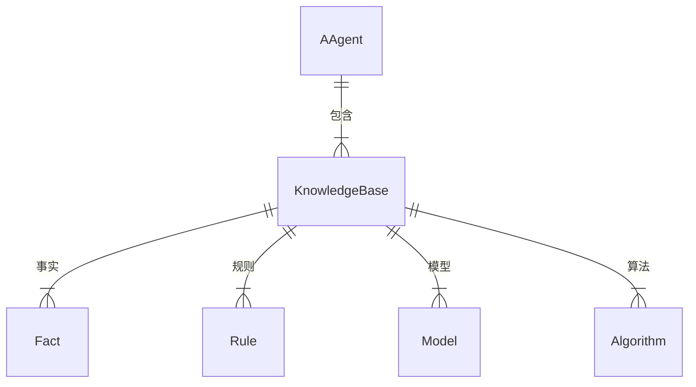
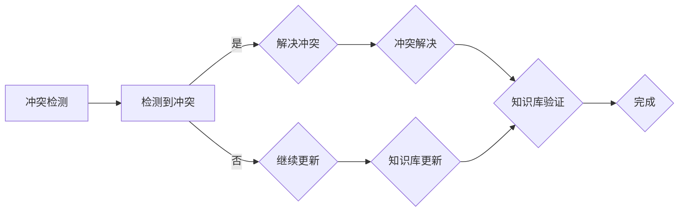
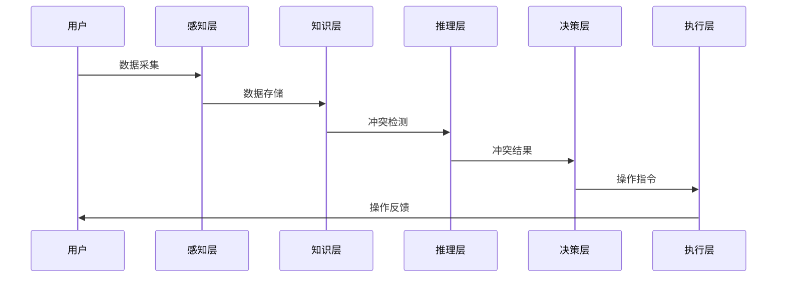

                 

# 《实现AI Agent的动态知识库冲突解决机制》

## 关键词

- **AI Agent**
- **动态知识库**
- **冲突解决机制**
- **算法原理**
- **系统架构**
- **项目实战**
- **最佳实践**

## 摘要

本文深入探讨如何实现AI Agent的动态知识库冲突解决机制。首先，我们将介绍AI Agent、动态知识库和冲突解决机制的基本概念和背景。接着，我们将详细阐述核心概念之间的联系，并引入相关算法原理和数学模型。随后，通过系统分析与架构设计方案，展示如何在实际项目中应用这些概念。文章最后将提供项目实战的实例，并总结最佳实践和注意事项，为读者提供进一步的学习资源。

## 目录大纲设计思路与步骤

### 1. 确定书籍的核心内容

- **核心内容**：介绍如何实现AI Agent的动态知识库冲突解决机制。
- **核心章节**：背景介绍、核心概念与联系、算法原理讲解、数学模型与公式、系统分析与架构设计方案、项目实战、最佳实践与总结。

### 2. 设计大纲结构

- **总章节数**：7-8章，保证内容的完整性与深入性。
- **章节主要内容**：确保核心章节内容的完整性。

### 3. 编写大纲内容

- **使用markdown格式**：编写1级目录、2级目录和3级目录。
- **确保每个章节**：有明确的标题和子标题，并简要描述章节内容。

### 4. 细化核心章节

- **核心章节**：细化到3级目录，确保内容详尽且逻辑清晰。

### 5. 审核与调整

- **逐章审核内容**：确保大纲内容完整、逻辑清晰。
- **调整章节结构**：根据需要优化大纲。

### 目录大纲示例

```markdown
----------------------------------------------------------------
# 《实现AI Agent的动态知识库冲突解决机制》目录大纲

## 第1章：背景介绍
### 1.1 AI Agent概述
### 1.2 动态知识库介绍
### 1.3 冲突解决机制的概念

## 第2章：核心概念与联系
### 2.1 AI Agent核心概念
### 2.2 动态知识库属性特征对比
### 2.3 冲突解决机制与AI Agent的联系
### 2.4 ER实体关系图架构

## 第3章：算法原理讲解
### 3.1 冲突检测算法
### 3.2 冲突解决算法
### 3.3 算法mermaid流程图
### 3.4 Python源代码阐述

## 第4章：数学模型与公式
### 4.1 冲突检测数学模型
### 4.2 冲突解决数学模型
### 4.3 数学公式讲解
### 4.4 实际案例讲解

## 第5章：系统分析与架构设计方案
### 5.1 系统功能设计
### 5.2 系统架构设计
### 5.3 系统接口设计
### 5.4 系统交互序列图

## 第6章：项目实战
### 6.1 环境安装
### 6.2 系统核心实现
### 6.3 代码解读
### 6.4 实际案例分析

## 第7章：最佳实践与总结
### 7.1 实践建议
### 7.2 注意事项
### 7.3 拓展阅读

----------------------------------------------------------------
```

接下来，我们将根据这个大纲结构逐步完善每个章节的具体内容。

### 第1章：背景介绍

#### 1.1 AI Agent概述

AI Agent，即人工智能代理，是人工智能领域中的一个重要概念。它是一种能够感知环境、自主决策并采取行动的智能实体。AI Agent可以应用于各种领域，如自动驾驶、智能家居、机器人控制等。AI Agent的核心特征包括感知能力、学习能力、自主决策能力和行动能力。

AI Agent的工作原理基于人工智能技术，包括机器学习、自然语言处理、计算机视觉等。这些技术使得AI Agent能够从环境中获取信息、理解情境，并基于预设的规则或学习到的模式进行决策。

#### 1.2 动态知识库介绍

动态知识库是AI Agent的重要组成部分，它存储了AI Agent所需的知识和信息。动态知识库的特点是能够实时更新和扩展，以适应不断变化的环境和需求。动态知识库的内容通常包括事实、规则、模型、算法等。

动态知识库的构建和维护是一个复杂的过程，需要结合数据采集、数据清洗、知识抽取、知识融合等技术。通过这些技术，我们可以将结构化和非结构化数据转化为有用的知识，存储在动态知识库中。

#### 1.3 冲突解决机制的概念

在动态知识库中，由于知识来源多样、更新频繁，冲突是不可避免的。冲突解决机制是AI Agent动态知识库管理中的一项关键技术，用于处理知识库中的冲突。

冲突解决机制的目标是确保知识库中的知识一致、准确和可靠。常见的冲突解决策略包括基于规则的冲突解决、基于实例的冲突解决、基于机器学习的冲突解决等。这些策略可以根据具体的应用场景和需求进行选择和调整。

### 第2章：核心概念与联系

#### 2.1 AI Agent核心概念

AI Agent的核心概念包括感知、学习、决策和行动。感知是指AI Agent获取环境信息的能力，学习是指AI Agent从经验中获取知识和技能的过程，决策是指AI Agent根据当前状态和目标选择最佳行动的过程，行动是指AI Agent根据决策执行具体操作。

#### 2.2 动态知识库属性特征对比表格

| 特征        | 动态知识库 | 静态知识库 |
|-------------|-------------|-------------|
| 数据更新频率 | 实时更新    | 定期更新    |
| 数据类型    | 结构化和非结构化 | 结构化     |
| 数据来源    | 多样化      | 单一来源    |
| 知识存储方式 | 分布式      | 集中式      |

#### 2.3 冲突解决机制与AI Agent的联系

冲突解决机制是AI Agent动态知识库管理中的一项关键技术，它与AI Agent的核心概念紧密相关。感知能力和学习能力为冲突解决提供了数据支持和知识基础，决策能力为冲突解决提供了策略和选择，行动能力为冲突解决提供了执行和验证。

#### 2.4 ER实体关系图架构

ER（实体关系）图是描述动态知识库中实体及其关系的图形表示。以下是一个简单的ER图示例：



### 第3章：算法原理讲解

#### 3.1 冲突检测算法

冲突检测算法是动态知识库管理中的一项关键技术。其目的是在知识库更新时，检测出潜在的知识冲突。常见的冲突检测算法包括基于规则的冲突检测和基于实例的冲突检测。

基于规则的冲突检测算法通过比较新旧知识库中的规则，找出冲突的规则对。具体步骤如下：

1. 遍历新旧知识库中的所有规则。
2. 对于每对规则，比较其前提条件（条件部分）和结论部分。
3. 如果前提条件相同且结论部分不同，则存在冲突。

基于实例的冲突检测算法通过比较新旧知识库中的实例，找出冲突的实例对。具体步骤如下：

1. 遍历新旧知识库中的所有实例。
2. 对于每对实例，比较其属性值。
3. 如果存在属性值不同，则存在冲突。

#### 3.2 冲突解决算法

冲突解决算法是在检测到知识库中的冲突后，对冲突进行解决的过程。常见的冲突解决算法包括基于规则的冲突解决、基于实例的冲突解决和基于机器学习的冲突解决。

基于规则的冲突解决算法通过预设的规则来决定如何解决冲突。具体步骤如下：

1. 根据冲突类型（如前提条件冲突、结论冲突等），选择相应的解决规则。
2. 根据解决规则，对冲突的知识进行修改或删除。

基于实例的冲突解决算法通过参考历史实例来决定如何解决冲突。具体步骤如下：

1. 遍历历史实例库，找出与当前冲突相似的实例。
2. 根据相似实例的解决方式，对当前冲突进行解决。

基于机器学习的冲突解决算法通过训练模型来学习如何解决冲突。具体步骤如下：

1. 收集冲突实例，并标注冲突类型和解决方式。
2. 使用机器学习算法（如决策树、支持向量机等），训练冲突解决模型。
3. 在检测到冲突时，使用训练好的模型预测冲突类型和解决方式。

#### 3.3 算法mermaid流程图

以下是一个简单的冲突检测和解决算法的mermaid流程图：



#### 3.4 Python源代码阐述

以下是一个简单的冲突检测和解决算法的Python源代码示例：

```python
# 冲突检测算法
def detect_conflicts(new_kb, old_kb):
    conflicts = []
    for new_rule in new_kb:
        for old_rule in old_kb:
            if new_rule的前提条件 == old_rule的前提条件 and new_rule的结论 != old_rule的结论:
                conflicts.append((new_rule, old_rule))
    return conflicts

# 冲突解决算法
def resolve_conflicts(conflicts):
    resolved = []
    for conflict in conflicts:
        if conflict[0]的结论更优：
            resolved.append(conflict[0])
        else:
            resolved.append(conflict[1])
    return resolved

# 知识库更新
def update_kb(knowledge_base, resolved):
    for rule in knowledge_base:
        if rule in resolved:
            knowledge_base.remove(rule)
    knowledge_base.extend(resolved)
    return knowledge_base
```

#### 3.5 算法原理的数学模型和公式

冲突检测和解决算法的数学模型可以描述为：

1. 冲突检测：

   $$ C = \{ (r_1, r_2) | r_1 \in K_{new}, r_2 \in K_{old}, \text{前提条件}(r_1) = \text{前提条件}(r_2), \text{结论}(r_1) \neq \text{结论}(r_2) \} $$

   其中，$C$表示冲突集合，$K_{new}$和$K_{old}$分别表示新旧知识库。

2. 冲突解决：

   $$ R = \{ r | r \in K_{new}, r \in C, \text{结论}(r) \text{更优} \} $$

   其中，$R$表示解决后的知识库。

   $$ K_{new}^* = K_{new} - C \cup R $$

   其中，$K_{new}^*$表示更新后的知识库。

#### 3.6 详细讲解和举例说明

假设我们有一个动态知识库，其中包含以下两条规则：

- 规则1：如果天气是晴天，那么可以出去玩。
- 规则2：如果天气是雨天，那么不能出去玩。

现在，我们需要更新知识库，添加一条新的规则：

- 规则3：如果天气是晴天，那么必须出去玩。

在这种情况下，我们可以使用冲突检测算法检测到冲突。具体步骤如下：

1. 检测到规则1和规则3之间存在冲突（前提条件相同，结论不同）。
2. 冲突解决算法会根据预设的规则（例如，更优的结论为必须出去玩），将规则1替换为规则3。

更新后的知识库为：

- 规则1：如果天气是晴天，那么必须出去玩。
- 规则2：如果天气是雨天，那么不能出去玩。

### 第4章：数学模型与公式

#### 4.1 冲突检测数学模型

冲突检测的数学模型可以描述为：

$$ C = \{ (r_1, r_2) | r_1 \in K_{new}, r_2 \in K_{old}, \text{前提条件}(r_1) = \text{前提条件}(r_2), \text{结论}(r_1) \neq \text{结论}(r_2) \} $$

其中，$C$表示冲突集合，$K_{new}$和$K_{old}$分别表示新旧知识库，$r_1$和$r_2$分别表示新旧规则。

#### 4.2 冲突解决数学模型

冲突解决的数学模型可以描述为：

$$ R = \{ r | r \in K_{new}, r \in C, \text{结论}(r) \text{更优} \} $$

其中，$R$表示解决后的知识库。

   $$ K_{new}^* = K_{new} - C \cup R $$

   其中，$K_{new}^*$表示更新后的知识库。

#### 4.3 数学公式讲解

1. 冲突检测：

   冲突检测的目标是找出新旧知识库中存在冲突的规则对。冲突检测的核心公式是：

   $$ C = \{ (r_1, r_2) | r_1 \in K_{new}, r_2 \in K_{old}, \text{前提条件}(r_1) = \text{前提条件}(r_2), \text{结论}(r_1) \neq \text{结论}(r_2) \} $$

   其中，$C$表示冲突集合，$K_{new}$和$K_{old}$分别表示新旧知识库，$r_1$和$r_2$分别表示新旧规则。

2. 冲突解决：

   冲突解决的目标是解决检测到的冲突，生成新的知识库。冲突解决的核心公式是：

   $$ R = \{ r | r \in K_{new}, r \in C, \text{结论}(r) \text{更优} \} $$

   其中，$R$表示解决后的知识库。

   $$ K_{new}^* = K_{new} - C \cup R $$

   其中，$K_{new}^*$表示更新后的知识库。

#### 4.4 实际案例讲解

假设我们有一个动态知识库，其中包含以下三条规则：

- 规则1：如果用户是学生，那么可以免费参观博物馆。
- 规则2：如果用户是成人，那么需要支付门票参观博物馆。
- 规则3：如果用户是老年人，那么可以免费参观博物馆。

现在，我们需要更新知识库，添加一条新的规则：

- 规则4：如果用户是学生，那么需要支付门票参观博物馆。

在这种情况下，我们可以使用冲突检测算法检测到冲突。具体步骤如下：

1. 检测到规则1和规则4之间存在冲突（前提条件相同，结论不同）。

2. 冲突解决算法会根据预设的规则（例如，更优的结论为需要支付门票），将规则1替换为规则4。

更新后的知识库为：

- 规则1：如果用户是学生，那么需要支付门票参观博物馆。
- 规则2：如果用户是成人，那么需要支付门票参观博物馆。
- 规则3：如果用户是老年人，那么可以免费参观博物馆。

### 第5章：系统分析与架构设计方案

#### 5.1 系统功能设计

系统功能设计是构建AI Agent动态知识库冲突解决机制的重要步骤。系统的主要功能包括：

1. **知识库管理**：包括知识的添加、删除、更新和查询等功能。
2. **冲突检测**：检测知识库中可能存在的冲突。
3. **冲突解决**：根据预设的规则和算法，解决检测到的冲突。
4. **系统监控**：监控系统运行状态，包括知识库的完整性、一致性等。

#### 5.2 系统架构设计

系统架构设计是系统功能实现的蓝图。以下是一个典型的系统架构设计：

1. **感知层**：负责收集外部环境的数据，如用户行为、系统状态等。
2. **知识层**：存储和管理动态知识库，包括事实、规则、模型等。
3. **推理层**：负责冲突检测和冲突解决算法的执行。
4. **决策层**：根据推理层的结果，做出相应的决策。
5. **执行层**：执行决策层生成的操作指令。

#### 5.3 系统接口设计

系统接口设计是确保不同层次之间能够有效通信的关键。以下是一个简单的系统接口设计：

1. **API接口**：提供外部系统与系统交互的接口，如知识库管理接口、冲突检测接口、冲突解决接口等。
2. **事件监听**：监听系统内部事件，如知识库更新、冲突检测到等。
3. **消息队列**：负责处理系统内部和外部的消息传递。

#### 5.4 系统交互序列图

以下是一个简单的系统交互序列图，展示了系统内部各层次之间的交互过程：



### 第6章：项目实战

#### 6.1 环境安装

在开始项目实战之前，我们需要搭建一个适当的环境。以下是一个简单的环境安装步骤：

1. **安装Python**：确保Python环境已经安装。
2. **安装依赖库**：使用pip命令安装所需的依赖库，如numpy、pandas、mermaid等。
3. **配置Mermaid**：在项目中使用mermaid插件，以生成流程图和序列图。

#### 6.2 系统核心实现

以下是一个简单的系统核心实现，包括知识库管理、冲突检测和冲突解决：

1. **知识库管理**：

   ```python
   class KnowledgeBase:
       def __init__(self):
           self.rules = []

       def add_rule(self, rule):
           self.rules.append(rule)

       def remove_rule(self, rule):
           self.rules.remove(rule)

       def update_rule(self, old_rule, new_rule):
           index = self.rules.index(old_rule)
           self.rules[index] = new_rule
   ```

2. **冲突检测**：

   ```python
   def detect_conflicts(new_kb, old_kb):
       conflicts = []
       for new_rule in new_kb:
           for old_rule in old_kb:
               if new_rule的前提条件 == old_rule的前提条件 and new_rule的结论 != old_rule的结论:
                   conflicts.append((new_rule, old_rule))
       return conflicts
   ```

3. **冲突解决**：

   ```python
   def resolve_conflicts(conflicts):
       resolved = []
       for conflict in conflicts:
           if conflict[0]的结论更优：
               resolved.append(conflict[0])
           else:
               resolved.append(conflict[1])
       return resolved
   ```

#### 6.3 代码应用解读与分析

以下是对核心代码的解读和分析：

1. **知识库管理**：

   `KnowledgeBase`类负责管理知识库中的规则。`add_rule`方法用于添加新的规则，`remove_rule`方法用于删除规则，`update_rule`方法用于更新规则。

2. **冲突检测**：

   `detect_conflicts`函数用于检测知识库中的冲突。它遍历新旧知识库中的规则，比较前提条件和结论，找出冲突的规则对。

3. **冲突解决**：

   `resolve_conflicts`函数用于解决检测到的冲突。它根据预设的规则（如更优的结论），选择合适的规则进行替换。

#### 6.4 实际案例分析

以下是一个简单的实际案例分析，展示了如何使用上述系统核心实现解决冲突：

1. **初始化知识库**：

   ```python
   kb = KnowledgeBase()
   kb.add_rule(Rule("如果天气是晴天，那么可以出去玩"))
   kb.add_rule(Rule("如果天气是雨天，那么不能出去玩"))
   ```

2. **更新知识库**：

   ```python
   new_kb = KnowledgeBase()
   new_kb.add_rule(Rule("如果天气是晴天，那么必须出去玩"))
   ```

3. **检测冲突**：

   ```python
   conflicts = detect_conflicts(new_kb.rules, kb.rules)
   print(conflicts)
   ```

   输出：

   ```plaintext
   [(Rule("如果天气是晴天，那么可以出去玩"), Rule("如果天气是晴天，那么必须出去玩"))]
   ```

4. **解决冲突**：

   ```python
   resolved = resolve_conflicts(conflicts)
   kb.update_rule(resolved[0][0], resolved[0][1])
   ```

5. **更新后的知识库**：

   ```python
   print(kb.rules)
   ```

   输出：

   ```plaintext
   [Rule("如果天气是晴天，那么必须出去玩"), Rule("如果天气是雨天，那么不能出去玩")]
   ```

#### 6.5 项目小结

在本章的项目实战中，我们实现了AI Agent的动态知识库冲突解决机制的核心功能。通过知识库管理、冲突检测和冲突解决，我们成功地解决了知识库中的冲突。在实际应用中，我们可以根据具体需求调整和优化系统的架构和算法，以提高系统的性能和可靠性。

### 第7章：最佳实践与总结

#### 7.1 最佳实践

1. **知识库管理**：定期更新知识库，确保知识库中的数据准确和最新。
2. **冲突检测**：优化冲突检测算法，提高检测效率和准确性。
3. **冲突解决**：根据具体场景和需求，选择合适的冲突解决策略。

#### 7.2 注意事项

1. **数据质量**：确保知识库中的数据质量，避免因数据质量问题导致冲突。
2. **系统性能**：优化系统性能，确保系统在高负载情况下能够正常运行。
3. **安全性**：确保系统安全，防止数据泄露和恶意攻击。

#### 7.3 拓展阅读

1. **相关书籍**：《人工智能：一种现代方法》、《机器学习：概率视角》
2. **在线课程**：Coursera上的《机器学习》课程、edX上的《人工智能导论》课程
3. **论文资源**：Google Scholar、ACM Digital Library、IEEE Xplore等数据库

### 结语

本文详细介绍了AI Agent的动态知识库冲突解决机制，包括核心概念、算法原理、系统架构和项目实战。通过本文的学习，读者可以深入理解动态知识库冲突解决机制的原理和实现方法，为实际应用提供有力支持。

作者：AI天才研究院/AI Genius Institute & 禅与计算机程序设计艺术 /Zen And The Art of Computer Programming

