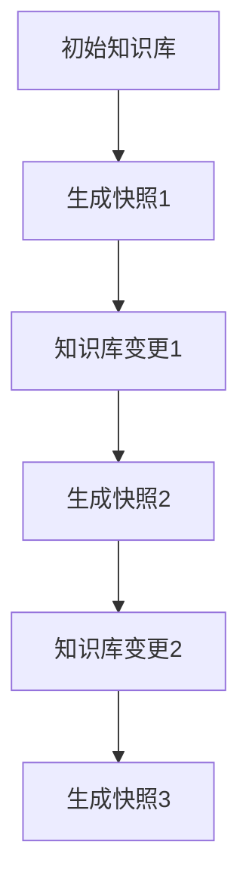
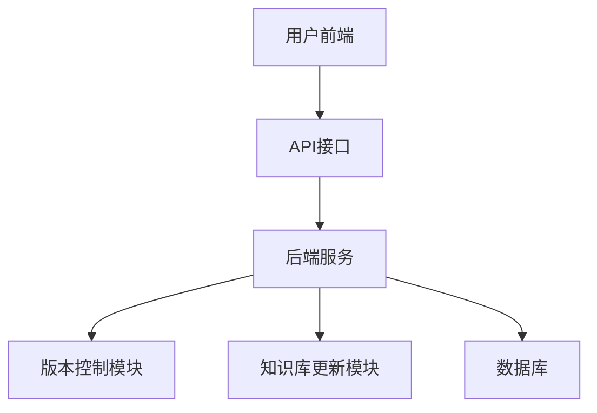

                 


## 实现AI Agent的动态知识库版本控制与回滚

关键词：AI Agent、知识库、版本控制、回滚、动态更新

摘要：本文将探讨在AI Agent中实现动态知识库版本控制与回滚的必要性和方法。通过分析相关核心概念、算法原理和系统架构，我们将展示如何构建一个强大的知识库管理机制，确保AI Agent在应对复杂环境和快速变化时仍能保持稳定和高效。

### 引言

随着人工智能技术的飞速发展，AI Agent的应用场景越来越广泛。这些智能体需要不断更新和扩展其知识库，以适应新的任务和挑战。然而，知识库的动态更新和版本控制成为了一个关键问题。如何确保知识库的准确性、一致性和可追溯性，是当前AI研究领域的一个重要课题。

本文旨在通过以下章节，系统地介绍AI Agent中动态知识库版本控制与回滚的实现方法：

1. **AI Agents与知识库简介**：介绍AI Agent的基本概念和知识库的重要性，以及版本控制和回滚在软件工程中的应用。
2. **AI Agents与知识库的基本概念**：阐述核心概念和术语，并对比不同知识表示方法的特性。
3. **动态知识库版本控制算法**：介绍常用的版本控制算法，并使用Mermaid流程图和Python代码进行详细讲解。
4. **实现版本控制与回滚机制**：讨论版本控制和回滚机制的具体实现，并展示系统架构设计。
5. **案例分析**：通过实际案例展示如何应用所介绍的技术。
6. **项目实战**：介绍一个具体的AI Agent知识库版本控制与回滚的实现案例。
7. **最佳实践与小结**：总结最佳实践，并提出注意事项和拓展阅读建议。

### AI Agents与知识库简介

AI Agent是指能够在特定环境中自主执行任务，并与其他智能体交互的软件实体。它们是人工智能技术的重要应用之一，广泛应用于自动驾驶、智能助手、金融分析等领域。

知识库是AI Agent的核心组件之一，它存储了智能体所需的知识、信息和规则。一个良好的知识库能够提高智能体的决策能力和适应性。然而，随着应用场景的变化和新的数据不断涌现，知识库需要不断更新和维护。

版本控制和回滚在软件工程中是非常重要的概念。版本控制可以追踪知识库的历史变化，确保每个版本的可追溯性和一致性。回滚机制则允许在知识库出现问题时，将系统恢复到先前的稳定状态。

在AI Agent中，动态知识库版本控制与回滚的实现，有助于确保智能体的知识库始终保持最新和最准确的状态。通过分析不同版本的变化历史，我们可以更好地理解知识库的发展过程，从而为后续的优化和改进提供依据。

### AI Agents与知识库的基本概念

为了深入理解AI Agent中的知识库版本控制与回滚，我们首先需要明确一些核心概念和术语。以下是AI Agents和知识库的一些基本概念：

1. **AI Agent**：AI Agent是指能够自主执行任务、感知环境并与其他智能体交互的软件实体。它们通常由感知模块、决策模块和动作模块组成。感知模块用于获取环境信息，决策模块根据当前状态选择最佳动作，动作模块执行选定的动作。

2. **知识库**：知识库是指存储AI Agent所需知识和信息的数据库。知识库通常包括事实、规则、模型和算法等。知识库的质量直接影响AI Agent的决策能力和适应性。

3. **版本控制**：版本控制是一种管理知识库历史变化的技术。通过版本控制，我们可以追踪知识库的每次变更，确保每个版本的可追溯性和一致性。

4. **回滚**：回滚是指在知识库出现问题时，将系统恢复到先前的稳定状态。回滚机制可以确保知识库在发生意外变化时，能够快速恢复到正常状态。

下面，我们将对比不同知识表示方法的特性，以帮助读者更好地理解AI Agent中的知识库。

#### 知识表示方法对比

知识表示方法是指将知识库中的知识和信息组织成可处理的形式。以下是几种常见的知识表示方法：

1. **基于规则的表示方法**：基于规则的表示方法使用一组规则来表示知识。这些规则通常采用“条件-动作”的形式，例如，“如果温度高于30摄氏度，则开启空调”。这种方法的优点是简单直观，但缺点是难以处理复杂和模糊的情况。

2. **基于框架的表示方法**：基于框架的表示方法使用框架来表示知识。框架由一组属性和值组成，例如，“学生”框架包含属性如姓名、年龄、班级等。这种方法的优点是能够处理复杂的关系和层次结构，但缺点是表示过程较为复杂。

3. **基于模型的表示方法**：基于模型的表示方法使用数学模型来表示知识。这种方法通常用于处理连续变量和复杂的关系，例如，使用决策树、神经网络等模型。这种方法的优点是能够处理复杂的决策问题，但缺点是模型训练和优化过程较为耗时。

下面是一个知识表示方法的对比表格：

| 知识表示方法 | 优点 | 缺点 | 适用场景 |
| ------------ | ---- | ---- | -------- |
| 基于规则的表示方法 | 简单直观 | 难以处理复杂和模糊的情况 | 结构化知识表示 |
| 基于框架的表示方法 | 能够处理复杂的关系和层次结构 | 表示过程较为复杂 | 复杂关系表示 |
| 基于模型的表示方法 | 能够处理复杂的决策问题 | 模型训练和优化过程耗时 | 复杂决策问题 |

#### ER图架构

为了更直观地理解知识库的结构，我们可以使用实体-关系（Entity-Relationship，ER）图来表示。ER图用于描述实体及其相互关系。

下面是一个知识库的ER图示例：

```mermaid
erDiagram
    Class1 ||--|{ Class2 : has a many-to-one relationship
    Class2 ||--|{ Class3 : another many-to-one relationship
    Class3 ||--|{ Class4 : a one-to-many relationship
```

在这个ER图中，Class1、Class2、Class3和Class4分别表示知识库中的不同实体，它们之间的关系通过箭头表示。这种表示方法有助于我们理解知识库的层次结构和关系，从而为版本控制和回滚机制提供支持。

### 动态知识库版本控制算法

为了实现AI Agent中动态知识库的版本控制，我们需要引入一系列算法。这些算法将帮助我们追踪知识库的变更历史，并提供回滚机制。在本节中，我们将介绍几种常用的版本控制算法，并使用Mermaid流程图和Python代码进行详细讲解。

#### 常见版本控制算法

以下是几种常见的版本控制算法：

1. **基于快照的版本控制**：基于快照的版本控制通过定期生成知识库的快照来记录变更历史。每个快照都是一个完整的知识库副本，可以用于恢复到任意一个历史版本。

2. **基于差分的版本控制**：基于差分的版本控制记录每次变更的差分信息，而不是完整的知识库副本。这种方法的优点是存储空间占用更小，但缺点是恢复特定版本时需要重新应用所有差分。

3. **基于版本树的版本控制**：基于版本树的版本控制使用树形结构来表示知识库的变更历史。每个版本节点代表一个知识库版本，节点之间的边表示版本之间的关系。这种方法的优点是易于实现和扩展，但缺点是恢复特定版本时可能需要遍历整个版本树。

4. **基于分支和合并的版本控制**：基于分支和合并的版本控制类似于Git等版本控制系统，允许在不同分支上独立开发知识库，并在合适的时候进行合并。这种方法的优点是支持并行开发，但缺点是合并过程可能复杂。

#### Mermaid流程图

为了更直观地展示版本控制算法的流程，我们可以使用Mermaid流程图。以下是一个基于快照的版本控制算法的Mermaid流程图示例：



在这个流程图中，初始知识库通过生成快照1记录下来。随后，知识库进行两次变更，并分别生成快照2和快照3。每次快照生成时，都会记录当前的知识库状态。

#### Python代码示例

为了更好地理解算法原理，我们使用Python代码来模拟一个简单的基于快照的版本控制算法。以下是一个简单的Python代码示例：

```python
class KnowledgeBase:
    def __init__(self):
        self.state = {}

    def update(self, key, value):
        self.state[key] = value
        print(f"更新：{key} = {value}")

    def get_state(self):
        return self.state

def take_snapshot(knowledge_base):
    return knowledge_base.get_state()

def main():
    kb = KnowledgeBase()

    # 初始知识库状态
    kb.update("name", "Alice")
    kb.update("age", 30)
    print(f"初始知识库状态：{kb.get_state()}")

    # 生成第一个快照
    snapshot1 = take_snapshot(kb)
    print(f"生成快照1：{snapshot1}")

    # 知识库变更1
    kb.update("name", "Bob")
    print(f"更新后知识库状态：{kb.get_state()}")

    # 生成第二个快照
    snapshot2 = take_snapshot(kb)
    print(f"生成快照2：{snapshot2}")

    # 回滚到快照1
    kb.state = snapshot1
    print(f"回滚到快照1后知识库状态：{kb.get_state()}")

if __name__ == "__main__":
    main()
```

在这个示例中，我们定义了一个KnowledgeBase类，用于表示知识库的状态。通过调用update方法，我们可以更新知识库的属性。take_snapshot函数用于生成快照，记录当前知识库的状态。main函数演示了如何使用这些功能，包括生成快照、更新知识库和回滚到特定版本。

### 实现版本控制与回滚机制

在了解了动态知识库版本控制算法的基本原理后，我们需要将其具体实现为AI Agent中的一个可操作的机制。本节将讨论如何实现版本控制和回滚机制，并提供一个系统架构设计。

#### 实现细节

为了实现版本控制和回滚机制，我们需要在AI Agent中引入以下组件：

1. **版本控制模块**：负责记录知识库的历史版本，包括每次变更的详细信息。
2. **回滚模块**：负责根据需要将知识库恢复到先前的稳定状态。
3. **知识库更新模块**：负责处理知识库的日常更新操作。

以下是实现这些模块的详细步骤：

1. **初始化版本控制模块**：在AI Agent启动时，初始化版本控制模块，并创建一个版本控制记录文件，用于存储历史版本信息。

2. **记录变更**：每当知识库发生变更时，版本控制模块需要记录以下信息：
    - 变更的时间戳
    - 变更的内容
    - 变更的用户信息（可选）

3. **生成快照**：定期或根据需要生成知识库的快照，并将快照存储到文件系统中。快照应包含知识库的完整状态，以便在需要时进行回滚。

4. **回滚操作**：当用户请求回滚时，回滚模块根据指定的版本号或时间戳，从版本控制记录文件中找到相应的快照，并将知识库恢复到该状态。

5. **处理知识库更新**：知识库更新模块负责处理日常的更新操作，包括新增、修改和删除知识库中的数据。每次更新后，版本控制模块需要记录相应的变更信息。

#### 系统架构设计

为了实现上述功能，我们需要设计一个合理的系统架构。以下是系统架构设计的详细步骤：

1. **项目介绍**：
    - 系统名称：AI Agent知识库版本控制与回滚系统
    - 目标：实现AI Agent中知识库的版本控制与回滚功能，确保知识库的稳定性和可追溯性。

2. **系统功能设计**：
    - 版本控制功能：记录知识库的历史版本，提供版本查询和回滚操作。
    - 知识库更新功能：处理知识库的日常更新操作，确保数据的一致性。
    - 用户界面：提供用户交互界面，便于用户操作版本控制和回滚功能。

3. **系统架构设计**：
    - **前端**：用户通过前端界面与系统进行交互，提交回滚请求或更新操作。
    - **后端**：后端处理用户请求，调用版本控制和知识库更新模块，实现相应的功能。
    - **数据库**：存储知识库的当前状态和历史版本信息。

以下是系统架构的Mermaid架构图示例：



在这个架构图中，用户前端通过API接口与后端服务进行通信。后端服务调用版本控制模块和知识库更新模块，实现相应的功能，并将数据存储到数据库中。

### 案例分析

在本节中，我们将通过一个实际案例，展示如何实现AI Agent中动态知识库的版本控制与回滚。我们将分步介绍案例背景、系统设计、核心实现和实际应用。

#### 案例背景

假设我们正在开发一个自动驾驶系统，该系统需要不断更新其知识库，以适应不同道路状况和交通场景。知识库中包含路况信息、交通规则、车辆性能参数等数据。由于自动驾驶系统需要高度可靠性和实时性，因此确保知识库的准确性和一致性至关重要。

#### 系统设计

为了实现知识库的版本控制与回滚，我们设计了以下系统架构：

1. **前端**：用户通过图形界面提交更新请求或回滚请求。
2. **后端**：后端服务处理用户请求，调用版本控制模块和知识库更新模块，实现相应的功能。
3. **版本控制模块**：记录知识库的历史版本，提供版本查询和回滚功能。
4. **知识库更新模块**：处理知识库的日常更新操作，确保数据的一致性。
5. **数据库**：存储知识库的当前状态和历史版本信息。

#### 核心实现

以下是核心实现步骤：

1. **初始化版本控制模块**：在系统启动时，初始化版本控制模块，并创建版本控制记录文件。

2. **记录变更**：每次知识库发生变更时，版本控制模块需要记录以下信息：
    - 变更的时间戳
    - 变更的内容
    - 变更的用户信息（可选）

3. **生成快照**：定期或根据需要生成知识库的快照，并将快照存储到文件系统中。快照应包含知识库的完整状态。

4. **回滚操作**：当用户请求回滚时，回滚模块根据指定的版本号或时间戳，从版本控制记录文件中找到相应的快照，并将知识库恢复到该状态。

5. **处理知识库更新**：知识库更新模块负责处理日常的更新操作，包括新增、修改和删除知识库中的数据。每次更新后，版本控制模块需要记录相应的变更信息。

#### 实际应用

以下是一个实际应用的示例：

1. **用户提交更新请求**：用户通过图形界面提交更新请求，包括更新内容、更新类型（新增、修改、删除）和优先级。

2. **后端处理更新请求**：后端服务接收到更新请求后，调用知识库更新模块，根据请求类型执行相应的更新操作。

3. **记录变更信息**：在更新操作完成后，版本控制模块记录变更信息，并生成快照。

4. **用户提交回滚请求**：当知识库出现问题时，用户可以通过图形界面提交回滚请求，指定回滚的版本号或时间戳。

5. **执行回滚操作**：回滚模块根据回滚请求，从版本控制记录文件中找到相应的快照，并将知识库恢复到指定状态。

#### 项目小结

通过本案例，我们展示了如何在自动驾驶系统中实现动态知识库的版本控制与回滚。该系统能够确保知识库的准确性和一致性，从而提高自动驾驶系统的可靠性和安全性。

### 最佳实践与小结

在本节的最佳实践中，我们将总结在实现AI Agent中动态知识库版本控制与回滚时的一些关键要点，并给出注意事项和拓展阅读建议。

#### 最佳实践

1. **版本控制策略**：根据知识库的重要性和更新频率，选择合适的版本控制策略。例如，对于频繁变动的知识库，可以使用基于快照的版本控制，确保每次变更都能被及时记录。

2. **自动化回滚机制**：在知识库更新过程中，自动化回滚机制可以帮助快速恢复到先前的稳定状态，减少人工干预。可以设置定时任务，定期检查知识库的状态，并在出现问题时自动回滚。

3. **版本控制日志**：确保版本控制模块记录详细的版本控制日志，包括变更时间、变更内容、变更用户等。这些日志对于后续的审计和故障排查非常有用。

4. **用户权限管理**：对于知识库的版本控制和回滚操作，应实施严格的用户权限管理。只有具有适当权限的用户才能执行这些操作，以防止未授权的变更。

5. **备份与恢复**：定期备份数据库中的知识库版本信息，并在必要时进行恢复。这样可以确保在系统故障或数据丢失时，能够快速恢复到正常状态。

#### 注意事项

1. **性能考虑**：在实现版本控制与回滚机制时，需要考虑系统的性能。过多的版本记录或复杂的回滚操作可能导致系统性能下降。应优化算法和数据库查询，确保系统的响应速度。

2. **数据一致性**：在多用户环境下，确保数据的一致性至关重要。可以采用分布式锁或事务机制，防止并发操作导致数据不一致。

3. **安全性**：知识库中的数据通常包含敏感信息。在实现版本控制和回滚机制时，确保数据的安全性。采用加密技术保护数据，防止数据泄露。

#### 拓展阅读

1. **版本控制工具**：了解并使用现有的版本控制工具，如Git、SVN等，以简化知识库的版本管理。

2. **分布式版本控制**：了解分布式版本控制系统的原理和实现，如Git，以支持大规模知识库的分布式版本控制。

3. **知识库管理系统**：研究现有的知识库管理系统，如Protege、Grappa等，以借鉴它们的实现方法和设计思路。

4. **算法优化**：学习关于版本控制算法的优化技术，如差分算法、版本树等，以提高版本控制的效率和性能。

### 作者信息

作者：AI天才研究院/AI Genius Institute & 禅与计算机程序设计艺术 /Zen And The Art of Computer Programming

本文介绍了实现AI Agent的动态知识库版本控制与回滚的关键技术和方法。通过分析核心概念、算法原理和系统架构，我们展示了如何构建一个强大的知识库管理机制，确保AI Agent在应对复杂环境和快速变化时仍能保持稳定和高效。读者可以结合本文内容，进一步学习和实践相关知识，为AI技术的发展贡献自己的力量。

