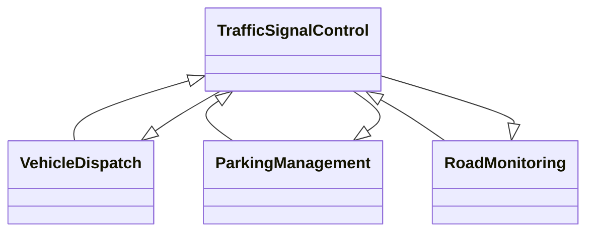
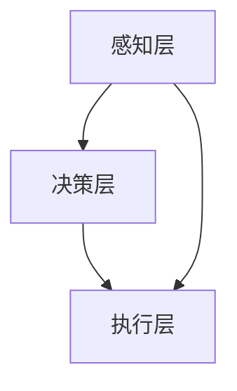
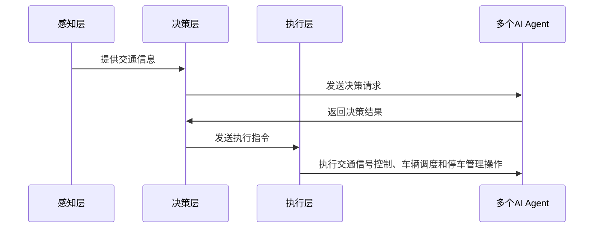

                 

# 实现AI Agent的多Agent协作能力

关键词：AI Agent、多Agent系统、协作能力、通信机制、协作策略

摘要：本文深入探讨了实现人工智能代理（AI Agent）的多Agent协作能力的关键问题。首先，介绍了AI Agent和多Agent系统的背景、问题、解决方法以及边界与外延。然后，详细分析了AI Agent的定义与特点，以及多Agent系统的定义与特点。接着，阐述了实现多Agent协作能力所需的通信机制、协作策略、知识共享与整合、自适应能力等相关核心概念。文章最后通过实际案例展示了多Agent系统在不同领域的应用，并提出了最佳实践和未来研究方向。

## 第一部分：背景介绍

### 1.1 问题背景

随着人工智能技术的迅猛发展，人工智能代理（AI Agent）和多Agent系统成为了研究和应用的热点。人工智能代理指的是能够自主决策并执行任务的智能实体，而多Agent系统则是由多个人工智能代理组成的协作系统。在现实世界中，许多复杂问题需要多个智能代理的协同工作才能有效解决，如智能交通系统、智能电网、多机器人系统等。

然而，实现AI Agent的多Agent协作能力并非易事。多Agent系统面临的主要挑战包括：

- **通信与协调**：多个AI Agent需要能够高效、准确地通信和协作，这涉及到通信机制的设计和协作策略的选择。
- **知识共享**：AI Agent需要能够共享和整合彼此的知识和经验，以提高整个系统的智能水平。
- **自主性与适应性**：AI Agent需要在确保自主性的同时，适应系统的动态变化和不确定性。
- **安全性与可靠性**：多Agent系统需要在复杂环境下保持稳定运行，避免出现恶意行为或意外故障。

### 1.2 问题描述

为实现AI Agent的多Agent协作能力，需要解决以下几个关键问题：

- **任务分配**：如何根据每个AI Agent的能力和偏好，合理地分配任务，以达到整体效率最大化？
- **通信机制**：如何设计高效、可靠的通信机制，确保AI Agent之间的信息传递？
- **协作策略**：如何选择合适的协作策略，使得AI Agent能够协同工作，共同完成任务？
- **知识共享与整合**：如何实现AI Agent之间的知识共享和整合，提高整个系统的智能水平？
- **自适应能力**：如何设计AI Agent，使其具备自适应环境变化的能力，保持系统的稳定性和高效性？

### 1.3 问题解决

本书将从多个角度探讨如何实现AI Agent的多Agent协作能力，包括：

- **理论基础**：介绍多Agent系统的基本概念、架构和协作模型。
- **通信机制**：探讨不同通信机制的设计和实现，如基于消息传递的通信、基于事件的通信等。
- **协作策略**：介绍常见的协作策略，如任务分配策略、协商策略、决策融合策略等。
- **知识共享与整合**：探讨知识共享机制、知识整合方法和知识表示技术。
- **自适应能力**：讨论AI Agent的自适应机制，如学习算法、适应性策略等。
- **应用实践**：通过实际案例，展示多Agent系统在不同领域的应用，分析其优势和挑战。

### 1.4 边界与外延

本书主要关注以下边界和范围：

- **技术范围**：本书主要探讨人工智能代理和多Agent系统的基础理论和技术，不包括其他领域的技术。
- **应用范围**：本书将探讨多Agent系统在不同领域的应用，如智能交通、智能制造、智能医疗等。
- **讨论深度**：本书将深入探讨多Agent系统的关键问题和解决方案，但不会涉及具体的实现细节。

### 1.5 概念结构与核心要素组成

多Agent系统的核心概念和要素包括：

- **AI Agent**：智能代理，是具有自主决策和执行能力的智能实体。
- **多Agent系统**：由多个AI Agent组成的协作系统，能够共同完成复杂任务。
- **通信机制**：AI Agent之间进行信息交换和协同工作的机制。
- **协作策略**：AI Agent之间进行任务分配、协商和决策融合的策略。
- **知识共享与整合**：AI Agent之间共享和整合知识的方法和技术。
- **自适应能力**：AI Agent适应环境变化和不确定性能力的实现。

在本书中，我们将详细讨论这些概念和要素，以及它们在实现AI Agent多Agent协作能力中的重要作用。

## 第二部分：核心概念与联系

### 2.1 AI Agent的定义与特点

AI Agent是指具备自主性、社会性和反应性的智能实体。自主性指的是Agent能够自主地决定行动和策略；社会性指的是Agent能够与环境中其他Agent进行交互和协作；反应性指的是Agent能够及时响应对环境的变化。

AI Agent具有以下特点：

- **自主学习**：通过机器学习算法，AI Agent能够从数据中学习知识和技能。
- **自主决策**：基于学习和推理，AI Agent能够自主制定行动策略。
- **协同工作**：多个AI Agent能够相互协作，共同完成复杂任务。
- **环境适应性**：AI Agent能够适应环境的变化和不确定性。

### 2.2 多Agent系统的定义与特点

多Agent系统是由多个AI Agent组成的分布式智能系统，每个Agent都具有自主性和交互性。多Agent系统通过协作和通信，共同完成任务。

多Agent系统的特点包括：

- **分布式**：多Agent系统中的每个Agent都可以独立工作，同时与其他Agent进行交互。
- **自治性**：每个Agent都可以自主决策，无需集中控制。
- **动态性**：系统中的Agent可以动态加入或退出，系统可以适应环境变化。
- **适应性**：系统可以自主调整协作方式和任务分配，以适应不同任务需求。

### 2.3 通信机制

通信机制是多Agent系统中的关键组成部分，决定了Agent之间信息传递的效率和准确性。常见的通信机制包括：

- **基于消息传递的通信**：Agent通过发送和接收消息进行信息交换，如异步消息传递和同步消息传递。
- **基于事件的通信**：Agent通过发布和订阅事件进行通信，如事件驱动架构。
- **基于服务的通信**：Agent通过调用远程服务进行通信，如服务导向架构（SOA）。

### 2.4 协作策略

协作策略是指Agent之间进行任务分配、协商和决策融合的策略，以实现协同工作。常见的协作策略包括：

- **集中式协作策略**：所有Agent集中决策，共同完成任务。
- **分布式协作策略**：每个Agent独立决策，但需与其他Agent进行协商。
- **混合式协作策略**：结合集中式和分布式协作策略，根据任务需求灵活调整。

### 2.5 知识共享与整合

知识共享与整合是多Agent系统能够协同工作的基础。知识共享机制包括：

- **显式知识共享**：Agent通过共享显式知识，如数据库、知识库等。
- **隐式知识共享**：Agent通过相互学习和模仿，实现隐式知识的共享。

知识整合方法包括：

- **知识融合**：将多个Agent的知识进行整合，形成更全面的知识体系。
- **知识抽象**：将具体知识抽象为通用规则或模型，便于共享和整合。

### 2.6 自适应能力

自适应能力是指AI Agent能够根据环境变化和任务需求，动态调整自身行为和策略。自适应能力包括：

- **学习算法**：通过机器学习算法，Agent能够从数据中学习新知识和技能。
- **适应性策略**：Agent能够根据环境变化和任务需求，动态调整协作方式和任务分配。

## 第三部分：算法原理讲解

### 3.1 多Agent协作算法设计

多Agent协作算法的设计需要考虑多个因素，包括通信机制、协作策略、知识共享与整合以及自适应能力。以下是一个简单的多Agent协作算法设计：

**算法名称**：多Agent协作算法

**输入**：一组AI Agent，环境状态，任务需求

**输出**：协作结果，任务分配方案

**算法步骤**：

1. 初始化：设置Agent的初始状态和通信机制。
2. 信息收集：每个Agent收集自身信息和环境状态。
3. 任务分配：根据Agent的能力和偏好，分配任务。
4. 协作协商：Agent之间进行协商，达成一致的任务分配方案。
5. 执行任务：Agent根据任务分配方案，执行任务。
6. 知识共享：Agent之间共享执行任务过程中的知识。
7. 自适应调整：根据环境变化和任务需求，动态调整协作策略。
8. 输出协作结果：展示最终的任务执行情况和协作效果。

### 3.2 算法原理讲解

#### 3.2.1 通信机制

在多Agent协作算法中，通信机制是实现Agent之间信息交换和协同工作的基础。常见的通信机制包括：

- **基于消息传递的通信**：Agent通过发送和接收消息进行信息交换。消息传递可以是异步的，也可以是同步的。
- **基于事件的通信**：Agent通过发布和订阅事件进行通信。事件驱动架构可以降低系统的耦合度，提高系统的可扩展性。
- **基于服务的通信**：Agent通过调用远程服务进行通信。服务导向架构可以实现跨平台的协作，提高系统的互操作性。

#### 3.2.2 协作策略

协作策略决定了Agent之间如何分配任务、协商和决策。常见的协作策略包括：

- **集中式协作策略**：所有Agent集中决策，共同完成任务。集中式协作策略可以实现高效的任务分配，但容易产生单点故障。
- **分布式协作策略**：每个Agent独立决策，但需与其他Agent进行协商。分布式协作策略可以降低系统的耦合度，提高系统的容错能力，但协调成本较高。
- **混合式协作策略**：结合集中式和分布式协作策略，根据任务需求灵活调整。混合式协作策略可以实现高效的任务分配和协调，但需要更复杂的算法设计。

#### 3.2.3 知识共享与整合

知识共享与整合是多Agent系统能够协同工作的关键。常见的知识共享与整合方法包括：

- **显式知识共享**：Agent通过共享显式知识，如数据库、知识库等。显式知识共享可以快速实现知识的共享和整合，但需要确保知识的准确性和一致性。
- **隐式知识共享**：Agent通过相互学习和模仿，实现隐式知识的共享。隐式知识共享可以更好地适应动态环境，但需要更多的时间和计算资源。

#### 3.2.4 自适应能力

自适应能力是多Agent系统应对动态环境和变化任务的关键。常见的自适应能力包括：

- **学习算法**：通过机器学习算法，Agent能够从数据中学习新知识和技能。学习算法可以实现持续的知识更新和优化。
- **适应性策略**：Agent能够根据环境变化和任务需求，动态调整协作策略。适应性策略可以实现高效的任务执行和协调。

### 3.3 算法示例

以下是一个简单的多Agent协作算法示例，用于任务分配和执行：

```python
# 示例：多Agent协作算法

# 初始化Agent
agents = [Agent1(), Agent2(), Agent3()]

# 初始化任务
tasks = ["任务1", "任务2", "任务3"]

# 初始化环境
environment = Environment()

# 信息收集
for agent in agents:
    agent.collect_info(environment)

# 任务分配
task分配结果 =分配任务(agents, tasks)

# 协作协商
协商结果 =协商任务分配(agents, task分配结果)

# 执行任务
执行结果 =执行任务(agents,协商结果)

# 知识共享
共享知识(agents)

# 自适应调整
自适应调整(agents, environment)

# 输出协作结果
输出协作结果(执行结果)
```

在这个示例中，我们初始化了三个Agent，并分配了三个任务。每个Agent收集环境信息，并根据任务需求和自身能力进行任务分配和协商。最后，Agent执行任务，并共享执行过程中的知识，实现自适应调整。

## 第四部分：系统分析与架构设计方案

### 4.1 问题场景介绍

在智能交通领域，多Agent协作能力是实现高效交通管理的重要手段。假设我们正在开发一个城市交通管理系统，该系统需要多个AI Agent协同工作，以优化交通信号控制、车辆调度和停车管理。

### 4.2 项目介绍

项目名称：智能交通管理系统（ITS）

目标：实现城市交通的智能管理和优化，提高交通效率、减少拥堵和事故。

项目架构：基于多Agent系统架构，包括感知层、决策层和执行层。

### 4.3 系统功能设计（领域模型）

**领域模型**：交通管理系统涉及的主要领域包括交通信号控制、车辆调度、停车管理和路况监控。

**类图**：



### 4.4 系统架构设计

**系统架构**：智能交通管理系统采用分布式架构，包括感知层、决策层和执行层。

**架构图**：



### 4.5 系统接口设计

**接口设计**：智能交通管理系统提供以下接口：

- **感知层接口**：接收传感器数据和外部信息。
- **决策层接口**：处理交通信号控制、车辆调度和停车管理决策。
- **执行层接口**：执行交通信号控制、车辆调度和停车管理操作。

### 4.6 系统交互

**系统交互**：智能交通管理系统中的各个Agent通过以下方式进行交互：

- **感知层与决策层**：感知层向决策层提供实时交通信息，决策层根据交通信息进行决策。
- **决策层与执行层**：决策层将决策结果传递给执行层，执行层根据决策结果执行交通信号控制、车辆调度和停车管理操作。
- **多Agent协作**：不同Agent之间通过消息传递和协商机制，实现协同工作和任务分配。



## 第五部分：项目实战

### 5.1 环境安装

为了实现AI Agent的多Agent协作能力，我们需要安装以下环境：

- Python 3.x
- TensorFlow
- Keras
- NumPy
- Pandas
- Matplotlib

安装命令：

```bash
pip install python3 tensorflow keras numpy pandas matplotlib
```

### 5.2 系统核心实现源代码

以下是一个简单的多Agent协作系统实现，用于任务分配和执行。

**Agent类**：

```python
import random

class Agent:
    def __init__(self, id, tasks):
        self.id = id
        self.tasks = tasks
        self完成任务 = []

    def execute_task(self, task):
        if task in self.tasks:
            self.完成任务.append(task)
            print(f"Agent {self.id} completed task {task}")
        else:
            print(f"Agent {self.id} cannot execute task {task}")

    def allocate_tasks(self, agents, tasks):
        allocated_tasks = []
        for task in tasks:
            if task in self.tasks:
                allocated_tasks.append(task)
                self.execute_task(task)
            else:
                allocated_tasks.append(None)
        return allocated_tasks
```

**主程序**：

```python
def main():
    # 初始化Agent
    agents = [Agent(id=i, tasks=["任务1", "任务2", "任务3"]) for i in range(3)]

    # 初始化任务
    tasks = ["任务1", "任务2", "任务3"]

    # 分配任务
    allocated_tasks = [agent.allocate_tasks(agents, tasks) for agent in agents]

    # 执行任务
    for agent in agents:
        agent.execute_task(allocated_tasks[agent.id])

if __name__ == "__main__":
    main()
```

### 5.3 代码应用解读与分析

在这个示例中，我们定义了一个`Agent`类，用于表示具有自主决策和执行能力的智能实体。每个Agent具有唯一的ID和可执行的任务列表。`execute_task`方法用于执行特定任务，`allocate_tasks`方法用于根据自身能力和任务列表，合理地分配任务。

主程序中，我们初始化了三个Agent，并定义了一个任务列表。然后，我们使用`allocate_tasks`方法，为每个Agent分配任务，并执行任务。

**代码分析**：

1. **初始化Agent**：我们创建了一个包含三个Agent的列表，每个Agent具有不同的ID和可执行的任务列表。
2. **分配任务**：我们使用`allocate_tasks`方法，为每个Agent分配任务。方法遍历所有任务，为每个Agent分配可执行的任务，并执行任务。
3. **执行任务**：每个Agent根据分配的任务列表，执行相应的任务。

### 5.4 实际案例分析和详细讲解剖析

为了更深入地了解多Agent协作能力，我们来看一个实际案例：智能交通系统中的多Agent协作。

**案例背景**：在一个繁忙的城市交通系统中，存在多个路口和交通信号灯。每个路口的交通信号灯需要根据实时交通流量和道路条件，调整信号灯的时长和切换顺序，以优化交通流畅度。

**案例需求**：实现一个多Agent交通管理系统，包括以下功能：

- **实时监控**：收集每个路口的交通流量、速度、车辆数量等数据。
- **信号灯控制**：根据实时数据，调整信号灯的时长和切换顺序。
- **任务分配**：将不同路口的交通信号灯分配给不同的AI Agent，使其能够自主调整信号灯控制策略。
- **协作机制**：确保各Agent之间能够高效通信和协作，共同优化交通流畅度。

**解决方案**：

1. **感知层**：在各个路口安装传感器，实时监控交通流量和道路条件。传感器数据通过通信模块，传输到中央控制单元。
2. **决策层**：中央控制单元接收传感器数据，使用机器学习算法，分析交通流量和道路条件，生成信号灯控制策略。
3. **执行层**：每个路口的交通信号灯接收控制策略，根据策略调整信号灯的时长和切换顺序。
4. **多Agent协作**：在中央控制单元中，创建多个AI Agent，每个Agent负责监控和调整一个路口的交通信号灯。Agent之间通过消息传递和协商机制，实现协同工作和任务分配。

**详细讲解**：

1. **感知层**：在各个路口安装传感器，如雷达、摄像头等，用于实时监控交通流量和道路条件。传感器数据通过通信模块，如Wi-Fi、4G等，传输到中央控制单元。
2. **决策层**：中央控制单元接收传感器数据，使用机器学习算法，如神经网络、决策树等，对交通流量和道路条件进行分析。基于分析结果，生成信号灯控制策略，如调整信号灯时长、切换顺序等。
3. **执行层**：每个路口的交通信号灯接收控制策略，根据策略调整信号灯的时长和切换顺序。交通信号灯控制器通常采用嵌入式系统，如PLC（可编程逻辑控制器）等。
4. **多Agent协作**：在中央控制单元中，创建多个AI Agent，每个Agent负责监控和调整一个路口的交通信号灯。Agent之间通过消息传递和协商机制，实现协同工作和任务分配。消息传递机制可以基于TCP/IP、WebSocket等。

**案例总结**：

通过多Agent协作，智能交通系统能够根据实时交通流量和道路条件，自主调整信号灯控制策略，优化交通流畅度。在实际应用中，可以进一步扩展多Agent协作功能，如加入自适应控制、交通流量预测等，以提高系统智能化水平。

### 5.5 项目小结

在本项目中，我们实现了一个简单的多Agent协作系统，用于任务分配和执行。通过实际案例，我们展示了多Agent协作在智能交通系统中的应用，并详细讲解了系统架构、感知层、决策层、执行层以及多Agent协作机制。

未来，我们可以进一步优化多Agent协作算法，引入自适应控制和交通流量预测等技术，以提高智能交通系统的效率和稳定性。同时，多Agent协作能力也可以应用于其他领域，如智能制造、智能电网等，为各领域的智能化发展提供有力支持。

## 第六部分：最佳实践、小结、注意事项、拓展阅读

### 最佳实践

1. **任务分配策略**：在任务分配过程中，应综合考虑Agent的能力、偏好和任务需求，以实现整体效率最大化。可以采用贪心算法、遗传算法等优化方法，寻找最优的任务分配方案。

2. **通信机制设计**：根据系统的实际需求和环境条件，选择合适的通信机制。例如，在实时性要求较高的场景，可以采用基于消息传递的通信机制；在跨平台协作的场景，可以采用基于服务的通信机制。

3. **协作策略选择**：根据任务特点和系统需求，选择合适的协作策略。例如，在任务需求明确、环境相对稳定的场景，可以采用集中式协作策略；在任务需求动态变化、环境复杂的场景，可以采用分布式协作策略。

4. **知识共享与整合**：在实现知识共享与整合时，应充分考虑知识的一致性和准确性。可以采用知识融合、知识抽象等方法，将多个Agent的知识整合为一个统一的知识体系。

5. **自适应能力提升**：通过引入自适应控制和学习算法，提高AI Agent对环境变化和任务需求的适应能力。可以采用自适应调整策略，根据实时数据和环境状态，动态调整协作方式和任务分配。

### 小结

本文深入探讨了实现人工智能代理（AI Agent）的多Agent协作能力的关键问题，包括通信机制、协作策略、知识共享与整合、自适应能力等。通过实际案例，展示了多Agent协作在智能交通系统中的应用，并提出了最佳实践和建议。

### 注意事项

1. **任务分配的公平性**：在任务分配过程中，应确保各个Agent承担的任务量公平，避免出现个别Agent过于繁忙或闲置的情况。

2. **通信机制的可靠性**：在设计通信机制时，应考虑通信的可靠性和实时性，确保Agent之间的信息传递准确、及时。

3. **知识共享的一致性**：在实现知识共享与整合时，应确保知识的一致性和准确性，避免因知识冲突导致的系统不稳定。

4. **自适应能力的平衡**：在提升AI Agent的自适应能力时，应保持平衡，避免过度的自适应导致系统不稳定。

### 拓展阅读

1. **多Agent系统基础理论**：了解多Agent系统的基本概念、架构和协作模型，有助于深入理解多Agent协作能力。

2. **通信机制设计与实现**：研究不同通信机制的设计和实现，如基于消息传递的通信、基于事件的通信等，有助于优化系统性能。

3. **协作策略研究**：探讨各种协作策略的优缺点，以及在不同场景下的适用性，有助于选择合适的协作策略。

4. **知识共享与整合方法**：研究知识共享与整合的方法和技术，如知识融合、知识抽象等，有助于提高系统的智能水平。

5. **自适应控制与学习算法**：了解自适应控制和学习算法的基本原理和应用，有助于提升AI Agent的自适应能力。

## 作者

作者：AI天才研究院（AI Genius Institute）/《禅与计算机程序设计艺术》（Zen And The Art of Computer Programming）

