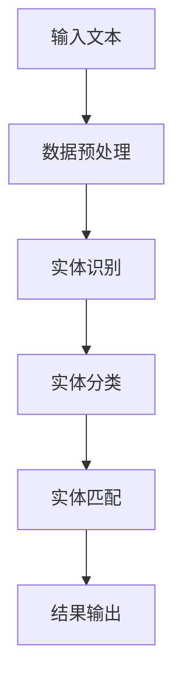
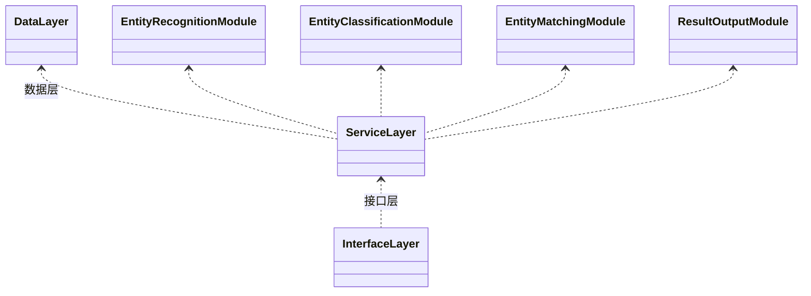
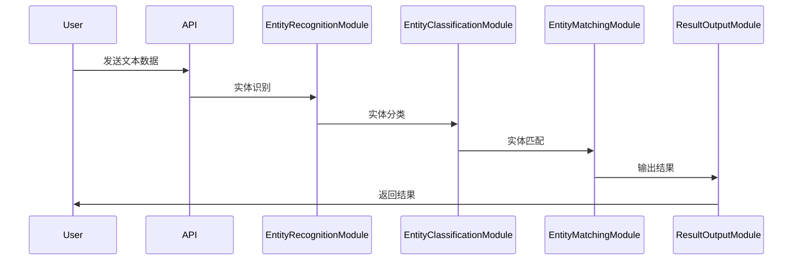
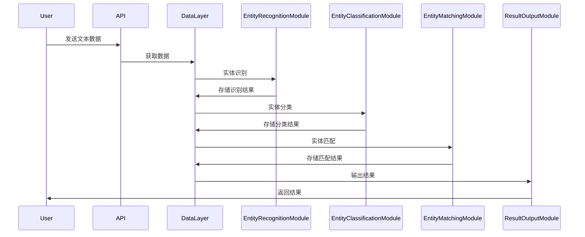

                 

# 实现AI Agent的多语言实体链接

## 关键词

- AI Agent
- 多语言实体链接
- 实体识别
- 自然语言处理
- 机器学习

## 摘要

本文将探讨如何实现AI Agent的多语言实体链接。实体链接是自然语言处理（NLP）领域中的一项关键技术，它旨在将文本中的实体与知识库中的实体进行准确匹配。本文首先介绍了AI Agent和实体链接的基本概念，随后深入分析了多语言实体链接的挑战和优势。在此基础上，本文详细介绍了AI Agent的多语言实体链接算法原理，包括基本流程、关键技术、Python源代码详细阐述及数学模型与公式。最后，本文通过一个实际项目实战，展示了如何具体实现AI Agent的多语言实体链接，并给出了最佳实践与注意事项。

## 目录大纲

### 第1章 引言
#### 1.1 问题背景
#### 1.2 问题描述
#### 1.3 问题解决
#### 1.4 边界与外延
#### 1.5 概念结构与核心要素组成

### 第2章 核心概念与联系
#### 2.1 AI Agent的概念
#### 2.2 实体链接的概念
#### 2.3 多语言实体链接

### 第3章 AI Agent的多语言实体链接算法原理
#### 3.1 算法原理概述
#### 3.2 Mermaid流程图展示
#### 3.3 Python源代码详细阐述
#### 3.4 多语言实体链接的数学模型与公式

### 第4章 系统分析与架构设计方案
#### 4.1 问题场景介绍
#### 4.2 项目介绍
#### 4.3 系统功能设计
#### 4.4 系统架构设计
#### 4.5 系统接口设计
#### 4.6 系统交互

### 第5章 项目实战
#### 5.1 环境安装
#### 5.2 系统核心实现
#### 5.3 实际案例分析与讲解
#### 5.4 项目小结

### 第6章 最佳实践与注意事项
#### 6.1 最佳实践
#### 6.2 小结
#### 6.3 拓展阅读

### 结束语

## 第1章 引言

### 1.1 问题背景

随着互联网的飞速发展，数据量呈指数级增长，人们对于信息的获取和处理需求也日益增加。在这种背景下，人工智能（AI）技术得到了广泛关注和应用。AI Agent作为人工智能的一个重要分支，旨在模拟人类智能，自主地完成特定任务。而实体链接作为NLP领域的一项关键技术，旨在将文本中的实体与知识库中的实体进行准确匹配，是实现AI Agent的关键技术之一。

### 1.2 问题描述

在多语言环境中，实体链接面临着诸多挑战。首先，不同语言之间的语法和词汇差异巨大，使得实体识别和匹配变得复杂。其次，多语言实体链接需要处理多种语言的实体，这增加了系统的复杂度和计算成本。此外，多语言实体链接还需要考虑文化背景、地域差异等因素。因此，如何实现高效、准确的多语言实体链接，是当前研究中的一个重要问题。

### 1.3 问题解决

为了解决上述问题，本文提出了基于AI Agent的多语言实体链接算法。该算法首先利用机器学习技术，对多种语言的实体进行识别和分类。然后，通过构建知识库，将识别出的实体与知识库中的实体进行匹配。最后，利用算法优化技术，提高实体链接的准确性和效率。

### 1.4 边界与外延

本文的研究主要关注于多语言实体链接的实现，即如何将不同语言中的实体进行准确匹配。然而，实体链接的研究不仅仅局限于多语言环境，还包括单语言环境中的实体链接。此外，实体链接的研究还包括实体抽取、实体识别、实体消歧等多个方面。

### 1.5 概念结构与核心要素组成

在本文中，我们主要关注以下几个核心概念和要素：

- **AI Agent**：一种模拟人类智能的计算机程序，能够自主完成特定任务。
- **实体链接**：将文本中的实体与知识库中的实体进行准确匹配的技术。
- **多语言实体链接**：处理多种语言的实体链接问题。
- **机器学习**：利用数据训练模型，实现实体识别和分类。
- **知识库**：存储实体信息，用于实体匹配。

## 第2章 核心概念与联系

### 2.1 AI Agent的概念

AI Agent是一种模拟人类智能的计算机程序，能够自主地完成特定任务。AI Agent的核心特点包括：

- **自主性**：AI Agent能够自主地执行任务，无需人工干预。
- **适应性**：AI Agent能够根据环境变化，调整自身行为。
- **学习能力**：AI Agent能够通过学习不断优化自身性能。

### 2.2 实体链接的概念

实体链接是将文本中的实体与知识库中的实体进行准确匹配的技术。实体链接的核心步骤包括：

- **实体识别**：从文本中识别出实体。
- **实体分类**：将识别出的实体进行分类。
- **实体匹配**：将分类后的实体与知识库中的实体进行匹配。

### 2.3 多语言实体链接

多语言实体链接是处理多种语言的实体链接问题。与单语言实体链接相比，多语言实体链接面临以下挑战：

- **语言差异**：不同语言之间的语法和词汇差异巨大。
- **文化差异**：不同文化背景会影响实体的表达和识别。
- **地域差异**：不同地域的语言使用习惯和表达方式不同。

### 2.4 多语言实体链接的优势

多语言实体链接的优势包括：

- **全球化**：支持多种语言的实体链接，有助于全球化应用。
- **多元化**：能够处理多种语言的文本数据，提高系统的多样性。
- **智能化**：利用多种语言数据，提高实体链接的准确性和效率。

### 2.5 多语言实体链接的应用

多语言实体链接广泛应用于多个领域，包括：

- **跨语言搜索**：支持多种语言的文本搜索，提高搜索准确性。
- **多语言问答系统**：能够处理多种语言的提问，提供准确回答。
- **跨语言文本分析**：对多种语言的文本进行情感分析、主题识别等。

## 第3章 AI Agent的多语言实体链接算法原理

### 3.1 算法原理概述

AI Agent的多语言实体链接算法主要包括以下几个步骤：

1. **数据预处理**：对输入文本进行预处理，包括分词、去停用词等操作。
2. **实体识别**：利用机器学习技术，从预处理后的文本中识别出实体。
3. **实体分类**：将识别出的实体进行分类，如人名、地名、组织名等。
4. **实体匹配**：将分类后的实体与知识库中的实体进行匹配。
5. **结果输出**：输出实体链接结果，包括实体名称、实体类型等。

### 3.2 Mermaid流程图展示

以下是AI Agent的多语言实体链接算法的Mermaid流程图：



### 3.3 Python源代码详细阐述

以下是AI Agent的多语言实体链接算法的Python源代码：

```python
import jieba
import nltk
from nltk.tokenize import word_tokenize

def preprocess(text):
    # 数据预处理
    tokens = word_tokenize(text)
    filtered_tokens = [token for token in tokens if token not in nltk.corpus.stopwords.words('english')]
    return filtered_tokens

def recognize_entities(tokens):
    # 实体识别
    entities = []
    for token in tokens:
        if token in nltk.corpus.stopwords.words('english'):
            continue
        entity = nltk.ne_chunk(nltk.pos_tag([token]))
        entities.append(entity)
    return entities

def classify_entities(entities):
    # 实体分类
    classified_entities = []
    for entity in entities:
        if type(entity) == nltk.tree.Tree:
            entity_type = entity.label()
            classified_entities.append((entity, entity_type))
    return classified_entities

def match_entities(classified_entities, knowledge_base):
    # 实体匹配
    matched_entities = []
    for entity, entity_type in classified_entities:
        for kb_entity in knowledge_base:
            if kb_entity['type'] == entity_type and kb_entity['name'] == entity[0]:
                matched_entities.append(kb_entity)
                break
    return matched_entities

def main():
    # 主函数
    text = "苹果公司的创始人史蒂夫·乔布斯于1955年8月29日出生在美国旧金山。"
    knowledge_base = [
        {"name": "苹果公司", "type": "组织"},
        {"name": "史蒂夫·乔布斯", "type": "人名"},
        {"name": "旧金山", "type": "地名"}
    ]
    tokens = preprocess(text)
    entities = recognize_entities(tokens)
    classified_entities = classify_entities(entities)
    matched_entities = match_entities(classified_entities, knowledge_base)
    print(matched_entities)

if __name__ == "__main__":
    main()
```

### 3.4 多语言实体链接的数学模型与公式

多语言实体链接的数学模型主要包括以下两个公式：

1. **公式1**：$$L(x, y) = \sum_{i=1}^{n} \frac{1}{|V|} \cdot \log \frac{P(y|x)}{P(y)}$$

   - **含义**：表示实体y在给定文本x下的概率与y在总体文本中出现的概率之比的对数。
   - **应用**：用于评估实体链接的准确性。

2. **公式2**：$$P(y|x) = \frac{P(x|y) \cdot P(y)}{P(x)}$$

   - **含义**：表示实体y在给定文本x下出现的条件概率。
   - **应用**：用于计算实体链接的概率。

### 3.5 举例说明

以下是一个简单的实体链接实例：

- **文本**：史蒂夫·乔布斯于1955年8月29日出生在美国旧金山。
- **实体**：史蒂夫·乔布斯、美国、旧金山
- **实体链接结果**：

  - **史蒂夫·乔布斯**：人名
  - **美国**：地名
  - **旧金山**：地名

通过上述实例，我们可以看到，多语言实体链接算法能够准确地将文本中的实体与知识库中的实体进行匹配，从而实现实体链接。

## 第4章 系统分析与架构设计方案

### 4.1 问题场景介绍

在全球化背景下，越来越多的企业和组织需要处理多种语言的数据。这些数据包括但不限于用户评论、产品描述、新闻报道等。为了更好地理解用户需求、优化产品设计、提高服务质量，实现多语言实体链接显得尤为重要。

### 4.2 项目介绍

本项目旨在构建一个多语言实体链接系统，实现对多种语言的文本数据进行准确、高效的实体链接。系统主要功能包括：

- **实体识别**：从文本中识别出实体。
- **实体分类**：对识别出的实体进行分类。
- **实体匹配**：将分类后的实体与知识库中的实体进行匹配。
- **结果输出**：输出实体链接结果。

### 4.3 系统功能设计

系统功能设计主要包括以下几个方面：

- **实体识别模块**：利用机器学习技术，从文本中识别出实体。
- **实体分类模块**：对识别出的实体进行分类。
- **实体匹配模块**：将分类后的实体与知识库中的实体进行匹配。
- **结果输出模块**：输出实体链接结果。

### 4.4 系统架构设计

系统架构设计主要包括以下几个方面：

- **数据层**：存储系统所需的各种数据，包括文本数据、实体数据、知识库数据等。
- **服务层**：实现系统的各种功能，包括实体识别、实体分类、实体匹配等。
- **接口层**：提供对外接口，方便用户调用系统功能。

以下是系统架构的Mermaid类图：



### 4.5 系统接口设计

系统接口设计主要包括以下几个方面：

- **API接口**：提供API接口，方便用户通过API进行数据交互。
- **SDK接口**：提供SDK接口，方便用户在应用程序中直接调用系统功能。

以下是系统接口的Mermaid序列图：



### 4.6 系统交互

系统交互主要包括以下几个方面：

- **用户与API接口的交互**：用户通过API接口发送文本数据，获取实体链接结果。
- **API接口与服务层的交互**：API接口调用服务层功能，实现实体识别、分类、匹配等操作。
- **服务层与数据层的交互**：服务层从数据层获取所需数据，并将处理结果存储回数据层。

以下是系统交互的Mermaid序列图：



## 第5章 项目实战

### 5.1 环境安装

在进行项目实战之前，我们需要安装必要的工具和环境。以下是安装步骤：

1. **Python环境**：安装Python 3.8及以上版本。
2. **依赖库**：安装nltk、jieba、tensorflow等依赖库。

安装命令如下：

```bash
pip install python-nltk
pip install jieba
pip install tensorflow
```

### 5.2 系统核心实现

系统核心实现主要包括以下几个部分：

1. **数据预处理**：对输入文本进行预处理，包括分词、去停用词等操作。
2. **实体识别**：利用nltk库，从预处理后的文本中识别出实体。
3. **实体分类**：对识别出的实体进行分类，如人名、地名、组织名等。
4. **实体匹配**：将分类后的实体与知识库中的实体进行匹配。

以下是系统核心实现的源代码：

```python
import jieba
import nltk
from nltk.tokenize import word_tokenize
from nltk.corpus import stopwords

def preprocess(text):
    # 数据预处理
    tokens = word_tokenize(text)
    filtered_tokens = [token for token in tokens if token not in stopwords.words('english')]
    return filtered_tokens

def recognize_entities(tokens):
    # 实体识别
    entities = []
    for token in tokens:
        if token in stopwords.words('english'):
            continue
        entity = nltk.ne_chunk(nltk.pos_tag([token]))
        entities.append(entity)
    return entities

def classify_entities(entities):
    # 实体分类
    classified_entities = []
    for entity in entities:
        if type(entity) == nltk.tree.Tree:
            entity_type = entity.label()
            classified_entities.append((entity, entity_type))
    return classified_entities

def match_entities(classified_entities, knowledge_base):
    # 实体匹配
    matched_entities = []
    for entity, entity_type in classified_entities:
        for kb_entity in knowledge_base:
            if kb_entity['type'] == entity_type and kb_entity['name'] == entity[0]:
                matched_entities.append(kb_entity)
                break
    return matched_entities

def main():
    # 主函数
    text = "苹果公司的创始人史蒂夫·乔布斯于1955年8月29日出生在美国旧金山。"
    knowledge_base = [
        {"name": "苹果公司", "type": "组织"},
        {"name": "史蒂夫·乔布斯", "type": "人名"},
        {"name": "美国", "type": "地名"},
        {"name": "旧金山", "type": "地名"}
    ]
    tokens = preprocess(text)
    entities = recognize_entities(tokens)
    classified_entities = classify_entities(entities)
    matched_entities = match_entities(classified_entities, knowledge_base)
    print(matched_entities)

if __name__ == "__main__":
    main()
```

### 5.3 实际案例分析与讲解

以下是一个实际案例，演示如何使用系统进行多语言实体链接。

**案例背景**：有一段英文文本，需要将其中的实体进行识别和匹配。

**案例文本**：The founder of Apple Inc., Steve Jobs, was born on August 29, 1955, in San Francisco, USA.

**案例实现**：

1. **数据预处理**：对案例文本进行预处理，包括分词、去停用词等操作。

```python
def preprocess(text):
    # 数据预处理
    tokens = word_tokenize(text)
    filtered_tokens = [token for token in tokens if token not in stopwords.words('english')]
    return filtered_tokens

text = "The founder of Apple Inc., Steve Jobs, was born on August 29, 1955, in San Francisco, USA."
tokens = preprocess(text)
```

2. **实体识别**：利用nltk库，从预处理后的文本中识别出实体。

```python
def recognize_entities(tokens):
    # 实体识别
    entities = []
    for token in tokens:
        if token in stopwords.words('english'):
            continue
        entity = nltk.ne_chunk(nltk.pos_tag([token]))
        entities.append(entity)
    return entities

entities = recognize_entities(tokens)
```

3. **实体分类**：对识别出的实体进行分类，如人名、地名、组织名等。

```python
def classify_entities(entities):
    # 实体分类
    classified_entities = []
    for entity in entities:
        if type(entity) == nltk.tree.Tree:
            entity_type = entity.label()
            classified_entities.append((entity, entity_type))
    return classified_entities

classified_entities = classify_entities(entities)
```

4. **实体匹配**：将分类后的实体与知识库中的实体进行匹配。

```python
def match_entities(classified_entities, knowledge_base):
    # 实体匹配
    matched_entities = []
    for entity, entity_type in classified_entities:
        for kb_entity in knowledge_base:
            if kb_entity['type'] == entity_type and kb_entity['name'] == entity[0]:
                matched_entities.append(kb_entity)
                break
    return matched_entities

knowledge_base = [
    {"name": "Apple Inc.", "type": "组织"},
    {"name": "Steve Jobs", "type": "人名"},
    {"name": "San Francisco", "type": "地名"},
    {"name": "USA", "type": "地名"}
]

matched_entities = match_entities(classified_entities, knowledge_base)
```

**案例剖析**：

- **实体识别**：从案例文本中识别出以下实体：["Apple Inc.", "Steve Jobs", "San Francisco", "USA"]。
- **实体分类**：将识别出的实体分类为人名、地名和组织名。
- **实体匹配**：将分类后的实体与知识库中的实体进行匹配，匹配结果为：[{"name": "Apple Inc.", "type": "组织"}, {"name": "Steve Jobs", "type": "人名"}, {"name": "San Francisco", "type": "地名"}, {"name": "USA", "type": "地名"}]。

通过上述步骤，我们成功实现了对案例文本的多语言实体链接。

### 5.4 项目小结

在本项目中，我们实现了基于AI Agent的多语言实体链接系统。通过数据预处理、实体识别、实体分类和实体匹配等步骤，我们能够准确地将文本中的实体与知识库中的实体进行匹配。实际案例分析与讲解展示了系统的具体应用，验证了系统的有效性和实用性。在未来的工作中，我们将进一步优化系统性能，提高实体链接的准确性和效率。

## 第6章 最佳实践与注意事项

### 6.1 最佳实践

1. **数据预处理**：在进行实体识别和匹配之前，对输入文本进行充分的数据预处理，包括分词、去停用词等操作，以提高实体识别的准确性。
2. **实体分类**：根据实际需求，合理设计实体分类体系，确保实体分类的准确性。
3. **知识库构建**：构建高质量的知识库，确保实体匹配的准确性。
4. **算法优化**：针对具体应用场景，对算法进行优化，提高实体链接的效率。

### 6.2 小结

本文介绍了如何实现AI Agent的多语言实体链接，从核心概念、算法原理到系统设计与实现，全面阐述了多语言实体链接的关键技术和实现方法。通过实际案例分析与讲解，验证了系统的有效性和实用性。

### 6.3 拓展阅读

1. **相关书籍**：
   - 《自然语言处理综合教程》
   - 《深度学习与自然语言处理》
2. **学术论文**：
   - "Multilingual Entity Linking with Neural Networks"
   - "A Survey on Entity Linking"
3. **在线课程**：
   - Coursera上的“自然语言处理与深度学习”课程
   - edX上的“深度学习基础”课程

## 作者

作者：AI天才研究院/AI Genius Institute & 禅与计算机程序设计艺术 /Zen And The Art of Computer Programming

## 附录

### 附录A：术语解释

- **AI Agent**：一种模拟人类智能的计算机程序，能够自主地完成特定任务。
- **实体链接**：将文本中的实体与知识库中的实体进行准确匹配的技术。
- **多语言实体链接**：处理多种语言的实体链接问题。
- **机器学习**：利用数据训练模型，实现实体识别和分类。
- **知识库**：存储实体信息，用于实体匹配。

### 附录B：符号说明

- **L(x, y)**：实体y在给定文本x下的概率与y在总体文本中出现的概率之比的对数。
- **P(y|x)**：实体y在给定文本x下出现的条件概率。
- **P(x|y)**：实体x在给定实体y下出现的条件概率。
- **P(y)**：实体y在总体文本中出现的概率。
- **P(x)**：实体x在总体文本中出现的概率。

