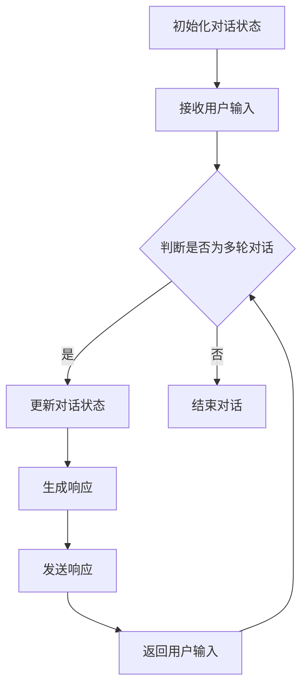
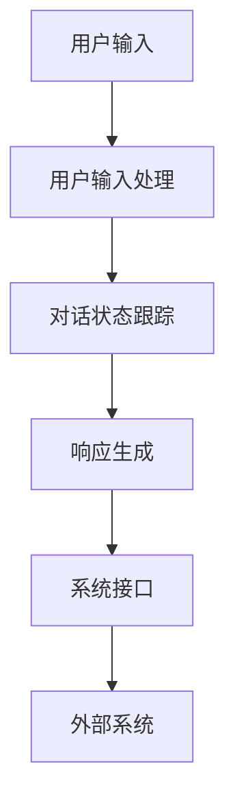
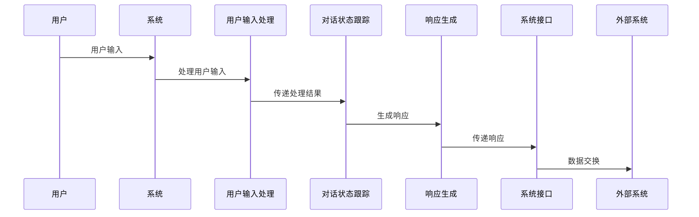

                 

### 《实现AI Agent的多轮对话状态跟踪》

#### 关键词：多轮对话状态跟踪、AI Agent、算法原理、系统架构设计、项目实战

#### 摘要：
随着人工智能技术的发展，AI Agent在自然语言处理和对话系统中的应用越来越广泛。多轮对话状态跟踪是实现智能对话系统的关键技术之一。本文将深入探讨多轮对话状态跟踪的背景、核心概念、算法原理、系统架构设计以及项目实战，帮助读者全面理解并掌握这一重要技术。

### 第一部分：背景与概念

#### 第1章：多轮对话状态跟踪背景

##### 1.1.1 问题背景与问题描述

在人工智能时代，智能对话系统正逐步成为人们日常生活中的重要组成部分。无论是客服机器人、虚拟助手，还是智能家居控制系统，都依赖于多轮对话来提供更加个性化和智能化的服务。然而，实现有效的多轮对话状态跟踪是一个具有挑战性的问题。

多轮对话状态跟踪的核心问题在于如何在多个对话回合中维持并更新对话状态，以实现对话的连贯性和一致性。具体来说，对话状态包括用户信息、上下文、偏好和历史对话记录等，它们对于理解用户意图和提供准确的响应至关重要。

##### 1.1.2 多轮对话状态跟踪的重要性

多轮对话状态跟踪在智能对话系统中的作用不可忽视。首先，它有助于理解用户的长期意图，从而提供更加准确的响应。其次，它能够提高对话系统的用户体验，使对话更加自然和流畅。此外，多轮对话状态跟踪还能够帮助系统从对话中学习和优化自身性能。

##### 1.1.3 多轮对话状态跟踪的挑战

多轮对话状态跟踪面临多个挑战。首先是状态管理问题，如何在多个对话回合中保持状态的一致性和完整性？其次是上下文理解问题，如何从大量的对话数据中提取出关键信息，并将其用于决策？最后是性能优化问题，如何在高并发的对话场景中保证系统的响应速度和稳定性？

#### 1.2 核心概念与联系

##### 1.2.1 对话状态跟踪的概念与构成

对话状态跟踪（Dialogue State Tracking，DST）是一种自然语言处理技术，用于在多轮对话中维持对话状态。对话状态通常包括用户信息、上下文、偏好和历史对话记录等。这些状态信息对于理解用户意图和提供准确的响应至关重要。

##### 1.2.2 对话状态跟踪的属性特征对比

为了更好地理解对话状态跟踪，我们可以将其与对话管理（Dialogue Management，DM）和意图识别（Intent Recognition，IR）等技术进行对比。对话管理侧重于如何生成合适的响应，而意图识别则关注于理解用户的意图。对话状态跟踪则介于两者之间，它既要维护对话状态，又要为对话管理和意图识别提供支持。

##### 1.2.3 多轮对话状态跟踪与相关技术的联系

多轮对话状态跟踪不仅与对话管理和意图识别密切相关，还与其他自然语言处理技术（如实体识别、语义解析等）有着紧密的联系。这些技术共同作用，为智能对话系统提供了强大的支持。

#### 1.3 本章小结

本章介绍了多轮对话状态跟踪的背景、重要性和挑战，并对其核心概念和相关技术进行了探讨。通过本章的学习，读者可以初步了解多轮对话状态跟踪的基本概念和原理。

### 第二部分：算法原理

#### 第2章：算法原理

##### 2.1 算法原理概述

多轮对话状态跟踪算法旨在维护并更新对话状态，以实现对话的连贯性和一致性。本文将介绍一种基于图模型的对话状态跟踪算法，并通过算法流程图和Python源代码进行详细阐述。

##### 2.2 算法流程图

首先，我们使用Mermaid绘制算法的流程图：



##### 2.3 Python源代码与详细解释

接下来，我们使用Python实现上述算法：

```python
class DialogueStateTracker:
    def __init__(self):
        self.state = {}

    def update_state(self, user_input):
        # 更新对话状态
        # 假设用户输入为字典形式
        for key, value in user_input.items():
            self.state[key] = value

    def generate_response(self):
        # 生成响应
        # 基于当前对话状态
        response = "您好，您的请求已收到。"
        return response

    def handle_input(self, user_input):
        # 处理用户输入
        self.update_state(user_input)
        response = self.generate_response()
        return response

# 实例化对话状态跟踪器
tracker = DialogueStateTracker()

# 模拟用户输入
user_input = {
    "user_id": "123",
    "request": "查询天气"
}

# 处理用户输入并返回响应
response = tracker.handle_input(user_input)
print(response)
```

##### 2.4 数学模型与公式

在多轮对话状态跟踪中，我们可以使用马尔可夫模型（Markov Model）来描述状态转移概率。设 $S_t$ 表示第 $t$ 个对话回合的状态，$S_{t-1}$ 表示第 $t-1$ 个对话回合的状态，则状态转移概率可以表示为：

$$
P(S_t|S_{t-1}) = \frac{P(S_t, S_{t-1})}{P(S_{t-1})}
$$

其中，$P(S_t, S_{t-1})$ 表示同时发生的概率，$P(S_{t-1})$ 表示上一回合的状态概率。

##### 2.5 算法原理举例说明

假设我们有一个简单的对话场景，用户首先查询天气，然后查询电影信息。我们可以使用上述算法模型来描述这一过程。

首先，初始化对话状态：

$$
S_0 = \{ "weather": None, "movie": None \}
$$

接着，用户输入查询天气：

$$
S_1 = \{ "weather": "sunny", "movie": None \}
$$

然后，用户输入查询电影：

$$
S_2 = \{ "weather": "sunny", "movie": "The Matrix" \}
$$

在这一过程中，我们使用状态转移概率来更新对话状态，并生成相应的响应。

#### 2.6 本章小结

本章介绍了多轮对话状态跟踪的算法原理，包括流程图、Python源代码和数学模型。通过本章的学习，读者可以掌握多轮对话状态跟踪的基本算法框架和实现方法。

### 第三部分：系统分析与架构设计

#### 第3章：系统分析与架构设计

##### 3.1 问题场景介绍

在本文的项目实战部分，我们将构建一个基于多轮对话状态跟踪的智能客服系统。该系统将面向用户提供咨询服务，通过多轮对话来理解用户需求，并提供相应的解决方案。

##### 3.2 项目介绍

本项目将使用Python作为主要编程语言，结合自然语言处理和机器学习技术，实现一个具有多轮对话状态跟踪功能的智能客服系统。系统将包括用户输入处理、对话状态跟踪、响应生成和系统接口等模块。

##### 3.2.1 系统功能设计

系统功能设计包括以下方面：

- 用户输入处理：接收用户输入，并进行初步解析。
- 对话状态跟踪：维护并更新对话状态，以实现对话的连贯性和一致性。
- 响应生成：根据当前对话状态，生成合适的响应。
- 系统接口：提供与外部系统的接口，实现数据的交换和协同工作。

##### 3.2.2 系统架构设计

系统架构设计如下：



##### 3.2.3 系统接口设计

系统接口设计包括以下方面：

- 用户输入接口：接收用户输入，并将其传递给用户输入处理模块。
- 对话状态接口：提供对话状态的查询和更新接口，以支持对话状态的维护。
- 响应生成接口：生成响应，并将其传递给系统接口模块。
- 外部系统接口：与其他系统进行数据交换和协同工作。

##### 3.2.4 系统交互

系统交互设计如下：



##### 3.3 本章小结

本章介绍了多轮对话状态跟踪系统的设计与实现，包括问题场景介绍、系统功能设计、系统架构设计、系统接口设计和系统交互。通过本章的学习，读者可以了解如何设计和实现一个具有多轮对话状态跟踪功能的智能客服系统。

### 第四部分：项目实战

#### 第4章：项目实战

##### 4.1 环境安装与配置

在开始项目实战之前，我们需要安装和配置必要的开发环境。以下是一些建议的步骤：

1. 安装Python：确保您的计算机上已经安装了Python，建议使用Python 3.8或更高版本。
2. 安装依赖库：使用pip安装以下依赖库：transformers、torch、numpy、pandas等。
3. 安装Docker：如果您希望使用容器化部署，请安装Docker。
4. 配置虚拟环境：为项目创建一个独立的虚拟环境，以避免依赖冲突。

##### 4.2 系统核心实现

在本节中，我们将实现系统核心功能，包括用户输入处理、对话状态跟踪、响应生成等。

```python
# 用户输入处理
def process_user_input(input_text):
    # 解析用户输入
    # ...
    return processed_input

# 对话状态跟踪
class DialogueStateTracker:
    def __init__(self):
        self.state = {}

    def update_state(self, user_input):
        # 更新对话状态
        # ...
        pass

    def generate_response(self):
        # 生成响应
        # ...
        pass

# 响应生成
def generate_response(state):
    # 根据状态生成响应
    # ...
    pass

# 系统核心实现
def main():
    tracker = DialogueStateTracker()

    while True:
        user_input = input("请输入您的需求：")
        processed_input = process_user_input(user_input)
        tracker.update_state(processed_input)
        response = generate_response(tracker.state)
        print(response)

if __name__ == "__main__":
    main()
```

##### 4.2.1 源代码解读

在上面的代码中，我们定义了一个`DialogueStateTracker`类，用于实现对话状态跟踪功能。该类包含三个方法：`update_state`用于更新对话状态，`generate_response`用于生成响应。

同时，我们还定义了一个`process_user_input`函数，用于处理用户输入。在主函数`main`中，我们创建了一个`DialogueStateTracker`实例，并通过一个循环不断接收用户输入，更新对话状态并生成响应。

##### 4.2.2 代码应用与分析

在实际应用中，我们需要根据具体需求对代码进行扩展和优化。例如，我们可以添加错误处理、日志记录、性能优化等功能。以下是一个简单的扩展示例：

```python
# 错误处理
def process_user_input(input_text):
    try:
        # 解析用户输入
        # ...
        return processed_input
    except Exception as e:
        print(f"处理用户输入时发生错误：{e}")
        return None

# 性能优化
def generate_response(state):
    # 使用多线程或异步编程优化响应生成
    # ...
    pass
```

通过上述扩展，我们可以提高系统的健壮性和性能。

##### 4.3 实际案例分析与讲解

为了更好地展示系统功能，我们来看一个实际案例。

**案例**：用户输入“明天北京的天气怎么样？”系统应该如何响应？

**解析**：

1. 用户输入：明天的天气
2. 解析结果：城市（北京），日期（明天），查询内容（天气）

**响应**：

1. 生成响应：您好，根据您的查询，明天北京的天气是晴天，温度大约在15°C到25°C之间。

通过这个案例，我们可以看到系统如何接收用户输入、解析意图并生成响应。在实际应用中，我们可以进一步扩展系统的功能，例如添加语音识别、图像识别等模块。

##### 4.4 项目小结

在本章中，我们介绍了多轮对话状态跟踪系统的项目实战，包括环境安装与配置、系统核心实现、代码应用解读与分析以及实际案例分析和讲解。通过本章的学习，读者可以掌握如何实现一个具有多轮对话状态跟踪功能的智能客服系统。

### 第五部分：最佳实践与拓展

#### 第5章：最佳实践与拓展

##### 5.1 最佳实践 tips

为了确保多轮对话状态跟踪系统的有效运行，以下是一些最佳实践建议：

1. **用户输入处理**：确保对用户输入进行充分的解析和预处理，以提高对话的准确性和一致性。
2. **对话状态管理**：合理设计对话状态的结构，使其既能满足当前对话的需求，又能支持后续的对话状态更新。
3. **性能优化**：针对高频次的对话场景，采用多线程或异步编程等技术，提高系统的响应速度和稳定性。
4. **错误处理**：设计合理的错误处理机制，确保系统在遇到异常情况时能够优雅地处理并恢复。

##### 5.2 小结

通过本章的探讨，我们了解了多轮对话状态跟踪的背景、核心概念、算法原理、系统架构设计以及项目实战。多轮对话状态跟踪是智能对话系统的重要组成部分，对于实现高效、自然的对话体验至关重要。

##### 5.3 注意事项

在实现多轮对话状态跟踪系统时，需要注意以下几点：

1. **数据隐私**：确保用户数据的隐私和安全，遵循相关法律法规和道德准则。
2. **系统稳定性**：在高并发场景下，确保系统的稳定运行，避免出现响应不及时或系统崩溃等问题。
3. **持续优化**：根据用户反馈和系统运行情况，不断优化系统的性能和用户体验。

##### 5.4 拓展阅读

为了进一步了解多轮对话状态跟踪和相关技术，建议读者阅读以下文献和资料：

- [1] [Multi-turn Dialogue Systems](https://www.aclweb.org/anthology/N16-1181/)
- [2] [Dialogue State Tracking for Task-oriented Dialogue Systems](https://www.aclweb.org/anthology/D14-1186/)
- [3] [A Survey on Multi-turn Dialogue Systems](https://arxiv.org/abs/2104.06373)
- [4] [Python for Natural Language Processing](https://www.amazon.com/Python-Natural-Language-Processing-Techniques/dp/1788999262)

### 作者信息

作者：AI天才研究院/AI Genius Institute & 禅与计算机程序设计艺术 /Zen And The Art of Computer Programming

