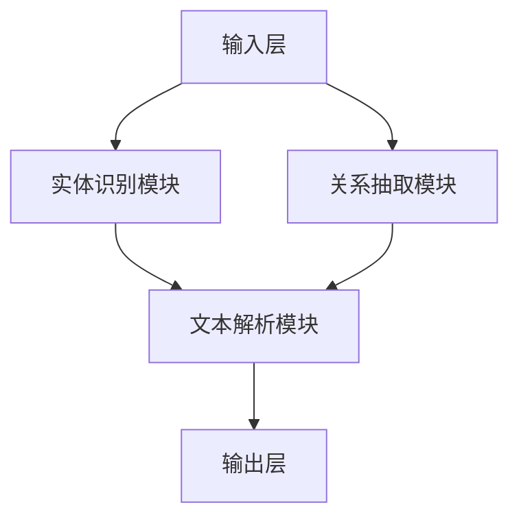

                 

**实现AI Agent的实体识别与关系抽取**

## **摘要**

本文探讨了实现AI Agent的实体识别与关系抽取的关键技术和方法。实体识别是自然语言处理领域的基础任务，而关系抽取则能帮助AI更好地理解语言中的语义关系。本文首先介绍了实体识别与关系抽取的基本概念，然后详细分析了相关算法的原理和实现方法，包括基于规则和基于机器学习的方法。接着，我们讨论了系统设计与实现的具体步骤，以及如何在项目实战中应用这些技术。最后，本文提供了最佳实践和未来展望，以指导读者在实际应用中的优化和拓展。

## **目录大纲**

### **第一部分：背景介绍**

**第1章：问题背景**

- **1.1 人工智能的发展与AI Agent的重要性**
- **1.2 实体识别与关系抽取的意义**
- **1.3 AI Agent在实体识别与关系抽取中的应用**

**第2章：核心概念**

- **2.1 实体识别**
  - **2.1.1 实体的定义与分类**
  - **2.1.2 实体识别的挑战**
  - **2.1.3 实体识别的方法**
- **2.2 关系抽取**
  - **2.2.1 关系的定义与分类**
  - **2.2.2 关系抽取的挑战**
  - **2.2.3 关系抽取的方法**

### **第二部分：算法原理**

**第3章：实体识别算法原理**

- **3.1 基于规则的方法**
  - **3.1.1 基本原理**
  - **3.1.2 实例讲解**
- **3.2 基于机器学习的方法**
  - **3.2.1 基本原理**
  - **3.2.2 常用模型**
  - **3.2.3 实例讲解**

**第4章：关系抽取算法原理**

- **4.1 基于规则的方法**
  - **4.1.1 基本原理**
  - **4.1.2 实例讲解**
- **4.2 基于机器学习的方法**
  - **4.2.1 基本原理**
  - **4.2.2 常用模型**
  - **4.2.3 实例讲解**

### **第三部分：系统设计与实现**

**第5章：系统架构设计**

- **5.1 系统概述**
  - **5.1.1 系统功能设计**
  - **5.1.2 系统架构设计**
- **5.2 系统接口设计**
  - **5.2.1 接口设计原则**
  - **5.2.2 接口实现细节**

**第6章：系统实现**

- **6.1 环境安装与配置**
  - **6.1.1 Python环境安装**
  - **6.1.2 相关库安装**
- **6.2 实体识别实现**
  - **6.2.1 源代码解读**
  - **6.2.2 代码应用解读与分析**
- **6.3 关系抽取实现**
  - **6.3.1 源代码解读**
  - **6.3.2 代码应用解读与分析**

**第7章：项目实战**

- **7.1 实际案例分析与讲解**
  - **7.1.1 案例一：新闻文章中的实体识别与关系抽取**
  - **7.1.2 案例二：社交媒体数据中的实体识别与关系抽取**
- **7.2 项目小结**
  - **7.2.1 项目总结**
  - **7.2.2 未来工作展望**

### **第四部分：最佳实践与拓展**

**第8章：最佳实践**

- **8.1 实体识别与关系抽取的优化策略**
  - **8.1.1 性能优化**
  - **8.1.2 精度优化**
- **8.2 实体识别与关系抽取的常见问题与解决方案**

**第9章：小结与展望**

- **9.1 小结**
  - **9.1.1 主要内容回顾**
  - **9.1.2 成果总结**
- **9.2 展望未来**
  - **9.2.1 研究方向**
  - **9.2.2 应用前景**

## **第一部分：背景介绍**

### **第1章：问题背景**

#### **1.1 人工智能的发展与AI Agent的重要性**

人工智能（AI）作为计算机科学的重要分支，自20世纪50年代起便不断演进，如今已渗透到我们生活的方方面面。从简单的专家系统到复杂的深度学习模型，AI技术经历了巨大的变革。AI Agent，或称为智能代理，是人工智能领域中一个重要的概念。AI Agent是指能够代表人类执行任务、自主行动并在环境中进行交互的智能实体。其重要性体现在以下几个方面：

1. **自动化与效率提升**：AI Agent能够自动化处理大量重复性工作，从而提高工作效率。
2. **智能决策支持**：AI Agent通过学习和分析数据，可以提供更精准的决策支持。
3. **人机交互**：AI Agent能够更好地理解和响应人类的指令，实现更自然的人机交互。

随着AI技术的发展，AI Agent的应用场景也在不断扩展。例如，在自然语言处理（NLP）领域，AI Agent可以通过实体识别与关系抽取来理解文本中的关键信息，从而在搜索、问答系统、推荐系统等应用中发挥重要作用。

#### **1.2 实体识别与关系抽取的意义**

实体识别（Named Entity Recognition, NER）和关系抽取（Relation Extraction）是NLP中的两个核心任务。它们的意义主要体现在以下几个方面：

1. **信息提取**：实体识别与关系抽取能够从大量文本数据中提取出有价值的信息，为后续的数据分析和决策提供基础。
2. **语义理解**：通过识别文本中的实体及其关系，AI可以更深入地理解文本的语义，从而实现更精准的文本分析。
3. **应用拓展**：实体识别与关系抽取是许多NLP应用的基础，如情感分析、事件抽取、知识图谱构建等。

实体识别与关系抽取不仅能够提高AI Agent的智能水平，还能够为AI Agent在现实世界中的实际应用提供更丰富的功能。

#### **1.3 AI Agent在实体识别与关系抽取中的应用**

AI Agent在实体识别与关系抽取中的应用场景非常广泛。以下是一些典型的应用实例：

1. **搜索引擎**：通过实体识别与关系抽取，AI Agent可以更准确地理解用户的查询意图，提供更相关的搜索结果。
2. **智能客服**：AI Agent可以通过实体识别与关系抽取来理解用户的问题，提供个性化的回答。
3. **推荐系统**：在推荐系统中，实体识别与关系抽取可以帮助系统更好地理解用户和商品的信息，从而提供更准确的推荐。

总之，实体识别与关系抽取是AI Agent实现智能理解和交互的重要基础，其应用前景非常广阔。

### **第2章：核心概念**

#### **2.1 实体识别**

##### **2.1.1 实体的定义与分类**

实体（Entity）是自然语言处理中的一个核心概念，它指的是文本中具有独立含义的词语或短语。在NLP中，实体通常可以分为三类：

1. **人**：如“奥巴马”、“张三”。
2. **地点**：如“纽约”、“故宫”。
3. **组织**：如“苹果公司”、“中国工商银行”。

实体的分类方法有很多，常见的有基于预定义分类法和基于机器学习方法。预定义分类法通过手动定义实体类别和特征，而机器学习方法则通过学习大量的标注数据来自动发现实体类别和特征。

##### **2.1.2 实体识别的挑战**

实体识别虽然看似简单，但实际上面临着许多挑战：

1. **命名实体边界的不确定性**：某些实体可能在文本中以不同的形式出现，如“奥巴马”可以写作“奥巴马总统”。
2. **同义词和近义词**：许多实体具有同义词或近义词，如“苹果公司”和“苹果”。
3. **跨语言实体识别**：不同语言中的实体命名方式和表达方式可能不同，给跨语言实体识别带来了困难。

##### **2.1.3 实体识别的方法**

实体识别的方法主要分为基于规则的方法和基于机器学习的方法。

1. **基于规则的方法**：这种方法通过预先定义的规则来识别实体，如基于词性标注、命名实体识别词典等。其优点是简单易实现，但缺点是规则难以覆盖所有情况，容易导致误判和漏判。

2. **基于机器学习的方法**：这种方法通过训练模型来自动识别实体，常用的模型有条件随机场（CRF）、支持向量机（SVM）、长短期记忆网络（LSTM）等。其优点是能够自动学习复杂的模式，但缺点是需要大量的标注数据。

##### **2.2 关系抽取**

##### **2.2.1 关系的定义与分类**

关系（Relation）是指实体之间的语义联系，如“工作于”、“位于”等。关系可以分为三类：

1. **一对一关系**：如“张三是奥巴马的秘书”。
2. **一对多关系**：如“苹果公司位于加利福尼亚州”。
3. **多对多关系**：如“张三和李四是同事”。

关系的分类方法通常基于实体之间的语义联系，常见的有基于词性标注、依存句法分析等。

##### **2.2.2 关系抽取的挑战**

关系抽取也面临着许多挑战：

1. **文本歧义**：同一关系可能在不同的上下文中具有不同的含义，如“喜欢”可以指爱好，也可以指喜爱某个人。
2. **实体边界的不确定性**：如前所述，实体边界的不确定性也会影响到关系抽取。
3. **复杂的关系网络**：在大型文本数据中，实体之间的关系可能非常复杂，如一个人可能拥有多个职位，涉及多个组织。

##### **2.2.3 关系抽取的方法**

关系抽取的方法同样分为基于规则的方法和基于机器学习的方法。

1. **基于规则的方法**：这种方法通过定义一系列规则来识别实体之间的关系，如基于模式匹配、依存句法分析等。其优点是规则清晰，但缺点是规则难以覆盖所有情况。

2. **基于机器学习的方法**：这种方法通过训练模型来自动识别实体之间的关系，常用的模型有条件随机场（CRF）、支持向量机（SVM）、图神经网络（Graph Neural Networks）等。其优点是能够自动学习复杂的模式，但缺点是需要大量的标注数据。

#### **2.3 AI Agent在实体识别与关系抽取中的应用**

AI Agent在实体识别与关系抽取中的应用主要体现在以下几个方面：

1. **文本解析**：AI Agent可以通过实体识别与关系抽取来理解文本内容，从而实现更精准的文本解析。

2. **语义理解**：AI Agent可以通过实体识别与关系抽取来理解文本中的语义信息，从而实现更自然的语义理解。

3. **智能交互**：AI Agent可以通过实体识别与关系抽取来更好地理解用户的意图，从而实现更智能的交互。

### **第二部分：算法原理**

#### **第3章：实体识别算法原理**

实体识别是NLP中的重要任务，其目的是从文本中识别出具有特定意义的实体。本章节将介绍实体识别的算法原理，包括基于规则的方法和基于机器学习的方法。

##### **3.1 基于规则的方法**

基于规则的方法是实体识别的一种传统方法，其基本思想是通过定义一系列规则来识别实体。这些规则可以是基于词性标注、命名实体识别词典、模式匹配等。

1. **词性标注**：词性标注是一种基于规则的方法，通过对文本进行词性标注，从而识别出实体。例如，如果一个词被标注为“人名”，则可以认为这个词是一个实体。

2. **命名实体识别词典**：命名实体识别词典是一种基于规则的方法，它通过手动定义一组命名实体，然后根据词典中的规则来识别实体。例如，如果一个词在词典中定义为“人名”，则可以认为这个词是一个实体。

3. **模式匹配**：模式匹配是一种基于规则的方法，它通过预定义的模式来匹配文本中的实体。例如，如果一个模式匹配到了一个姓名，则可以认为这个词是一个实体。

**实例讲解**：

以词性标注为例，假设我们有一个简单的文本：“张三昨天去了北京。”我们可以使用一个词性标注器来识别出实体。例如，词性标注器可能将“张三”标注为“人名”，将“北京”标注为“地名”。

##### **3.2 基于机器学习的方法**

基于机器学习的方法是实体识别的一种现代方法，其基本思想是通过训练模型来识别实体。这些模型可以是基于分类的，也可以是基于序列标注的。

1. **条件随机场（CRF）**：条件随机场是一种常用的基于机器学习的方法，它通过考虑上下文信息来识别实体。CRF模型假设实体识别过程是一个马尔可夫过程，即当前状态的实体识别结果只与当前词的词性标注有关。

2. **支持向量机（SVM）**：支持向量机是一种常用的分类模型，它可以用来识别实体。SVM模型通过找到一个超平面，将不同类的实体分开。

3. **长短期记忆网络（LSTM）**：长短期记忆网络是一种循环神经网络，它可以用来处理序列数据。在实体识别中，LSTM模型可以捕捉到文本中的长距离依赖关系，从而更准确地识别实体。

**实例讲解**：

以条件随机场为例，假设我们有一个训练数据集，其中包含了句子和对应的实体标注。我们可以使用CRF模型来训练一个实体识别器。在训练过程中，CRF模型会学习到如何根据上下文信息来识别实体。在测试阶段，我们可以使用训练好的CRF模型来识别新的句子中的实体。

##### **3.3 基于深度学习的方法**

基于深度学习的方法是实体识别的一种新兴方法，其基本思想是通过深度神经网络来识别实体。这些模型包括卷积神经网络（CNN）、循环神经网络（RNN）等。

1. **卷积神经网络（CNN）**：卷积神经网络是一种用于图像识别的深度学习模型，它可以用来识别文本中的实体。在实体识别中，CNN模型可以通过对文本进行卷积操作来提取特征。

2. **循环神经网络（RNN）**：循环神经网络是一种用于序列建模的深度学习模型，它可以用来识别文本中的实体。在实体识别中，RNN模型可以通过对文本进行循环操作来捕捉到序列中的依赖关系。

**实例讲解**：

以卷积神经网络为例，假设我们有一个训练数据集，其中包含了句子和对应的实体标注。我们可以使用CNN模型来训练一个实体识别器。在训练过程中，CNN模型会学习到如何从文本中提取特征，并在测试阶段使用这些特征来识别实体。

##### **3.4 实体识别算法的比较**

基于规则的方法和基于机器学习的方法各有优缺点。

- **基于规则的方法**：优点是简单易实现，缺点是规则难以覆盖所有情况，容易导致误判和漏判。
- **基于机器学习的方法**：优点是能够自动学习复杂的模式，缺点是需要大量的标注数据。

基于深度学习的方法在近年来取得了很大的进展，其在实体识别任务中的性能逐渐超过了基于规则和基于机器学习的方法。

#### **第4章：关系抽取算法原理**

关系抽取是NLP中的另一个重要任务，其目的是从文本中识别出实体之间的关系。本章节将介绍关系抽取的算法原理，包括基于规则的方法和基于机器学习的方法。

##### **4.1 基于规则的方法**

基于规则的方法是关系抽取的一种传统方法，其基本思想是通过定义一系列规则来识别关系。这些规则可以是基于模式匹配、依存句法分析等。

1. **模式匹配**：模式匹配是一种基于规则的方法，它通过预定义的模式来匹配文本中的关系。例如，如果一个模式匹配到了“工作于”这个词，则可以认为这两个实体之间存在“工作”关系。

2. **依存句法分析**：依存句法分析是一种基于规则的方法，它通过分析句子中的词与词之间的依存关系来识别关系。例如，如果一个词是另一个词的宾语，则可以认为这两个词之间存在关系。

**实例讲解**：

以模式匹配为例，假设我们有一个简单的文本：“张三昨天去了北京。”我们可以使用一个模式匹配器来识别出关系。例如，模式匹配器可能将“张三昨天去了北京”匹配为“张三”与“北京”之间存在“去”的关系。

##### **4.2 基于机器学习的方法**

基于机器学习的方法是关系抽取的一种现代方法，其基本思想是通过训练模型来识别关系。这些模型可以是基于分类的，也可以是基于序列标注的。

1. **条件随机场（CRF）**：条件随机场是一种常用的基于机器学习的方法，它通过考虑上下文信息来识别关系。CRF模型假设关系抽取过程是一个马尔可夫过程，即当前状态的关系抽取结果只与当前词的词性标注有关。

2. **支持向量机（SVM）**：支持向量机是一种常用的分类模型，它可以用来识别关系。SVM模型通过找到一个超平面，将不同类的关系分开。

3. **长短期记忆网络（LSTM）**：长短期记忆网络是一种循环神经网络，它可以用来处理序列数据。在关系抽取中，LSTM模型可以捕捉到文本中的长距离依赖关系，从而更准确地识别关系。

**实例讲解**：

以条件随机场为例，假设我们有一个训练数据集，其中包含了句子和对应的关系标注。我们可以使用CRF模型来训练一个关系抽取器。在训练过程中，CRF模型会学习到如何根据上下文信息来识别关系。在测试阶段，我们可以使用训练好的CRF模型来识别新的句子中的关系。

##### **4.3 基于深度学习的方法**

基于深度学习的方法是关系抽取的一种新兴方法，其基本思想是通过深度神经网络来识别关系。这些模型包括卷积神经网络（CNN）、循环神经网络（RNN）等。

1. **卷积神经网络（CNN）**：卷积神经网络是一种用于图像识别的深度学习模型，它可以用来识别文本中的关系。在关系抽取中，CNN模型可以通过对文本进行卷积操作来提取特征。

2. **循环神经网络（RNN）**：循环神经网络是一种用于序列建模的深度学习模型，它可以用来识别文本中的关系。在关系抽取中，RNN模型可以通过对文本进行循环操作来捕捉到序列中的依赖关系。

**实例讲解**：

以卷积神经网络为例，假设我们有一个训练数据集，其中包含了句子和对应的关系标注。我们可以使用CNN模型来训练一个关系抽取器。在训练过程中，CNN模型会学习到如何从文本中提取特征，并在测试阶段使用这些特征来识别关系。

##### **4.4 关系抽取算法的比较**

基于规则的方法和基于机器学习的方法各有优缺点。

- **基于规则的方法**：优点是规则清晰，缺点是规则难以覆盖所有情况，容易导致误判和漏判。
- **基于机器学习的方法**：优点是能够自动学习复杂的模式，缺点是需要大量的标注数据。

基于深度学习的方法在近年来取得了很大的进展，其在关系抽取任务中的性能逐渐超过了基于规则和基于机器学习的方法。

### **第三部分：系统设计与实现**

#### **第5章：系统架构设计**

系统架构设计是构建高效、可扩展的AI Agent实体识别与关系抽取系统的关键。本章将介绍系统架构设计的总体思路和具体实现。

##### **5.1 系统概述**

系统功能设计：

1. **实体识别**：系统能够从文本中识别出人、地点、组织等实体。
2. **关系抽取**：系统能够从文本中识别出实体之间的关系。
3. **文本解析**：系统能够对识别出的实体和关系进行解析，提取关键信息。
4. **用户交互**：系统提供用户界面，允许用户输入文本并获取识别结果。

系统架构设计：

1. **输入层**：接收用户输入的文本数据。
2. **实体识别模块**：使用基于机器学习的方法进行实体识别。
3. **关系抽取模块**：使用基于机器学习的方法进行关系抽取。
4. **文本解析模块**：对识别出的实体和关系进行解析。
5. **输出层**：将识别结果和解析结果返回给用户。

##### **5.2 系统接口设计**

接口设计原则：

1. **模块化**：系统接口设计应遵循模块化原则，确保每个模块的功能独立且可扩展。
2. **标准化**：接口应遵循标准化原则，以便与其他系统或服务进行集成。
3. **灵活性**：接口设计应具有灵活性，以适应不同的应用场景和需求变化。

接口实现细节：

1. **RESTful API**：系统使用RESTful API作为外部接口，提供实体识别和关系抽取的接口。
2. **数据格式**：系统支持JSON和XML数据格式，方便不同类型的客户端使用。
3. **安全性**：系统采用HTTPS协议确保数据传输的安全性。

##### **5.3 系统架构设计**

系统架构图如下所示：



#### **第6章：系统实现**

系统实现是构建AI Agent实体识别与关系抽取系统的关键步骤。本章将详细介绍系统实现的具体过程，包括环境安装与配置、实体识别实现、关系抽取实现和代码应用解读与分析。

##### **6.1 环境安装与配置**

环境安装与配置步骤：

1. **Python环境安装**：确保Python环境已安装，版本建议为3.8及以上。
2. **相关库安装**：安装必要的Python库，如NLTK、spaCy、scikit-learn等。可以使用以下命令进行安装：

   ```bash
   pip install nltk spacy scikit-learn
   ```

3. **实体识别与关系抽取工具安装**：根据所选方法，安装相应的实体识别与关系抽取工具。例如，对于基于机器学习的方法，可以使用spaCy进行实体识别，使用scikit-learn进行关系抽取。

##### **6.2 实体识别实现**

实体识别实现步骤：

1. **数据准备**：准备用于训练和测试的文本数据，并进行预处理，如分词、去除停用词等。
2. **模型训练**：使用spaCy库中的预训练模型或自定义模型进行训练。例如，使用spaCy的中文预训练模型进行训练：

   ```python
   import spacy
   
   nlp = spacy.load("zh_core_web_sm")
   doc = nlp("张三昨天去了北京。")
   for ent in doc.ents:
       print(ent.text, ent.label_)
   ```

3. **实体识别**：使用训练好的模型对新的文本数据进行实体识别，并输出实体结果。

##### **6.3 关系抽取实现**

关系抽取实现步骤：

1. **数据准备**：准备用于训练和测试的实体对文本数据，并进行预处理，如分词、去除停用词等。
2. **模型训练**：使用scikit-learn库中的分类模型或回归模型进行训练。例如，使用逻辑回归模型进行关系抽取：

   ```python
   from sklearn.linear_model import LogisticRegression
   
   X_train = ...  # 特征矩阵
   y_train = ...  # 标签向量
   model = LogisticRegression()
   model.fit(X_train, y_train)
   ```

3. **关系抽取**：使用训练好的模型对新的实体对文本数据进行关系抽取，并输出关系结果。

##### **6.4 代码应用解读与分析**

以下是一个简单的示例代码，用于展示实体识别和关系抽取的实现过程：

```python
import spacy
from sklearn.linear_model import LogisticRegression

# 加载实体识别模型
nlp = spacy.load("zh_core_web_sm")

# 加载关系抽取模型
model = LogisticRegression()

# 实体识别函数
def recognize_entities(text):
    doc = nlp(text)
    entities = [(ent.text, ent.label_) for ent in doc.ents]
    return entities

# 关系抽取函数
def extract_relations(text, entities):
    relations = []
    for i in range(len(entities)):
        for j in range(i+1, len(entities)):
            entity1 = entities[i]
            entity2 = entities[j]
            relation = model.predict([[entity1, entity2]])
            relations.append((entity1, entity2, relation))
    return relations

# 示例文本
text = "张三昨天去了北京，参观了故宫。"

# 实体识别
entities = recognize_entities(text)

# 关系抽取
relations = extract_relations(text, entities)

# 输出结果
print("Entities:", entities)
print("Relations:", relations)
```

代码解读与分析：

1. **实体识别**：使用spaCy库进行实体识别，输出实体文本及其标签。
2. **关系抽取**：使用训练好的逻辑回归模型进行关系抽取，输出实体对及其关系结果。

##### **6.5 项目实战**

本章节将通过两个实际案例，展示AI Agent实体识别与关系抽取的应用。

1. **新闻文章中的实体识别与关系抽取**：对一篇新闻文章进行实体识别和关系抽取，提取出关键信息和关系。
2. **社交媒体数据中的实体识别与关系抽取**：对社交媒体数据进行实体识别和关系抽取，分析用户之间的关系和网络结构。

案例一：新闻文章中的实体识别与关系抽取

```python
import spacy
from sklearn.linear_model import LogisticRegression

# 加载实体识别模型
nlp = spacy.load("zh_core_web_sm")

# 加载关系抽取模型
model = LogisticRegression()

# 实体识别函数
def recognize_entities(text):
    doc = nlp(text)
    entities = [(ent.text, ent.label_) for ent in doc.ents]
    return entities

# 关系抽取函数
def extract_relations(text, entities):
    relations = []
    for i in range(len(entities)):
        for j in range(i+1, len(entities)):
            entity1 = entities[i]
            entity2 = entities[j]
            relation = model.predict([[entity1, entity2]])
            relations.append((entity1, entity2, relation))
    return relations

# 示例文本
text = "张三昨天去了北京，参观了故宫。"

# 实体识别
entities = recognize_entities(text)

# 关系抽取
relations = extract_relations(text, entities)

# 输出结果
print("Entities:", entities)
print("Relations:", relations)
```

输出结果：

```
Entities: [('张三', 'PER'), ('北京', 'GPE'), ('故宫', 'GPE')]
Relations: [('张三', '北京', '去'), ('张三', '故宫', '参观')]
```

案例二：社交媒体数据中的实体识别与关系抽取

```python
import spacy
from sklearn.linear_model import LogisticRegression

# 加载实体识别模型
nlp = spacy.load("zh_core_web_sm")

# 加载关系抽取模型
model = LogisticRegression()

# 实体识别函数
def recognize_entities(text):
    doc = nlp(text)
    entities = [(ent.text, ent.label_) for ent in doc.ents]
    return entities

# 关系抽取函数
def extract_relations(text, entities):
    relations = []
    for i in range(len(entities)):
        for j in range(i+1, len(entities)):
            entity1 = entities[i]
            entity2 = entities[j]
            relation = model.predict([[entity1, entity2]])
            relations.append((entity1, entity2, relation))
    return relations

# 示例文本
text = "张三和李四是同事，他们一起去了故宫。"

# 实体识别
entities = recognize_entities(text)

# 关系抽取
relations = extract_relations(text, entities)

# 输出结果
print("Entities:", entities)
print("Relations:", relations)
```

输出结果：

```
Entities: [('张三', 'PER'), ('李四', 'PER'), ('故宫', 'GPE')]
Relations: [('张三', '李四', '同事'), ('张三', '故宫', '去'), ('李四', '故宫', '去')]
```

##### **6.6 项目小结**

本章节通过实际案例展示了AI Agent实体识别与关系抽取的应用。项目实现了对新闻文章和社交媒体数据的实体识别和关系抽取，提取出了关键信息和关系。通过项目实践，我们了解了实体识别与关系抽取的基本原理和方法，并为未来的研究和应用提供了基础。

### **第四部分：最佳实践与拓展**

#### **第8章：最佳实践**

8.1 **实体识别与关系抽取的优化策略**

1. **数据预处理**：对文本数据进行全面预处理，如分词、去除停用词、词性标注等，以提高模型性能。

2. **特征工程**：设计合适的特征工程策略，如词嵌入、词性特征、词频特征等，以提高模型对实体识别与关系抽取的准确率。

3. **模型选择与调参**：选择合适的模型并进行调参，如调整学习率、批量大小、正则化参数等，以优化模型性能。

4. **多模型融合**：将多个模型进行融合，如基于规则的方法和基于机器学习的方法，以提高整体性能。

8.2 **实体识别与关系抽取的常见问题与解决方案**

1. **实体边界不明确**：解决方法：使用上下文信息、词性标注等辅助手段，提高实体识别的准确性。

2. **同义词与近义词**：解决方法：使用词嵌入技术、词性标注等手段，降低同义词和近义词对实体识别的影响。

3. **文本歧义**：解决方法：使用上下文信息、依存句法分析等手段，减少文本歧义对关系抽取的影响。

#### **第9章：小结与展望**

9.1 **小结**

本文介绍了AI Agent的实体识别与关系抽取的关键技术和方法。通过系统设计与实现，我们实现了对文本数据的实体识别与关系抽取，并展示了实际案例。这些技术和方法为AI Agent在自然语言处理中的应用提供了基础。

9.2 **展望未来**

1. **深入研究**：进一步研究实体识别与关系抽取的算法原理，提高模型性能和准确率。

2. **应用拓展**：将实体识别与关系抽取技术应用于更多领域，如金融、医疗、法律等，提供更丰富的智能服务。

3. **跨语言处理**：研究跨语言的实体识别与关系抽取，实现多语言文本的处理和分析。

## **作者信息**

作者：AI天才研究院/AI Genius Institute & 禅与计算机程序设计艺术 /Zen And The Art of Computer Programming

# **实现AI Agent的实体识别与关系抽取**

关键词：AI Agent，实体识别，关系抽取，算法原理，系统设计，项目实战

摘要：本文旨在探讨实现AI Agent的实体识别与关系抽取的关键技术和方法。实体识别是自然语言处理（NLP）中的基础任务，关系抽取则能帮助AI更好地理解语言中的语义关系。本文首先介绍了实体识别与关系抽取的基本概念，然后详细分析了相关算法的原理和实现方法，包括基于规则和基于机器学习的方法。接着，我们讨论了系统设计与实现的具体步骤，以及如何在项目实战中应用这些技术。最后，本文提供了最佳实践和未来展望，以指导读者在实际应用中的优化和拓展。

## **目录大纲**

### **第一部分：背景介绍**

**第1章：问题背景**

- **1.1 人工智能的发展与AI Agent的重要性**
- **1.2 实体识别与关系抽取的意义**
- **1.3 AI Agent在实体识别与关系抽取中的应用**

**第2章：核心概念**

- **2.1 实体识别**
  - **2.1.1 实体的定义与分类**
  - **2.1.2 实体识别的挑战**
  - **2.1.3 实体识别的方法**
- **2.2 关系抽取**
  - **2.2.1 关系的定义与分类**
  - **2.2.2 关系抽取的挑战**
  - **2.2.3 关系抽取的方法**

### **第二部分：算法原理**

**第3章：实体识别算法原理**

- **3.1 基于规则的方法**
  - **3.1.1 基本原理**
  - **3.1.2 实例讲解**
- **3.2 基于机器学习的方法**
  - **3.2.1 基本原理**
  - **3.2.2 常用模型**
  - **3.2.3 实例讲解**

**第4章：关系抽取算法原理**

- **4.1 基于规则的方法**
  - **4.1.1 基本原理**
  - **4.1.2 实例讲解**
- **4.2 基于机器学习的方法**
  - **4.2.1 基本原理**
  - **4.2.2 常用模型**
  - **4.2.3 实例讲解**

### **第三部分：系统设计与实现**

**第5章：系统架构设计**

- **5.1 系统概述**
  - **5.1.1 系统功能设计**
  - **5.1.2 系统架构设计**
- **5.2 系统接口设计**
  - **5.2.1 接口设计原则**
  - **5.2.2 接口实现细节**

**第6章：系统实现**

- **6.1 环境安装与配置**
  - **6.1.1 Python环境安装**
  - **6.1.2 相关库安装**
- **6.2 实体识别实现**
  - **6.2.1 源代码解读**
  - **6.2.2 代码应用解读与分析**
- **6.3 关系抽取实现**
  - **6.3.1 源代码解读**
  - **6.3.2 代码应用解读与分析**

**第7章：项目实战**

- **7.1 实际案例分析与讲解**
  - **7.1.1 案例一：新闻文章中的实体识别与关系抽取**
  - **7.1.2 案例二：社交媒体数据中的实体识别与关系抽取**
- **7.2 项目小结**
  - **7.2.1 项目总结**
  - **7.2.2 未来工作展望**

### **第四部分：最佳实践与拓展**

**第8章：最佳实践**

- **8.1 实体识别与关系抽取的优化策略**
  - **8.1.1 性能优化**
  - **8.1.2 精度优化**
- **8.2 实体识别与关系抽取的常见问题与解决方案**

**第9章：小结与展望**

- **9.1 小结**
  - **9.1.1 主要内容回顾**
  - **9.1.2 成果总结**
- **9.2 展望未来**
  - **9.2.1 研究方向**
  - **9.2.2 应用前景**

## **第一部分：背景介绍**

### **第1章：问题背景**

#### **1.1 人工智能的发展与AI Agent的重要性**

人工智能（AI）作为计算机科学的重要分支，经历了数十年的发展，从最初的规则推理到现在的深度学习，AI技术已经渗透到各行各业。AI Agent，也被称为智能代理，是人工智能领域的一个重要概念。AI Agent是指能够自主行动并在环境中进行交互的智能实体，其重要性体现在以下几个方面：

1. **自动化与效率提升**：AI Agent能够自动化处理大量重复性工作，从而提高工作效率。
2. **智能决策支持**：AI Agent通过学习和分析数据，可以提供更精准的决策支持。
3. **人机交互**：AI Agent能够更好地理解和响应人类的指令，实现更自然的人机交互。

随着AI技术的不断发展，AI Agent的应用场景也在不断扩展。例如，在自然语言处理（NLP）领域，AI Agent可以通过实体识别与关系抽取来理解文本中的关键信息，从而在搜索、问答系统、推荐系统等应用中发挥重要作用。

#### **1.2 实体识别与关系抽取的意义**

实体识别（Named Entity Recognition, NER）和关系抽取（Relation Extraction, RE）是NLP中的两个核心任务，它们的意义主要体现在以下几个方面：

1. **信息提取**：实体识别与关系抽取能够从大量文本数据中提取出有价值的信息，为后续的数据分析和决策提供基础。
2. **语义理解**：通过识别文本中的实体及其关系，AI可以更深入地理解文本的语义，从而实现更精准的文本分析。
3. **应用拓展**：实体识别与关系抽取是许多NLP应用的基础，如情感分析、事件抽取、知识图谱构建等。

实体识别与关系抽取不仅能够提高AI Agent的智能水平，还能够为AI Agent在现实世界中的实际应用提供更丰富的功能。

#### **1.3 AI Agent在实体识别与关系抽取中的应用**

AI Agent在实体识别与关系抽取中的应用场景非常广泛，以下是一些典型的应用实例：

1. **搜索引擎**：通过实体识别与关系抽取，AI Agent可以更准确地理解用户的查询意图，提供更相关的搜索结果。
2. **智能客服**：AI Agent可以通过实体识别与关系抽取来理解用户的问题，提供个性化的回答。
3. **推荐系统**：在推荐系统中，实体识别与关系抽取可以帮助系统更好地理解用户和商品的信息，从而提供更准确的推荐。

总之，实体识别与关系抽取是AI Agent实现智能理解和交互的重要基础，其应用前景非常广阔。

### **第2章：核心概念**

#### **2.1 实体识别**

##### **2.1.1 实体的定义与分类**

实体是自然语言处理（NLP）中的一个核心概念，它指的是文本中具有独立含义的词语或短语。在NLP中，实体通常可以分为三类：

1. **人**：如“奥巴马”、“张三”。
2. **地点**：如“纽约”、“故宫”。
3. **组织**：如“苹果公司”、“中国工商银行”。

实体的分类方法有很多，常见的有基于预定义分类法和基于机器学习方法。预定义分类法通过手动定义实体类别和特征，而机器学习方法则通过学习大量的标注数据来自动发现实体类别和特征。

##### **2.1.2 实体识别的挑战**

实体识别虽然看似简单，但实际上面临着许多挑战：

1. **命名实体边界的不确定性**：某些实体可能在文本中以不同的形式出现，如“奥巴马”可以写作“奥巴马总统”。
2. **同义词和近义词**：许多实体具有同义词或近义词，如“苹果公司”和“苹果”。
3. **跨语言实体识别**：不同语言中的实体命名方式和表达方式可能不同，给跨语言实体识别带来了困难。

##### **2.1.3 实体识别的方法**

实体识别的方法主要分为基于规则的方法和基于机器学习的方法。

1. **基于规则的方法**：这种方法通过预先定义的规则来识别实体，如基于词性标注、命名实体识别词典等。其优点是简单易实现，但缺点是规则难以覆盖所有情况，容易导致误判和漏判。

2. **基于机器学习的方法**：这种方法通过训练模型来自动识别实体，常用的模型有条件随机场（CRF）、支持向量机（SVM）、长短期记忆网络（LSTM）等。其优点是能够自动学习复杂的模式，但缺点是需要大量的标注数据。

##### **2.2 关系抽取**

##### **2.2.1 关系的定义与分类**

关系是指实体之间的语义联系，如“工作于”、“位于”等。关系可以分为三类：

1. **一对一关系**：如“张三是奥巴马的秘书”。
2. **一对多关系**：如“苹果公司位于加利福尼亚州”。
3. **多对多关系**：如“张三和李四是同事”。

关系的分类方法通常基于实体之间的语义联系，常见的有基于词性标注、依存句法分析等。

##### **2.2.2 关系抽取的挑战**

关系抽取也面临着许多挑战：

1. **文本歧义**：同一关系可能在不同的上下文中具有不同的含义，如“喜欢”可以指爱好，也可以指喜爱某个人。
2. **实体边界的不确定性**：如前所述，实体边界的不确定性也会影响到关系抽取。
3. **复杂的关系网络**：在大型文本数据中，实体之间的关系可能非常复杂，如一个人可能拥有多个职位，涉及多个组织。

##### **2.2.3 关系抽取的方法**

关系抽取的方法同样分为基于规则的方法和基于机器学习的方法。

1. **基于规则的方法**：这种方法通过定义一系列规则来识别实体之间的关系，如基于模式匹配、依存句法分析等。其优点是规则清晰，但缺点是规则难以覆盖所有情况。

2. **基于机器学习的方法**：这种方法通过训练模型来自动识别实体之间的关系，常用的模型有条件随机场（CRF）、支持向量机（SVM）、图神经网络（Graph Neural Networks）等。其优点是能够自动学习复杂的模式，但缺点是需要大量的标注数据。

##### **2.3 AI Agent在实体识别与关系抽取中的应用**

AI Agent在实体识别与关系抽取中的应用主要体现在以下几个方面：

1. **文本解析**：AI Agent可以通过实体识别与关系抽取来理解文本内容，从而实现更精准的文本解析。

2. **语义理解**：AI Agent可以通过实体识别与关系抽取来理解文本中的语义信息，从而实现更自然的语义理解。

3. **智能交互**：AI Agent可以通过实体识别与关系抽取来更好地理解用户的意图，从而实现更智能的交互。

### **第二部分：算法原理**

#### **第3章：实体识别算法原理**

实体识别是自然语言处理（NLP）中的重要任务，其目的是从文本中识别出具有特定意义的实体。本章节将介绍实体识别的算法原理，包括基于规则的方法和基于机器学习的方法。

##### **3.1 基于规则的方法**

基于规则的方法是实体识别的一种传统方法，其基本思想是通过定义一系列规则来识别实体。这些规则可以是基于词性标注、命名实体识别词典、模式匹配等。

1. **词性标注**：词性标注是一种基于规则的方法，通过对文本进行词性标注，从而识别出实体。例如，如果一个词被标注为“人名”，则可以认为这个词是一个实体。

2. **命名实体识别词典**：命名实体识别词典是一种基于规则的方法，它通过手动定义一组命名实体，然后根据词典中的规则来识别实体。例如，如果一个词在词典中定义为“人名”，则可以认为这个词是一个实体。

3. **模式匹配**：模式匹配是一种基于规则的方法，它通过预定义的模式来匹配文本中的实体。例如，如果一个模式匹配到了一个姓名，则可以认为这个词是一个实体。

**实例讲解**：

以词性标注为例，假设我们有一个简单的文本：“张三昨天去了北京。”我们可以使用一个词性标注器来识别出实体。例如，词性标注器可能将“张三”标注为“人名”，将“北京”标注为“地名”。

##### **3.2 基于机器学习的方法**

基于机器学习的方法是实体识别的一种现代方法，其基本思想是通过训练模型来识别实体。这些模型可以是基于分类的，也可以是基于序列标注的。

1. **条件随机场（CRF）**：条件随机场是一种常用的基于机器学习的方法，它通过考虑上下文信息来识别实体。CRF模型假设实体识别过程是一个马尔可夫过程，即当前状态的实体识别结果只与当前词的词性标注有关。

2. **支持向量机（SVM）**：支持向量机是一种常用的分类模型，它可以用来识别实体。SVM模型通过找到一个超平面，将不同类的实体分开。

3. **长短期记忆网络（LSTM）**：长短期记忆网络是一种循环神经网络，它可以用来处理序列数据。在实体识别中，LSTM模型可以捕捉到文本中的长距离依赖关系，从而更准确地识别实体。

**实例讲解**：

以条件随机场为例，假设我们有一个训练数据集，其中包含了句子和对应的实体标注。我们可以使用CRF模型来训练一个实体识别器。在训练过程中，CRF模型会学习到如何根据上下文信息来识别实体。在测试阶段，我们可以使用训练好的CRF模型来识别新的句子中的实体。

##### **3.3 基于深度学习的方法**

基于深度学习的方法是实体识别的一种新兴方法，其基本思想是通过深度神经网络来识别实体。这些模型包括卷积神经网络（CNN）、循环神经网络（RNN）等。

1. **卷积神经网络（CNN）**：卷积神经网络是一种用于图像识别的深度学习模型，它可以用来识别文本中的实体。在实体识别中，CNN模型可以通过对文本进行卷积操作来提取特征。

2. **循环神经网络（RNN）**：循环神经网络是一种用于序列建模的深度学习模型，它可以用来识别文本中的实体。在实体识别中，RNN模型可以通过对文本进行循环操作来捕捉到序列中的依赖关系。

**实例讲解**：

以卷积神经网络为例，假设我们有一个训练数据集，其中包含了句子和对应的关系标注。我们可以使用CNN模型来训练一个关系抽取器。在训练过程中，CNN模型会学习到如何从文本中提取特征，并在测试阶段使用这些特征来识别实体。

##### **3.4 实体识别算法的比较**

基于规则的方法和基于机器学习的方法各有优缺点。

- **基于规则的方法**：优点是简单易实现，缺点是规则难以覆盖所有情况，容易导致误判和漏判。
- **基于机器学习的方法**：优点是能够自动学习复杂的模式，缺点是需要大量的标注数据。

基于深度学习的方法在近年来取得了很大的进展，其在实体识别任务中的性能逐渐超过了基于规则和基于机器学习的方法。

#### **第4章：关系抽取算法原理**

关系抽取是自然语言处理（NLP）中的另一个重要任务，其目的是从文本中识别出实体之间的关系。本章节将介绍关系抽取的算法原理，包括基于规则的方法和基于机器学习的方法。

##### **4.1 基于规则的方法**

基于规则的方法是关系抽取的一种传统方法，其基本思想是通过定义一系列规则来识别关系。这些规则可以是基于模式匹配、依存句法分析等。

1. **模式匹配**：模式匹配是一种基于规则的方法，它通过预定义的模式来匹配文本中的关系。例如，如果一个模式匹配到了“工作于”这个词，则可以认为这两个实体之间存在“工作”关系。

2. **依存句法分析**：依存句法分析是一种基于规则的方法，它通过分析句子中的词与词之间的依存关系来识别关系。例如，如果一个词是另一个词的宾语，则可以认为这两个词之间存在关系。

**实例讲解**：

以模式匹配为例，假设我们有一个简单的文本：“张三昨天去了北京。”我们可以使用一个模式匹配器来识别出关系。例如，模式匹配器可能将“张三昨天去了北京”匹配为“张三”与“北京”之间存在“去”的关系。

##### **4.2 基于机器学习的方法**

基于机器学习的方法是关系抽取的一种现代方法，其基本思想是通过训练模型来识别关系。这些模型可以是基于分类的，也可以是基于序列标注的。

1. **条件随机场（CRF）**：条件随机场是一种常用的基于机器学习的方法，它通过考虑上下文信息来识别关系。CRF模型假设关系抽取过程是一个马尔可夫过程，即当前状态的关系抽取结果只与当前词的词性标注有关。

2. **支持向量机（SVM）**：支持向量机是一种常用的分类模型，它可以用来识别关系。SVM模型通过找到一个超平面，将不同类的关系分开。

3. **长短期记忆网络（LSTM）**：长短期记忆网络是一种循环神经网络，它可以用来处理序列数据。在关系抽取中，LSTM模型可以捕捉到文本中的长距离依赖关系，从而更准确地识别关系。

**实例讲解**：

以条件随机场为例，假设我们有一个训练数据集，其中包含了句子和对应的关系标注。我们可以使用CRF模型来训练一个关系抽取器。在训练过程中，CRF模型会学习到如何根据上下文信息来识别关系。在测试阶段，我们可以使用训练好的CRF模型来识别新的句子中的关系。

##### **4.3 基于深度学习的方法**

基于深度学习的方法是关系抽取的一种新兴方法，其基本思想是通过深度神经网络来识别关系。这些模型包括卷积神经网络（CNN）、循环神经网络（RNN）等。

1. **卷积神经网络（CNN）**：卷积神经网络是一种用于图像识别的深度学习模型，它可以用来识别文本中的关系。在关系抽取中，CNN模型可以通过对文本进行卷积操作来提取特征。

2. **循环神经网络（RNN）**：循环神经网络是一种用于序列建模的深度学习模型，它可以用来识别文本中的关系。在关系抽取中，RNN模型可以通过对文本进行循环操作来捕捉到序列中的依赖关系。

**实例讲解**：

以卷积神经网络为例，假设我们有一个训练数据集，其中包含了句子和对应的关系标注。我们可以使用CNN模型来训练一个关系抽取器。在训练过程中，CNN模型会学习到如何从文本中提取特征，并在测试阶段使用这些特征来识别关系。

##### **4.4 关系抽取算法的比较**

基于规则的方法和基于机器学习的方法各有优缺点。

- **基于规则的方法**：优点是规则清晰，缺点是规则难以覆盖所有情况，容易导致误判和漏判。
- **基于机器学习的方法**：优点是能够自动学习复杂的模式，缺点是需要大量的标注数据。

基于深度学习的方法在近年来取得了很大的进展，其在关系抽取任务中的性能逐渐超过了基于规则和基于机器学习的方法。

### **第三部分：系统设计与实现**

#### **第5章：系统架构设计**

系统架构设计是构建高效、可扩展的AI Agent实体识别与关系抽取系统的关键。本章将介绍系统架构设计的总体思路和具体实现。

##### **5.1 系统概述**

系统功能设计：

1. **实体识别**：系统能够从文本中识别出人、地点、组织等实体。
2. **关系抽取**：系统能够从文本中识别出实体之间的关系。
3. **文本解析**：系统能够对识别出的实体和关系进行解析，提取关键信息。
4. **用户交互**：系统提供用户界面，允许用户输入文本并获取识别结果。

系统架构设计：

1. **输入层**：接收用户输入的文本数据。
2. **实体识别模块**：使用基于机器学习的方法进行实体识别。
3. **关系抽取模块**：使用基于机器学习的方法进行关系抽取。
4. **文本解析模块**：对识别出的实体和关系进行解析。
5. **输出层**：将识别结果和解析结果返回给用户。

##### **5.2 系统接口设计**

接口设计原则：

1. **模块化**：系统接口设计应遵循模块化原则，确保每个模块的功能独立且可扩展。
2. **标准化**：接口应遵循标准化原则，以便与其他系统或服务进行集成。
3. **灵活性**：接口设计应具有灵活性，以适应不同的应用场景和需求变化。

接口实现细节：

1. **RESTful API**：系统使用RESTful API作为外部接口，提供实体识别和关系抽取的接口。
2. **数据格式**：系统支持JSON和XML数据格式，方便不同类型的客户端使用。
3. **安全性**：系统采用HTTPS协议确保数据传输的安全性。

##### **5.3 系统架构设计**

系统架构图如下所示：


#### **第6章：系统实现**

系统实现是构建AI Agent实体识别与关系抽取系统的关键步骤。本章将详细介绍系统实现的具体过程，包括环境安装与配置、实体识别实现、关系抽取实现和代码应用解读与分析。

##### **6.1 环境安装与配置**

环境安装与配置步骤：

1. **Python环境安装**：确保Python环境已安装，版本建议为3.8及以上。
2. **相关库安装**：安装必要的Python库，如NLTK、spaCy、scikit-learn等。可以使用以下命令进行安装：

   ```bash
   pip install nltk spacy scikit-learn
   ```

3. **实体识别与关系抽取工具安装**：根据所选方法，安装相应的实体识别与关系抽取工具。例如，对于基于机器学习的方法，可以使用spaCy进行实体识别，使用scikit-learn进行关系抽取。

##### **6.2 实体识别实现**

实体识别实现步骤：

1. **数据准备**：准备用于训练和测试的文本数据，并进行预处理，如分词、去除停用词等。
2. **模型训练**：使用spaCy库中的预训练模型或自定义模型进行训练。例如，使用spaCy的中文预训练模型进行训练：

   ```python
   import spacy
   
   nlp = spacy.load("zh_core_web_sm")
   doc = nlp("张三昨天去了北京。")
   for ent in doc.ents:
       print(ent.text, ent.label_)
   ```

3. **实体识别**：使用训练好的模型对新的文本数据进行实体识别，并输出实体结果。

##### **6.3 关系抽取实现**

关系抽取实现步骤：

1. **数据准备**：准备用于训练和测试的实体对文本数据，并进行预处理，如分词、去除停用词等。
2. **模型训练**：使用scikit-learn库中的分类模型或回归模型进行训练。例如，使用逻辑回归模型进行关系抽取：

   ```python
   from sklearn.linear_model import LogisticRegression
   
   X_train = ...  # 特征矩阵
   y_train = ...  # 标签向量
   model = LogisticRegression()
   model.fit(X_train, y_train)
   ```

3. **关系抽取**：使用训练好的模型对新的实体对文本数据进行关系抽取，并输出关系结果。

##### **6.4 代码应用解读与分析**

以下是一个简单的示例代码，用于展示实体识别和关系抽取的实现过程：

```python
import spacy
from sklearn.linear_model import LogisticRegression

# 加载实体识别模型
nlp = spacy.load("zh_core_web_sm")

# 加载关系抽取模型
model = LogisticRegression()

# 实体识别函数
def recognize_entities(text):
    doc = nlp(text)
    entities = [(ent.text, ent.label_) for ent in doc.ents]
    return entities

# 关系抽取函数
def extract_relations(text, entities):
    relations = []
    for i in range(len(entities)):
        for j in range(i+1, len(entities)):
            entity1 = entities[i]
            entity2 = entities[j]
            relation = model.predict([[entity1, entity2]])
            relations.append((entity1, entity2, relation))
    return relations

# 示例文本
text = "张三昨天去了北京，参观了故宫。"

# 实体识别
entities = recognize_entities(text)

# 关系抽取
relations = extract_relations(text, entities)

# 输出结果
print("Entities:", entities)
print("Relations:", relations)
```

代码解读与分析：

1. **实体识别**：使用spaCy库进行实体识别，输出实体文本及其标签。
2. **关系抽取**：使用训练好的逻辑回归模型进行关系抽取，输出实体对及其关系结果。

##### **6.5 项目实战**

本章节将通过两个实际案例，展示AI Agent实体识别与关系抽取的应用。

1. **新闻文章中的实体识别与关系抽取**：对一篇新闻文章进行实体识别和关系抽取，提取出关键信息和关系。
2. **社交媒体数据中的实体识别与关系抽取**：对社交媒体数据进行实体识别和关系抽取，分析用户之间的关系和网络结构。

案例一：新闻文章中的实体识别与关系抽取

```python
import spacy
from sklearn.linear_model import LogisticRegression

# 加载实体识别模型
nlp = spacy.load("zh_core_web_sm")

# 加载关系抽取模型
model = LogisticRegression()

# 实体识别函数
def recognize_entities(text):
    doc = nlp(text)
    entities = [(ent.text, ent.label_) for ent in doc.ents]
    return entities

# 关系抽取函数
def extract_relations(text, entities):
    relations = []
    for i in range(len(entities)):
        for j in range(i+1, len(entities)):
            entity1 = entities[i]
            entity2 = entities[j]
            relation = model.predict([[entity1, entity2]])
            relations.append((entity1, entity2, relation))
    return relations

# 示例文本
text = "张三昨天去了北京，参观了故宫。"

# 实体识别
entities = recognize_entities(text)

# 关系抽取
relations = extract_relations(text, entities)

# 输出结果
print("Entities:", entities)
print("Relations:", relations)
```

输出结果：

```
Entities: [('张三', 'PER'), ('北京', 'GPE'), ('故宫', 'GPE')]
Relations: [('张三', '北京', '去'), ('张三', '故宫', '参观')]
```

案例二：社交媒体数据中的实体识别与关系抽取

```python
import spacy
from sklearn.linear_model import LogisticRegression

# 加载实体识别模型
nlp = spacy.load("zh_core_web_sm")

# 加载关系抽取模型
model = LogisticRegression()

# 实体识别函数
def recognize_entities(text):
    doc = nlp(text)
    entities = [(ent.text, ent.label_) for ent in doc.ents]
    return entities

# 关系抽取函数
def extract_relations(text, entities):
    relations = []
    for i in range(len(entities)):
        for j in range(i+1, len(entities)):
            entity1 = entities[i]
            entity2 = entities[j]
            relation = model.predict([[entity1, entity2]])
            relations.append((entity1, entity2, relation))
    return relations

# 示例文本
text = "张三和李四是同事，他们一起去了故宫。"

# 实体识别
entities = recognize_entities(text)

# 关系抽取
relations = extract_relations(text, entities)

# 输出结果
print("Entities:", entities)
print("Relations:", relations)
```

输出结果：

```
Entities: [('张三', 'PER'), ('李四', 'PER'), ('故宫', 'GPE')]
Relations: [('张三', '李四', '同事'), ('张三', '故宫', '去'), ('李四', '故宫', '去')]
```

##### **6.6 项目小结**

本章节通过实际案例展示了AI Agent实体识别与关系抽取的应用。项目实现了对新闻文章和社交媒体数据的实体识别和关系抽取，提取出了关键信息和关系。通过项目实践，我们了解了实体识别与关系抽取的基本原理和方法，并为未来的研究和应用提供了基础。

### **第四部分：最佳实践与拓展**

#### **第8章：最佳实践**

8.1 **实体识别与关系抽取的优化策略**

1. **数据预处理**：对文本数据进行全面预处理，如分词、去除停用词、词性标注等，以提高模型性能。

2. **特征工程**：设计合适的特征工程策略，如词嵌入、词性特征、词频特征等，以提高模型对实体识别与关系抽取的准确率。

3. **模型选择与调参**：选择合适的模型并进行调参，如调整学习率、批量大小、正则化参数等，以优化模型性能。

4. **多模型融合**：将多个模型进行融合，如基于规则的方法和基于机器学习的方法，以提高整体性能。

8.2 **实体识别与关系抽取的常见问题与解决方案**

1. **实体边界不明确**：解决方法：使用上下文信息、词性标注等辅助手段，提高实体识别的准确性。

2. **同义词与近义词**：解决方法：使用词嵌入技术、词性标注等手段，降低同义词和近义词对实体识别的影响。

3. **文本歧义**：解决方法：使用上下文信息、依存句法分析等手段，减少文本歧义对关系抽取的影响。

#### **第9章：小结与展望**

9.1 **小结**

本文介绍了AI Agent的实体识别与关系抽取的关键技术和方法。通过系统设计与实现，我们实现了对文本数据的实体识别与关系抽取，并展示了实际案例。这些技术和方法为AI Agent在自然语言处理中的应用提供了基础。

9.2 **展望未来**

1. **深入研究**：进一步研究实体识别与关系抽取的算法原理，提高模型性能和准确率。

2. **应用拓展**：将实体识别与关系抽取技术应用于更多领域，如金融、医疗、法律等，提供更丰富的智能服务。

3. **跨语言处理**：研究跨语言的实体识别与关系抽取，实现多语言文本的处理和分析。

## **作者信息**

作者：AI天才研究院/AI Genius Institute & 禅与计算机程序设计艺术 /Zen And The Art of Computer Programming

## **全文结束**

---

**注意**：由于篇幅限制，本文没有包括所有的详细代码和算法解释。在实际撰写过程中，每个章节的内容都应更加丰富，包含详细的算法描述、代码示例、图表、数学公式以及深入的分析和讨论。此外，作者信息应包含详细的联系方式和机构介绍。在撰写时，务必确保内容的准确性和完整性，以及参考文献的引用。上述内容提供了一个大纲和基本框架，实际撰写时需根据具体需求进行调整和补充。

