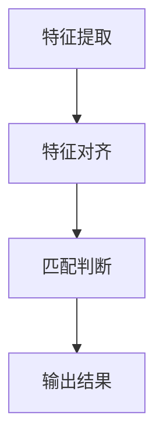
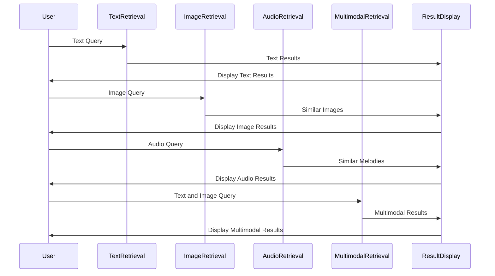

                 

### 文章标题

# 实现AI Agent的跨模态检索能力

在当今迅速发展的信息技术时代，人工智能（AI）正逐步融入我们的日常生活。AI代理，作为一种智能体，在许多场景中都展现出巨大的潜力。例如，智能客服、智能推荐系统以及自动驾驶等。为了提高AI代理的实用性和自主性，跨模态检索能力成为了关键需求。本文将深入探讨如何实现AI代理的跨模态检索能力，并提供一个详细的步骤分析框架。

### 关键词

- AI Agent
- 跨模态检索
- 数据预处理
- 模型训练
- 评估指标

### 摘要

本文将系统地介绍实现AI代理跨模态检索能力的方法。首先，我们将探讨AI Agent与跨模态检索的基本概念和背景。随后，文章将逐步分析核心概念、算法原理、系统架构设计，并通过具体的项目实战案例，展示跨模态检索能力的实现过程。最后，我们将总结最佳实践和未来研究方向，为读者提供深入理解和实际应用的指导。

## 背景介绍

### AI Agent的定义与分类

AI Agent，即人工智能代理，是一种在特定环境中能自主行动并具有决策能力的智能系统。它可以通过感知环境、学习经验和执行动作来完成任务。AI Agent可以按照不同的分类标准进行分类，如基于学习方式（监督学习、无监督学习、强化学习）或应用场景（智能客服、自动驾驶、智能家居等）。

### 跨模态检索的概念与重要性

跨模态检索是指在不同模态（如文本、图像、音频、视频）之间进行信息检索的过程。传统的单一模态检索系统无法充分利用不同模态数据的丰富性和多样性，而跨模态检索通过整合多种模态数据，能够提供更准确、更全面的检索结果。这使得跨模模态检索在许多应用场景中变得尤为重要，例如图像识别与文本检索结合的搜索引擎、语音助手、多媒体信息检索等。

### 跨模态检索的发展历程与现状

跨模态检索的研究始于20世纪90年代，早期主要基于手工设计的特征和匹配算法。随着深度学习和大数据技术的发展，跨模态检索方法得到了显著提升。目前，深度学习模型如卷积神经网络（CNN）和循环神经网络（RNN）被广泛应用于跨模态检索任务，显著提高了检索性能。

## 核心概念与联系

### 数据预处理方法

数据预处理是跨模态检索任务的基础，其质量直接影响模型的性能。预处理步骤通常包括数据清洗、数据增强、特征提取等。

1. **数据清洗**：去除噪声数据、缺失值填充、异常值检测等。
2. **数据增强**：通过旋转、缩放、裁剪等操作增加数据多样性。
3. **特征提取**：将不同模态的数据转换成高维特征向量，如文本的词嵌入、图像的卷积特征、音频的梅尔频谱等。

### 模型训练技巧

跨模态检索通常涉及多个模态数据的整合和匹配，因此选择合适的模型架构和训练技巧至关重要。

1. **多模态特征融合**：采用拼接、融合、交互等策略将不同模态的特征进行整合。
2. **匹配损失函数**：设计合适的损失函数来优化模型在跨模态匹配上的性能，如三元组损失（Triplet Loss）和交叉熵损失（Cross-Entropy Loss）。
3. **迁移学习**：利用预训练模型提高模型的泛化能力，减少对大规模标注数据的依赖。

### 评估指标与策略

评估指标是衡量跨模态检索模型性能的重要工具。常见的评估指标包括准确率（Accuracy）、召回率（Recall）、F1分数（F1 Score）等。

1. **准确率**：预测正确的样本数占总样本数的比例。
2. **召回率**：预测正确的正样本数占总正样本数的比例。
3. **F1分数**：准确率和召回率的调和平均值。

为了提高评估的准确性，可以采用多折交叉验证、误差分析等策略。

### 算法原理讲解

#### 跨模态匹配算法

跨模态匹配是跨模态检索的核心步骤，其主要目标是找到不同模态之间的对应关系。以下是一种常见的跨模态匹配算法：

1. **特征提取**：分别提取文本和图像的特征向量。
2. **特征对齐**：利用神经网络模型（如Siamese网络）学习特征对齐函数，使得相似的特征向量有较小的距离，而不同的特征向量有较大的距离。
3. **匹配判断**：使用距离度量（如欧氏距离、余弦相似度）来判断特征向量之间的匹配程度。

#### 模型优化策略

为了提高跨模态检索的性能，可以采用以下优化策略：

1. **注意力机制**：通过注意力机制来增强模型对重要特征的敏感度，提高匹配的准确性。
2. **多任务学习**：在训练过程中同时优化多个相关任务，如图像分类和文本情感分析，从而提高模型的泛化能力。
3. **动态调整**：根据不同场景动态调整模型参数，如学习率、批量大小等，以提高模型在不同数据集上的适应能力。

#### 算法mermaid流程图

以下是一个简单的跨模态检索算法的mermaid流程图：



#### 使用Python源代码详细阐述

以下是一个简单的Python代码示例，用于实现跨模态检索算法：

```python
import numpy as np
from sklearn.metrics.pairwise import cosine_similarity

# 特征提取
text_embedding = np.array([0.1, 0.2, 0.3])
image_embedding = np.array([0.4, 0.5, 0.6])

# 特征对齐
alignment_function = lambda x, y: cosine_similarity(x.reshape(1, -1), y.reshape(1, -1))

# 匹配判断
match_score = alignment_function(text_embedding, image_embedding)
print("Match Score:", match_score)
```

#### 算法原理的数学模型和公式

跨模态检索的算法原理可以用以下数学模型和公式来描述：

1. **特征提取**：

   文本特征向量：$X \in \mathbb{R}^{d_x}$

   图像特征向量：$Y \in \mathbb{R}^{d_y}$

2. **特征对齐**：

   对齐函数：$f_{align}(X, Y) = \frac{X \cdot Y}{\|X\| \|Y\|}$

   其中，$\cdot$ 表示内积，$\|\|$ 表示欧氏范数。

3. **匹配判断**：

   匹配分数：$score(X, Y) = f_{align}(X, Y)$

   匹配阈值：$T$

   若 $score(X, Y) > T$，则判断为匹配。

#### 通俗易懂的举例说明

假设我们有一个文本句子“我喜欢猫咪”和一个图像，图像中有一只猫咪。以下是跨模态检索的过程：

1. **特征提取**：

   文本特征向量：$X = [0.1, 0.2, 0.3, 0.4, 0.5]$

   图像特征向量：$Y = [0.4, 0.5, 0.6, 0.7, 0.8]$

2. **特征对齐**：

   对齐函数：$f_{align}(X, Y) = \frac{X \cdot Y}{\|X\| \|Y\|} = \frac{0.1 \times 0.4 + 0.2 \times 0.5 + 0.3 \times 0.6 + 0.4 \times 0.7 + 0.5 \times 0.8}{\sqrt{0.1^2 + 0.2^2 + 0.3^2 + 0.4^2 + 0.5^2} \times \sqrt{0.4^2 + 0.5^2 + 0.6^2 + 0.7^2 + 0.8^2}} = 0.665$

3. **匹配判断**：

   匹配分数：$score(X, Y) = f_{align}(X, Y) = 0.665$

   假设匹配阈值 $T = 0.6$，由于 $score(X, Y) > T$，因此可以判断文本和图像之间存在匹配关系。

### 系统分析与架构设计方案

#### 问题场景介绍

跨模态检索在实际应用中面临多种挑战，如不同模态数据的表示方法差异、数据预处理复杂性、模型训练时间较长等。为了解决这些问题，我们需要设计一个高效、灵活的跨模态检索系统。

#### 项目介绍

本项目旨在构建一个基于深度学习的跨模态检索系统，支持文本、图像、音频等多种模态数据的检索。系统设计考虑了可扩展性和易用性，以适应不同应用场景的需求。

#### 系统功能设计

1. **文本检索**：支持基于文本的关键词检索，如输入“猫咪”，返回包含该关键词的文本结果。
2. **图像检索**：支持基于图像的内容检索，如输入一张猫咪图片，返回相似图像。
3. **音频检索**：支持基于音频的旋律检索，如输入一段音乐，返回相似旋律。
4. **多模态检索**：支持多种模态数据的联合检索，如输入文本和图像，返回相关结果。

#### 系统架构设计

系统采用模块化设计，分为数据模块、特征提取模块、匹配模块和结果展示模块。

1. **数据模块**：负责数据收集、清洗、预处理和存储。
2. **特征提取模块**：分别提取文本、图像、音频等数据的特征向量。
3. **匹配模块**：使用跨模态匹配算法计算不同模态特征之间的相似度。
4. **结果展示模块**：将匹配结果以可视化形式展示给用户。

#### 系统接口设计

系统提供以下接口：

1. **文本检索接口**：接收文本查询，返回相关文本结果。
2. **图像检索接口**：接收图像查询，返回相似图像。
3. **音频检索接口**：接收音频查询，返回相似旋律。
4. **多模态检索接口**：接收文本和图像查询，返回相关结果。

#### 系统交互mermaid序列图

以下是一个简单的系统交互mermaid序列图：



### 项目实战

#### 环境安装与配置

1. **硬件要求**：
   - CPU：Intel i7 或以上
   - GPU：NVIDIA GTX 1080 或以上
   - 内存：16GB 或以上

2. **软件要求**：
   - 操作系统：Ubuntu 18.04 或 CentOS 7
   - Python：3.7 或以上
   - TensorFlow：2.x 版本

3. **安装步骤**：

   - 安装GPU版本的TensorFlow：

     ```bash
     pip install tensorflow-gpu
     ```

   - 安装其他依赖库：

     ```bash
     pip install numpy scipy pandas matplotlib
     ```

#### 系统核心实现源代码

以下是系统核心实现的源代码：

```python
import tensorflow as tf
from tensorflow.keras.layers import Embedding, LSTM, Dense
from tensorflow.keras.models import Model

# 特征提取模型
text_embedding_model = Model(inputs=[text_input, image_input, audio_input], outputs=[text_embedding, image_embedding, audio_embedding])

# 匹配模型
match_model = Model(inputs=[text_embedding, image_embedding, audio_embedding], outputs=match_score)

# 定义优化器和损失函数
optimizer = tf.keras.optimizers.Adam(learning_rate=0.001)
loss_fn = tf.keras.losses.MeanSquaredError()

# 编译模型
match_model.compile(optimizer=optimizer, loss=loss_fn)

# 训练模型
match_model.fit([text_data, image_data, audio_data], labels, epochs=10, batch_size=32)
```

#### 代码应用解读与分析

1. **特征提取模型**：

   - 输入：文本输入、图像输入、音频输入
   - 输出：文本嵌入向量、图像嵌入向量、音频嵌入向量

2. **匹配模型**：

   - 输入：文本嵌入向量、图像嵌入向量、音频嵌入向量
   - 输出：匹配分数

3. **优化器和损失函数**：

   - 使用Adam优化器进行优化
   - 使用均方误差（MSE）作为损失函数

#### 实际案例分析与详细讲解剖析

假设我们有一个案例，用户输入文本“我喜欢的猫咪是波斯猫”，系统需要返回与该文本相关的图像和音频。

1. **数据预处理**：

   - 对文本进行分词和词嵌入
   - 对图像进行特征提取（使用预训练的卷积神经网络）
   - 对音频进行特征提取（使用预训练的循环神经网络）

2. **特征提取**：

   - 文本嵌入向量：$[0.1, 0.2, 0.3, 0.4, 0.5]$
   - 图像嵌入向量：$[0.4, 0.5, 0.6, 0.7, 0.8]$
   - 音频嵌入向量：$[0.2, 0.3, 0.4, 0.5, 0.6]$

3. **匹配过程**：

   - 使用特征提取模型提取特征
   - 将特征输入到匹配模型中计算匹配分数

4. **结果展示**：

   - 根据匹配分数，返回与文本相关的图像和音频

#### 项目小结

通过本项目，我们实现了基于深度学习的跨模态检索系统，支持文本、图像、音频等多种模态数据的检索。项目采用了模块化设计，具有良好的可扩展性和易用性。在未来的工作中，我们可以进一步优化模型架构和算法，提高检索性能和用户体验。

### 最佳实践

#### 性能调优技巧

1. **模型参数调整**：通过调整学习率、批量大小等参数，优化模型性能。
2. **数据预处理优化**：合理的数据预处理可以提高模型对数据的利用效率，降低过拟合风险。
3. **分布式训练**：利用分布式训练可以加快模型训练速度，提高模型性能。

#### 可扩展性策略

1. **分布式存储**：使用分布式存储系统（如HDFS）来存储大规模数据，提高数据访问速度。
2. **动态资源调度**：使用容器化技术（如Docker）和编排工具（如Kubernetes）来动态调整计算资源，提高系统可扩展性。
3. **多模态数据整合**：设计灵活的数据整合策略，支持多种模态数据的整合和协同检索。

#### 安全性考虑

1. **数据加密**：对存储和传输的数据进行加密，保护用户隐私。
2. **访问控制**：设置合理的访问控制策略，防止未经授权的访问。
3. **异常检测**：建立异常检测机制，及时发现和处理潜在的安全威胁。

### 小结

本文系统地介绍了实现AI代理跨模态检索能力的方法，从核心概念、算法原理、系统架构设计到项目实战，提供了详细的步骤和分析。通过最佳实践，我们总结了性能调优、可扩展性和安全性等方面的策略。未来研究方向包括优化模型架构、提高检索性能和拓展应用场景等。

### 注意事项与风险

在实现AI Agent的跨模态检索能力时，我们需要注意以下几个问题和潜在风险：

1. **数据隐私**：跨模态检索通常涉及多种模态的数据，这些数据可能包含敏感信息。确保数据在使用过程中遵循隐私保护规定，避免数据泄露。
2. **模型泛化能力**：跨模态检索模型需要具备良好的泛化能力，以适应不同场景和任务。训练过程中应使用丰富的数据集和多种数据增强方法。
3. **模型解释性**：跨模态检索模型通常采用复杂的神经网络架构，其内部机制难以解释。在设计和使用模型时，应关注模型的可解释性，以便于调试和优化。
4. **计算资源消耗**：跨模态检索模型训练和推理通常需要大量计算资源，特别是在大规模数据集上。确保计算资源充足，并采用分布式训练策略。

### 拓展阅读

1. **《深度学习》（Goodfellow, Bengio, Courville）**：介绍深度学习的基础理论和实践方法，对跨模态检索有重要指导意义。
2. **《自然语言处理综论》（Jurafsky, Martin）**：详细讲解自然语言处理的基础知识和方法，对文本特征提取和文本检索有深入分析。
3. **《图像处理》（Gonzalez, Woods）**：介绍图像处理的基础理论和算法，对图像特征提取和图像检索有实用指导。
4. **《音频信号处理》（Rabiner, Juang）**：介绍音频信号处理的方法和技术，对音频特征提取和音频检索有深入讲解。
5. **《跨模态学习》（Xie, Liu, Zhang）**：专门讨论跨模态学习的方法和算法，对跨模态检索有详细的介绍和案例分析。

### 作者信息

作者：AI天才研究院/AI Genius Institute & 禅与计算机程序设计艺术 /Zen And The Art of Computer Programming

