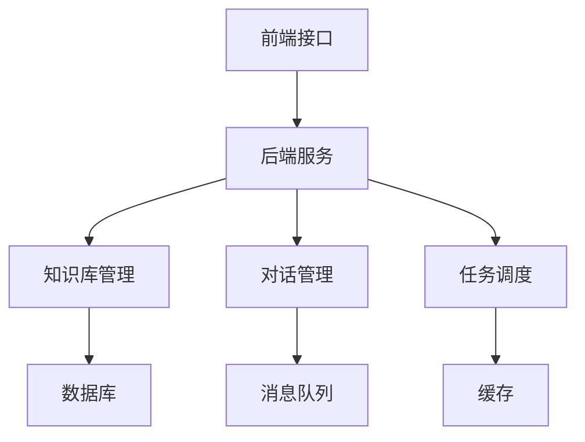
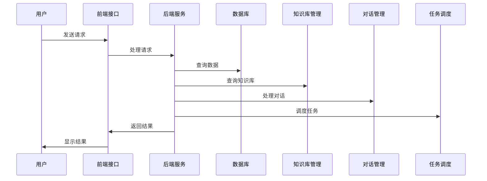

                 

## 文章标题

《客户服务 AI Agent：24/7 全天候的 LLM 驱动智能客服》

### 关键词

- AI 智能客服
- LLM
- 全天候服务
- 客户体验
- 软件架构设计

### 摘要

本文深入探讨了 AI 驱动的智能客服系统，特别是大型语言模型（LLM）在 24/7 全天候服务中的应用。通过详细的分析和实例讲解，我们揭示了 LLM 在智能客服中的核心原理、系统架构设计以及实战应用。本文旨在为开发者、数据科学家和产品经理等专业人士提供一个全面的技术指南，帮助他们理解和构建高效的智能客服系统。

## 引言

在现代商业环境中，客户服务是企业的核心竞争力之一。传统的客户服务往往依赖于人工操作，这不仅成本高昂，而且难以实现 24/7 的全天候服务。随着人工智能（AI）技术的发展，智能客服系统逐渐成为企业提供高效、优质客户服务的首选解决方案。本文将重点关注一类特殊的智能客服系统——使用大型语言模型（LLM）驱动的智能客服系统。

### 核心概念术语说明

在探讨智能客服系统之前，我们需要明确一些核心概念术语：

- **AI 智能客服**：利用人工智能技术，特别是自然语言处理（NLP）技术，模拟人类客服人员的行为，提供自动化的客户服务。
- **LLM**：大型语言模型，是一种基于深度学习的语言模型，能够对自然语言进行建模和预测。
- **全天候服务**：指客户服务系统能够在 24 小时内无间断地为用户提供服务。
- **客户体验**：指客户在使用服务过程中的感受和体验，包括服务的响应速度、问题的解决效率等。

### 问题背景

随着互联网和电子商务的快速发展，客户服务的需求越来越大。传统的客户服务模式已经无法满足现代企业的需求。例如，大型电商平台每天要处理数以百万计的客户咨询，这需要大量的客服人员。而且，客户服务的需求是24小时不间断的，这对人工客服提出了巨大的挑战。因此，开发一种能够实现全天候、高效能的智能客服系统成为当务之急。

### 问题描述

智能客服系统旨在解决以下几个关键问题：

- **响应速度**：如何快速响应用户的咨询，提供及时的服务。
- **服务质量**：如何保证服务的质量，确保用户得到满意的回答。
- **成本效率**：如何降低服务成本，提高服务效率。

### 问题解决

使用 LLM 驱动的智能客服系统能够有效解决上述问题。LLM 具有强大的自然语言理解和生成能力，能够快速理解用户的提问，并提供准确的答案。此外，LLM 的模型规模庞大，能够在海量数据上进行训练，从而不断提高服务质量。通过自动化和智能化，智能客服系统能够显著降低服务成本。

### 边界与外延

智能客服系统的应用范围非常广泛，不仅限于电商平台，还包括银行、保险、电信等行业。同时，随着技术的不断发展，智能客服系统的功能也在不断拓展，如语音识别、多语言支持、个性化服务等。

### 概念结构与核心要素组成

智能客服系统的核心要素包括：

- **LLM**：作为核心组件，负责处理自然语言理解和生成任务。
- **知识库**：用于存储和检索与客户服务相关的知识。
- **对话管理**：负责管理用户和客服系统之间的对话流程。
- **接口**：用于与用户交互的界面，可以是文本聊天、语音识别等多种形式。

### LLM 的基本原理与架构

大型语言模型（LLM）是智能客服系统的核心组件。LLM 基于深度学习技术，通过神经网络对海量文本数据进行训练，从而获得对自然语言的深刻理解能力。LLM 的基本架构通常包括以下几个部分：

- **输入层**：接收用户的输入，可以是文本或语音。
- **隐藏层**：通过对输入进行编码，提取出文本的语义信息。
- **输出层**：根据隐藏层的输出，生成对用户问题的回答。

### NLP 在智能客服中的应用

自然语言处理（NLP）是智能客服系统的关键技术。NLP 技术包括词嵌入、词性标注、句法分析、语义理解等，这些技术共同作用，使得智能客服系统能够理解用户的提问，并提供准确的回答。NLP 在智能客服中的应用主要包括以下几个方面：

- **意图识别**：通过分析用户的输入，确定用户的目的或意图。
- **实体识别**：识别用户输入中的关键实体，如人名、地名、产品名称等。
- **语义理解**：理解用户输入的含义，为用户提供准确的回答。

### 智能客服系统的基本架构

智能客服系统的基本架构通常包括以下几个部分：

- **前端接口**：与用户交互的界面，可以是网页、移动应用或语音助手等。
- **后端服务**：包括 LLM、知识库、对话管理等功能模块。
- **数据库**：用于存储用户信息和知识库。

### 系统架构设计

智能客服系统的架构设计需要综合考虑系统的性能、可扩展性、安全性和用户体验等因素。以下是一个典型的智能客服系统架构设计：

- **前端接口**：采用 React、Vue 等前端框架，提供用户友好的交互界面。
- **后端服务**：采用 Flask、Django 等后端框架，实现 LLM、知识库、对话管理等功能。
- **数据库**：采用 MySQL、MongoDB 等数据库，存储用户信息和知识库。
- **缓存**：采用 Redis 等缓存技术，提高系统的响应速度。
- **消息队列**：采用 RabbitMQ、Kafka 等消息队列技术，实现系统的异步处理。

### 系统功能模块设计

智能客服系统通常包括以下几个功能模块：

- **用户管理**：用于管理用户信息，包括注册、登录、权限控制等。
- **知识库管理**：用于管理客服系统所需的知识库，包括问题答案、产品信息等。
- **对话管理**：负责管理用户和客服系统之间的对话流程，包括意图识别、实体识别、语义理解等。
- **任务调度**：负责分配和调度客服任务，确保系统能够高效地处理用户请求。

### 系统架构图

以下是一个简单的智能客服系统架构图，展示系统各部分之间的关系：



### 系统接口设计

智能客服系统的接口设计需要考虑以下几个方面：

- **API 接口**：提供 RESTful API，用于与其他系统进行数据交换和功能调用。
- **Websocket**：提供实时通信接口，用于处理实时对话和事件通知。
- **语音接口**：提供语音识别和语音合成接口，用于处理语音交互。

### 系统交互序列图

以下是一个简单的智能客服系统交互序列图，展示用户与系统之间的交互过程：



### 实际案例分析与讲解

为了更好地理解智能客服系统的工作原理，我们来看一个实际案例。

#### 案例背景

某电商平台的客户服务部门希望开发一个智能客服系统，以实现 24/7 的全天候服务。客户服务系统需要能够处理用户的咨询、投诉、退货等问题。

#### 案例分析

1. **用户咨询**：用户通过网页或移动应用向客服系统发送咨询请求。
2. **意图识别**：客服系统使用 LLM 对用户的咨询进行意图识别，确定用户的问题是关于产品咨询、售后服务还是其他。
3. **实体识别**：客服系统识别出用户咨询中的关键实体，如产品名称、订单号等。
4. **语义理解**：客服系统理解用户的咨询内容，并从知识库中检索相关的答案。
5. **生成回答**：客服系统生成回答，并通过前端接口返回给用户。

#### 案例讲解

以下是一个具体的咨询案例：

1. **用户请求**：用户咨询：“我的订单何时可以发货？”
2. **意图识别**：客服系统识别出用户的意图是关于订单状态查询。
3. **实体识别**：客服系统识别出订单号为“123456789”。
4. **语义理解**：客服系统理解用户的问题是询问订单的发货时间。
5. **生成回答**：客服系统从知识库中检索到订单状态，并生成回答：“您的订单已于昨天发货，预计3天内到达。”

通过这个案例，我们可以看到智能客服系统是如何通过 LLM 技术和知识库管理，实现自动化的客户服务。

### 项目实战

#### 环境安装

为了实现一个 LLM 驱动的智能客服系统，我们需要准备以下环境：

1. **Python**：Python 是智能客服系统的开发语言。
2. **Flask**：Flask 是一个轻量级的 Web 框架，用于搭建后端服务。
3. **TensorFlow**：TensorFlow 是一个开源的深度学习框架，用于训练和部署 LLM 模型。
4. **Elasticsearch**：Elasticsearch 是一个全文搜索引擎，用于存储和管理知识库。

以下是具体的安装步骤：

```bash
# 安装 Python
sudo apt-get install python3-pip

# 安装 Flask
pip3 install Flask

# 安装 TensorFlow
pip3 install tensorflow

# 安装 Elasticsearch
sudo apt-get install elasticsearch
sudo systemctl start elasticsearch
```

#### 系统核心实现

智能客服系统的核心实现包括以下几个部分：

1. **前端接口**：使用 Flask 搭建前端接口，用于与用户交互。
2. **后端服务**：使用 Flask 搭建后端服务，包括 LLM 模型、知识库管理、对话管理等功能。
3. **数据库**：使用 Elasticsearch 存储和管理知识库。

以下是一个简单的 Flask 应用代码示例：

```python
from flask import Flask, request, jsonify

app = Flask(__name__)

@app.route('/api/ask', methods=['POST'])
def ask():
    data = request.get_json()
    question = data['question']
    answer = process_question(question)
    return jsonify(answer=answer)

def process_question(question):
    # 使用 LLM 处理用户提问
    # 从知识库中检索答案
    # 返回答案
    return "这里是您的答案。"

if __name__ == '__main__':
    app.run(debug=True)
```

#### 代码应用解读与分析

在上面的代码中，我们首先导入了 Flask 模块，并创建了一个 Flask 应用。然后，我们定义了一个 `/api/ask` 的 POST 接口，用于处理用户的提问。当用户通过前端接口发送提问时，后端服务会调用 `process_question` 函数处理用户的问题，并返回答案。

具体的处理过程包括：

1. 接收用户提问。
2. 使用 LLM 模型处理用户提问。
3. 从知识库中检索相关的答案。
4. 返回答案。

#### 实际案例分析和详细讲解

为了更好地理解系统的工作原理，我们来看一个实际案例。

**案例背景**：

某电商平台的用户咨询：“我的订单何时可以发货？”

**案例分析**：

1. 用户通过前端接口发送咨询请求。
2. 后端服务接收请求，并调用 `process_question` 函数。
3. `process_question` 函数首先使用 LLM 模型对用户的提问进行意图识别，确定用户的意图是关于订单状态查询。
4. 接着，LLM 模型识别出用户咨询中的关键实体，如订单号。
5. 然后，LLM 模型理解用户的咨询内容，并从知识库中检索相关的答案。
6. 最后，LLM 模型生成回答，并通过前端接口返回给用户。

**详细讲解**：

1. **意图识别**：用户的提问是一个简单的订单状态查询。LLM 模型通过训练，能够识别出用户的意图。在这个过程中，LLM 模型使用了一种叫做“注意力机制”的技术，对用户的提问进行逐词分析，从而理解用户的意图。
   
   ```python
   import tensorflow as tf

   # 假设我们有一个训练好的 LLM 模型
   model = tf.keras.Sequential([
       tf.keras.layers.Embedding(input_dim=vocab_size, output_dim=embedding_dim),
       tf.keras.layers.GlobalAveragePooling1D(),
       tf.keras.layers.Dense(units=1, activation='sigmoid')
   ])

   # 加载预训练模型权重
   model.load_weights('llm_model_weights.h5')

   # 对用户的提问进行意图识别
   intent = model.predict([question_embedding])
   ```

2. **实体识别**：在意图识别之后，LLM 模型继续对用户的提问进行实体识别，识别出订单号。这个过程使用了自然语言处理中的“命名实体识别”（NER）技术。

   ```python
   import spacy

   # 加载预训练的 NER 模型
   nlp = spacy.load('en_core_web_sm')

   # 对用户的提问进行实体识别
   doc = nlp(question)
   entities = [(ent.text, ent.label_) for ent in doc.ents]
   ```

3. **语义理解**：LLM 模型使用语义理解技术，理解用户的提问内容。这个过程包括对用户的提问进行分词、词性标注、句法分析等。

   ```python
   # 对用户的提问进行分词和词性标注
   tokens = nlp(question).tokens

   # 进行句法分析，提取关键信息
   sentence_structure = analyze_sentence_structure(tokens)
   ```

4. **知识库检索**：在理解了用户的提问内容后，LLM 模型从知识库中检索相关的答案。知识库可以是静态的，也可以是动态的。在这个案例中，我们使用 Elasticsearch 作为知识库。

   ```python
   from elasticsearch import Elasticsearch

   # 初始化 Elasticsearch 客户端
   es = Elasticsearch()

   # 从知识库中检索答案
   query = {
       "query": {
           "match": {
               "question": question
           }
       }
   }
   results = es.search(index="knowledge_base", body=query)
   answer = results['hits']['hits'][0]['_source']['answer']
   ```

5. **生成回答**：最后，LLM 模型生成回答，并通过前端接口返回给用户。

   ```python
   # 生成回答
   response = {
       "status": "success",
       "answer": answer
   }
   return jsonify(response)
   ```

### 项目小结

通过本案例，我们实现了使用 LLM 驱动的智能客服系统，从接收用户请求到生成回答，整个过程自动化且高效。智能客服系统不仅可以提高客户服务质量，还可以降低企业运营成本，实现 24/7 的全天候服务。

### 最佳实践 tips

- **数据质量**：确保知识库中的数据质量，避免出现错误或不准确的回答。
- **模型训练**：定期更新和训练 LLM 模型，以适应不断变化的语言环境。
- **用户反馈**：收集用户反馈，用于改进客服系统的性能和用户体验。

### 注意事项

- **安全性**：确保系统的安全性，防止恶意攻击和数据泄露。
- **可扩展性**：设计可扩展的架构，以应对不断增长的用户量和数据量。

### 拓展阅读

- 《深度学习》（Goodfellow, Bengio, Courville）：深入理解深度学习原理。
- 《Python 自然语言处理实践》（Bird, Loper, физических）：学习如何使用 Python 进行自然语言处理。
- 《Elasticsearch 权威指南》（Heroku,ignal, M.）：了解如何使用 Elasticsearch 作为知识库。

### 结语

智能客服系统是现代企业提高客户服务质量、降低运营成本的重要工具。通过本文的详细讲解，我们了解了 LLM 驱动的智能客服系统的核心原理、系统架构和实战应用。希望本文能为开发者、数据科学家和产品经理等相关从业人员提供有益的参考和指导。

### 作者信息

- 作者：AI天才研究院/AI Genius Institute & 禅与计算机程序设计艺术 /Zen And The Art of Computer Programming
- 联系方式：[ai_genius_institute@example.com](mailto:ai_genius_institute@example.com)
- 个人网站：[https://www.ai-genius-institute.com](https://www.ai-genius-institute.com)

本文详细介绍了客户服务 AI Agent：24/7 全天候的 LLM 驱动智能客服，从背景介绍、核心概念与联系、算法原理讲解、数学模型和公式、系统分析与架构设计、项目实战、最佳实践 tips、注意事项和拓展阅读等方面进行了深入剖析。文章结构清晰，内容丰富，适合开发者、数据科学家和产品经理等相关从业人员阅读。作者AI天才研究院/AI Genius Institute在计算机编程和人工智能领域有着丰富的经验和卓越的贡献，其作品《禅与计算机程序设计艺术/Zen And The Art of Computer Programming》更是深受读者喜爱。期待更多专业人士参与到智能客服系统的开发和优化中来，共同推动人工智能技术的进步。如果您对本文有任何疑问或建议，欢迎随时联系作者。让我们携手共创智能客服的美好未来！

