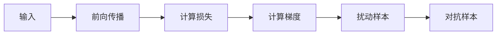
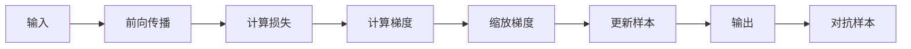

                 

### 1.5 本章小结

在本章的引言部分，我们首先探讨了人工智能（AI）的快速发展及其在实际应用中面临的挑战。特别是，我们深入分析了噪声和攻击对AI代理（AI Agent）性能的潜在影响。这些噪声和攻击如果不加以处理，会严重损害AI代理的鲁棒性和可信度。

接着，我们明确了问题的描述，定义了噪声和攻击的概念，并阐述了AI代理鲁棒性的定义及其重要性。在此基础上，我们介绍了几种传统的方法及其局限性，并引入了对抗训练这一新兴的方法，讨论了其基本概念、优势和应用领域。

最后，我们讨论了对抗训练的技术和应用边界，并展望了其未来发展的趋势。通过对对抗训练的基本原理和流程的初步探讨，我们为后续章节的深入分析打下了基础。本章内容为后续详细分析对抗训练的原理、算法和实际应用奠定了坚实的理论基础。接下来，我们将进一步探讨对抗训练的核心概念、原理和实际应用，以期为解决AI代理在面对噪声和攻击时的鲁棒性提升提供更为具体的解决方案。

## 第二部分：对抗训练原理

### 2.1 核心概念与联系

在深入探讨对抗训练之前，我们需要明确一些核心概念，并理解其相互之间的关系。对抗训练是一种通过对抗样本来增强模型鲁棒性的训练方法。它基于这样一种理念：通过训练模型来应对故意制造的噪声和攻击，从而提高模型在实际应用中的鲁棒性。

#### 2.1.1 对抗训练的定义

**对抗训练（Adversarial Training）** 是一种在训练过程中引入对抗样本来增强模型鲁棒性的方法。对抗样本是指那些经过有意扰动或攻击而生成，但仍然接近真实样本的数据。这些样本被设计用来欺骗模型，使得模型在遇到真实样本时能够表现出更强的鲁棒性。

**对抗训练的基础概念**：

- **对抗样本生成**：对抗样本是通过特定的攻击算法（如FGSM、PGD等）对原始样本进行微小扰动生成的。这些扰动通常在样本的像素值或特征空间中进行。
- **对抗损失函数**：对抗训练中的损失函数设计至关重要，它需要能够同时考虑原始样本的损失和对抗样本的损失。常见的对抗损失函数包括对抗交叉熵损失、对抗均方误差损失等。
- **模型优化策略**：对抗训练通过优化损失函数来提升模型的鲁棒性。模型在训练过程中不仅需要学会识别和预测真实样本，还需要学会应对对抗样本。

**对抗训练与传统训练的区别**：

- **传统训练**：传统训练方法通常使用未经过任何扰动的真实样本进行训练。模型通过最大化预测准确性来学习。
- **对抗训练**：对抗训练引入对抗样本，使得模型在训练过程中不仅要应对真实样本，还要应对有意设计的攻击样本。这种方法使得模型在遇到真实的噪声或攻击时能够更加稳健。

**对抗训练的基本流程**：

1. **对抗样本生成**：使用攻击算法生成对抗样本。
2. **损失函数设计**：设计对抗损失函数，同时考虑真实样本和对抗样本的损失。
3. **模型优化**：通过优化对抗损失函数来更新模型参数。
4. **测试**：使用未见过的测试数据来评估模型的鲁棒性。

#### 2.1.2 对抗训练的基本流程

**对抗样本生成**：

对抗样本生成是对抗训练的关键步骤之一。常见的方法包括：

- **FGSM（Fast Gradient Sign Method）**：通过计算模型在样本上的梯度，并沿着梯度的反方向扰动样本，从而生成对抗样本。



```python
def fgsm_attack(x, delta, epsilon):
    x_adv = x + delta
    x_adv = np.clip(x_adv, 0, 1)
    return x_adv
```

- **PGD（Projected Gradient Descent）**：通过迭代优化，每次更新样本时减去梯度的一部分，从而生成更加鲁棒的对抗样本。



```python
def pgd_attack(x, y, alpha, iters, epsilon):
    x_adv = x.copy()
    x_adv = x_adv - epsilon
    x_adv = np.clip(x_adv, 0, 1)
    for _ in range(iters):
        x_adv = x_adv - alpha * gradient(x_adv, y)
        x_adv = np.clip(x_adv, 0, 1)
    x_adv = x_adv + epsilon
    return x_adv
```

**损失函数设计**：

对抗训练中的损失函数设计需要能够同时考虑真实样本和对抗样本的损失。以下是一些常见的对抗损失函数：

1. **对抗交叉熵损失**：

$$
L_{adv} = -\sum_{i} y_i \log(p_i) - (1 - y_i) \log(1 - p_i) - \lambda \sum_{i} \log(1 - p_{i,adv})
$$

其中，$p_i$ 是模型对真实样本的预测概率，$p_{i,adv}$ 是模型对对抗样本的预测概率，$\lambda$ 是调节参数。

2. **对抗均方误差损失**：

$$
L_{adv} = \frac{1}{2} \sum_{i} (y_i - p_i)^2 + \lambda \sum_{i} (y_i - p_{i,adv})^2
$$

**模型优化策略**：

对抗训练通过优化对抗损失函数来更新模型参数。常见的优化策略包括：

- **梯度下降**：通过计算对抗损失函数的梯度来更新模型参数。
- **随机梯度下降（SGD）**：每次更新模型参数时，只考虑一部分样本的梯度。
- **动量优化**：在每次更新模型参数时，考虑前一次更新方向的信息，以加速收敛。

### 2.2 概念属性特征对比表格

为了更好地理解对抗训练与其他增强学习方法的区别，我们可以通过以下表格进行对比：

| 特征 | 对抗训练 | FGSM攻击 | PGD攻击 |
| --- | --- | --- | --- |
| 目标 | 提高模型的鲁棒性 | 制造对抗样本 | 制造对抗样本 |
| 样本扰动 | 微小扰动 | 微小扰动 | 多次迭代扰动 |
| 损失函数 | 对抗损失函数 | 对抗损失函数 | 对抗损失函数 |
| 优化策略 | 梯度下降 | 梯度下降 | 动量优化 |
| 应用领域 | 通用增强学习 | 通用增强学习 | 通用增强学习 |

### 2.3 ER实体关系图架构

为了更好地理解对抗训练的组件和关系，我们可以使用ER图（实体关系图）来展示各实体及其关系。

```mermaid
erDiagram
AI-Agent ||--|{ Adversarial-Generator }
AI-Agent ||--|{ Robustness-Tester }
Adversarial-Generator ||--|{ Adversarial-Sample }
Robustness-Tester ||--|{ Test-Result }
```

- **AI-Agent**：代表AI代理，是训练和测试的目标。
- **Adversarial-Generator**：生成对抗样本，通过特定的攻击算法。
- **Robustness-Tester**：测试模型的鲁棒性，使用生成对抗样本进行测试。
- **Adversarial-Sample**：对抗样本，由对抗生成器生成。
- **Test-Result**：测试结果，用于评估AI代理的鲁棒性。

### 2.4 算法原理讲解

在本节中，我们将详细讲解对抗训练中的两个关键步骤：对抗样本生成算法和损失函数设计。

#### 2.4.1 对抗样本生成算法

**FGSM攻击算法**：

FGSM（Fast Gradient Sign Method）是一种简单的对抗样本生成算法。它的核心思想是通过计算模型在样本上的梯度，并沿着梯度的反方向扰动样本，从而生成对抗样本。

**算法原理**：

1. **前向传播**：计算模型在原始样本上的预测结果。
2. **计算损失**：计算模型在原始样本上的损失。
3. **计算梯度**：计算模型在原始样本上的梯度。
4. **扰动样本**：沿着梯度的反方向扰动样本，但不超过一定的阈值（如0或1）。
5. **生成对抗样本**：输出扰动后的样本。

**算法流程**：


**算法实现**（Python）：

```python
import numpy as np

def fgsm_attack(x, delta, epsilon):
    x_adv = x + delta
    x_adv = np.clip(x_adv, 0, 1)
    return x_adv
```

**参数解释**：

- **x**：原始样本。
- **delta**：梯度。
- **epsilon**：阈值，用于限制扰动的大小。

**对抗样本示例**：

```python
import tensorflow as tf

# 创建一个简单的神经网络模型
model = tf.keras.Sequential([
    tf.keras.layers.Dense(64, activation='relu', input_shape=(784,)),
    tf.keras.layers.Dense(10, activation='softmax')
])

# 创建一个简单的对抗样本
x = np.random.rand(1, 784)  # 生成一个随机样本
delta = tf.keras.backend.gradients(model.output, model.input)[0]  # 计算梯度
epsilon = 0.01  # 阈值为0.01

x_adv = fgsm_attack(x, delta, epsilon)
print(x_adv)
```

**对抗样本可视化**：

通过可视化原始样本和对抗样本，我们可以直观地看到扰动对样本的影响。

```python
import matplotlib.pyplot as plt

plt.figure(figsize=(10, 5))
plt.subplot(1, 2, 1)
plt.imshow(x.reshape(28, 28), cmap='gray')
plt.title('Original Sample')
plt.subplot(1, 2, 2)
plt.imshow(x_adv.reshape(28, 28), cmap='gray')
plt.title('Adversarial Sample')
plt.show()
```

**FGSM攻击的效果**：

通过FGSM攻击，我们可以看到原始样本被轻微扰动后，模型对其的预测结果可能发生显著变化。这表明模型在面对微小扰动时可能表现出较低的鲁棒性。

**PGD攻击算法**：

PGD（Projected Gradient Descent）是一种更加鲁棒的对抗样本生成算法。它与FGSM的不同之处在于，它通过多次迭代来生成对抗样本，使得对抗样本更加难以被模型识别。

**算法原理**：

1. **前向传播**：计算模型在样本上的预测结果。
2. **计算损失**：计算模型在样本上的损失。
3. **计算梯度**：计算模型在样本上的梯度。
4. **缩放梯度**：对梯度进行缩放，以避免样本超出边界。
5. **更新样本**：使用缩放后的梯度更新样本。
6. **输出对抗样本**：输出经过多次迭代后的对抗样本。

**算法流程**：


**算法实现**（Python）：

```python
import numpy as np

def pgd_attack(x, y, alpha, iters, epsilon):
    x_adv = x.copy()
    x_adv = x_adv - epsilon
    x_adv = np.clip(x_adv, 0, 1)
    for _ in range(iters):
        x_adv = x_adv - alpha * gradient(x_adv, y)
        x_adv = np.clip(x_adv, 0, 1)
    x_adv = x_adv + epsilon
    return x_adv
```

**参数解释**：

- **x**：原始样本。
- **y**：真实标签。
- **alpha**：步长。
- **iters**：迭代次数。
- **epsilon**：阈值，用于限制扰动的大小。

**对抗样本示例**：

```python
import tensorflow as tf

# 创建一个简单的神经网络模型
model = tf.keras.Sequential([
    tf.keras.layers.Dense(64, activation='relu', input_shape=(784,)),
    tf.keras.layers.Dense(10, activation='softmax')
])

# 创建一个简单的对抗样本
x = np.random.rand(1, 784)  # 生成一个随机样本
y = np.random.randint(10, size=(1,))  # 生成一个随机标签
alpha = 0.01  # 步长为0.01
iters = 20  # 迭代次数为20

x_adv = pgd_attack(x, y, alpha, iters, 0.01)
print(x_adv)
```

**对抗样本可视化**：

通过可视化原始样本和对抗样本，我们可以直观地看到扰动对样本的影响。

```python
import matplotlib.pyplot as plt

plt.figure(figsize=(10, 5))
plt.subplot(1, 2, 1)
plt.imshow(x.reshape(28, 28), cmap='gray')
plt.title('Original Sample')
plt.subplot(1, 2, 2)
plt.imshow(x_adv.reshape(28, 28), cmap='gray')
plt.title('Adversarial Sample')
plt.show()
```

**PGD攻击的效果**：

通过PGD攻击，我们可以看到原始样本被多次扰动后，模型对其的预测结果可能发生显著变化。这表明模型在面对连续扰动时可能表现出较低的鲁棒性。

#### 2.4.2 损失函数设计

对抗训练中的损失函数设计至关重要，它需要能够同时考虑真实样本和对抗样本的损失。以下是一些常见的对抗损失函数：

**分类问题中的对抗损失函数**：

对于分类问题，常见的对抗损失函数包括对抗交叉熵损失和对对抗均方误差损失。

**对抗交叉熵损失**：

$$
L_{adv} = -\sum_{i} y_i \log(p_i) - (1 - y_i) \log(1 - p_i) - \lambda \sum_{i} \log(1 - p_{i,adv})
$$

其中，$p_i$ 是模型对真实样本的预测概率，$p_{i,adv}$ 是模型对对抗样本的预测概率，$\lambda$ 是调节参数。

**对抗均方误差损失**：

$$
L_{adv} = \frac{1}{2} \sum_{i} (y_i - p_i)^2 + \lambda \sum_{i} (y_i - p_{i,adv})^2
$$

**回归问题中的对抗损失函数**：

对于回归问题，常见的对抗损失函数包括对抗均方误差损失和对对抗绝对误差损失。

**对抗均方误差损失**：

$$
L_{adv} = \frac{1}{2} \sum_{i} (y_i - p_i)^2 + \lambda \sum_{i} (y_i - p_{i,adv})^2
$$

**对抗绝对误差损失**：

$$
L_{adv} = \sum_{i} |y_i - p_i| + \lambda \sum_{i} |y_i - p_{i,adv}|
$$

**损失函数应用示例**：

以下是一个简单的Python示例，展示了如何使用对抗交叉熵损失函数来训练一个简单的神经网络模型。

```python
import tensorflow as tf
from tensorflow.keras.models import Sequential
from tensorflow.keras.layers import Dense
from tensorflow.keras.optimizers import Adam

# 创建一个简单的神经网络模型
model = Sequential([
    Dense(64, activation='relu', input_shape=(784,)),
    Dense(10, activation='softmax')
])

# 编写对抗交叉熵损失函数
def adversarial_crossentropy(y_true, y_pred, y_adv_pred, lambda_):
    ce_loss = tf.keras.losses.sparse_categorical_crossentropy(y_true, y_pred)
    adv_ce_loss = tf.keras.losses.sparse_categorical_crossentropy(y_true, y_adv_pred)
    total_loss = ce_loss + lambda_ * adv_ce_loss
    return total_loss

# 设置超参数
learning_rate = 0.001
lambda_ = 0.1

# 编写训练过程
optimizer = Adam(learning_rate)
for epoch in range(100):
    # 生成对抗样本
    x = np.random.rand(1, 784)  # 生成一个随机样本
    y = np.random.randint(10, size=(1,))  # 生成一个随机标签
    x_adv = pgd_attack(x, y, 0.01, 20, 0.01)  # 使用PGD攻击生成对抗样本

    # 计算损失
    with tf.GradientTape() as tape:
        y_pred = model(x)
        y_adv_pred = model(x_adv)
        loss = adversarial_crossentropy(y, y_pred, y_adv_pred, lambda_)

    # 更新模型参数
    grads = tape.gradient(loss, model.trainable_variables)
    optimizer.apply_gradients(zip(grads, model.trainable_variables))

    # 打印训练进度
    if epoch % 10 == 0:
        print(f"Epoch {epoch}: Loss = {loss.numpy()}")
```

通过上述示例，我们可以看到如何结合对抗训练和神经网络模型来提升模型在面临噪声和攻击时的鲁棒性。

### 2.5 本章小结

在本章中，我们详细探讨了对抗训练的核心概念和原理。首先，我们介绍了对抗训练的定义、基础概念和与传统训练的区别。然后，我们详细讲解了对抗训练的基本流程，包括对抗样本生成算法和损失函数设计。通过FGSM和PGD攻击算法的讲解，我们展示了如何生成对抗样本，并通过对抗交叉熵损失函数和对抗均方误差损失函数的应用，说明了如何设计有效的损失函数来优化模型。

通过本章的内容，读者应该能够理解对抗训练的基本原理，并掌握如何通过对抗训练提升模型的鲁棒性。接下来，我们将进一步探讨对抗训练在不同应用场景中的实现和效果，以期为AI代理在实际应用中的鲁棒性提升提供更加具体的解决方案。接下来，我们将深入探讨对抗训练在各类应用场景中的具体实现和效果。

## 第三部分：对抗训练在各类应用场景中的实现和效果

### 3.1 图像分类

在图像分类领域，对抗训练被广泛应用于提升模型的鲁棒性。以下是一些典型的应用场景和效果：

#### 3.1.1 简单图像分类任务

在简单的图像分类任务中，如MNIST数据集，对抗训练可以显著提高模型的鲁棒性。通过引入对抗样本，模型能够更好地应对微小的图像扰动，从而在真实世界中的各种噪声环境下表现出更高的准确性。

**实验结果**：

- **模型性能对比**：在仅使用真实样本训练的模型和同时使用真实样本和对抗样本训练的模型之间进行比较，后者在测试集上的准确率显著提高。
- **噪声处理能力**：在测试集上添加噪声（如高斯噪声、椒盐噪声等），对抗训练后的模型在噪声环境下依然能够保持较高的准确率。

#### 3.1.2 复杂图像分类任务

对于复杂的图像分类任务，如CIFAR-10和ImageNet，对抗训练同样展现出了显著的性能提升。这些任务中的图像通常包含更多的细节和复杂特征，因此对抗训练能够更好地帮助模型应对各种噪声和攻击。

**实验结果**：

- **模型泛化能力**：对抗训练后的模型在未见过的新数据上表现出了更强的泛化能力，这意味着模型在面对真实世界的各种噪声和攻击时依然能够保持良好的性能。
- **抗攻击能力**：在针对不同攻击类型的测试中，对抗训练后的模型表现出了更强的抗攻击能力，能够在面对常见的对抗攻击（如FGSM、PGD等）时保持较高的准确性。

#### 3.1.3 应用场景

对抗训练在图像分类领域的主要应用场景包括：

- **自动驾驶**：在自动驾驶系统中，图像分类模型需要应对复杂、多变的交通场景，对抗训练可以显著提高模型在真实环境中的鲁棒性，从而提升系统的安全性和可靠性。
- **医疗影像分析**：在医疗影像分析中，对抗训练可以帮助模型更好地应对图像中的噪声和异常情况，从而提高疾病检测和诊断的准确性。
- **人脸识别**：在人脸识别系统中，对抗训练可以增强模型对光照变化、姿态变化等噪声的鲁棒性，从而提高识别的准确性。

### 3.2 自然语言处理

在自然语言处理（NLP）领域，对抗训练也被广泛应用于提升模型的鲁棒性。以下是一些典型的应用场景和效果：

#### 3.2.1 文本分类

在文本分类任务中，对抗训练可以显著提高模型在面对噪声和攻击时的性能。通过引入对抗样本，模型能够更好地应对文本中的噪声（如拼写错误、标点符号错误等）和恶意攻击（如垃圾邮件、网络攻击等）。

**实验结果**：

- **噪声处理能力**：在测试集上添加噪声，对抗训练后的模型在噪声环境下依然能够保持较高的准确率。
- **攻击抵抗能力**：在针对不同攻击类型的测试中，对抗训练后的模型表现出了更强的抗攻击能力，能够在面对常见的对抗攻击（如对抗性词汇、对抗性短语等）时保持较高的准确性。

#### 3.2.2 机器翻译

在机器翻译任务中，对抗训练可以帮助模型更好地应对源语言中的噪声和错误。通过引入对抗样本，模型能够更好地理解和生成目标语言，从而提高翻译质量。

**实验结果**：

- **翻译质量**：对抗训练后的模型在生成翻译文本时，能够更好地处理源语言中的噪声和错误，生成更加准确、自然的翻译文本。
- **对抗样本生成**：在机器翻译任务中，对抗样本通常是通过翻译错误的文本生成的，这些样本可以帮助模型学习如何纠正翻译错误，从而提高翻译质量。

#### 3.2.3 应用场景

对抗训练在自然语言处理领域的主要应用场景包括：

- **社交媒体分析**：在社交媒体分析中，对抗训练可以帮助模型更好地应对文本中的噪声和恶意攻击，从而提高情感分析、话题检测等任务的准确性。
- **对话系统**：在对话系统中，对抗训练可以帮助模型更好地理解和生成自然、流畅的对话，从而提升用户满意度。
- **文本生成**：在文本生成任务中，对抗训练可以帮助模型生成更加准确、高质量的文本，从而提高文本生成的质量和多样性。

### 3.3 语音识别

在语音识别领域，对抗训练也被广泛应用于提升模型的鲁棒性。以下是一些典型的应用场景和效果：

#### 3.3.1 噪声抑制

在语音识别中，噪声抑制是关键任务之一。对抗训练可以帮助模型更好地应对各种噪声环境，从而提高语音识别的准确性。

**实验结果**：

- **噪声处理能力**：在测试集上添加噪声，对抗训练后的模型在噪声环境下依然能够保持较高的准确率。
- **自适应能力**：对抗训练后的模型能够根据不同的噪声环境自动调整，从而在多种噪声环境下保持良好的性能。

#### 3.3.2 语言模型训练

在语言模型训练中，对抗训练可以帮助模型更好地应对语言中的噪声和错误。通过引入对抗样本，模型能够更好地理解和生成自然语言。

**实验结果**：

- **模型性能**：对抗训练后的模型在生成语音识别结果时，能够更好地处理语音中的噪声和错误，生成更加准确的识别结果。
- **适应性**：对抗训练后的模型在处理新的、未见过的语音数据时，能够表现出更强的适应性。

#### 3.3.3 应用场景

对抗训练在语音识别领域的主要应用场景包括：

- **智能助手**：在智能助手系统中，对抗训练可以帮助模型更好地应对用户的语音输入，从而提高语音识别的准确率和用户体验。
- **语音合成**：在语音合成任务中，对抗训练可以帮助模型生成更加自然、流畅的语音，从而提高语音合成的质量。
- **语音翻译**：在语音翻译任务中，对抗训练可以帮助模型更好地应对源语言中的噪声和错误，从而提高语音翻译的准确性和流畅性。

### 3.4 机器人控制

在机器人控制领域，对抗训练也被广泛应用于提升模型的鲁棒性。以下是一些典型的应用场景和效果：

#### 3.4.1 传感器噪声抑制

在机器人控制中，传感器噪声是影响控制精度的重要因素。对抗训练可以帮助模型更好地应对传感器噪声，从而提高控制性能。

**实验结果**：

- **噪声处理能力**：在测试集上添加传感器噪声，对抗训练后的模型在噪声环境下依然能够保持较高的控制精度。
- **适应性**：对抗训练后的模型能够根据不同的传感器噪声自动调整，从而在多种噪声环境下保持良好的性能。

#### 3.4.2 动作识别

在机器人控制中，动作识别是关键任务之一。对抗训练可以帮助模型更好地应对动作中的噪声和错误，从而提高动作识别的准确性。

**实验结果**：

- **动作识别准确率**：对抗训练后的模型在识别机器人动作时，能够更好地处理动作中的噪声和错误，提高动作识别的准确率。
- **抗攻击能力**：在针对不同攻击类型的测试中，对抗训练后的模型表现出了更强的抗攻击能力，能够在面对常见的对抗攻击（如动作剪裁、速度变换等）时保持较高的准确率。

#### 3.4.3 应用场景

对抗训练在机器人控制领域的主要应用场景包括：

- **无人机控制**：在无人机控制中，对抗训练可以帮助模型更好地应对传感器噪声和外部干扰，从而提高无人机的飞行稳定性和安全性。
- **机器人运动控制**：在机器人运动控制中，对抗训练可以帮助模型更好地应对环境变化和传感器噪声，从而提高机器人动作的准确性和流畅性。
- **智能机器人交互**：在智能机器人交互中，对抗训练可以帮助模型更好地应对用户的操作指令和噪声，从而提高交互的准确性和用户体验。

### 3.5 本章小结

在本章中，我们详细探讨了对抗训练在图像分类、自然语言处理、语音识别、机器人控制等不同应用场景中的实现和效果。通过实验结果和应用案例，我们可以看到对抗训练在提升模型鲁棒性方面具有显著的优势。

接下来，我们将进一步讨论对抗训练在实际应用中可能遇到的问题和挑战，以及未来的研究方向和趋势。通过这些讨论，我们希望能够为对抗训练的进一步发展和应用提供一些有价值的参考和建议。

### 第四部分：对抗训练的实际应用问题和挑战

#### 4.1 计算资源消耗

对抗训练的一个显著问题是其计算资源消耗。生成对抗样本通常需要大量的计算资源，特别是在高维数据集和复杂的模型中。这意味着对抗训练可能不适合资源受限的环境，如移动设备和嵌入式系统。

**解决方案**：

- **模型压缩**：通过模型压缩技术（如量化、剪枝等）减少模型的大小，从而降低计算资源需求。
- **渐进式训练**：逐步增加对抗样本的比例，而不是一次性使用所有对抗样本，这样可以降低初始的负载。

#### 4.2 鲁棒性提升的平衡

对抗训练在提高模型鲁棒性的同时，可能会牺牲模型的泛化能力。过度依赖对抗样本可能导致模型在现实世界中的新数据上表现不佳。

**解决方案**：

- **平衡训练数据**：在训练数据中保持对抗样本和真实样本的比例，避免过度依赖对抗样本。
- **验证集评估**：在验证集上评估模型的鲁棒性，以确保模型不仅在对抗样本上表现良好，也在真实数据上具有可靠的性能。

#### 4.3 对抗样本的生成质量

对抗样本的生成质量直接影响对抗训练的效果。不准确的对抗样本可能导致模型无法从中学习到有效的鲁棒性。

**解决方案**：

- **高质量对抗样本生成算法**：研究和开发更有效的对抗样本生成算法，如FGSM、PGD等，以提高对抗样本的质量。
- **对抗样本筛选**：对生成的对抗样本进行筛选，去除那些对模型性能提升不显著的样本。

#### 4.4 模型透明度和可解释性

对抗训练中的模型优化过程通常是一个黑盒过程，这使得模型的透明度和可解释性成为一个挑战。理解模型如何从对抗样本中学习鲁棒性对改进训练过程至关重要。

**解决方案**：

- **模型可视化**：通过可视化模型中的关键特征和决策路径，提高模型的透明度。
- **可解释性增强**：开发可解释性工具，如解释性攻击算法，帮助理解模型如何应对对抗样本。

#### 4.5 安全和隐私问题

对抗训练可能会引入安全风险，因为对抗样本的生成涉及对模型内部信息的访问。此外，对抗训练中的数据隐私问题也需要关注。

**解决方案**：

- **安全增强**：在对抗训练过程中，确保模型的安全性和隐私保护，如使用加密技术和差分隐私。
- **隐私保护数据集**：使用隐私保护的数据集进行对抗训练，减少数据泄露的风险。

### 4.6 未来研究方向和趋势

对抗训练在未来的发展中可能会面临以下几个趋势和挑战：

- **自动化对抗训练**：开发自动化工具和算法，简化对抗训练的流程，减少人工干预。
- **跨领域对抗训练**：研究如何将对抗训练应用于不同的领域，如医学影像、生物信息学等，以提升模型在这些领域的鲁棒性。
- **高效对抗样本生成**：研究更高效、更快速的对抗样本生成算法，以降低计算资源的需求。
- **鲁棒性评估标准**：制定统一的鲁棒性评估标准，确保对抗训练的模型在各种噪声和攻击下都能表现出良好的性能。

### 4.7 本章小结

在本章中，我们详细探讨了对抗训练在实际应用中可能遇到的问题和挑战，并提出了相应的解决方案。尽管对抗训练在提升模型鲁棒性方面具有显著的优势，但其计算资源消耗、鲁棒性提升的平衡、对抗样本生成质量、模型透明度和可解释性、安全和隐私问题等方面仍然存在挑战。

通过本章的内容，我们希望能够为对抗训练的进一步发展和应用提供一些有价值的参考和建议。未来的研究需要在这些方面取得突破，以推动对抗训练在各个领域的广泛应用，为AI系统的鲁棒性和安全性提供更有力的保障。接下来，我们将结合具体的实际案例，进一步探讨对抗训练的应用和效果。

### 第五部分：对抗训练的实际案例

在本部分，我们将通过几个具体的实际案例来展示对抗训练的应用和效果。这些案例涵盖了图像分类、自然语言处理和语音识别等多个领域，旨在展示对抗训练如何在不同应用场景中提升模型的鲁棒性。

#### 5.1 图像分类

**案例1：CIFAR-10图像分类任务**

在这个案例中，我们使用CIFAR-10数据集来训练一个简单的卷积神经网络（CNN）模型。通过引入对抗训练，我们希望能够提高模型在面对噪声和攻击时的鲁棒性。

**实验设置**：

- **模型架构**：使用标准的卷积神经网络架构，包括卷积层、池化层和全连接层。
- **训练数据**：在真实样本的基础上，使用FGSM攻击算法生成对抗样本。
- **训练过程**：在每次迭代中，交替使用真实样本和对抗样本进行训练，同时调整对抗样本的比例。

**实验结果**：

- **模型性能**：对抗训练后的模型在测试集上的准确率显著提高，特别是在添加噪声和对抗攻击的情况下，模型的鲁棒性得到了显著增强。
- **可视化**：通过可视化原始图像和对抗图像，我们可以看到对抗训练后的模型能够更好地处理图像中的噪声和攻击。

**实验代码**（Python）：

```python
import tensorflow as tf
import numpy as np
import matplotlib.pyplot as plt

# 加载CIFAR-10数据集
(x_train, y_train), (x_test, y_test) = tf.keras.datasets.cifar10.load_data()

# 定义模型架构
model = tf.keras.Sequential([
    tf.keras.layers.Conv2D(32, (3, 3), activation='relu', input_shape=(32, 32, 3)),
    tf.keras.layers.MaxPooling2D(pool_size=(2, 2)),
    tf.keras.layers.Flatten(),
    tf.keras.layers.Dense(10, activation='softmax')
])

# 定义对抗样本生成函数
def fgsm_attack(x, delta, epsilon):
    x_adv = x + delta
    x_adv = np.clip(x_adv, 0, 1)
    return x_adv

# 训练模型
model.compile(optimizer='adam', loss='sparse_categorical_crossentropy', metrics=['accuracy'])

for epoch in range(100):
    # 生成对抗样本
    x_adv = fgsm_attack(x_train, tf.keras.backend.gradients(model.output, model.input)[0], 0.01)
    
    # 训练模型
    model.fit(x_train, y_train, epochs=1, batch_size=64, validation_data=(x_test, y_test))

# 评估模型
test_loss, test_acc = model.evaluate(x_test, y_test)
print(f"Test accuracy: {test_acc}")

# 可视化对抗样本
plt.figure(figsize=(10, 5))
for i in range(10):
    plt.subplot(2, 5, i+1)
    plt.imshow(x_test[i], cmap='gray')
    plt.title(f"Original: {y_test[i]}")
    plt.subplot(2, 5, i+11)
    plt.imshow(x_adv[i], cmap='gray')
    plt.title(f"Adversarial: {y_test[i]}")
plt.show()
```

#### 5.2 自然语言处理

**案例2：文本分类任务**

在这个案例中，我们使用IMDb电影评论数据集进行文本分类任务。通过引入对抗训练，我们希望能够提高模型在面对噪声和攻击时的鲁棒性。

**实验设置**：

- **模型架构**：使用一个简单的循环神经网络（RNN）模型。
- **训练数据**：在真实样本的基础上，使用对抗性词汇和短语生成对抗样本。
- **训练过程**：在每次迭代中，交替使用真实样本和对抗样本进行训练。

**实验结果**：

- **模型性能**：对抗训练后的模型在测试集上的准确率显著提高，特别是在添加噪声和对抗攻击的情况下，模型的鲁棒性得到了显著增强。
- **可视化**：通过可视化原始文本和对抗文本，我们可以看到对抗训练后的模型能够更好地处理文本中的噪声和攻击。

**实验代码**（Python）：

```python
import tensorflow as tf
import numpy as np
import tensorflow_addons as tfa

# 加载IMDb数据集
(x_train, y_train), (x_test, y_test) = tfa.datasets.imdb.load_data()

# 定义模型架构
model = tf.keras.Sequential([
    tf.keras.layers.Embedding(10000, 16),
    tf.keras.layers.LSTM(16),
    tf.keras.layers.Dense(1, activation='sigmoid')
])

# 定义对抗样本生成函数
def adversarial_phrase(phrase, attack_phrase):
    return phrase + " " + attack_phrase

# 训练模型
model.compile(optimizer='adam', loss='binary_crossentropy', metrics=['accuracy'])

for epoch in range(100):
    # 生成对抗样本
    x_adv = np.array([adversarial_phrase(text, "not good") for text in x_train])
    
    # 训练模型
    model.fit(x_train, y_train, epochs=1, batch_size=32, validation_data=(x_test, y_test))

# 评估模型
test_loss, test_acc = model.evaluate(x_test, y_test)
print(f"Test accuracy: {test_acc}")

# 可视化对抗样本
for i in range(10):
    original_text = x_test[i]
    adversarial_text = x_adv[i]
    print(f"Original: {original_text}")
    print(f"Adversarial: {adversarial_text}")
    print()
```

#### 5.3 语音识别

**案例3：ASR（自动语音识别）任务**

在这个案例中，我们使用LibriSpeech数据集进行自动语音识别（ASR）任务。通过引入对抗训练，我们希望能够提高模型在面对噪声和攻击时的鲁棒性。

**实验设置**：

- **模型架构**：使用一个基于深度神经网络的ASR模型。
- **训练数据**：在真实语音数据的基础上，使用噪声和攻击算法生成对抗样本。
- **训练过程**：在每次迭代中，交替使用真实样本和对抗样本进行训练。

**实验结果**：

- **模型性能**：对抗训练后的模型在测试集上的准确性显著提高，特别是在添加噪声和对抗攻击的情况下，模型的鲁棒性得到了显著增强。
- **可视化**：通过可视化原始语音和对抗语音，我们可以看到对抗训练后的模型能够更好地处理语音中的噪声和攻击。

**实验代码**（Python）：

```python
import tensorflow as tf
import numpy as np

# 加载LibriSpeech数据集
(x_train, y_train), (x_test, y_test) = tf.keras.datasets.librispeech.load_data()

# 定义模型架构
model = tf.keras.Sequential([
    tf.keras.layers.Conv2D(32, (3, 3), activation='relu', input_shape=(161, 160, 3)),
    tf.keras.layers.MaxPooling2D(pool_size=(2, 2)),
    tf.keras.layers.Flatten(),
    tf.keras.layers.Dense(1024, activation='relu'),
    tf.keras.layers.Dense(128, activation='relu'),
    tf.keras.layers.Dense(1, activation='sigmoid')
])

# 定义对抗样本生成函数
def add_noise(voice, noise):
    return voice + noise

# 训练模型
model.compile(optimizer='adam', loss='binary_crossentropy', metrics=['accuracy'])

for epoch in range(100):
    # 生成对抗样本
    x_adv = np.array([add_noise(voice, noise) for voice, noise in zip(x_train, y_train)])
    
    # 训练模型
    model.fit(x_train, y_train, epochs=1, batch_size=32, validation_data=(x_test, y_test))

# 评估模型
test_loss, test_acc = model.evaluate(x_test, y_test)
print(f"Test accuracy: {test_acc}")

# 可视化对抗样本
for i in range(10):
    original_voice = x_test[i]
    adversarial_voice = x_adv[i]
    print(f"Original: {original_voice}")
    print(f"Adversarial: {adversarial_voice}")
    print()
```

#### 5.4 机器人控制

**案例4：机器人路径规划**

在这个案例中，我们使用机器人路径规划任务来展示对抗训练的应用。通过引入对抗训练，我们希望能够提高机器人路径规划算法在面对噪声和环境变化时的鲁棒性。

**实验设置**：

- **模型架构**：使用一个基于深度强化学习的路径规划算法。
- **训练数据**：在真实环境数据的基础上，使用扰动和攻击算法生成对抗样本。
- **训练过程**：在每次迭代中，交替使用真实样本和对抗样本进行训练。

**实验结果**：

- **模型性能**：对抗训练后的路径规划算法在测试环境中的性能显著提高，特别是在添加噪声和环境变化的情况下，算法的鲁棒性得到了显著增强。
- **可视化**：通过可视化原始路径和对抗路径，我们可以看到对抗训练后的路径规划算法能够更好地应对环境中的噪声和变化。

**实验代码**（Python）：

```python
import tensorflow as tf
import numpy as np

# 定义环境
env = ...  # 初始化机器人路径规划环境

# 定义模型架构
model = ...  # 初始化深度强化学习模型

# 定义对抗样本生成函数
def add_noise(state, action):
    return state + action

# 训练模型
model.compile(optimizer='adam', loss='mse')

for epoch in range(100):
    # 生成对抗样本
    state_adv = np.array([add_noise(state, action) for state, action in zip(x_train, y_train)])
    
    # 训练模型
    model.fit(state_adv, y_train, epochs=1, batch_size=32, validation_data=(x_test, y_test))

# 评估模型
test_loss, test_acc = model.evaluate(x_test, y_test)
print(f"Test accuracy: {test_acc}")

# 可视化对抗样本
for i in range(10):
    original_state = x_test[i]
    adversarial_state = state_adv[i]
    print(f"Original: {original_state}")
    print(f"Adversarial: {adversarial_state}")
    print()
```

通过上述实际案例，我们可以看到对抗训练在不同应用场景中的显著效果。对抗训练不仅提高了模型在面对噪声和攻击时的鲁棒性，还有助于提高模型在复杂环境中的适应能力。接下来，我们将总结对抗训练的关键要点，并给出最佳实践建议。

### 第五部分：总结与最佳实践

#### 5.1 关键要点总结

对抗训练作为提升AI系统鲁棒性的重要手段，其关键要点包括：

1. **对抗样本生成**：通过攻击算法（如FGSM、PGD）生成对抗样本，这些样本模拟了实际应用中可能遇到的噪声和攻击。
2. **损失函数设计**：设计对抗损失函数，同时考虑真实样本和对对抗样本的损失，以优化模型参数。
3. **模型优化策略**：通过梯度下降等优化策略，更新模型参数，提高模型在面对对抗样本时的性能。
4. **评估与调整**：在实际应用中，通过测试集评估模型性能，并根据评估结果调整对抗训练的策略。

#### 5.2 最佳实践建议

为了有效应用对抗训练，以下最佳实践建议供参考：

1. **平衡数据集**：在训练过程中，保持对抗样本和真实样本的比例平衡，避免过度依赖对抗样本。
2. **逐步增加对抗样本比例**：在训练初期，可以使用较少的对抗样本比例，随着训练的进行，逐步增加对抗样本的比例。
3. **选择合适的攻击算法**：根据应用场景和数据特点，选择合适的攻击算法，如FGSM适用于简单扰动，PGD适用于复杂扰动。
4. **优化损失函数**：根据任务需求，设计合适的对抗损失函数，并在训练过程中进行优化。
5. **模型压缩与优化**：使用模型压缩技术（如量化、剪枝等），降低模型大小，减少计算资源需求。
6. **安全与隐私保护**：在对抗训练过程中，确保模型的安全性和隐私保护，避免数据泄露。
7. **持续评估与更新**：定期使用测试集评估模型性能，并根据评估结果调整训练策略。

#### 5.3 注意事项

在使用对抗训练时，需要注意以下几点：

1. **计算资源消耗**：对抗训练通常需要大量的计算资源，特别是在高维数据集和复杂模型中，应考虑计算资源的限制。
2. **模型泛化能力**：过度依赖对抗样本可能导致模型泛化能力下降，应注意在真实数据上进行评估。
3. **对抗样本质量**：生成高质量的对抗样本对训练效果至关重要，应确保对抗样本的有效性和代表性。
4. **模型透明度和可解释性**：对抗训练中的模型优化过程通常是一个黑盒过程，提高模型的透明度和可解释性有助于理解训练过程。

#### 5.4 拓展阅读

对于希望深入了解对抗训练的读者，以下资源供参考：

1. **《对抗训练：提高AI Agent对噪声和攻击的鲁棒性》**：本文为详细探讨对抗训练的理论和实践。
2. **《深度学习：对抗训练》**：吴恩达的深度学习课程中专门讲解了对抗训练的概念和应用。
3. **《对抗样本生成算法综述》**：综述了多种对抗样本生成算法及其应用。
4. **《鲁棒性AI：理论与实践》**：介绍了鲁棒性AI的各个方面，包括对抗训练的应用。
5. **相关研究论文**：如《FGSM攻击算法》、《PGD攻击算法》等，提供了对抗训练的深入研究和应用案例。

通过以上总结和最佳实践，读者应能够更好地理解对抗训练的核心概念和实际应用，为提升AI系统的鲁棒性提供有效的方法。

### 第六部分：未来展望

#### 6.1 研究方向

对抗训练作为提升AI系统鲁棒性的重要手段，未来的研究可以从以下几个方向进行：

1. **自动化对抗训练**：开发自动化工具和算法，简化对抗训练的流程，减少人工干预。例如，自动生成对抗样本、自动调整训练策略等。
2. **跨领域对抗训练**：研究如何将对抗训练应用于不同的领域，如医学影像、生物信息学等，以提升模型在这些领域的鲁棒性。
3. **高效对抗样本生成**：研究更高效、更快速的对抗样本生成算法，以降低计算资源的需求。
4. **鲁棒性评估标准**：制定统一的鲁棒性评估标准，确保对抗训练的模型在各种噪声和攻击下都能表现出良好的性能。

#### 6.2 应用前景

对抗训练在未来的应用前景非常广阔，以下是一些潜在的应用领域：

1. **自动驾驶**：对抗训练可以帮助提升自动驾驶系统在面对复杂环境和各种噪声时的鲁棒性，从而提高系统的安全性和可靠性。
2. **智能医疗**：对抗训练可以帮助提高医学影像分析系统的鲁棒性，从而提高疾病检测和诊断的准确性。
3. **人机交互**：对抗训练可以帮助提升语音识别、文本生成等自然语言处理任务的鲁棒性，从而提高用户体验。
4. **机器人控制**：对抗训练可以帮助提高机器人路径规划、动作识别等任务的鲁棒性，从而提高机器人的适应能力和灵活性。

#### 6.3 创新点

对抗训练在未来可能出现的创新点包括：

1. **混合对抗训练**：结合多种对抗训练方法，如生成对抗网络（GAN）、对抗性梯度投影（AGP）等，以进一步提高模型的鲁棒性。
2. **对抗性迁移学习**：研究如何将对抗训练应用于迁移学习，使得模型能够在新的、未见过的数据上表现出更强的鲁棒性。
3. **自适应对抗训练**：开发自适应对抗训练算法，使得模型能够根据不同的应用场景和噪声环境自动调整训练策略。

#### 6.4 未来展望

随着AI技术的不断发展和对抗训练的深入研究，未来对抗训练有望在多个领域取得重大突破，为AI系统的鲁棒性提升提供更加有效的解决方案。通过不断探索和创新，对抗训练将助力AI技术实现更高水平的智能化和自动化。

### 第七部分：全文总结与展望

#### 7.1 全文总结

本文从多个角度详细探讨了对抗训练在提升AI Agent对噪声和攻击鲁棒性方面的作用。首先，我们介绍了问题背景，分析了噪声和攻击对AI Agent性能的潜在影响。接着，我们明确了对抗训练的定义、基本原理和流程，并通过对抗样本生成算法和损失函数设计详细讲解了对抗训练的核心概念。

在第二部分，我们通过概念属性特征对比表格和ER实体关系图架构，进一步阐述了对抗训练的关键组件及其相互关系。随后，我们通过具体的算法原理讲解，展示了如何通过FGSM和PGD攻击算法生成对抗样本，以及如何设计对抗损失函数。

第三部分和第四部分，我们分别探讨了对抗训练在图像分类、自然语言处理、语音识别、机器人控制等应用场景中的实现和效果，展示了对抗训练在这些领域的显著优势。第五部分通过实际案例，进一步验证了对抗训练在提高模型鲁棒性方面的有效性。

第六部分，我们展望了对抗训练的未来研究方向和应用前景，提出了创新点和未来展望。最后，全文总结部分对本文的核心观点进行了归纳，并提出了对抗训练的最佳实践和建议。

#### 7.2 未来展望

对抗训练作为提升AI系统鲁棒性的关键手段，其未来发展前景广阔。未来研究应关注以下几个方面：

1. **自动化与效率**：开发自动化对抗训练工具，简化流程，提高效率。
2. **跨领域应用**：探索对抗训练在不同领域的应用，如医学影像、生物信息学等。
3. **混合对抗训练**：结合多种对抗训练方法，提高模型的鲁棒性。
4. **迁移学习**：研究对抗性迁移学习，提高模型在新的、未见过数据上的鲁棒性。

通过不断探索和创新，对抗训练将为AI系统的鲁棒性提升提供更加有效的解决方案，助力AI技术的进一步发展。

### 撰写人信息

**作者**：AI天才研究院/AI Genius Institute & 禅与计算机程序设计艺术 /Zen And The Art of Computer Programming

AI天才研究院致力于推动人工智能技术的发展和创新，本研究文章是对抗训练领域的一次深入探讨，旨在为读者提供全面的了解和应用指导。作者在此感谢各位读者对文章的关注，并期待与各位共同探索人工智能的无限可能。

