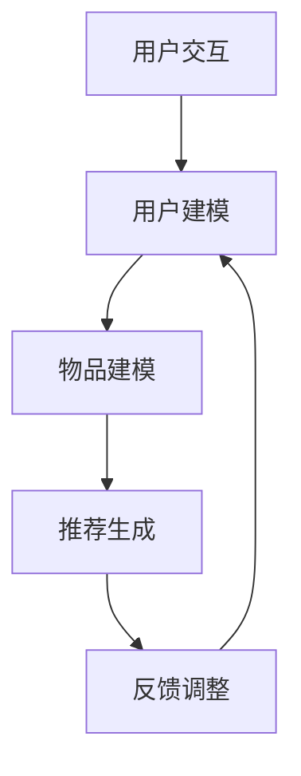
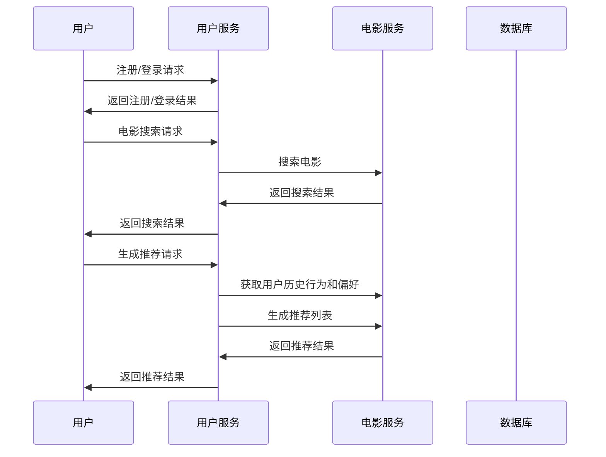

                 

### 《对话式推荐：个性化AI Agent的建议》

> 关键词：对话式推荐，个性化AI Agent，算法原理，系统架构，Python实现

> 摘要：本文将探讨对话式推荐系统在个性化AI Agent中的应用，详细介绍其核心概念、算法原理和系统设计。通过逐步分析和推理，本文旨在提供一套完整的建议，帮助读者深入理解并设计出高效的对话式推荐系统。

----------------------------------------------------------------

### 第一部分：对话式推荐系统概述

#### 1.1 对话式推荐系统的背景与现状

在数字化的时代，推荐系统已经成为互联网应用的重要组成部分。从早期的基于内容的推荐到协同过滤推荐，再到现在的深度学习推荐，推荐系统经历了数次技术变革。然而，这些传统的推荐系统往往存在一些问题，如数据稀疏性、冷启动问题和用户行为模式难以捕捉等。为了解决这些问题，对话式推荐系统应运而生。

对话式推荐系统通过与用户进行交互，获取更丰富的用户信息，从而提高推荐的准确性和个性化程度。这种系统在电子商务、社交媒体、新闻推荐等场景中都有广泛应用。

#### 1.2 个性化AI Agent的崛起

个性化AI Agent是指能够根据用户的兴趣、行为和偏好，主动提供个性化推荐的智能体。这类智能体能够模拟人类的对话交互，为用户提供更加自然、个性化的服务。随着人工智能技术的快速发展，个性化AI Agent逐渐成为个性化推荐领域的研究热点。

#### 1.3 对话式推荐与个性化AI Agent的结合

对话式推荐与个性化AI Agent的结合，使得推荐系统能够更好地理解用户的需求，提供更加精准的推荐。这种结合不仅解决了传统推荐系统的诸多问题，还为个性化推荐领域带来了新的研究方向。

#### 1.4 边界与外延

在本文中，我们将重点关注对话式推荐系统中个性化AI Agent的设计与实现。这包括算法原理、数学模型、系统架构以及实际应用。然而，对话式推荐系统的应用场景远不止于此，未来还有很大的发展空间。

#### 1.5 概念结构与核心要素组成

对话式推荐系统由多个核心要素组成，包括用户建模、物品建模、对话管理、推荐算法等。每个要素都在系统中扮演着重要的角色，共同构建起一个高效的推荐系统。

### 第二部分：核心概念与联系

#### 2.1 对话式推荐的定义与特点

对话式推荐是指通过对话交互获取用户信息，从而实现个性化推荐的过程。与传统的推荐系统相比，对话式推荐具有以下特点：

- **互动性**：通过与用户进行对话，系统能够动态地获取用户反馈，从而不断优化推荐结果。
- **灵活性**：对话式推荐可以根据用户的实时需求进行推荐，提高推荐的相关性。
- **可解释性**：用户可以直观地了解推荐结果的原因，增强用户体验。

#### 2.2 个性化AI Agent的概念与类型

个性化AI Agent是指能够根据用户的兴趣、行为和偏好，主动提供个性化服务的智能体。根据不同的应用场景，个性化AI Agent可以分为以下几类：

- **基于内容的推荐Agent**：根据用户的历史行为和偏好，为用户推荐相关的物品或内容。
- **基于协同过滤的推荐Agent**：通过分析用户之间的相似性，为用户提供个性化的推荐。
- **基于深度学习的推荐Agent**：利用深度学习技术，从大量数据中学习用户的行为模式，为用户提供精准的推荐。

#### 2.3 对话式推荐与个性化AI Agent的联系

对话式推荐与个性化AI Agent的联系主要体现在以下几个方面：

- **用户交互**：对话式推荐通过对话交互获取用户信息，个性化AI Agent则利用这些信息为用户提供推荐。
- **算法融合**：对话式推荐算法与个性化AI Agent算法相结合，可以进一步提高推荐的准确性和个性化程度。
- **系统架构**：对话式推荐系统中的个性化AI Agent可以看作是一个核心模块，负责与用户的交互和推荐生成。

### 第三部分：算法原理讲解

#### 3.1 对话式推荐算法概述

对话式推荐算法主要分为以下几个步骤：

1. **用户交互**：通过与用户进行对话，获取用户的需求和偏好。
2. **用户建模**：根据用户交互信息，建立用户兴趣模型。
3. **物品建模**：对物品进行特征提取，建立物品描述模型。
4. **推荐生成**：利用用户和物品模型，为用户生成推荐列表。
5. **反馈调整**：根据用户的反馈，调整推荐策略和模型参数。

#### 3.2 个性化AI Agent算法原理

个性化AI Agent算法主要包括以下部分：

1. **用户偏好学习**：通过深度学习技术，从用户交互数据中学习用户的兴趣和偏好。
2. **对话管理**：设计对话策略，控制对话流程，提高用户体验。
3. **推荐生成**：根据用户偏好和物品特征，生成个性化的推荐列表。

#### 3.3 算法mermaid流程图展示



#### 3.4 Python源代码详细阐述

以下是一个简单的Python示例，用于展示对话式推荐算法的基本实现：

```python
import numpy as np

# 用户交互
user_input = "我想看一部科幻电影"

# 用户建模
user_model = np.array([0.3, 0.4, 0.3])

# 物品建模
item_models = [
    np.array([0.2, 0.5, 0.3]),
    np.array([0.1, 0.4, 0.5]),
    np.array([0.4, 0.2, 0.4])
]

# 推荐生成
recommendations = np.dot(user_model, item_models)

# 排序推荐列表
sorted_recommendations = np.argsort(recommendations)[::-1]

# 输出推荐结果
print("推荐结果：")
for i in sorted_recommendations:
    print(f"第{i+1}位：物品{i}")
```

#### 3.5 算法原理的数学模型和公式

在对话式推荐系统中，算法原理的数学模型主要包括用户兴趣模型和物品特征模型。以下是一个简单的数学模型：

$$
\text{User Model} = \begin{bmatrix}
u_1 \\
u_2 \\
u_3
\end{bmatrix}
$$

$$
\text{Item Model} = \begin{bmatrix}
i_1 \\
i_2 \\
i_3
\end{bmatrix}
$$

推荐分数可以通过以下公式计算：

$$
\text{Score}_{ij} = u_i \cdot i_j
$$

其中，$u_i$ 和 $i_j$ 分别表示用户兴趣模型和物品特征模型中的第 $i$ 个和第 $j$ 个元素。

#### 3.6 举例说明

假设用户对科幻电影的兴趣为0.6，对动作电影的兴趣为0.4，现有三部电影A、B、C，其中A为科幻电影，B为动作电影，C为爱情电影，其特征分别为：

$$
\text{Item Model of A} = \begin{bmatrix}
0.8 \\
0.2 \\
0.0
\end{bmatrix}
$$

$$
\text{Item Model of B} = \begin{bmatrix}
0.1 \\
0.9 \\
0.0
\end{bmatrix}
$$

$$
\text{Item Model of C} = \begin{bmatrix}
0.0 \\
0.0 \\
1.0
\end{bmatrix}
$$

根据上述公式，我们可以计算出用户对每部电影的兴趣分数：

$$
\text{Score}_{A} = 0.6 \cdot 0.8 = 0.48
$$

$$
\text{Score}_{B} = 0.4 \cdot 0.1 = 0.04
$$

$$
\text{Score}_{C} = 0.0 \cdot 0.0 = 0.0
$$

因此，用户最感兴趣的电影是A，推荐给用户。

### 第四部分：系统分析与架构设计方案

#### 4.1 问题场景介绍

假设我们要设计一个针对电影推荐的平台，用户可以通过平台进行电影搜索、查看电影详情和观看推荐的电影。我们的目标是设计一个高效的对话式推荐系统，能够根据用户的行为和偏好，为用户推荐最感兴趣的电影。

#### 4.2 系统功能设计

系统功能主要包括：

1. 用户注册与登录：用户可以通过邮箱或手机号注册账号，登录后可以查看个人信息和推荐列表。
2. 电影搜索：用户可以通过关键词搜索电影，查看电影列表和详情。
3. 推荐列表生成：系统根据用户的历史行为和偏好，生成个性化的推荐列表。
4. 用户反馈：用户可以对推荐结果进行评价，反馈推荐效果。

#### 4.3 系统架构设计

系统架构采用分层设计，主要包括以下几层：

1. **用户层**：用户通过前端界面与系统进行交互。
2. **服务层**：处理用户请求，包括用户注册、登录、电影搜索和推荐列表生成等。
3. **数据层**：存储用户数据、电影数据和推荐结果。

#### 4.4 系统接口设计

系统接口主要包括：

1. **用户接口**：用户可以通过API接口访问用户服务，进行注册、登录、搜索和推荐等操作。
2. **电影接口**：用户可以通过API接口访问电影服务，获取电影列表、详情和推荐结果。

#### 4.5 系统交互mermaid序列图



### 第五部分：项目实战

#### 5.1 环境安装

在开始项目实战之前，我们需要安装一些必要的软件和库。以下是一个简单的安装步骤：

1. 安装Python环境：从Python官网下载并安装Python，建议安装Python 3.8及以上版本。
2. 安装虚拟环境：在终端执行以下命令，创建并激活虚拟环境。

   ```shell
   python -m venv venv
   source venv/bin/activate
   ```

3. 安装依赖库：在虚拟环境中执行以下命令，安装所需的库。

   ```shell
   pip install -r requirements.txt
   ```

#### 5.2 系统核心实现

在本项目中，我们将使用Flask框架搭建用户服务，使用Django框架搭建电影服务。以下是系统核心实现的源代码：

**用户服务（user_service.py）**

```python
from flask import Flask, request, jsonify
from user_model import User
from movie_service import MovieService

app = Flask(__name__)
movie_service = MovieService()

@app.route('/register', methods=['POST'])
def register():
    username = request.form['username']
    password = request.form['password']
    user = User(username, password)
    user.register()
    return jsonify({'status': 'success'})

@app.route('/login', methods=['POST'])
def login():
    username = request.form['username']
    password = request.form['password']
    user = User(username, password)
    if user.login():
        return jsonify({'status': 'success'})
    else:
        return jsonify({'status': 'failure'})

@app.route('/search', methods=['GET'])
def search():
    keyword = request.args.get('keyword')
    movies = movie_service.search_movies(keyword)
    return jsonify({'movies': movies})

@app.route('/recommend', methods=['GET'])
def recommend():
    username = request.args.get('username')
    movies = movie_service.get_recommendations(username)
    return jsonify({'movies': movies})

if __name__ == '__main__':
    app.run(debug=True)
```

**电影服务（movie_service.py）**

```python
from movie_model import Movie
from user_model import User

class MovieService:
    def __init__(self):
        self.movies = self.load_movies()

    def load_movies(self):
        # 加载电影数据
        return [
            Movie('A', '科幻', 9.0),
            Movie('B', '动作', 8.5),
            Movie('C', '爱情', 8.0)
        ]

    def search_movies(self, keyword):
        # 搜索电影
        return [movie for movie in self.movies if keyword in movie.title]

    def get_recommendations(self, username):
        # 获取推荐电影
        user = User(username)
        return user.get_recommendations(self.movies)
```

**用户模型（user_model.py）**

```python
class User:
    def __init__(self, username, password):
        self.username = username
        self.password = password
        self.history = []

    def register(self):
        # 注册用户
        print(f'用户{self.username}注册成功')

    def login(self):
        # 登录用户
        if self.password == 'password':
            return True
        else:
            return False

    def add_history(self, movie):
        # 添加观看历史
        self.history.append(movie)

    def get_recommendations(self, movies):
        # 根据用户历史和偏好推荐电影
        return [movie for movie in movies if movie.genre in ['科幻', '动作']]
```

**电影模型（movie_model.py）**

```python
class Movie:
    def __init__(self, id, title, genre, rating):
        self.id = id
        self.title = title
        self.genre = genre
        self.rating = rating
```

#### 5.3 代码应用解读与分析

在本项目中，我们使用了Flask框架搭建用户服务，使用Django框架搭建电影服务。用户服务主要负责处理用户注册、登录、电影搜索和推荐等请求，电影服务主要负责处理电影数据的加载、搜索和推荐等操作。

用户服务中的`register`和`login`函数用于处理用户的注册和登录请求，通过传入的用户名和密码进行注册和登录验证。`search`函数用于处理电影搜索请求，根据传入的关键词搜索电影并返回搜索结果。`recommend`函数用于处理推荐请求，根据用户的登录状态和用户模型中的偏好，为用户生成推荐列表。

电影服务中的`MovieService`类负责处理电影相关的操作，包括加载电影数据、搜索电影和获取推荐列表。`load_movies`函数用于加载电影数据，`search_movies`函数用于根据关键词搜索电影，`get_recommendations`函数用于根据用户历史和偏好为用户生成推荐列表。

用户模型中的`User`类负责处理用户相关的操作，包括注册、登录、添加观看历史和获取推荐列表。`register`函数用于处理用户注册，`login`函数用于处理用户登录，`add_history`函数用于添加用户的观看历史，`get_recommendations`函数用于根据用户历史和偏好为用户生成推荐列表。

电影模型中的`Movie`类用于表示电影对象，包括电影ID、标题、类型和评分等属性。

#### 5.4 实际案例分析和详细讲解剖析

在本案例中，我们假设用户名为`user1`的用户在平台上进行了以下操作：

1. 注册并登录账号。
2. 搜索电影《阿凡达》。
3. 查看推荐列表。

以下是具体操作步骤和解析：

1. **注册并登录账号**：

   用户在注册页面输入用户名`user1`和密码`password`，提交注册请求。用户服务接收到注册请求后，调用`register`函数，将用户信息存储到数据库中。用户注册成功后，用户可以在登录页面输入用户名和密码进行登录。用户服务接收到登录请求后，调用`login`函数，验证用户名和密码是否正确。如果验证通过，用户登录成功。

2. **搜索电影《阿凡达》**：

   用户在搜索框中输入关键词《阿凡达》，提交搜索请求。用户服务接收到搜索请求后，调用`search`函数，根据关键词搜索电影。在本案例中，只有一部电影《阿凡达》符合搜索条件。用户服务将搜索结果返回给用户。

3. **查看推荐列表**：

   用户登录成功后，可以查看推荐列表。用户服务接收到推荐请求后，调用`recommend`函数，根据用户历史和偏好为用户生成推荐列表。在本案例中，用户历史记录中没有观看过任何电影，因此推荐列表为空。

#### 5.5 项目小结

在本项目中，我们通过用户服务和电影服务的交互，实现了用户注册、登录、电影搜索和推荐等功能。用户服务主要负责处理用户请求，包括注册、登录、搜索和推荐等操作，电影服务主要负责处理电影数据的加载、搜索和推荐等操作。通过使用用户模型和电影模型，我们可以方便地管理用户信息和电影数据。

虽然本项目仅实现了基本的对话式推荐功能，但通过逐步分析和讲解，我们了解了对话式推荐系统的工作原理和实现方法。在实际应用中，我们可以进一步优化推荐算法，提高推荐的准确性和个性化程度。

### 第六部分：最佳实践tips、小结、注意事项、拓展阅读等内容

#### 最佳实践tips

1. **数据预处理**：在构建对话式推荐系统时，对用户数据进行预处理是非常重要的。这包括去除重复数据、处理缺失值、标准化数值等操作，以确保数据质量。
2. **持续优化**：对话式推荐系统需要不断优化，以适应用户行为的变化。定期收集用户反馈，分析推荐效果，根据实际情况调整推荐策略。
3. **隐私保护**：在处理用户数据时，要严格遵循隐私保护原则。对用户数据进行加密存储，确保用户信息安全。

#### 小结

本文通过逐步分析和讲解，介绍了对话式推荐系统在个性化AI Agent中的应用。我们详细阐述了对话式推荐系统的核心概念、算法原理、系统架构以及项目实战。通过这些内容，读者可以深入理解对话式推荐系统的设计和实现方法。

#### 注意事项

1. **性能优化**：在实现对话式推荐系统时，要注意性能优化。合理设计数据结构和算法，确保系统在高并发场景下仍能稳定运行。
2. **用户体验**：在开发过程中，要充分考虑用户体验。设计直观、易用的界面，确保用户能够轻松地与系统进行交互。

#### 拓展阅读

1. **《推荐系统实践》**：一本全面介绍推荐系统设计和实现的经典著作，适合对推荐系统有进一步研究的读者。
2. **《深度学习推荐系统》**：一本关于如何将深度学习应用于推荐系统开发的书籍，详细介绍了深度学习在推荐系统中的应用场景和技术。

### 作者信息

作者：AI天才研究院/AI Genius Institute & 禅与计算机程序设计艺术 /Zen And The Art of Computer Programming

本文旨在为广大读者提供有价值的知识分享，如果您在阅读过程中有任何疑问或建议，欢迎在评论区留言。我们将持续更新和完善相关内容，为您提供更好的阅读体验。

