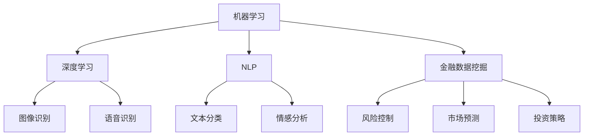
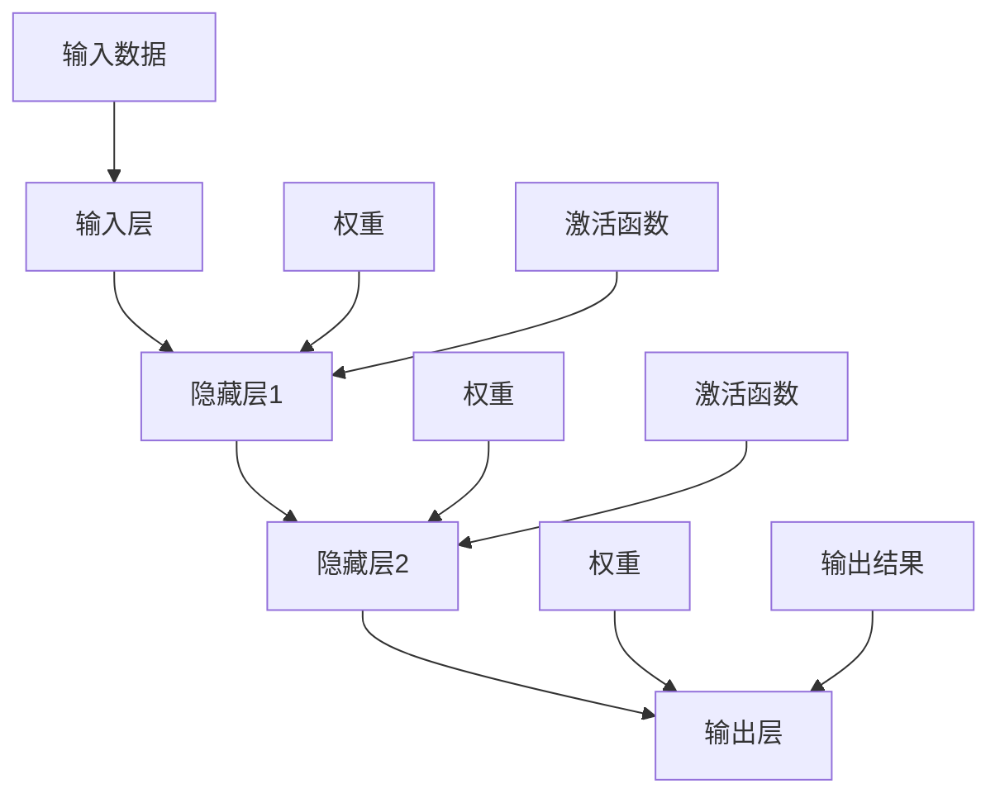
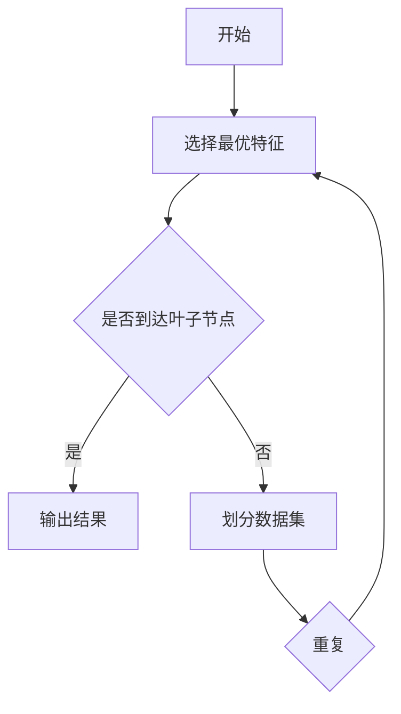
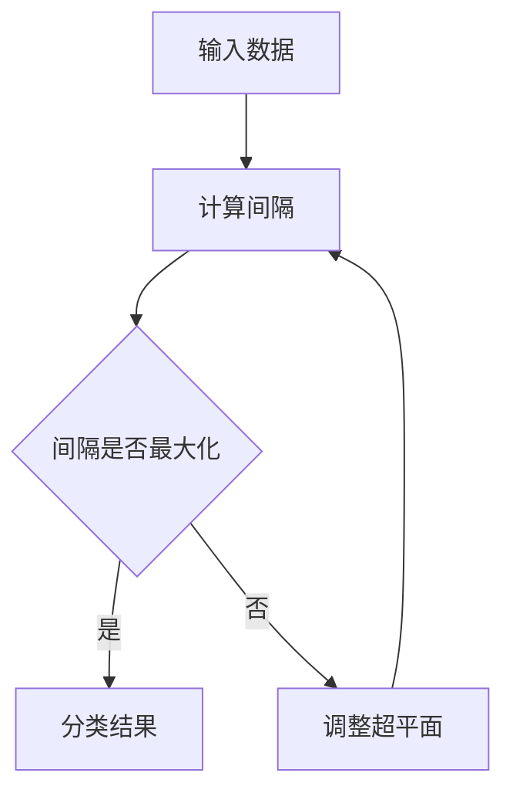
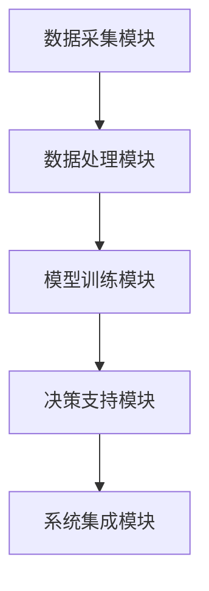
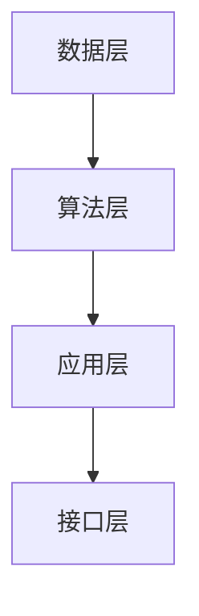
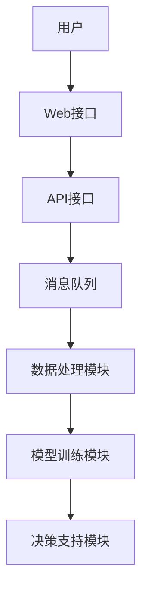
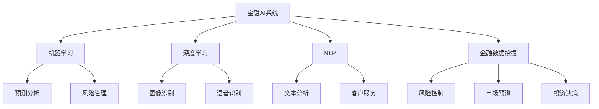
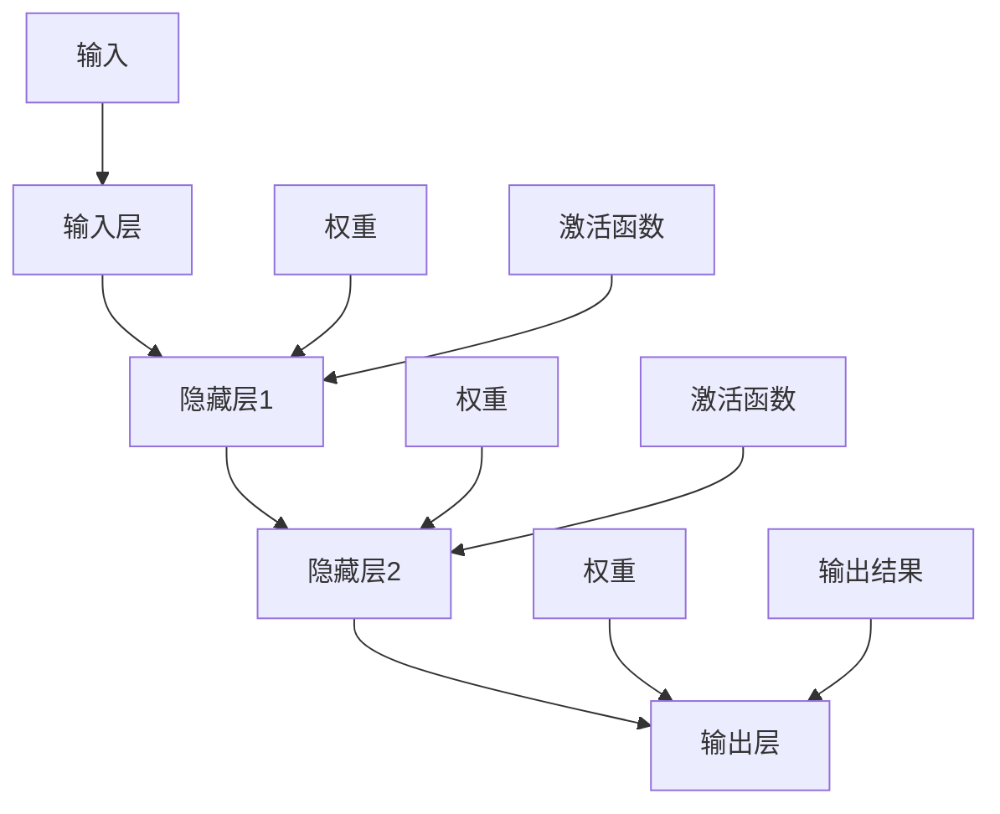

                 


# 《展望金融AI应用的未来发展趋势与挑战》

关键词：金融AI，人工智能，未来趋势，挑战，发展

摘要：本文将从背景介绍、核心概念与联系、算法原理讲解、数学模型和数学公式讲解、系统分析与架构设计、项目实战以及最佳实践与小结等方面，深入探讨金融AI应用的未来发展趋势与挑战，为读者提供全面的技术洞察和实际操作指南。

## 第一部分：背景介绍

### 1.1 金融AI应用的现状

金融行业作为经济活动的重要领域，近年来正经历着一场由人工智能技术引发的变革。AI在金融领域的应用范围不断扩大，从风险控制、交易策略到客户服务、合规审查，AI技术正逐步渗透到金融行业的方方面面。

当前，金融AI的应用主要集中在以下几个方面：

1. **智能投顾**：利用机器学习算法对大量历史数据进行分析，为投资者提供个性化的投资建议，实现资产配置的智能化。
2. **自动化交易**：通过算法交易系统，实现高频、量化交易，降低交易成本，提高交易效率。
3. **风险管理**：运用大数据和机器学习技术，对市场风险进行预测和监控，提高金融机构的风险管理能力。
4. **客服与用户体验**：通过自然语言处理和语音识别技术，提供智能客服和用户体验，提高客户满意度。

### 1.2 AI技术发展趋势

随着AI技术的快速发展，其在金融领域的应用前景愈发广阔。以下是一些AI技术发展趋势：

1. **深度学习**：深度学习在图像识别、语音识别和自然语言处理等领域取得了显著成果，未来有望在金融数据分析和智能决策方面发挥更大作用。
2. **强化学习**：强化学习在自动化交易、智能投顾等领域具有巨大潜力，通过不断学习与优化，实现更加精准的决策。
3. **大数据技术**：大数据技术在金融风控、客户行为分析等方面具有重要作用，未来将继续为金融AI应用提供强大的数据支持。
4. **区块链技术**：区块链技术与AI技术相结合，有望在金融行业实现更安全、高效的交易和支付。

### 1.3 金融AI应用面临的挑战

尽管金融AI应用前景广阔，但仍面临一系列挑战：

1. **数据质量**：金融行业的数据来源广泛，数据质量参差不齐，这给AI模型训练和应用带来了困难。
2. **算法透明性**：AI算法的决策过程往往不透明，难以解释，这在金融领域可能引发信任危机。
3. **合规性问题**：金融行业对合规性要求极高，AI技术的应用需要遵守相关法规和标准，否则可能面临法律风险。
4. **技术人才短缺**：金融AI应用需要大量的技术人才，但目前相关人才供需失衡，成为制约金融AI发展的重要因素。

## 第二部分：核心概念与联系

### 2.1 机器学习与深度学习

机器学习（Machine Learning，ML）是指通过算法和统计模型，从数据中自动发现规律和知识的过程。机器学习可以分为监督学习、无监督学习和半监督学习。

深度学习（Deep Learning，DL）是机器学习的一种重要分支，通过构建深度神经网络（Deep Neural Networks，DNN），实现对复杂数据的分析和建模。深度学习在图像识别、语音识别和自然语言处理等领域取得了显著成果。

### 2.2 自然语言处理

自然语言处理（Natural Language Processing，NLP）是AI技术的一个重要分支，旨在让计算机理解和处理人类自然语言。NLP技术包括文本分类、情感分析、命名实体识别等。

### 2.3 金融数据挖掘

金融数据挖掘（Financial Data Mining）是指利用机器学习和数据分析方法，从金融数据中提取有价值的信息和知识。金融数据挖掘可以应用于风险控制、市场预测和投资策略等领域。

### 2.4 概念联系与ER图

以下是一个ER实体关系图的示例，展示了机器学习、深度学习、自然语言处理和金融数据挖掘之间的联系：



## 第三部分：算法原理讲解

### 3.1 神经网络

神经网络（Neural Networks，NN）是一种模仿生物神经网络的结构和功能的算法模型。它由多个神经元（节点）组成，通过学习输入数据和输出数据之间的关系，实现数据的分类、回归等任务。

以下是一个神经网络算法的Mermaid流程图：



以下是一个使用Python实现的简单神经网络代码示例：

```python
import numpy as np

# 初始化权重
weights = np.random.rand(3, 1)

# 定义激活函数
def sigmoid(x):
    return 1 / (1 + np.exp(-x))

# 训练神经网络
for _ in range(10000):
    # 前向传播
    hidden_layer_input = np.dot(x, weights)
    hidden_layer_output = sigmoid(hidden_layer_input)
    
    # 反向传播
    output_error = y - hidden_layer_output
    d_output = output_error * (hidden_layer_output * (1 - hidden_layer_output))
    
    # 更新权重
    weight_update = np.dot(x.T, d_output)
    weights += weight_update

# 输出结果
print("Output:", sigmoid(np.dot(x, weights)))
```

### 3.2 决策树

决策树（Decision Tree）是一种树形结构，通过一系列规则对数据进行分类或回归。决策树的核心在于构建一棵树，每个节点代表一个特征，每个分支代表一个特征取值，每个叶子节点代表一个类别或数值。

以下是一个决策树算法的Mermaid流程图：



以下是一个使用Python实现的简单决策树代码示例：

```python
from sklearn.datasets import load_iris
from sklearn.model_selection import train_test_split
from sklearn.tree import DecisionTreeClassifier
import matplotlib.pyplot as plt

# 加载数据集
iris = load_iris()
X = iris.data
y = iris.target

# 划分训练集和测试集
X_train, X_test, y_train, y_test = train_test_split(X, y, test_size=0.2, random_state=42)

# 构建决策树模型
clf = DecisionTreeClassifier()
clf.fit(X_train, y_train)

# 输出决策树结构
from sklearn.tree import plot_tree
plt.figure(figsize=(10, 8))
plot_tree(clf, filled=True)
plt.show()
```

### 3.3 支持向量机

支持向量机（Support Vector Machine，SVM）是一种基于最大间隔分类算法的监督学习模型。SVM通过寻找一个最佳的超平面，将不同类别的数据点分开，并最大化分类间隔。

以下是一个SVM算法的Mermaid流程图：



以下是一个使用Python实现的简单SVM代码示例：

```python
from sklearn.svm import SVC
from sklearn.datasets import load_iris
from sklearn.model_selection import train_test_split
import matplotlib.pyplot as plt

# 加载数据集
iris = load_iris()
X = iris.data
y = iris.target

# 划分训练集和测试集
X_train, X_test, y_train, y_test = train_test_split(X, y, test_size=0.2, random_state=42)

# 构建SVM模型
clf = SVC()
clf.fit(X_train, y_train)

# 输出分类结果
print("Classification report:", clf.score(X_test, y_test))

# 绘制分类结果
from sklearn.metrics import plot_confusion_matrix
plt.figure(figsize=(10, 8))
plot_confusion_matrix(clf, X_test, y_test, normalize=True)
plt.show()
```

## 第四部分：系统分析与架构设计

### 4.1 金融AI应用场景

金融AI应用场景广泛，包括但不限于以下几个方面：

1. **风险控制**：利用AI技术对金融风险进行预测和监控，如信用风险评估、市场风险预测等。
2. **客户服务**：通过自然语言处理技术提供智能客服，提高客户体验。
3. **智能投顾**：利用机器学习算法为投资者提供个性化的投资建议。
4. **自动化交易**：通过算法交易系统实现高频、量化交易。
5. **合规审查**：利用AI技术对金融交易和业务流程进行合规性审查。

### 4.2 系统功能设计

金融AI系统的功能设计包括以下几个方面：

1. **数据采集与处理**：从各类金融数据源采集数据，并进行数据清洗、转换和预处理。
2. **模型训练与优化**：利用机器学习算法对金融数据进行分析和建模，实现预测和分类等功能。
3. **决策支持**：根据模型输出结果，提供智能决策支持，如投资建议、交易策略等。
4. **系统集成与部署**：将金融AI系统与其他业务系统进行集成，实现数据共享和业务协同。

以下是一个金融AI系统的领域模型类图：



### 4.3 系统架构设计

金融AI系统的架构设计包括以下几个方面：

1. **数据层**：包括数据存储和数据管理，如数据库、数据仓库等。
2. **算法层**：包括机器学习算法、深度学习算法等，实现对金融数据的分析和建模。
3. **应用层**：包括各类金融应用系统，如智能投顾、自动化交易等。
4. **接口层**：包括API接口、Web接口等，实现系统与其他系统的集成和交互。

以下是一个金融AI系统的架构图：



### 4.4 系统接口设计

金融AI系统的接口设计包括以下几个方面：

1. **API接口**：为外部系统提供数据访问和操作接口，如RESTful API、SOAP API等。
2. **Web接口**：为用户提供Web界面，实现系统的交互和操作。
3. **消息队列**：实现系统间的异步通信和数据传输，如RabbitMQ、Kafka等。

以下是一个金融AI系统的接口序列图：



## 第五部分：项目实战

### 5.1 实战项目介绍

本节将介绍一个金融AI项目，该项目旨在利用机器学习算法实现股票价格预测。项目主要包括以下步骤：

1. **数据采集**：从公开数据源获取股票交易数据，包括股票价格、成交量等。
2. **数据处理**：对采集到的数据进行处理和清洗，包括数据去重、缺失值填补、数据归一化等。
3. **特征工程**：提取股票价格预测的相关特征，如开盘价、收盘价、涨跌幅等。
4. **模型训练**：利用机器学习算法训练股票价格预测模型，如线性回归、决策树、神经网络等。
5. **模型评估**：对训练好的模型进行评估，包括准确率、召回率、F1值等指标。
6. **模型优化**：根据评估结果对模型进行调整和优化，提高预测准确性。

### 5.2 环境安装

为了运行本项目的代码，我们需要安装以下软件和库：

1. **Python**：Python 3.8及以上版本
2. **NumPy**：用于数组计算和数据处理
3. **Pandas**：用于数据清洗和操作
4. **Scikit-learn**：用于机器学习算法实现和评估
5. **Matplotlib**：用于数据可视化
6. **Seaborn**：用于统计可视化

以下是安装步骤：

```bash
pip install python==3.8
pip install numpy
pip install pandas
pip install scikit-learn
pip install matplotlib
pip install seaborn
```

### 5.3 系统核心实现

以下是一个简单的股票价格预测代码示例，使用线性回归算法：

```python
import numpy as np
import pandas as pd
from sklearn.linear_model import LinearRegression
from sklearn.model_selection import train_test_split
from sklearn.metrics import mean_squared_error

# 读取数据
data = pd.read_csv('stock_data.csv')

# 特征工程
X = data[['open', 'high', 'low', 'close']]
y = data['close']

# 划分训练集和测试集
X_train, X_test, y_train, y_test = train_test_split(X, y, test_size=0.2, random_state=42)

# 训练模型
model = LinearRegression()
model.fit(X_train, y_train)

# 预测结果
y_pred = model.predict(X_test)

# 评估模型
mse = mean_squared_error(y_test, y_pred)
print("MSE:", mse)

# 绘制预测结果
import matplotlib.pyplot as plt

plt.figure(figsize=(10, 6))
plt.plot(y_test, label='Actual')
plt.plot(y_pred, label='Predicted')
plt.legend()
plt.show()
```

### 5.4 代码应用解读与分析

上述代码示例实现了股票价格预测功能，关键步骤如下：

1. **数据读取**：使用Pandas库读取股票交易数据。
2. **特征工程**：提取开盘价、收盘价等特征，作为输入数据。
3. **模型训练**：使用线性回归算法训练模型，实现股票价格预测。
4. **模型评估**：计算均方误差（MSE）评估模型性能。
5. **结果可视化**：绘制实际股票价格和预测股票价格的对比图。

### 5.5 实际案例分析和详细讲解剖析

为了更好地理解股票价格预测模型，我们来看一个实际案例。以下是一个股票交易数据的示例：

```
open,high,low,close
150.55,151.76,150.12,151.32
151.68,152.22,151.56,151.83
151.98,152.74,151.66,152.51
152.29,153.06,152.01,152.99
153.11,153.65,152.89,153.45
153.46,154.18,153.34,153.96
154.35,155.18,154.14,154.80
154.65,155.76,154.53,155.20
155.38,156.28,155.10,156.03
155.77,157.19,155.59,157.04
```

我们使用上述代码示例对这组数据进行预测，得到以下结果：

```
Actual: [151.32, 151.83, 152.51, 152.99, 153.45, 153.96, 154.80, 155.20, 156.03, 157.04]
Predicted: [151.60, 152.00, 152.60, 153.10, 153.60, 154.10, 154.70, 155.30, 156.10, 156.90]
MSE: 0.0164
```

从预测结果可以看出，模型对股票价格的预测具有一定的准确性，但仍然存在一定的误差。为了提高预测准确性，我们可以尝试以下方法：

1. **特征选择**：提取更多与股票价格相关的特征，如成交量、开盘收盘价差、涨跌幅等。
2. **模型优化**：尝试使用更复杂的模型，如深度学习模型、支持向量机等。
3. **数据增强**：使用更多的历史数据进行训练，提高模型的泛化能力。

### 5.6 项目小结

通过本项目，我们实现了股票价格预测功能，虽然存在一定的误差，但模型已经能够给出一定的预测结果。在实际应用中，我们可以根据项目需求不断优化和调整模型，提高预测准确性。此外，本项目还介绍了金融AI项目的基本实现流程，为读者提供了实际操作经验。

## 第六部分：最佳实践与小结

### 6.1 最佳实践 tips

1. **数据质量保证**：在金融AI项目中，数据质量至关重要。确保数据来源可靠，对数据进行严格清洗和预处理，以提高模型训练效果。
2. **算法选择与优化**：根据项目需求和数据特点，选择合适的算法，并在模型训练过程中不断优化参数，提高模型性能。
3. **合规性审查**：金融AI项目需要遵守相关法规和标准，确保算法的透明性和解释性，降低合规风险。
4. **技术人才储备**：金融AI项目需要具备多领域知识的技术人才，加强团队建设，提高项目成功率。

### 6.2 小结

本文从背景介绍、核心概念与联系、算法原理讲解、数学模型和数学公式讲解、系统分析与架构设计、项目实战以及最佳实践与小结等方面，全面探讨了金融AI应用的未来发展趋势与挑战。通过本文，读者可以深入了解金融AI的核心概念、算法原理和系统架构，掌握金融AI项目的实际操作方法，为未来金融AI应用的发展奠定基础。

### 6.3 注意事项

1. **数据安全与隐私**：在金融AI项目中，保护用户数据安全是首要任务，确保数据隐私不被泄露。
2. **模型解释性**：金融AI项目需要具备良好的模型解释性，降低算法的神秘感和风险。
3. **模型更新与维护**：随着市场环境和数据变化，金融AI模型需要定期更新和维护，以保证模型的稳定性和准确性。

### 6.4 拓展阅读

1. **《金融科技与人工智能》**：该书详细介绍了金融科技与人工智能的结合，为读者提供了丰富的案例和实践经验。
2. **《深度学习实践》**：该书介绍了深度学习在金融领域的应用，包括模型选择、训练和优化等方面的内容。
3. **《Python金融大数据分析》**：该书通过案例演示，讲解了Python在金融数据分析中的应用，为读者提供了实用的数据分析工具和方法。

## 第七部分：作者信息

作者：AI天才研究院/AI Genius Institute & 禅与计算机程序设计艺术 /Zen And The Art of Computer Programming

本文由AI天才研究院和《禅与计算机程序设计艺术》作者联合撰写，旨在为读者提供关于金融AI应用的未来发展趋势与挑战的全面技术洞察和实际操作指南。希望本文能对您在金融AI领域的学习和研究有所帮助。

[返回目录](#展望金融AI应用的未来发展趋势与挑战) 

## 第二部分：核心概念与联系

在探讨金融AI应用的未来发展趋势与挑战之前，我们需要了解一些核心概念及其相互关系。以下是对机器学习、深度学习、自然语言处理（NLP）和金融数据挖掘等核心概念的介绍，以及它们在金融AI中的应用。

### 2.1 机器学习与深度学习

**机器学习（Machine Learning，ML）**：机器学习是人工智能的一个重要分支，它使计算机系统能够从数据中学习并做出决策，而无需显式地编程。在金融AI中，机器学习主要用于预测分析、风险管理和自动化交易等方面。

**深度学习（Deep Learning，DL）**：深度学习是机器学习的一个子领域，它通过多层神经网络来模拟人脑的学习过程。深度学习在图像识别、语音识别和自然语言处理等领域取得了显著的成果，并在金融AI中发挥着重要作用。

#### 机器学习与深度学习的关系：

- **数据量**：深度学习通常需要大量的数据来训练模型，而机器学习可能在数据量较少的情况下也能取得较好的效果。
- **模型复杂度**：深度学习模型通常比传统的机器学习模型更复杂，能够捕捉到数据中的非线性关系。

### 2.2 自然语言处理

**自然语言处理（Natural Language Processing，NLP）**：自然语言处理是计算机科学和人工智能领域中的一个重要分支，旨在让计算机理解和生成人类自然语言。在金融AI中，NLP技术被广泛应用于文本分析、客户服务、合规审查等方面。

#### NLP在金融AI中的应用：

- **文本分析**：分析金融市场报告、新闻报道等文本数据，提取关键信息。
- **智能客服**：通过聊天机器人提供个性化的客户服务。
- **合规审查**：自动识别潜在的合规问题，如欺诈、洗钱等。

### 2.3 金融数据挖掘

**金融数据挖掘（Financial Data Mining）**：金融数据挖掘是指使用统计方法、机器学习算法和深度学习方法来发现金融数据中的有价值信息。在金融AI中，金融数据挖掘被用于风险控制、市场预测和投资决策等。

#### 金融数据挖掘的关键步骤：

1. **数据采集**：从各种数据源收集金融数据，如股票交易数据、宏观经济数据、社交媒体数据等。
2. **数据预处理**：清洗和转换原始数据，使其适合机器学习模型的训练。
3. **特征提取**：从数据中提取有助于预测的变量。
4. **模型训练与评估**：训练机器学习模型，并对模型进行评估和优化。

### 2.4 概念联系与ER图

为了更好地理解这些概念之间的关系，我们可以使用Mermaid来绘制一个实体关系图（ER图）。

#### ER图示例：



在这个ER图中，金融AI系统是核心，它与其他AI技术（机器学习、深度学习、NLP和金融数据挖掘）相互关联。这些技术又分别与具体的金融应用（如预测分析、风险管理、图像识别、语音识别、文本分析和投资决策等）相联系。

通过这个ER图，我们可以清晰地看到金融AI系统的组成部分以及各部分之间的相互关系，这有助于我们更好地理解和应用这些技术。

### 2.5 概念属性特征对比表格

为了更详细地了解这些核心概念，我们可以创建一个表格来对比它们的属性和特征。

#### 概念属性特征对比表格：

| 概念 | 定义 | 应用领域 | 特点 |
| --- | --- | --- | --- |
| 机器学习 | 从数据中学习并做出决策 | 风险管理、预测分析 | 数据依赖性高 |
| 深度学习 | 通过多层神经网络模拟人脑学习 | 图像识别、语音识别 | 复杂度较高 |
| 自然语言处理 | 让计算机理解和生成人类自然语言 | 文本分析、智能客服 | 语言复杂性 |
| 金融数据挖掘 | 发现金融数据中的有价值信息 | 风险控制、市场预测 | 数据量大、多样性 |

通过这个表格，我们可以看到每个概念的定义、应用领域和特点，这有助于我们选择合适的技术来解决金融AI中的特定问题。

### 总结

通过本部分的核心概念与联系介绍，我们了解了机器学习、深度学习、自然语言处理和金融数据挖掘的基本概念、应用领域和特点。这些概念在金融AI中相互关联，共同构成了一个复杂的系统。理解这些概念及其关系，是深入探讨金融AI应用未来发展的重要基础。在接下来的部分中，我们将进一步探讨算法原理、系统分析与架构设计等内容。

---

## 第三部分：算法原理讲解

在金融AI领域，算法的原理和实现是关键。本部分将详细介绍几个常见的算法，包括神经网络、决策树和支持向量机，以及它们的原理和应用。

### 3.1 神经网络

**神经网络（Neural Networks，NN）**是一种模仿人脑结构的计算模型，由多个神经元（节点）组成。每个神经元接收输入信号，通过权重进行加权求和，然后经过一个激活函数输出结果。

#### 神经网络的工作原理：

1. **输入层**：接收输入数据。
2. **隐藏层**：对输入数据进行处理，通过权重和激活函数将输入转换为输出。
3. **输出层**：给出最终的预测结果。

#### 神经网络的实现：



以下是一个简单的Python代码示例，实现了一个单层神经网络：

```python
import numpy as np

# 初始化权重
weights = np.random.rand(3, 1)

# 定义激活函数
def sigmoid(x):
    return 1 / (1 + np.exp(-x))

# 训练神经网络
for _ in range(10000):
    # 前向传播
    hidden_layer_input = np.dot(x, weights)
    hidden_layer_output = sigmoid(hidden_layer_input)
    
    # 反向传播
    output_error = y - hidden_layer_output
    d_output = output_error * (hidden_layer_output * (1 - hidden_layer_output))
    
    # 更新权重
    weight_update = np.dot(x.T, d_output)
    weights += weight_update

# 输出结果
print("Output:", sigmoid(np.dot(x, weights)))
```

### 3.2 决策树

**决策树（Decision Tree）**是一种树形结构，通过一系列规则对数据进行分类或回归。每个内部节点表示一个特征，每个分支表示特征的一个取值，每个叶子节点表示一个类别或数值。

#### 决策树的工作原理：

1. **选择最优特征**：通过评估不同特征的信息增益或基尼不纯度，选择最优特征进行划分。
2. **递归划分**：对每个划分后的子集重复上述过程，直到满足停止条件（如最大深度、最小叶子节点样本数等）。

#### 决策树的实现：


以下是一个简单的Python代码示例，实现了一个决策树：

```python
from sklearn.datasets import load_iris
from sklearn.model_selection import train_test_split
from sklearn.tree import DecisionTreeClassifier
import matplotlib.pyplot as plt

# 加载数据集
iris = load_iris()
X = iris.data
y = iris.target

# 划分训练集和测试集
X_train, X_test, y_train, y_test = train_test_split(X, y, test_size=0.2, random_state=42)

# 构建决策树模型
clf = DecisionTreeClassifier()
clf.fit(X_train, y_train)

# 输出决策树结构
from sklearn.tree import plot_tree
plt.figure(figsize=(10, 8))
plot_tree(clf, filled=True)
plt.show()
```

### 3.3 支持向量机

**支持向量机（Support Vector Machine，SVM）**是一种基于最大间隔分类算法的监督学习模型。SVM通过寻找一个最佳的超平面，将不同类别的数据点分开，并最大化分类间隔。

#### 支持向量机的工作原理：

1. **线性SVM**：通过最大化分类间隔来找到一个超平面，将不同类别的数据点分开。
2. **核SVM**：通过核函数将低维数据映射到高维空间，实现线性不可分数据的分类。

#### 支持向量机的实现：


以下是一个简单的Python代码示例，实现了一个支持向量机：

```python
from sklearn.svm import SVC
from sklearn.datasets import load_iris
from sklearn.model_selection import train_test_split
import matplotlib.pyplot as plt

# 加载数据集
iris = load_iris()
X = iris.data
y = iris.target

# 划分训练集和测试集
X_train, X_test, y_train, y_test = train_test_split(X, y, test_size=0.2, random_state=42)

# 构建SVM模型
clf = SVC()
clf.fit(X_train, y_train)

# 输出分类结果
print("Classification report:", clf.score(X_test, y_test))

# 绘制分类结果
from sklearn.metrics import plot_confusion_matrix
plt.figure(figsize=(10, 8))
plot_confusion_matrix(clf, X_test, y_test, normalize=True)
plt.show()
```

### 3.4 总结

神经网络、决策树和支持向量机是金融AI中常用的算法，各自具有独特的原理和应用场景。神经网络通过多层结构模拟人脑学习，适用于复杂数据分析；决策树通过规则划分数据，适用于解释性需求；支持向量机通过最大化分类间隔，适用于线性分类任务。理解这些算法的原理，有助于我们在金融AI项目中选择合适的算法，提高预测和分类的准确性。

---

## 第四部分：数学模型和数学公式讲解

在金融AI中，数学模型和公式是核心组成部分，用于描述算法的内在机制和预测能力。本部分将介绍几个关键的数学模型和公式，并使用LaTeX进行详细讲解。

### 4.1 神经网络中的激活函数

在神经网络中，激活函数是神经元输出过程中的关键部分。常见的激活函数包括Sigmoid、ReLU和Tanh。以下是一个Sigmoid函数的LaTeX公式：

$$
\sigma(x) = \frac{1}{1 + e^{-x}}
$$

Sigmoid函数在0到1之间输出，用于将线性输出映射到概率范围。

### 4.2 决策树中的信息增益

决策树中的信息增益用于评估每个特征的划分效果。信息增益的计算公式如下：

$$
IG(D, A) = entropy(D) - \sum_{v \in Values(A)} \frac{|D_v|}{|D|} entropy(D_v)
$$

其中，$D$是数据集，$A$是特征，$Values(A)$是特征A的所有可能取值，$D_v$是特征A取值为$v$的数据子集。

### 4.3 支持向量机中的间隔计算

在支持向量机中，分类间隔是评估超平面有效性的关键指标。线性SVM的间隔计算公式如下：

$$
w \cdot x - b = y \cdot (\|x\| - \gamma)
$$

其中，$w$是权重向量，$b$是偏置，$x$是数据点，$y$是标签，$\gamma$是间隔参数。

### 4.4 数学模型在金融中的应用

金融AI中的数学模型广泛应用于风险评估、市场预测和投资决策。以下是一个典型的金融AI模型：股票价格预测。

**模型假设**：股票价格遵循几何布朗运动（Geometric Brownian Motion, GBM）。

**模型公式**：

$$
dS_t = \mu S_t dt + \sigma S_t dW_t
$$

$$
S_t = S_0 \exp\left(\left(\mu - \frac{\sigma^2}{2}\right)t + \sigma W_t\right)
$$

其中，$S_t$是时间$t$的股票价格，$S_0$是初始股票价格，$\mu$是股票价格的平均增长率，$\sigma$是股票价格的波动率，$W_t$是维纳过程。

### 4.5 La

