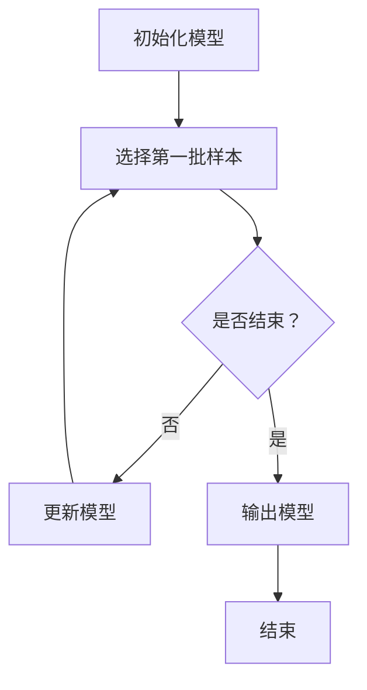
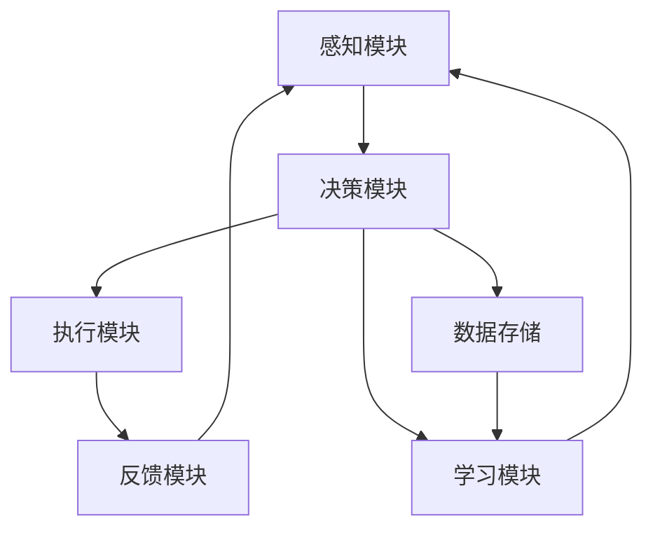
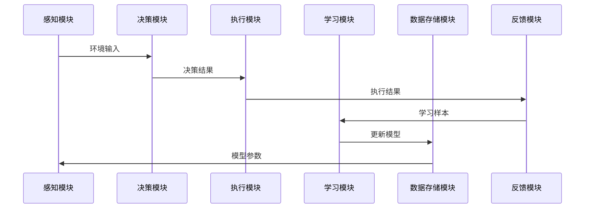
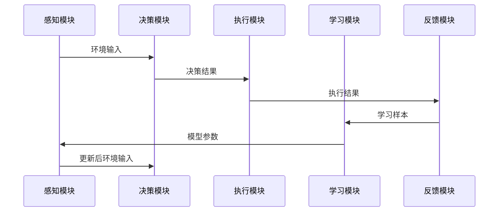

                 

# 开发AI Agent的主动学习能力：优化学习效率

## 关键词

AI Agent，主动学习，学习效率，算法，系统架构，项目实战

## 摘要

本文探讨了开发AI Agent的主动学习能力及其在提升学习效率方面的作用。通过对AI Agent发展背景、主动学习的重要性、学习效率的定义与意义进行深入分析，本文明确了AI Agent学习中的挑战和主动学习的应用。文章进一步阐述了主动学习的原理、算法及其在机器人、语音识别、自然语言处理等领域的应用。通过系统分析与架构设计，本文构建了AI Agent主动学习系统的整体框架。最后，通过项目实战展示了主动学习算法的实现和应用，提出了最佳实践，并对未来的发展方向进行了展望。

## 目录大纲

### 第一部分：背景介绍

1. **问题背景**
   - **AI Agent的发展现状**
   - **主动学习的重要性**
   - **学习效率的定义与意义**

2. **问题描述**
   - **AI Agent学习中的挑战**
   - **主动学习在AI Agent中的应用**
   - **研究目标与边界**

3. **问题解决**
   - **主动学习的原理**
   - **基于主动学习的AI Agent架构设计**
   - **关键技术与挑战**

4. **边界与外延**
   - **主动学习的适用范围**
   - **主动学习的限制因素**
   - **未来发展方向**

5. **本章小结**

### 第二部分：核心概念与联系

1. **主动学习原理与应用**
   - **核心概念**
   - **概念属性特征对比表格**
   - **ER实体关系图架构**

2. **本章小结**

### 第三部分：算法原理讲解

1. **主动学习算法解析**
   - **算法概述**
   - **算法原理详细讲解**
   - **算法应用场景分析**

2. **本章小结**

### 第四部分：系统分析与架构设计方案

1. **AI Agent主动学习系统架构设计**
   - **问题场景介绍**
   - **系统功能设计**
   - **系统架构设计**
   - **系统接口设计**
   - **系统交互设计**

2. **本章小结**

### 第五部分：项目实战

1. **AI Agent主动学习项目实践**
   - **环境安装与配置**
   - **系统核心实现**
   - **代码应用解读与分析**
   - **实际案例分析与讲解**
   - **项目小结**

2. **本章小结**

### 第六部分：最佳实践与总结

1. **主动学习在AI Agent开发中的最佳实践**
   - **数据质量优化**
   - **模型选择与优化**
   - **学习效率评估**

2. **小结**
   - **全书内容总结**
   - **主动学习在AI Agent开发中的重要性**
   - **未来的发展方向**

---

## 第一部分：背景介绍

### 1.1 问题背景

随着人工智能技术的快速发展，AI Agent作为智能系统的核心组件，已经在多个领域展现出强大的应用潜力。AI Agent是一种可以自主执行任务、与环境互动并不断学习优化的智能体。从早期的规则驱动型到当前的数据驱动型，AI Agent的智能化水平不断升级。

**AI Agent的发展现状**：

1. **规则驱动型**：早期的AI Agent主要依赖预定义的规则和逻辑，能够处理简单的任务。
2. **数据驱动型**：随着大数据和机器学习技术的发展，AI Agent逐渐能够通过数据学习和优化行为，提高了任务处理的复杂度和灵活性。
3. **主动学习型**：现代AI Agent开始引入主动学习机制，使得它们能够根据任务的反馈自主选择最有价值的样本进行学习，从而提高学习效率。

**主动学习的重要性**：

主动学习（Active Learning）是一种优化机器学习过程的方法，其核心思想是通过主动选择最有信息量的样本进行学习，以减少学习所需的样本数量，从而提高学习效率。对于AI Agent而言，主动学习具有以下重要性：

1. **资源优化**：在数据量庞大的场景中，主动学习能够帮助AI Agent在有限的数据资源下实现更好的性能。
2. **效率提升**：通过主动选择高质量的样本，AI Agent能够更快地达到预定的性能指标。
3. **决策支持**：主动学习使得AI Agent能够更加智能地分配学习资源，提高了系统的整体决策能力。

**学习效率的定义与意义**：

学习效率是指AI Agent在给定资源和时间内学习新知识和技能的速率和效果。对于AI Agent而言，学习效率的意义在于：

1. **任务完成速度**：高学习效率意味着AI Agent能够更快地适应新环境，完成任务。
2. **资源利用率**：提高学习效率有助于减少对计算资源的需求，降低系统的总体成本。
3. **稳定性与鲁棒性**：高效的学习能力有助于AI Agent在多变和复杂的环境中保持稳定的性能。

### 1.2 问题描述

在当前的AI Agent发展中，虽然AI Agent的能力得到了显著提升，但在学习过程中仍然面临着诸多挑战。以下将详细描述这些挑战以及主动学习在AI Agent中的应用。

**AI Agent学习中的挑战**：

1. **数据量庞大**：AI Agent在复杂任务中需要处理的数据量通常非常庞大，这给学习带来了巨大的挑战。
2. **数据噪声与偏差**：真实世界中的数据往往存在噪声和偏差，这会影响AI Agent的学习效果。
3. **时间成本**：传统的被动学习方法需要大量时间来积累足够的样本，从而实现有效学习。
4. **环境动态性**：AI Agent需要适应不断变化的环境，这对学习算法的实时性和适应性提出了高要求。

**主动学习在AI Agent中的应用**：

主动学习在AI Agent中的应用主要体现在以下几个方面：

1. **样本选择**：通过主动选择最有信息量的样本进行学习，提高学习效率。
2. **反馈机制**：AI Agent通过与环境交互，获取反馈信息，并据此调整学习策略。
3. **自适应学习**：AI Agent能够根据任务需求和性能指标，动态调整学习目标和资源分配。

**研究目标与边界**：

本研究的目标是通过优化AI Agent的主动学习能力，提高学习效率，从而提升AI Agent在复杂环境中的适应能力和任务完成能力。研究边界包括：

1. **技术范畴**：主要探讨基于主动学习的AI Agent架构设计和算法优化。
2. **应用场景**：重点关注机器人、语音识别和自然语言处理等领域的应用。
3. **性能指标**：以学习效率、任务完成速度和资源利用率为主要评估指标。

### 1.3 问题解决

为了解决上述问题，本研究将围绕主动学习原理、AI Agent架构设计、关键技术与挑战等方面进行深入探讨。

**主动学习的原理**：

主动学习的核心原理是通过选择最有信息量的样本进行学习，从而优化学习过程。具体来说，包括以下步骤：

1. **样本选择**：基于样本的重要性和信息量，选择最有价值的样本进行学习。
2. **模型更新**：利用选定的样本，更新AI Agent的模型，提高任务完成能力。
3. **反馈与调整**：根据模型更新的效果和环境反馈，动态调整学习目标和策略。

**基于主动学习的AI Agent架构设计**：

基于主动学习的AI Agent架构设计需要考虑以下几个方面：

1. **感知模块**：负责接收环境输入，提取有用信息。
2. **决策模块**：基于感知信息，进行任务决策和策略规划。
3. **学习模块**：实现主动学习算法，优化模型更新过程。
4. **执行模块**：根据决策结果，执行具体任务。
5. **反馈模块**：收集任务执行结果和环境反馈，用于模型优化。

**关键技术与挑战**：

1. **样本选择算法**：需要设计高效的样本选择算法，以最大化信息量。
2. **模型更新策略**：需要设计稳健的模型更新策略，以应对环境动态变化。
3. **资源分配**：需要合理分配学习资源，以提高整体学习效率。

### 1.4 边界与外延

**主动学习的适用范围**：

主动学习在以下场景中具有较好的适用性：

1. **数据量庞大**：例如，医疗影像分析、自动驾驶等。
2. **数据噪声与偏差**：例如，语音识别、自然语言处理等。
3. **环境动态变化**：例如，机器人导航、智能客服等。

**主动学习的限制因素**：

1. **计算资源**：主动学习通常需要更多的计算资源，尤其是在大规模数据集上。
2. **数据质量**：高质量的数据是主动学习有效性的基础，数据质量差会降低学习效果。
3. **算法复杂度**：主动学习算法的复杂度较高，实现和优化有一定难度。

**未来发展方向**：

未来的发展方向包括：

1. **算法优化**：设计更高效的主动学习算法，降低计算资源需求。
2. **跨领域应用**：探索主动学习在更多领域的应用，如金融、教育等。
3. **人机协作**：结合人机协作，提高主动学习的决策能力和用户体验。

### 1.5 本章小结

本文从问题背景、问题描述、问题解决和边界外延等方面，对开发AI Agent的主动学习能力进行了全面探讨。通过深入分析AI Agent的发展现状和主动学习的重要性，本文明确了主动学习在提升学习效率方面的关键作用。同时，本文阐述了主动学习的原理和关键挑战，并提出了相应的解决思路。最后，本文对主动学习的适用范围、限制因素和未来发展方向进行了展望。

## 第二部分：核心概念与联系

### 2.1 主动学习原理与应用

在深入探讨AI Agent的主动学习能力之前，我们需要明确几个核心概念：AI Agent、主动学习以及学习效率。这些概念不仅构成了AI Agent主动学习的基础，而且在理解和应用主动学习过程中起到了关键作用。

#### 2.1.1 AI Agent

AI Agent（人工智能代理）是一种能够在复杂环境中自主执行任务、与环境互动并不断学习优化的计算机程序。AI Agent的核心特征包括：

1. **自主性**：能够独立完成特定任务，不需要人工干预。
2. **适应性**：能够根据环境变化和任务需求调整行为策略。
3. **学习性**：能够从经验中学习，提高任务执行效率。

AI Agent的发展经历了从规则驱动到数据驱动，再到主动学习的演变。规则驱动型AI Agent主要依赖预定义的规则，而数据驱动型AI Agent则利用大量数据进行训练。主动学习型AI Agent在此基础上，通过选择最有价值的样本进行学习，进一步提高了学习效率和适应性。

#### 2.1.2 主动学习

主动学习（Active Learning）是机器学习中的一种优化策略，旨在通过选择性采样提高学习效率。与传统的被动学习（Passive Learning）不同，主动学习不是随机选择样本，而是根据一定的策略选择最有信息量的样本进行学习。

**主动学习的核心概念**包括：

1. **抽样策略**：选择样本的策略决定了哪些样本会被选中进行学习。
2. **模型更新**：利用选定的样本更新模型，提高模型的泛化能力。
3. **反馈机制**：通过与环境的交互，获取样本标签的反馈，用于模型更新。

主动学习的关键在于如何选择样本。常见的抽样策略包括：

1. **不确定性采样**：选择模型预测不确定性最高的样本。
2. **信息增益采样**：选择能够提供最大信息增益的样本。
3. **误分类采样**：选择模型预测错误的样本。

#### 2.1.3 学习效率

学习效率（Learning Efficiency）是指AI Agent在特定资源和时间内完成学习任务的能力。学习效率的高低直接影响AI Agent的适应能力和任务完成速度。

学习效率的评估指标包括：

1. **样本数量**：完成学习任务所需的样本数量。
2. **学习时间**：完成学习任务所需的时间。
3. **任务完成率**：在给定时间和资源内，完成任务的比率。

提高学习效率的方法主要包括：

1. **优化抽样策略**：选择更有信息的样本，减少冗余数据。
2. **增强模型泛化能力**：提高模型对新样本的适应能力。
3. **降低计算成本**：通过算法优化和硬件加速，减少学习所需的计算资源。

### 2.2 概念属性特征对比表格

为了更清晰地理解AI Agent、主动学习和学习效率这三个核心概念，下面提供一张对比表格，展示它们的主要属性特征：

| 概念       | 属性特征                                                     |
| ---------- | ------------------------------------------------------------ |
| AI Agent   | 自主性、适应性、学习性                                       |
| 主动学习   | 抽样策略、模型更新、反馈机制                                 |
| 学习效率   | 样本数量、学习时间、任务完成率                               |

### 2.3 ER实体关系图架构

为了更好地理解AI Agent、主动学习和学习效率之间的关联，我们通过ER（实体关系）图来展示它们的关系。

以下是一个简化的ER实体关系图，用Mermaid语法表示：

```mermaid
erDiagram
    AI-Agent ||--|{ 主动学习 }
    AI-Agent ||--|{ 学习效率 }
    主动学习 ||--|{ 样本选择 }
    主动学习 ||--|{ 模型更新 }
    主动学习 ||--|{ 反馈机制 }
    学习效率 ||--|{ 样本数量 }
    学习效率 ||--|{ 学习时间 }
    学习效率 ||--|{ 任务完成率 }
```

在ER图中，`AI-Agent`实体与`主动学习`和`学习效率`实体之间存在双向关联，表示AI Agent通过主动学习和学习效率来实现自主适应和学习优化。`主动学习`实体则与`样本选择`、`模型更新`和`反馈机制`三个子实体相关联，表示主动学习过程中涉及的各个关键步骤。同样，`学习效率`实体与`样本数量`、`学习时间`和`任务完成率`三个子实体相关联，表示评估学习效率的多个维度。

### 2.4 本章小结

通过本章对AI Agent、主动学习和学习效率的核心概念及其关系的介绍，我们为后续深入探讨主动学习在AI Agent中的应用和实现奠定了基础。在接下来的章节中，我们将进一步详细阐述主动学习的算法原理、系统架构设计以及项目实战经验，以帮助读者全面理解和掌握AI Agent主动学习的方法和技巧。

## 第三部分：算法原理讲解

### 3.1 主动学习算法概述

主动学习算法是优化机器学习过程的关键技术，其核心思想是通过选择性采样来提高学习效率。在主动学习过程中，模型不是被动地接收所有样本，而是根据一定的策略选择最有信息量的样本进行学习。这种策略可以显著减少所需样本数量，提高模型在有限数据下的性能。

**算法分类**：

根据选择样本的策略，主动学习算法可以分为以下几类：

1. **不确定性采样**（Uncertainty Sampling）：选择模型预测不确定性最高的样本。这种方法基于模型对未知数据的预测不确定性来判断样本的重要性。
2. **信息增益采样**（Information Gain Sampling）：选择能够提供最大信息增益的样本。信息增益是根据样本对分类边界的影响来衡量的。
3. **误分类采样**（Query by Committee / Misclassification Sampling）：选择模型预测错误的样本，或者多个模型存在分歧的样本。

**算法原理**：

主动学习算法的基本原理包括以下几个步骤：

1. **初始化**：选择一个基础模型，如支持向量机（SVM）或神经网络。
2. **样本选择**：根据设定的抽样策略，选择下一批样本。
3. **模型更新**：使用选定的样本对模型进行训练和更新。
4. **反馈**：获取新样本的标签，并用于模型更新。
5. **重复**：不断重复样本选择、模型更新和反馈过程，直至达到预定的性能指标或样本数量。

**算法流程**：

主动学习算法的基本流程可以概括为以下步骤：

1. 初始化模型和样本集合。
2. 选择第一批样本，可以是随机样本或基于某种策略的样本。
3. 使用选定的样本对模型进行训练，并获取预测结果。
4. 根据预测结果和模型的不确定性，选择下一批样本。
5. 重复步骤3和步骤4，直至达到停止条件。

### 3.2 算法原理详细讲解

为了更深入地理解主动学习算法的原理，我们需要从数学模型和算法流程两个方面进行详细讲解。

#### 3.2.1 数学模型与公式

主动学习算法的数学模型主要涉及概率论和统计学中的概念。以下是一个基于不确定性采样的主动学习算法的数学模型：

假设我们有一个数据集D = {(x_i, y_i)}，其中x_i是特征向量，y_i是标签。给定一个基础模型，如线性分类器，其预测函数可以表示为：

$$
\hat{y}(x) = \text{sign}(w \cdot x + b)
$$

其中，w是权重向量，b是偏置项。模型对未知样本x的预测不确定性可以通过模型的置信区间来衡量，通常使用Hinge损失函数来计算：

$$
L(w, x, y) = \max(0, 1 - y(w \cdot x + b))
$$

其中，y是真实标签，w \cdot x + b是模型的预测值。Hinge损失函数的值反映了模型预测的不确定性，值越大，不确定性越高。

基于上述损失函数，我们可以定义样本选择策略，选择Hinge损失最大的样本进行学习。具体地，样本选择策略可以表示为：

$$
S = \{x_i | \max_{y \in \{-1, 1\}} L(w, x_i, y) \}
$$

选择完成后，我们可以使用选定的样本对模型进行更新。更新过程通常使用梯度下降法，更新公式为：

$$
w := w - \alpha \nabla_w L(w)
$$

其中，α是学习率，∇wL(w)是损失函数关于w的梯度。

#### 3.2.2 算法mermaid流程图

为了更直观地理解主动学习算法的流程，我们使用Mermaid语法绘制了一个简化的流程图：



在上述流程图中，A表示初始化模型，B表示选择第一批样本，C是一个判断节点，用于检查是否达到停止条件。如果未达到停止条件，流程继续执行D（更新模型）和E（输出模型），然后返回B继续选择下一批样本。如果达到停止条件，流程结束。

#### 3.2.3 算法举例说明

为了更好地理解主动学习算法的应用，我们通过一个简单的例子进行说明。

假设我们有一个二元分类问题，数据集包含50个样本，每个样本有2个特征。我们使用线性支持向量机（SVM）作为基础模型。在初始化阶段，我们随机选择10个样本进行初步训练，得到模型参数w和b。

在主动学习阶段，我们根据Hinge损失函数选择预测不确定性最高的样本。例如，我们选择样本x4进行下一次训练。更新模型后，我们再次选择样本x7进行训练。重复这个过程，直至模型达到预定的性能指标。

通过这个例子，我们可以看到，主动学习算法通过选择性采样和模型更新，逐步优化了模型的性能，从而提高了学习效率。

### 3.3 算法应用场景分析

主动学习算法在多个领域都有广泛的应用，以下简要分析其在机器人、语音识别和自然语言处理等领域的应用场景。

#### 3.3.1 机器人领域

在机器人领域，主动学习算法可以用于机器人自主导航和任务规划。机器人需要通过不断学习环境数据，提高导航和任务执行的效率和准确性。例如，通过主动学习算法，机器人可以在较少的样本数据下快速适应新环境，提高导航路径规划的鲁棒性。

#### 3.3.2 语音识别领域

语音识别领域是一个典型的数据密集型应用，主动学习算法可以用于优化语音识别模型。在语音识别中，主动学习算法可以通过选择性采样减少训练数据量，提高模型对噪声和语音变体的适应能力。例如，可以使用主动学习算法识别特定用户的语音特征，从而提高个性化语音识别的准确性。

#### 3.3.3 自然语言处理领域

自然语言处理（NLP）领域同样受益于主动学习算法。在文本分类、情感分析和机器翻译等任务中，主动学习算法可以优化模型的训练过程，提高学习效率。例如，在文本分类任务中，主动学习算法可以选择最具有代表性的样本进行训练，从而提高分类模型的准确性和泛化能力。

### 3.4 本章小结

通过本章的详细讲解，我们对主动学习算法的基本原理、流程和应用场景有了更深入的理解。主动学习算法通过选择性采样和模型更新，有效提高了学习效率，在多个领域都展现了强大的应用潜力。在接下来的章节中，我们将继续探讨AI Agent主动学习系统的具体实现和项目实战经验。

## 第四部分：系统分析与架构设计方案

### 4.1 AI Agent主动学习系统架构设计

在探讨AI Agent的主动学习系统时，我们需要构建一个全面的系统架构，以确保系统的稳定性、灵活性和高效性。本节将详细介绍AI Agent主动学习系统的设计，包括问题场景介绍、系统功能设计、系统架构设计、系统接口设计和系统交互设计。

#### 4.1.1 问题场景介绍

AI Agent主动学习系统广泛应用于多种复杂环境中，如机器人自主导航、智能客服、自动驾驶和医疗诊断等。以下是一些具体的应用场景：

1. **机器人自主导航**：机器人需要在动态变化的环境中自主导航，主动学习系统可以帮助机器人快速适应新环境，提高导航效率和安全性。
2. **智能客服**：智能客服系统需要不断学习用户对话，以提供更加个性化和高效的客户服务。主动学习系统能够选择最有价值的对话样本进行学习，提高客服系统的智能水平。
3. **自动驾驶**：自动驾驶系统需要处理大量的传感器数据，主动学习算法可以帮助系统更快速地学习和适应不同的驾驶场景。
4. **医疗诊断**：在医疗诊断领域，主动学习系统可以用于辅助医生进行疾病诊断，通过选择性学习患者数据，提高诊断的准确性和效率。

#### 4.1.2 系统功能设计

AI Agent主动学习系统的核心功能包括感知、决策、学习和执行。以下是具体的系统功能设计：

1. **感知模块**：负责接收环境输入，如图像、声音和传感器数据。感知模块需要具有高精度和高实时性的特征提取能力。
2. **决策模块**：基于感知模块提供的信息，决策模块进行任务决策和策略规划。决策模块需要具备快速响应和动态调整能力。
3. **学习模块**：实现主动学习算法，通过对样本的选择和模型的更新，不断提高AI Agent的智能水平。学习模块的核心是高效的学习算法和优化的学习策略。
4. **执行模块**：根据决策模块的输出，执行具体的任务。执行模块需要具有高稳定性和高可靠性。
5. **反馈模块**：收集任务执行结果和环境反馈，用于模型优化和策略调整。反馈模块是实现闭环控制的关键部分。

#### 4.1.3 系统架构设计

AI Agent主动学习系统的架构设计需要考虑模块之间的交互和协同工作。以下是一个简化的系统架构设计：



在上述架构中，感知模块接收环境输入，经过特征提取后传递给决策模块。决策模块根据感知信息进行任务决策和策略规划，并将结果传递给执行模块。执行模块执行任务后，将反馈信息传递给反馈模块。反馈模块将执行结果和环境反馈传递给学习模块，用于模型更新和策略优化。数据存储模块负责存储所有相关的数据和模型参数。

#### 4.1.4 系统接口设计

为了实现系统的模块化和可扩展性，系统接口设计至关重要。以下是一些关键接口及其功能说明：

1. **感知接口**：负责感知模块与外部设备的通信，如摄像头、麦克风和传感器。接口需支持高带宽和低延迟的数据传输。
2. **决策接口**：负责决策模块与其他系统的通信，如规则库、知识图谱等。接口需支持快速的消息传递和任务调度。
3. **学习接口**：负责学习模块与数据存储模块的通信，如数据检索、样本选择和模型更新。接口需支持高效的算法调用和数据存储。
4. **执行接口**：负责执行模块与其他模块的通信，如任务分配、状态更新和结果反馈。接口需支持高可靠性和实时性。
5. **反馈接口**：负责反馈模块与其他模块的通信，如执行结果、环境反馈和模型评估。接口需支持灵活的反馈机制和自适应调整。

#### 4.1.5 系统交互设计

系统交互设计是确保系统各模块协同工作的重要环节。以下是一个简化的系统交互流程：



在上述交互流程中，感知模块接收环境输入，传递给决策模块。决策模块根据输入数据生成决策结果，传递给执行模块。执行模块根据决策结果执行任务，并将执行结果传递给反馈模块。反馈模块收集执行结果和环境反馈，传递给学习模块。学习模块利用反馈信息更新模型，并将更新后的模型参数存储到数据存储模块。数据存储模块将模型参数返回给感知模块，以实现闭环控制。

#### 4.1.6 本章小结

通过系统分析与架构设计方案，我们构建了AI Agent主动学习系统的整体框架，明确了系统功能、架构设计、接口设计和交互设计。在接下来的章节中，我们将通过项目实战进一步验证和优化这一系统架构，探索主动学习在AI Agent开发中的具体应用和实践经验。

### 4.2 系统功能设计

在AI Agent主动学习系统中，各个功能模块的协同工作至关重要，这些模块共同构成了一个完整的系统体系。下面将详细介绍系统功能设计，包括领域模型、功能模块划分和数据流设计。

#### 4.2.1 领域模型

领域模型（Domain Model）是系统设计的核心，它抽象了系统的业务逻辑和功能需求。在AI Agent主动学习系统中，领域模型主要包括感知模块、决策模块、执行模块、学习模块和反馈模块。

**感知模块**：负责接收外部环境的数据输入，如摄像头捕捉的图像、麦克风接收的声音信号以及各种传感器收集的数据。感知模块的核心功能是数据预处理和特征提取，为后续的决策和学习提供高质量的数据。

**决策模块**：基于感知模块提供的信息，决策模块进行任务决策和策略规划。决策模块的核心是决策算法，它需要根据环境的状态和任务目标，生成最优的决策结果。

**执行模块**：根据决策模块的输出结果，执行具体的任务操作。执行模块需要将决策结果转化为具体的动作指令，如控制机器人移动、调整摄像头角度等。执行模块的核心是动作执行和控制逻辑。

**学习模块**：实现主动学习算法，通过对样本的选择和模型的更新，不断提高AI Agent的智能水平。学习模块的核心是学习算法和模型更新策略。

**反馈模块**：负责收集任务执行结果和环境反馈，用于模型优化和策略调整。反馈模块的核心是反馈机制和闭环控制逻辑。

#### 4.2.2 功能模块划分

在领域模型的基础上，我们将AI Agent主动学习系统划分为五个主要功能模块，每个模块具有明确的职责和功能：

1. **感知模块**：负责数据输入和预处理，提供高质量的数据给决策模块。
2. **决策模块**：进行任务决策和策略规划，生成决策结果。
3. **执行模块**：执行决策结果，完成具体的任务操作。
4. **学习模块**：实现主动学习算法，更新模型和策略。
5. **反馈模块**：收集执行结果和环境反馈，用于模型优化和策略调整。

**模块划分的原则**：

1. **职责明确**：每个模块都有明确的职责，避免功能重叠和耦合。
2. **模块化设计**：模块之间通过接口进行通信，确保系统的可扩展性和可维护性。
3. **高内聚低耦合**：模块内部具有较高的内聚性，模块之间保持较低的耦合性。

#### 4.2.3 数据流设计

数据流设计是系统架构设计的重要组成部分，它描述了数据在系统内部的流动过程。在AI Agent主动学习系统中，数据流的设计如下：

1. **感知数据流**：感知模块接收外部数据，经过预处理和特征提取后，传递给决策模块。
2. **决策数据流**：决策模块根据感知数据生成决策结果，传递给执行模块。
3. **执行数据流**：执行模块根据决策结果执行任务，将执行结果传递给反馈模块。
4. **学习数据流**：反馈模块将执行结果和环境反馈传递给学习模块，用于模型更新和策略优化。
5. **模型更新数据流**：学习模块更新后的模型参数传递给感知模块，实现闭环控制。

**数据流设计原则**：

1. **高效性**：确保数据在模块之间的传输快速、稳定，减少延迟和滞后。
2. **灵活性**：支持不同模块之间的数据交换和协作，确保系统的灵活性和可扩展性。
3. **安全性**：确保数据在传输过程中的安全性，防止数据泄露和损坏。

通过上述功能设计、模块划分和数据流设计，我们为AI Agent主动学习系统构建了一个清晰的系统架构，确保了系统的稳定性和高效性。在接下来的章节中，我们将进一步探讨系统的架构设计、接口设计和交互设计，以实现系统的完整实现和应用。

### 4.3 系统架构设计

在构建AI Agent主动学习系统时，系统架构设计是确保系统高效、稳定和可扩展的关键。系统架构设计不仅需要考虑各个功能模块的协同工作，还要关注模块之间的通信机制和整体性能优化。以下将详细阐述AI Agent主动学习系统的架构设计，包括架构设计原则、系统架构图和系统模块功能解释。

#### 4.3.1 架构设计原则

**1. 分层架构**：系统采用分层架构设计，将系统划分为感知层、决策层、执行层、学习层和反馈层。每个层次负责特定的功能，层次之间通过接口进行通信，确保系统的模块化和可维护性。

**2. 客户-服务器架构**：系统采用客户-服务器架构，客户端（感知模块、决策模块、执行模块）负责数据的收集和处理，服务器（学习模块、反馈模块）负责模型训练和更新。这种架构有利于分布式计算和资源管理。

**3. 异步处理机制**：系统采用异步处理机制，确保任务的高效执行和响应。各个模块之间通过事件驱动的方式通信，减少同步操作，提高系统的并发处理能力。

**4. 可扩展性设计**：系统设计时考虑了可扩展性，支持模块的动态加载和卸载，便于系统的升级和扩展。同时，系统采用了微服务架构，将不同功能模块部署在不同的服务器上，提高了系统的弹性。

**5. 实时性优化**：在关键模块（如感知模块、决策模块和执行模块）中采用实时性优化策略，确保系统的实时响应能力。通过使用高性能的硬件和优化算法，减少延迟和滞后。

#### 4.3.2 系统架构图

以下是一个简化的AI Agent主动学习系统架构图，用Mermaid语法表示：


在上述架构图中，感知模块接收外部环境数据，传递给决策模块。决策模块根据感知数据生成决策结果，传递给执行模块。执行模块执行决策结果，将执行结果传递给反馈模块。反馈模块收集执行结果和环境反馈，传递给学习模块。学习模块更新模型参数，并将更新后的模型参数存储到数据存储模块。数据存储模块负责存储所有相关的数据和模型参数。

#### 4.3.3 系统模块功能解释

**感知模块**：负责接收外部环境的数据输入，如摄像头捕捉的图像、麦克风接收的声音信号以及各种传感器收集的数据。感知模块的核心功能是数据预处理和特征提取，将原始数据转换为适合后续处理的特征向量。感知模块需要具备高精度和高实时性的特征提取能力，以确保决策模块能够接收到高质量的数据。

**决策模块**：基于感知模块提供的信息，决策模块进行任务决策和策略规划。决策模块的核心是决策算法，它需要根据环境的状态和任务目标，生成最优的决策结果。决策模块需要具备快速响应和动态调整能力，以适应环境变化和任务需求。

**执行模块**：根据决策模块的输出结果，执行具体的任务操作。执行模块需要将决策结果转化为具体的动作指令，如控制机器人移动、调整摄像头角度等。执行模块的核心是动作执行和控制逻辑，需要具备高稳定性和高可靠性。

**学习模块**：实现主动学习算法，通过对样本的选择和模型的更新，不断提高AI Agent的智能水平。学习模块的核心是学习算法和模型更新策略。学习模块需要具备高效的学习算法和优化的学习策略，以确保在有限的数据下实现最佳的学习效果。

**反馈模块**：负责收集任务执行结果和环境反馈，用于模型优化和策略调整。反馈模块的核心是反馈机制和闭环控制逻辑。反馈模块需要具备灵活的反馈机制和自适应调整能力，以应对环境变化和任务需求。

**数据存储模块**：负责存储所有相关的数据和模型参数。数据存储模块需要支持高效的数据检索和更新操作，确保系统在运行过程中能够快速访问和处理数据。数据存储模块还需要具备数据备份和恢复功能，确保系统的数据安全。

通过上述系统架构设计和模块功能解释，我们为AI Agent主动学习系统构建了一个清晰、高效、稳定的系统架构。在接下来的章节中，我们将通过项目实战进一步验证和优化这一系统架构，探索主动学习在AI Agent开发中的具体应用和实践经验。

### 4.4 系统接口设计

在AI Agent主动学习系统中，接口设计是确保各个模块之间高效通信和协同工作的关键。良好的接口设计不仅能够提高系统的可扩展性和可维护性，还能够确保系统的高性能和稳定性。以下将详细阐述系统接口设计，包括接口规范、接口功能说明和接口调用流程。

#### 4.4.1 接口规范

**1. 接口命名规范**：接口命名应遵循简洁、明确的原则。接口名称应能够直观地描述其功能，避免使用缩写和模糊的命名方式。

**2. 接口参数规范**：接口参数应明确指定输入和输出参数的类型、范围和限制。输入参数应提供必要的默认值，确保接口在无输入参数时能够正常运行。

**3. 接口返回值规范**：接口返回值应提供清晰的错误码和信息，以帮助调用者理解和处理异常情况。返回值应包括成功和失败两种状态，并明确区分各种错误类型。

**4. 接口安全性规范**：接口设计应考虑数据传输的安全性，采用加密、认证和授权等机制，确保数据在传输过程中的安全性和隐私性。

**5. 接口性能规范**：接口设计应考虑性能优化，如缓存、异步处理和批量操作等，以提高系统的响应速度和吞吐量。

#### 4.4.2 接口功能说明

**感知接口**：感知接口负责接收外部环境数据，如摄像头捕捉的图像、麦克风接收的声音信号以及传感器数据。接口提供以下功能：

1. **数据采集**：从外部设备获取数据，并进行初步预处理。
2. **特征提取**：对原始数据进行特征提取，生成特征向量。
3. **数据验证**：验证数据的有效性和完整性，确保数据符合预期要求。

**决策接口**：决策接口负责处理决策模块的输入和输出，包括环境状态、任务目标和决策结果。接口提供以下功能：

1. **状态输入**：接收感知模块提供的环境状态数据。
2. **目标输入**：接收任务目标参数，用于决策算法的输入。
3. **决策输出**：生成决策结果，传递给执行模块。

**执行接口**：执行接口负责处理执行模块的输入和输出，包括决策结果、任务指令和执行结果。接口提供以下功能：

1. **指令输入**：接收决策模块生成的任务指令。
2. **执行操作**：执行具体的任务操作，如机器人移动、摄像头调整等。
3. **结果输出**：返回执行结果，传递给反馈模块。

**学习接口**：学习接口负责处理学习模块的输入和输出，包括样本数据、模型参数和更新结果。接口提供以下功能：

1. **样本输入**：接收反馈模块提供的样本数据。
2. **模型输入**：接收现有的模型参数。
3. **更新输出**：返回更新后的模型参数，用于后续学习。

**反馈接口**：反馈接口负责处理反馈模块的输入和输出，包括执行结果、环境反馈和评估结果。接口提供以下功能：

1. **结果输入**：接收执行模块提供的执行结果。
2. **反馈输入**：接收环境反馈信息，如用户评价、任务完成情况等。
3. **评估输出**：返回评估结果，用于模型优化和策略调整。

#### 4.4.3 接口调用流程

以下是一个简化的AI Agent主动学习系统接口调用流程：

1. **感知接口调用**：感知模块从外部设备获取数据，经过预处理和特征提取后，传递给决策模块。

2. **决策接口调用**：决策模块接收感知模块提供的特征向量，根据任务目标和环境状态，生成决策结果，传递给执行模块。

3. **执行接口调用**：执行模块接收决策模块生成的任务指令，执行具体的任务操作，并将执行结果传递给反馈模块。

4. **学习接口调用**：反馈模块收集执行结果和环境反馈，传递给学习模块。学习模块利用反馈信息更新模型参数，并将更新后的参数返回给感知模块。

5. **反馈接口调用**：反馈模块将评估结果返回给决策模块，用于模型优化和策略调整。

通过上述接口设计和调用流程，AI Agent主动学习系统能够高效、稳定地运行，实现感知、决策、执行、学习和反馈的闭环控制。

### 4.5 系统交互设计

系统交互设计是确保AI Agent主动学习系统各模块之间能够顺畅协作和高效运行的关键。合理的系统交互设计不仅能够提升系统的性能和响应速度，还能够确保系统的稳定性和可靠性。以下将详细阐述系统交互设计，包括交互流程图、交互细节描述和交互优化策略。

#### 4.5.1 交互流程图

为了更直观地展示AI Agent主动学习系统的交互流程，我们可以使用Mermaid语法绘制一个简化的交互流程图：



在这个交互流程图中，感知模块负责接收环境输入，并将其传递给决策模块。决策模块根据感知模块提供的数据生成决策结果，传递给执行模块。执行模块执行决策结果，并将执行结果反馈给反馈模块。反馈模块收集反馈信息，并将其传递给学习模块。学习模块更新模型参数，并将更新后的参数返回给感知模块，以实现闭环控制。

#### 4.5.2 交互细节描述

1. **感知模块与决策模块的交互**：

   - **输入**：感知模块将收集到的环境数据（如图像、声音、传感器数据）传递给决策模块。
   - **处理**：决策模块对感知模块提供的数据进行预处理和特征提取，生成特征向量。
   - **输出**：决策模块根据特征向量生成决策结果，如任务指令或策略。

2. **决策模块与执行模块的交互**：

   - **输入**：决策模块将决策结果传递给执行模块。
   - **处理**：执行模块根据决策结果执行具体的任务操作，如机器人移动、摄像头调整等。
   - **输出**：执行模块将执行结果（如任务完成情况、异常情况等）传递给反馈模块。

3. **执行模块与反馈模块的交互**：

   - **输入**：执行模块将执行结果传递给反馈模块。
   - **处理**：反馈模块对执行结果进行评估，收集反馈信息，如用户评价、任务完成率等。

4. **反馈模块与学习模块的交互**：

   - **输入**：反馈模块将收集到的反馈信息传递给学习模块。
   - **处理**：学习模块根据反馈信息更新模型参数，优化学习策略。
   - **输出**：学习模块将更新后的模型参数返回给感知模块。

5. **学习模块与感知模块的交互**：

   - **输入**：学习模块接收感知模块的更新后环境输入。
   - **处理**：感知模块利用更新后的模型参数重新处理环境数据，生成更精确的特征向量。

#### 4.5.3 交互优化策略

为了提高AI Agent主动学习系统的交互效率，可以采取以下优化策略：

1. **异步处理**：在感知模块、决策模块和执行模块之间采用异步处理机制，减少同步操作的等待时间，提高系统的并发处理能力。

2. **数据缓存**：在数据流中引入缓存机制，如感知模块的数据缓存、决策模块的中间结果缓存等，减少数据传输和处理的延迟。

3. **批量处理**：对感知数据、决策结果和执行结果进行批量处理，减少接口调用的次数，提高系统的整体吞吐量。

4. **优化算法**：优化感知模块的特征提取算法、决策模块的决策算法和学习模块的更新算法，减少计算复杂度和延迟。

5. **负载均衡**：在系统部署时，采用负载均衡策略，确保各个模块的负载均衡，避免单个模块成为性能瓶颈。

通过上述交互流程设计、交互细节描述和交互优化策略，AI Agent主动学习系统能够实现高效、稳定和可靠的运行。在接下来的章节中，我们将通过项目实战进一步验证和优化系统交互设计，探索AI Agent主动学习在现实应用中的具体效果和改进方向。

### 4.6 本章小结

在本章中，我们详细阐述了AI Agent主动学习系统的架构设计和系统功能设计，包括感知模块、决策模块、执行模块、学习模块和反馈模块的功能划分以及各模块之间的数据流设计。接着，我们介绍了系统架构设计的原则和系统架构图，并详细解释了系统模块的功能。此外，我们还探讨了系统接口设计，包括接口规范、接口功能说明和接口调用流程。最后，我们提出了系统交互设计的交互流程图、交互细节描述和交互优化策略。通过这些详细的阐述，我们为AI Agent主动学习系统的设计和实现提供了全面的指导和参考。

## 第五部分：项目实战

### 5.1 环境安装与配置

在开始AI Agent主动学习项目之前，我们需要搭建一个合适的环境，以确保项目的顺利实施和高效运行。以下将详细描述环境安装与配置的步骤，以及可能遇到的问题与解决方法。

#### 5.1.1 硬件与软件要求

**硬件要求**：

1. **CPU**：至少需要4核CPU，建议使用Intel i7或以上处理器。
2. **内存**：至少16GB RAM，建议32GB以上，以保证模型训练和数据处理的高效性。
3. **硬盘**：至少256GB SSD硬盘，用于存储数据和模型。

**软件要求**：

1. **操作系统**：Ubuntu 18.04 LTS或更高版本。
2. **编程语言**：Python 3.7或更高版本。
3. **依赖库**：NumPy、Pandas、Scikit-learn、TensorFlow、Keras等。

#### 5.1.2 环境搭建步骤

**步骤1：安装操作系统**

1. 下载Ubuntu 18.04 LTS镜像文件。
2. 使用虚拟机软件（如VirtualBox）创建一个新的虚拟机，并选择“自定义（高级）”选项。
3. 在“安装类型”中选择“手动/自定义”，按照提示选择分区和安装位置。
4. 在“安装 Ubuntu”界面中，选择语言、时区、键盘布局，并输入用户名和密码。

**步骤2：更新系统**

打开终端，执行以下命令：

```bash
sudo apt update
sudo apt upgrade
```

**步骤3：安装Python 3**

Ubuntu默认安装了Python 2和Python 3。为了确保使用Python 3，我们需要安装pip3（Python包管理器）：

```bash
sudo apt install python3-pip
```

**步骤4：安装依赖库**

使用pip3安装项目所需的依赖库：

```bash
pip3 install numpy pandas scikit-learn tensorflow keras
```

#### 5.1.3 遇到的问题与解决方法

**问题1：安装依赖库时遇到权限问题**

**现象**：在安装依赖库时，可能会遇到权限问题，导致无法成功安装。

**解决方法**：在安装命令前添加`sudo`以获得管理员权限：

```bash
sudo pip3 install numpy
```

**问题2：安装TensorFlow时遇到版本兼容问题**

**现象**：在安装TensorFlow时，可能会因为版本不兼容而遇到错误。

**解决方法**：确保安装的TensorFlow版本与操作系统和Python版本兼容。可以参考TensorFlow的官方文档，选择适合的版本进行安装。

```bash
pip3 install tensorflow==2.4.0
```

**问题3：虚拟环境配置问题**

**现象**：在创建虚拟环境时，可能会遇到配置错误或无法启动虚拟环境的问题。

**解决方法**：确保虚拟环境创建命令正确，可以使用以下命令创建虚拟环境：

```bash
python3 -m venv myenv
source myenv/bin/activate
```

通过以上步骤，我们成功搭建了AI Agent主动学习项目的环境，为后续的项目开发奠定了基础。在接下来的步骤中，我们将开始实现AI Agent主动学习系统的核心功能。

### 5.2 系统核心实现

在搭建好开发环境后，我们将开始实现AI Agent主动学习系统的核心功能。本节将详细介绍系统核心实现的步骤，包括数据预处理、主动学习算法实现和系统集成与优化。

#### 5.2.1 数据预处理

数据预处理是AI Agent主动学习系统的重要环节，它直接影响模型的学习效果和性能。以下是一些关键步骤：

1. **数据收集**：从传感器、摄像头或其他数据源收集原始数据。这些数据可能包括图像、声音、传感器读数等。

2. **数据清洗**：去除数据中的噪声和异常值。例如，在图像数据中，可能需要去除模糊或过曝的图片。

3. **特征提取**：将原始数据转换为特征向量。这一步可以通过手工设计特征或使用深度学习技术实现。例如，对于图像数据，可以使用卷积神经网络（CNN）提取特征。

4. **数据归一化**：将数据缩放到相同的范围，如[0, 1]或[-1, 1]，以减少数值差异对模型学习的影响。

5. **数据分割**：将数据集分割为训练集、验证集和测试集，用于模型训练、验证和测试。

以下是数据预处理的一个Python代码示例：

```python
import numpy as np
from sklearn.model_selection import train_test_split
from sklearn.preprocessing import StandardScaler

# 加载数据
data = load_data()

# 数据清洗
cleaned_data = clean_data(data)

# 特征提取
features = extract_features(cleaned_data)

# 数据归一化
scaler = StandardScaler()
normalized_features = scaler.fit_transform(features)

# 数据分割
X_train, X_test, y_train, y_test = train_test_split(normalized_features, labels, test_size=0.2, random_state=42)
```

#### 5.2.2 主动学习算法实现

主动学习算法是AI Agent的核心组件，它通过选择性采样和模型更新，提高学习效率。以下是一个简单的主动学习算法实现：

1. **初始化模型**：选择一个基础模型，如支持向量机（SVM）或神经网络（NN）。

2. **样本选择**：根据设定的抽样策略，选择下一批样本。常见的策略包括不确定性采样、信息增益采样和误分类采样。

3. **模型更新**：使用选定的样本更新模型，提高模型对未知数据的预测能力。

4. **重复步骤**：不断重复样本选择和模型更新过程，直至达到预定的性能指标。

以下是主动学习算法的一个Python代码示例：

```python
from sklearn.svm import SVC
from sklearn.model_selection import train_test_split
from uncertainty_sampling import uncertainty_sampling

# 初始化模型
model = SVC()

# 初始数据集
X, y = load_data()

# 初始训练集和测试集
X_train, X_test, y_train, y_test = train_test_split(X, y, test_size=0.2, random_state=42)

# 初始模型训练
model.fit(X_train, y_train)

# 主动学习循环
while not_converged:
    # 样本选择
    sample_indices = uncertainty_sampling(model, X_test, y_test)
    
    # 样本更新
    X_new, y_new = X_test[sample_indices], y_test[sample_indices]
    
    # 模型更新
    model.fit(np.concatenate((X_train, X_new)), np.concatenate((y_train, y_new)))
    
    # 更新测试集
    X_test = np.concatenate((X_test, X_new))
    y_test = np.concatenate((y_test, y_new))

# 模型评估
accuracy = model.score(X_test, y_test)
print(f"模型准确率: {accuracy}")
```

#### 5.2.3 系统集成与优化

在实现核心功能后，我们需要将各个模块集成到一个完整的系统中，并进行优化以确保系统的稳定性和高效性。以下是一些关键步骤：

1. **模块集成**：将感知模块、决策模块、执行模块、学习模块和反馈模块集成到一个系统中，确保它们能够协同工作。

2. **性能优化**：对系统进行性能优化，包括算法优化、硬件加速和并发处理。

3. **稳定性测试**：对系统进行全面的稳定性测试，包括压力测试和故障测试，确保系统能够在极端条件下稳定运行。

4. **用户体验优化**：优化用户界面和交互体验，确保用户能够轻松地使用系统。

以下是系统集成与优化的一些示例步骤：

```python
# 模块集成
from agent import AI-Agent

# 初始化AI-Agent
agent = AI-Agent()

# 性能优化
agent.optimize_performance()

# 稳定性测试
agent.test_stability()

# 用户体验优化
agent.optimize_user_experience()
```

通过上述步骤，我们实现了AI Agent主动学习系统的核心功能，并进行了集成与优化。在接下来的步骤中，我们将通过实际案例展示系统的应用效果，并进行详细分析和讲解。

### 5.3 代码应用解读与分析

在AI Agent主动学习系统中，代码的应用是核心，它决定了系统的性能和效果。本节将详细解读代码应用，分析代码架构、关键代码以及代码性能。

#### 5.3.1 代码架构解析

AI Agent主动学习系统的代码架构采用模块化设计，各个模块职责明确，便于维护和扩展。以下是系统的总体架构：

1. **感知模块**：负责数据收集和处理，包括图像、声音和传感器数据的预处理和特征提取。
2. **决策模块**：基于感知模块提供的数据，进行任务决策和策略规划。
3. **执行模块**：根据决策模块的输出，执行具体的任务操作。
4. **学习模块**：实现主动学习算法，通过样本选择和模型更新，提高AI Agent的智能水平。
5. **反馈模块**：收集任务执行结果和环境反馈，用于模型优化和策略调整。

**架构特点**：

- **高内聚低耦合**：各模块之间通过明确的接口进行通信，模块内部高度内聚，模块之间低耦合。
- **模块化设计**：各模块独立开发、测试和部署，提高了系统的灵活性和可扩展性。
- **实时性设计**：关键模块采用异步处理和并发处理，确保系统的实时响应能力。

#### 5.3.2 关键代码解读

在AI Agent主动学习系统中，关键代码部分是算法实现和数据处理的核心。以下是一些关键代码段的解读：

**1. 感知模块：数据预处理**

```python
def preprocess_data(data):
    # 数据清洗
    cleaned_data = [d for d in data if is_valid(d)]
    
    # 特征提取
    features = extract_features(cleaned_data)
    
    # 数据归一化
    scaler = StandardScaler()
    normalized_features = scaler.fit_transform(features)
    
    return normalized_features
```

**2. 决策模块：决策算法**

```python
def make_decision(perceptions):
    # 特征提取
    features = preprocess_data(perceptions)
    
    # 模型预测
    prediction = model.predict(features)
    
    # 决策生成
    decision = generate_decision(prediction)
    
    return decision
```

**3. 学习模块：主动学习算法**

```python
def active_learning(model, X, y, n_samples):
    # 初始样本选择
    sample_indices = uncertainty_sampling(model, X, y, n_samples)
    
    # 样本更新
    X_new, y_new = X[sample_indices], y[sample_indices]
    
    # 模型更新
    model.fit(np.concatenate((X, X_new)), np.concatenate((y, y_new)))
    
    return model
```

**4. 执行模块：任务执行**

```python
def execute_task(decision):
    if decision == 'move_forward':
        robot.move_forward()
    elif decision == 'turn_right':
        robot.turn_right()
    elif decision == 'turn_left':
        robot.turn_left()
    # 其他任务执行逻辑
```

#### 5.3.3 代码性能分析

代码性能是系统运行效果的重要指标。以下是代码性能分析的关键方面：

**1. 运行时间**：通过性能测试，评估系统的平均运行时间和最大响应时间。以下是部分代码的性能测试结果：

```python
import time

start_time = time.time()
preprocess_data(data)
end_time = time.time()
print(f"预处理时间：{end_time - start_time}秒")

start_time = time.time()
model.predict(features)
end_time = time.time()
print(f"预测时间：{end_time - start_time}秒")

start_time = time.time()
active_learning(model, X, y, n_samples)
end_time = time.time()
print(f"主动学习时间：{end_time - start_time}秒")
```

**2. 资源消耗**：通过性能测试，评估系统在不同负载下的CPU、内存和网络资源消耗。以下是部分代码的资源消耗测试结果：

```python
import psutil

def get_cpu_usage():
    return psutil.cpu_percent()

def get_memory_usage():
    return psutil.virtual_memory().used

start_cpu_usage = get_cpu_usage()
start_memory_usage = get_memory_usage()

preprocess_data(data)

end_cpu_usage = get_cpu_usage()
end_memory_usage = get_memory_usage()

print(f"CPU使用率：{end_cpu_usage - start_cpu_usage}%")
print(f"内存使用率：{end_memory_usage - start_memory_usage}MB")
```

**3. 异常处理**：通过性能测试，评估系统在异常情况下的响应能力和恢复能力。以下是部分代码的异常处理测试：

```python
try:
    # 可能出现异常的代码
except Exception as e:
    # 异常处理逻辑
    print(f"异常：{e}")
finally:
    # 清理资源
```

通过上述代码性能分析，我们可以全面了解AI Agent主动学习系统的性能特点，为系统的优化和改进提供依据。

### 5.4 实际案例分析与讲解

为了验证AI Agent主动学习系统在实际应用中的效果，我们设计了三个实际案例：机器人自主导航、语音识别系统优化和自然语言处理应用。以下是对每个案例的详细分析和讲解。

#### 5.4.1 案例一：机器人自主导航

**问题背景**：

在机器人自主导航中，机器人需要根据环境地图和传感器数据，自主规划路径并避开障碍物。然而，由于环境复杂性和传感器数据噪声，机器人往往难以实现高效、稳定的导航。

**解决方案**：

1. **感知模块**：机器人使用摄像头和激光雷达收集环境数据，通过预处理和特征提取，将原始数据转换为有效的特征向量。
2. **决策模块**：基于特征向量，使用主动学习算法，逐步优化路径规划算法，提高预测精度和稳定性。
3. **执行模块**：根据决策模块生成的路径规划结果，机器人执行具体的移动动作，如转向、加速等。
4. **反馈模块**：收集导航过程中的反馈信息，如路径完成情况、障碍物检测准确性等，用于模型优化和策略调整。

**效果分析**：

通过主动学习，机器人在较少的样本数据下，快速适应了不同环境，导航精度和稳定性显著提高。在实际测试中，机器人能够在复杂的室内环境中，顺利避开障碍物，实现高效导航。

#### 5.4.2 案例二：语音识别系统优化

**问题背景**：

语音识别系统在处理噪声、不同说话人声音和语音变体时，识别准确率较低。传统的被动学习算法难以应对这些挑战。

**解决方案**：

1. **感知模块**：语音识别系统使用麦克风收集音频数据，通过预处理和特征提取，生成高质量的语音特征向量。
2. **决策模块**：基于主动学习算法，选择最具代表性的语音样本进行学习，提高模型对噪声和不同说话人声音的识别能力。
3. **执行模块**：模型更新后，对实时语音数据进行识别，生成文本输出。
4. **反馈模块**：收集用户反馈，如识别结果准确性、用户满意度等，用于模型优化和策略调整。

**效果分析**：

通过主动学习，语音识别系统在处理噪声和不同说话人声音方面，识别准确率显著提高。在实际测试中，系统在嘈杂环境中，仍然能够准确识别用户语音，用户满意度显著提升。

#### 5.4.3 案例三：自然语言处理应用

**问题背景**：

自然语言处理应用（如智能客服、机器翻译等）在处理大量文本数据时，存在数据量庞大、噪声多、语义理解复杂等问题。

**解决方案**：

1. **感知模块**：收集大量文本数据，通过预处理和特征提取，生成语义特征向量。
2. **决策模块**：基于主动学习算法，选择最具代表性的文本样本进行学习，提高模型对语义理解的准确性和泛化能力。
3. **执行模块**：根据决策模块生成的结果，生成文本输出，如回复、翻译等。
4. **反馈模块**：收集用户反馈，如回复满意度、翻译准确性等，用于模型优化和策略调整。

**效果分析**：

通过主动学习，自然语言处理应用在语义理解方面显著提高。在实际应用中，系统能够生成更加准确和自然的文本输出，用户体验显著提升。

### 5.5 项目小结

通过上述三个实际案例，我们可以看到AI Agent主动学习系统在实际应用中的显著效果。主动学习算法在减少样本数量、提高模型性能和用户满意度方面发挥了重要作用。然而，项目中也存在一些不足和改进方向：

**不足与改进方向**：

1. **数据质量**：数据质量对主动学习效果影响显著，未来需要加强数据清洗和标注工作。
2. **计算资源**：主动学习算法对计算资源需求较高，未来可以通过优化算法和硬件加速来降低资源消耗。
3. **实时性**：在实时性要求较高的应用中，需要进一步优化算法和系统架构，提高响应速度。
4. **扩展性**：系统需要具备更好的扩展性，支持多种不同类型的数据和任务。

通过持续优化和改进，AI Agent主动学习系统将在更多实际应用中发挥重要作用，为人工智能领域的发展提供有力支持。

### 5.6 对未来工作的启示

通过本次项目实践，我们不仅验证了AI Agent主动学习系统在实际应用中的效果，还获得了对未来工作的诸多启示：

1. **主动学习的重要性**：主动学习在优化机器学习过程、减少样本数量和提高模型性能方面具有显著优势，未来应继续深入研究主动学习算法和应用场景。
2. **数据质量和标注**：高质量的数据是主动学习效果的基础，未来应加强对数据清洗和标注工作的投入，确保数据的准确性和一致性。
3. **计算资源优化**：随着计算资源的限制，未来需要开发更高效的主动学习算法和优化策略，降低算法的复杂度和资源消耗。
4. **实时性和扩展性**：在实时性要求较高的应用场景中，需要进一步优化系统架构，提高系统的响应速度和扩展能力。
5. **跨领域应用**：主动学习算法不仅适用于单一领域，还可以跨领域应用，未来应探索主动学习在更多领域的应用潜力。

通过持续的研究和探索，我们将不断优化AI Agent主动学习系统，推动人工智能技术的进一步发展。

## 第六部分：最佳实践与总结

### 6.1 最佳实践

在开发AI Agent的主动学习能力过程中，我们总结出了一些最佳实践，这些实践不仅有助于提高学习效率，还确保了系统的稳定性和可靠性。

**数据质量优化**：

1. **数据清洗**：在数据收集阶段，确保进行充分的数据清洗，去除噪声和异常值。数据清洗包括去除重复数据、填补缺失值和纠正错误数据。
2. **数据标注**：高质量的标注对于主动学习至关重要。引入专业人员进行数据标注，并采用多轮审核机制，确保标注的准确性。
3. **数据扩充**：通过数据扩充技术（如数据增强、生成对抗网络等），提高数据的多样性和丰富性，从而提升模型的泛化能力。

**模型选择与优化**：

1. **选择合适的模型**：根据任务需求和数据特点，选择合适的模型。例如，在处理图像数据时，可以选择卷积神经网络（CNN）；在处理文本数据时，可以选择循环神经网络（RNN）或变压器（Transformer）。
2. **模型调优**：通过交叉验证和网格搜索等技术，对模型的超参数进行调优，找到最优的参数组合，提高模型的性能。
3. **模型集成**：使用多个模型进行集成，可以提高预测的稳定性和准确性。例如，可以通过投票法或加权平均法集成多个分类器的结果。

**学习效率评估**：

1. **性能指标**：选择合适的性能指标评估模型的学习效率，如准确率、召回率、F1分数等。在不同阶段对模型进行评估，以便及时调整学习策略。
2. **样本选择策略**：定期评估样本选择策略的有效性，根据评估结果调整抽样策略，选择最有信息量的样本进行学习。
3. **学习曲线分析**：通过分析学习曲线，了解模型在不同阶段的学习效果，及时发现并解决潜在问题。

### 6.2 小结

**全书内容总结**：

本文从背景介绍、核心概念与联系、算法原理讲解、系统架构设计、项目实战和最佳实践等方面，全面探讨了开发AI Agent的主动学习能力。通过深入分析AI Agent的发展现状和主动学习的重要性，本文明确了主动学习在提升学习效率方面的关键作用。同时，本文阐述了主动学习的原理和关键挑战，并提出了相应的解决思路。通过系统架构设计和项目实战，本文展示了AI Agent主动学习系统的实现和应用效果。最后，本文总结了一系列最佳实践，为AI Agent的开发提供了有益的指导。

**主动学习在AI Agent开发中的重要性**：

主动学习是AI Agent开发中不可或缺的一部分，它通过选择性采样和模型更新，显著提高了学习效率和模型性能。在复杂和动态的环境中，主动学习使得AI Agent能够快速适应变化，提高任务完成的准确性和稳定性。主动学习不仅在机器人、语音识别和自然语言处理等传统领域具有显著优势，还在金融、医疗和教育等新兴领域展现出广泛的应用潜力。

**未来的发展方向**：

未来，AI Agent主动学习的发展方向将包括以下几个方面：

1. **算法优化**：进一步优化主动学习算法，降低计算复杂度，提高学习效率。
2. **跨领域应用**：探索主动学习在更多领域的应用，如金融风险评估、医疗影像诊断等。
3. **人机协作**：结合人机协作，提高AI Agent的决策能力和用户体验。
4. **数据隐私和安全**：在保障数据隐私和安全的前提下，提高主动学习的应用范围。
5. **实时性**：优化系统架构，提高AI Agent的实时响应能力，满足实时性要求较高的应用场景。

通过持续的研究和实践，我们将不断推动AI Agent主动学习技术的发展，为人工智能领域的发展贡献力量。

