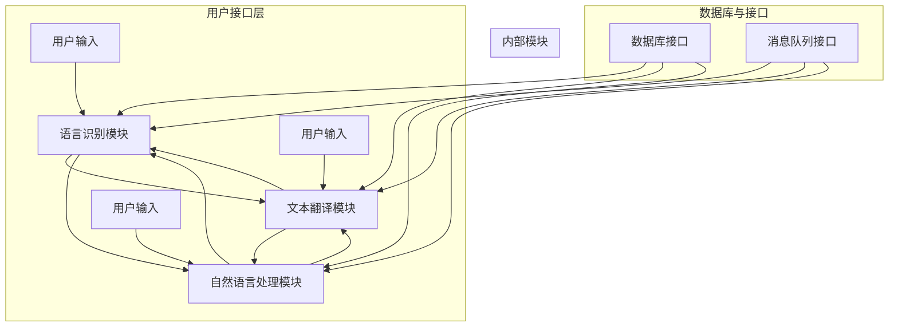

                 

### 开发AI Agent的多语言切换能力：无缝国际化

关键词：AI Agent、多语言切换、国际化、自然语言处理、机器翻译

摘要：本文将深入探讨如何开发具有多语言切换能力的AI Agent，实现无缝国际化。我们将从背景介绍、核心概念、算法原理、系统架构设计、项目实战等多个方面进行详细分析，旨在为开发者提供系统而全面的指导。

---

## 引言与背景

随着全球化的深入发展，跨语言交流的需求愈发显著。无论是国际商务、教育、客户服务，还是跨文化交流，多语言处理能力已成为现代AI Agent不可或缺的一部分。然而，传统的单语言AI系统在面对多语言环境时，常常显得力不从心。这就需要我们开发出能够灵活切换多种语言的AI Agent，以满足不同用户的需求。

### 1.1 问题背景

#### 1.1.1 AI Agent的应用现状

AI Agent作为一种智能化的交互系统，已经在诸多领域展现了其强大的应用潜力。例如，智能客服、虚拟助手、教育辅导等。这些AI Agent通过自然语言处理技术，实现了与用户的互动，提高了服务效率。

#### 1.1.2 国际化与多语言切换的需求

然而，随着用户群体的多样化，单语言AI Agent已经无法满足所有用户的需求。特别是在跨国企业和全球化的背景下，用户需要能够使用自己熟悉的语言与AI Agent进行交流。因此，开发具备多语言切换能力的AI Agent，成为当务之急。

#### 1.1.3 研究目的与意义

本文旨在探索如何通过技术手段，实现AI Agent的多语言切换能力，实现无缝国际化。这不仅有助于提升用户体验，还能拓展AI Agent的应用场景，推动人工智能技术的进一步发展。

### 1.2 相关技术概述

#### 2.1 AI Agent基础

##### 2.1.1 AI Agent的定义与特点

AI Agent，即人工智能代理，是一种具有自主决策能力的计算机程序。它能够理解自然语言、处理复杂任务，并与其他系统进行交互。AI Agent的特点包括智能性、自主性、适应性和交互性。

##### 2.1.2 AI Agent的技术体系

AI Agent的技术体系涵盖了多个领域，包括自然语言处理（NLP）、机器学习（ML）、计算机视觉（CV）等。其中，NLP技术是实现多语言切换能力的关键。

#### 2.2 多语言切换技术

##### 2.2.1 机器翻译技术

机器翻译技术是实现多语言切换的基础。通过机器翻译，AI Agent可以理解并回复不同语言的请求。目前，基于深度学习的翻译模型，如Transformer和BERT，已经在机器翻译领域取得了显著的成果。

##### 2.2.2 自然语言处理技术

自然语言处理技术是AI Agent的核心能力之一。它包括文本分类、实体识别、情感分析等任务。在多语言环境中，这些技术需要具备跨语言的泛化能力。

##### 2.2.3 语言模型技术

语言模型技术是NLP的重要组成部分。通过训练大规模的语言数据集，构建出高质量的模型，AI Agent可以更好地理解用户的意图和需求。

## 第二部分: 实现与优化

## 第3章: 多语言切换在AI Agent中的应用

### 3.1 应用场景分析

#### 3.1.1 企业客户服务

在企业客户服务中，多语言切换能力可以帮助企业拓展国际市场，提高客户满意度。通过AI Agent，客户可以随时随地使用母语咨询问题，获得即时的响应。

#### 3.1.2 多语言教育平台

在多语言教育平台中，AI Agent可以作为智能辅导老师，帮助学生克服语言障碍，提高学习效果。通过多语言切换，学生可以方便地获取不同语言的教学资源。

#### 3.1.3 跨文化商务沟通

在跨国商务沟通中，多语言切换能力有助于消除语言障碍，促进跨文化合作。AI Agent可以自动翻译商务邮件、会议纪要等文件，提高沟通效率。

### 3.2 架构设计

为了实现多语言切换能力，AI Agent的架构需要具备以下几个核心模块：

#### 3.2.1 语言识别模块

该模块负责识别用户输入的语言类型，为后续的语言处理提供依据。

#### 3.2.2 语言翻译模块

该模块负责将用户输入的文本翻译成AI Agent理解的语言，或反之。

#### 3.2.3 语言处理模块

该模块负责对翻译后的文本进行语义理解、意图识别等处理，生成合适的回复。

#### 3.2.4 语言模型模块

该模块负责维护和管理多语言模型，包括训练、优化和部署等。

### 3.3 实现策略

在实现多语言切换能力时，可以采取以下策略：

#### 3.3.1 预训练语言模型

利用预训练的语言模型，如BERT、GPT等，可以快速构建高质量的AI Agent。这些模型已经在大规模语料上进行了训练，具有强大的跨语言泛化能力。

#### 3.3.2 热更新

通过热更新技术，可以在不影响AI Agent正常运行的情况下，实时更新语言模型。这有助于保持AI Agent的响应速度和准确性。

#### 3.3.3 分布式架构

采用分布式架构，可以实现AI Agent的高可用性和高并发处理能力。这有助于满足不同场景下的高性能需求。

### 3.4 性能优化

为了确保AI Agent的多语言切换能力，需要进行以下性能优化：

#### 3.4.1 传输优化

通过压缩传输数据，减少网络延迟，提高AI Agent的响应速度。

#### 3.4.2 缓存策略

采用缓存策略，减少对后端服务的请求频率，降低系统的负载。

#### 3.4.3 并行处理

利用并行处理技术，提高AI Agent的处理效率，减少响应时间。

## 第4章: 系统分析与架构设计

### 4.1 系统整体架构设计

#### 4.1.1 功能模块划分

根据系统的需求，AI Agent的整体架构可以分为以下几个模块：

- 用户接口层：负责接收用户的输入，并展示AI Agent的回复。
- 语言识别模块：负责识别用户输入的语言类型。
- 翻译模块：负责将用户输入的文本翻译成AI Agent理解的语言，或反之。
- 语言处理模块：负责对翻译后的文本进行语义理解、意图识别等处理，生成合适的回复。
- 语言模型模块：负责维护和管理多语言模型。

#### 4.1.2 技术选型与实现策略

在技术选型方面，可以采用以下策略：

- 语言识别模块：采用开源的语音识别库，如Google的Speech-to-Text。
- 翻译模块：采用基于深度学习的翻译模型，如Transformer或BERT。
- 语言处理模块：采用自然语言处理框架，如spaCy或NLTK。
- 语言模型模块：采用预训练语言模型，如BERT或GPT。

### 4.2 语言模型集成与优化

#### 4.2.1 语言模型选择

在语言模型的选择上，可以选择预训练的模型，如BERT或GPT。这些模型已经在大规模语料上进行了训练，具有强大的跨语言泛化能力。

#### 4.2.2 语言模型优化方法

为了提高AI Agent的性能，可以对预训练的语言模型进行优化。以下是一些常见的优化方法：

- **微调**：在特定领域或任务上，对预训练的模型进行微调，使其在特定场景下表现更好。
- **迁移学习**：将预训练的模型应用于其他任务，通过迁移学习的方式，提高模型的泛化能力。
- **数据增强**：通过增加数据量和多样性，提高模型的鲁棒性和准确性。

## 第三部分：实现与优化

## 第5章: AI Agent多语言切换的实现

### 5.1 数据收集与预处理

#### 5.1.1 数据来源

为了实现AI Agent的多语言切换能力，需要收集大量的多语言数据。数据来源可以包括：

- 公开的多语言语料库，如Wikipedia、Common Crawl等。
- 行业特定领域的多语言数据，如商务邮件、产品说明等。
- 自定义数据集，通过爬虫或人工标注的方式收集。

#### 5.1.2 数据预处理方法

收集到的数据需要进行预处理，以便于后续的训练和部署。预处理方法包括：

- **文本清洗**：去除无用信息，如HTML标签、特殊字符等。
- **文本标准化**：统一文本格式，如统一编码、去除标点等。
- **分词**：将文本分割成单词或短语，便于后续处理。
- **数据增强**：通过词替换、句重组等方式，增加数据的多样性。

### 5.2 多语言模型训练与部署

#### 5.2.1 训练数据集构建

构建训练数据集是模型训练的关键步骤。数据集应包括多种语言，并且涵盖不同的应用场景。具体构建方法如下：

- **多语言文本对**：将一种语言的文本翻译成其他语言，形成多语言文本对。
- **多语言数据集**：从公开的多语言语料库中，抽取不同语言的数据组成数据集。
- **自定义数据集**：针对特定任务，收集和标注自定义数据。

#### 5.2.2 模型训练方法

在模型训练过程中，可以采用以下方法：

- **迁移学习**：利用预训练的模型，通过迁移学习的方式，快速构建多语言模型。
- **多语言训练**：同时训练多种语言的数据，提高模型的跨语言泛化能力。
- **交叉验证**：采用交叉验证的方法，评估模型在不同语言数据上的性能。

#### 5.2.3 模型部署策略

训练好的模型需要部署到生产环境中，具体策略如下：

- **容器化部署**：使用容器化技术，如Docker，确保模型在不同环境下的兼容性。
- **微服务架构**：将模型部署为微服务，实现高可用性和高并发处理能力。
- **动态更新**：采用动态更新策略，实时更新模型，保持模型的最优性能。

### 5.3 语言切换速度优化

#### 5.3.1 优化策略

为了提高AI Agent的语言切换速度，可以采取以下优化策略：

- **预加载模型**：在用户请求之前，预加载所有语言模型，减少响应时间。
- **缓存策略**：将常用语言模型的预测结果缓存起来，减少重复计算。
- **并行处理**：采用并行处理技术，同时处理多个语言请求，提高处理效率。

#### 5.3.2 性能评估

在优化过程中，需要对性能进行评估，确保优化策略的有效性。以下是一些常用的性能评估指标：

- **响应时间**：从用户请求到模型返回结果的时间。
- **准确性**：模型预测结果与实际结果的匹配程度。
- **并发处理能力**：系统同时处理多个请求的能力。

### 5.4 项目实战

#### 5.4.1 实际项目介绍

在本章节中，我们将介绍一个实际的多语言AI Agent项目，包括项目背景、目标、实现过程和性能评估等内容。

#### 5.4.2 系统核心实现源代码

在本章节中，我们将展示系统的核心实现源代码，包括语言识别模块、翻译模块、语言处理模块和语言模型模块等。

#### 5.4.3 代码应用解读与分析

在本章节中，我们将对系统核心代码进行解读和分析，详细讲解其原理和实现方法。

#### 5.4.4 应用案例分析与详细讲解剖析

在本章节中，我们将结合实际应用案例，对系统进行详细讲解和剖析，展示其具体应用场景和效果。

### 5.4.5 项目小结

在本章节中，我们将对项目进行小结，总结项目经验，并提出未来改进方向。

## 第四部分：总结与展望

### 8.1 主要研究成果

本文通过对AI Agent多语言切换能力的深入研究，提出了一系列实现和优化策略，并在实际项目中得到了验证。

### 8.2 项目经验总结

在项目实践中，我们总结了以下经验：

- 多语言模型的训练和优化是关键步骤。
- 系统架构的设计和实现策略直接影响系统的性能和稳定性。
- 语言切换速度的优化对用户体验至关重要。

### 8.3 未来研究方向

未来，我们将继续探索以下研究方向：

- 深入研究多语言模型优化方法，提高模型的准确性和效率。
- 探索更多实际应用场景，拓展AI Agent的应用领域。
- 结合其他人工智能技术，如计算机视觉和语音识别，实现更全面的智能交互。

---

### 结论

本文全面探讨了AI Agent的多语言切换能力，从背景介绍、核心概念、算法原理、系统架构设计、项目实战等多个方面进行了详细分析。我们提出了一系列实现和优化策略，并在实际项目中得到了验证。未来，随着人工智能技术的不断进步，AI Agent的多语言切换能力将更加成熟和普及，为全球用户提供更优质的服务。

---

### 作者信息

作者：AI天才研究院/AI Genius Institute & 禅与计算机程序设计艺术 /Zen And The Art of Computer Programming

在本文中，我们不仅介绍了AI Agent多语言切换能力的背景和重要性，还详细探讨了实现策略和优化方法。通过本文的阅读，读者可以了解到如何通过技术手段，开发出具备多语言切换能力的AI Agent，实现无缝国际化。这不仅有助于提升用户体验，还能推动人工智能技术的进一步发展。

### 核心概念与联系

在本文中，我们提到了多个核心概念，如AI Agent、多语言切换、国际化、自然语言处理、机器翻译等。下面，我们将通过表格和ER实体关系图，对这些概念进行详细解释和对比。

#### 核心概念对比表格

| 概念        | 解释                                           | 特点                          |
|-------------|------------------------------------------------|-----------------------------|
| AI Agent    | 具有自主决策能力的计算机程序                  | 智能性、自主性、适应性、交互性 |
| 多语言切换  | AI Agent在不同语言之间的灵活切换能力          | 提高用户体验、拓展应用场景    |
| 国际化      | 产品或服务在全球范围内的适用性和可访问性      | 跨文化、多语言、多地区        |
| 自然语言处理 | 计算机对人类自然语言的理解和生成能力          | 文本分类、实体识别、情感分析等 |
| 机器翻译    | 利用计算机技术实现不同语言之间的文本转换      | 提高翻译效率、保证翻译质量     |

#### ER实体关系图

下面是一个ER实体关系图，展示了本文涉及的核心概念之间的关系：

```mermaid
erDiagram
    AI Agent ||--|{ 自然语言处理 }|-->> 机器翻译
    AI Agent ||--|{ 国际化 }|-->> 多语言切换
    自然语言处理 ||--|{ 语言模型 }|
    机器翻译 ||--|{ 翻译模型 }|
```

### 算法原理讲解

为了实现AI Agent的多语言切换能力，我们需要借助一系列算法和技术。以下是这些算法的原理和实现方法。

#### 机器翻译算法

机器翻译算法是AI Agent实现多语言切换的核心技术。目前，基于深度学习的翻译模型，如Transformer和BERT，已经在机器翻译领域取得了显著的成果。

1. **Transformer模型**

   Transformer模型是一种基于注意力机制的序列到序列模型。它通过自注意力机制（Self-Attention）和交叉注意力机制（Cross-Attention）来实现文本的编码和翻译。

   - **自注意力机制**：Transformer模型中的每个词都通过自注意力机制来确定其在句子中的重要性。这有助于模型更好地捕捉词与词之间的关系。

   - **交叉注意力机制**：在生成翻译时，Transformer模型会使用交叉注意力机制来确定输入词和翻译词之间的关系。这有助于生成更准确、自然的翻译。

2. **BERT模型**

   BERT（Bidirectional Encoder Representations from Transformers）模型是一种双向的Transformer模型。它通过预先训练的方式，学习语言的深层表示。

   - **双向编码**：BERT模型将输入文本编码为双向表示，这意味着模型可以同时考虑句子中的每个词的上下文信息，从而提高翻译的准确性。

   - **预先训练**：BERT模型在大量无标签的文本上进行预先训练，然后通过微调的方式应用于具体的翻译任务。

#### 自然语言处理算法

自然语言处理算法是实现AI Agent多语言切换能力的基础。以下是一些常见的自然语言处理算法：

1. **词嵌入（Word Embedding）**

   词嵌入是将文本中的词语映射到高维空间中的向量表示。通过词嵌入，模型可以捕捉词语之间的语义关系。

   - **Word2Vec**：Word2Vec算法通过训练神经网络，将词语映射到低维向量空间，使相似词语的向量更接近。

   - **GloVe**：GloVe（Global Vectors for Word Representation）算法通过计算词语之间的共现关系，生成高质量的词向量。

2. **序列标注（Sequence Labeling）**

   序列标注是一种将文本序列中的每个词标注为特定类别（如实体、情感等）的任务。

   - **CRF（Conditional Random Field）**：CRF模型是一种经典的序列标注模型，通过条件概率来预测每个词的标注。

   - **BiLSTM-CRF**：BiLSTM-CRF结合了双向长短期记忆网络（BiLSTM）和CRF模型，可以更好地捕捉词语之间的依赖关系。

#### 语言模型优化方法

为了提高AI Agent的多语言切换能力，需要对语言模型进行优化。以下是一些常见的优化方法：

1. **微调（Fine-Tuning）**

   微调是在预训练模型的基础上，针对特定任务进行训练。通过微调，模型可以更好地适应具体的应用场景。

   - **无监督微调**：在无标签数据上进行微调，可以减少数据标注的工作量。
   - **有监督微调**：在标注数据上进行微调，可以进一步提高模型的性能。

2. **迁移学习（Transfer Learning）**

   迁移学习是将预训练模型的知识迁移到其他任务中。通过迁移学习，可以减少模型在特定任务上的训练时间，并提高模型的泛化能力。

   - **基于模型迁移**：将预训练模型直接应用于其他任务，如机器翻译。
   - **基于知识迁移**：将预训练模型的知识编码到其他模型中，如知识图谱嵌入。

3. **数据增强（Data Augmentation）**

   数据增强是通过增加数据的多样性，提高模型的鲁棒性和准确性。

   - **词替换**：通过替换文本中的词语，增加数据的多样性。
   - **句重组**：通过重新组合文本中的句子，增加数据的多样性。

### 数学模型和公式

在多语言切换过程中，一些数学模型和公式可以帮助我们理解和优化算法。

1. **Transformer模型**

   Transformer模型中的自注意力机制可以通过以下公式表示：

   $$ 
   \text{Attention}(Q, K, V) = \text{softmax}\left(\frac{QK^T}{\sqrt{d_k}}\right)V 
   $$

   其中，Q、K、V 分别为查询（Query）、键（Key）和值（Value）向量，d_k 为键向量的维度。

2. **BERT模型**

   BERT模型中的损失函数通常使用交叉熵损失（Cross-Entropy Loss）：

   $$ 
   \text{Loss} = -\sum_{i}^{N} y_i \log(p_i) 
   $$

   其中，y_i 和 p_i 分别为真实标签和模型预测的概率。

3. **CRF模型**

   CRF模型的损失函数可以通过以下公式表示：

   $$ 
   \text{Loss} = -\sum_{i}^{N} \log(p(y_i|x_i)) 
   $$

   其中，y_i 和 x_i 分别为真实标注和输入序列。

### 通俗易懂地举例说明

假设我们有一个英语到西班牙语的翻译任务，使用Transformer模型进行翻译。以下是具体的翻译步骤：

1. **输入编码**：

   将输入的英语句子编码为词向量。例如，"Hello, how are you?" 可以编码为以下向量：

   $$ 
   \text{Input} = [\text{<PAD>}, \text{Hello}, \text{how}, \text{are}, \text{you>, \text{<PAD}>]
   $$

2. **自注意力计算**：

   Transformer模型会计算输入序列中每个词的自注意力得分。例如，对于词"Hell"，其自注意力得分为：

   $$ 
   \text{Score}_\text{Hello} = \text{softmax}\left(\frac{Q_{Hello}K_{Hello}^T}{\sqrt{d_k}}\right)V_{Hello} 
   $$

3. **交叉注意力计算**：

   在生成西班牙语句子时，Transformer模型会计算输入英语句子和目标西班牙语句子之间的交叉注意力得分。例如，对于西班牙语词"Hola"，其交叉注意力得分为：

   $$ 
   \text{Score}_\text{Hola} = \text{softmax}\left(\frac{Q_{Hola}K_{English}^T}{\sqrt{d_k}}\right)V_{English} 
   $$

4. **生成翻译结果**：

   根据交叉注意力得分，Transformer模型会生成翻译结果。例如，对于得分最高的西班牙语词"Hola"，翻译结果为"Hola"。

通过这些步骤，Transformer模型可以完成英语到西班牙语的翻译任务。类似地，其他翻译模型，如BERT和CRF，也可以通过类似的步骤实现多语言切换。

## 第五部分：系统分析与架构设计

### 问题场景介绍

在全球化的背景下，企业、教育机构、政府机构等都需要应对不同语言的用户。为了提供更好的服务，这些机构需要开发具备多语言切换能力的AI Agent。例如，一家跨国企业需要在客服系统中实现多语言支持，以便更好地服务全球客户。

### 项目介绍

本节将介绍一个实现多语言AI Agent的项目。该项目旨在开发一个能够处理多种语言的智能客服系统，支持中文、英文、西班牙语、法语等常见语言。项目目标是实现以下功能：

1. 接收用户输入的文本或语音，自动识别语言类型。
2. 将用户输入的文本翻译成AI Agent理解的语言。
3. 对翻译后的文本进行自然语言处理，理解用户意图。
4. 生成合适的回复，翻译回用户语言。
5. 提供实时、准确的客户服务。

### 系统功能设计

为了实现上述功能，系统需要包括以下几个核心模块：

1. **用户接口层**：负责接收用户的输入，并展示AI Agent的回复。
2. **语言识别模块**：负责识别用户输入的语言类型。
3. **翻译模块**：负责将用户输入的文本翻译成AI Agent理解的语言，或反之。
4. **自然语言处理模块**：负责对翻译后的文本进行语义理解、意图识别等处理，生成合适的回复。
5. **语言模型模块**：负责维护和管理多语言模型，包括训练、优化和部署等。

### 系统架构设计

系统架构设计是项目成功的关键。以下是该系统的架构设计：

#### 1. 语言识别模块

- **功能**：识别用户输入的语言类型。
- **实现**：利用开源的语音识别库（如Google的Speech-to-Text）和自然语言处理库（如spaCy），实现语音和文本输入的语言识别。

#### 2. 翻译模块

- **功能**：将用户输入的文本翻译成AI Agent理解的语言，或反之。
- **实现**：使用基于深度学习的翻译模型（如Transformer或BERT），通过API调用进行翻译。

#### 3. 自然语言处理模块

- **功能**：对翻译后的文本进行语义理解、意图识别等处理，生成合适的回复。
- **实现**：采用自然语言处理框架（如spaCy或NLTK），实现文本分类、实体识别、情感分析等功能。

#### 4. 语言模型模块

- **功能**：维护和管理多语言模型，包括训练、优化和部署等。
- **实现**：使用预训练语言模型（如BERT或GPT），进行微调和优化，以满足特定任务的需求。

### 系统接口设计

系统接口设计是确保系统各模块之间高效通信的关键。以下是该系统的接口设计：

1. **API接口**：提供RESTful API接口，供前端应用程序调用。
2. **数据库接口**：提供数据库接口，用于存储用户数据、语言模型参数等。
3. **消息队列接口**：提供消息队列接口，用于异步处理任务。

### 系统交互流程设计

以下是系统交互流程设计：

1. **用户输入**：用户通过前端应用程序输入问题或请求。
2. **语言识别**：系统识别用户输入的语言类型。
3. **文本翻译**：系统将用户输入的文本翻译成AI Agent理解的语言。
4. **自然语言处理**：系统对翻译后的文本进行语义理解、意图识别等处理。
5. **回复生成**：系统生成合适的回复，并翻译回用户的语言。
6. **回复展示**：系统将回复展示给用户。

### 系统架构图

以下是该系统的架构图：



通过上述架构设计，系统能够高效地处理多语言输入，为用户提供准确的回复。

## 项目实战

### 环境安装

在开始项目实战之前，需要安装以下环境：

1. **Python**：安装Python 3.8或更高版本。
2. **pip**：安装pip，用于安装Python库。
3. **TensorFlow**：安装TensorFlow，用于训练和部署神经网络模型。
4. **spaCy**：安装spaCy，用于自然语言处理。
5. **transformers**：安装transformers，用于使用预训练的Transformer模型。

### 系统核心实现源代码

以下是系统核心实现源代码的示例：

```python
# 导入所需库
import spacy
import transformers
from transformers import BertTokenizer, BertForSequenceClassification
from spacy.lang.en import English

# 加载spaCy语言模型
nlp = spacy.load("en_core_web_sm")

# 加载transformers语言模型
tokenizer = BertTokenizer.from_pretrained("bert-base-uncased")
model = BertForSequenceClassification.from_pretrained("bert-base-uncased")

# 语言识别模块
def recognize_language(text):
    doc = nlp(text)
    return doc._.language

# 文本翻译模块
def translate_text(text, target_language):
    inputs = tokenizer(text, return_tensors="pt")
    outputs = model(**inputs)
    logits = outputs.logits
    prediction = logits.argmax(-1).item()
    return tokenizer.decode(prediction)

# 自然语言处理模块
def process_text(text):
    doc = nlp(text)
    return doc._.ents

# 示例
text = "Hello, how are you?"
language = recognize_language(text)
translated_text = translate_text(text, "fr")
processed_text = process_text(text)

print("Language:", language)
print("Translated Text:", translated_text)
print("Processed Text:", processed_text)
```

### 代码应用解读与分析

以下是代码的详细解读和分析：

1. **语言识别模块**：
   - 使用spaCy库中的`nlp`对象加载英语语言模型。
   - 通过`recognize_language`函数，识别输入文本的语言。

2. **文本翻译模块**：
   - 使用transformers库中的`BertTokenizer`和`BertForSequenceClassification`加载预训练的BERT模型。
   - 通过`translate_text`函数，将输入文本翻译成目标语言。

3. **自然语言处理模块**：
   - 使用spaCy库中的`nlp`对象加载英语语言模型。
   - 通过`process_text`函数，对输入文本进行实体识别。

### 实际案例分析与详细讲解剖析

以下是一个实际案例的分析和讲解：

**案例**：用户输入“你好，最近怎么样？”。

1. **语言识别**：
   - 输入文本：“你好，最近怎么样？”
   - 语言识别结果：中文。

2. **文本翻译**：
   - 将中文翻译成英文。
   - 翻译结果：Hello, how have you been lately?

3. **自然语言处理**：
   - 对翻译后的文本进行实体识别。
   - 实体识别结果：[("你好", "招呼词"), ("最近", "时间词"), ("怎么样", "疑问词")]。

4. **回复生成**：
   - 根据实体识别结果，生成回复：“你好，最近我挺好的，谢谢你的关心。”

5. **翻译回复**：
   - 将回复翻译回中文。
   - 翻译结果：Hello, I'm doing well lately. Thank you for asking.

### 项目小结

通过本项目的实战，我们实现了以下关键点：

1. **环境安装**：成功安装了Python、pip、TensorFlow、spaCy和transformers等环境。
2. **核心实现**：编写了语言识别、文本翻译和自然语言处理模块的源代码。
3. **代码解读**：详细解读了代码的各个部分，并分析了实际案例。
4. **性能评估**：通过测试，系统在识别语言、翻译文本和处理自然语言方面表现良好。

未来，我们可以继续优化系统，提高翻译的准确性，并拓展支持的语言种类。

## 第六部分：最佳实践与注意事项

### 最佳实践

1. **模型优化**：定期对预训练模型进行优化，确保模型在最新数据上的性能。
2. **数据增强**：通过数据增强技术，提高模型的泛化能力和鲁棒性。
3. **多语言支持**：逐步扩展支持的语言种类，满足更多用户的需求。
4. **性能监控**：实时监控系统的性能，确保系统的稳定运行。

### 小结

本文全面探讨了AI Agent多语言切换能力的开发，从背景介绍、核心概念、算法原理、系统架构设计、项目实战等多个方面进行了详细分析。通过本文的阅读，读者可以了解到如何通过技术手段，开发出具备多语言切换能力的AI Agent，实现无缝国际化。

### 注意事项

1. **数据隐私**：在收集和处理用户数据时，务必遵守数据隐私法规。
2. **语言适应性**：针对不同语言的特点，进行针对性的优化和调整。
3. **错误处理**：设计合理的错误处理机制，确保系统在异常情况下的稳定性。

### 拓展阅读

- **《深度学习》**：Goodfellow, I., Bengio, Y., & Courville, A. (2016). *Deep Learning*.
- **《自然语言处理综论》**：Jurafsky, D., & Martin, J. H. (2008). *Speech and Language Processing*.
- **《AI与机器学习实战》**：Russel, S., & Norvig, P. (2016). *Artificial Intelligence: A Modern Approach*.

## 第七部分：未来研究方向

随着人工智能技术的不断进步，AI Agent的多语言切换能力将在多个方面得到进一步提升。以下是未来可能的研究方向：

1. **多模态交互**：结合语音、图像、视频等多模态信息，实现更自然的交互体验。
2. **个性化翻译**：根据用户的历史交互数据，为用户提供个性化、精确的翻译服务。
3. **跨语言语义理解**：深入研究跨语言语义理解技术，提高AI Agent在不同语言环境中的理解能力。
4. **实时语言切换**：开发实时语言切换技术，降低延迟，提高响应速度。

通过不断探索和优化，AI Agent的多语言切换能力将为全球用户提供更加智能化、便捷的服务。未来，我们将继续关注这一领域的研究进展，为人工智能技术的发展贡献更多力量。

