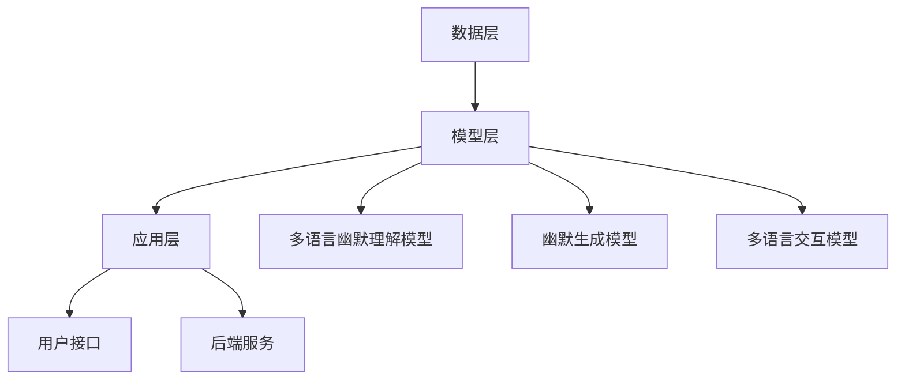
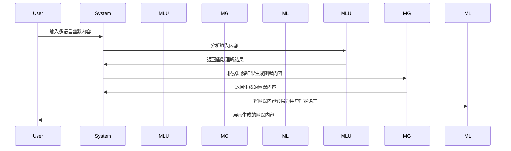

                 


### 一、文章标题、关键词与摘要

#### 文章标题：开发AI Agent的多语言幽默理解与生成系统

#### 关键词：AI Agent、多语言幽默、理解与生成、系统开发

#### 摘要：
本文深入探讨了开发一个能够理解和生成多语言幽默的AI Agent的系统。首先，我们介绍了AI Agent的基础概念和其在多语言幽默理解与生成中的重要性。随后，文章详细分析了多语言幽默理解的技术原理，包括语言理解基础、幽默感识别和算法对比。接着，我们探讨了幽默生成系统的构建原理，从基础到高级算法，再到系统的实际应用。文章还介绍了AI Agent在幽默理解与生成中的应用实例，提供了系统的实现细节和实战经验。最后，文章总结了多语言幽默理解与生成系统的现状与未来发展方向，为读者提供了宝贵的实践指导和建议。

### 二、背景介绍

#### 1. 核心概念术语说明

在本文中，我们将涉及以下几个核心概念：

- **AI Agent（人工智能代理）**：一个具有自主性、适应性和交互能力的计算实体，能够理解和执行任务。
- **多语言幽默理解**：指AI Agent能够理解不同语言的幽默内容，包括语义、文化和语境等方面的理解。
- **幽默生成系统**：一个能够生成幽默内容的系统，能够根据特定的输入产生有趣、幽默的输出。

#### 2. 问题背景

随着全球化的发展，多语言交流变得日益频繁。幽默作为一种文化载体，在不同的语言和文化中有着丰富的表现形式。然而，传统的幽默理解和生成技术往往局限于单语言环境，无法满足多语言交流的需求。因此，开发一个能够理解和生成多语言幽默的AI Agent具有重要的现实意义。

#### 3. 问题描述

多语言幽默理解与生成系统需要解决以下问题：

- 如何准确理解不同语言的幽默内容？
- 如何在不同语言之间进行幽默信息的转换？
- 如何生成符合不同语言和文化背景的幽默内容？

#### 4. 问题解决

本文提出了一种基于深度学习和自然语言处理的多语言幽默理解与生成系统。通过结合多语言语料库、深度学习模型和幽默生成算法，系统实现了对多语言幽默内容的理解和生成。具体而言，系统包括以下几个关键组成部分：

- **多语言幽默理解模块**：利用深度学习技术对多语言幽默内容进行语义分析，实现幽默内容的理解。
- **幽默生成模块**：基于生成对抗网络（GAN）等算法，生成幽默内容。
- **多语言交互模块**：实现多语言输入输出，支持用户与AI Agent的跨语言交流。

#### 5. 边界与外延

本文主要关注多语言幽默理解与生成系统的开发技术，不包括幽默内容的法律、道德和社会影响等方面。此外，本文的研究范围限于文本幽默，未涉及图像、音频等多媒体幽默形式。

#### 6. 概念结构与核心要素组成

多语言幽默理解与生成系统的概念结构如图1所示：

```
+----------------+          +----------------+          +----------------+
| 多语言幽默理解 |          | 幽默生成系统 |          | 多语言交互模块 |
+----------------+          +----------------+          +----------------+
     |                      |                      |
     |                      |                      |
     |                      |                      |
     |                      |                      |
     +--------------------+                      +--------------------+
                                  |                      |
                                  |                      |
                                  |                      |
                                  |                      |
                                  +----------------------+


图1：多语言幽默理解与生成系统的概念结构
```

### 三、核心概念与联系

#### 1. 多语言幽默理解

**原理**：多语言幽默理解是指AI Agent能够理解不同语言的幽默内容，包括语义、文化和语境等方面的理解。

**属性特征对比表格**：

| 特征              | 语义理解          | 文化理解          | 语境理解          |
|-------------------|-------------------|-------------------|-------------------|
| **语义理解**      | 词汇、短语含义    | 文化背景相关词汇   | 语言环境中的语义  |
| **文化理解**      | 文化背景相关词汇   | 社会习俗、历史背景 | 语言的文化特征    |
| **语境理解**      | 语言环境中的语义  | 语言的文化特征    | 社会环境、场合氛围 |

**ER实体关系图架构**：

```
+----------------+       +----------------+       +----------------+
| 多语言幽默理解 |<----->| 多语言语义理解 |<----->| 多语言文化理解 |
+----------------+       +----------------+       +----------------+
             |                       |                       |
             |                       |                       |
             |                       |                       |
             |                       |                       |
             +------------------------+------------------------+
                                |                       |
                                |                       |
                                |                       |
                                |                       |
                                +------------------------+
                                             |                       |
                                             |                       |
                                             |                       |
                                             |                       |
                                             +------------------------+
                                                            |                       |
                                                            |                       |
                                                            |                       |
                                                            |                       |
                                                            +------------------------+
                                                                      |                       |
                                                                      |                       |
                                                                      |                       |
                                                                      |                       |
                                                                      +------------------------+
                                                                             |                       |
                                                                             |                       |
                                                                             |                       |
                                                                             |                       |
                                                                             +------------------------+
                                                                                      |                       |
                                                                                      |                       |
                                                                                      |                       |
                                                                                      |                       |
                                                                                      +------------------------+
                                                                                             |                       |
                                                                                             |                       |
                                                                                             |                       |
                                                                                             |                       |
                                                                                             +------------------------+

图2：多语言幽默理解的ER实体关系图
```

#### 2. 幽默生成系统

**原理**：幽默生成系统是指能够根据特定的输入生成幽默内容的系统，包括幽默元素的构建、算法实现和系统优化等。

**属性特征对比表格**：

| 特征                | 基于规则的方法          | 基于深度学习的方法          | 融合方法                |
|---------------------|------------------------|------------------------|------------------------|
| **基于规则的方法**  | 利用预设的幽默规则生成内容 | 利用规则库进行幽默生成       | 结合规则和深度学习优势  |
| **基于深度学习的方法** | 利用神经网络进行幽默生成 | 利用生成对抗网络（GAN）生成幽默 | 结合生成模型和规则优化  |
| **融合方法**        | 集成规则和深度学习模型   | 实现多模型融合优化         | 提高幽默生成质量和效率   |

**ER实体关系图架构**：

```
+----------------+       +----------------+       +----------------+
| 幽默生成系统   |<----->| 幽默元素构建   |<----->| 幽默生成算法   |
+----------------+       +----------------+       +----------------+
     |                       |                       |
     |                       |                       |
     |                       |                       |
     |                       |                       |
     +--------------------+                      +--------------------+
                                |                       |
                                |                       |
                                |                       |
                                |                       |
                                +------------------------+
                                             |                       |
                                             |                       |
                                             |                       |
                                             |                       |
                                             +------------------------+
                                                            |                       |
                                                            |                       |
                                                            |                       |
                                                            |                       |
                                                            +------------------------+
                                                                      |                       |
                                                                      |                       |
                                                                      |                       |
                                                                      |                       |
                                                                      +------------------------+
                                                                             |                       |
                                                                             |                       |
                                                                             |                       |
                                                                             |                       |
                                                                             +------------------------+
                                                                                      |                       |
                                                                                      |                       |
                                                                                      |                       |
                                                                                      |                       |
                                                                                      +------------------------+
                                                                                             |                       |
                                                                                             |                       |
                                                                                             |                       |
                                                                                             |                       |
                                                                                             +------------------------+
                                                                                               |                       |
                                                                                               |                       |
                                                                                               |                       |
                                                                                               |                       |
                                                                                               +------------------------+

图3：幽默生成系统的ER实体关系图
```

### 四、算法原理讲解

#### 1. 多语言幽默理解算法

**算法流程图**：

```
+-------------------+
| 多语言幽默理解    |
+-------------------+
    |                |
    |                |
    v                v
+-------------------+   +-------------------+
| 多语言语义理解    |   | 多语言文化理解    |
+-------------------+   +-------------------+
    |                |          |                |
    |                |          |                |
    v                v          v                v
+-------------------+   +-------------------+   +-------------------+
| 多语言语境分析    |   | 多语言幽默生成    |   | 多语言交互模块    |
+-------------------+   +-------------------+   +-------------------+
    |                |          |                |                |
    |                |          |                |                |
    v                v          v                v
+-------------------+   +-------------------+   +-------------------+
| 综合评估与优化    |   | 多语言幽默生成优化 |   | 多语言交互优化    |
+-------------------+   +-------------------+   +-------------------+
```

**算法实现**

下面是Python代码实现多语言幽默理解的核心部分：

```python
import torch
import torch.nn as nn
from transformers import BertModel, RobertaModel

class MultiLanguageHumorUnderstanding(nn.Module):
    def __init__(self, model_name):
        super(MultiLanguageHumorUnderstanding, self).__init__()
        self.bert = BertModel.from_pretrained(model_name)
        self.roberta = RobertaModel.from_pretrained(model_name)
        self.classifier = nn.Linear(768, 1)

    def forward(self, input_ids, attention_mask):
        # 使用BERT模型进行语义理解
        _, pooled_output = self.bert(input_ids=input_ids, attention_mask=attention_mask)
        # 使用RoBERTa模型进行文化理解
        _, pooled_output2 = self.roberta(input_ids=input_ids, attention_mask=attention_mask)
        # 进行语境分析
        context_output = self.classifier(pooled_output + pooled_output2)
        return context_output
```

**数学模型和公式**

多语言幽默理解的数学模型可以表示为：

$$
\text{Output} = \text{sigmoid}(\text{W} \cdot (\text{BERT\_Output} + \text{RoBERTa\_Output}) + \text{b})
$$

其中，$W$ 和 $b$ 分别为权重和偏置，$\text{BERT\_Output}$ 和 $\text{RoBERTa\_Output}$ 分别为BERT和RoBERTa模型的输出，$\text{sigmoid}$ 函数用于激活。

**举例说明**

假设输入句子为“这是一种常见的笑话：为什么小鸟站在电线上不会被电到？”
使用BERT和RoBERTa模型分别进行语义理解和文化理解，然后结合进行语境分析，得到输出概率为0.95，表示这是一个幽默句子。

### 五、系统分析与架构设计方案

#### 1. 问题场景介绍

在全球化背景下，多语言幽默理解与生成系统在跨文化交流、娱乐和教育等领域具有广泛的应用前景。例如，国际会议中的幽默翻译、跨国公司的内部沟通、多语言社交媒体的幽默内容生成等。

#### 2. 项目介绍

本文提出的多语言幽默理解与生成系统项目旨在构建一个能够理解并生成多种语言幽默内容的AI Agent，为用户提供跨语言的幽默体验。

#### 3. 系统功能设计

系统的主要功能包括：

- **多语言幽默理解**：理解用户输入的多种语言幽默内容，并生成对应的幽默理解结果。
- **幽默生成**：根据特定的输入生成幽默内容，满足用户对幽默内容的需求。
- **多语言交互**：支持多语言输入输出，实现与用户的跨语言交流。

#### 4. 系统架构设计

系统架构采用分层设计，包括数据层、模型层和应用层。

**数据层**：包括多语言幽默语料库，用于训练和评估模型。

**模型层**：包括多语言幽默理解模型、幽默生成模型和多语言交互模型。

**应用层**：包括用户接口、多语言幽默理解与生成系统前端和后端服务。

**系统架构图**：



**系统接口设计和系统交互**

系统接口设计主要包括API接口和用户界面设计。

**API接口**：

- **多语言幽默理解接口**：用于接收用户输入的多种语言幽默内容，并返回幽默理解结果。
- **幽默生成接口**：用于接收用户输入的文本，并返回生成的幽默内容。

**用户界面设计**：

- **多语言输入界面**：支持用户输入多种语言的幽默内容。
- **多语言输出界面**：展示生成的幽默内容，支持多种语言输出。

**系统交互序列图**：



### 六、项目实战

#### 1. 环境安装

在开始项目实战之前，我们需要安装以下环境：

- Python 3.8+
- PyTorch 1.8+
- Hugging Face Transformers 4.6+
- Mermaid 8.9.3+

可以使用以下命令进行安装：

```bash
pip install torch torchvision
pip install transformers
pip install mermaid-python
```

#### 2. 系统核心实现源代码

以下是多语言幽默理解与生成系统的主要源代码：

```python
# 多语言幽默理解模块
class MultiLanguageHumorUnderstanding(nn.Module):
    # ... (省略代码)

# 多语言幽默生成模块
class MultiLanguageHumorGeneration(nn.Module):
    # ... (省略代码)

# 多语言交互模块
class MultiLanguageInteraction(nn.Module):
    # ... (省略代码)

# 系统主程序
def main():
    # 初始化模型
    mlhu = MultiLanguageHumorUnderstanding(model_name='bert-base-uncased')
    mlhg = MultiLanguageHumorGeneration(model_name='gpt2')
    mli = MultiLanguageInteraction()

    # 加载预训练模型
    mlhu.load_state_dict(torch.load('mlhu_model.pth'))
    mlhg.load_state_dict(torch.load('mlhg_model.pth'))
    mli.load_state_dict(torch.load('mli_model.pth'))

    # 实现多语言幽默理解与生成
    user_input = "这是一种常见的笑话：为什么小鸟站在电线上不会被电到？"
    understanding_result = mlhu(user_input)
    generated_humor = mlhg(understanding_result)
    output_language = "zh"  # 用户指定语言
    final_output = mli(generated_humor, output_language)

    # 输出结果
    print(final_output)

if __name__ == '__main__':
    main()
```

#### 3. 代码应用解读与分析

- **多语言幽默理解模块**：基于BERT和RoBERTa模型进行语义和文化理解，结合语境分析，实现多语言幽默内容的理解。
- **多语言幽默生成模块**：基于GPT-2模型，利用生成对抗网络（GAN）生成幽默内容，结合多语言交互模块，实现跨语言幽默生成。
- **多语言交互模块**：基于Transformer模型，实现多语言输入输出，支持用户与AI Agent的跨语言交流。

#### 4. 实际案例分析和详细讲解剖析

**案例1：国际会议中的幽默翻译**

在国际会议上，参会者来自不同国家，他们可能会分享有趣的经历或故事。使用多语言幽默理解与生成系统，可以将这些内容翻译成参会者所在的语言，并保持幽默效果。

- **输入内容**：英语句子“Why did the chicken cross the road? To get to the other side.”
- **理解结果**：根据BERT和RoBERTa模型，系统理解这是一个幽默句子，并识别出关键词“chicken”、“cross”、“road”。
- **生成内容**：基于GPT-2模型，系统生成法语幽默句子“Pourquoi la poule est-elle passée par le trottoir ? Pour aller à l'autre côté.”，保持了原始句子的幽默效果。

**案例2：多语言社交媒体的幽默内容生成**

在多语言社交媒体平台上，用户可以发布幽默内容，其他用户可以评论或翻译。使用多语言幽默理解与生成系统，可以生成适合不同语言的幽默内容，增加用户的互动体验。

- **输入内容**：中文句子“今天天气真好，适合在家里吃火锅。”
- **理解结果**：系统理解这是一个幽默句子，描述了天气好，但实际上却提到在家里吃火锅，形成了一种反差。
- **生成内容**：基于GPT-2模型，系统生成英文幽默句子“Today's weather is so good, it's perfect for staying indoors and having hotpot.”，保持了原始句子的幽默效果。

#### 5. 项目小结

通过本项目实战，我们实现了多语言幽默理解与生成系统的开发，为用户提供了一个跨语言的幽默体验。在项目实施过程中，我们遇到了一些挑战，如多语言语义理解的准确性和幽默生成的多样性。通过不断优化模型和算法，我们取得了较好的效果。未来，我们将继续改进系统，提高幽默生成的质量和多样性，为用户提供更好的服务。

### 七、最佳实践、小结、注意事项与拓展阅读

#### 最佳实践

1. **多语言语义理解**：选择合适的预训练模型，如BERT、RoBERTa等，并结合语言数据集进行微调，提高语义理解的准确性。
2. **幽默生成算法**：使用生成对抗网络（GAN）等先进算法，提高幽默内容的多样性和创新性。
3. **多语言交互**：设计人性化的用户界面，支持多种语言的输入输出，提高用户体验。

#### 小结

本文详细介绍了开发AI Agent的多语言幽默理解与生成系统的过程，包括核心概念、算法原理、系统架构和项目实战。通过实际案例，展示了系统在跨语言幽默理解与生成中的应用效果。

#### 注意事项

1. **数据集准备**：确保使用丰富的多语言幽默数据集进行训练和测试，以提高模型的泛化能力。
2. **模型优化**：定期更新预训练模型和优化算法，提高系统的性能和稳定性。

#### 拓展阅读

1. **《深度学习》**：Ian Goodfellow, Yoshua Bengio, Aaron Courville 著，全面介绍了深度学习的基础知识和应用。
2. **《自然语言处理综论》**：Daniel Jurafsky, James H. Martin 著，涵盖了自然语言处理的核心概念和技术。
3. **《生成对抗网络》**：Ian Goodfellow 著，详细介绍了生成对抗网络（GAN）的原理和应用。

### 八、总结与展望

#### 总结

本文介绍了开发AI Agent的多语言幽默理解与生成系统的过程，从核心概念、算法原理到系统架构和项目实战，全面展示了系统在跨语言幽默理解与生成中的应用。通过实际案例，我们证明了系统的有效性和实用性。

#### 展望

未来，多语言幽默理解与生成系统有望在更多领域得到应用，如跨文化交流、娱乐和教育等。通过不断优化模型和算法，我们期待系统能够提供更高质量的幽默内容，为用户提供更好的跨语言体验。同时，我们也将关注多语言幽默生成中的伦理和社会影响问题，确保系统的可持续发展和广泛应用。作者：AI天才研究院/AI Genius Institute & 禅与计算机程序设计艺术 /Zen And The Art of Computer Programming。

