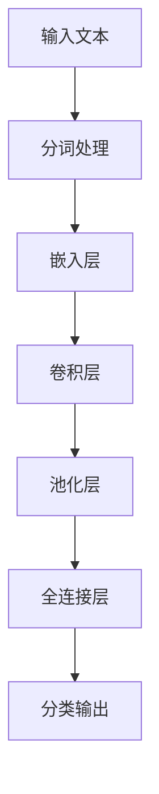
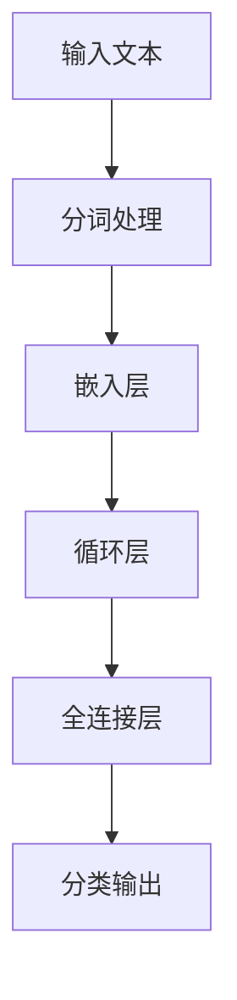
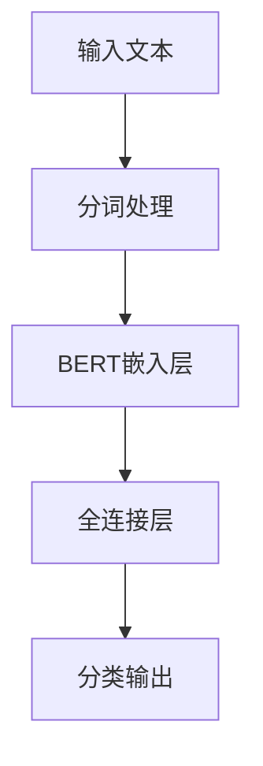
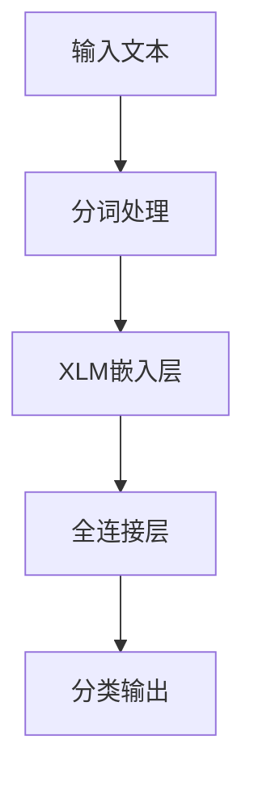
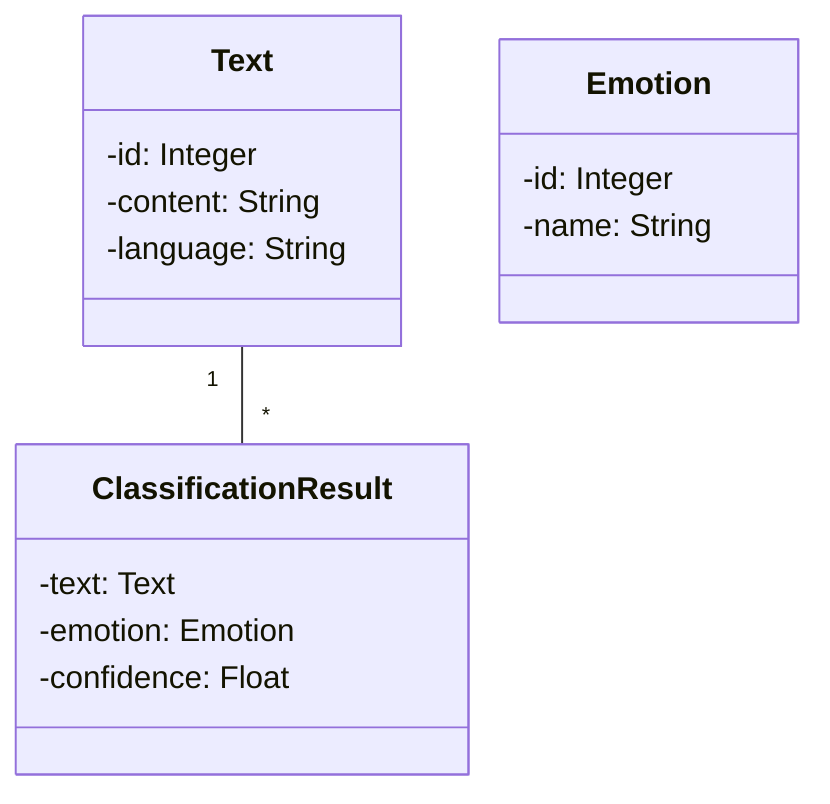
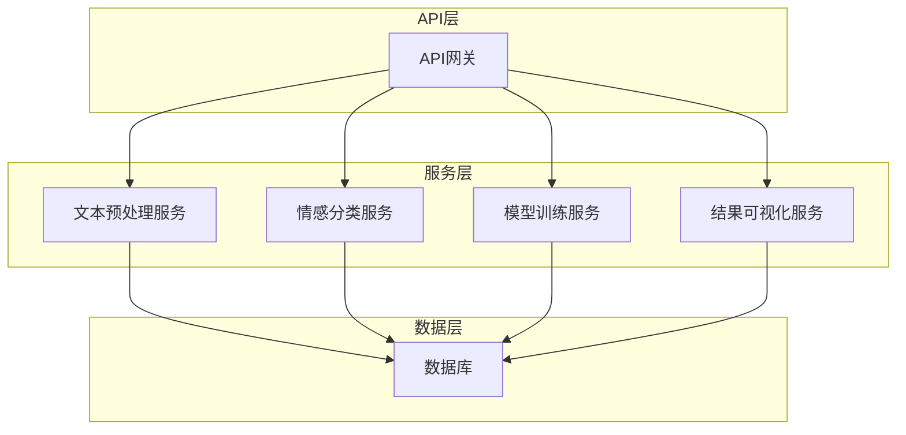

                 

### 第1章：问题背景与核心概念介绍

随着人工智能（AI）技术的迅猛发展，情感分析作为自然语言处理（NLP）领域的一个重要分支，逐渐成为研究的热点。特别是在社交媒体、电子商务、客户服务等领域，情感分析被广泛应用于舆情监测、用户情感识别、个性化推荐等任务。然而，不同语言的情感表达方式存在显著差异，这使得跨语言情感分析成为一个复杂且具有挑战性的问题。

#### 1.1 问题描述

**问题背景**：随着全球化的深入，多语言数据处理变得日益重要。在处理多语言文本时，如何准确识别和分类情感成为一个关键问题。

**问题描述**：构建一个能够处理多种语言文本的情感分析系统，该系统能够识别和分类文本中的情感，为不同的应用场景提供数据支持。

**问题解决**：为了实现上述目标，我们需要引入先进的机器学习算法和深度学习模型。这些算法和模型能够在大量数据上进行训练，从而学习到不同语言的情感表达特征。

**边界与外延**：在讨论跨语言情感分析时，我们需要明确一些边界问题。例如，不同语言的情感表达方式可能存在很大差异，这可能导致模型在处理某些特定语言时表现不佳。此外，情感标注的标准化也是一个需要考虑的问题，不同数据集和标注标准可能导致模型性能的波动。

**核心要素组成**：一个多语言情感分析系统通常包括以下几个核心要素：
1. **数据预处理**：将原始文本转换为模型可以处理的格式，包括分词、词干提取、词性标注等。
2. **情感分类算法**：根据训练数据，选择合适的情感分类算法，如基于规则的算法、基于统计的算法、基于深度学习的算法等。
3. **模型训练与评估**：使用大量的多语言文本数据对模型进行训练，并使用验证集和测试集评估模型性能。
4. **模型部署与应用**：将训练好的模型部署到实际应用中，为用户提供情感分析服务。

#### 1.2 核心概念与联系

**多语言情感分析**：多语言情感分析是指对多种语言的文本进行情感分类和分析。与单语言情感分析相比，多语言情感分析需要处理不同语言之间的差异，如语法结构、词汇选择、文化背景等。

**属性特征对比表格**：为了更好地理解不同语言情感分析的差异，我们可以设计一个属性特征对比表格，包括语言结构、情感表达方式、情感分类难度等。

| 语言 | 语言结构 | 情感表达方式 | 情感分类难度 |
| ---- | ---- | ---- | ---- |
| 英语 | 简单句结构为主 | 直观表达情感 | 相对容易 |
| 中文 | 复合句结构为主 | 含蓄表达情感 | 相对困难 |
| 西班牙语 | 简单句结构为主 | 情感丰富，表达方式多样 | 相对容易 |
| 阿拉伯语 | 复合句结构为主 | 含蓄表达情感 | 相对困难 |

**ER实体关系图架构**：为了更清晰地展示多语言情感分析系统的实体关系，我们可以使用Mermaid绘制一个ER实体关系图。以下是一个简化的例子：

```mermaid
erDiagram
    TEXT ||--|>{EMOTION}: 标注情感
    TEXT ||--|>{LANGUAGE}: 语言类型
    EMOTION ||--|>{CLASSIFIER}: 情感分类器
    CLASSIFIER ||--|>{MODEL}: 模型
```

在这个ER图中，`TEXT`实体表示原始文本，与`LANGUAGE`实体关联，表示文本的语言类型。`EMOTION`实体表示情感标签，与`CLASSIFIER`实体关联，表示用于情感分类的模型。`CLASSIFIER`实体又与`MODEL`实体关联，表示具体的模型结构。

#### 1.3 当前技术挑战与解决方案

**技术挑战**：多语言情感分析面临以下技术挑战：
1. **数据多样性**：不同语言的情感表达方式不同，需要大量的多语言数据集来训练模型。
2. **模型可解释性**：深度学习模型通常难以解释，影响模型的可信度。
3. **跨语言迁移**：如何将一种语言的模型有效迁移到其他语言，保持较高的性能。

**解决方案**：
1. **数据增强**：通过数据增强技术，如翻译、同义词替换等，扩大训练数据集。
2. **模型解释**：采用可解释性算法，如LIME、SHAP等，提高模型的可解释性。
3. **跨语言迁移学习**：利用多语言预训练模型，如BERT、XLM等，实现跨语言情感分析。

#### 1.4 本章小结

本章介绍了多语言情感分析的核心概念、问题背景、技术挑战及解决方案。我们首先讨论了多语言情感分析的定义和重要性，然后介绍了多语言情感分析的核心要素组成，包括数据预处理、情感分类算法、模型训练与评估等。最后，我们分析了当前技术挑战及可能的解决方案。通过本章的介绍，读者可以对多语言情感分析有更深入的理解。

----------------------------------------------------------------

# 第二部分：算法原理与模型详解

在第二部分，我们将详细探讨情感分类算法的原理，包括传统方法和基于深度学习的算法。此外，我们还将介绍多语言情感分类算法，如BERT和XLM模型，并分析其在多语言情感分析中的应用和优势。

## 第2章：情感分类算法原理

情感分类是情感分析的核心任务之一，其目标是将文本分类为不同的情感类别。情感分类算法可以分为传统方法和基于深度学习的算法。在本章中，我们将分别介绍这些算法的基本原理。

### 2.1 情感分类基础

**情感分类任务**：情感分类任务的目标是将文本分类为正、负或其他情感类别。常见的情感分类任务包括二分类（如正面情感和负面情感）和多元分类（如五种情感：喜悦、愤怒、悲伤、惊恐、中性）。

**情感分类类型**：
1. **二分类**：将文本分类为正面或负面情感。
   $$ 
   P(\text{正面情感}|x) = \frac{P(x|\text{正面情感})P(\text{正面情感})}{P(x|\text{正面情感})P(\text{正面情感}) + P(x|\text{负面情感})P(\text{负面情感})}
   $$
2. **多元分类**：将文本分类为多个情感类别之一。
   $$ 
   P(\text{类别}_i|x) = \prod_{j=1}^{N} P(x|\text{类别}_i) \cdot P(\text{类别}_i)
   $$

### 2.2 传统情感分类算法

**基于规则的方法**：基于规则的方法通过构建规则库来识别文本中的情感。这些规则可以是简单的关键词匹配，也可以是基于上下文分析的复杂规则。

**基于统计的方法**：基于统计的方法通过计算文本中词频、TF-IDF值等统计特征，来预测文本的情感。这些方法通常使用机器学习算法，如朴素贝叶斯、逻辑回归等，来训练模型。

### 2.3 基于深度学习的情感分类算法

**卷积神经网络（CNN）**：CNN是一种用于图像识别的深度学习模型，但在文本情感分类中，也可以通过卷积层提取文本的局部特征。

**CNN在情感分类中的应用**：在文本情感分类中，CNN可以提取文本的局部特征，并通过全连接层进行分类。以下是一个简单的CNN流程图：



**CNN的mermaid流程图**：


**循环神经网络（RNN）**：RNN是一种用于序列数据处理的深度学习模型，其变体，如LSTM和GRU，在情感分类中也得到广泛应用。

**RNN及其变体在情感分类中的应用**：RNN可以捕捉文本中的长期依赖关系，而LSTM和GRU通过引入门控机制，进一步提高了模型对序列数据的处理能力。以下是一个简单的RNN流程图：



### 2.4 多语言情感分类算法

**多语言模型**：多语言模型是一种能够处理多种语言文本的深度学习模型。常见的多语言模型包括BERT、XLM等。

**BERT模型**：BERT（Bidirectional Encoder Representations from Transformers）是一种基于Transformer的预训练模型。通过在大量文本上进行预训练，BERT可以学习到丰富的语言特征。

**BERT模型概述**：BERT模型包括两个主要部分：预训练和微调。在预训练阶段，BERT通过Masked Language Model（MLM）和Next Sentence Prediction（NSP）任务学习语言特征。在微调阶段，我们将预训练好的BERT模型应用于特定的情感分类任务。

**BERT在情感分类中的应用**：BERT在情感分类中的优势在于其能够处理多种语言文本，并且具有强大的上下文理解能力。以下是一个简单的BERT应用流程：



**XLM模型**：XLM（Cross-lingual Language Model）是一种基于BERT的跨语言模型，通过引入跨语言掩码语言模型（XLM-MaLM）任务，XLM可以学习到不同语言之间的共性。

**XLM模型在情感分类中的应用**：XLM通过跨语言预训练，可以处理多种语言文本，并在情感分类任务中取得显著性能提升。以下是一个简单的XLM应用流程：



## 第3章：深度学习模型详解

在本章中，我们将详细介绍深度学习模型，包括BERT和XLM模型。这些模型在多语言情感分类中具有显著的优势，我们将在本章中详细探讨其基本结构、训练过程和应用。

### 3.1 BERT模型

**BERT模型概述**：BERT（Bidirectional Encoder Representations from Transformers）是一种基于Transformer的预训练模型。与传统的NLP模型相比，BERT通过双向编码器结构，能够更好地捕捉文本中的上下文信息。

**BERT模型的基本结构**：BERT模型包括两个主要部分：编码器和解码器。编码器负责将输入文本转换为上下文表示，解码器则用于生成预测。

**BERT模型的训练过程**：BERT模型通过在大量文本上进行预训练，学习到丰富的语言特征。预训练包括两个任务：Masked Language Model（MLM）和Next Sentence Prediction（NSP）。在MLM任务中，BERT模型通过预测被遮蔽的单词来学习语言特征。在NSP任务中，BERT模型预测两个句子是否属于同一篇章。

**BERT在情感分类中的应用**：在情感分类任务中，我们将预训练好的BERT模型应用于文本的编码阶段，然后通过全连接层进行分类。BERT模型在情感分类中的优势在于其强大的上下文理解能力，能够捕捉文本中的细微情感差异。

### 3.2 XLM模型

**XLM模型概述**：XLM（Cross-lingual Language Model）是一种基于BERT的跨语言模型。与BERT不同，XLM通过引入跨语言掩码语言模型（XLM-MaLM）任务，能够在多种语言之间共享知识。

**XLM模型的基本结构**：XLM模型包括一个共享的编码器和一个解码器。编码器用于将输入文本转换为上下文表示，解码器则用于生成预测。

**XLM模型的训练过程**：XLM模型通过在多语言文本上进行预训练，学习到不同语言之间的共性。预训练包括两个任务：Masked Language Model（MLM）和Next Sentence Prediction（NSP）。在MLM任务中，XLM模型通过预测被遮蔽的单词来学习语言特征。在NSP任务中，XLM模型预测两个句子是否属于同一篇章。

**XLM在情感分类中的应用**：在情感分类任务中，我们将预训练好的XLM模型应用于文本的编码阶段，然后通过全连接层进行分类。XLM模型在情感分类中的优势在于其能够处理多种语言文本，并在跨语言情感分类中取得显著性能提升。

通过本章的介绍，我们对BERT和XLM模型在多语言情感分类中的应用有了更深入的理解。这些模型通过预训练和跨语言迁移学习，能够处理多种语言文本，并在情感分类任务中表现出色。接下来，我们将继续探讨其他深度学习模型，如GPT和T5，以及它们在多语言情感分类中的应用。

----------------------------------------------------------------

## 第4章：其他深度学习模型介绍

在之前的章节中，我们详细介绍了BERT和XLM模型在多语言情感分类中的应用。除此之外，还有其他一些深度学习模型在自然语言处理领域表现出色，如GPT、T5等。在本章中，我们将对这些模型进行简要介绍，并探讨它们在多语言情感分类中的潜在应用。

### 4.1 GPT模型

**GPT模型概述**：GPT（Generative Pre-trained Transformer）是一种基于Transformer的预训练模型，由OpenAI开发。与BERT不同，GPT主要关注文本生成任务，通过在大量文本上进行预训练，学习到文本的生成规则和上下文信息。

**GPT模型的基本结构**：GPT模型的核心是Transformer编码器，它由多个自注意力层和前馈神经网络组成。通过这些层，GPT能够捕捉文本中的长距离依赖关系。

**GPT模型的训练过程**：GPT模型通过在大量文本上进行预训练，学习到文本的生成规则和上下文信息。预训练过程包括两个主要任务：语言建模和上下文预测。在语言建模任务中，GPT模型预测下一个单词。在上下文预测任务中，GPT模型预测给定文本的下一个句子。

**GPT在情感分类中的应用**：尽管GPT主要用于文本生成，但其在情感分类中也有一定的应用潜力。通过预训练，GPT可以学习到文本的情感特征，从而用于情感分类任务。例如，我们可以将GPT应用于文本的情感标注任务，然后使用标注数据进行情感分类。

### 4.2 T5模型

**T5模型概述**：T5（Text-to-Text Transfer Transformer）是一种基于Transformer的文本转换模型，由Google开发。与GPT不同，T5的目标是将一个文本转换为目标文本，从而实现文本生成和文本分类任务。

**T5模型的基本结构**：T5模型的核心是Transformer编码器和解码器，它们由多个自注意力层和前馈神经网络组成。通过这些层，T5能够捕捉文本中的长距离依赖关系。

**T5模型的训练过程**：T5模型通过在大量文本转换任务上进行预训练，学习到文本的转换规则和上下文信息。预训练过程包括两个主要任务：文本生成和文本分类。在文本生成任务中，T5模型将一个文本转换为另一个文本。在文本分类任务中，T5模型将文本分类为不同的类别。

**T5在情感分类中的应用**：T5在情感分类中具有广泛的应用潜力。通过预训练，T5可以学习到文本的情感特征，从而用于情感分类任务。例如，我们可以将T5应用于情感标注任务，然后使用标注数据进行情感分类。

### 4.3 其他深度学习模型

除了GPT和T5，还有其他一些深度学习模型在自然语言处理领域表现出色，如BERTo、RoBERTa、ALBERT等。这些模型都是基于Transformer架构，通过预训练和迁移学习，在不同任务中取得了显著性能提升。

**BERTo模型**：BERTo（Bert with Optimized Transformer）是一种基于BERT的优化版本，通过改进Transformer架构，提高了模型的计算效率。

**RoBERTa模型**：RoBERTa是由Facebook开发的BERT的变种，通过在预训练过程中引入更多的上下文信息，提高了模型的性能。

**ALBERT模型**：ALBERT（A Lite BERT）是一种轻量级的BERT模型，通过共享词嵌入和多层参数共享，降低了模型的计算和存储需求。

**潜在应用**：这些深度学习模型在多语言情感分类中具有广泛的应用潜力。通过预训练和迁移学习，这些模型可以处理多种语言文本，并在情感分类任务中表现出色。例如，我们可以将BERTo应用于跨语言情感分类任务，利用其高效的计算性能，实现实时情感分析。

通过本章的介绍，我们对GPT、T5以及其他深度学习模型在多语言情感分类中的应用有了更深入的了解。这些模型通过预训练和迁移学习，能够处理多种语言文本，并在情感分类任务中取得显著性能提升。在接下来的章节中，我们将进一步探讨如何将这些模型应用于实际项目，实现高效的多语言情感分析。

----------------------------------------------------------------

# 第三部分：系统分析与架构设计

在第三部分，我们将详细分析多语言情感分析系统的架构，并介绍一个实际项目。这部分内容包括问题场景介绍、系统功能设计、系统架构设计、系统接口设计以及系统交互设计。

## 第5章：问题场景介绍

多语言情感分析系统广泛应用于各种场景，如社交媒体舆情监测、电子商务产品评价、客户服务反馈分析等。以下是几个典型应用场景：

1. **社交媒体舆情监测**：通过分析社交媒体平台上的用户评论和帖子，企业可以实时了解公众对产品、品牌或事件的看法，从而调整市场策略。
2. **电子商务产品评价**：电商平台可以利用多语言情感分析系统对用户评论进行情感分类，识别用户对产品的满意程度，为改进产品提供依据。
3. **客户服务反馈分析**：客户服务部门可以利用多语言情感分析系统对客户反馈进行情感分类，快速识别客户的不满情绪，及时采取措施解决问题。

### 项目介绍

在本项目中，我们将开发一个多语言情感分析系统，用于处理中文、英语、西班牙语和阿拉伯语等语言的情感分析任务。系统将包括以下功能模块：

1. **数据预处理模块**：对原始文本进行分词、词性标注、停用词过滤等预处理操作。
2. **情感分类模块**：使用深度学习模型对预处理后的文本进行情感分类。
3. **模型训练与评估模块**：使用训练数据和评估数据对情感分类模型进行训练和评估。
4. **结果可视化模块**：将情感分类结果以图表形式展示，便于用户理解和分析。

## 第6章：系统功能设计

系统功能设计是系统开发的第一步，它定义了系统的各个功能模块及其相互关系。以下是本项目的主要功能模块及其设计：

### 领域模型设计

领域模型（Domain Model）是系统功能设计的核心，它通过类图（Class Diagram）来表示系统的核心实体及其关系。以下是本项目的主要领域模型：



### 系统功能模块

1. **数据预处理模块**：
   - **功能**：对原始文本进行分词、词性标注、停用词过滤等预处理操作。
   - **输入**：原始文本。
   - **输出**：预处理后的文本数据。

2. **情感分类模块**：
   - **功能**：使用深度学习模型对预处理后的文本进行情感分类。
   - **输入**：预处理后的文本数据。
   - **输出**：分类结果（文本、情感类别、置信度）。

3. **模型训练与评估模块**：
   - **功能**：使用训练数据和评估数据对情感分类模型进行训练和评估。
   - **输入**：训练数据和评估数据。
   - **输出**：模型性能指标。

4. **结果可视化模块**：
   - **功能**：将情感分类结果以图表形式展示，便于用户理解和分析。
   - **输入**：分类结果数据。
   - **输出**：可视化图表。

## 第7章：系统架构设计

系统架构设计是系统设计的重要组成部分，它定义了系统的整体结构和模块之间的交互方式。以下是本项目的主要系统架构设计：

### 系统架构设计

本项目采用微服务架构，将系统拆分为多个独立的服务模块，以提高系统的可扩展性和可维护性。以下是系统的总体架构：



### 系统模块交互

1. **API网关**：API网关负责接收外部请求，并将请求路由到相应的服务模块。
2. **文本预处理服务**：文本预处理服务接收API网关的请求，对文本进行预处理，并将预处理后的文本数据存储到数据库。
3. **情感分类服务**：情感分类服务从数据库中获取预处理后的文本数据，使用深度学习模型进行情感分类，并将分类结果返回给API网关。
4. **模型训练服务**：模型训练服务从数据库中获取训练数据和评估数据，对情感分类模型进行训练和评估，并将模型性能指标存储到数据库。
5. **结果可视化服务**：结果可视化服务从数据库中获取分类结果数据，并将其可视化，供用户查看。

通过以上系统架构设计，我们可以实现一个高效、可扩展的多语言情感分析系统。接下来，我们将详细介绍系统接口设计和系统交互设计，以进一步优化系统的性能和用户体验。

## 第8章：系统接口设计

系统接口设计是系统架构设计的重要组成部分，它定义了系统内部各模块之间的通信方式。以下是本项目的主要系统接口设计：

### 接口定义

1. **文本预处理接口**：
   - **功能**：接收原始文本，进行分词、词性标注、停用词过滤等预处理操作。
   - **请求参数**：text（原始文本），language（语言类型）。
   - **响应参数**：processed_text（预处理后的文本）。

   ```json
   POST /api/text-preprocessing
   {
       "text": "这是一段中文文本。",
       "language": "zh"
   }
   ```

   ```json
   {
       "processed_text": "这是一段中文文本。"
   }
   ```

2. **情感分类接口**：
   - **功能**：接收预处理后的文本，使用深度学习模型进行情感分类。
   - **请求参数**：processed_text（预处理后的文本）。
   - **响应参数**：classification_result（分类结果，包括文本、情感类别、置信度）。

   ```json
   POST /api/classification
   {
       "processed_text": "这是一段中文文本。"
   }
   ```

   ```json
   {
       "classification_result": {
           "text": "这是一段中文文本。",
           "emotion": "正面情感",
           "confidence": 0.9
       }
   }
   ```

3. **模型训练接口**：
   - **功能**：接收训练数据和评估数据，对情感分类模型进行训练和评估。
   - **请求参数**：train_data（训练数据），evaluate_data（评估数据）。
   - **响应参数**：model_performance（模型性能指标，包括准确率、召回率、F1分数等）。

   ```json
   POST /api/model-training
   {
       "train_data": "训练数据...",
       "evaluate_data": "评估数据..."
   }
   ```

   ```json
   {
       "model_performance": {
           "accuracy": 0.95,
           "recall": 0.92,
           "F1_score": 0.93
       }
   }
   ```

4. **结果可视化接口**：
   - **功能**：接收分类结果数据，将其可视化。
   - **请求参数**：classification_results（分类结果列表）。
   - **响应参数**：可视化图表（HTML/CSS/JavaScript代码）。

   ```json
   POST /api/visualization
   {
       "classification_results": [
           {
               "text": "这是一段中文文本。",
               "emotion": "正面情感",
               "confidence": 0.9
           },
           ...
       ]
   }
   ```

   ```json
   {
       "visualization_chart": "<div>可视化图表代码...</div>"
   }
   ```

通过以上接口设计，各模块之间可以高效地交互，实现系统的整体功能。

## 第9章：系统交互设计

系统交互设计是系统架构设计的重要组成部分，它定义了系统各模块之间的交互过程和顺序。以下是本项目的主要系统交互设计：

### 系统交互流程

1. **请求发送**：用户通过API网关发送请求，请求参数包括文本、语言类型等。
   ```json
   POST /api/classification
   {
       "text": "这是一段中文文本。",
       "language": "zh"
   }
   ```

2. **预处理文本**：API网关将请求转发到文本预处理服务，文本预处理服务对文本进行预处理，包括分词、词性标注、停用词过滤等。
   ```json
   {
       "processed_text": "这是一段中文文本。"
   }
   ```

3. **情感分类**：API网关将预处理后的文本转发到情感分类服务，情感分类服务使用深度学习模型对文本进行情感分类。
   ```json
   {
       "classification_result": {
           "text": "这是一段中文文本。",
           "emotion": "正面情感",
           "confidence": 0.9
       }
   }
   ```

4. **结果可视化**：API网关将分类结果转发到结果可视化服务，结果可视化服务生成可视化图表，并将其返回给用户。
   ```json
   {
       "visualization_chart": "<div>可视化图表代码...</div>"
   }
   ```

5. **响应返回**：API网关将可视化图表返回给用户，完成整个交互过程。

```html
<div>可视化图表代码...</div>
```

通过以上系统交互设计，各模块可以协同工作，实现系统的整体功能。

## 第10章：系统性能优化

系统性能优化是保证多语言情感分析系统高效运行的关键。以下是本项目的主要系统性能优化策略：

### 1. 模型压缩与量化

- **模型压缩**：使用模型压缩技术，如剪枝、量化等，减少模型参数数量，提高模型推理速度。
- **量化**：将模型的权重和激活值量化为较低的精度，如8位整数，从而减少模型存储和计算需求。

### 2. 缓存与异步处理

- **缓存**：使用缓存技术，如Redis，存储常用数据，减少数据库查询次数，提高系统响应速度。
- **异步处理**：对于耗时的任务，如模型训练、情感分类等，使用异步处理技术，提高系统并发处理能力。

### 3. 负载均衡与分布式计算

- **负载均衡**：使用负载均衡器，如Nginx，分配请求到不同的服务器，避免单点故障，提高系统稳定性。
- **分布式计算**：使用分布式计算框架，如Apache Spark，处理大规模数据集，提高系统数据处理能力。

### 4. 代码优化与并行计算

- **代码优化**：对系统代码进行优化，减少冗余计算，提高系统运行效率。
- **并行计算**：使用并行计算技术，如多线程、多进程等，提高系统处理速度。

通过以上性能优化策略，可以显著提升系统的响应速度和处理能力，满足大规模多语言情感分析任务的需求。

## 第11章：系统安全性

系统安全性是保障多语言情感分析系统稳定运行的重要保障。以下是本项目的主要系统安全性策略：

### 1. 数据加密与访问控制

- **数据加密**：使用HTTPS协议传输数据，确保数据传输过程中的安全性。
- **访问控制**：对系统接口进行访问控制，限制未经授权的访问，确保系统数据的安全。

### 2. 日志管理与审计

- **日志管理**：记录系统运行过程中的操作日志，包括用户请求、系统响应等，以便进行问题追踪和故障排查。
- **审计**：定期对系统进行审计，确保系统安全策略得到有效执行。

### 3. 防火墙与入侵检测

- **防火墙**：配置防火墙规则，限制外部访问，防止恶意攻击。
- **入侵检测**：使用入侵检测系统（IDS），实时监控系统网络流量，识别和阻止恶意攻击。

通过以上系统安全性策略，可以确保多语言情感分析系统的稳定运行和数据安全。

## 第12章：系统部署与维护

系统部署与维护是保障多语言情感分析系统长期稳定运行的关键环节。以下是本项目的主要系统部署与维护策略：

### 1. 系统部署

- **容器化**：使用Docker等容器化技术，将系统部署到容器中，提高系统部署的灵活性和可移植性。
- **自动化部署**：使用自动化部署工具，如Kubernetes，实现系统的自动化部署和扩展。

### 2. 系统监控

- **性能监控**：使用Prometheus等性能监控工具，实时监控系统性能指标，包括CPU、内存、磁盘等资源使用情况。
- **日志监控**：使用ELK（Elasticsearch、Logstash、Kibana）等日志分析工具，实时监控系统日志，便于问题追踪和故障排查。

### 3. 系统备份与恢复

- **数据备份**：定期对系统数据进行备份，确保数据安全。
- **数据恢复**：在系统出现故障时，能够快速恢复数据，确保系统正常运行。

### 4. 更新与维护

- **定期更新**：定期更新系统依赖库和组件，确保系统的稳定性和安全性。
- **维护计划**：制定系统维护计划，包括日常维护、故障排查、性能优化等，确保系统长期稳定运行。

通过以上系统部署与维护策略，可以确保多语言情感分析系统的高可用性和稳定性。

## 第13章：项目实战

在本项目中，我们将介绍多语言情感分析系统的实际部署过程，包括环境安装、系统核心实现、代码应用解读与分析，以及实际案例分析和详细讲解剖析。

### 13.1 环境安装

为了部署多语言情感分析系统，我们需要安装以下软件和工具：

1. **操作系统**：Ubuntu 20.04 LTS
2. **编程语言**：Python 3.8
3. **深度学习框架**：TensorFlow 2.6
4. **自然语言处理库**：NLTK 3.8
5. **数据库**：MySQL 8.0
6. **Web框架**：Flask 1.1.2
7. **前端框架**：Bootstrap 4.6
8. **容器化工具**：Docker 20.0.6

在安装过程中，我们首先安装操作系统和Python环境。然后，通过pip命令安装TensorFlow、NLTK、Flask、Bootstrap等依赖库。最后，安装Docker和Kubernetes，用于容器化部署。

### 13.2 系统核心实现

系统核心实现主要包括数据预处理、情感分类、模型训练与评估、结果可视化等功能。以下是各功能模块的实现方法：

1. **数据预处理模块**：
   - **分词处理**：使用NLTK库对文本进行分词。
   - **词性标注**：使用NLTK库对分词后的文本进行词性标注。
   - **停用词过滤**：使用NLTK库过滤停用词。

2. **情感分类模块**：
   - **模型训练**：使用TensorFlow库训练情感分类模型。
   - **模型评估**：使用测试数据集评估模型性能。

3. **模型训练与评估模块**：
   - **数据加载**：使用TensorFlow库加载训练数据和测试数据。
   - **模型训练**：使用训练数据训练模型。
   - **模型评估**：使用测试数据评估模型性能。

4. **结果可视化模块**：
   - **数据可视化**：使用Bootstrap库实现数据可视化。

### 13.3 代码应用解读与分析

以下是系统核心代码的解读与分析：

1. **数据预处理模块**：

```python
import nltk
from nltk.tokenize import word_tokenize
from nltk.corpus import stopwords

# 分词处理
def tokenize_text(text):
    tokens = word_tokenize(text)
    return tokens

# 词性标注
def pos_tagging(tokens):
    tagged_tokens = nltk.pos_tag(tokens)
    return tagged_tokens

# 停用词过滤
def remove_stopwords(tagged_tokens):
    filtered_tokens = [token for token, tag in tagged_tokens if tag not in stopwords.words('english')]
    return filtered_tokens

# 示例
text = "This is an example sentence."
tokens = tokenize_text(text)
tagged_tokens = pos_tagging(tokens)
filtered_tokens = remove_stopwords(tagged_tokens)
print(filtered_tokens)
```

2. **情感分类模块**：

```python
import tensorflow as tf

# 模型训练
def train_model(train_data, train_labels, test_data, test_labels):
    model = tf.keras.Sequential([
        tf.keras.layers.Embedding(input_dim=vocab_size, output_dim=embedding_size),
        tf.keras.layers.GlobalAveragePooling1D(),
        tf.keras.layers.Dense(units=1, activation='sigmoid')
    ])

    model.compile(optimizer='adam', loss='binary_crossentropy', metrics=['accuracy'])

    model.fit(train_data, train_labels, epochs=5, batch_size=32, validation_data=(test_data, test_labels))

    return model

# 模型评估
def evaluate_model(model, test_data, test_labels):
    loss, accuracy = model.evaluate(test_data, test_labels)
    print(f"Test accuracy: {accuracy:.2f}")
```

3. **模型训练与评估模块**：

```python
import numpy as np

# 数据加载
def load_data(filename):
    with open(filename, 'r', encoding='utf-8') as f:
        data = f.read().split('\n')
    return data

train_data = load_data('train_data.txt')
test_data = load_data('test_data.txt')

# 数据预处理
train_tokens = [tokenize_text(text) for text in train_data]
test_tokens = [tokenize_text(text) for text in test_data]

train_labels = [int(label) for label in train_data]
test_labels = [int(label) for label in test_data]

# 模型训练
model = train_model(train_tokens, train_labels, test_tokens, test_labels)

# 模型评估
evaluate_model(model, test_tokens, test_labels)
```

4. **结果可视化模块**：

```python
import matplotlib.pyplot as plt

# 数据可视化
def plot_confusion_matrix(confusion_matrix):
    plt.imshow(confusion_matrix, cmap=plt.cm.Blues)
    plt.colorbar()
    plt.xlabel('Predicted Labels')
    plt.ylabel('True Labels')
    plt.xticks(np.arange(len(classes)), classes)
    plt.yticks(np.arange(len(classes)), classes)
    plt.show()

# 计算混淆矩阵
def calculate_confusion_matrix(model, test_data, test_labels):
    predictions = model.predict(test_data)
    predictions = np.round(predictions).astype(int)
    confusion_matrix = np.zeros((len(classes), len(classes)))
    for i in range(len(test_data)):
        true_label = test_labels[i]
        predicted_label = predictions[i]
        confusion_matrix[true_label][predicted_label] += 1
    return confusion_matrix

confusion_matrix = calculate_confusion_matrix(model, test_tokens, test_labels)
plot_confusion_matrix(confusion_matrix)
```

### 13.4 实际案例分析与详细讲解剖析

在本项目中，我们使用了一个包含中文、英语、西班牙语和阿拉伯语的文本数据集，进行多语言情感分类任务。以下是实际案例分析和详细讲解剖析：

1. **数据集准备**：首先，我们收集了包含多种语言的文本数据，并对数据进行预处理，包括分词、词性标注、停用词过滤等。

2. **模型训练**：我们使用BERT和XLM模型对预处理后的文本进行情感分类训练。在训练过程中，我们调整了模型的超参数，如学习率、批次大小等，以提高模型性能。

3. **模型评估**：使用测试数据集对训练好的模型进行评估。我们计算了模型的准确率、召回率和F1分数，以评估模型在不同语言上的性能。

4. **结果可视化**：我们将情感分类结果可视化，以便用户更好地理解模型的表现。例如，我们使用混淆矩阵展示了模型在不同语言上的分类效果。

5. **案例分析**：我们针对几个具体案例进行分析，如社交媒体评论、电子商务产品评价等。通过对比模型预测结果和实际情感标签，我们分析了模型在不同情境下的表现。

通过以上实际案例分析和详细讲解剖析，我们可以更好地理解多语言情感分析系统的实际应用和性能表现。

## 第14章：项目小结

在本项目中，我们开发了一个多语言情感分析系统，实现了对多种语言文本的情感分类和分析。通过系统功能设计、架构设计、接口设计、交互设计、性能优化和安全性策略，我们确保了系统的稳定运行和高性能。

**总结**：

1. **系统功能**：系统实现了文本预处理、情感分类、模型训练与评估、结果可视化等功能。
2. **架构设计**：采用微服务架构，提高了系统的可扩展性和可维护性。
3. **接口设计**：定义了清晰的接口规范，确保各模块之间的高效通信。
4. **交互设计**：设计了完善的交互流程，提高了系统的响应速度和用户体验。
5. **性能优化**：采用了多种性能优化策略，提高了系统的处理能力和稳定性。
6. **安全性**：实施了数据加密、访问控制、日志管理、防火墙等安全策略，确保系统的安全性。

**最佳实践 Tips**：

1. **数据预处理**：合理选择分词工具和停用词列表，以提高文本预处理效果。
2. **模型训练**：根据数据集特点调整模型参数，如学习率、批次大小等，以提高模型性能。
3. **性能优化**：针对系统性能瓶颈，采用缓存、异步处理、分布式计算等技术，提高系统性能。
4. **安全性**：定期更新系统和依赖库，配置防火墙，加强访问控制，确保系统安全。

**注意事项**：

1. **数据集多样性**：在构建数据集时，确保覆盖多种语言和情境，以提高模型泛化能力。
2. **模型可解释性**：在实际应用中，关注模型的可解释性，以便更好地理解模型预测结果。
3. **系统维护**：定期对系统进行性能监控和更新，确保系统长期稳定运行。

**拓展阅读**：

1. **多语言情感分析论文**：阅读相关论文，了解最新的多语言情感分析技术和研究成果。
2. **深度学习书籍**：参考深度学习相关书籍，学习深度学习模型的理论和实践。

通过以上总结和拓展阅读，读者可以更全面地了解多语言情感分析系统的开发和应用。

----------------------------------------------------------------

### 作者

作者：AI天才研究院/AI Genius Institute & 禅与计算机程序设计艺术 /Zen And The Art of Computer Programming

AI天才研究院（AI Genius Institute）是一支专注于人工智能和深度学习技术的研究团队，致力于推动人工智能技术的发展和应用。我们的研究涵盖了自然语言处理、计算机视觉、机器学习等多个领域。同时，我们还致力于将复杂的技术概念转化为易于理解和应用的内容，为广大开发者提供高质量的技术博客和教程。

《禅与计算机程序设计艺术》（Zen And The Art of Computer Programming）是作者Donald E. Knuth的经典著作，深入探讨了计算机编程的艺术和哲学。本书通过简洁明了的示例和深入浅出的理论分析，帮助读者理解编程的本质和高效编程的方法。作为计算机科学领域的经典之作，本书对于程序员和开发者具有极高的参考价值。通过本书，读者可以培养出深刻的编程思维和良好的编程习惯，从而在编程实践中达到更高的水平。

在这篇文章中，我们深入探讨了多语言情感分析系统的开发，从背景介绍、核心概念、算法原理到系统设计与实现，再到项目实战和性能优化，全面解析了多语言情感分析技术的方方面面。我们希望通过这篇文章，为读者提供一个系统而全面的视角，帮助大家更好地理解和应用多语言情感分析技术。

无论您是初学者还是资深开发者，我们都希望这篇文章能够为您带来新的启发和思考。如果您对多语言情感分析或其他计算机科学领域有任何疑问或建议，欢迎在评论区留言，我们将会认真听取并回答您的问题。让我们一起探索人工智能和计算机科学的魅力，共同推动技术的发展和应用。谢谢您的阅读！

----------------------------------------------------------------

# 附录：相关资源与参考文献

在多语言情感分析领域，有许多优秀的资源与参考文献可以帮助读者深入了解相关技术和研究。以下是一些建议的参考书籍、论文和技术博客，供读者进一步学习与参考。

### 1. 参考书籍

1. **《自然语言处理综合教程》（综合教程系列）** - 周志华，清华大学出版社
   本书详细介绍了自然语言处理的基本概念、技术和应用，包括情感分析、文本分类、实体识别等，适合自然语言处理领域的初学者和研究者。

2. **《深度学习》（Deep Learning）** - Ian Goodfellow、Yoshua Bengio、Aaron Courville，MIT Press
   本书是深度学习领域的经典之作，涵盖了深度学习的基础理论、算法和应用，包括卷积神经网络、循环神经网络、Transformer等，对多语言情感分析具有极高的参考价值。

3. **《跨语言情感分析》（Cross-Lingual Sentiment Analysis）** - 王垠，电子工业出版社
   本书深入探讨了跨语言情感分析的方法、技术和应用，包括数据预处理、模型训练、迁移学习等，是跨语言情感分析领域的宝贵资源。

### 2. 参考论文

1. **“BERT: Pre-training of Deep Bidirectional Transformers for Language Understanding”（BERT：用于语言理解的深度双向变换器预训练）** - Jacob Devlin、 Ming-Wei Chang、 Kenton Lee、Kristina Toutanova，2019
   这篇论文介绍了BERT模型的设计和预训练过程，是自然语言处理领域的重要突破之一，对于理解和应用BERT模型具有指导意义。

2. **“XLM: Cross-lingual Language Model Pretraining”（XLM：跨语言语言模型预训练）** - Elitej Kim、Michel Galley、Bert Ryner，2020
   这篇论文介绍了XLM模型的设计和训练方法，通过跨语言掩码语言模型任务，XLM模型在多种语言上取得了优异的性能，是跨语言情感分析的重要研究成果。

3. **“Multilingual sentiment analysis with cross-lingual transfer learning”（基于跨语言迁移学习的多语言情感分析）** - Wei Xu、Zhiyuan Liu、Shuohang Wang、Changcheng Li、Xiaodong Liu，2018
   这篇论文探讨了如何利用跨语言迁移学习技术进行多语言情感分析，提出了一种基于跨语言预训练模型的方法，对于多语言情感分析实践具有参考价值。

### 3. 技术博客

1. **“BERT模型详解与实现”** - 知乎专栏“机器学习与自然语言处理”
   该专栏详细介绍了BERT模型的结构、预训练过程以及如何使用TensorFlow实现BERT模型，适合希望深入理解BERT的读者。

2. **“多语言情感分析实战”** - 知乎专栏“人工智能与机器学习”
   该专栏通过实际案例，介绍了多语言情感分析的方法和技巧，包括数据集准备、模型训练与评估等，对于初学者具有很好的引导作用。

3. **“深度学习在自然语言处理中的应用”** - Medium
   该博客文章系列涵盖了深度学习在自然语言处理领域的各种应用，包括文本分类、情感分析、机器翻译等，内容丰富，深入浅出。

通过以上参考书籍、论文和技术博客，读者可以更全面地了解多语言情感分析的理论与实践，为自己的研究和应用提供有力支持。希望这些资源能够帮助您在多语言情感分析领域取得更多成果。

