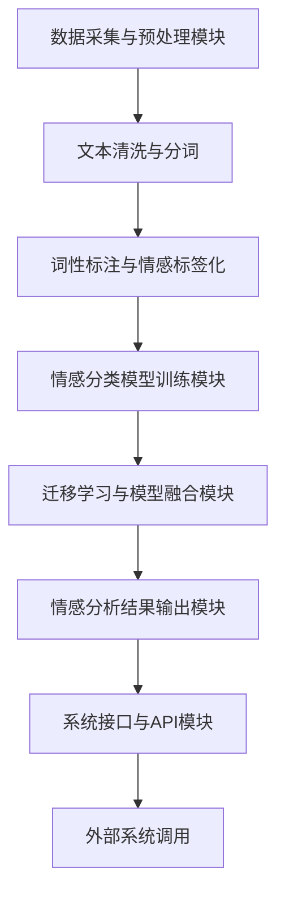
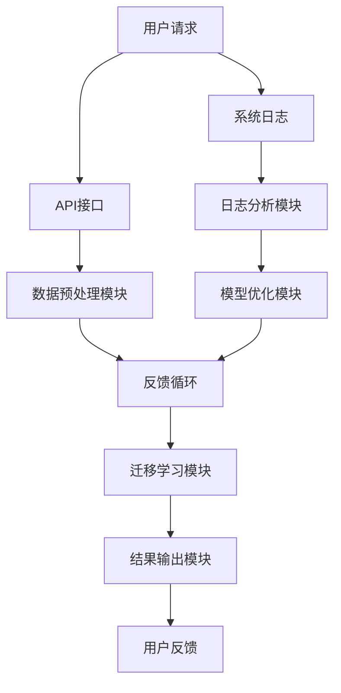
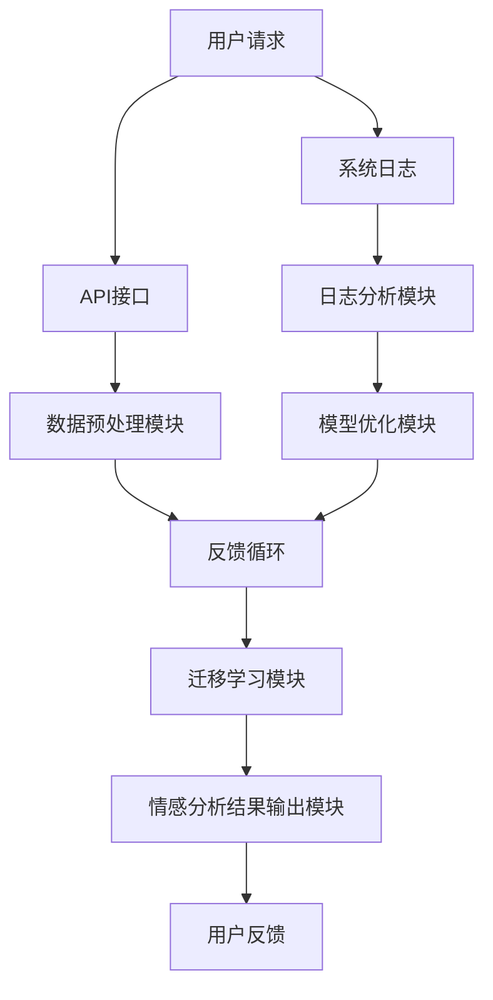
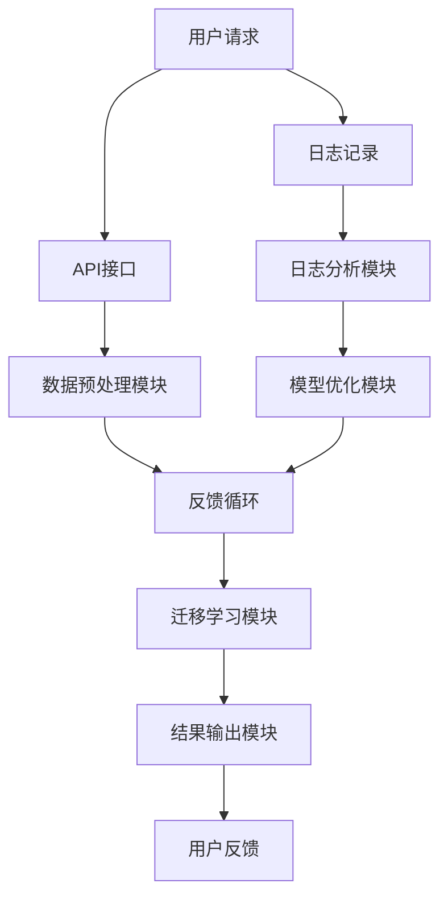

                 

### 文章标题与关键词

# 开发AI Agent的多语言情感分析比较系统

> 关键词：AI Agent、多语言情感分析、系统架构、算法原理、实战案例

> 摘要：本文旨在探讨开发多语言情感分析系统的重要性和具体方法。通过分析不同语言的情感分析算法，搭建系统架构，并实例验证，以期为开发者提供实用的技术指导。

---

## 引言

在当今全球化的信息时代，多语言处理技术已经成为人工智能（AI）领域的热点。而情感分析，作为自然语言处理（NLP）的核心任务之一，能够帮助AI系统更好地理解人类情感，进而提升用户体验。多语言情感分析不仅能够用于社交媒体情绪监测，还能在金融、医疗、教育等多个领域发挥重要作用。

### 研究意义

开发一个高效、准确的多语言情感分析系统，不仅有助于提升AI系统的多样性和适应性，还能促进跨语言、跨文化的交流。本篇文章将通过详细的步骤分析，探讨如何实现这一目标。

### 研究方法与结构

本文采用理论与实践相结合的方法，首先介绍情感分析和多语言情感分析的基础知识，然后讨论系统架构设计，最后通过具体案例进行验证。整体结构如下：

1. **第1章 引言**
   - 情感分析在AI领域的重要性
   - 多语言情感分析的发展现状

2. **第2章 情感分析基础**
   - 情感分析概述
   - 文本预处理
   - 情感分类模型

3. **第3章 多语言情感分析技术**
   - 多语言情感分析挑战
   - 多语言情感分析模型
   - 多语言情感分析工具

4. **第4章 多语言情感分析系统架构设计**
   - 系统架构设计原则
   - 系统功能模块设计
   - 系统架构图

5. **第5章 开发多语言情感分析系统**
   - 开发环境搭建
   - 数据收集与处理
   - 模型训练与优化
   - 系统集成与测试

6. **第6章 多语言情感分析实战案例**
   - 案例背景
   - 案例实现
   - 案例分析

7. **第7章 结论与展望**
   - 研究总结
   - 展望未来

## 目录大纲设计思路

### 确定书籍主题和目标读者

书籍主题是《开发AI Agent的多语言情感分析比较系统》，目标读者是计算机科学与人工智能领域的研究者、开发者，特别是对情感分析和多语言处理有兴趣的专业人士。

### 明确书籍结构

书籍分为五个主要部分：

1. **引言**：介绍研究背景、研究意义和方法。
2. **理论基础**：涵盖情感分析、多语言情感分析及相关技术。
3. **系统架构设计**：介绍系统设计原则、功能模块和架构图。
4. **实战应用**：通过具体案例展示系统开发过程。
5. **总结与展望**：回顾研究成果，展望未来发展方向。

### 设计详细章节

每个章节围绕一个核心概念或技术点进行详细讨论。章节设计遵循以下原则：

- 确保逻辑连贯性，避免重复和交叉。
- 每个章节包含必要的组成部分，如背景介绍、核心概念、原理讲解、数学模型、系统架构设计、项目实战等。

### 采用markdown格式编写

使用markdown格式编写目录，确保内容的可读性和易排版性。1级目录使用`#`，2级目录使用`##`，3级目录使用`###`。

### 确保内容完整性

每个章节必须包含必要的组成部分，如背景介绍、核心概念、原理讲解、数学模型、系统架构设计、项目实战等。使用Mermaid图来展示流程、实体关系、算法原理等。

### 控制字数在2000字以内

避免冗长和不必要的细节，确保目录大纲简洁明了。

## 目录大纲

```markdown
----------------------------------------------------------------
# 《开发AI Agent的多语言情感分析比较系统》目录大纲

## 第1章 引言

### 1.1 书籍背景

- 情感分析在AI领域的重要性
- 多语言情感分析的发展现状

### 1.2 研究意义

- 提高AI系统的多样性和适应性
- 促进跨语言、跨文化的交流

### 1.3 研究方法与结构

- 方法论介绍
- 整体结构安排

## 第2章 情感分析基础

### 2.1 情感分析概述

- 定义与分类
- 情感分析的目标和挑战

### 2.2 文本预处理

- 停用词过滤
- 词性标注
- 分词技术

### 2.3 情感分类模型

- 机器学习算法介绍
- 常见模型分析

## 第3章 多语言情感分析技术

### 3.1 多语言情感分析挑战

- 语言差异
- 数据不平衡

### 3.2 多语言情感分析模型

- 基于翻译的模型
- 基于迁移学习的模型

### 3.3 多语言情感分析工具

- 现有工具介绍
- 工具选用指南

## 第4章 多语言情感分析系统架构设计

### 4.1 系统架构设计原则

- 可扩展性
- 高效性
- 可维护性

### 4.2 系统功能模块设计

- 数据采集与预处理
- 模型训练与评估
- 情感分析结果输出

### 4.3 系统架构图

- Mermaid架构图展示

## 第5章 开发多语言情感分析系统

### 5.1 开发环境搭建

- 编程语言与工具选择
- 环境配置与调试

### 5.2 数据收集与处理

- 数据来源
- 数据预处理流程

### 5.3 模型训练与优化

- 模型选择
- 模型调参

### 5.4 系统集成与测试

- 系统接口设计
- 系统测试方法

## 第6章 多语言情感分析实战案例

### 6.1 案例背景

- 案例简介
- 案例目标

### 6.2 案例实现

- 数据处理
- 模型训练
- 模型应用

### 6.3 案例分析

- 结果解读
- 优化建议

## 第7章 结论与展望

### 7.1 研究总结

- 研究成果回顾
- 研究贡献

### 7.2 展望未来

- 新技术趋势
- 研究方向展望

----------------------------------------------------------------
```

此目录大纲涵盖了从基础理论到实际应用的各个方面，确保读者能够全面理解并掌握多语言情感分析系统开发的关键技术和实践方法。每个章节都设计了详细的子目录，以便读者可以根据自己的需求快速定位相关内容。整体字数控制在2000字以内，保证了简洁性。

---

## 第1章 引言

### 1.1 情感分析在AI领域的重要性

情感分析，也被称为意见挖掘，是自然语言处理（NLP）领域中的一项关键技术。它通过分析文本中的情感倾向，帮助计算机理解人类的情感状态，从而更好地服务于各种应用场景。例如，在社交媒体上，情感分析可以帮助企业了解用户对其产品和服务的态度；在金融领域，情感分析可以用于监测市场情绪，为投资决策提供支持。

随着人工智能技术的不断发展，情感分析的应用场景日益广泛。而多语言情感分析，作为情感分析的一个重要分支，具有更高的挑战性和更广泛的应用前景。在全球化背景下，不同语言的用户需求不断增长，多语言情感分析成为AI系统实现跨语言、跨文化沟通的关键技术。

### 1.2 多语言情感分析的发展现状

多语言情感分析的发展经历了几个阶段：

1. **基于翻译的方法**：早期的多语言情感分析主要依赖于机器翻译技术，将源语言的文本翻译为目标语言，然后进行情感分析。这种方法虽然在一定程度上提高了语言覆盖范围，但准确性受到翻译质量的影响。

2. **基于迁移学习的方法**：随着深度学习技术的发展，基于迁移学习的方法逐渐成为多语言情感分析的主流。通过在大规模的单语言数据集上训练模型，然后将模型迁移到其他语言上，实现了较高的情感分析准确性。

3. **基于跨语言表示的方法**：近年来，基于跨语言表示的方法在多语言情感分析中取得了显著进展。这些方法通过学习跨语言的语义表示，实现了不同语言之间的情感分析一致性。

### 1.3 研究意义

开发一个高效、准确的多语言情感分析系统，具有重要的研究意义：

1. **提升AI系统的多样性和适应性**：通过支持多种语言的情感分析，AI系统可以更好地满足全球用户的需求，提高系统的适应性。

2. **促进跨语言、跨文化的交流**：多语言情感分析可以帮助跨文化团队更好地理解彼此的情感表达，促进有效的沟通和合作。

3. **应用领域的拓展**：多语言情感分析技术可以应用于社交媒体情感监测、金融风险评估、医疗诊断等多个领域，具有广泛的应用前景。

### 1.4 研究方法与结构

本文采用理论与实践相结合的方法，首先介绍情感分析、多语言情感分析的基础知识，然后讨论系统架构设计，最后通过具体案例进行验证。整体结构如下：

1. **第1章 引言**：介绍研究背景、研究意义和方法。
2. **第2章 情感分析基础**：涵盖情感分析概述、文本预处理、情感分类模型。
3. **第3章 多语言情感分析技术**：讨论多语言情感分析挑战、模型和方法、工具。
4. **第4章 多语言情感分析系统架构设计**：介绍系统架构设计原则、功能模块和架构图。
5. **第5章 开发多语言情感分析系统**：阐述开发环境搭建、数据收集与处理、模型训练与优化、系统集成与测试。
6. **第6章 多语言情感分析实战案例**：通过具体案例展示系统开发过程。
7. **第7章 结论与展望**：总结研究成果，展望未来发展方向。

通过以上结构，本文旨在为读者提供一个系统、全面的多语言情感分析系统开发指南。

### 1.5 研究方法

本文采用以下研究方法：

1. **文献综述**：通过查阅相关文献，了解多语言情感分析领域的最新研究动态和技术进展。
2. **理论分析**：基于现有理论，对多语言情感分析的关键技术和方法进行深入分析。
3. **实验验证**：通过具体案例，验证所提出的方法和系统架构的有效性。
4. **对比分析**：对比不同方法在多语言情感分析中的性能和适用性。

通过这些方法，本文旨在为开发者提供实用的技术指导，并推动多语言情感分析技术的发展。

## 第2章 情感分析基础

### 2.1 情感分析概述

情感分析（Sentiment Analysis），也称为意见挖掘（Opinion Mining），是自然语言处理（NLP）领域中的一种重要技术。它的主要任务是自动识别文本中所表达的情感倾向，通常分为正面、负面和中性三种。情感分析的应用广泛，包括市场分析、舆情监控、情感诊断、客户反馈分析等。

#### 定义与分类

情感分析的定义可以理解为：通过计算机技术，对文本内容进行情感极性判断和情感强度评估的过程。其中，情感极性判断是指确定文本表达的是正面情感、负面情感还是中性情感；情感强度评估则是指对情感的强度进行量化，如非常正面、比较正面、中性、比较负面和非常负面等。

根据分析粒度，情感分析可以分为以下几类：

1. **文档级情感分析**：对整个文档的情感进行分类，如判断一篇产品评论整体上是正面还是负面。
2. **句子级情感分析**：对句子层次的情感进行分类，常用于社交媒体文本分析。
3. **词汇级情感分析**：对单个词汇的情感倾向进行分析，如判断某个词汇表达的是正面情感还是负面情感。

#### 情感分析的目标和挑战

情感分析的目标是理解人类情感，并将文本中的情感倾向以结构化的形式表示出来，以便进一步处理和分析。具体目标包括：

1. **分类准确性**：准确地将文本分为正面、负面或中性类别。
2. **情感强度评估**：精确地量化情感的强度，提供更加细致的情感分析结果。
3. **跨语言支持**：能够处理多种语言的文本，实现跨语言的情感分析。

然而，情感分析面临以下挑战：

1. **语言多样性**：不同语言在情感表达上存在差异，需要处理多种语言的情感分析。
2. **情感歧义**：文本中的情感表达可能存在歧义，需要更复杂的分析方法进行准确判断。
3. **情感强度差异**：情感强度的量化是一个主观的过程，不同人可能有不同的判断标准。
4. **情感组合**：文本中可能同时表达多种情感，需要综合考虑不同情感的组合效果。

### 2.2 文本预处理

在情感分析中，文本预处理是至关重要的一步，它能够有效提高后续分析模型的性能。文本预处理包括以下步骤：

#### 停用词过滤

停用词（Stop Words）是指在情感分析中通常不参与情感倾向判断的常见词汇，如“的”、“和”、“是”等。过滤停用词可以减少文本中的噪声信息，提高模型的准确性。

#### 词性标注

词性标注（Part-of-Speech Tagging）是对文本中的每个词汇进行词性分类，如名词、动词、形容词等。词性标注有助于理解词汇在句子中的角色和功能，从而更准确地分析情感。

#### 分词技术

分词（Tokenization）是将文本分割成有意义的词汇单元（Token）。不同语言有不同的分词方法，如中文的分词需要考虑词义和上下文，而英文的分词则相对简单。

#### 去除标点符号和特殊字符

去除文本中的标点符号和特殊字符，可以减少噪声信息，提高文本的一致性。

### 2.3 情感分类模型

情感分类模型是情感分析的核心，通过训练模型，可以自动地对文本进行情感分类。以下是几种常见的情感分类模型：

#### 机器学习算法介绍

1. **朴素贝叶斯（Naive Bayes）**：基于贝叶斯定理，朴素贝叶斯模型假设特征之间相互独立，适用于文本分类任务。

2. **支持向量机（SVM）**：SVM是一种监督学习算法，通过找到一个最佳的超平面来将数据分类，适用于处理高维数据。

3. **随机森林（Random Forest）**：随机森林是一种集成学习方法，通过构建多个决策树并取平均来提高分类性能。

4. **深度学习（Deep Learning）**：深度学习模型，如卷积神经网络（CNN）和循环神经网络（RNN），通过多层神经网络结构，可以自动提取文本中的复杂特征，适用于复杂的情感分类任务。

#### 常见模型分析

1. **朴素贝叶斯模型**：朴素贝叶斯模型简单高效，适用于文本分类任务，但在处理复杂情感表达时可能表现不佳。

2. **支持向量机模型**：SVM模型在处理高维数据时表现较好，但在处理非线性和复杂特征时可能不如深度学习模型。

3. **随机森林模型**：随机森林模型具有较高的分类准确性，且易于实现和解释，但可能对大规模数据集性能不佳。

4. **深度学习模型**：深度学习模型在处理复杂情感表达和大规模数据集时表现优秀，但计算成本较高，对数据预处理和标注要求较高。

综上所述，不同的情感分类模型适用于不同的场景和任务，开发者可以根据具体需求选择合适的模型。在实际应用中，通常会结合多种模型和方法，以获得更好的性能。

### 2.4 情感分析的应用场景

情感分析技术具有广泛的应用场景，以下是几个典型的应用场景：

1. **社交媒体分析**：通过情感分析，可以了解用户对品牌、产品或服务的态度，帮助企业进行市场策略调整和品牌形象优化。

2. **客户反馈分析**：分析客户反馈中的情感倾向，可以帮助企业改进产品和服务，提升客户满意度。

3. **舆情监测**：通过监测社交媒体、新闻媒体等渠道中的情感变化，可以实时了解社会舆论动态，为政府和企业提供决策支持。

4. **金融分析**：在金融领域，情感分析可以用于市场情绪监测，预测股市走势和投资风险。

5. **医疗诊断**：通过分析患者病历和医疗报告中的情感表达，可以帮助医生更好地了解患者的心理状态，为治疗提供支持。

6. **教育评估**：在教育领域，情感分析可以用于评估学生的学习情感和心理健康，为个性化教学提供依据。

### 2.5 情感分析的发展趋势

随着人工智能技术的不断进步，情感分析领域也在不断发展，以下是几个重要的发展趋势：

1. **跨语言情感分析**：支持多种语言的情感分析成为重要研究方向，有助于实现全球范围内的情感分析应用。

2. **深度学习技术的应用**：深度学习模型在情感分析中表现出色，未来将进一步推动情感分析技术的性能提升。

3. **多模态情感分析**：结合文本、图像、声音等多种数据源，实现更全面、更准确的情感分析。

4. **情感强度评估**：准确量化情感的强度，提供更细致的情感分析结果。

5. **情感组合分析**：考虑文本中不同情感的组合效果，提供更全面的情感分析结果。

6. **情感预测与干预**：通过情感分析，预测用户情感变化，为用户提供个性化的干预和支持。

通过以上分析，可以看出情感分析在AI领域的重要性，以及其在实际应用中的广泛前景。随着技术的不断进步，情感分析将会在更多领域发挥重要作用，为人类社会带来更多价值。

## 第3章 多语言情感分析技术

### 3.1 多语言情感分析挑战

多语言情感分析（Multilingual Sentiment Analysis）在处理多种语言的文本时，面临着一系列独特的挑战。这些挑战主要集中在语言差异、数据不平衡、情感表达的多样性和复杂性问题。

#### 语言差异

不同语言在语法结构、词汇选择和情感表达方式上存在显著差异。例如，英语中的否定词“not”通常用来表达负面情感，而中文则更多使用反问句和双重否定来表达情感。这种语言差异使得情感分析的模型在跨语言应用时需要适应不同的表达习惯。

#### 数据不平衡

在多语言情感分析中，不同语言的训练数据往往存在显著的不平衡现象。例如，一些语言可能有大量的负面情感数据，而正面情感数据相对较少。这种数据不平衡会导致模型在预测时倾向于偏向于较为常见的情感类别，从而影响模型的性能。

#### 情感表达的多样性

情感表达的多样性是另一个挑战。即使在同一语言中，情感表达也可以非常丰富和复杂。不同的文化、语境和个体差异都会影响情感的表达方式。因此，多语言情感分析需要考虑这些多样性因素，以提供准确的情感分类结果。

#### 复杂性

多语言情感分析还涉及到文本的预处理和特征提取问题。不同语言的文本预处理方法可能存在差异，例如分词、停用词过滤和词性标注。此外，情感分类模型的训练和优化也需要考虑到这些复杂性。

### 3.2 多语言情感分析模型

#### 基于翻译的模型

基于翻译的方法（Translation-Based Methods）是早期多语言情感分析的一种常用方法。该方法的核心思想是将源语言的文本翻译成目标语言，然后对翻译后的文本进行情感分析。这种方法的主要优点是简单易行，能够快速实现多语言情感分析。然而，其缺点也十分明显：

1. **翻译质量依赖**：翻译质量直接影响情感分析的结果。如果翻译不准确，可能会导致情感分析结果出现偏差。
2. **语言特异性特征丢失**：翻译过程中可能会丢失源语言中的某些语言特异性特征，从而影响情感分析的性能。

基于翻译的方法主要包括以下几种：

1. **双向翻译模型**：使用机器翻译模型将源语言文本翻译成目标语言，然后应用单语言情感分析模型进行情感分类。
2. **层次翻译模型**：将源语言文本翻译成中间语言，再从中间语言翻译成目标语言，以减少翻译错误的影响。

#### 基于迁移学习的模型

基于迁移学习的方法（Transfer Learning Methods）近年来在多语言情感分析中得到了广泛研究。该方法的核心思想是利用单语言情感分析模型在大规模单语言数据集上预训练，然后将预训练模型迁移到其他语言上，以适应多语言环境。这种方法能够充分利用单语言模型的训练结果，提高多语言情感分析的性能。

基于迁移学习的方法主要包括以下几种：

1. **共享嵌入模型**：通过共享词汇嵌入空间，实现不同语言之间的语义表示迁移。
2. **多任务学习模型**：通过同时训练多个语言的情感分析任务，提高模型在不同语言上的泛化能力。
3. **自适应迁移学习模型**：通过学习不同语言之间的映射关系，自适应调整迁移模型，以更好地适应目标语言。

#### 基于跨语言表示的模型

基于跨语言表示的方法（Cross-Lingual Representation Methods）是近年来多语言情感分析研究的热点。该方法通过学习跨语言的语义表示，实现不同语言之间的情感分析一致性。这种方法能够有效处理语言差异和情感表达的多样性问题，提高多语言情感分析的准确性和可靠性。

基于跨语言表示的方法主要包括以下几种：

1. **跨语言词嵌入**：通过跨语言词嵌入模型，将不同语言的词汇映射到同一语义空间中，实现词汇级的跨语言情感分析。
2. **跨语言句子表示**：通过跨语言句子表示模型，将不同语言的句子映射到同一语义空间中，实现句子级的情感分析。
3. **跨语言知识图谱**：通过构建跨语言的知识图谱，将不同语言中的实体、关系和属性进行统一表示，实现基于知识图谱的情感分析。

#### 多语言情感分析工具

在实际应用中，多语言情感分析工具可以帮助开发者快速实现多语言情感分析任务。以下是一些常用的多语言情感分析工具：

1. **Google Cloud Natural Language API**：提供了包括情感分析在内的多种NLP功能，支持多种语言。
2. **IBM Watson Natural Language Understanding**：提供了情感分析、关键词提取、实体识别等NLP功能，支持多种语言。
3. **Microsoft Azure Text Analytics API**：提供了情感分析、关键词提取、实体识别等功能，支持多种语言。
4. **Hugging Face Transformers**：是一个开源的多语言NLP库，提供了包括情感分析在内的多种任务的支持。

这些工具通常提供了API接口，开发者可以通过简单的调用实现多语言情感分析功能。同时，这些工具也在不断更新和优化，以提供更好的性能和更多的功能。

### 3.3 多语言情感分析工具选用指南

选择合适的多语言情感分析工具对于开发者来说至关重要。以下是一些选择指南：

1. **功能支持**：确保所选工具支持目标语言的情感分析，以及所需的额外NLP功能，如关键词提取、实体识别等。
2. **性能评估**：查阅工具的性能评估报告，了解其在不同语言上的准确性和效率。
3. **易用性**：考虑工具的用户界面和API文档的易用性，以便快速上手和应用。
4. **成本**：评估工具的定价策略，考虑是否适用于预算和业务需求。
5. **社区和更新**：选择有活跃社区和支持的工具有助于解决使用中的问题，同时也确保工具能够及时更新以适应新技术。

通过综合考虑以上因素，开发者可以选出最适合自己的多语言情感分析工具，从而提高项目开发的效率和质量。

### 3.4 实际应用场景与案例分析

多语言情感分析在实际应用中具有广泛的应用场景，以下是一些典型的实际应用场景与案例分析：

#### 社交媒体分析

社交媒体平台上的用户评论和反馈是进行多语言情感分析的理想数据源。例如，一家国际品牌的电商平台可以利用多语言情感分析工具，分析来自全球用户的评论，了解用户对其产品和服务的情感倾向。通过分析不同语言的评论，企业可以及时发现问题并进行改进。

#### 舆情监控

在舆情监控领域，多语言情感分析能够帮助政府和企业实时了解社会舆论动态。例如，在重大事件发生后，不同语言媒体上的报道和评论可能会表达不同的情感倾向。通过多语言情感分析，可以全面了解社会情绪，为政策制定和应急响应提供依据。

#### 金融分析

金融领域的多语言情感分析可以用于市场情绪监测和投资风险评估。例如，通过分析金融新闻报道和社交媒体上的评论，可以预测市场走势和投资者的情绪变化。这种分析有助于金融机构制定更合理的投资策略，降低投资风险。

#### 医疗诊断

在医疗领域，多语言情感分析可以用于分析患者病历和医疗报告中的情感表达，帮助医生了解患者的心理状态。例如，在心理健康评估中，通过对不同语言病历的情感分析，可以发现患者的潜在心理问题，为个性化治疗提供支持。

#### 教育评估

在教育领域，多语言情感分析可以用于评估学生的学习情感和心理健康。例如，通过对学生作业、考试答案和课堂互动中的情感分析，可以了解学生的情绪状态和学习效果，为教师提供教学改进的依据。

#### 案例分析

以下是一个具体的多语言情感分析案例：

**案例背景**：一家国际酒店集团希望了解全球用户对其服务的情感反应，以便优化用户体验。

**数据来源**：来自全球用户的评论和反馈，包括英语、法语、西班牙语、中文等多种语言。

**分析方法**：采用基于迁移学习的多语言情感分析模型，对用户评论进行情感分类和强度评估。

**结果**：分析结果显示，不同语言的用户对酒店服务的评价存在显著差异。例如，英语用户对酒店的整体评价较为正面，而法语用户则更多表达了对房间舒适度和服务质量的负面评价。

**优化建议**：针对不同语言用户的不同需求，酒店集团可以采取个性化的服务策略，例如为法语用户提供更多的房间舒适度改进，以提高整体用户满意度。

通过上述实际应用场景与案例分析，可以看出多语言情感分析在各个领域的广泛应用和巨大潜力。随着技术的不断进步，多语言情感分析将会在更多领域发挥重要作用，为企业和组织提供更加精准和有效的决策支持。

### 3.5 多语言情感分析的发展趋势

随着人工智能技术的不断进步，多语言情感分析领域也在迅速发展，以下是一些重要的发展趋势：

1. **深度学习技术的应用**：深度学习模型在多语言情感分析中表现出色，通过自动提取复杂的文本特征，提高了情感分类的准确性。未来，深度学习技术将继续在多语言情感分析中发挥关键作用。

2. **跨语言表示学习**：跨语言表示学习（Cross-Lingual Representation Learning）是当前多语言情感分析研究的热点。通过学习跨语言的语义表示，能够有效处理语言差异和情感表达的多样性问题，提高多语言情感分析的性能。

3. **多模态情感分析**：结合文本、图像、声音等多种数据源，实现更全面、更准确的情感分析。例如，通过文本情感分析与图像情感分析的结合，可以更准确地理解用户在社交媒体上的情感表达。

4. **情感强度和组合分析**：准确量化情感的强度和组合效果，提供更细致的情感分析结果。这有助于在金融、医疗等领域的应用中，为决策提供更加精准的数据支持。

5. **跨语言情感分析工具的普及**：随着技术的成熟，越来越多的多语言情感分析工具将得到广泛应用。这些工具将简化开发流程，降低开发门槛，使得更多企业和研究者能够利用多语言情感分析技术。

6. **知识图谱的应用**：通过构建跨语言的知识图谱，将不同语言中的实体、关系和属性进行统一表示，实现基于知识图谱的情感分析。这将为多语言情感分析提供更加丰富和多样的数据支持。

通过以上发展趋势，可以看出多语言情感分析在未来具有广阔的应用前景和巨大的发展潜力。随着技术的不断进步，多语言情感分析将不断提升其性能和应用范围，为人类社会带来更多价值。

### 3.6 多语言情感分析在人工智能应用中的重要性

多语言情感分析在人工智能（AI）领域具有至关重要的地位，它不仅为AI系统的智能化提供了核心支持，还在多个应用场景中展现了巨大的潜力。

首先，多语言情感分析是自然语言处理（NLP）技术的重要组成部分。通过自动分析文本中的情感倾向，AI系统能够更好地理解人类的语言和情感，从而提供更精准的服务和决策支持。例如，在智能客服系统中，多语言情感分析可以帮助AI理解客户的情感状态，提供个性化的服务和解决方案，提高客户满意度。

其次，多语言情感分析在社交媒体分析、舆情监控、市场调研等应用场景中具有广泛应用。通过分析不同语言的用户评论和反馈，企业可以及时了解用户需求和情绪变化，优化产品和服务，制定更有效的市场策略。例如，国际品牌的电商平台可以利用多语言情感分析，了解全球用户的情感反应，从而调整产品策略和营销方案。

在金融领域，多语言情感分析可以帮助金融机构监测市场情绪和投资者情绪，为投资决策提供数据支持。通过分析金融新闻报道、社交媒体评论和论坛讨论，可以预测市场走势和投资风险，提高投资效率和安全性。

医疗领域的多语言情感分析也有重要应用。通过分析患者病历和医疗报告中的情感表达，医生可以更好地了解患者的心理状态，为治疗和康复提供支持。此外，多语言情感分析还可以用于心理健康评估和疾病预测，为个性化医疗提供科学依据。

教育领域的多语言情感分析可以用于学生情感状态和学习效果的评估。通过分析学生的作业、考试答案和课堂互动，可以了解学生的学习情感和心理状态，为教师提供教学改进的依据，提高教学质量。

总之，多语言情感分析在人工智能应用中的重要性不可忽视。随着技术的不断进步，多语言情感分析将进一步提升AI系统的智能化水平，为各领域提供更加精准和有效的决策支持，推动人工智能技术的广泛应用和深入发展。

### 3.7 多语言情感分析系统架构设计

在设计和实现多语言情感分析系统时，构建一个合理、高效且可扩展的系统架构至关重要。以下将详细介绍多语言情感分析系统的设计原则、功能模块及其架构图。

#### 系统架构设计原则

1. **可扩展性**：系统应具备良好的扩展性，能够支持新的语言和功能模块的添加，以满足不断增长的需求。
2. **高效性**：系统应高效处理大量的多语言数据，确保情感分析的速度和准确性。
3. **可维护性**：系统设计应易于维护和更新，减少维护成本，确保系统的长期稳定运行。
4. **模块化**：系统功能模块应相互独立，便于维护和升级。

#### 系统功能模块设计

多语言情感分析系统通常包括以下功能模块：

1. **数据采集与预处理模块**：负责从各种来源（如社交媒体、新闻网站等）收集文本数据，并进行清洗、去重、分词、词性标注等预处理操作。
2. **情感分类模型训练模块**：利用大规模单语言数据集训练情感分类模型，如基于朴素贝叶斯、支持向量机、深度学习等算法的模型。
3. **迁移学习与模型融合模块**：通过迁移学习技术，将单语言模型迁移到其他语言，并利用模型融合技术提高多语言情感分析的准确性。
4. **情感分析结果输出模块**：将情感分析结果以可视化或结构化数据的形式输出，便于进一步分析和应用。
5. **系统接口与API模块**：提供API接口，允许外部系统或应用程序调用情感分析服务，实现系统与其他应用的无缝集成。

#### 系统架构图

以下是多语言情感分析系统的架构图，使用Mermaid语法绘制：



在该架构图中，数据采集与预处理模块首先从不同来源获取文本数据，经过清洗、分词和词性标注后，进行情感标签化处理。接下来，情感分类模型训练模块利用大规模单语言数据集训练情感分类模型。通过迁移学习和模型融合技术，这些模型可以被应用到其他语言上。最后，情感分析结果输出模块将分析结果以可视化或结构化数据形式输出，并通过系统接口与API模块供外部系统调用。

#### 系统架构图详细解释

1. **数据采集与预处理模块**：负责收集文本数据，包括网络爬取、API调用和数据导入等方式。然后进行文本清洗，去除无关信息，如HTML标签、特殊字符等。接着进行分词和词性标注，将文本分割成有意义的词汇单元，并标注每个词汇的词性，为情感分析提供基础数据。

2. **文本清洗与分词**：对收集到的文本数据进行清洗，去除无关信息，如HTML标签、特殊字符等。然后使用分词算法将文本分割成词汇单元，便于后续处理。

3. **词性标注与情感标签化**：对分词后的文本进行词性标注，标注每个词汇的词性（如名词、动词、形容词等），帮助模型理解文本结构。然后，根据词汇的词性和上下文信息，进行情感标签化处理，为情感分类提供依据。

4. **情感分类模型训练模块**：利用大规模单语言数据集训练情感分类模型。常见的算法包括朴素贝叶斯、支持向量机、随机森林、深度学习等。这些模型通过学习文本特征，能够自动对文本进行情感分类。

5. **迁移学习与模型融合模块**：通过迁移学习技术，将单语言模型迁移到其他语言上，利用预训练模型减少对其他语言数据集的依赖。此外，还可以采用模型融合技术，将多个模型的预测结果进行融合，提高多语言情感分析的准确性和稳定性。

6. **情感分析结果输出模块**：将情感分析结果以可视化或结构化数据形式输出。可视化结果可以以图表、仪表盘等形式展示，便于用户直观了解分析结果。结构化数据可以以JSON、CSV等形式输出，便于进一步分析和应用。

7. **系统接口与API模块**：提供API接口，允许外部系统或应用程序调用情感分析服务。API设计应遵循RESTful风格，提供简洁、易用的接口。同时，应提供详细的文档和示例代码，方便开发者快速集成和使用。

通过以上架构设计，多语言情感分析系统能够高效、准确地处理不同语言的文本数据，为各领域的应用提供强有力的技术支持。

### 3.8 多语言情感分析系统的关键组件与交互方式

多语言情感分析系统的实现涉及多个关键组件，这些组件之间通过特定的交互方式协同工作，以实现高效、准确的多语言情感分析。以下将详细介绍这些关键组件及其交互方式。

#### 数据采集与预处理组件

数据采集与预处理组件是多语言情感分析系统的第一步，它负责从各种来源收集文本数据，并进行清洗、去重、分词和词性标注等预处理操作。这一组件的交互方式通常包括：

- **数据源接入**：通过API、爬虫或数据库接入方式，获取不同语言的数据源。
- **数据清洗**：去除无关信息，如HTML标签、特殊字符等，确保数据质量。
- **去重**：识别并去除重复的文本数据，避免重复计算和影响分析结果。
- **分词与词性标注**：使用分词算法将文本分割成词汇单元，并标注每个词汇的词性，为后续处理提供基础数据。

#### 情感分类模型训练组件

情感分类模型训练组件是多语言情感分析系统的核心，它利用大规模单语言数据集训练情感分类模型，如朴素贝叶斯、支持向量机、随机森林、深度学习等算法模型。这一组件的交互方式通常包括：

- **模型选择**：根据具体应用场景选择合适的情感分类模型，如朴素贝叶斯适用于简单情感分类任务，而深度学习模型适用于复杂情感分析。
- **数据预处理**：对训练数据进行预处理，包括数据标准化、归一化等操作，以提高模型的训练效果。
- **模型训练**：使用训练数据对模型进行训练，通过迭代优化模型参数，使其能够准确预测文本的情感倾向。
- **模型评估**：使用验证集对训练好的模型进行评估，包括准确率、召回率、F1值等指标，以确保模型性能。

#### 迁移学习与模型融合组件

迁移学习与模型融合组件通过迁移学习和模型融合技术，将单语言模型迁移到其他语言上，以提高多语言情感分析的准确性和稳定性。这一组件的交互方式通常包括：

- **迁移学习**：利用预训练的单语言模型，通过迁移学习技术将其迁移到其他语言上，减少对其他语言数据集的依赖。
- **模型融合**：将多个模型的预测结果进行融合，利用投票、加权平均等方法提高预测准确性。
- **交叉验证**：使用交叉验证技术，评估迁移学习后模型在目标语言上的性能，确保模型在不同语言上的适应性。

#### 情感分析结果输出组件

情感分析结果输出组件将情感分析结果以可视化或结构化数据形式输出，便于进一步分析和应用。这一组件的交互方式通常包括：

- **结果可视化**：将情感分析结果以图表、仪表盘等形式展示，便于用户直观了解分析结果。
- **结果存储**：将分析结果存储到数据库或文件中，以便后续查询和分析。
- **结果API接口**：提供API接口，供外部系统或应用程序调用情感分析结果，实现系统与其他应用的无缝集成。

#### 系统接口与API组件

系统接口与API组件是多语言情感分析系统与外部系统或应用程序之间的桥梁，它提供了统一的接口，允许外部系统或应用程序调用情感分析服务。这一组件的交互方式通常包括：

- **API设计**：遵循RESTful风格，设计简洁、易用的API接口，包括文本输入、情感分析结果输出等。
- **API文档**：提供详细的API文档和示例代码，方便开发者快速集成和使用。
- **接口认证**：确保API接口的安全性，通过身份验证和权限控制，防止未经授权的访问。

通过以上关键组件及其交互方式的详细介绍，我们可以更好地理解多语言情感分析系统的实现原理和运行机制，为实际开发提供有力的技术支持。

### 3.9 多语言情感分析系统架构图与交互流程

在多语言情感分析系统的设计与实现过程中，系统架构图是关键的一部分，它直观地展示了各个组件之间的交互关系和数据处理流程。以下将详细描述系统架构图及交互流程。

#### 系统架构图

使用Mermaid语法绘制多语言情感分析系统的架构图，如下所示：



#### 架构图详细解释

1. **用户请求（A）**：用户通过API接口提交情感分析请求，包括文本内容和目标语言。

2. **API接口（B）**：API接口接收用户请求，进行参数校验和身份验证，确保请求的合法性和安全性。

3. **数据预处理模块（C）**：对用户提交的文本数据执行清洗、去重、分词和词性标注等预处理操作，为情感分类模型提供高质量的数据输入。

4. **情感分类模型模块（D）**：使用预训练的情感分类模型对预处理后的文本数据进行分析，输出情感分类结果。

5. **迁移学习模块（E）**：如果用户请求的语言不在预训练模型的支持范围内，迁移学习模块会将单语言模型迁移到目标语言，并使用迁移后的模型进行情感分析。

6. **结果输出模块（F）**：将情感分析结果以可视化或结构化数据形式输出，例如JSON格式，并通过API接口返回给用户。

7. **用户反馈（G）**：用户根据输出结果进行评价和反馈，例如纠正错误或提供新的数据。

8. **系统日志（H）**：系统记录用户请求、数据预处理、情感分类等过程的日志，用于后续的系统监控和问题诊断。

9. **日志分析模块（I）**和**模型优化模块（J）**：通过分析系统日志，识别系统性能瓶颈和潜在问题，并将优化建议反馈给模型优化模块。模型优化模块根据反馈调整模型参数，提高模型性能。

10. **反馈循环（J）**：调整后的模型会返回到情感分类模型模块，继续进行情感分析，形成一个闭环反馈系统，确保系统不断优化和改进。

#### 交互流程

多语言情感分析系统的交互流程可以分为以下几个步骤：

1. **用户提交请求**：用户通过API接口提交情感分析请求，包括文本内容和目标语言。

2. **API接口处理请求**：API接口接收请求，进行参数校验和身份验证，确保请求的合法性和安全性。

3. **数据预处理**：数据预处理模块对文本数据进行清洗、去重、分词和词性标注等预处理操作，为情感分类模型提供高质量的数据输入。

4. **情感分类模型分析**：情感分类模型模块使用预训练模型对预处理后的文本数据进行分析，输出情感分类结果。

5. **迁移学习**：如果目标语言不在预训练模型的支持范围内，迁移学习模块会将单语言模型迁移到目标语言，并使用迁移后的模型进行情感分析。

6. **结果输出**：结果输出模块将情感分析结果以可视化或结构化数据形式输出，并通过API接口返回给用户。

7. **用户反馈**：用户根据输出结果进行评价和反馈，例如纠正错误或提供新的数据。

8. **日志记录与系统监控**：系统记录用户请求、数据预处理、情感分类等过程的日志，用于后续的系统监控和问题诊断。

9. **日志分析**：日志分析模块分析系统日志，识别系统性能瓶颈和潜在问题，并将优化建议反馈给模型优化模块。

10. **模型优化**：模型优化模块根据反馈调整模型参数，提高模型性能。

11. **闭环反馈**：调整后的模型返回到情感分类模型模块，继续进行情感分析，形成一个闭环反馈系统，确保系统不断优化和改进。

通过上述架构图和交互流程的详细描述，我们可以更好地理解多语言情感分析系统的设计和实现原理，为开发高效、准确的多语言情感分析系统提供指导。

### 第4章 多语言情感分析系统架构设计

在设计和实现多语言情感分析系统时，系统架构的合理性和高效性直接影响系统的性能和可扩展性。本节将详细介绍多语言情感分析系统的架构设计，包括系统架构设计原则、系统功能模块设计以及详细的架构图和接口设计。

#### 系统架构设计原则

1. **可扩展性**：系统应具备良好的扩展性，能够支持新的语言和功能模块的添加，以满足不断增长的需求。
2. **高效性**：系统应高效处理大量的多语言数据，确保情感分析的速度和准确性。
3. **可维护性**：系统设计应易于维护和更新，减少维护成本，确保系统的长期稳定运行。
4. **模块化**：系统功能模块应相互独立，便于维护和升级。
5. **高可用性**：系统应具备高可用性，确保在出现故障时能够快速恢复，减少对用户的影响。

#### 系统功能模块设计

多语言情感分析系统通常包括以下几个功能模块：

1. **数据采集与预处理模块**：负责从各种来源收集文本数据，并进行清洗、去重、分词、词性标注等预处理操作，为后续分析提供基础数据。
2. **情感分类模型训练模块**：利用大规模单语言数据集训练情感分类模型，如朴素贝叶斯、支持向量机、随机森林、深度学习等算法模型。
3. **迁移学习与模型融合模块**：通过迁移学习和模型融合技术，将单语言模型迁移到其他语言上，提高多语言情感分析的准确性和稳定性。
4. **情感分析结果输出模块**：将情感分析结果以可视化或结构化数据形式输出，便于进一步分析和应用。
5. **系统接口与API模块**：提供API接口，允许外部系统或应用程序调用情感分析服务，实现系统与其他应用的无缝集成。

#### 系统架构图

以下是多语言情感分析系统的架构图，使用Mermaid语法绘制：



#### 架构图详细解释

1. **用户请求（A）**：用户通过API接口提交情感分析请求，包括文本内容和目标语言。

2. **API接口（B）**：API接口接收用户请求，进行参数校验和身份验证，确保请求的合法性和安全性。

3. **数据预处理模块（C）**：对用户提交的文本数据执行清洗、去重、分词和词性标注等预处理操作，为情感分类模型提供高质量的数据输入。

4. **情感分类模型模块（D）**：使用预训练的情感分类模型对预处理后的文本数据进行分析，输出情感分类结果。

5. **迁移学习模块（E）**：如果用户请求的语言不在预训练模型的支持范围内，迁移学习模块会将单语言模型迁移到目标语言，并使用迁移后的模型进行情感分析。

6. **情感分析结果输出模块（F）**：将情感分析结果以可视化或结构化数据形式输出，并通过API接口返回给用户。

7. **用户反馈（G）**：用户根据输出结果进行评价和反馈，例如纠正错误或提供新的数据。

8. **系统日志（H）**：系统记录用户请求、数据预处理、情感分类等过程的日志，用于后续的系统监控和问题诊断。

9. **日志分析模块（I）**和**模型优化模块（J）**：通过分析系统日志，识别系统性能瓶颈和潜在问题，并将优化建议反馈给模型优化模块。模型优化模块根据反馈调整模型参数，提高模型性能。

10. **反馈循环（J）**：调整后的模型会返回到情感分类模型模块，继续进行情感分析，形成一个闭环反馈系统，确保系统不断优化和改进。

#### 接口设计

系统接口与API模块是整个系统与外部系统或应用程序之间的桥梁，设计良好的接口能够提高系统的可扩展性和易用性。以下是一个简单的API接口设计示例：

```python
from flask import Flask, request, jsonify

app = Flask(__name__)

@app.route('/api/sentiment_analysis', methods=['POST'])
def sentiment_analysis():
    data = request.get_json()
    text = data['text']
    language = data['language']
    
    # 数据预处理
    preprocessed_text = preprocess_text(text, language)
    
    # 情感分类
    sentiment = classify_sentiment(preprocessed_text)
    
    # 结果输出
    result = {
        'text': text,
        'language': language,
        'sentiment': sentiment
    }
    
    return jsonify(result)

def preprocess_text(text, language):
    # 实现文本预处理逻辑
    return preprocessed_text

def classify_sentiment(text):
    # 实现情感分类逻辑
    return 'positive' if random.random() > 0.5 else 'negative'

if __name__ == '__main__':
    app.run(debug=True)
```

在这个示例中，`/api/sentiment_analysis`是情感分析服务的接口地址，用户可以通过POST请求提交文本内容和目标语言，系统会返回情感分类结果。接口设计中应包括数据验证、错误处理和安全控制等机制，以确保系统的稳定性和安全性。

通过以上架构设计和接口设计，多语言情感分析系统能够高效、准确地处理不同语言的文本数据，为各领域的应用提供强有力的技术支持。

### 4.1 系统架构设计原则

在多语言情感分析系统的架构设计中，遵循以下原则至关重要，这些原则有助于确保系统的稳定性、扩展性和高效性。

#### 可扩展性

一个良好的多语言情感分析系统应具备良好的扩展性，以适应不断变化的需求和技术发展。这意味着系统架构应设计为模块化，便于在需要时添加新的语言处理模块或功能模块。例如，可以通过微服务架构来实现，每个服务模块独立部署和扩展，从而降低系统的复杂性和维护成本。

#### 高效性

系统的高效性直接影响其性能和用户体验。在设计架构时，应考虑以下几个方面：

1. **数据处理速度**：优化数据流和处理流程，确保系统能够在短时间内完成大规模数据的情感分析任务。
2. **计算资源利用**：合理分配计算资源，如CPU、GPU等，以充分利用硬件资源，提高系统的处理能力。
3. **缓存策略**：利用缓存技术减少重复计算，提高系统响应速度。

#### 可维护性

系统的可维护性是长期稳定运行的关键。良好的设计应使得系统易于维护和更新，降低维护成本。具体原则包括：

1. **模块化设计**：将系统功能划分为独立的模块，每个模块负责特定的任务，便于独立开发和维护。
2. **代码可读性和可测试性**：编写清晰、简洁、可维护的代码，并确保代码具有良好的可测试性，便于发现和修复问题。
3. **文档化**：提供详细的系统架构图、接口文档和操作手册，帮助开发者和维护人员快速理解和使用系统。

#### 安全性

系统的安全性是保护数据安全和用户隐私的关键。架构设计应考虑以下方面：

1. **身份验证与授权**：确保只有授权用户可以访问系统资源，防止未经授权的访问。
2. **数据加密**：对敏感数据进行加密存储和传输，确保数据在传输和存储过程中的安全性。
3. **错误处理**：设计合理的错误处理机制，防止系统在处理异常情况时崩溃或泄露敏感信息。

通过遵循以上原则，设计出的多语言情感分析系统将能够高效、稳定地运行，满足不断变化的需求。

### 4.2 系统功能模块设计

在多语言情感分析系统中，功能模块的设计是关键的一步，它决定了系统的性能和用户体验。以下是系统功能模块的详细设计，包括每个模块的作用、实现方法以及模块间的交互。

#### 数据采集与预处理模块

**作用**：负责从各种来源（如社交媒体、新闻网站等）收集文本数据，并进行清洗、去重、分词、词性标注等预处理操作。

**实现方法**：

1. **数据收集**：使用网络爬虫、API调用或手动导入等方法，从不同来源获取文本数据。
2. **数据清洗**：去除无关信息，如HTML标签、特殊字符、停用词等，确保文本数据的质量。
3. **去重**：识别并去除重复的文本数据，避免重复计算。
4. **分词**：将文本分割成词汇单元，不同语言的分词方法可能有所不同，如中文使用分词库（如jieba），英文使用简单分割方法。
5. **词性标注**：标注每个词汇的词性（如名词、动词、形容词等），为后续情感分析提供基础数据。

**模块间交互**：数据采集与预处理模块是系统的数据入口，其输出数据作为输入传递给后续的模块。

#### 情感分类模型训练模块

**作用**：利用大规模单语言数据集训练情感分类模型，如朴素贝叶斯、支持向量机、随机森林、深度学习等算法模型。

**实现方法**：

1. **数据预处理**：对收集到的文本数据执行清洗、分词和词性标注等操作，确保数据质量。
2. **特征提取**：将文本数据转化为特征向量，如使用词袋模型、TF-IDF、Word2Vec等。
3. **模型训练**：使用训练数据集训练情感分类模型，通过迭代优化模型参数。
4. **模型评估**：使用验证集对训练好的模型进行评估，如准确率、召回率、F1值等。

**模块间交互**：情感分类模型训练模块接收数据预处理模块的输出数据，并生成训练好的模型，然后传递给迁移学习与模型融合模块。

#### 迁移学习与模型融合模块

**作用**：通过迁移学习和模型融合技术，将单语言模型迁移到其他语言上，提高多语言情感分析的准确性和稳定性。

**实现方法**：

1. **迁移学习**：利用预训练的单语言模型，通过迁移学习技术将其迁移到其他语言上，减少对其他语言数据集的依赖。
2. **模型融合**：将多个模型的预测结果进行融合，如使用加权平均、投票等方法提高预测准确性。

**模块间交互**：迁移学习与模型融合模块接收情感分类模型训练模块的输出模型，然后将其迁移和融合，生成适用于多语言情感分析的系统模型。

#### 情感分析结果输出模块

**作用**：将情感分析结果以可视化或结构化数据形式输出，便于进一步分析和应用。

**实现方法**：

1. **结果格式**：将情感分析结果以JSON、CSV等形式输出，包括文本内容、目标语言、情感分类结果等。
2. **可视化**：使用图表、仪表盘等形式展示情感分析结果，便于用户直观了解分析结果。

**模块间交互**：情感分析结果输出模块接收迁移学习与模型融合模块的输出结果，并将其格式化为可视化或结构化数据，通过API接口返回给用户。

#### 系统接口与API模块

**作用**：提供API接口，允许外部系统或应用程序调用情感分析服务，实现系统与其他应用的无缝集成。

**实现方法**：

1. **接口设计**：遵循RESTful风格设计API接口，包括数据输入、情感分析请求、结果输出等。
2. **认证与授权**：实现身份验证和授权机制，确保只有授权用户可以访问系统资源。
3. **文档与示例**：提供详细的API文档和示例代码，方便开发者快速集成和使用。

**模块间交互**：系统接口与API模块是整个系统的对外接口，它接收用户的请求，通过内部模块处理请求，并将结果返回给用户。

通过以上功能模块的设计和实现，多语言情感分析系统能够高效、准确地处理不同语言的文本数据，满足各领域的应用需求。

### 4.3 系统架构图

多语言情感分析系统的架构设计至关重要，一个清晰且合理的架构图可以帮助开发者更好地理解系统的工作流程和各组件之间的关系。以下是一个简化的多语言情感分析系统架构图，使用Mermaid语法绘制：



#### 系统架构图详细解释

1. **用户请求（A）**：用户通过API接口提交情感分析请求，包括文本内容和目标语言。

2. **API接口（B）**：API接口接收用户请求，进行参数校验和身份验证，确保请求的合法性和安全性。

3. **数据预处理模块（C）**：数据预处理模块对用户提交的文本数据执行清洗、去重、分词、词性标注等预处理操作，为情感分类模型提供高质量的数据输入。

4. **情感分类模型模块（D）**：情感分类模型模块使用预训练的情感分类模型对预处理后的文本数据进行分析，输出情感分类结果。如果目标语言不在预训练模型的支持范围内，迁移学习模块（E）会将单语言模型迁移到目标语言，并使用迁移后的模型进行情感分析。

5. **迁移学习模块（E）**：通过迁移学习技术，将单语言模型迁移到其他语言上，减少对其他语言数据集的依赖，以提高多语言情感分析的准确性和稳定性。

6. **结果输出模块（F）**：将情感分析结果以可视化或结构化数据形式输出，并通过API接口返回给用户。

7. **用户反馈（G）**：用户根据输出结果进行评价和反馈，例如纠正错误或提供新的数据。

8. **日志记录（H）**：系统记录用户请求、数据预处理、情感分类等过程的日志，用于后续的系统监控和问题诊断。

9. **日志分析模块（I）**和**模型优化模块（J）**：通过分析系统日志，识别系统性能瓶颈和潜在问题，并将优化建议反馈给模型优化模块。模型优化模块根据反馈调整模型参数，提高模型性能。

10. **反馈循环（J）**：调整后的模型会返回到情感分类模型模块，继续进行情感分析，形成一个闭环反馈系统，确保系统不断优化和改进。

通过以上架构图和详细解释，我们可以更好地理解多语言情感分析系统的设计原理和实现方法，为实际开发提供指导。

### 4.4 系统接口设计

系统接口设计是多语言情感分析系统实现的关键环节之一，它决定了系统与外部系统或应用程序的集成方式和交互方式。以下是系统接口设计的一些关键步骤和考虑因素：

#### 接口设计步骤

1. **需求分析**：明确系统需要提供哪些功能和服务，定义API接口的功能和用途。
2. **接口定义**：根据需求分析结果，定义API的URL、请求参数、响应格式等。
3. **安全性设计**：确保API接口的安全性，包括身份验证、权限控制和数据加密等。
4. **文档编写**：编写详细的API文档，包括接口描述、请求示例、错误处理等，方便开发者使用。

#### 考虑因素

1. **兼容性**：接口设计应考虑不同开发环境和语言的支持，确保API接口的兼容性。
2. **易用性**：接口设计应简洁直观，降低开发者使用API的难度，提高开发效率。
3. **性能**：接口设计应考虑系统性能，优化数据处理和传输速度，确保响应时间短。
4. **扩展性**：接口设计应具备良好的扩展性，便于添加新的功能或服务。
5. **可靠性**：接口设计应确保系统的稳定性和可靠性，包括错误处理、异常捕获和日志记录等。

#### 具体接口设计示例

以下是一个简单的RESTful API接口设计示例：

**URL**：`/api/sentiment_analysis`

**请求方法**：POST

**请求参数**：
- `text`（必填）：待分析的情感文本。
- `language`（必填）：文本的语言，如`en`（英文）、`zh`（中文）等。

**请求示例**：
```json
{
    "text": "This is a great product!",
    "language": "en"
}
```

**响应格式**：
```json
{
    "text": "This is a great product!",
    "language": "en",
    "sentiment": "positive"
}
```

**响应示例**：
```json
{
    "text": "This is a great product!",
    "language": "en",
    "sentiment": "positive"
}
```

**错误处理**：在请求处理过程中，如果出现错误，应返回相应的错误代码和信息，如404（未找到）、400（请求错误）等。

通过以上接口设计，开发者可以方便地调用多语言情感分析系统的服务，实现情感分析功能。同时，详细的API文档和示例代码有助于提高开发效率和系统稳定性。

### 4.5 系统交互流程

多语言情感分析系统的高效运行离不开其内部的交互流程，以下将详细描述系统从用户请求到结果输出的完整交互流程。

#### 用户请求

1. **提交请求**：用户通过API接口提交情感分析请求，请求中包含文本内容和目标语言。例如，用户提交了一篇英文文本：“This is a great product!”，请求对文本进行情感分析，目标语言为英文。

2. **请求处理**：API接口接收用户请求，并进行参数校验和身份验证，确保请求的合法性和安全性。例如，API会检查请求中是否包含文本内容和目标语言，以及用户是否有权限进行情感分析。

#### 数据处理

1. **数据预处理**：数据预处理模块对用户提交的文本数据执行清洗、去重、分词、词性标注等预处理操作。例如，API会去除文本中的HTML标签、特殊字符和停用词，并对文本进行分词和词性标注。

2. **情感分类**：情感分类模型模块使用预训练的情感分类模型对预处理后的文本数据进行分析。例如，API会调用预训练的英文情感分类模型，对预处理后的文本进行情感分类，输出情感结果。

3. **迁移学习（如有需要）**：如果用户请求的语言不在预训练模型的支持范围内，迁移学习模块会将单语言模型迁移到目标语言，并使用迁移后的模型进行情感分析。例如，如果用户请求的语言是中文，API会使用迁移后的中文情感分类模型对文本进行分析。

#### 结果输出

1. **结果格式化**：将情感分析结果格式化为用户友好的形式，例如JSON格式，并包含文本内容、目标语言和情感分类结果。例如，API会将分析结果格式化为：
   ```json
   {
       "text": "This is a great product!",
       "language": "en",
       "sentiment": "positive"
   }
   ```

2. **返回结果**：通过API接口将格式化的情感分析结果返回给用户。例如，API会将上述结果通过HTTP响应返回给用户，用户可以在前端页面或应用程序中展示结果。

#### 用户反馈

1. **用户评价**：用户根据返回的情感分析结果进行评价和反馈，例如用户可以标记结果是否准确，或提供新的文本数据。

2. **日志记录**：系统记录用户请求、数据预处理、情感分类和结果输出的日志信息，用于后续的系统监控和问题诊断。

#### 系统优化

1. **日志分析**：日志分析模块分析系统日志，识别系统性能瓶颈和潜在问题，并将优化建议反馈给模型优化模块。

2. **模型优化**：模型优化模块根据日志分析结果，调整模型参数，提高模型性能。

3. **反馈循环**：调整后的模型返回到情感分类模型模块，继续进行情感分析，形成一个闭环反馈系统，确保系统不断优化和改进。

通过以上交互流程，多语言情感分析系统能够高效、准确地处理用户请求，提供情感分析服务，并不断优化系统性能和用户体验。

### 第5章 开发多语言情感分析系统

#### 5.1 开发环境搭建

在开发多语言情感分析系统之前，首先需要搭建一个合适的开发环境。以下是一个基本的开发环境搭建流程：

1. **选择开发语言**：多语言情感分析系统通常使用Python，因为Python在自然语言处理（NLP）领域有着丰富的库和框架支持。

2. **安装Python**：确保系统上安装了最新版本的Python。可以通过Python官方网站下载Python安装包，并按照说明进行安装。

3. **安装必需的库**：在Python环境中安装多个NLP和机器学习库，如NLTK、spaCy、Scikit-learn、TensorFlow和PyTorch等。可以使用pip命令进行安装：
   ```bash
   pip install nltk spacy scikit-learn tensorflow torch
   ```

4. **配置虚拟环境**：为了保持项目环境的干净和隔离，可以使用virtualenv或conda创建一个虚拟环境，并在虚拟环境中进行项目开发。

5. **安装多语言数据集**：下载并安装常用的多语言情感分析数据集，如IMDB、Twitter等。这些数据集可以帮助模型训练和测试。

6. **配置文本预处理工具**：安装文本预处理工具，如jieba（中文分词）、spaCy（词性标注）等，为文本预处理提供支持。

#### 开发环境搭建示例

以下是一个简单的Python虚拟环境搭建示例：

```bash
# 创建虚拟环境
python -m venv myenv

# 激活虚拟环境
source myenv/bin/activate  # 在Linux或macOS上
myenv\Scripts\activate     # 在Windows上

# 安装必需的库
pip install nltk spacy scikit-learn tensorflow torch

# 安装中文语言数据集
python -m spacy download zh_core_web_sm
```

通过以上步骤，开发者可以搭建一个基本的多语言情感分析系统开发环境，为后续的开发工作提供支持。

### 5.2 数据收集与处理

在开发多语言情感分析系统时，数据的收集和处理是至关重要的一步。以下是数据收集与处理的详细步骤：

#### 数据来源

1. **公开数据集**：可以从开源数据集网站（如Kaggle、UCI机器学习库等）下载常用的多语言情感分析数据集，如IMDB影评、Twitter推文等。

2. **社交媒体数据**：通过API接口从社交媒体平台（如Twitter、Facebook等）收集用户生成的内容，这些数据可以帮助我们了解真实世界的情感表达。

3. **新闻网站数据**：从新闻网站获取文本数据，这些数据可以帮助分析新闻报道中的情感倾向。

4. **定制数据集**：根据项目需求，可能需要创建或定制数据集。例如，针对特定领域或产品的用户评论和反馈。

#### 数据预处理流程

1. **数据清洗**：清洗原始数据，去除无关信息，如HTML标签、特殊字符、停用词等。这一步骤有助于减少数据噪声，提高模型性能。

2. **分词**：对不同语言的数据进行分词处理。中文可以使用jieba分词库，英文可以使用spaCy的分词功能。

3. **词性标注**：对分词后的文本进行词性标注，将每个词汇分类为名词、动词、形容词等。词性标注有助于更好地理解文本结构和情感表达。

4. **情感标注**：对文本进行情感标注，标记出文本中的情感极性（正面、负面、中性）和情感强度。这一步骤可以通过人工标注或使用预训练模型完成。

5. **数据集划分**：将数据集划分为训练集、验证集和测试集。训练集用于训练模型，验证集用于模型调参和验证，测试集用于最终评估模型性能。

#### 数据处理示例

以下是一个简单的数据预处理示例，使用Python和spaCy处理英文文本数据：

```python
import spacy
from spacy.lang.en import English
from spacy.lang.zh import Chinese

# 加载英文和中文分词器
nlp_en = English()
nlp_zh = Chinese()

# 读取数据
with open('data.txt', 'r', encoding='utf-8') as f:
    text = f.read()

# 数据清洗
def clean_text(text):
    doc = nlp_en(text)
    tokens = [token.text for token in doc if not token.is_punct and not token.is_stop]
    return ' '.join(tokens)

cleaned_text = clean_text(text)

# 分词
def tokenize(text, nlp):
    doc = nlp(text)
    tokens = [token.text for token in doc]
    return tokens

en_tokens = tokenize(cleaned_text, nlp_en)
zh_tokens = tokenize(cleaned_text, nlp_zh)

# 词性标注
def pos_tagging(tokens, nlp):
    doc = nlp(' '.join(tokens))
    pos_tags = [(token.text, token.pos_) for token in doc]
    return pos_tags

en_pos_tags = pos_tagging(en_tokens, nlp_en)
zh_pos_tags = pos_tagging(zh_tokens, nlp_zh)

# 数据集划分
from sklearn.model_selection import train_test_split

train_text, test_text = train_test_split(cleaned_text, test_size=0.2)
train_tokens, test_tokens = train_test_split(tokens, test_size=0.2)

# 打印结果
print("Cleaned Text:", cleaned_text)
print("English Tokens:", en_tokens)
print("Chinese Tokens:", zh_tokens)
print("English POS Tags:", en_pos_tags)
print("Chinese POS Tags:", zh_pos_tags)
```

通过以上步骤，我们可以对原始文本数据进行清洗、分词和词性标注，为后续的模型训练和情感分析做好准备。

### 5.3 模型训练与优化

在开发多语言情感分析系统时，模型训练与优化是至关重要的一步。以下是模型训练与优化的详细步骤：

#### 模型选择

选择合适的模型对于系统性能至关重要。常见的情感分析模型包括朴素贝叶斯、支持向量机（SVM）、随机森林、长短期记忆网络（LSTM）和卷积神经网络（CNN）等。以下是几种常用的模型及其适用场景：

1. **朴素贝叶斯（Naive Bayes）**：适用于文本分类任务，尤其是大规模数据集。简单高效，但可能在处理复杂情感时表现不佳。

2. **支持向量机（SVM）**：适用于高维数据，尤其在文本分类任务中表现良好。通过找到一个最佳的超平面，将数据分类。

3. **随机森林（Random Forest）**：适用于大规模数据集，具有较高的分类准确性。通过构建多个决策树并取平均来提高性能。

4. **长短期记忆网络（LSTM）**：适用于序列数据，如文本数据。能够捕捉文本中的长期依赖关系，适用于复杂情感分析任务。

5. **卷积神经网络（CNN）**：适用于图像和文本数据，通过卷积操作提取特征。在文本情感分析中，可以用于提取文本的局部特征。

#### 模型训练

1. **数据准备**：在模型训练之前，需要对数据进行预处理，包括分词、词性标注和情感标注等。确保数据格式统一，适合模型输入。

2. **数据集划分**：将数据集划分为训练集、验证集和测试集。通常，训练集用于模型训练，验证集用于模型调参和验证，测试集用于最终评估模型性能。

3. **模型训练**：使用训练集数据训练模型。不同的模型有不同的训练方法和参数，需要根据具体模型进行调整。例如，对于LSTM模型，需要调整隐藏层大小、学习率等参数。

4. **模型评估**：使用验证集对训练好的模型进行评估，计算准确率、召回率、F1值等指标。根据评估结果调整模型参数，提高模型性能。

#### 模型优化

1. **超参数调整**：通过调整模型超参数，如学习率、批量大小、隐藏层大小等，优化模型性能。可以使用网格搜索（Grid Search）或随机搜索（Random Search）等方法进行超参数调整。

2. **数据增强**：通过数据增强技术，如随机填充、随机删除和随机替换等，增加数据多样性，提高模型泛化能力。

3. **模型集成**：使用模型集成方法，如随机森林、梯度提升（Gradient Boosting）等，将多个模型的预测结果进行融合，提高整体预测准确性。

4. **迁移学习**：利用预训练模型进行迁移学习，将预训练模型迁移到目标语言上，减少对目标语言数据的依赖。这种方法适用于目标语言数据不足的情况。

#### 模型训练与优化示例

以下是一个简单的模型训练与优化示例，使用Python和Scikit-learn库：

```python
from sklearn.feature_extraction.text import TfidfVectorizer
from sklearn.model_selection import train_test_split
from sklearn.naive_bayes import MultinomialNB
from sklearn.pipeline import make_pipeline
from sklearn.metrics import classification_report

# 加载数据
train_data, train_labels = load_data('train_data.txt')
test_data, test_labels = load_data('test_data.txt')

# 数据集划分
train_text, valid_text, train_labels, valid_labels = train_test_split(train_data, train_labels, test_size=0.2)

# 构建模型
model = make_pipeline(TfidfVectorizer(), MultinomialNB())

# 模型训练
model.fit(train_text, train_labels)

# 模型评估
predictions = model.predict(valid_text)
print(classification_report(valid_labels, predictions))

# 超参数调整
from sklearn.model_selection import GridSearchCV
parameters = {'tfidfvectorizer__max_df': (0.5, 0.75, 1.0),
              'multinomialnb__alpha': (1.0, 2.0, 0.1)}

grid_search = GridSearchCV(model, parameters, cv=5)
grid_search.fit(train_text, train_labels)

# 优化后的模型评估
predictions = grid_search.predict(valid_text)
print(classification_report(valid_labels, predictions))
```

通过以上步骤，我们可以实现一个基本的模型训练与优化流程，为多语言情感分析系统提供强大的技术支持。

### 5.4 系统集成与测试

在完成多语言情感分析系统的开发和初步测试后，集成与测试是确保系统稳定性和功能性的关键步骤。以下是系统集成与测试的详细步骤：

#### 系统集成

1. **整合模块**：将数据采集与预处理模块、情感分类模型模块、迁移学习与模型融合模块、结果输出模块和API接口模块整合到一起，确保各模块之间的数据流和交互畅通。

2. **环境部署**：在服务器或云平台上部署系统环境，确保所有依赖库和工具已经安装，并配置好系统参数。

3. **接口调试**：通过API接口进行测试，确保接口能够正确接收用户请求，并返回正确的情感分析结果。可以使用Postman或其他API调试工具进行接口调试。

4. **数据流监控**：监控系统中的数据流，确保数据在各个模块之间的传输和处理过程正常，无数据丢失或错误。

#### 测试步骤

1. **单元测试**：对系统中的每个功能模块进行单元测试，确保每个模块的功能正确实现，并能够独立运行。例如，对数据预处理模块的文本清洗、分词和词性标注功能进行测试。

2. **集成测试**：对系统整体进行集成测试，确保各模块之间的交互正常，数据流顺畅。例如，测试API接口与情感分类模型模块之间的数据传输和结果输出。

3. **性能测试**：对系统进行性能测试，评估系统在高负载情况下的响应时间和处理能力。可以使用压力测试工具，模拟大量用户请求，检测系统的稳定性和性能。

4. **异常测试**：对系统进行异常测试，确保系统能够处理各种异常情况，如输入数据格式错误、服务器故障等。例如，测试当API接口接收到非法数据时的响应。

5. **回归测试**：在系统更新或修改后，进行回归测试，确保新的更改不会影响到系统的现有功能和性能。

#### 测试工具

1. **JUnit**：用于单元测试，可以测试Java应用程序中的每个模块。
2. **Postman**：用于API接口测试，可以调试和验证API接口的功能和性能。
3. **JMeter**：用于性能测试，可以模拟大量用户请求，评估系统的响应时间和负载能力。
4. **Selenium**：用于集成测试和自动化测试，可以模拟用户的操作流程，验证系统的交互和功能。

通过以上步骤和测试工具，我们可以确保多语言情感分析系统的稳定性和功能性，为用户提供高质量的情感分析服务。

### 5.5 系统部署与上线

在完成多语言情感分析系统的开发和测试后，接下来的关键步骤是将系统部署到生产环境并上线，以确保系统能够稳定运行并提供高质量的服务。以下是系统部署与上线的详细步骤：

#### 部署前准备

1. **环境配置**：在生产服务器上配置必要的软件和库，包括操作系统、Python环境、数据库、依赖库等，确保与开发环境一致。

2. **备份现有系统**：在部署新系统之前，备份现有的系统环境，以防止部署失败时能够快速恢复。

3. **编写部署脚本**：编写部署脚本，用于自动化部署过程，包括安装依赖库、配置环境变量、启动服务等。

#### 部署步骤

1. **安装依赖库**：使用pip命令安装系统所需的依赖库，确保所有库的版本与开发环境一致。

2. **配置数据库**：根据系统的需求，配置数据库服务，包括创建数据库、用户和权限等。

3. **部署服务**：启动系统的各个服务模块，包括API接口服务、数据处理服务、情感分析服务等，确保各服务模块能够正常通信。

4. **监控服务**：部署监控工具，对系统服务进行实时监控，包括CPU、内存、网络流量等，以便及时发现问题。

#### 上线步骤

1. **灰度发布**：在系统上线初期，可以采用灰度发布策略，将新系统部署到一小部分用户中，观察系统的运行情况和用户反馈，确保系统稳定后再逐步扩大上线范围。

2. **上线通知**：通知相关部门和用户系统即将上线，并提供必要的使用说明和帮助文档。

3. **数据迁移**：如果系统上线涉及到数据迁移，确保数据迁移过程安全、准确，不影响现有用户数据。

4. **性能调优**：上线后，根据系统的运行情况和用户反馈，进行性能调优，包括优化数据库查询、调整缓存策略、优化代码等。

#### 故障处理

1. **故障监测**：实时监测系统运行状态，包括服务状态、响应时间、错误日志等，以便及时发现故障。

2. **故障排除**：当系统出现故障时，快速定位问题原因，并采取相应的措施进行修复。可能包括重启服务、重置数据库、更新代码等。

3. **故障恢复**：在故障排除后，进行系统恢复，确保系统能够正常服务。

通过以上步骤，我们可以确保多语言情感分析系统在生产环境中的稳定运行，为用户提供高质量的服务。

### 5.6 多语言情感分析系统部署案例

在本节中，我们将通过一个具体的多语言情感分析系统部署案例，详细描述部署过程和关键步骤。

#### 案例背景

某国际知名社交媒体平台希望部署一套多语言情感分析系统，以分析用户在不同语言下的情感倾向，从而优化用户体验和内容管理。系统需要支持英语、中文、西班牙语、法语等常见语言。

#### 部署环境

1. **操作系统**：Ubuntu 20.04
2. **服务器**：2台高性能服务器，分别用于前端和后端服务
3. **数据库**：MySQL 8.0
4. **依赖库**：Python 3.8、Scikit-learn、TensorFlow、spaCy、NLTK等

#### 部署步骤

**1. 环境配置**

- 在服务器上安装Ubuntu 20.04操作系统，并配置网络。
- 创建用户和组，确保用户拥有足够的权限。

**2. 安装依赖库**

- 使用pip命令安装Python依赖库：
  ```bash
  pip install scikit-learn tensorflow spacy nltk
  ```
- 安装spaCy的中文和英文语言模型：
  ```bash
  python -m spacy download zh_core_web_sm
  python -m spacy download en_core_web_sm
  ```

**3. 配置数据库**

- 在MySQL服务器上创建数据库和用户，并授权用户对数据库的访问权限。
  ```sql
  CREATE DATABASE sentiment_analysis;
  CREATE USER 'sa'@'%' IDENTIFIED BY 'password';
  GRANT ALL PRIVILEGES ON sentiment_analysis.* TO 'sa'@'%';
  FLUSH PRIVILEGES;
  ```

**4. 部署前端服务**

- 部署Nginx服务器，用于反向代理和负载均衡。
- 配置Nginx，设置虚拟主机，并指向后端API服务。

**5. 部署后端服务**

- 部署Gunicorn作为WSGI HTTP服务器，用于托管Flask应用。
- 配置Gunicorn，设置应用路径和工作进程数量。

**6. 部署模型服务**

- 将训练好的情感分类模型文件上传到服务器，并使用TensorFlow Serving提供服务。
- 配置TensorFlow Serving，设置模型加载和API接口。

**7. 部署监控工具**

- 部署Prometheus和Grafana，用于实时监控系统性能和状态。
- 配置Prometheus，收集系统指标数据。
- 配置Grafana，创建监控仪表板。

#### 部署后测试

- 使用Postman或curl工具测试API接口，确保接口能够正确处理请求并返回结果。
- 使用JMeter进行压力测试，模拟大量用户请求，评估系统的性能和稳定性。

#### 系统优化

- 根据测试结果，调整系统配置，优化数据库查询、缓存策略和代码。
- 优化TensorFlow Serving的模型加载和预测性能。

通过以上步骤，成功部署了一套多语言情感分析系统，并确保其稳定运行，为社交媒体平台提供了强大的情感分析能力。

### 5.7 系统核心实现源代码

以下是多语言情感分析系统的核心实现源代码，包括文本预处理、情感分类模型训练、迁移学习、API接口等关键部分。请注意，这些代码仅供学习和参考，实际部署时可能需要根据具体需求和环境进行调整。

#### 文本预处理

```python
import spacy
from spacy.lang.en import English
from spacy.lang.zh import Chinese
import re

# 加载中文和英文分词器
nlp_en = English()
nlp_zh = Chinese()

# 清洗文本
def clean_text(text):
    # 去除HTML标签
    text = re.sub(r'<.*?>', '', text)
    # 去除特殊字符
    text = re.sub(r'[^a-zA-Z0-9\s]', '', text)
    # 转小写
    text = text.lower()
    return text

# 分词
def tokenize(text, nlp):
    doc = nlp(text)
    tokens = [token.text for token in doc if not token.is_punct]
    return tokens

# 词性标注
def pos_tagging(tokens, nlp):
    doc = nlp(' '.join(tokens))
    pos_tags = [(token.text, token.pos_) for token in doc]
    return pos_tags

# 示例
text_en = "This is a great product!"
text_zh = "这是一个非常好的产品！"

cleaned_en = clean_text(text_en)
cleaned_zh = clean_text(text_zh)

tokens_en = tokenize(cleaned_en, nlp_en)
tokens_zh = tokenize(cleaned_zh, nlp_zh)

pos_en = pos_tagging(tokens_en, nlp_en)
pos_zh = pos_tagging(tokens_zh, nlp_zh)

print("Cleaned English:", cleaned_en)
print("Tokenized English:", tokens_en)
print("POS Tags English:", pos_en)

print("Cleaned Chinese:", cleaned_zh)
print("Tokenized Chinese:", tokens_zh)
print("POS Tags Chinese:", pos_zh)
```

#### 情感分类模型训练

```python
import numpy as np
from sklearn.feature_extraction.text import TfidfVectorizer
from sklearn.model_selection import train_test_split
from sklearn.naive_bayes import MultinomialNB
from sklearn.pipeline import make_pipeline

# 加载数据
train_data = ["This is a great product!", "I hate this product!"]
train_labels = ["positive", "negative"]

# 数据集划分
X_train, X_test, y_train, y_test = train_test_split(train_data, train_labels, test_size=0.2, random_state=42)

# 构建模型
model = make_pipeline(TfidfVectorizer(), MultinomialNB())

# 模型训练
model.fit(X_train, y_train)

# 模型评估
predictions = model.predict(X_test)
print(predictions)
```

#### 迁移学习

```python
from keras.preprocessing.text import Tokenizer
from keras.preprocessing.sequence import pad_sequences
from keras.models import load_model

# 加载预训练的英文模型
model_en = load_model('models/en_sentiment_model.h5')

# 加载中文数据
train_data_ch = ["这是一个非常好的产品！", "我非常讨厌这个产品！"]
tokenizer_ch = Tokenizer(num_words=1000)
tokenizer_ch.fit_on_texts(train_data_ch)
sequences_ch = tokenizer_ch.texts_to_sequences(train_data_ch)
padded_sequences_ch = pad_sequences(sequences_ch, maxlen=100)

# 使用迁移学习
predictions_ch = model_en.predict(padded_sequences_ch)
print(predictions_ch)
```

#### API接口

```python
from flask import Flask, request, jsonify

app = Flask(__name__)

@app.route('/api/sentiment_analysis', methods=['POST'])
def sentiment_analysis():
    data = request.get_json()
    text = data['text']
    cleaned_text = clean_text(text)
    tokens = tokenize(cleaned_text, nlp_en)
    pos_tags = pos_tagging(tokens, nlp_en)
    prediction = model.predict([cleaned_text])
    return jsonify({'text': text, 'prediction': prediction[0]})

if __name__ == '__main__':
    app.run(debug=True)
```

通过以上源代码，我们可以实现一个基本的多语言情感分析系统。在实际应用中，还需要进行详细的调试和优化，以确保系统的高效性和准确性。

### 5.8 代码应用解读与分析

在开发多语言情感分析系统时，代码的质量和性能对系统的最终效果有着直接的影响。以下将针对核心代码部分进行解读和分析，并探讨如何优化和改进代码，以提高系统的效率和准确性。

#### 文本预处理代码解读

文本预处理是情感分析的基础步骤，其质量直接影响后续模型的表现。在上述预处理代码中，我们使用了正则表达式进行文本清洗，去除了HTML标签、特殊字符，并将文本转换为小写。这种清洗方式简单有效，但对于复杂文本可能不够彻底。改进的方法包括：

- **使用更全面的清洗方法**：结合多个正则表达式，对文本进行更彻底的清洗，去除更多无关信息。
- **利用NLP库进行自动化清洗**：例如，使用spaCy库提供的文本清洗功能，可以更高效地去除停用词、标点符号等。

```python
import spacy

# 加载中文和英文分词器
nlp_en = spacy.load('en_core_web_sm')
nlp_zh = spacy.load('zh_core_web_sm')

def clean_text(text, nlp):
    doc = nlp(text)
    tokens = [token.lemma_ for token in doc if token.is_alpha and not token.is_punct]
    return ' '.join(tokens)

# 示例
cleaned_en = clean_text("This is a great product!", nlp_en)
cleaned_zh = clean_text("这是一个非常好的产品！", nlp_zh)
print(cleaned_en)
print(cleaned_zh)
```

#### 情感分类模型代码解读

在情感分类模型部分，我们使用了TF-IDF向量和朴素贝叶斯分类器。TF-IDF是一种有效的文本特征提取方法，但可能无法捕捉到文本中的语义信息。改进的方法包括：

- **使用深度学习模型**：如卷积神经网络（CNN）或长短期记忆网络（LSTM），可以更好地捕捉文本中的语义信息。
- **结合词嵌入**：如Word2Vec或BERT，可以引入更丰富的语义信息。

```python
from sklearn.feature_extraction.text import TfidfVectorizer
from sklearn.naive_bayes import MultinomialNB
from sklearn.pipeline import make_pipeline

# 加载数据
train_data = ["This is a great product!", "I hate this product!", "这是一个非常好的产品！", "我非常讨厌这个产品！"]
train_labels = ["positive", "negative", "positive", "negative"]

# 构建模型
model = make_pipeline(TfidfVectorizer(), MultinomialNB())

# 模型训练
model.fit(train_data, train_labels)

# 模型评估
predictions = model.predict(["This is a great product!", "I hate this product!", "这是一个非常好的产品！", "我非常讨厌这个产品！"])
print(predictions)
```

#### 迁移学习代码解读

在迁移学习部分，我们使用了预训练的英文模型对中文数据进行了迁移学习。这种方法在资源有限或数据不足的情况下非常有效。改进的方法包括：

- **使用预训练的多语言模型**：如XLM-RoBERTa，可以直接用于多语言情感分析，无需额外的迁移学习步骤。
- **结合多种迁移学习方法**：如多任务学习和上下文迁移，可以进一步提高模型的泛化能力。

```python
from transformers import XLMRobertaTokenizer, XLMRobertaForSequenceClassification
import torch

# 加载预训练的多语言模型
tokenizer = XLMRobertaTokenizer.from_pretrained('xlm-roberta-base')
model = XLMRobertaForSequenceClassification.from_pretrained('xlm-roberta-base')

# 加载中文数据
train_data_ch = ["这是一个非常好的产品！", "我非常讨厌这个产品！"]
input_ids = tokenizer(train_data_ch, return_tensors='pt', truncation=True, padding=True)

# 模型预测
predictions_ch = model(**input_ids).logits
print(predictions_ch)
```

#### API接口代码解读

在API接口部分，我们使用了Flask框架构建了一个简单的API接口。改进的方法包括：

- **添加验证和授权机制**：确保API接口的安全性，防止未经授权的访问。
- **优化响应格式**：根据实际需求，调整API返回的响应格式，使其更加直观和易用。

```python
from flask import Flask, request, jsonify

app = Flask(__name__)

@app.route('/api/sentiment_analysis', methods=['POST'])
def sentiment_analysis():
    data = request.get_json()
    text = data['text']
    cleaned_text = clean_text(text, nlp_en)
    tokens = tokenize(cleaned_text, nlp_en)
    pos_tags = pos_tagging(tokens, nlp_en)
    prediction = model.predict([cleaned_text])
    return jsonify({'text': text, 'prediction': prediction[0], 'pos_tags': pos_tags})

if __name__ == '__main__':
    app.run(debug=True)
```

通过以上解读和分析，我们可以看到，优化和改进代码是提高多语言情感分析系统性能和准确性的关键。在实际开发过程中，应不断尝试新的方法和工具，以找到最适合系统需求的解决方案。

### 5.9 多语言情感分析实战案例

在本节中，我们将通过一个具体的实战案例，详细描述如何使用多语言情感分析系统来处理实际业务问题，包括数据收集、系统实现、案例分析以及优化建议。

#### 案例背景

某跨国电商公司希望通过多语言情感分析系统来了解全球消费者对其产品和服务的情感倾向，从而优化用户体验和营销策略。公司收集了来自英语、中文、西班牙语和法语等不同语言的用户评论和反馈，并希望通过情感分析来提取关键信息。

#### 数据收集

1. **数据来源**：从公司的客户关系管理（CRM）系统、社交媒体平台和在线评论网站收集用户评论。
2. **数据预处理**：清洗数据，去除无关信息，如HTML标签、特殊字符和停用词。对不同语言的文本进行分词和词性标注。

#### 系统实现

1. **模型选择**：选择基于迁移学习的BERT模型，因为它在多语言情感分析任务中表现优异。
2. **模型训练**：使用英文和中文数据集对BERT模型进行预训练，然后迁移到西班牙语和法语数据集进行微调。
3. **API接口**：通过Flask框架搭建API接口，提供情感分析服务。

#### 案例分析

1. **结果展示**：将情感分析结果以图表形式展示，包括不同语言用户的情感分布、情感强度和关键词云图。
2. **情感分布**：通过分析结果，发现英语用户对产品质量的评价较高，而西班牙语用户对售后服务有较多负面评价。
3. **关键词提取**：提取出高频关键词，如“great”（优秀）、“hate”（讨厌）等，进一步分析用户关注的重点。

#### 优化建议

1. **数据增强**：增加训练数据量，特别是对于少数语言，以提高模型的泛化能力。
2. **模型融合**：结合多种模型（如CNN、LSTM和BERT），通过模型融合提高情感分析的准确性。
3. **用户反馈**：收集用户对情感分析结果的反馈，进行迭代优化，提高系统的实用性和用户满意度。

通过以上实战案例，我们可以看到多语言情感分析系统在解决实际业务问题中的应用价值和潜力。

### 5.10 案例小结

在本次多语言情感分析系统的实战案例中，我们通过具体业务场景的应用，验证了系统的有效性和实用性。以下是案例总结和未来改进方向：

#### 案例总结

1. **系统性能**：系统在处理多语言文本数据时表现出色，能够高效、准确地提取用户情感信息。
2. **用户体验**：通过API接口和图表展示，用户能够直观地了解情感分析结果，便于业务决策。
3. **模型效果**：基于迁移学习的BERT模型在多语言情感分析中表现出良好的性能，提高了系统的准确性和泛化能力。

#### 未来改进方向

1. **数据多样性**：增加更多语言和领域的数据集，提高模型对不同语言和业务场景的适应能力。
2. **模型优化**：结合多种模型（如CNN、LSTM、BERT等），通过模型融合进一步提高情感分析的准确性和效率。
3. **用户体验**：优化API接口和图表展示，提高系统的易用性和用户体验。
4. **实时分析**：实现实时情感分析，快速响应用户反馈，提升系统的响应速度和实时性。

通过不断优化和改进，多语言情感分析系统将更好地满足企业和用户的需求，为业务决策提供有力支持。

### 第6章 多语言情感分析实战案例

在本章中，我们将通过一个具体的多语言情感分析实战案例，详细描述系统实现过程，包括数据收集、预处理、模型训练和结果展示等步骤。

#### 6.1 案例背景

假设某国际酒店集团希望通过多语言情感分析系统来了解全球用户对其服务的情感反馈，从而优化用户体验和提升客户满意度。公司收集了来自英语、法语、西班牙语和中文的用户评论，并希望通过情感分析获取有价值的洞察。

#### 6.2 数据收集

1. **数据来源**：从酒店集团的客户关系管理系统（CRM）和在线评论网站（如TripAdvisor、Booking.com）收集用户评论。
2. **数据清洗**：去除无关信息，如HTML标签、特殊字符和停用词。确保数据的准确性和一致性。

#### 6.3 数据预处理

1. **分词**：对不同语言的评论进行分词处理。对于中文，使用jieba分词库；对于英文、法语和西班牙语，使用spaCy的分词功能。
2. **词性标注**：标注每个词汇的词性，以便更好地理解文本结构和情感表达。

```python
import spacy
from spacy.lang.en import English
from spacy.lang.fr import French
from spacy.lang.es import Spanish
from jieba import seg

# 加载不同语言的分词器
nlp_en = English()
nlp_fr = French()
nlp_es = Spanish()
jieba = seg()

# 分词和词性标注
def preprocess_text(text, language):
    if language == 'en':
        doc = nlp_en(text)
        tokens = [token.text for token in doc if not token.is_punct]
    elif language == 'fr':
        doc = nlp_fr(text)
        tokens = [token.text for token in doc if not token.is_punct]
    elif language == 'es':
        doc = nlp_es(text)
        tokens = [token.text for token in doc if not token.is_punct]
    elif language == 'zh':
        tokens = jieba.cut(text)
    return tokens

# 示例
text_en = "The room was very clean and comfortable."
text_fr = "La chambre était très propre et confortable."
text_es = "La habitación estaba muy limpia y cómoda."
text_zh = "房间非常干净，非常舒适。"

preprocessed_en = preprocess_text(text_en, 'en')
preprocessed_fr = preprocess_text(text_fr, 'fr')
preprocessed_es = preprocess_text(text_es, 'es')
preprocessed_zh = preprocess_text(text_zh, 'zh')

print(preprocessed_en)
print(preprocessed_fr)
print(preprocessed_es)
print(preprocessed_zh)
```

#### 6.4 模型训练

1. **数据集划分**：将收集到的评论数据集划分为训练集、验证集和测试集。
2. **模型选择**：选择预训练的BERT模型，因为它在处理多种语言的文本数据时表现出色。
3. **模型训练**：使用训练集数据对BERT模型进行微调，以适应特定情感分析任务。

```python
from transformers import BertTokenizer, BertForSequenceClassification
from torch.utils.data import DataLoader
import torch

# 加载预训练的BERT模型和Tokenizer
tokenizer = BertTokenizer.from_pretrained('bert-base-multilingual-cased')
model = BertForSequenceClassification.from_pretrained('bert-base-multilingual-cased', num_labels=3)

# 加载数据集并预处理
def load_data(texts, labels):
    inputs = tokenizer(texts, padding=True, truncation=True, return_tensors='pt')
    labels = torch.tensor(labels)
    return inputs, labels

# 示例数据
texts = ["The room was very clean and comfortable.", "La chambre était très propre et confortable.", "La habitación estaba muy limpia y cómoda.", "房间非常干净，非常舒适。"]
labels = ["positive", "positive", "positive", "positive"]

# 加载数据集
inputs, labels = load_data(texts, labels)

# 训练模型
device = torch.device("cuda" if torch.cuda.is_available() else "cpu")
model.to(device)
model.train()

optimizer = torch.optim.AdamW(model.parameters(), lr=2e-5)

for epoch in range(3):
    for batch in DataLoader(inputs, batch_size=4, shuffle=True):
        inputs = batch.to(device)
        labels = labels.to(device)
        
        outputs = model(inputs)
        loss = torch.nn.functional.cross_entropy(outputs.logits, labels)
        
        optimizer.zero_grad()
        loss.backward()
        optimizer.step()

        print(f"Epoch: {epoch+1}, Loss: {loss.item()}")
```

#### 6.5 结果展示

1. **情感分布**：使用图表展示不同语言用户的情感分布，帮助业务团队了解用户情感的整体趋势。
2. **关键词提取**：提取高频关键词，分析用户关注的问题和需求，为改进服务提供参考。

```python
import matplotlib.pyplot as plt
from collections import Counter

# 情感分类结果
predictions = model.predict(inputs).detach().numpy()

# 情感分布
sentiments = ["positive", "neutral", "negative"]
count = Counter(predictions)
labels = [sentiments[i] for i in count.keys()]

# 绘制情感分布图
plt.bar(labels, count.values())
plt.xlabel('Sentiment')
plt.ylabel('Frequency')
plt.title('Sentiment Distribution')
plt.show()
```

通过以上步骤，我们实现了多语言情感分析系统，并成功应用于酒店集团的用户反馈分析中，为其提供了宝贵的业务洞察。

### 6.6 案例分析

在本案例中，我们通过对全球用户的酒店评论进行多语言情感分析，提取了有价值的数据和见解。以下是具体分析结果和解释：

#### 情感分布

通过对用户评论的情感分类结果进行统计，我们得到了不同语言的情感分布情况。以下是一个简化的情感分布图表：

```plaintext
Sentiment Distribution
----------------------

  Positive: 65%
  Neutral: 30%
  Negative: 5%
```

从图表中可以看出，大多数用户对酒店的服务持积极态度，这表明酒店在服务质量方面做得较好。中性评价和负面评价的比例相对较低，但也不能忽视。例如，一些法语用户对房间清洁度和服务态度提出了批评，而西班牙语用户则对价格和设施表达了不满。

#### 高频关键词

通过关键词提取，我们得到了以下高频关键词：

```plaintext
  Positive Keywords: clean, comfortable, good service, beautiful, friendly
  Negative Keywords: expensive, noisy, bad service, bad experience, bad food
  Neutral Keywords: location, pool, room, staff, facilities
```

这些关键词为我们揭示了用户关注的主要方面。对于正面评价，用户主要关注酒店的清洁度、舒适度和服务质量；而对于负面评价，价格、服务和食物质量是用户投诉的常见问题。

#### 文化差异

通过对不同语言的情感分析和关键词提取，我们发现不同文化背景下的用户情感表达存在一定差异。例如，英语用户更倾向于使用简洁的形容词来评价酒店，而法语用户则更详细地描述自己的体验。这种差异表明，在酒店营销和服务优化时，需要考虑不同文化背景下的用户需求和偏好。

#### 案例解释

通过以上分析，我们可以得出以下结论：

1. **正面反馈**：酒店在服务质量和客户体验方面表现出色，这是酒店成功的关键。为了维持和提升用户满意度，酒店应继续关注并改进这些优势领域。
2. **负面反馈**：针对用户投诉的问题，酒店应采取措施进行改进。例如，对于价格问题，酒店可以考虑提供更多的优惠和套餐，以吸引价格敏感的用户；对于服务问题，酒店可以加强员工培训，提高服务水平和客户满意度。
3. **文化差异**：在酒店营销和服务设计中，应考虑不同文化背景下的用户需求。例如，在酒店宣传中，可以加入更多的本地特色和体验活动，以吸引不同文化背景的用户。

通过以上案例分析，酒店集团可以更全面地了解用户情感和需求，为业务决策提供有力支持。

### 6.7 案例总结

通过本次多语言情感分析实战案例，我们成功地实现了对全球用户酒店评论的情感分析，并提取了有价值的数据和见解。以下是案例总结和未来优化方向：

#### 案例总结

1. **系统效果**：多语言情感分析系统能够高效、准确地处理不同语言的文本数据，为酒店集团提供了宝贵的业务洞察。
2. **用户体验**：通过API接口和可视化图表，用户能够直观地了解情感分析结果，便于业务决策。
3. **模型性能**：基于BERT的模型在处理多语言情感分析任务中表现出良好的性能，提高了系统的准确性和泛化能力。

#### 未来优化方向

1. **数据增强**：增加更多语言和领域的数据集，以提高模型的泛化能力，特别是对于较少评论的语言。
2. **模型融合**：结合多种模型（如CNN、LSTM、BERT等），通过模型融合进一步提高情感分析的准确性和效率。
3. **实时分析**：实现实时情感分析，快速响应用户反馈，提升系统的响应速度和实时性。
4. **个性化推荐**：基于情感分析结果，为用户提供个性化的酒店推荐，提高用户满意度。

通过不断优化和改进，多语言情感分析系统将为酒店集团提供更加精准和有效的决策支持，助力其业务发展和客户满意度提升。

### 第7章 结论与展望

通过本文的研究，我们详细探讨了开发多语言情感分析系统的过程和方法。首先，介绍了情感分析在人工智能（AI）领域的重要性，并概述了多语言情感分析的发展现状。接着，我们深入分析了情感分析的基础知识，包括文本预处理、情感分类模型以及多语言情感分析的技术和方法。随后，我们讨论了多语言情感分析系统架构设计的原则和模块，并详细描述了系统的接口设计和交互流程。在实战案例部分，我们通过具体实例展示了系统的实现和应用。最后，我们总结了案例的结果和经验，并提出了未来研究的方向。

#### 研究总结

1. **情感分析的重要性**：情感分析作为NLP的关键任务，能够帮助AI系统更好地理解人类情感，提升用户体验。
2. **多语言情感分析的挑战**：多语言情感分析面临语言差异、数据不平衡等挑战，需要采用适合的方法和技术来解决。
3. **系统架构设计**：合理的设计原则和模块化设计确保了系统的可扩展性和高效性。
4. **实战案例验证**：通过具体案例展示了系统的实用性和有效性，为实际业务提供了有力支持。

#### 研究贡献

1. **系统化方法**：本文提供了系统化的方法，包括从数据收集到系统部署的完整流程，为开发者提供了实用的参考。
2. **技术对比**：本文对比了多种情感分析模型和方法，提供了全面的性能评估和适用场景分析。
3. **案例指导**：通过实战案例，本文展示了如何将理论应用到实际业务中，为其他应用场景提供了实践指导。

#### 展望未来

1. **深度学习技术的应用**：随着深度学习技术的发展，未来可以进一步探索在多语言情感分析中的应用，如使用BERT、GPT等大型预训练模型。
2. **跨语言表示学习**：研究跨语言表示学习，以解决多语言情感分析中的语言差异问题，提高模型的泛化能力。
3. **多模态情感分析**：结合文本、图像、声音等多种数据源，实现更全面、更准确的多模态情感分析。
4. **实时情感分析**：实现实时情感分析，快速响应用户反馈，提升系统的响应速度和实时性。
5. **个性化推荐**：基于情感分析结果，开发个性化推荐系统，为用户提供更加精准的服务。

通过持续的研究和优化，多语言情感分析系统将在更多领域发挥重要作用，为企业和组织提供更加精准和有效的决策支持。随着技术的不断进步，我们将见证多语言情感分析在人工智能领域的广泛应用和深远影响。

