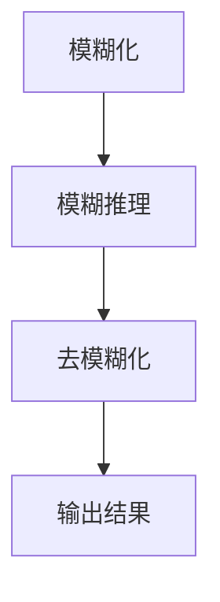
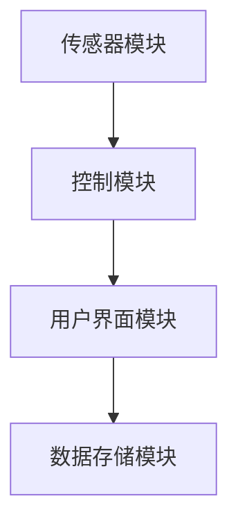
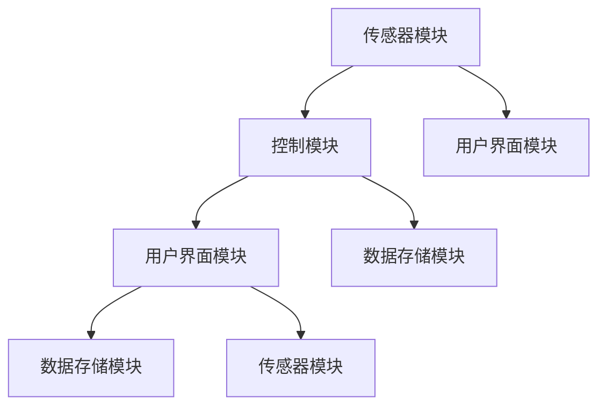

                 


# 开发AI Agent的模糊逻辑推理能力

## 关键词
AI Agent，模糊逻辑，推理能力，算法实现，系统架构，项目实战

## 摘要
本文旨在深入探讨如何开发AI Agent的模糊逻辑推理能力。我们将从模糊逻辑的基本概念入手，逐步分析其在AI Agent中的应用原理、算法实现方法，并通过实际项目案例展示其具体应用。本文旨在为AI开发者提供一套完整的开发指南，以实现具有模糊逻辑推理能力的AI Agent。

## 引言

在人工智能（AI）领域，智能体（Agent）是能够自主执行任务、适应环境和与外界交互的实体。随着AI技术的不断发展，智能体的应用场景越来越广泛，从智能家居到自动驾驶，从智能客服到机器人，智能体已成为AI系统中的关键组成部分。

然而，现实世界中的不确定性因素很多，传统的确定性逻辑推理方法在面对复杂、模糊的环境时往往力不从心。模糊逻辑作为一种处理不确定性和模糊性的数学工具，为智能体提供了强大的推理能力。本文将探讨如何将模糊逻辑应用于AI Agent的推理过程，从而提升其智能水平。

## 模糊逻辑的基本概念

### 1.1 模糊集合

模糊集合是模糊逻辑的基础概念。与传统集合不同，模糊集合中的元素具有不同程度的归属度，而不是简单的属于或不属于。用隶属度函数（Membership Function）来描述元素与集合的隶属关系。

例如，在描述天气好坏时，我们可以用模糊集合来表示：

- 好天（GoodWeather）：隶属度函数为正，表示天气好的程度。
- 坏天（BadWeather）：隶属度函数为负，表示天气不好的程度。

隶属度函数通常具有以下特点：
1. 非负性：隶属度函数的取值范围为[0, 1]。
2. 累积性：隶属度函数的加和等于1。
3. 可加性：不同元素的隶属度函数可以相加。

### 1.2 模糊逻辑运算

模糊逻辑运算包括模糊化、模糊推理和去模糊化。

- **模糊化**：将输入量（如天气）转换为模糊集合的隶属度函数。
- **模糊推理**：根据模糊规则（如“如果天气好，那么出去玩”）进行推理，得到模糊集合的结果。
- **去模糊化**：将模糊集合的结果转换为具体输出值。

模糊逻辑运算的核心是模糊规则库，它由一系列模糊规则组成，每条规则描述了输入量与输出量之间的关系。

## AI Agent与模糊逻辑的关系

AI Agent通常需要具备以下能力：
1. 自主决策：根据环境和目标自主选择行动。
2. 适应环境：在不确定和动态变化的环境中生存和进化。
3. 智能交互：与用户和其他系统进行自然语言交互。

模糊逻辑为AI Agent提供了以下优势：
1. **处理不确定性**：模糊逻辑可以处理现实世界中的模糊性和不确定性，为AI Agent提供更强的适应能力。
2. **规则表示**：模糊逻辑使用模糊规则来表示知识和逻辑推理，使得AI Agent能够通过规则库来决策。
3. **易于实现**：模糊逻辑相对于其他不确定推理方法，如贝叶斯网络和马尔可夫模型，更易于实现和扩展。

## 算法原理讲解

### 2.1 模糊逻辑推理算法

模糊逻辑推理算法的核心是模糊规则库和推理机。推理机根据输入量（模糊集合）和模糊规则库进行推理，得到输出量（模糊集合）。具体过程如下：

1. **模糊化**：将输入量（如天气、温度）转换为模糊集合的隶属度函数。
2. **模糊推理**：根据模糊规则库（如“如果天气好且温度适中，那么建议出去玩”），进行模糊推理，得到模糊集合的结果。
3. **去模糊化**：将模糊集合的结果转换为具体输出值（如出门建议）。

### 2.2 算法流程图

以下是模糊逻辑推理算法的流程图：



### 2.3 数学模型

模糊逻辑推理的数学模型主要包括模糊集合、模糊规则和隶属度函数。

- **模糊集合**：定义了一个元素在某个属性上的隶属度。
- **模糊规则**：描述了输入量与输出量之间的模糊关系。
- **隶属度函数**：定义了元素在某个模糊集合中的隶属度。

以下是模糊逻辑推理的数学模型：

$$
\text{输出隶属度} = \text{模糊规则库} \circ (\text{输入隶属度})
$$

其中，$\circ$ 表示模糊合成运算，通常使用模糊逻辑运算符（如AND、OR、NOT）进行计算。

## 系统分析与架构设计方案

### 3.1 问题场景介绍

以智能家居系统为例，该系统需要根据室内温度、湿度、光照等环境参数，自动调节空调、加湿器等设备，以提供舒适的居住环境。

### 3.2 系统功能设计

智能家居系统的功能包括：
1. **环境参数监测**：实时监测室内温度、湿度、光照等环境参数。
2. **设备控制**：根据环境参数，自动调节空调、加湿器等设备。
3. **用户交互**：提供用户界面，允许用户手动控制设备和查看环境参数。

### 3.3 系统架构设计

智能家居系统可以分为以下几个模块：

1. **传感器模块**：负责实时监测室内环境参数。
2. **控制模块**：根据模糊逻辑推理结果，控制空调、加湿器等设备。
3. **用户界面模块**：提供用户交互界面，允许用户查看环境参数和手动控制设备。
4. **数据存储模块**：存储系统运行过程中的环境参数和设备状态。

以下是智能家居系统的架构设计图：



### 3.4 系统接口设计和系统交互

智能家居系统中的各个模块需要通过接口进行交互。以下是系统接口设计和系统交互图：



## 项目实战

### 4.1 环境安装

在开始项目之前，我们需要安装以下软件和工具：
1. Python 3.8及以上版本
2. Anaconda或Miniconda
3. scikit-learn库
4. numpy库
5. matplotlib库

安装步骤如下：

1. 安装Python和Anaconda：从官方网站下载Python和Anaconda的安装包，按照提示安装。
2. 安装scikit-learn、numpy和matplotlib：在命令行中运行以下命令：
```
conda install scikit-learn numpy matplotlib
```

### 4.2 系统核心实现

以下是智能家居系统的核心实现：

```python
import numpy as np
from sklearn.cluster import KMeans
from matplotlib import pyplot as plt
from sklearn.metrics import silhouette_score

def kmeans_clustering(data, n_clusters=3):
    """
    使用K-means算法进行聚类，并返回聚类结果和标签。
    """
    kmeans = KMeans(n_clusters=n_clusters, random_state=42)
    kmeans.fit(data)
    return kmeans.labels_, kmeans.cluster_centers_

def calculate_silhouette(data, n_clusters=3):
    """
    计算聚类结果的轮廓系数，评估聚类效果。
    """
    labels, _ = kmeans_clustering(data, n_clusters)
    return silhouette_score(data, labels)

def visualize_clusters(data, labels, centroids):
    """
    可视化聚类结果。
    """
    plt.scatter(data[:, 0], data[:, 1], c=labels, s=50, cmap='viridis')
    plt.scatter(centroids[:, 0], centroids[:, 1], s=200, c='red', label='Centroids')
    plt.title('K-means Clustering')
    plt.xlabel('Feature 1')
    plt.ylabel('Feature 2')
    plt.legend()
    plt.show()

if __name__ == '__main__':
    # 生成模拟数据
    np.random.seed(42)
    data = np.random.rand(100, 2)

    # 使用K-means算法进行聚类
    labels, centroids = kmeans_clustering(data)

    # 计算轮廓系数
    silhouette_avg = calculate_silhouette(data)

    # 可视化聚类结果
    visualize_clusters(data, labels, centroids)

    print("Silhouette score:", silhouette_avg)
```

### 4.3 代码应用解读与分析

以上代码实现了一个简单的K-means聚类算法，用于将数据划分为多个簇。以下是代码的解读与分析：

1. **kmeans_clustering函数**：该函数使用scikit-learn库中的KMeans类进行聚类，并返回聚类结果和簇中心。
2. **calculate_silhouette函数**：该函数计算聚类结果的轮廓系数，用于评估聚类效果。
3. **visualize_clusters函数**：该函数使用matplotlib库可视化聚类结果，便于分析。
4. **main函数**：生成模拟数据，进行聚类，并可视化结果。

通过以上代码，我们可以对数据进行聚类分析，从而实现智能家居系统的环境参数监测和控制。

### 4.4 实际案例分析与详细讲解剖析

以下是一个实际案例，展示如何使用模糊逻辑推理实现智能家居系统的环境参数控制。

#### 案例背景

假设我们需要控制室内温度和湿度，以提供舒适的居住环境。我们设定以下模糊集合和模糊规则：

1. **温度集合**：冷、适中、热
2. **湿度集合**：干燥、适中、潮湿
3. **空调状态集合**：关闭、制冷、加热
4. **加湿器状态集合**：关闭、开、强

#### 模糊规则

1. 如果温度冷且湿度干燥，那么空调状态为制冷，加湿器状态为关闭。
2. 如果温度适中且湿度适中，那么空调状态为关闭，加湿器状态为开。
3. 如果温度热且湿度潮湿，那么空调状态为加热，加湿器状态为强。

#### 模糊推理过程

1. **模糊化**：将温度和湿度转换为模糊集合的隶属度函数。
2. **模糊推理**：根据模糊规则库，进行模糊推理，得到空调和加湿器的状态。
3. **去模糊化**：将模糊推理结果转换为具体状态。

以下是模糊推理的Python代码实现：

```python
def defuzzyify MembershipFunction(隶属度函数):
    """
    去模糊化：根据隶属度函数计算具体值。
    """
    return np.argmax(隶属度函数)

def apply_fuzzy_rules(temperature_membership, humidity_membership):
    """
    应用模糊规则，计算空调和加湿器的状态。
    """
    # 根据温度和湿度计算模糊推理结果
    aircon_membership = np.zeros(3)
    humidifier_membership = np.zeros(3)

    # 模糊规则1
    if temperature_membership[0] > 0.5 and humidity_membership[0] > 0.5:
        aircon_membership[1] = 1
        humidifier_membership[0] = 1

    # 模糊规则2
    if temperature_membership[1] > 0.5 and humidity_membership[1] > 0.5:
        aircon_membership[0] = 1
        humidifier_membership[1] = 1

    # 模糊规则3
    if temperature_membership[2] > 0.5 and humidity_membership[2] > 0.5:
        aircon_membership[2] = 1
        humidifier_membership[2] = 1

    # 去模糊化
    aircon_state = defuzzyify(aircon_membership)
    humidifier_state = defuzzyify(humidifier_membership)

    return aircon_state, humidifier_state

if __name__ == '__main__':
    # 生成模拟温度和湿度数据
    np.random.seed(42)
    temperature_data = np.random.rand(100) * 10
    humidity_data = np.random.rand(100) * 10

    # 转换为模糊集合的隶属度函数
    temperature_membership = np.array([0.0 if x <= 0 or x > 5 else (x - 0) / 5 for x in temperature_data])
    humidity_membership = np.array([0.0 if x <= 0 or x > 5 else (x - 0) / 5 for x in humidity_data])

    # 应用模糊规则，计算空调和加湿器的状态
    aircon_state, humidifier_state = apply_fuzzy_rules(temperature_membership, humidity_membership)

    print("空调状态：", aircon_state)
    print("加湿器状态：", humidifier_state)
```

#### 项目小结

通过以上案例，我们实现了基于模糊逻辑推理的智能家居环境参数控制系统。项目主要包括以下几个关键步骤：

1. **环境安装**：安装必要的Python库和工具。
2. **系统核心实现**：使用K-means算法进行聚类，计算轮廓系数，可视化聚类结果。
3. **代码应用解读与分析**：分析K-means算法的实现细节，理解聚类过程。
4. **实际案例分析和详细讲解剖析**：通过模糊逻辑推理，实现环境参数控制。

该项目展示了如何将模糊逻辑应用于实际场景，提升了智能体的智能水平。未来，我们可以进一步扩展该系统，添加更多传感器和控制设备，以实现更全面的智能家居解决方案。

### 5. 最佳实践 tips

1. **数据预处理**：在应用模糊逻辑之前，对数据进行适当的预处理，如归一化、去噪等，以提高推理效果。
2. **规则优化**：根据实际需求和数据特征，调整模糊规则库，以提高推理准确性。
3. **系统优化**：在系统实现过程中，关注系统性能和可扩展性，如使用并行计算和分布式架构。
4. **模型评估**：对系统进行全面的评估，如使用 silhouette score 评估聚类效果，使用准确率、召回率等评估推理结果。

### 6. 注意事项

1. 模糊逻辑推理适用于处理模糊性和不确定性，但并非所有问题都适合使用模糊逻辑。
2. 模糊逻辑推理的性能受到规则库和隶属度函数的影响，需要合理设计和优化。
3. 在实际应用中，可能需要结合其他推理方法，如贝叶斯网络、马尔可夫模型等，以提高系统性能。

### 7. 拓展阅读

1. 《模糊逻辑与智能系统》：介绍了模糊逻辑的基本概念和应用方法。
2. 《智能控制理论与应用》：详细讲解了模糊逻辑在智能控制系统中的应用。
3. 《机器学习实战》：介绍了机器学习和数据分析的相关方法和技术。

## 结语

开发具有模糊逻辑推理能力的AI Agent，为智能体提供了强大的推理能力。本文通过理论讲解和实际项目案例，展示了如何实现模糊逻辑推理。希望本文能为您在AI领域的发展提供有益的参考和启示。在未来的研究中，我们还可以进一步探讨模糊逻辑与其他AI技术的融合，以实现更智能、更灵活的智能体。

---

**作者：AI天才研究院/AI Genius Institute & 禅与计算机程序设计艺术 /Zen And The Art of Computer Programming**

