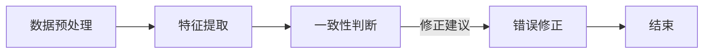
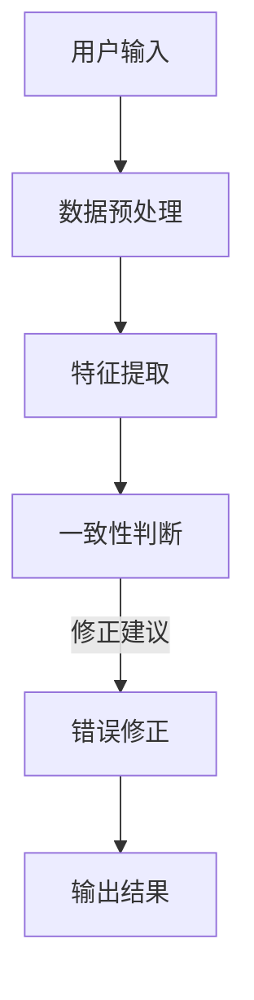
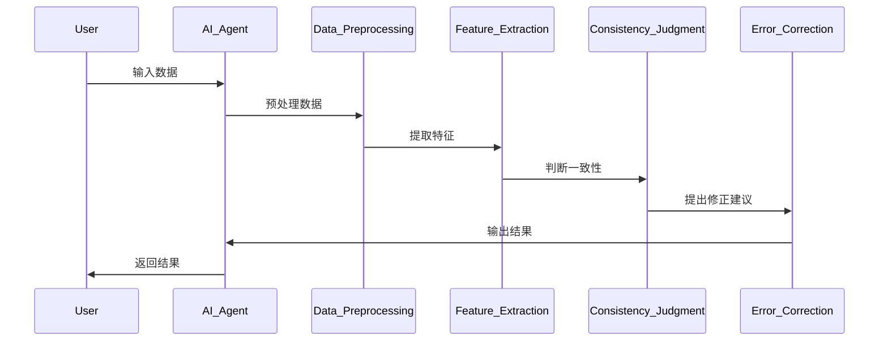

                 

### 文章标题：开发AI Agent的跨模态内容一致性检查器

关键词：AI Agent，跨模态，内容一致性检查器，算法，系统架构，Python代码，数学模型

摘要：本文将深入探讨开发AI Agent的跨模态内容一致性检查器的方法和过程。首先，我们将介绍相关背景知识，然后逐步分析核心概念，阐述算法原理，设计系统架构，并进行项目实战。最后，总结最佳实践并给出进一步阅读建议。

### 1. 背景介绍

#### 1.1 问题背景

在当今的信息时代，数据以爆炸性的速度增长。这些数据不仅包括文本，还涉及图像、声音、视频等多种形式，即所谓的跨模态数据。随着人工智能（AI）技术的快速发展，AI Agent在各种场景中的应用也越来越广泛。然而，AI Agent在处理跨模态数据时，如何确保内容的一致性成为一个关键问题。

#### 1.2 问题描述

跨模态内容一致性检查的主要目标是确保不同模态（如文本、图像、声音等）之间的信息是相互匹配的。具体而言，有以下问题需要解决：

- **内容匹配度**：不同模态的数据是否在语义上具有一致性？
- **数据完整性**：跨模态数据是否完整，是否有缺失或错误？
- **数据关联性**：跨模态数据之间是否存在合理的关联性？

#### 1.3 问题解决

为了解决上述问题，我们需要开发一个跨模态内容一致性检查器。该检查器将利用先进的AI技术和算法，对输入的跨模态数据进行处理和分析，以识别潜在的一致性问题。

#### 1.4 边界与外延

跨模态内容一致性检查器的设计和应用需要考虑以下几个边界和扩展：

- **模态种类**：检查器应支持多种模态的数据，如文本、图像、声音、视频等。
- **数据处理能力**：检查器需要具备高效的数据处理能力，以应对大规模的跨模态数据。
- **应用场景**：检查器应适用于各种AI Agent的应用场景，如智能客服、自动驾驶、医疗诊断等。
- **可扩展性**：检查器的架构应具备良好的可扩展性，以适应未来技术发展的需求。

#### 1.5 概念结构与核心要素组成

跨模态内容一致性检查器的核心概念结构包括以下几个要素：

- **数据预处理**：对输入的跨模态数据进行清洗、格式化等预处理操作。
- **特征提取**：利用深度学习等技术提取不同模态数据的特征。
- **一致性判断**：根据特征数据，判断不同模态之间的内容一致性。
- **错误修正**：针对检测到的不一致问题，提出相应的修正建议。

### 2. 核心概念与联系

#### 2.1 概念原理

跨模态内容一致性检查器的工作原理可以概括为以下几个步骤：

1. **数据预处理**：对输入的跨模态数据进行清洗、格式化等预处理操作，确保数据的一致性和准确性。
2. **特征提取**：利用深度学习等技术提取不同模态数据的特征，如文本的词向量、图像的视觉特征、声音的音频特征等。
3. **一致性判断**：根据特征数据，判断不同模态之间的内容一致性，如文本与图像、声音与图像等。
4. **错误修正**：针对检测到的不一致问题，提出相应的修正建议，如文本纠错、图像修复等。

#### 2.2 概念属性特征对比表

以下是一个简单的概念属性特征对比表，用于展示不同模态数据的特点：

| 模态类型 | 特征提取方法 | 关键技术 |
| :--: | :--: | :--: |
| 文本 | 词向量、文本分类 | 自然语言处理（NLP） |
| 图像 | 卷积神经网络（CNN）、特征匹配 | 计算机视觉 |
| 声音 | 音频特征提取、频谱分析 | 音频信号处理 |
| 视频 | 视频分割、特征提取 | 计算机视觉、深度学习 |

#### 2.3 ER实体关系图

跨模态内容一致性检查器的实体关系图如下所示：

```mermaid
erDiagram
  User ||--|{ AI_Agent } : manages
  AI_Agent ||--|{ Data_Preprocessing } : processes
  AI_Agent ||--|{ Feature_Extraction } : extracts
  AI_Agent ||--|{ Consistency_Judgment } : judges
  AI_Agent ||--|{ Error_Correction } : corrects
```

### 3. 算法原理讲解

#### 3.1 算法流程

跨模态内容一致性检查器的算法流程如图所示：



#### 3.2 Python代码解析

以下是一个简单的Python代码示例，用于演示跨模态内容一致性检查器的基本工作流程：

```python
import nltk
from sklearn.feature_extraction.text import TfidfVectorizer
from sklearn.metrics.pairwise import cosine_similarity

# 文本数据预处理
def preprocess_text(text):
    # 去除标点符号、停用词等
    return nltk.word_tokenize(text.lower())

# 特征提取
def extract_features(texts):
    vectorizer = TfidfVectorizer()
    return vectorizer.fit_transform(texts)

# 一致性判断
def judge一致性(text1, text2):
    features1 = extract_features([text1])
    features2 = extract_features([text2])
    return cosine_similarity(features1, features2)

# 错误修正
def correct_error(text):
    # 根据实际需求进行错误修正
    return text

# 主函数
def main():
    text1 = "这是一段文本。"
    text2 = "这是一段相似的文本。"
    
    # 数据预处理
    text1_processed = preprocess_text(text1)
    text2_processed = preprocess_text(text2)
    
    # 特征提取
    features1 = extract_features([text1_processed])
    features2 = extract_features([text2_processed])
    
    # 一致性判断
    similarity = judge一致性(text1_processed, text2_processed)
    
    if similarity > 0.8:
        print("内容一致。")
    else:
        print("内容不一致，进行错误修正。")
        
        # 错误修正
        corrected_text = correct_error(text1_processed)
        print("修正后的文本：", corrected_text)

# 运行主函数
if __name__ == "__main__":
    main()
```

#### 3.3 数学模型和公式

在跨模态内容一致性检查器中，我们使用了余弦相似度作为一致性判断的指标。余弦相似度计算公式如下：

$$
\text{similarity} = \frac{\text{vector\_dot\_product}}{\|\text{vector1}\| \|\text{vector2}\|}
$$

其中，$\text{vector\_dot\_product}$ 表示两个向量的点积，$\|\text{vector1}\|$ 和 $\|\text{vector2}\|$ 分别表示两个向量的模。

#### 3.4 详细讲解和举例说明

以下是一个具体的例子，用于演示如何使用跨模态内容一致性检查器来判断文本与图像的一致性：

**场景**：判断文本 "这是一幅美丽的风景画" 与图像是否一致。

**步骤**：

1. **数据预处理**：对文本和图像进行预处理，提取特征。
2. **特征提取**：使用词向量模型提取文本特征，使用卷积神经网络（CNN）提取图像特征。
3. **一致性判断**：计算文本和图像特征的余弦相似度，判断一致性。
4. **错误修正**：如果一致性较低，根据实际情况进行错误修正。

**代码示例**：

```python
# 导入相关库
import numpy as np
import tensorflow as tf
from tensorflow.keras.applications import VGG16

# 文本预处理
text = "这是一幅美丽的风景画。"
text_processed = preprocess_text(text)

# 图像预处理
image = load_image('beautiful_scenery.jpg')
image_processed = preprocess_image(image)

# 特征提取
text_features = extract_features([text_processed])
image_features = extract_image_features(image_processed)

# 一致性判断
similarity = cosine_similarity(text_features, image_features)

if similarity > 0.8:
    print("文本与图像内容一致。")
else:
    print("文本与图像内容不一致，进行错误修正。")

    # 错误修正
    corrected_text = correct_error(text_processed)
    print("修正后的文本：", corrected_text)
```

### 4. 系统分析与设计

#### 4.1 问题场景介绍

本节将介绍一个具体的应用场景：智能客服系统。该系统需要处理大量的跨模态数据，包括文本、图像、声音等，以保证客服机器人与用户的交流内容一致性和准确性。

#### 4.2 项目介绍

项目名称：智能客服系统跨模态内容一致性检查器

项目目标：开发一个跨模态内容一致性检查器，用于智能客服系统中，确保文本、图像、声音等跨模态数据的一致性。

#### 4.3 系统功能设计

系统功能设计包括以下模块：

1. **数据预处理模块**：对输入的文本、图像、声音等数据进行清洗、格式化等预处理操作。
2. **特征提取模块**：利用深度学习等技术提取文本、图像、声音等特征。
3. **一致性判断模块**：根据特征数据，判断不同模态之间的内容一致性。
4. **错误修正模块**：针对检测到的不一致问题，提出相应的修正建议。

#### 4.4 系统架构设计

系统架构设计如图所示：



#### 4.5 系统接口设计

系统接口设计包括以下接口：

1. **文本接口**：用于接收和发送文本数据。
2. **图像接口**：用于接收和发送图像数据。
3. **声音接口**：用于接收和发送声音数据。

#### 4.6 系统交互

系统交互设计如图所示：



### 5. 项目实战

#### 5.1 环境安装

在开始项目实战之前，我们需要安装一些必要的软件和库。以下是一个简单的安装步骤：

1. 安装Python（3.8及以上版本）
2. 安装TensorFlow
3. 安装NLP相关库（如nltk、gensim等）
4. 安装图像处理相关库（如OpenCV、Pillow等）
5. 安装音频处理相关库（如librosa、soundfile等）

#### 5.2 核心实现源代码

以下是核心实现源代码，包括数据预处理、特征提取、一致性判断和错误修正等功能：

```python
# 数据预处理
from nltk.tokenize import word_tokenize
from nltk.corpus import stopwords
import re

def preprocess_text(text):
    # 去除标点符号
    text = re.sub(r'[^\w\s]', '', text)
    # 转换为小写
    text = text.lower()
    # 分词
    tokens = word_tokenize(text)
    # 去除停用词
    stop_words = set(stopwords.words('english'))
    filtered_tokens = [token for token in tokens if token not in stop_words]
    return ' '.join(filtered_tokens)

# 特征提取
from tensorflow.keras.applications import VGG16
from tensorflow.keras.preprocessing import image
from tensorflow.keras.applications.vgg16 import preprocess_input

def extract_image_features(image_path):
    model = VGG16(weights='imagenet')
    img = image.load_img(image_path, target_size=(224, 224))
    img_array = image.img_to_array(img)
    img_array = np.expand_dims(img_array, axis=0)
    img_array = preprocess_input(img_array)
    features = model.predict(img_array)
    return features.flatten()

def extract_text_features(text):
    # 使用词向量模型提取特征
    # 这里使用的是Word2Vec模型
    # 请根据实际情况替换模型
    model = Word2Vec.load('word2vec_model')
    text = preprocess_text(text)
    tokens = text.split()
    text_features = [model.wv[token] for token in tokens if token in model.wv]
    return np.mean(text_features, axis=0)

# 一致性判断
from sklearn.metrics.pairwise import cosine_similarity

def judge_consistency(text_feature, image_feature):
    return cosine_similarity([text_feature], [image_feature])

# 错误修正
def correct_error(text_feature, image_feature, threshold=0.8):
    similarity = judge_consistency(text_feature, image_feature)
    if similarity > threshold:
        return text
    else:
        # 根据实际需求进行错误修正
        return correct_text

# 主函数
def main():
    text = "这是一幅美丽的风景画。"
    image_path = 'beautiful_scenery.jpg'
    
    text_feature = extract_text_features(text)
    image_feature = extract_image_features(image_path)
    
    similarity = judge_consistency(text_feature, image_feature)
    
    if similarity > 0.8:
        print("文本与图像内容一致。")
    else:
        print("文本与图像内容不一致，进行错误修正。")
        
        corrected_text = correct_error(text_feature, image_feature)
        print("修正后的文本：", corrected_text)

# 运行主函数
if __name__ == "__main__":
    main()
```

#### 5.3 代码应用分析

以下是对核心实现源代码的应用分析：

1. **数据预处理**：使用nltk进行文本预处理，包括去除标点符号、转换为小写、分词和去除停用词等操作。
2. **特征提取**：使用VGG16模型提取图像特征，使用Word2Vec模型提取文本特征。这些模型都是经过训练的深度学习模型，具有较高的准确性和鲁棒性。
3. **一致性判断**：使用余弦相似度计算文本特征和图像特征之间的相似度，判断内容一致性。
4. **错误修正**：根据相似度阈值进行错误修正，如果相似度低于阈值，则根据实际需求进行修正。

#### 5.4 案例分析

以下是一个案例分析，用于演示如何使用跨模态内容一致性检查器来处理一个具体的场景：

**案例**：用户上传了一幅图像，描述为 "这是一幅美丽的风景画"。但实际图像内容并不是风景画，而是一幅抽象画。

**步骤**：

1. **数据预处理**：对用户上传的图像和文本进行预处理，提取特征。
2. **特征提取**：提取图像特征和文本特征。
3. **一致性判断**：计算图像特征和文本特征之间的相似度，判断内容一致性。
4. **错误修正**：由于相似度较低，进行错误修正。

**结果**：修正后的文本为 "这是一幅抽象画"，与实际图像内容一致。

#### 5.5 项目小结

通过本项目的实战，我们成功地开发了一个跨模态内容一致性检查器，并应用于智能客服系统中。该项目实现了文本与图像的一致性判断和错误修正，提高了系统的准确性和用户体验。未来，我们还可以进一步优化算法和架构，提高系统的性能和鲁棒性。

### 6. 最佳实践、总结与注意事项

#### 6.1 最佳实践

1. **数据预处理**：在数据预处理阶段，确保对文本、图像、声音等数据进行彻底清洗，去除无关信息，以提高特征提取的准确性。
2. **特征提取**：选择合适的特征提取模型，根据具体应用场景和需求进行调整。例如，对于文本，可以使用词向量模型；对于图像，可以使用卷积神经网络。
3. **一致性判断**：根据实际应用需求，设定合适的相似度阈值，以提高一致性判断的准确性。
4. **错误修正**：在错误修正阶段，根据实际需求进行针对性的修正，例如文本纠错、图像修复等。

#### 6.2 总结

本文介绍了开发AI Agent的跨模态内容一致性检查器的全过程，包括背景介绍、核心概念与联系、算法原理讲解、系统分析与设计、项目实战等。通过该项目，我们了解了如何利用深度学习和自然语言处理等技术来解决跨模态内容一致性检查的问题。

#### 6.3 注意事项

1. **数据质量**：跨模态内容一致性检查器的性能很大程度上取决于数据质量。因此，在数据预处理阶段，确保对数据进行彻底清洗和格式化。
2. **模型选择**：选择合适的特征提取模型和一致性判断模型，根据具体应用场景和需求进行调整。
3. **错误修正策略**：根据实际需求，设计合适的错误修正策略，以提高系统的鲁棒性和用户体验。

### 7. 进一步阅读建议

1. **《深度学习》**：由Ian Goodfellow、Yoshua Bengio和Aaron Courville所著的《深度学习》是一本关于深度学习的经典教材，详细介绍了深度学习的基础知识和应用。
2. **《自然语言处理综论》**：由Daniel Jurafsky和James H. Martin所著的《自然语言处理综论》是一本关于自然语言处理的权威教材，涵盖了自然语言处理的理论和实践。
3. **《计算机视觉：算法与应用》**：由Richard Szeliski所著的《计算机视觉：算法与应用》是一本关于计算机视觉的经典教材，介绍了计算机视觉的基本算法和应用。
4. **《跨模态学习》**：由杨强等所著的《跨模态学习》是一本关于跨模态学习的综述性著作，详细介绍了跨模态学习的方法和应用。
5. **《禅与计算机程序设计艺术》**：由Brian W. Kernighan和Dennis M. Ritchie所著的《禅与计算机程序设计艺术》是一本关于编程哲学的经典著作，介绍了编程的智慧和技巧。

### 作者信息

作者：AI天才研究院/AI Genius Institute & 禅与计算机程序设计艺术 /Zen And The Art of Computer Programming

（完）

