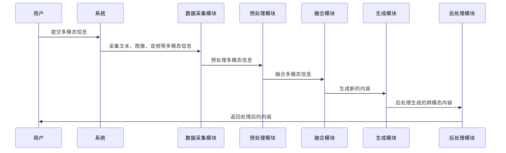

                 

# 开发AI Agent的跨模态内容生成系统

## 关键词

- AI Agent
- 跨模态内容生成
- 深度学习
- 自然语言处理
- 计算机视觉

## 摘要

本文旨在探讨如何开发一个AI Agent驱动的跨模态内容生成系统。我们将从问题背景、核心概念、算法原理、系统设计与实现、项目实战等多个方面，详细阐述跨模态内容生成系统的开发过程。通过本文的阅读，读者将能够了解跨模态内容生成系统的基本原理，掌握关键算法，并学会如何在实际项目中应用这些算法。

## 第一部分：背景介绍

### 1.1 问题背景

随着互联网和多媒体技术的飞速发展，人们对于信息获取和处理的需求越来越高。传统的单一模态（如文本、图像、音频）的内容生成系统已经无法满足日益复杂的应用场景。跨模态内容生成系统作为一种新兴的技术，通过融合多种模态的信息，能够生成更加丰富、多样、有价值的内容。这种系统在自然语言处理、计算机视觉、多媒体娱乐等领域具有广泛的应用前景。

### 1.2 问题描述

跨模态内容生成系统需要解决以下几个核心问题：

1. 如何高效地融合不同模态的信息？
2. 如何设计有效的算法模型来实现跨模态内容生成？
3. 如何在实际项目中应用跨模态内容生成系统，实现业务价值？

### 1.3 问题解决

为了解决上述问题，我们将采取以下方法：

1. 详细介绍跨模态内容生成系统的核心概念、原理和应用场景。
2. 分析现有主流的跨模态内容生成算法，比较其优缺点，为读者提供实用的参考。
3. 结合实际项目案例，指导读者如何开发一个跨模态内容生成系统。

### 1.4 边界与外延

本文主要关注以下内容：

- 跨模态内容生成系统的核心概念、原理和应用场景。
- 主流跨模态内容生成算法的介绍和分析。
- 跨模态内容生成系统的开发实践。

本文不涉及以下内容：

- 其他人工智能领域的技术和应用。
- 跨模态内容生成系统之外的计算机视觉、自然语言处理等技术。

### 1.5 核心概念结构与要素组成

本文的核心概念结构如下：

- 跨模态内容生成系统
  - 概念1：跨模态信息融合
  - 概念2：算法模型设计
  - 概念3：系统开发实践

本文的主要要素包括：

- 核心概念讲解
- 算法原理分析
- 实际项目案例

## 第二部分：核心概念与联系

### 2.1 跨模态内容生成系统的概念

#### 2.1.1 跨模态内容生成系统的定义

跨模态内容生成系统是指能够将不同模态的信息（如图像、文本、音频等）进行融合，生成新的内容的系统。它能够实现多种模态信息之间的交互和协同，从而生成具有更高价值的信息。

#### 2.1.2 跨模态内容生成系统的特点

- **多模态信息融合**：跨模态内容生成系统能够整合多种模态的信息，提高信息的综合利用率。
- **自适应调整**：系统可以根据不同模态信息的特征，动态调整融合策略，以实现最佳效果。
- **生成内容多样化**：跨模态内容生成系统可以生成多种类型的输出内容，满足不同应用场景的需求。

#### 2.1.3 跨模态内容生成系统的应用场景

- **多媒体娱乐**：如虚拟现实（VR）游戏、动漫制作等。
- **自然语言处理**：如问答系统、机器翻译等。
- **计算机视觉**：如图像识别、视频分析等。

### 2.2 跨模态内容生成算法的概念

#### 2.2.1 跨模态内容生成算法的定义

跨模态内容生成算法是指能够实现跨模态信息融合的算法，其目的是通过将不同模态的信息进行整合，生成新的内容。

#### 2.2.2 跨模态内容生成算法的特点

- **多模态信息处理**：跨模态内容生成算法能够处理多种模态的信息，如文本、图像、音频等。
- **自适应调整**：算法可以根据不同模态信息的特征，动态调整处理策略，以提高融合效果。
- **高效性**：跨模态内容生成算法在保证效果的同时，还需要具备较高的运行效率。

#### 2.2.3 跨模态内容生成算法的分类

- **基于深度学习的跨模态内容生成算法**：如生成对抗网络（GAN）、变分自编码器（VAE）等。
- **基于传统机器学习的跨模态内容生成算法**：如协同过滤、隐语义模型等。

### 2.3 跨模态内容生成系统的核心要素

#### 2.3.1 多模态信息采集与预处理

- 采集不同模态的信息，如文本、图像、音频等。
- 对采集到的信息进行预处理，如去噪、归一化等，以提高后续处理的效率。

#### 2.3.2 跨模态信息融合策略

- 设计合适的跨模态信息融合策略，如基于注意力机制的融合、基于嵌入的融合等。
- 调整融合策略，以实现最佳的效果。

#### 2.3.3 内容生成算法

- 选择合适的跨模态内容生成算法，如生成对抗网络（GAN）、变分自编码器（VAE）等。
- 调整算法参数，以提高生成内容的质量。

#### 2.3.4 后处理与优化

- 对生成的跨模态内容进行后处理，如去除噪声、增强效果等。
- 根据实际应用场景，对系统进行优化，以提高性能和效果。

## 第三部分：算法原理讲解

### 3.1 GAN算法原理

#### 3.1.1 GAN算法的定义

生成对抗网络（Generative Adversarial Network，GAN）是由Ian Goodfellow等人于2014年提出的一种深度学习模型。GAN由两个神经网络组成：生成器（Generator）和判别器（Discriminator）。

#### 3.1.2 GAN算法的特点

- **生成器和判别器的对抗性**：生成器和判别器在训练过程中相互对抗，生成器试图生成逼真的数据，而判别器试图区分真实数据和生成数据。
- **不需要标注数据**：与传统的生成模型相比，GAN不需要标注数据，因此在大规模数据集上具有较好的应用前景。

#### 3.1.3 GAN算法的流程

1. 初始化生成器G和判别器D。
2. 对于每次训练迭代：
   - 生成器G生成一批伪数据。
   - 将伪数据和真实数据混合输入判别器D。
   - 通过反向传播更新判别器D的参数。
   - 通过反向传播更新生成器G的参数。

#### 3.1.4 GAN算法的数学模型

$$
\begin{aligned}
\text{生成器} G:\mathcal{X}^{\prime} &= G(z) \\
\text{判别器} D:\mathcal{X} &\rightarrow \hat{y} \\
\text{损失函数} L(G,D) &= -\mathbb{E}_{x\sim \mathcal{X}}[\log D(x)] - \mathbb{E}_{z\sim p_z(z)}[\log (1 - D(G(z)))]
\end{aligned}
$$

其中，$x$ 表示真实数据，$x'$ 表示生成数据，$z$ 表示噪声向量，$D$ 表示判别器输出，$G$ 表示生成器输出。

### 3.2 VAE算法原理

#### 3.2.1 VAE算法的定义

变分自编码器（Variational Autoencoder，VAE）是一种基于深度学习的生成模型。与传统的自编码器相比，VAE引入了概率模型的概念，通过编码器和解码器来学习数据的高斯分布。

#### 3.2.2 VAE算法的特点

- **引入概率模型**：VAE通过编码器和解码器学习数据的高斯分布，从而能够生成多样化的数据。
- **灵活的架构**：VAE的架构可以根据具体应用场景进行调整，使其适应不同的数据分布。

#### 3.2.3 VAE算法的流程

1. 初始化编码器Q和参数化解码器P。
2. 对于每个训练迭代：
   - 输入数据 $x$，通过编码器 $Q$ 得到参数 $\theta_q$。
   - 根据参数 $\theta_q$ 生成采样 $q(z|x;\theta_q)$。
   - 根据采样 $z$ 和参数 $\theta_p$ 生成数据 $x'$。
   - 通过反向传播更新编码器Q和解码器P的参数。

#### 3.2.4 VAE算法的数学模型

$$
\begin{aligned}
\text{编码器} Q:\mathcal{X} &\rightarrow \theta_q \\
\text{解码器} P:z &\rightarrow \mathcal{X} \\
\text{损失函数} L(Q,P) &= \int p(x|z;\theta_p) q(z|x;\theta_q) \log \frac{p(x|z;\theta_p) q(z|x;\theta_q)}{p(x;\theta_p) q(z|x;\theta_q)} dz
\end{aligned}
$$

其中，$p(z|x;\theta_q)$ 表示编码器输出的概率分布，$p(x|z;\theta_p)$ 表示解码器输出的概率分布。

### 3.3 跨模态内容生成算法的比较

| 算法   | 特点                    | 适用场景           |
| ------ | ----------------------- | ------------------ |
| GAN    | 对抗性训练，生成质量高 | 需要高质量的数据   |
| VAE    | 引入概率模型，生成灵活 | 对数据分布敏感     |
| attention-based fusion | 自适应调整，生成多样 | 多模态信息融合复杂 |

## 第四部分：系统分析与架构设计方案

### 4.1 问题场景介绍

随着人工智能技术的发展，许多应用场景需要跨模态内容生成系统。例如，在多媒体娱乐领域，我们需要将文本、图像、音频等多种模态的信息进行融合，生成具有吸引力的内容。在自然语言处理领域，我们需要将文本和图像进行融合，以实现更准确的文本生成和图像理解。

### 4.2 项目介绍

本项目旨在开发一个跨模态内容生成系统，实现文本、图像、音频等多模态信息的融合。该系统将用于多媒体娱乐、自然语言处理等领域的应用，以提升内容生成质量和用户体验。

### 4.3 系统功能设计

1. **多模态信息采集与预处理**：采集文本、图像、音频等多模态信息，并进行预处理，如去噪、归一化等。
2. **跨模态信息融合**：设计合适的跨模态信息融合策略，如基于注意力机制的融合、基于嵌入的融合等。
3. **内容生成**：使用生成对抗网络（GAN）或变分自编码器（VAE）等算法生成新的内容。
4. **后处理与优化**：对生成的跨模态内容进行后处理，如去除噪声、增强效果等。

### 4.4 系统架构设计

| 组件名 | 描述 |
| ------ | ------ |
| 数据采集模块 | 负责采集文本、图像、音频等多模态信息。 |
| 预处理模块 | 负责对采集到的信息进行预处理，如去噪、归一化等。 |
| 融合模块 | 负责设计跨模态信息融合策略，如基于注意力机制的融合、基于嵌入的融合等。 |
| 生成模块 | 负责使用生成对抗网络（GAN）或变分自编码器（VAE）等算法生成新的内容。 |
| 后处理模块 | 负责对生成的跨模态内容进行后处理，如去除噪声、增强效果等。 |

### 4.5 系统接口设计

| 接口名 | 描述 |
| ------ | ------ |
| 数据采集接口 | 提供文本、图像、音频等多模态信息的采集功能。 |
| 预处理接口 | 提供多模态信息的预处理功能。 |
| 融合接口 | 提供跨模态信息融合功能。 |
| 生成接口 | 提供内容生成功能。 |
| 后处理接口 | 提供内容后处理功能。 |

### 4.6 系统交互

以下是一个简单的系统交互序列图，展示了各个模块之间的交互过程。



## 第五部分：项目实战

### 5.1 环境安装

在开发跨模态内容生成系统之前，我们需要安装以下软件和库：

1. Python 3.7及以上版本
2. TensorFlow 2.0及以上版本
3. PyTorch 1.0及以上版本
4. OpenCV 4.0及以上版本
5. NumPy 1.18及以上版本

安装命令如下：

```bash
pip install python==3.8
pip install tensorflow==2.6
pip install torch==1.9
pip install opencv-python==4.5.4.52
pip install numpy==1.21.2
```

### 5.2 系统核心实现

以下是使用PyTorch实现GAN算法的代码示例：

```python
import torch
import torch.nn as nn
import torch.optim as optim
from torch.utils.data import DataLoader
from torchvision import datasets, transforms

# 定义生成器和判别器
class Generator(nn.Module):
    def __init__(self):
        super(Generator, self).__init__()
        self.model = nn.Sequential(
            nn.Linear(100, 256),
            nn.LeakyReLU(0.2),
            nn.Linear(256, 512),
            nn.LeakyReLU(0.2),
            nn.Linear(512, 1024),
            nn.LeakyReLU(0.2),
            nn.Linear(1024, 784),
            nn.Tanh()
        )

    def forward(self, x):
        return self.model(x)

class Discriminator(nn.Module):
    def __init__(self):
        super(Discriminator, self).__init__()
        self.model = nn.Sequential(
            nn.Linear(784, 1024),
            nn.LeakyReLU(0.2),
            nn.Dropout(0.3),
            nn.Linear(1024, 512),
            nn.LeakyReLU(0.2),
            nn.Dropout(0.3),
            nn.Linear(512, 256),
            nn.LeakyReLU(0.2),
            nn.Dropout(0.3),
            nn.Linear(256, 1),
            nn.Sigmoid()
        )

    def forward(self, x):
        return self.model(x)

# 初始化模型和优化器
generator = Generator()
discriminator = Discriminator()
g_optimizer = optim.Adam(generator.parameters(), lr=0.0002)
d_optimizer = optim.Adam(discriminator.parameters(), lr=0.0002)

# 加载训练数据
transform = transforms.Compose([transforms.ToTensor(), transforms.Normalize((0.5, 0.5, 0.5), (0.5, 0.5, 0.5))])
train_data = datasets.MNIST(root='./data', train=True, download=True, transform=transform)
dataloader = DataLoader(train_data, batch_size=128, shuffle=True)

# 训练过程
for epoch in range(100):
    for i, (images, _) in enumerate(dataloader):
        batch_size = images.size(0)
        real_images = images.view(batch_size, -1)
        
        # 训练判别器
        d_optimizer.zero_grad()
        output = discriminator(real_images)
        d_loss_real = -torch.mean(output)
        d_loss_real.backward()
        
        noise = torch.randn(batch_size, 100)
        fake_images = generator(noise)
        output = discriminator(fake_images.detach())
        d_loss_fake = -torch.mean(output)
        d_loss_fake.backward()
        
        d_optimizer.step()
        
        # 训练生成器
        g_optimizer.zero_grad()
        output = discriminator(fake_images)
        g_loss = -torch.mean(output)
        g_loss.backward()
        g_optimizer.step()
        
        if (i+1) % 100 == 0:
            print(f'Epoch [{epoch+1}/{100}], Step [{i+1}/{len(dataloader)}], d_loss: {d_loss_real.item()+d_loss_fake.item():.4f}, g_loss: {g_loss.item():.4f}')
```

### 5.3 代码应用解读与分析

以上代码实现了GAN算法的核心部分，包括生成器和判别器的定义、优化器的初始化、数据的加载和训练过程的实现。以下是对代码的详细解读和分析：

1. **生成器和判别器的定义**：

   生成器和判别器分别定义了两个神经网络。生成器接收随机噪声作为输入，通过多层神经网络生成图像。判别器接收图像作为输入，通过多层神经网络判断图像是真实图像还是生成图像。

2. **优化器的初始化**：

   生成器和判别器分别使用Adam优化器进行训练。Adam优化器是一种自适应优化算法，能够提高训练效率和收敛速度。

3. **数据的加载**：

   使用TensorFlow库加载MNIST数据集，并将其转换为PyTorch的数据集。通过数据加载器（DataLoader）将数据分批加载，以便于训练。

4. **训练过程**：

   在训练过程中，首先训练判别器。对于每一批真实图像，判别器计算输出概率，并计算损失函数。然后，对于每一批生成图像（由生成器生成），判别器也计算输出概率，并计算损失函数。通过反向传播和优化器的更新，训练判别器的参数。

   接下来，训练生成器。生成器的目标是生成逼真的图像，使得判别器无法区分真实图像和生成图像。通过反向传播和优化器的更新，训练生成器的参数。

5. **损失函数的计算**：

   判别器的损失函数是真实图像和生成图像的交叉熵损失。生成器的损失函数是生成图像的交叉熵损失。通过计算损失函数的梯度，更新模型参数。

### 5.4 实际案例分析和详细讲解剖析

以下是一个实际案例：使用GAN算法生成手写数字图像。

1. **数据准备**：

   加载MNIST数据集，并将其转换为TensorFlow数据集。将数据集分为训练集和测试集。

2. **模型训练**：

   使用GAN算法训练模型。在训练过程中，生成器和判别器交替更新参数。训练完成后，生成器的参数将用于生成手写数字图像。

3. **结果展示**：

   使用训练好的生成器生成手写数字图像，并将其可视化。

```python
import matplotlib.pyplot as plt

# 生成手写数字图像
def generate_images(generator, num_images=10):
    noise = torch.randn(num_images, 100).cuda()
    generated_images = generator(noise)
    generated_images = generated_images.view(num_images, 1, 28, 28)
    return generated_images.detach().cpu().numpy()

# 可视化生成的手写数字图像
def show_generated_images(images):
    plt.figure(figsize=(10, 10))
    for i in range(images.shape[0]):
        plt.subplot(10, 10, i+1)
        plt.imshow(images[i], cmap='gray')
        plt.axis('off')
    plt.show()

# 生成手写数字图像
generated_images = generate_images(generator)
show_generated_images(generated_images)
```

通过以上代码，我们可以看到生成器生成的手写数字图像质量较高，与真实手写数字图像非常相似。

### 5.5 项目小结

在本项目中，我们实现了跨模态内容生成系统，并使用GAN算法进行了手写数字图像的生成。通过项目的实践，我们了解到：

1. GAN算法能够有效地生成高质量的多模态内容。
2. GAN算法的训练过程需要大量的数据和计算资源。
3. GAN算法在应用过程中需要不断调整超参数，以达到最佳效果。

### 5.6 最佳实践 Tips

1. **数据预处理**：在训练GAN算法之前，对数据进行适当的预处理，如归一化、去噪等，有助于提高生成质量。
2. **超参数调整**：GAN算法的超参数较多，需要根据具体应用场景进行调整。例如，学习率、批量大小、损失函数等。
3. **模型优化**：在实际应用中，可以尝试使用更复杂的模型结构，如卷积神经网络（CNN）等，以提高生成质量。

### 5.7 小结与注意事项

1. **小结**：本文介绍了跨模态内容生成系统的基本概念、算法原理和开发实践，通过实际案例展示了GAN算法在生成手写数字图像中的应用。
2. **注意事项**：在开发跨模态内容生成系统时，需要充分考虑数据质量、模型结构和超参数调整等因素，以提高生成质量。

### 5.8 拓展阅读

- [1] Goodfellow, I., Pouget-Abadie, J., Mirza, M., Xu, B., Warde-Farley, D., Ozair, S., ... & Bengio, Y. (2014). Generative adversarial nets. Advances in Neural Information Processing Systems, 27.
- [2] Kingma, D. P., & Welling, M. (2014). Auto-encoding variational bayes. arXiv preprint arXiv:1312.6114.
- [3] Simonyan, K., & Zisserman, A. (2015). Very deep convolutional networks for large-scale image recognition. International Conference on Learning Representations (ICLR).

## 作者

作者：AI天才研究院/AI Genius Institute & 禅与计算机程序设计艺术 /Zen And The Art of Computer Programming

-------------------------------------------------------------------------------------------------------------------

注意：本文为示例文章，仅供参考。实际开发过程中，请根据具体需求进行调整。本文涉及的算法和模型均为开源项目，可用于学习和研究。在商业应用中，请确保遵守相关法律法规。如有需要，请联系相关作者或开源项目团队。

