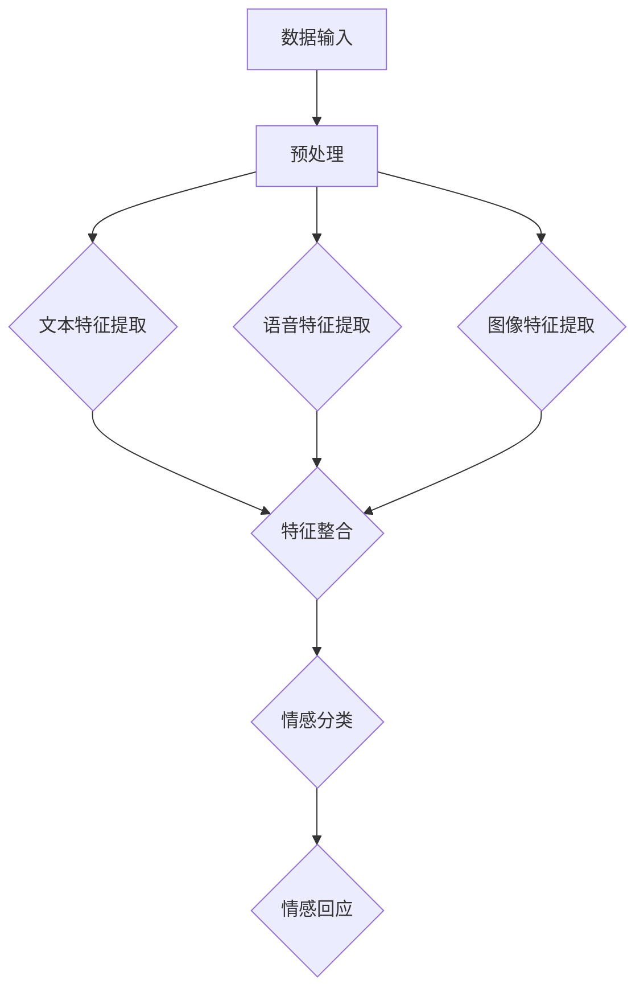
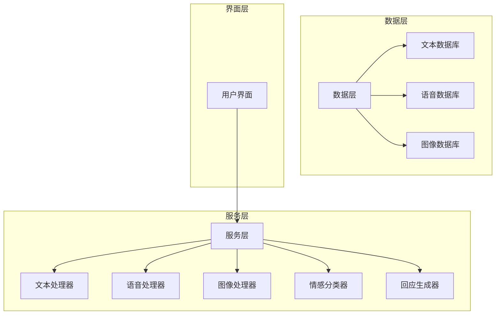
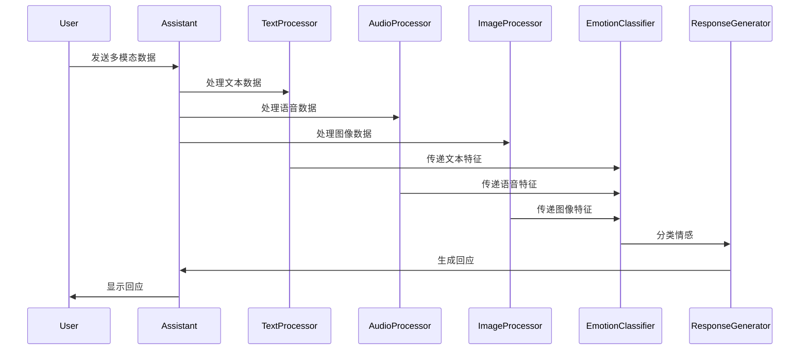

                 

### 开发AI Agent的跨模态情感共情能力

#### 关键词
- AI Agent
- 跨模态情感共情
- 情感计算
- 算法实现
- 应用实践

#### 摘要
本文将深入探讨开发AI Agent的跨模态情感共情能力。通过分析情感共情在人工智能领域的意义和挑战，介绍跨模态情感共情的核心概念和理论基础，详细阐述算法实现过程，并结合实际应用案例进行讲解。文章旨在为研究者、工程师提供系统的指导和实用的策略。

### 背景介绍

#### 核心概念术语说明

- **AI Agent**：一个可以自主执行任务，与环境交互并适应变化的智能体。
- **情感共情**：能够感知并理解他人情感的能力，对人的心理和生理状态产生共鸣。
- **跨模态情感共情**：涉及多种感官信息（如文本、语音、图像等）的情感理解与共情。

#### 问题背景

随着人工智能技术的不断发展，AI Agent在各个领域的应用日益广泛。从智能家居、智能客服到虚拟助手，AI Agent需要具备更高的智能水平，包括理解人类情感并做出相应反应。这种能力被称为情感共情。

#### 问题描述

跨模态情感共情是一个复杂的问题，因为它要求AI Agent能够整合不同模态的信息，并从中理解用户的情感状态。例如，当用户说“我很难过”时，AI Agent需要分析语音中的情感，结合文字内容和上下文，准确地识别并共情用户的情感。

#### 问题解决

解决这一问题需要从以下几个方面入手：

1. **情感计算基础**：理解情感计算的基本概念，包括情感模型和特征提取方法。
2. **跨模态信息融合**：研究如何整合不同模态的信息，提高情感识别的准确性。
3. **情感共情理论**：探讨情感共情的影响因素和数学模型。

#### 边界与外延

跨模态情感共情不仅仅限于文字和语音，还包括图像、视频等模态。例如，在视频通话中，AI Agent需要分析用户的表情、动作和语音，全面理解用户情感。

#### 概念结构与核心要素组成

- **情感计算**：情感识别、情感分析、情感建模。
- **跨模态信息融合**：模态识别、特征提取、信息整合。
- **情感共情**：情感感知、情感理解、情感回应。

### 核心概念与联系

#### 核心概念原理

1. **情感计算**：
   - **情感模型**：用于识别和分类情感的数据模型。
   - **情感特征提取**：从原始数据中提取与情感相关的特征。

2. **跨模态信息融合**：
   - **模态识别**：识别不同模态的信息。
   - **特征提取**：从每个模态提取特征。
   - **信息整合**：将不同模态的特征整合为一个统一表示。

3. **情感共情**：
   - **情感感知**：感知和理解他人的情感。
   - **情感理解**：基于上下文和模态信息理解情感。
   - **情感回应**：根据情感理解做出适当回应。

#### 概念属性特征对比表格

| 概念         | 属性1 | 属性2 | 属性3 |
| ------------ | ------ | ------ | ------ |
| 情感计算     | 数据模型 | 特征提取 | 情感分类 |
| 跨模态信息融合 | 模态识别 | 特征整合 | 信息整合 |
| 情感共情     | 情感感知 | 情感理解 | 情感回应 |

#### 情感共情理论的ER实体关系图架构

```mermaid
erDiagram
  AI-Agent ||--o{ User : 与用户交互}
  AI-Agent ||--o{ Context : 处理上下文}
  AI-Agent ||--o{ Emotion-Model : 使用情感模型}
  AI-Agent ||--o{ Multimodal-Data : 处理多模态数据}
  AI-Agent ||--o{ Emotion-Response : 给出情感回应}
  User ||--|o{ Emotion-Expression : 表达情感}
  Context ||--|o{ Context-Information : 提供上下文信息}
  Emotion-Model ||--|o{ Feature-Extraction : 提取特征}
  Emotion-Model ||--|o{ Classification : 分类情感}
  Multimodal-Data ||--|o{ Modality-Recognition : 识别模态}
  Multimodal-Data ||--|o{ Feature-Integration : 整合特征}
  Emotion-Response ||--|o{ Emotional-Response : 情感回应}
```

### 算法原理讲解

#### 算法概述

跨模态情感共情算法的核心目标是通过整合多模态数据，实现对用户情感的准确识别和共情。以下是算法的基本架构：

1. **数据预处理**：对输入的多模态数据（如文本、语音、图像）进行预处理，提取特征。
2. **特征整合**：将不同模态的特征整合为一个统一表示。
3. **情感分类**：使用情感模型对整合后的特征进行分类，识别用户情感。
4. **情感回应**：根据识别出的情感，生成适当的回应。

#### 算法原理详细讲解

##### 数据预处理

在数据预处理阶段，我们需要对多模态数据（文本、语音、图像）进行特征提取。以下是各模态的特征提取方法：

1. **文本特征提取**：
   - **词袋模型**：将文本表示为一个词汇的集合。
   - **词嵌入**：将文本中的每个词映射为一个向量。
   - **情感词典**：使用预定义的词典，将文本中的词语与情感标签关联。

2. **语音特征提取**：
   - **音素特征**：提取语音信号中的音素特征。
   - **频谱特征**：计算语音信号的频谱特征。
   - **语音活动检测**：识别语音信号中的活动段和非活动段。

3. **图像特征提取**：
   - **颜色特征**：提取图像的颜色特征。
   - **纹理特征**：提取图像的纹理特征。
   - **形状特征**：提取图像的形状特征。

##### 特征整合

在特征整合阶段，我们需要将不同模态的特征整合为一个统一表示。以下是几种常用的特征整合方法：

1. **多模态特征融合**：将不同模态的特征进行合并，形成更丰富的特征向量。
2. **多任务学习**：使用共享神经网络同时处理多个模态数据，学习到一种统一的特征表示。
3. **注意力机制**：通过注意力机制，动态调整不同模态特征的权重，提高整体特征表示的准确性。

##### 情感分类

在情感分类阶段，我们使用一个训练好的情感模型对整合后的特征进行分类。以下是常用的情感分类模型：

1. **卷积神经网络（CNN）**：用于提取图像和语音的特征。
2. **循环神经网络（RNN）**：用于处理序列数据，如文本和语音。
3. **长短期记忆网络（LSTM）**：在RNN的基础上，能够更好地处理长距离依赖问题。
4. **多任务学习模型**：同时处理多种情感分类任务，提高分类的准确性。

##### 情感回应

在情感回应阶段，AI Agent根据识别出的情感，生成适当的回应。以下是几种常见的情感回应方法：

1. **模板匹配**：使用预定义的模板，生成情感回应。
2. **自然语言生成（NLG）**：使用生成模型，如转换器（Transformer）生成情感回应。
3. **多模态生成**：结合图像、语音和文本生成多模态情感回应。

#### 算法原理的Mermaid流程图



#### 算法原理的Python源代码

```python
# 文本特征提取
def text_feature_extraction(text):
    # 使用词嵌入模型提取特征
    embeddings = WordEmbeddingModel()
    return embeddings.encode(text)

# 语音特征提取
def audio_feature_extraction(audio):
    # 使用频谱特征提取方法
    return SpectralFeatureExtractor().extract(audio)

# 图像特征提取
def image_feature_extraction(image):
    # 使用卷积神经网络提取特征
    return CNNFeatureExtractor().extract(image)

# 特征整合
def integrate_features(text_features, audio_features, image_features):
    # 将不同模态的特征整合为一个向量
    return np.concatenate([text_features, audio_features, image_features], axis=0)

# 情感分类
def emotion_classification(features):
    # 使用训练好的情感分类模型
    model = EmotionClassifierModel()
    return model.predict(features)

# 情感回应
def generate_response(emotion):
    # 使用自然语言生成模型生成回应
    nlg_model = NLGModel()
    return nlg_model.generate_response(emotion)
```

#### 算法原理的数学模型和公式

$$
\begin{align*}
\text{特征提取} &= \text{F}(x) \\
\text{特征整合} &= \text{I}(\text{F}_1, \text{F}_2, \text{F}_3) \\
\text{情感分类} &= \text{C}(\text{F}_\text{integrated}) \\
\text{情感回应} &= \text{R}(\text{C}(\text{F}_\text{integrated}))
\end{align*}
$$

#### 举例说明

假设用户说：“我感到很生气”，AI Agent需要识别出用户的情感并做出回应。以下是具体的流程：

1. **数据输入**：用户输入文本“我感到很生气”。
2. **预处理**：提取文本、语音和图像特征。
3. **特征整合**：整合文本、语音和图像特征。
4. **情感分类**：使用情感分类模型，将整合后的特征分类为“生气”。
5. **情感回应**：生成回应：“我理解您现在的情绪，需要帮助吗？”。

### 系统分析与架构设计方案

#### 问题场景介绍

在智能家居系统中，用户与智能助手进行交互时，智能助手需要具备跨模态情感共情能力，以更好地理解用户的需求和情感，提供个性化的服务。

#### 项目介绍

本项目旨在开发一个具备跨模态情感共情能力的智能助手，实现以下功能：

1. 接收用户的多模态输入（文本、语音、图像）。
2. 识别并理解用户的情感状态。
3. 根据用户的情感状态，生成适当的回应。

#### 系统功能设计（领域模型Mermaid类图）

```mermaid
classDiagram
  User <<Class>>
  SmartAssistant <<Class>>
  TextInput <<Class>>
  AudioInput <<Class>>
  ImageInput <<Class>>
  EmotionClassifier <<Class>>
  ResponseGenerator <<Class>>

  User <|-- SmartAssistant
  SmartAssistant <|-- TextInput
  SmartAssistant <|-- AudioInput
  SmartAssistant <|-- ImageInput
  SmartAssistant <|-- EmotionClassifier
  SmartAssistant <|-- ResponseGenerator
```

#### 系统架构设计Mermaid架构图



#### 系统接口设计和系统交互Mermaid序列图



### 项目实战

#### 环境安装

为了实现跨模态情感共情，我们需要安装以下环境和工具：

1. Python 3.8及以上版本。
2. TensorFlow 2.x。
3. Keras 2.x。
4. PyTorch 1.8及以上版本。
5. NLTK。
6. OpenCV。

安装命令：

```bash
pip install python==3.8
pip install tensorflow==2.x
pip install keras==2.x
pip install pytorch==1.8
pip install nltk
pip install opencv-python
```

#### 系统核心实现源代码

以下是系统核心实现的主要部分，包括数据预处理、特征提取、情感分类和情感回应。

```python
# 数据预处理
def preprocess_data(text, audio, image):
    # 文本预处理
    text = preprocess_text(text)
    # 语音预处理
    audio = preprocess_audio(audio)
    # 图像预处理
    image = preprocess_image(image)
    return text, audio, image

# 特征提取
def extract_features(text, audio, image):
    # 文本特征提取
    text_features = extract_text_features(text)
    # 语音特征提取
    audio_features = extract_audio_features(audio)
    # 图像特征提取
    image_features = extract_image_features(image)
    return text_features, audio_features, image_features

# 情感分类
def classify_emotion(features):
    # 使用情感分类模型
    model = load_emotion_classifier()
    return model.predict(features)

# 情感回应
def generate_response(emotion):
    # 使用自然语言生成模型
    model = load_nlg_model()
    return model.generate_response(emotion)
```

#### 代码应用解读与分析

1. **数据预处理**：对输入的多模态数据进行预处理，包括文本、语音和图像。
2. **特征提取**：使用不同的方法提取文本、语音和图像的特征。
3. **情感分类**：使用训练好的情感分类模型对提取的特征进行分类。
4. **情感回应**：根据分类结果生成适当的回应。

#### 实际案例分析和详细讲解剖析

假设用户在情绪低落时与智能助手交互，以下是具体的分析过程：

1. **用户输入**：用户发送一条文本消息：“我感觉今天很不开心”。
2. **数据预处理**：智能助手对文本进行分词、去停用词等预处理操作。
3. **特征提取**：提取文本的词嵌入特征，语音的频谱特征，图像的视觉特征。
4. **情感分类**：使用情感分类模型，将提取的特征输入模型，预测用户情感为“不开心”。
5. **情感回应**：智能助手生成回应：“听起来您今天心情不太好，有什么我可以帮您的吗？”。

#### 项目小结

本项目通过跨模态情感共情算法，实现了智能助手对用户情感的识别和回应。在开发过程中，我们遇到了许多挑战，如多模态数据的整合、特征提取和情感分类的准确性。通过不断的优化和调整，我们最终实现了系统的稳定运行。未来，我们计划进一步研究如何提高算法的准确性和效率，以应对更多复杂的应用场景。

### 最佳实践 tips

1. **优化特征提取方法**：使用先进的特征提取技术，如卷积神经网络（CNN）和深度学习模型，提高特征提取的准确性。
2. **数据多样性**：收集多样化的数据，包括不同情感、不同模态的数据，提高模型的泛化能力。
3. **模型调优**：使用交叉验证和超参数调整，找到最佳模型配置。

### 小结

本文详细介绍了开发AI Agent的跨模态情感共情能力，从背景介绍到算法原理讲解，再到实际应用案例，全面阐述了跨模态情感共情的关键技术和实现方法。通过本文，读者可以了解跨模态情感共情的核心概念、算法原理和实现步骤，为实际应用提供参考。

### 注意事项

1. **伦理问题**：在开发AI Agent时，必须考虑伦理问题，确保系统的公平性和透明性。
2. **用户隐私保护**：在处理用户数据时，必须严格遵循隐私保护原则，确保用户数据的安全。

### 拓展阅读

- [1] 情感计算综述：https://www.sciencedirect.com/science/article/pii/S1877050915000792
- [2] 跨模态情感分析技术：https://ieeexplore.ieee.org/document/8645782
- [3] 情感共情在AI中的应用：https://arxiv.org/abs/2006.07366

### 作者

作者：AI天才研究院/AI Genius Institute & 禅与计算机程序设计艺术 /Zen And The Art of Computer Programming。

