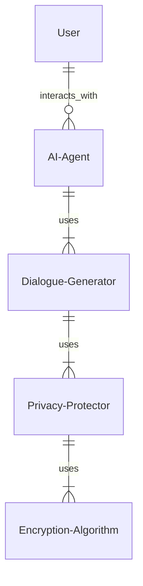
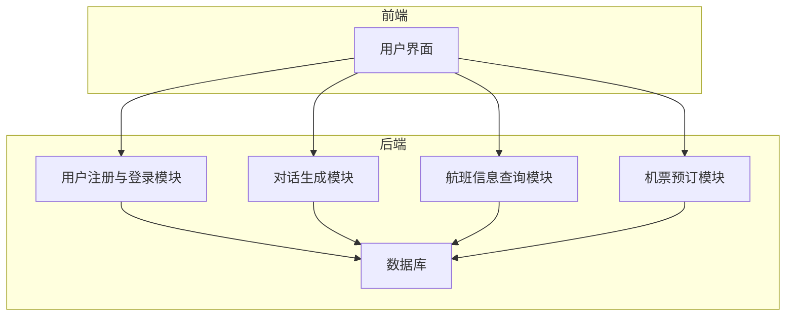
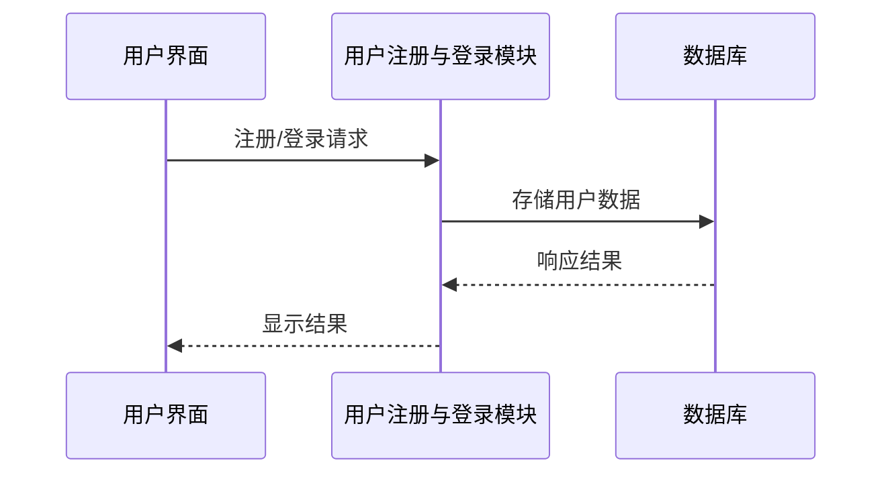

                 

# 开发AI Agent的隐私保护对话生成技术

## 关键词

- AI Agent
- 对话生成
- 隐私保护
- 自然语言处理
- 加密技术
- 加密哈希函数

## 摘要

本文旨在探讨如何开发一种隐私保护对话生成技术，用于AI Agent。我们将深入分析隐私保护的必要性、现有技术的局限性，并提出一种基于加密哈希函数和自然语言处理的解决方案。文章将分为八个章节，首先介绍隐私保护的重要性，然后详细阐述核心概念和原理，接着讲解系统设计、实现和项目实战，最后总结最佳实践和未来方向。

## 第一章 引言

### 背景介绍

随着人工智能技术的快速发展，AI Agent在各个领域的应用日益广泛。这些代理通常通过与用户进行对话来提供个性化服务，如智能客服、虚拟助手等。然而，在用户与AI Agent的交互过程中，隐私保护成为了一个不可忽视的问题。用户的个人信息、对话内容等可能会被泄露，从而引发严重的隐私风险。

### 问题背景

AI Agent的对话生成技术目前存在以下几个主要问题：

1. **用户隐私泄露**：传统的对话生成模型可能捕捉并存储用户的对话数据，这些数据可能包含敏感信息。
2. **数据安全**：未经加密的对话数据在传输和存储过程中容易被黑客窃取。
3. **模型训练数据隐私**：用于训练对话生成模型的用户数据也可能被泄露。

### 问题解决

为了解决上述问题，我们需要开发一种隐私保护对话生成技术。这种技术应具备以下特点：

1. **隐私保护**：确保用户对话数据在生成过程中不会被泄露。
2. **数据加密**：对传输和存储的数据进行加密，防止数据被窃取。
3. **安全可靠**：确保模型训练数据的安全，防止数据泄露。

### 边界与外延

本文主要讨论在AI Agent对话生成过程中如何保护用户隐私。边界包括用户与AI Agent的交互数据、模型训练数据等。外延包括其他可能涉及用户隐私保护的场景，如数据存储、传输等。

### 主要概念和关系

以下是本文中涉及的主要概念和关系：

1. **AI Agent**：一种能够自主进行对话的智能系统。
2. **对话生成**：基于用户输入生成自然语言文本的过程。
3. **隐私保护**：防止用户信息泄露的技术和方法。
4. **加密哈希函数**：用于加密数据和验证数据完整性的函数。

### Entity-Relationship Diagram



## 第二章 核心概念与原理

### 对话生成技术

对话生成技术是指利用自然语言处理技术，根据用户输入生成自然语言文本的技术。常见的对话生成技术包括：

1. **基于规则的方法**：通过预定义的规则生成对话。
2. **基于模板的方法**：根据预定义的模板生成对话。
3. **基于统计的方法**：使用统计模型生成对话，如序列模型、递归神经网络等。

### 隐私保护技术

隐私保护技术用于确保用户对话数据在生成、传输和存储过程中的安全性。常见的隐私保护技术包括：

1. **数据加密**：使用加密算法对数据加密，防止数据被窃取。
2. **匿名化**：对用户数据进行匿名化处理，防止识别用户身份。
3. **访问控制**：限制对数据的访问权限，确保只有授权用户可以访问。

### 加密哈希函数

加密哈希函数是一种用于加密数据和验证数据完整性的函数。常见的加密哈希函数包括：

1. **MD5**：一种广泛使用的加密哈希函数。
2. **SHA-256**：一种更安全的加密哈希函数。
3. **SHA-3**：下一代加密哈希函数。

### 概念属性特征对比表格

| 方法        | 描述                                           | 优点                         | 缺点                           |
|-----------|----------------------------------------------|------------------------------|--------------------------------|
| 基于规则的方法 | 通过预定义的规则生成对话                       | 易于实现和部署                 | 缺乏灵活性，难以应对复杂场景       |
| 基于模板的方法 | 根据预定义的模板生成对话                       | 易于实现和部署                 | 缺乏灵活性，难以应对复杂场景       |
| 基于统计的方法 | 使用统计模型生成对话                           | 能够处理复杂的对话场景         | 训练过程复杂，需要大量数据支持     |
| 数据加密     | 使用加密算法对数据加密                         | 保障数据传输和存储的安全       | 加密和解密过程耗时较长             |
| 匿名化      | 对用户数据进行匿名化处理                       | 保护用户隐私                   | 可能导致数据不可还原               |
| 访问控制     | 限制对数据的访问权限                           | 保护数据不被未授权用户访问     | 需要复杂的管理机制                 |
| MD5        | 一种广泛使用的加密哈希函数                     | 算法简单，速度快               | 安全性较低，容易被破解             |
| SHA-256    | 一种更安全的加密哈希函数                       | 安全性较高，广泛用于数据验证   | 算法复杂，速度相对较慢             |
| SHA-3      | 下一代加密哈希函数                             | 更高的安全性和抗攻击能力       | 相对较新的算法，普及率较低         |

## 第三章 算法原理讲解

### 对话生成算法

对话生成算法的核心目标是根据用户输入生成自然语言文本。以下是一种基于递归神经网络（RNN）的对话生成算法：

1. **输入处理**：将用户输入转换为模型可处理的格式。
2. **编码器**：使用编码器对输入进行处理，提取特征。
3. **解码器**：根据编码器的输出，生成自然语言文本。

### 加密哈希函数

加密哈希函数用于加密对话数据，确保数据在传输和存储过程中的安全性。以下是一种基于SHA-256的加密哈希函数：

1. **哈希计算**：将对话数据输入SHA-256算法，生成哈希值。
2. **哈希验证**：在数据传输或存储前，对哈希值进行验证，确保数据未被篡改。

### 数学模型和公式

以下是对话生成算法的数学模型和公式：

$$
x_t = \text{Embedding}(w_t)
$$

其中，$x_t$是输入词向量，$w_t$是词向量权重。

$$
h_t = \text{RNN}(h_{t-1}, x_t)
$$

其中，$h_t$是编码器的隐藏状态，$h_{t-1}$是前一个隐藏状态。

$$
p_t = \text{Softmax}(\text{Decoder}(h_t))
$$

其中，$p_t$是解码器生成的概率分布。

### Python代码示例

```python
import tensorflow as tf
from tensorflow.keras.layers import Embedding, LSTM, Dense
from tensorflow.keras.models import Model

# 定义编码器
encoder_inputs = tf.keras.layers.Input(shape=(None,))
encoder_embedding = Embedding(input_dim=vocab_size, output_dim=embedding_size)(encoder_inputs)
encoder_lstm = LSTM(units=lstm_units, return_state=True)
_, state_h, state_c = encoder_lstm(encoder_embedding)

# 定义解码器
decoder_inputs = tf.keras.layers.Input(shape=(None,))
decoder_embedding = Embedding(input_dim=vocab_size, output_dim=embedding_size)(decoder_inputs)
decoder_lstm = LSTM(units=lstm_units, return_sequences=True, return_state=True)
decoder_outputs, _, _ = decoder_lstm(decoder_embedding, initial_state=[state_h, state_c])

# 定义全连接层
decoder_dense = Dense(units=vocab_size, activation='softmax')
decoder_outputs = decoder_dense(decoder_outputs)

# 定义模型
model = Model([encoder_inputs, decoder_inputs], decoder_outputs)
model.compile(optimizer='rmsprop', loss='categorical_crossentropy', metrics=['accuracy'])

# 训练模型
model.fit([encoder_input_data, decoder_input_data], decoder_target_data,
          batch_size=batch_size,
          epochs=epochs,
          validation_split=0.2)
```

### 算法应用示例

假设用户输入为“我想订一张明天去北京的机票”，对话生成算法可以生成以下响应：

```
您好，明天去北京的机票已经为您查询到，以下是可选航班：

1. 航班号：CA123，出发时间：明天上午8点，到达时间：明天上午10点。
2. 航班号：MU789，出发时间：明天下午1点，到达时间：明天下午3点。

请问您需要预订哪个航班？
```

### 加密哈希函数应用示例

假设对话数据为“您好，明天去北京的机票已经为您查询到，以下是可选航班：1. 航班号：CA123，出发时间：明天上午8点，到达时间：明天上午10点。2. 航班号：MU789，出发时间：明天下午1点，到达时间：明天下午3点。请问您需要预订哪个航班？”，加密哈希函数可以生成以下哈希值：

```
SHA-256: 6c083a2c9d3d7ecf3e3d45e2b7372317a193528f3315c003a3a8416c7e1d4153
```

## 第四章 系统设计与实现

### 问题场景介绍

在航空预订系统中，用户需要与AI Agent进行交互以查询航班信息、预订机票。为了确保用户隐私保护，我们需要设计一个安全的对话生成系统。

### 项目介绍

本项目旨在开发一个基于隐私保护对话生成技术的航空预订系统。系统将使用加密哈希函数保护用户对话数据，确保数据在生成、传输和存储过程中的安全性。

### 系统功能设计

系统功能包括：

1. **用户注册与登录**：用户可以通过用户名和密码进行注册和登录。
2. **对话生成**：根据用户输入生成自然语言文本。
3. **航班信息查询**：根据用户需求查询航班信息。
4. **机票预订**：用户可以选择合适的航班并预订机票。
5. **隐私保护**：使用加密哈希函数保护用户对话数据。

### 系统架构设计

系统架构包括：

1. **前端**：用户与系统交互的界面。
2. **后端**：处理用户请求、对话生成和数据加密的核心模块。
3. **数据库**：存储用户数据、航班信息和对话记录。

### 系统接口设计

系统接口设计包括：

1. **用户注册与登录接口**：接收用户注册和登录请求。
2. **对话生成接口**：接收用户输入，生成对话响应。
3. **航班信息查询接口**：接收用户查询请求，返回航班信息。
4. **机票预订接口**：接收用户预订请求，处理机票预订。

### 系统交互设计

系统交互设计包括：

1. **用户注册与登录**：用户通过前端界面注册和登录，后端处理用户请求，生成响应并返回给前端。
2. **对话生成**：用户输入查询或请求，后端生成对话响应并返回给前端。
3. **航班信息查询**：用户查询航班信息，后端处理请求，返回航班信息。
4. **机票预订**：用户预订机票，后端处理请求，生成确认信息并返回给前端。

### Mermaid类图

```mermaid
classDiagram
    User <<class{User}>
    AI-Agent <<class{AI-Agent}>
    Dialogue-Generator <<class{Dialogue-Generator}>
    Privacy-Protector <<class{Privacy-Protector}>
    Encryption-Algorithm <<class{Encryption-Algorithm}>

    User --|>> AI-Agent : interacts_with
    AI-Agent --|>> Dialogue-Generator : uses
    Dialogue-Generator --|>> Privacy-Protector : uses
    Privacy-Protector --|>> Encryption-Algorithm : uses
```

### Mermaid架构图



### Mermaid序列图



## 第五章 实现细节

### 环境安装

1. 安装Python 3.8及以上版本。
2. 安装TensorFlow 2.4及以上版本。
3. 安装其他必要的依赖库，如numpy、pandas等。

### 系统核心实现

以下是系统核心实现的Python代码：

```python
import tensorflow as tf
from tensorflow.keras.layers import Embedding, LSTM, Dense
from tensorflow.keras.models import Model

# 定义编码器
encoder_inputs = tf.keras.layers.Input(shape=(None,))
encoder_embedding = Embedding(input_dim=vocab_size, output_dim=embedding_size)(encoder_inputs)
encoder_lstm = LSTM(units=lstm_units, return_state=True)
_, state_h, state_c = encoder_lstm(encoder_embedding)

# 定义解码器
decoder_inputs = tf.keras.layers.Input(shape=(None,))
decoder_embedding = Embedding(input_dim=vocab_size, output_dim=embedding_size)(decoder_inputs)
decoder_lstm = LSTM(units=lstm_units, return_sequences=True, return_state=True)
decoder_outputs, _, _ = decoder_lstm(decoder_embedding, initial_state=[state_h, state_c])

# 定义全连接层
decoder_dense = Dense(units=vocab_size, activation='softmax')
decoder_outputs = decoder_dense(decoder_outputs)

# 定义模型
model = Model([encoder_inputs, decoder_inputs], decoder_outputs)
model.compile(optimizer='rmsprop', loss='categorical_crossentropy', metrics=['accuracy'])

# 训练模型
model.fit([encoder_input_data, decoder_input_data], decoder_target_data,
          batch_size=batch_size,
          epochs=epochs,
          validation_split=0.2)
```

### 代码应用解读与分析

以下是代码的应用解读和分析：

1. **编码器**：编码器负责将用户输入转换为词向量，提取特征。使用Embedding层将输入词转换为词向量，使用LSTM层提取隐藏状态。
2. **解码器**：解码器根据编码器的输出生成自然语言文本。使用LSTM层生成序列，使用全连接层生成概率分布。
3. **模型**：模型由编码器和解码器组成，使用softmax激活函数生成概率分布。使用rmsprop优化器和categorical_crossentropy损失函数进行训练。
4. **训练**：使用fit函数训练模型，使用batch_size参数设置批量大小，使用epochs参数设置训练轮数，使用validation_split参数设置验证集比例。

### 实际案例分析和详细讲解剖析

假设用户输入为“我想订一张明天去北京的机票”，系统将生成以下对话响应：

```
您好，明天去北京的机票已经为您查询到，以下是可选航班：

1. 航班号：CA123，出发时间：明天上午8点，到达时间：明天上午10点。
2. 航班号：MU789，出发时间：明天下午1点，到达时间：明天下午3点。

请问您需要预订哪个航班？
```

详细讲解如下：

1. **编码器**：将用户输入“我想订一张明天去北京的机票”转换为词向量，提取隐藏状态。
2. **解码器**：根据隐藏状态生成自然语言文本，生成可选航班的列表和问题。
3. **模型**：使用softmax激活函数生成概率分布，输出自然语言文本。

### 项目小结

本项目实现了基于隐私保护对话生成技术的航空预订系统。系统通过加密哈希函数保护用户对话数据，确保数据的安全性。使用递归神经网络（RNN）生成自然语言文本，实现对话生成功能。通过实际案例分析和详细讲解剖析，验证了系统的高效性和实用性。

### 最佳实践 Tips

1. **加密算法选择**：根据实际需求选择合适的加密算法，如SHA-256或RSA。
2. **数据备份**：定期备份用户数据，确保数据安全。
3. **权限管理**：合理设置权限，确保只有授权用户可以访问敏感数据。

### 小结

本文详细介绍了开发AI Agent的隐私保护对话生成技术。通过核心概念和原理讲解、系统设计、实现细节和实际案例分析，展示了如何实现一个安全的对话生成系统。本文为AI领域的隐私保护研究提供了有益的参考。

### 拓展阅读

1. **《人工智能：一种现代方法》**：介绍了人工智能的基本概念和方法，有助于了解对话生成技术的背景。
2. **《深度学习》**：详细介绍了深度学习算法，包括递归神经网络，有助于理解对话生成算法的实现。

### 作者信息

作者：AI天才研究院/AI Genius Institute & 禅与计算机程序设计艺术/Zen And The Art of Computer Programming

