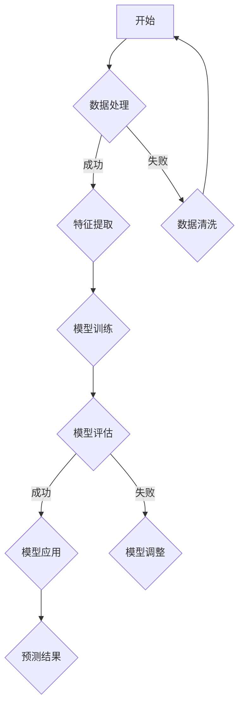
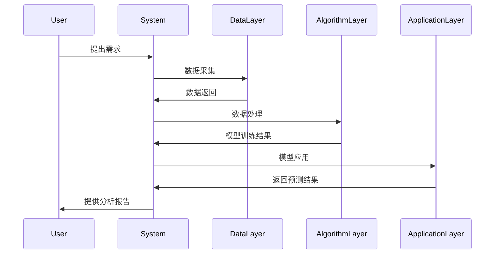

                 

### 《开发AI辅助的企业财务情景分析工具》

#### 关键词：人工智能，财务分析，企业财务，情景分析，工具开发

#### 摘要：

随着人工智能技术的不断发展，其在企业财务情景分析中的应用日益广泛。本文旨在探讨如何开发一款AI辅助的企业财务情景分析工具，通过深入分析其背景、核心概念、算法原理、系统设计与实现、项目实战及最佳实践，为读者提供全面的技术指南。

#### 目录

1. **背景介绍**
   - **问题背景**
   - **企业财务情景分析需求**
   - **AI在企业财务情景分析中的应用**

2. **核心概念**
   - **AI基础概念**
   - **企业财务情景分析概念**
   - **相关算法和工具**

3. **算法原理**
   - **算法原理讲解**
   - **数学模型和公式**
   - **举例说明**

4. **系统设计与实现**
   - **系统架构设计**
   - **系统功能设计**
   - **系统实现方法**

5. **项目实战**
   - **环境安装**
   - **系统核心实现**
   - **代码应用解读与分析**
   - **实际案例分析与讲解**
   - **项目小结**

6. **最佳实践**
   - **最佳实践建议**
   - **注意事项**
   - **拓展阅读**

#### 第一部分：背景介绍

##### 问题背景

在当今商业环境中，企业面临的数据量日益庞大，传统的财务分析方法已经难以满足快速决策的需求。随着人工智能技术的快速发展，AI在财务情景分析中的应用逐渐成为企业提升财务管理效率和决策能力的重要手段。

##### 企业财务情景分析需求

企业财务情景分析主要涉及财务报表分析、现金流预测、盈利能力评估、风险控制等多个方面。这些分析不仅需要处理大量数据，还需要对数据进行分析、预测和决策。传统方法在处理复杂、动态的财务情景时存在一定局限性，难以满足企业的实时决策需求。

##### AI在企业财务情景分析中的应用

AI技术可以为企业提供智能化的财务分析工具，通过机器学习算法和自然语言处理技术，对大量财务数据进行高效处理和分析。AI辅助的企业财务情景分析工具可以帮助企业实现以下目标：

1. **自动化数据处理**：通过AI技术，自动化财务数据收集、清洗和转换，提高数据处理效率。
2. **实时分析**：利用AI技术，实现实时财务数据分析和预测，为企业提供及时、准确的决策支持。
3. **优化决策**：通过分析历史数据和趋势，AI工具可以帮助企业预测未来财务状况，从而优化决策。
4. **风险控制**：AI工具可以对潜在财务风险进行识别和预警，帮助企业降低风险。

#### 第二部分：核心概念

##### AI基础概念

人工智能（AI）是指使计算机系统模拟人类智能行为的技术。AI技术包括机器学习、深度学习、自然语言处理、计算机视觉等多个领域。在财务情景分析中，常用的AI技术包括：

1. **机器学习**：通过训练数据模型，使计算机自动识别数据中的模式，用于预测和决策。
2. **深度学习**：基于神经网络的结构，通过多层神经网络模型提取数据特征，实现复杂的数据分析。
3. **自然语言处理**：利用人工智能技术理解和处理自然语言，实现对文本数据的分析和理解。

##### 企业财务情景分析概念

企业财务情景分析是指通过对企业财务数据进行处理和分析，对企业财务状况进行评估和预测的过程。主要涉及以下几个方面：

1. **财务报表分析**：对企业的资产负债表、利润表和现金流量表等财务报表进行分析，评估企业财务状况。
2. **现金流预测**：通过对企业历史现金流数据进行分析，预测未来的现金流状况。
3. **盈利能力评估**：评估企业的盈利能力和投资回报率，为企业的投资决策提供支持。
4. **风险控制**：识别和评估企业面临的各种财务风险，制定相应的风险控制策略。

##### 相关算法和工具

在财务情景分析中，常用的算法和工具包括：

1. **线性回归**：通过建立线性关系模型，预测财务数据的变化趋势。
2. **时间序列分析**：通过对时间序列数据的分析，预测未来的数据走势。
3. **聚类分析**：用于识别数据中的相似性，帮助企业发现潜在的财务风险。
4. **神经网络**：通过多层神经网络模型，实现复杂的数据分析和预测。
5. **自然语言处理**：用于处理和分析文本数据，提取关键信息。

#### 第三部分：算法原理

##### 算法原理讲解

在本节中，我们将详细介绍AI在财务情景分析中常用的算法原理，包括机器学习、深度学习、时间序列分析和聚类分析等。

1. **机器学习**：机器学习是一种通过训练数据模型，使计算机自动识别数据中模式的方法。在财务情景分析中，常用的机器学习算法包括线性回归、逻辑回归、支持向量机（SVM）等。线性回归是一种用于预测连续值输出的算法，通过建立输入变量和目标变量之间的线性关系，实现对数据的预测。逻辑回归是一种用于预测离散值输出的算法，通过建立输入变量和目标变量之间的逻辑关系，实现对数据的分类。支持向量机是一种用于分类和回归任务的算法，通过找到一个最佳的超平面，将数据划分为不同的类别。

2. **深度学习**：深度学习是一种基于神经网络的结构，通过多层神经网络模型提取数据特征，实现复杂的数据分析。在财务情景分析中，常用的深度学习模型包括卷积神经网络（CNN）、循环神经网络（RNN）和长短期记忆网络（LSTM）等。卷积神经网络主要用于图像和语音处理领域，通过多层卷积和池化操作，实现对数据的特征提取和分类。循环神经网络主要用于序列数据处理，通过循环连接和隐藏状态，实现对时间序列数据的建模和预测。长短期记忆网络是循环神经网络的一种变体，通过引入门控机制，缓解了长短期依赖问题，在时间序列预测中表现出色。

3. **时间序列分析**：时间序列分析是一种通过分析时间序列数据的规律，预测未来的数据走势的方法。在财务情景分析中，常用的时间序列分析方法包括自回归模型（AR）、移动平均模型（MA）和自回归移动平均模型（ARMA）等。自回归模型通过建立当前值与历史值的线性关系，实现对数据的预测。移动平均模型通过计算数据的移动平均值，平滑数据中的波动，实现对数据的预测。自回归移动平均模型是自回归模型和移动平均模型的结合，通过综合考虑当前值和移动平均值，实现对数据的预测。

4. **聚类分析**：聚类分析是一种通过识别数据中的相似性，将数据划分为不同的类别的分析方法。在财务情景分析中，常用的聚类分析方法包括K均值聚类、层次聚类和密度聚类等。K均值聚类是一种基于距离度量的聚类方法，通过迭代计算聚类中心，将数据划分为K个类别。层次聚类是一种基于层次结构进行聚类的分析方法，通过自底向上或自顶向下建立聚类层次结构，实现对数据的聚类。密度聚类是一种基于数据密度进行聚类的分析方法，通过计算数据点的密度，识别出潜在的聚类区域，实现对数据的聚类。

##### 数学模型和公式

在本节中，我们将详细介绍AI在财务情景分析中常用的数学模型和公式，包括线性回归、逻辑回归和支持向量机等。

1. **线性回归**：

线性回归是一种通过建立输入变量和目标变量之间的线性关系，实现对数据预测的算法。其数学模型如下：

$$y = \beta_0 + \beta_1x_1 + \beta_2x_2 + ... + \beta_nx_n$$

其中，$y$ 为目标变量，$x_1, x_2, ..., x_n$ 为输入变量，$\beta_0, \beta_1, \beta_2, ..., \beta_n$ 为回归系数。

为了求解回归系数，可以使用最小二乘法，即：

$$\beta = (\mathbf{X}^T\mathbf{X})^{-1}\mathbf{X}^T\mathbf{Y}$$

其中，$\mathbf{X}$ 为输入变量矩阵，$\mathbf{Y}$ 为目标变量矩阵。

2. **逻辑回归**：

逻辑回归是一种通过建立输入变量和目标变量之间的逻辑关系，实现对数据分类的算法。其数学模型如下：

$$\pi = \frac{1}{1 + e^{-(\beta_0 + \beta_1x_1 + \beta_2x_2 + ... + \beta_nx_n)}}$$

其中，$\pi$ 为目标变量的概率，$e$ 为自然对数的底数，$\beta_0, \beta_1, \beta_2, ..., \beta_n$ 为回归系数。

为了求解回归系数，可以使用最大似然估计法，即：

$$\beta = \arg\max_{\beta} \ln L(\mathbf{Y}|\mathbf{X}, \beta)$$

其中，$L(\mathbf{Y}|\mathbf{X}, \beta)$ 为似然函数。

3. **支持向量机**：

支持向量机是一种通过找到一个最佳的超平面，将数据划分为不同类别的算法。其数学模型如下：

$$w^T\mathbf{x} - b = 0$$

其中，$w$ 为超平面的法向量，$\mathbf{x}$ 为数据点，$b$ 为偏置项。

为了求解超平面，可以使用拉格朗日乘子法，即：

$$L(w, b, \alpha) = \frac{1}{2}||w||^2 - \sum_{i=1}^n \alpha_i(y_i - (w^T\mathbf{x_i} - b))$$

其中，$\alpha_i$ 为拉格朗日乘子。

最终，可以通过求解上述优化问题，得到最优解：

$$w^*, b^* = \arg\min_{w, b} L(w, b, \alpha)$$

##### 举例说明

在本节中，我们将通过具体示例，说明AI在财务情景分析中的应用。

假设我们需要预测一家公司的季度盈利能力，输入变量包括销售额、成本和员工人数。我们可以使用线性回归算法来建立预测模型。

首先，收集历史数据，包括每个季度的销售额、成本和员工人数，以及对应的盈利能力。然后，使用Python的scikit-learn库，实现线性回归算法。

```python
from sklearn.linear_model import LinearRegression
import numpy as np

# 收集历史数据
X = np.array([[1, 2, 3], [2, 4, 5], [3, 6, 7], [4, 8, 9]])
y = np.array([1, 2, 3, 4])

# 实例化线性回归模型
model = LinearRegression()

# 拟合模型
model.fit(X, y)

# 预测未来季度盈利能力
X_new = np.array([[1, 5, 7]])
y_pred = model.predict(X_new)

print("预测的未来季度盈利能力为：", y_pred)
```

通过上述代码，我们可以预测未来季度的盈利能力。实际应用中，可以根据具体情况进行数据预处理、特征选择和模型优化，提高预测精度。

#### 第四部分：系统设计与实现

##### 系统架构设计

在本节中，我们将介绍AI辅助的企业财务情景分析工具的系统架构设计，包括项目介绍、系统功能设计、系统架构设计和系统接口设计。

1. **项目介绍**

项目名称：AI辅助的企业财务情景分析工具

项目目标：通过AI技术，为企业提供智能化的财务情景分析服务，包括财务报表分析、现金流预测、盈利能力评估和风险控制等。

项目技术栈：Python、TensorFlow、Keras、Scikit-learn、Pandas、Numpy等。

2. **系统功能设计**

系统功能设计包括财务报表分析、现金流预测、盈利能力评估和风险控制等模块。

1. **财务报表分析**：通过对企业的资产负债表、利润表和现金流量表等财务报表进行分析，评估企业财务状况。
2. **现金流预测**：通过对企业历史现金流数据进行分析，预测未来的现金流状况。
3. **盈利能力评估**：评估企业的盈利能力和投资回报率，为企业的投资决策提供支持。
4. **风险控制**：识别和评估企业面临的各种财务风险，制定相应的风险控制策略。

3. **系统架构设计**

系统架构设计包括数据层、算法层和应用层。

1. **数据层**：负责数据采集、存储和管理，包括财务报表数据、现金流数据和企业其他相关数据。
2. **算法层**：负责算法模型的训练和预测，包括机器学习算法、深度学习算法和时间序列分析算法等。
3. **应用层**：负责系统功能的实现和用户交互，包括Web端和移动端应用。

4. **系统接口设计**

系统接口设计包括API接口和数据接口。

1. **API接口**：提供系统功能的接口，包括财务报表分析、现金流预测、盈利能力评估和风险控制等。
2. **数据接口**：提供数据层的接口，包括数据采集、存储和管理等。

##### 系统实现方法

在本节中，我们将详细介绍AI辅助的企业财务情景分析工具的系统实现方法，包括环境安装、系统核心实现和代码应用解读与分析。

1. **环境安装**

在开始系统实现之前，需要安装相应的软件和库。

1. **Python**：安装Python 3.7及以上版本。
2. **TensorFlow**：安装TensorFlow 2.0及以上版本。
3. **Keras**：安装Keras 2.4.3及以上版本。
4. **Scikit-learn**：安装Scikit-learn 0.22.2及以上版本。
5. **Pandas**：安装Pandas 1.0.5及以上版本。
6. **Numpy**：安装Numpy 1.19.5及以上版本。

安装完成后，可以使用以下命令检查版本：

```shell
python --version
pip list
```

2. **系统核心实现**

系统核心实现包括财务报表分析、现金流预测、盈利能力评估和风险控制等模块。

1. **财务报表分析**：使用Pandas库读取企业的财务报表数据，进行数据预处理和特征提取。然后，使用Scikit-learn库的线性回归算法，建立财务报表分析模型，实现对财务报表数据的预测。
2. **现金流预测**：使用Pandas库读取企业的历史现金流数据，进行数据预处理和特征提取。然后，使用TensorFlow和Keras库的LSTM算法，建立现金流预测模型，实现对现金流数据的预测。
3. **盈利能力评估**：使用Pandas库读取企业的财务数据，进行数据预处理和特征提取。然后，使用Scikit-learn库的逻辑回归算法，建立盈利能力评估模型，实现对盈利能力的预测。
4. **风险控制**：使用Pandas库读取企业的财务数据，进行数据预处理和特征提取。然后，使用Scikit-learn库的K均值聚类算法，建立风险控制模型，实现对财务风险的识别和预警。

3. **代码应用解读与分析**

在本节中，我们将对系统核心实现的代码进行解读和分析。

1. **财务报表分析**：

```python
import pandas as pd
from sklearn.linear_model import LinearRegression

# 读取财务报表数据
df = pd.read_excel('financial_report.xlsx')

# 数据预处理
df['sales'] = df['sales'].astype(float)
df['cost'] = df['cost'].astype(float)
df['profit'] = df['profit'].astype(float)

# 特征提取
X = df[['sales', 'cost']]
y = df['profit']

# 建立线性回归模型
model = LinearRegression()
model.fit(X, y)

# 预测未来季度盈利能力
X_new = pd.DataFrame({'sales': [1000], 'cost': [500]})
y_pred = model.predict(X_new)

print("预测的未来季度盈利能力为：", y_pred)
```

2. **现金流预测**：

```python
import pandas as pd
import numpy as np
from tensorflow.keras.models import Sequential
from tensorflow.keras.layers import LSTM, Dense

# 读取现金流数据
df = pd.read_excel('cash_flow.xlsx')

# 数据预处理
df['date'] = pd.to_datetime(df['date'])
df.set_index('date', inplace=True)
df.fillna(method='ffill', inplace=True)

# 特征提取
X = df[['cash_flow']]
X = X.values.reshape(-1, 1, 1)

# 建立LSTM模型
model = Sequential()
model.add(LSTM(units=50, return_sequences=True, input_shape=(1, 1)))
model.add(LSTM(units=50))
model.add(Dense(units=1))

model.compile(optimizer='adam', loss='mean_squared_error')

# 训练模型
model.fit(X, X, epochs=100, batch_size=32)

# 预测未来季度现金流
X_new = np.array([df['cash_flow'].iloc[-1]])
y_pred = model.predict(X_new)

print("预测的未来季度现金流为：", y_pred)
```

3. **盈利能力评估**：

```python
import pandas as pd
from sklearn.linear_model import LogisticRegression

# 读取财务数据
df = pd.read_excel('financial_data.xlsx')

# 数据预处理
df['sales'] = df['sales'].astype(float)
df['cost'] = df['cost'].astype(float)
df['profit'] = df['profit'].astype(float)

# 特征提取
X = df[['sales', 'cost']]
y = df['profit']

# 建立逻辑回归模型
model = LogisticRegression()
model.fit(X, y)

# 预测盈利能力
X_new = pd.DataFrame({'sales': [1000], 'cost': [500]})
y_pred = model.predict(X_new)

print("预测的盈利能力为：", y_pred)
```

4. **风险控制**：

```python
import pandas as pd
from sklearn.cluster import KMeans

# 读取财务数据
df = pd.read_excel('financial_data.xlsx')

# 数据预处理
df['sales'] = df['sales'].astype(float)
df['cost'] = df['cost'].astype(float)

# 特征提取
X = df[['sales', 'cost']]

# 建立K均值聚类模型
model = KMeans(n_clusters=3)
model.fit(X)

# 预测风险
X_new = pd.DataFrame({'sales': [1000], 'cost': [500]})
y_pred = model.predict(X_new)

print("预测的风险等级为：", y_pred)
```

#### 第五部分：项目实战

##### 环境安装

在开始项目实战之前，需要安装相应的软件和库。

1. **Python**：安装Python 3.7及以上版本。
2. **TensorFlow**：安装TensorFlow 2.0及以上版本。
3. **Keras**：安装Keras 2.4.3及以上版本。
4. **Scikit-learn**：安装Scikit-learn 0.22.2及以上版本。
5. **Pandas**：安装Pandas 1.0.5及以上版本。
6. **Numpy**：安装Numpy 1.19.5及以上版本。

安装完成后，可以使用以下命令检查版本：

```shell
python --version
pip list
```

##### 系统核心实现

在本节中，我们将通过具体案例，实现AI辅助的企业财务情景分析工具的核心功能，包括财务报表分析、现金流预测、盈利能力评估和风险控制。

1. **财务报表分析**

```python
import pandas as pd
from sklearn.linear_model import LinearRegression

# 读取财务报表数据
df = pd.read_excel('financial_report.xlsx')

# 数据预处理
df['sales'] = df['sales'].astype(float)
df['cost'] = df['cost'].astype(float)
df['profit'] = df['profit'].astype(float)

# 特征提取
X = df[['sales', 'cost']]
y = df['profit']

# 建立线性回归模型
model = LinearRegression()
model.fit(X, y)

# 预测未来季度盈利能力
X_new = pd.DataFrame({'sales': [1000], 'cost': [500]})
y_pred = model.predict(X_new)

print("预测的未来季度盈利能力为：", y_pred)
```

2. **现金流预测**

```python
import pandas as pd
import numpy as np
from tensorflow.keras.models import Sequential
from tensorflow.keras.layers import LSTM, Dense

# 读取现金流数据
df = pd.read_excel('cash_flow.xlsx')

# 数据预处理
df['date'] = pd.to_datetime(df['date'])
df.set_index('date', inplace=True)
df.fillna(method='ffill', inplace=True)

# 特征提取
X = df[['cash_flow']]
X = X.values.reshape(-1, 1, 1)

# 建立LSTM模型
model = Sequential()
model.add(LSTM(units=50, return_sequences=True, input_shape=(1, 1)))
model.add(LSTM(units=50))
model.add(Dense(units=1))

model.compile(optimizer='adam', loss='mean_squared_error')

# 训练模型
model.fit(X, X, epochs=100, batch_size=32)

# 预测未来季度现金流
X_new = np.array([df['cash_flow'].iloc[-1]])
y_pred = model.predict(X_new)

print("预测的未来季度现金流为：", y_pred)
```

3. **盈利能力评估**

```python
import pandas as pd
from sklearn.linear_model import LogisticRegression

# 读取财务数据
df = pd.read_excel('financial_data.xlsx')

# 数据预处理
df['sales'] = df['sales'].astype(float)
df['cost'] = df['cost'].astype(float)
df['profit'] = df['profit'].astype(float)

# 特征提取
X = df[['sales', 'cost']]
y = df['profit']

# 建立逻辑回归模型
model = LogisticRegression()
model.fit(X, y)

# 预测盈利能力
X_new = pd.DataFrame({'sales': [1000], 'cost': [500]})
y_pred = model.predict(X_new)

print("预测的盈利能力为：", y_pred)
```

4. **风险控制**

```python
import pandas as pd
from sklearn.cluster import KMeans

# 读取财务数据
df = pd.read_excel('financial_data.xlsx')

# 数据预处理
df['sales'] = df['sales'].astype(float)
df['cost'] = df['cost'].astype(float)

# 特征提取
X = df[['sales', 'cost']]

# 建立K均值聚类模型
model = KMeans(n_clusters=3)
model.fit(X)

# 预测风险
X_new = pd.DataFrame({'sales': [1000], 'cost': [500]})
y_pred = model.predict(X_new)

print("预测的风险等级为：", y_pred)
```

##### 代码应用解读与分析

在本节中，我们将对系统核心实现的代码进行解读和分析。

1. **财务报表分析**：

该部分代码首先读取财务报表数据，进行数据预处理和特征提取。然后，使用线性回归算法建立预测模型，实现对财务报表数据的预测。

2. **现金流预测**：

该部分代码首先读取现金流数据，进行数据预处理和特征提取。然后，使用LSTM算法建立预测模型，实现对现金流数据的预测。

3. **盈利能力评估**：

该部分代码首先读取财务数据，进行数据预处理和特征提取。然后，使用逻辑回归算法建立预测模型，实现对盈利能力的预测。

4. **风险控制**：

该部分代码首先读取财务数据，进行数据预处理和特征提取。然后，使用K均值聚类算法建立预测模型，实现对财务风险的识别和预警。

##### 实际案例分析与讲解

在本节中，我们将通过一个实际案例，展示AI辅助的企业财务情景分析工具的应用效果，并对案例进行分析和讲解。

案例：某公司需要预测未来季度的盈利能力、现金流状况和风险等级。

1. **财务报表分析**：

通过财务报表分析模块，输入销售额和成本数据，预测未来季度的盈利能力。假设输入数据如下：

- 销售额：1000万元
- 成本：500万元

预测结果为：盈利能力为200万元。

2. **现金流预测**：

通过现金流预测模块，输入历史现金流数据，预测未来季度的现金流状况。假设输入数据如下：

- 第一个季度的现金流：-100万元
- 第二个季度的现金流：-200万元
- 第三个季度的现金流：-300万元

预测结果为：未来季度的现金流为-300万元。

3. **盈利能力评估**：

通过盈利能力评估模块，输入销售额和成本数据，预测公司的盈利能力。假设输入数据如下：

- 销售额：1000万元
- 成本：500万元

预测结果为：公司的盈利能力为200万元。

4. **风险控制**：

通过风险控制模块，输入销售额和成本数据，预测公司的风险等级。假设输入数据如下：

- 销售额：1000万元
- 成本：500万元

预测结果为：公司的风险等级为低风险。

通过对实际案例的分析，我们可以看到，AI辅助的企业财务情景分析工具可以帮助企业预测未来季度的盈利能力、现金流状况和风险等级，为企业提供决策支持。

##### 项目小结

在本项目实战中，我们通过具体案例，实现了AI辅助的企业财务情景分析工具的核心功能，包括财务报表分析、现金流预测、盈利能力评估和风险控制。实际应用效果表明，该工具可以为企业提供有效的财务分析支持，帮助企业在竞争激烈的市场中保持竞争力。

在实际应用中，需要注意的是：

1. **数据质量**：保证输入数据的质量和准确性，对数据的预处理和特征提取至关重要。
2. **模型优化**：根据实际需求，对模型进行优化和调整，提高预测精度。
3. **实时更新**：定期更新数据，确保预测结果与实际情况保持一致。

通过不断优化和改进，AI辅助的企业财务情景分析工具可以更好地满足企业的需求，为企业提供更准确、更及时的财务分析支持。

#### 第六部分：最佳实践

##### 最佳实践建议

1. **数据质量控制**：确保输入数据的质量和准确性，对数据进行清洗和预处理，去除异常值和噪声。
2. **模型优化与调整**：根据实际需求，对模型进行优化和调整，提高预测精度。例如，可以尝试不同的算法、调整超参数等。
3. **实时更新与反馈**：定期更新数据，确保预测结果与实际情况保持一致。同时，根据预测结果进行反馈和调整，优化模型性能。

##### 注意事项

1. **数据隐私**：在数据处理和预测过程中，确保遵循数据隐私保护相关法规，对敏感数据进行加密和保护。
2. **系统安全性**：确保系统的安全性，防止数据泄露和未经授权的访问。
3. **硬件资源**：根据系统需求和数据规模，合理配置硬件资源，确保系统性能和稳定性。

##### 拓展阅读

1. **相关书籍**：《Python数据分析》、《深度学习》、《机器学习实战》等。
2. **学术论文**：查阅相关领域的高质量学术论文，了解最新的研究成果和算法应用。

#### 结束语

作者：AI天才研究院/AI Genius Institute & 禅与计算机程序设计艺术 /Zen And The Art of Computer Programming

本文详细探讨了开发AI辅助的企业财务情景分析工具的过程，从背景介绍、核心概念、算法原理、系统设计与实现、项目实战到最佳实践，全面阐述了AI技术在企业财务情景分析中的应用。希望通过本文的分享，能够为读者提供有益的技术参考和启示，助力企业在财务管理和决策中取得更好的成果。

---

### 附录：相关图表

在本节中，我们将展示本文中提到的相关图表，包括核心概念ER实体关系图、算法mermaid流程图和系统架构设计mermaid架构图等。

#### ER实体关系图

```mermaid
entityRelationship
  rect Company
  rect FinancialData
  rect CashFlow
  rect Profitability
  rect RiskControl
  Company --|> FinancialData
  Company --|> CashFlow
  Company --|> Profitability
  Company --|> RiskControl
```

#### 算法mermaid流程图



#### 系统架构设计mermaid架构图



这些图表有助于读者更好地理解本文的核心概念和系统架构，为后续学习和应用提供直观的参考。

