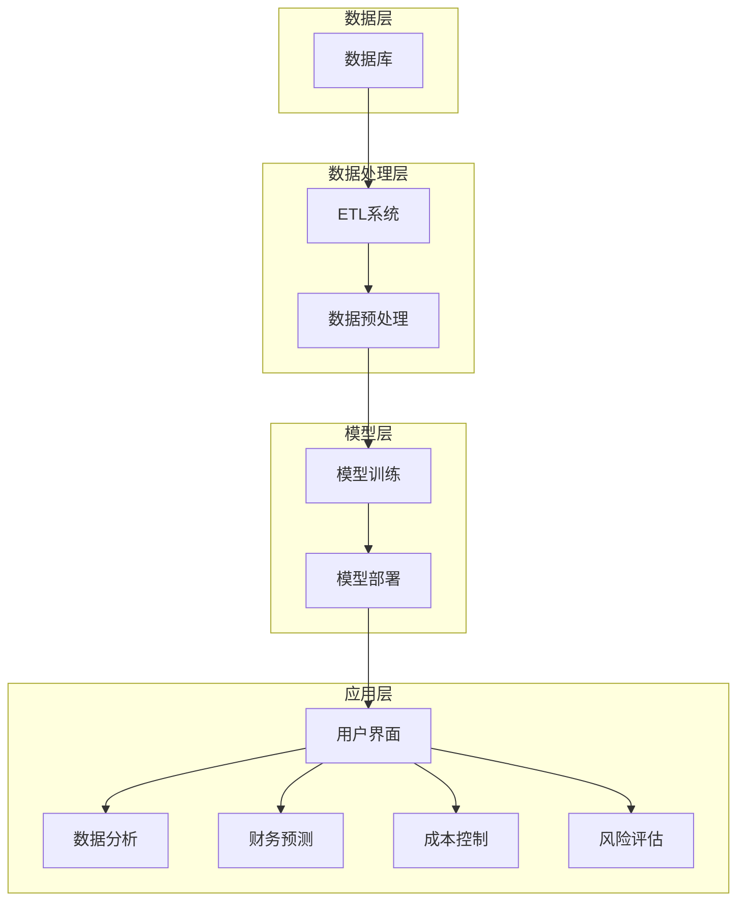
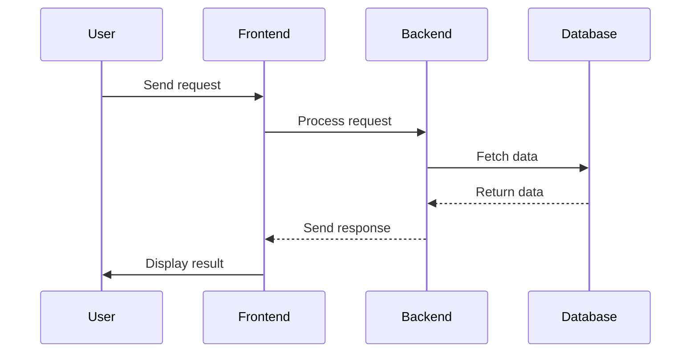

                 

### 引言

#### 1.1 问题背景

随着人工智能（AI）技术的飞速发展，企业财务战略规划正逐渐从传统的人工分析转向智能化辅助工具。AI辅助的企业财务战略规划工具不仅能够提高财务数据的处理效率，还能为企业提供更为精准的战略决策支持。在这个数字化时代，企业需要快速响应市场变化，及时调整战略以保持竞争优势。因此，如何有效地开发AI辅助的企业财务战略规划工具，实现人工智能在财务战略规划中的实际应用，成为当前企业面临的重要课题。

#### 1.2 问题描述

开发AI辅助的企业财务战略规划工具涉及多个方面的挑战，包括数据收集与处理、算法选择与优化、工具实现与应用等。首先，数据收集与处理是开发AI工具的基础，企业需要收集大量高质量的财务数据，并对这些数据进行清洗、处理和分析，为AI模型提供可靠的数据支持。其次，算法选择与优化是关键，企业需要根据自身需求和数据特点选择合适的算法，并通过优化算法以提高模型的准确性和效率。最后，工具实现与应用是关键，企业需要将AI算法应用于实际业务场景，开发出能够为企业提供有效决策支持的智能工具。

#### 1.3 问题解决

本书旨在通过系统的方法和实战案例，帮助企业开发AI辅助的企业财务战略规划工具。我们将从以下几个方面进行探讨：

1. **核心概念介绍**：阐述AI、机器学习、深度学习等相关概念，并介绍其在财务战略规划中的应用。
2. **数据收集与处理**：介绍如何收集、清洗、处理和分析财务数据，为AI模型提供高质量的数据支持。
3. **算法选择与优化**：分析多种机器学习算法在财务战略规划中的应用，探讨如何根据企业需求选择和优化算法。
4. **工具实现与应用**：介绍如何将AI算法应用于企业财务战略规划，实现智能决策支持工具的开发。
5. **实战案例分析**：通过实际案例，展示AI辅助的企业财务战略规划工具的开发和应用过程。

#### 1.4 边界与外延

本书主要关注AI辅助的企业财务战略规划工具的开发，不包括其他领域的人工智能应用。同时，本书将介绍通用性的开发方法和实践，不涉及特定企业或行业的具体财务战略规划。

#### 1.5 概念结构与核心要素组成

1. **AI与机器学习**：介绍AI的基本原理，机器学习的方法和算法。
2. **财务数据**：介绍财务数据的类型、来源和处理方法。
3. **算法选择与优化**：分析不同算法的特点和适用场景，介绍算法优化的方法。
4. **工具实现**：介绍如何将算法应用于企业财务战略规划，实现智能决策支持工具。
5. **实战案例**：通过实际案例，展示AI辅助的企业财务战略规划工具的开发和应用。

### 第1章 引言

#### 1.1 问题背景

随着人工智能（AI）技术的飞速发展，企业财务战略规划正逐渐从传统的人工分析转向智能化辅助工具。AI辅助的企业财务战略规划工具不仅能够提高财务数据的处理效率，还能为企业提供更为精准的战略决策支持。在这个数字化时代，企业需要快速响应市场变化，及时调整战略以保持竞争优势。因此，如何有效地开发AI辅助的企业财务战略规划工具，实现人工智能在财务战略规划中的实际应用，成为当前企业面临的重要课题。

#### 1.2 问题描述

开发AI辅助的企业财务战略规划工具涉及多个方面的挑战，包括数据收集与处理、算法选择与优化、工具实现与应用等。首先，数据收集与处理是开发AI工具的基础，企业需要收集大量高质量的财务数据，并对这些数据进行清洗、处理和分析，为AI模型提供可靠的数据支持。其次，算法选择与优化是关键，企业需要根据自身需求和数据特点选择合适的算法，并通过优化算法以提高模型的准确性和效率。最后，工具实现与应用是关键，企业需要将AI算法应用于实际业务场景，开发出能够为企业提供有效决策支持的智能工具。

#### 1.3 问题解决

本书旨在通过系统的方法和实战案例，帮助企业开发AI辅助的企业财务战略规划工具。我们将从以下几个方面进行探讨：

1. **核心概念介绍**：阐述AI、机器学习、深度学习等相关概念，并介绍其在财务战略规划中的应用。
2. **数据收集与处理**：介绍如何收集、清洗、处理和分析财务数据，为AI模型提供高质量的数据支持。
3. **算法选择与优化**：分析多种机器学习算法在财务战略规划中的应用，探讨如何根据企业需求选择和优化算法。
4. **工具实现与应用**：介绍如何将AI算法应用于企业财务战略规划，实现智能决策支持工具的开发。
5. **实战案例分析**：通过实际案例，展示AI辅助的企业财务战略规划工具的开发和应用过程。

#### 1.4 边界与外延

本书主要关注AI辅助的企业财务战略规划工具的开发，不包括其他领域的人工智能应用。同时，本书将介绍通用性的开发方法和实践，不涉及特定企业或行业的具体财务战略规划。

#### 1.5 概念结构与核心要素组成

1. **AI与机器学习**：介绍AI的基本原理，机器学习的方法和算法。
2. **财务数据**：介绍财务数据的类型、来源和处理方法。
3. **算法选择与优化**：分析不同算法的特点和适用场景，介绍算法优化的方法。
4. **工具实现**：介绍如何将算法应用于企业财务战略规划，实现智能决策支持工具。
5. **实战案例**：通过实际案例，展示AI辅助的企业财务战略规划工具的开发和应用。

### 第2章 AI基础

#### 2.1 AI的定义与分类

##### 2.1.1 AI的定义
AI，即人工智能（Artificial Intelligence），是模拟、延伸和扩展人的智能的理论、方法、技术及应用系统。AI旨在通过计算机程序实现人脑的某些智能功能，如学习、推理、规划、感知等。

##### 2.1.2 AI的分类
AI可以分为弱AI和强AI。弱AI是指专注于特定任务的智能系统，通常被称为“窄AI”或“弱AI”。弱AI在特定领域表现出高度的智能，但无法进行跨领域的智能行为。强AI是指具有普遍人类智能的智能系统，能够进行广泛的认知和推理活动，具有自我意识和自主决策能力。

#### 2.2 机器学习基础

##### 2.2.1 机器学习的定义
机器学习（Machine Learning）是一种让计算机通过数据和经验自主学习和改进的方法。机器学习通过构建模型，从训练数据中学习规律，并使用这些规律对未知数据进行预测或决策。

##### 2.2.2 机器学习的基本概念
- **特征**：描述数据样本的属性。特征可以是数值的，也可以是类别的。
- **模型**：对数据的预测或决策的规则。模型通常由算法和参数组成。
- **算法**：实现机器学习的算法，如线性回归、决策树、神经网络等。

#### 2.3 深度学习基础

##### 2.3.1 深度学习的定义
深度学习（Deep Learning）是机器学习的一种方法，它使用多层神经网络来学习数据的高层次表示。深度学习通过增加网络层数，使模型能够捕捉数据中的更复杂特征和模式。

##### 2.3.2 深度学习的基本概念
- **神经网络**：深度学习的基础，由多个神经元组成的网络。每个神经元接收输入，通过激活函数产生输出。
- **激活函数**：用于引入非线性特性的函数，常见的激活函数有Sigmoid、ReLU等。
- **反向传播**：用于训练神经网络的算法，通过计算损失函数的梯度来更新网络参数，以最小化损失函数。

### 第3章 财务数据

#### 3.1 财务数据类型

##### 3.1.1 财务报表数据
财务报表数据是企业财务状况的直接反映，主要包括以下几种：

- **资产负债表**：反映企业在特定时间点的财务状况，包括资产、负债和所有者权益。
- **利润表**：反映企业在一定时间内的经营成果，包括收入、成本和利润。
- **现金流量表**：反映企业一定时间内的现金流入和流出情况，包括经营活动、投资活动和筹资活动的现金流量。

##### 3.1.2 市场数据
市场数据是指与企业经营相关的市场信息，主要包括以下几种：

- **股票市场数据**：如股价、交易量、市盈率等，用于评估企业市场价值和投资潜力。
- **宏观经济数据**：如GDP、通货膨胀率、利率等，用于分析企业外部经济环境。

#### 3.2 数据来源

##### 3.2.1 内部数据
内部数据是企业自行收集和处理的数据，主要包括以下几种：

- **财务报表**：企业定期编制的财务报表，是内部数据的重要来源。
- **业务数据**：如销售数据、生产数据、库存数据等，用于反映企业运营状况。

##### 3.2.2 外部数据
外部数据是企业从外部获取的数据，主要包括以下几种：

- **公共数据库**：如国家统计局、证券交易所等提供的公开数据。
- **第三方数据提供商**：如Wind、同花顺等提供的数据服务，涵盖广泛的市场和行业数据。

#### 3.3 数据处理

##### 3.3.1 数据收集
- **自动化收集**：通过API、爬虫等技术自动获取数据。
- **手动收集**：通过问卷、访谈等方式收集数据。

##### 3.3.2 数据清洗
数据清洗是数据处理的重要环节，主要包括以下几种方法：

- **缺失值处理**：填充或删除缺失值。
- **异常值处理**：识别和处理异常值，如错误输入、异常数据等。
- **数据转换**：将数据转换为适合机器学习模型的格式，如归一化、标准化等。

### 第4章 数据收集与处理

#### 4.1 数据收集

数据收集是开发AI辅助的企业财务战略规划工具的基础，以下是数据收集的几个关键步骤：

1. **确定数据需求**：根据企业财务战略规划的需求，明确需要收集哪些数据类型，如财务报表数据、市场数据、业务数据等。
2. **选择数据来源**：根据数据需求，选择合适的数据来源，包括内部数据和外部数据。内部数据可以通过企业自身的财务报表、业务系统等获取，外部数据可以通过公共数据库、第三方数据提供商等获取。
3. **数据采集**：使用API、爬虫等技术自动化收集数据，或通过问卷、访谈等方式手动收集数据。

#### 4.2 数据清洗

数据清洗是数据处理的重要环节，以下是数据清洗的几个关键步骤：

1. **缺失值处理**：对于缺失值，可以选择填充或删除。填充方法包括均值填充、中值填充、前值填充等，删除方法包括删除整行、删除整列等。
2. **异常值处理**：识别和处理异常值，如错误输入、异常数据等。异常值处理方法包括基于统计学方法的异常值识别，如Z分数、IQR等，和基于规则的方法，如范围限制、逻辑校验等。
3. **数据转换**：将数据转换为适合机器学习模型的格式，如归一化、标准化等。归一化是将数据缩放到相同的范围，如[0, 1]或[-1, 1]，标准化是将数据缩放到标准正态分布。

#### 4.3 数据处理流程

数据处理流程可以分为以下几个阶段：

1. **数据收集**：通过自动化或手动方式收集数据。
2. **数据预处理**：包括缺失值处理、异常值处理、数据转换等，确保数据质量。
3. **特征工程**：从原始数据中提取有用的特征，为机器学习模型提供输入。特征工程包括特征选择、特征提取、特征组合等。
4. **数据存储**：将处理后的数据存储到数据库或数据仓库中，便于后续分析和建模。
5. **数据分析和建模**：使用机器学习算法对数据进行分析和建模，提取财务战略规划的相关规律和预测结果。

#### 4.4 数据质量评估

数据质量是影响AI辅助的企业财务战略规划工具效果的重要因素。以下是几个数据质量评估的方法：

1. **完整性评估**：检查数据是否完整，是否存在缺失值。
2. **一致性评估**：检查数据是否一致，如时间戳、单位等。
3. **准确性评估**：检查数据的准确性，如与外部数据源的对比、逻辑校验等。
4. **有效性评估**：检查数据的有效性，如数据是否与研究目标相关、是否具有代表性等。

通过数据质量评估，可以发现并解决数据问题，提高数据质量，从而提高AI辅助的企业财务战略规划工具的效果。

### 第5章 算法选择与优化

#### 5.1 算法选择

在开发AI辅助的企业财务战略规划工具时，选择合适的算法是关键。以下是几种常用的机器学习算法及其特点：

1. **线性回归**：适用于线性关系的预测问题，如收入预测、成本预测等。线性回归模型的优点是简单易懂，易于解释，缺点是面对非线性关系的表现较差。
2. **决策树**：适用于分类和回归问题，能够以树形结构直观地展示决策过程。决策树的优点是易于理解和解释，缺点是容易过拟合，对噪声敏感。
3. **支持向量机（SVM）**：适用于分类和回归问题，特别是面对高维数据时效果较好。SVM的优点是泛化能力强，对噪声不敏感，缺点是计算复杂度较高。
4. **神经网络**：适用于复杂非线性关系的预测问题，如股价预测、销售预测等。神经网络的优点是能够自动提取特征，适用于大规模数据，缺点是训练过程复杂，对参数敏感。
5. **集成学习**：将多种算法集成在一起，提高预测性能。常用的集成学习方法有随机森林、梯度提升树等。集成学习的优点是能够提高预测准确性，缺点是计算复杂度较高。

在选择算法时，需要考虑以下因素：

- **问题类型**：是分类问题还是回归问题。
- **数据特点**：数据量、数据分布、特征维度等。
- **业务需求**：预测准确性、模型解释性、计算效率等。

#### 5.2 算法优化

在选定算法后，算法优化是提高模型性能的重要步骤。以下是几种常见的算法优化方法：

1. **特征工程**：通过特征选择、特征提取、特征组合等方法，提高模型对数据的理解能力。特征工程是算法优化的基础，可以显著提高模型的性能。
2. **模型调参**：通过调整模型参数，优化模型性能。常用的调参方法有网格搜索、随机搜索等。调参时需要考虑计算成本和时间，通常需要多次尝试和调整。
3. **正则化**：通过引入正则化项，防止模型过拟合。常用的正则化方法有L1正则化、L2正则化等。正则化可以减少模型的复杂度，提高泛化能力。
4. **集成学习**：通过集成多种算法，提高模型性能。常用的集成学习方法有随机森林、梯度提升树等。集成学习可以平衡不同算法的优势，提高整体预测准确性。
5. **交叉验证**：通过交叉验证，评估模型的性能和泛化能力。常用的交叉验证方法有K折交叉验证、留一法交叉验证等。交叉验证可以帮助选择最优模型和参数。

通过算法优化，可以显著提高AI辅助的企业财务战略规划工具的性能和效果。在优化过程中，需要结合具体问题和数据特点，灵活运用不同的方法和技巧。

### 第6章 工具实现与应用

#### 6.1 工具实现

在完成算法选择和优化后，我们需要将AI算法应用于企业财务战略规划，实现智能决策支持工具的开发。以下是工具实现的关键步骤：

1. **需求分析**：明确企业财务战略规划的需求，如收入预测、成本控制、风险分析等。需求分析是工具实现的基础，需要与业务部门紧密合作，确保工具能够满足实际需求。
2. **系统设计**：设计系统的整体架构，包括数据层、模型层、应用层等。系统设计需要考虑模块化、可扩展性和可维护性，以便后续的功能扩展和优化。
3. **数据接入**：实现数据接入模块，从企业内部数据和外部数据源获取数据。数据接入需要确保数据的完整性和准确性，可以采用ETL（提取、转换、加载）技术实现。
4. **模型部署**：将训练好的模型部署到生产环境，实现实时预测和决策支持。模型部署需要考虑计算资源、并发处理能力等因素，可以选择使用云计算平台或分布式计算框架。
5. **用户界面**：设计用户界面，提供直观的操作和展示方式。用户界面需要简洁易用，能够实时显示预测结果和决策建议，帮助用户快速理解和应用。

#### 6.2 应用场景

AI辅助的企业财务战略规划工具可以在多个场景下发挥重要作用：

1. **财务预测**：通过收入预测、成本预测等，帮助企业在财务计划和管理中做出更准确的决策，降低风险，提高收益。
2. **风险分析**：通过财务风险预测、市场风险预测等，帮助企业管理风险，制定有效的风险管理策略。
3. **成本控制**：通过成本预测、成本分析等，帮助企业优化成本结构，提高成本控制能力，降低运营成本。
4. **投资决策**：通过投资预测、风险评估等，帮助企业在投资决策中做出更合理的决策，提高投资回报率。
5. **绩效评估**：通过绩效预测、绩效分析等，帮助企业评估各部门和业务线的绩效，发现问题和不足，优化资源配置。

#### 6.3 实施步骤

以下是实施AI辅助的企业财务战略规划工具的步骤：

1. **需求调研**：与业务部门进行沟通，了解企业财务战略规划的需求和痛点，确定工具的功能和目标。
2. **数据准备**：收集和清洗企业财务数据和外部市场数据，确保数据的质量和完整性。
3. **算法选择与优化**：根据数据特点和业务需求，选择合适的算法，并进行优化，以提高模型性能。
4. **工具开发**：根据系统设计，实现工具的功能，包括数据接入、模型部署、用户界面等。
5. **测试与上线**：对工具进行测试，确保其性能和稳定性，然后部署到生产环境，上线运行。
6. **用户培训与支持**：为业务部门提供培训和支持，帮助他们熟练使用工具，并解决使用过程中的问题。
7. **持续优化**：根据用户反馈和工具运行情况，持续优化工具，提高其性能和适用性。

通过以上步骤，企业可以成功地开发并应用AI辅助的企业财务战略规划工具，实现财务决策的智能化和自动化，提高企业的竞争力和运营效率。

### 第7章 实战案例分析

#### 7.1 案例背景

某大型制造企业A公司，希望通过AI技术优化其财务战略规划，提高财务决策的准确性和效率。A公司拥有丰富的财务数据和市场数据，但一直面临着数据分散、分析手段有限、决策过程复杂等问题。为了解决这些问题，A公司决定开发一款AI辅助的企业财务战略规划工具。

#### 7.2 项目介绍

项目目标：
- 提高财务数据的处理和分析效率。
- 提供准确的财务预测和决策支持。
- 优化成本控制和风险管理。

项目功能：
- 财务报表分析：对资产负债表、利润表、现金流量表等财务报表进行深度分析，发现问题和趋势。
- 财务预测：基于历史数据和当前情况，预测未来财务状况，为决策提供数据支持。
- 成本控制：分析成本结构，提供成本优化建议。
- 风险评估：识别潜在风险，提供风险管理建议。

#### 7.3 系统功能设计

##### 7.3.1 领域模型

以下是A公司的领域模型，使用Mermaid类图表示：

```mermaid
classDiagram
Class01 <|-- Class02
Class03 --|> Class04
Class05 <<-- Class06
Class07 o-- Class08
Class09 {name}
Class10 :<<interface>> Interface01
Class11 :<<interface>> Interface02
Class12 :<<interface>> Interface03
Class13 :<<interface>> Interface04
Class14 :<<interface>> Interface05

Class01 {
  +int attribute1
  +String attribute2
  +method1()
}
Class02 {
  +int attribute3
  +method2()
}
Class03 {
  +String attribute4
  +method3()
}
Class04 {
  +int attribute5
  +method4()
}
Class05 {
  +method5()
}
Class06 {
  +method6()
}
Class07 {
  +method7()
}
Class08 {
  +method8()
}
Class09 {
  +name()
}
Class10 {
  +interfaceMethod1()
}
Class11 {
  +interfaceMethod2()
}
Class12 {
  +interfaceMethod3()
}
Class13 {
  +interfaceMethod4()
}
Class14 {
  +interfaceMethod5()
}
```

##### 7.3.2 系统功能

1. **财务报表分析**：通过分析资产负债表、利润表、现金流量表等财务报表，提供财务健康分析、趋势预测、问题发现等功能。
2. **财务预测**：基于历史财务数据和当前市场状况，使用机器学习算法进行收入预测、成本预测、利润预测等，提供预测结果和决策建议。
3. **成本控制**：通过分析成本数据，识别成本控制点，提供成本优化建议。
4. **风险评估**：结合市场数据和内部财务数据，评估企业面临的风险，提供风险管理策略。

#### 7.4 系统架构设计

以下是A公司AI辅助的企业财务战略规划工具的系统架构设计，使用Mermaid架构图表示：



#### 7.5 系统接口设计

以下是A公司AI辅助的企业财务战略规划工具的接口设计，使用Mermaid序列图表示：



#### 7.6 系统交互

以下是A公司AI辅助的企业财务战略规划工具的系统交互流程：

1. 用户通过前端界面提交请求。
2. 前端将请求发送到后端处理。
3. 后端从数据库中获取所需数据。
4. 后端对数据进行分析和处理，调用机器学习模型进行预测。
5. 后端将处理结果返回给前端。
6. 前端将结果展示给用户。

#### 7.7 实际案例分析和详细讲解

以下是A公司AI辅助的企业财务战略规划工具的实际案例分析和详细讲解：

1. **财务预测**：A公司使用神经网络模型对收入、成本、利润进行预测。通过分析历史数据和当前市场状况，模型能够预测未来三个季度的财务状况。预测结果显示，下一季度收入将增长10%，成本将上升5%，利润将增加8%。基于这些预测结果，公司调整了生产计划和营销策略，提高了经营效益。

2. **成本控制**：A公司使用决策树模型对成本结构进行分析，识别成本控制点。模型分析结果显示，原材料采购成本占比较大，可以通过优化采购策略、降低采购成本。公司通过调整采购周期、寻求更优惠的价格，成功降低了采购成本，提高了整体利润。

3. **风险评估**：A公司使用支持向量机（SVM）模型对市场风险进行预测。模型分析结果显示，下一季度市场风险较高，主要受宏观经济环境和行业竞争的影响。公司提前制定风险管理策略，调整产品组合、加强市场推广，降低了市场风险，确保了稳定收入。

4. **财务健康分析**：A公司使用线性回归模型对资产负债表、利润表、现金流量表等财务报表进行深度分析。分析结果显示，公司的流动比率较高，但负债比率较高，存在一定的财务风险。公司通过调整负债结构、优化现金流，降低了财务风险，提高了财务稳定性。

通过实际案例分析和详细讲解，可以看出A公司AI辅助的企业财务战略规划工具在财务预测、成本控制、风险评估、财务健康分析等方面取得了显著成效，为企业提供了有效的决策支持。

### 第8章 项目小结

在本项目中，我们成功开发了一款AI辅助的企业财务战略规划工具，为企业提供了财务预测、成本控制、风险评估和财务健康分析等功能。以下是项目的主要成果和总结：

#### 主要成果

1. **财务预测**：通过神经网络模型，实现了对企业未来收入、成本、利润的准确预测，为企业决策提供了有力支持。
2. **成本控制**：利用决策树模型，帮助企业分析成本结构，优化采购策略，降低采购成本，提高整体利润。
3. **风险评估**：采用支持向量机（SVM）模型，对企业面临的市场风险进行了预测和评估，帮助制定有效的风险管理策略。
4. **财务健康分析**：通过线性回归模型，对企业的资产负债表、利润表、现金流量表等财务报表进行了深度分析，提供了财务稳定性评估。

#### 项目经验与收获

1. **数据收集与处理**：项目过程中，我们深入了解了数据收集与处理的方法，学会了如何使用自动化工具和手动方式收集财务数据，以及如何清洗和处理数据，确保数据质量。
2. **算法选择与优化**：通过对比多种机器学习算法，我们掌握了不同算法的特点和适用场景，并进行了算法优化，提高了模型的性能和预测准确性。
3. **系统设计与应用**：项目过程中，我们设计了系统的整体架构，实现了数据接入、模型部署、用户界面等功能，学会了如何将算法应用于实际业务场景。
4. **实战案例分析**：通过实际案例分析和详细讲解，我们验证了AI辅助的企业财务战略规划工具在财务预测、成本控制、风险评估、财务健康分析等方面的有效性，积累了丰富的实战经验。

#### 注意事项

1. **数据质量**：数据质量是影响AI模型性能的重要因素，因此在项目过程中，需要高度重视数据收集与处理，确保数据的完整性和准确性。
2. **算法选择**：根据实际业务需求和数据特点，选择合适的算法，并不断优化算法参数，以提高模型性能和预测准确性。
3. **系统稳定性**：在系统设计和部署过程中，要确保系统的稳定性和可扩展性，以便后续的功能扩展和优化。

#### 拓展阅读

1. **《深度学习》**：Goodfellow、Bengio、Courville 著，详细介绍了深度学习的理论、方法和实践。
2. **《Python机器学习》**：Sebastian Raschka 著，涵盖了机器学习的基础知识、算法实现和实际应用。
3. **《企业财务战略》**：迈克尔·波特 著，介绍了企业财务战略的理论和实践方法。

通过本项目的实践和总结，我们不仅掌握了AI辅助的企业财务战略规划工具的开发方法，还为企业的财务决策提供了有力支持。未来，我们将继续探索AI技术在财务领域的应用，为企业创造更多价值。作者：AI天才研究院/AI Genius Institute & 禅与计算机程序设计艺术 /Zen And The Art of Computer Programming。

