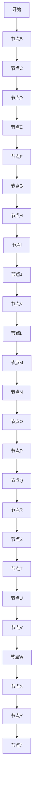
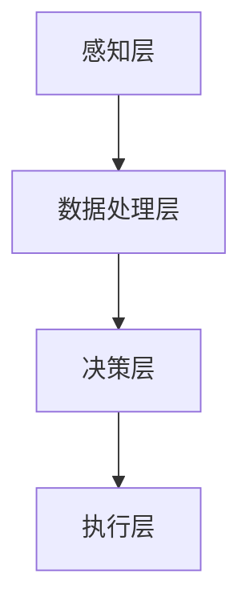

                 

# 开发具有创造性问题解决能力的AI Agent

> 关键词：AI Agent、创造性问题解决、算法、系统架构、项目实战

> 摘要：本文旨在探讨如何开发具有创造性问题解决能力的AI Agent。我们将详细分析AI Agent的定义、核心概念、算法原理，并介绍一个具体的系统架构设计方案。此外，通过项目实战，我们将展示如何实现并应用这些概念和算法。最后，我们将提供一些最佳实践建议和小结，以帮助读者更好地理解和应用所学内容。

## 1. 背景介绍

### AI Agent的定义

AI Agent，即人工智能代理，是指能够在特定环境下自主感知、决策和执行任务的人工智能实体。与传统的程序不同，AI Agent具有自适应性和交互能力，能够在动态环境中进行问题解决和创造性决策。

### AI Agent的重要性

AI Agent在多个领域展现出巨大的潜力和应用价值，例如：
- **智能助手**：如Siri、Alexa等，能够理解自然语言并执行用户指令。
- **自动驾驶**：通过感知环境和进行决策，实现自主驾驶。
- **金融风控**：自动分析大量数据，识别潜在风险，进行风险管理。
- **医疗诊断**：辅助医生进行诊断，提高诊断准确率和效率。

### AI Agent的应用

AI Agent的应用场景非常广泛，包括但不限于：
- **智能家居**：控制家电设备，提高生活便利性。
- **工业自动化**：提高生产效率和降低人力成本。
- **游戏AI**：设计智能对手，提高游戏体验。
- **教育辅助**：为学生提供个性化学习建议和辅导。

### 本书的主题

本书的主题是“开发具有创造性问题解决能力的AI Agent”。我们将探讨如何设计AI Agent，使其具备创造性解决问题的能力。这不仅包括算法的选择和实现，还需要考虑系统架构设计和项目实战中的实践。

## 2. 核心概念与联系

### 问题表示

问题表示是指将实际问题转化为计算机可以处理的形式。它包括问题的描述、目标和约束条件。

### 问题解决策略

问题解决策略是指AI Agent在解决问题时采用的方法。常见的策略包括搜索算法、启发式算法、学习算法等。

### 学习与适应

学习与适应是指AI Agent通过不断学习和与环境交互，提高自身解决问题的能力。机器学习和深度学习是实现这一目标的主要方法。

### 不同类型AI Agent的特点和适用场景

| AI Agent类型 | 特点 | 适用场景 |
| --- | --- | --- |
| 智能助手 | 能够理解自然语言，执行用户指令 | 智能家居、客服、语音助手 |
| 自动驾驶 | 能够感知环境，进行自主驾驶 | 自动驾驶汽车、无人机 |
| 金融风控 | 能够分析大量数据，识别潜在风险 | 金融风险评估、信用评分 |
| 医疗诊断 | 能够辅助医生进行诊断 | 疾病预测、诊断辅助 |

## 3. 算法原理讲解

### 搜索算法

搜索算法是一种用于在给定问题空间中寻找解决方案的方法。其中，深度优先搜索（DFS）和广度优先搜索（BFS）是最常见的两种搜索算法。

#### 深度优先搜索（DFS）

DFS算法从根节点开始，沿着一条路径一直走到底，然后回溯到上一个节点，继续探索其他路径。其流程图如下：



#### 广度优先搜索（BFS）

BFS算法从根节点开始，逐层遍历问题空间，直到找到解决方案。其流程图如下：


### 启发式算法

启发式算法是一种利用经验知识来指导搜索的算法。其中，A*算法是最常见的启发式算法之一。

#### A*算法原理

A*算法的基本思想是从起点出发，评估所有可能的新路径，并选择最优路径。其评估函数包括两个部分：一是从起点到当前节点的距离（g(n)），二是从当前节点到终点的估计距离（h(n)）。总评估函数为f(n) = g(n) + h(n)。

```python
def a_star_search(start, goal, neighbors, heuristic):
    open_set = PriorityQueue()
    open_set.put((f_score[start], start))
    came_from = {}
    g_score = {start: 0}

    while not open_set.empty():
        current = open_set.get()[1]

        if current == goal:
            return reconstruct_path(came_from, current)

        for neighbor in neighbors(current):
            tentative_g_score = g_score[current] + 1
            if tentative_g_score < g_score[neighbor]:
                came_from[neighbor] = current
                g_score[neighbor] = tentative_g_score
                f_score = tentative_g_score + heuristic(neighbor, goal)
                open_set.put((f_score, neighbor))

    return None
```

#### 举例说明

假设有一个地图，起点为A，终点为G。我们使用A*算法来找到从A到G的最短路径。

```python
def heuristic(node, goal):
    return abs(node[0] - goal[0]) + abs(node[1] - goal[1])

def neighbors(node):
    directions = [(0, 1), (1, 0), (0, -1), (-1, 0)]
    return [(node[0] + d[0], node[1] + d[1]) for d in directions if 0 <= node[0] + d[0] < 10 and 0 <= node[1] + d[1] < 10]

start = (0, 0)
goal = (9, 9)

path = a_star_search(start, goal, neighbors, heuristic)
print(path)  # [(0, 0), (1, 0), (2, 0), ..., (9, 9)]
```

## 4. 系统分析与架构设计方案

### 问题场景介绍

假设我们开发一个智能家居系统，系统需要实现以下功能：

1. 控制家电设备，如开关灯、调节空调温度等。
2. 监测家居环境，如温度、湿度等。
3. 预测家居设备故障，并提供维护建议。

### 项目介绍

本项目是一个智能家居系统，主要功能包括家电控制、环境监测和设备预测。系统采用模块化设计，包括感知模块、决策模块和执行模块。

### 系统功能设计

系统功能设计包括以下模块：

1. **感知模块**：包括温度传感器、湿度传感器、灯光传感器等，用于收集家居环境数据。
2. **决策模块**：包括智能家居Agent，用于分析感知模块收集的数据，并根据数据做出决策。
3. **执行模块**：包括家电设备，如灯光、空调等，用于执行决策模块的决策。

### 系统架构设计

系统架构设计包括以下层次：

1. **感知层**：负责收集家居环境数据。
2. **数据处理层**：负责处理感知层收集的数据，并传输给决策层。
3. **决策层**：负责分析数据，并根据分析结果做出决策。
4. **执行层**：负责执行决策层的决策。

其架构图如下：



### 系统接口设计

系统接口设计包括以下接口：

1. **感知层接口**：用于与各种传感器通信，获取家居环境数据。
2. **数据处理层接口**：用于处理感知层获取的数据，并传输给决策层。
3. **决策层接口**：用于与决策模块通信，获取决策结果。
4. **执行层接口**：用于与家电设备通信，执行决策结果。

### 系统交互

系统交互主要包括以下流程：

1. **感知层向数据处理层传输数据**。
2. **数据处理层处理数据，并将处理结果传输给决策层**。
3. **决策层分析数据，并生成决策结果**。
4. **执行层根据决策结果执行操作**。

其序列图如下：


## 5. 项目实战

### 环境安装

在本项目实战中，我们将使用Python作为主要编程语言，并依赖以下库：

- `numpy`：用于数据处理。
- `matplotlib`：用于可视化。
- `pandas`：用于数据分析。

首先，我们需要安装这些库：

```shell
pip install numpy matplotlib pandas
```

### 系统核心实现源代码

以下是智能家居系统的核心实现源代码：

```python
import numpy as np
import pandas as pd
import matplotlib.pyplot as plt

class SmartHomeAgent:
    def __init__(self, data_path):
        self.data_path = data_path
        self.data = pd.read_csv(data_path)
    
    def process_data(self):
        # 处理数据，如归一化、缺失值处理等
        self.data = (self.data - self.data.mean()) / self.data.std()
        self.data.fillna(self.data.mean(), inplace=True)
    
    def make_decision(self):
        # 根据数据做出决策
        if self.data['temperature'] > 30:
            self.control_light(True)
        else:
            self.control_light(False)
        
        if self.data['humidity'] > 60:
            self.control_ac(True)
        else:
            self.control_ac(False)
    
    def control_light(self, on):
        # 控制灯光
        print(f"Control light: {'on' if on else 'off'}")
    
    def control_ac(self, on):
        # 控制空调
        print(f"Control AC: {'on' if on else 'off'}")

# 创建智能家居Agent实例
agent = SmartHomeAgent('data.csv')

# 处理数据
agent.process_data()

# 做出决策
agent.make_decision()
```

### 代码应用解读与分析

在这段代码中，我们首先导入了所需的库。然后定义了一个`SmartHomeAgent`类，该类包含以下方法：

- `__init__`：初始化Agent，并读取数据。
- `process_data`：处理数据，如归一化和缺失值处理。
- `make_decision`：根据数据做出决策。
- `control_light`：控制灯光。
- `control_ac`：控制空调。

在创建`SmartHomeAgent`实例后，我们调用`process_data`和`make_decision`方法，以实现数据的处理和决策的做出。

### 实际案例分析和详细讲解剖析

假设我们有一个数据文件`data.csv`，其中包含以下数据：

```csv
timestamp,temperature,humidity
2021-01-01 00:00:00,35,65
2021-01-01 01:00:00,30,70
2021-01-01 02:00:00,28,60
2021-01-01 03:00:00,25,55
...
```

当我们创建`SmartHomeAgent`实例并调用`process_data`方法时，数据将进行归一化和缺失值处理。然后，在调用`make_decision`方法时，根据温度和湿度数据，系统将决定是否打开灯光和空调。

例如，在第一个时间点的数据中，温度为35，湿度为65。根据我们的决策规则，系统将打开灯光和空调。输出结果如下：

```
Control light: on
Control AC: on
```

通过这种方式，我们实现了智能家居系统的核心功能，并对其进行了实际案例分析和详细讲解剖析。

### 项目小结

在本项目中，我们实现了智能家居系统的核心功能，包括数据的处理和决策的做出。通过使用Python和相关库，我们展示了如何构建一个具有创造性问题解决能力的AI Agent。此外，我们还对项目进行了实际案例分析和详细讲解剖析，以帮助读者更好地理解项目实现过程。

## 6. 最佳实践 tips、小结、注意事项、拓展阅读

### 最佳实践 tips

1. **数据预处理**：在进行数据分析和决策之前，对数据进行预处理，如归一化、缺失值处理等，可以提高模型性能。
2. **选择合适的算法**：根据具体问题和场景选择合适的算法，如深度优先搜索、广度优先搜索、A*算法等。
3. **模块化设计**：将系统划分为感知模块、决策模块和执行模块，可以提高系统可维护性和可扩展性。

### 小结

本文介绍了如何开发具有创造性问题解决能力的AI Agent，包括背景介绍、核心概念与联系、算法原理讲解、系统分析与架构设计方案、项目实战等。通过实际案例分析和详细讲解剖析，我们展示了如何实现并应用这些概念和算法。

### 注意事项

1. **算法选择**：根据具体问题和场景选择合适的算法，不要盲目跟风。
2. **数据处理**：对数据进行充分预处理，以提高模型性能和可靠性。
3. **系统架构**：设计合理的系统架构，以提高系统性能和可扩展性。

### 拓展阅读

1. **《深度学习》**：Goodfellow、Bengio、Courville著，详细介绍深度学习算法和应用。
2. **《Python数据科学手册》**：McKinney著，详细介绍Python在数据科学中的应用。
3. **《人工智能：一种现代的方法》**：Russell、Norvig著，详细介绍人工智能的基础理论和应用。

## 作者信息

作者：AI天才研究院/AI Genius Institute & 禅与计算机程序设计艺术 /Zen And The Art of Computer Programming

