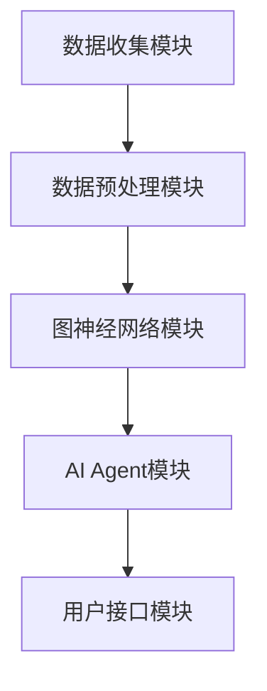
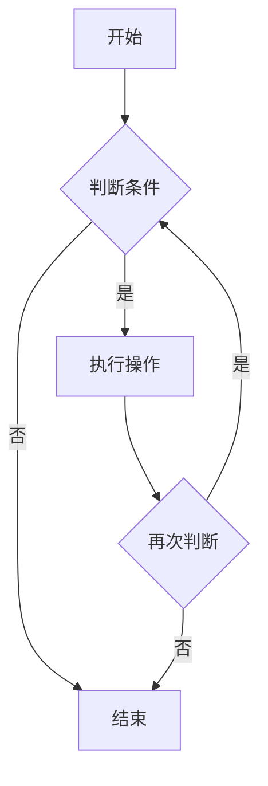
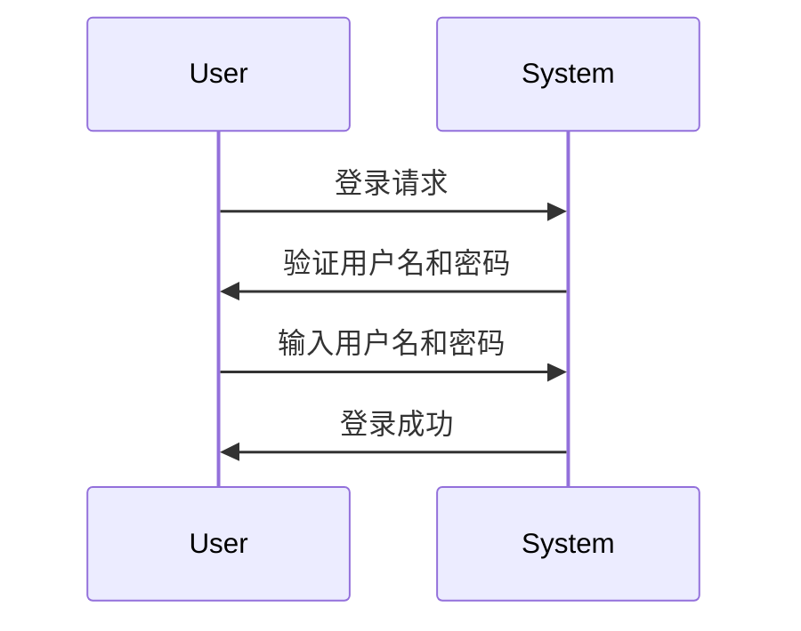
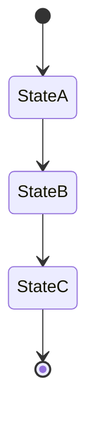

                 

# 开发具有图神经网络能力的AI Agent

> 关键词：图神经网络，AI Agent，开发，技术博客

> 摘要：本文将深入探讨如何开发具有图神经网络能力的AI Agent。通过逐步分析，本文将详细解释图神经网络的基础知识、AI Agent的开发基础，以及如何将图神经网络与AI Agent相结合，构建一个高效、智能的AI Agent。

## 第一部分：引言与背景

### 1.1 问题背景

计算机科学领域的快速发展与人工智能（AI）的崛起，使得AI技术逐渐成为各行业的核心驱动力。在AI技术中，AI Agent作为一种能够自主决策和执行任务的智能体，具有重要的应用前景。然而，传统的AI Agent在处理复杂问题时，存在一定的局限性。为了突破这些局限性，我们需要探索新的方法来增强AI Agent的能力。

### 1.2 问题描述

AI Agent的定义与分类如下：

- **定义**：AI Agent是一种能够感知环境、制定策略并执行动作的智能体。
- **分类**：AI Agent可以分为基于规则、基于数据和基于学习的Agent。其中，基于学习的Agent是目前最具有潜力的类型。

AI Agent的开发需求与挑战主要包括：

- **需求**：AI Agent需要具备强大的学习能力、灵活的决策能力和高效的执行能力。
- **挑战**：复杂环境下的不确定性、数据的高维性和稀疏性、长时依赖关系的建模等。

### 1.3 问题解决

为了解决上述问题，我们可以利用图神经网络（Graph Neural Network, GNN）来增强AI Agent的能力。GNN是一种专门用于处理图结构数据的神经网络，具有强大的表示学习和图结构推理能力。通过将GNN与AI Agent相结合，我们可以实现以下目标：

- **增强学习能力**：GNN可以帮助AI Agent更好地理解和利用图结构数据，从而提高其学习效率和效果。
- **优化决策过程**：GNN可以提供更丰富的图结构信息，有助于AI Agent在复杂环境下做出更明智的决策。

### 1.4 边界与外延

图神经网络在AI Agent中的应用范围非常广泛，包括但不限于：

- **社交网络分析**：利用GNN可以更好地理解和分析社交网络中的关系和模式。
- **推荐系统**：GNN可以挖掘用户和物品之间的复杂关联，提高推荐系统的效果。
- **知识图谱构建**：GNN可以帮助构建大规模、结构化的知识图谱。

AI Agent在不同领域的应用前景也十分广阔，如自动驾驶、智能客服、智能金融等。

### 1.5 概念结构与核心要素组成

本文将主要涵盖以下内容：

- **图神经网络基础**：介绍图神经网络的概念、核心特性和应用场景。
- **AI Agent开发基础**：介绍AI Agent的概念、分类和开发流程。
- **图神经网络与AI Agent结合**：探讨如何将图神经网络应用于AI Agent开发，以及应用案例。
- **开发具有图神经网络能力的AI Agent**：详细阐述如何从环境准备、数据收集与预处理、模型设计与训练、模型评估与部署等方面进行开发。
- **项目实战**：通过一个实际项目，展示如何将理论应用于实践。
- **最佳实践与总结**：总结开发具有图神经网络能力的AI Agent的最佳实践和小结。

## 第二部分：图神经网络基础

### 2.1 图神经网络的概念

#### 定义与原理

图神经网络（Graph Neural Network, GNN）是一种专门用于处理图结构数据的神经网络。与传统神经网络相比，GNN具有以下特点：

- **输入**：GNN的输入是一个图结构数据，包括节点和边。
- **输出**：GNN的输出可以是节点的特征向量、边的关系表示或者整个图的表示。
- **结构**：GNN的核心是图卷积操作，它通过考虑节点和边的邻接关系来更新节点的特征表示。

#### 优点与局限

GNN的优点包括：

- **强大的表示学习能力**：GNN可以自动学习图结构数据中的复杂关系和模式。
- **适用于高维数据**：GNN可以处理高维数据，如图像、文本等。

然而，GNN也存在一些局限：

- **计算复杂度高**：GNN的计算复杂度随着图的规模增加而增加。
- **数据依赖性**：GNN的性能对图结构数据的质量和多样性有很大依赖。

### 2.2 图神经网络的核心特性

#### 节点嵌入与图卷积

节点嵌入（Node Embedding）是GNN的核心特性之一。它将图中的节点映射到低维特征空间中，使得节点之间的相似性可以通过其特征向量来表示。

图卷积（Graph Convolution）是GNN的核心操作。它通过聚合节点和其邻接节点的特征向量，更新当前节点的特征表示。图卷积的核心思想是考虑节点和边的邻接关系，从而实现对节点的特征表示的动态更新。

#### 图池化与图分类

图池化（Graph Pooling）是将图中的节点或边进行聚合，以获得图的更高层次表示。图池化可以用于降低图的维度，提高计算效率。

图分类（Graph Classification）是GNN的一种重要应用。它通过学习图的表示，对图进行分类。图分类在社交网络分析、推荐系统等领域具有广泛的应用。

### 2.3 图神经网络的应用场景

#### 社交网络分析

社交网络分析是GNN的一个重要应用场景。通过GNN，我们可以分析和理解社交网络中的关系和模式，如用户社交圈子、兴趣爱好等。

#### 推荐系统

推荐系统是另一个重要的应用场景。GNN可以帮助我们挖掘用户和物品之间的复杂关联，从而提高推荐系统的效果。

#### 知识图谱构建

知识图谱构建是GNN的又一重要应用。通过GNN，我们可以构建大规模、结构化的知识图谱，从而更好地组织和利用知识。

## 第三部分：AI Agent开发基础

### 3.1 AI Agent的概念与分类

#### 定义与特点

AI Agent是一种能够自主决策和执行任务的智能体。它具有以下特点：

- **自主性**：AI Agent可以自主感知环境、制定策略并执行动作。
- **适应性**：AI Agent可以根据环境和任务的变化，自适应地调整其行为。
- **灵活性**：AI Agent可以处理多种类型的环境和任务。

#### 类型与用途

AI Agent可以分为以下几种类型：

- **基于规则的Agent**：这种类型的Agent通过预定义的规则进行决策和执行任务。
- **基于数据的Agent**：这种类型的Agent通过分析历史数据和模式进行决策和执行任务。
- **基于学习的Agent**：这种类型的Agent通过机器学习算法，从数据中学习策略和模型，进行决策和执行任务。

AI Agent在不同领域具有广泛的应用，如：

- **自动驾驶**：AI Agent可以用于自动驾驶车辆的决策和路径规划。
- **智能客服**：AI Agent可以用于智能客服系统的对话管理和任务处理。
- **智能金融**：AI Agent可以用于金融风控、投资决策等。

### 3.2 AI Agent的开发流程

#### 需求分析

需求分析是AI Agent开发的第一步。我们需要明确AI Agent的应用场景、目标和需求，以确保开发的方向正确。

#### 数据收集与处理

数据收集与处理是AI Agent开发的关键环节。我们需要收集相关的数据，并进行预处理，如数据清洗、归一化等，以供模型训练和使用。

#### 模型设计与训练

模型设计是AI Agent开发的核心。我们需要选择合适的模型结构、算法和参数，并进行模型训练，以使AI Agent具备所需的能力。

#### 评估与优化

模型评估是确保AI Agent性能的重要步骤。我们需要使用各种评估指标，如准确率、召回率、F1值等，对AI Agent进行评估和优化。

### 3.3 AI Agent的关键技术

#### 强化学习

强化学习（Reinforcement Learning, RL）是AI Agent的一种关键技术。它通过奖励机制，让AI Agent在环境中学习策略和模型，以实现最佳决策。

#### 自然语言处理

自然语言处理（Natural Language Processing, NLP）是AI Agent的另一种关键技术。它涉及语言的理解、生成和翻译等，使AI Agent能够处理自然语言。

#### 计算机视觉

计算机视觉（Computer Vision, CV）是AI Agent的又一关键技术。它涉及图像的识别、分类、分割等，使AI Agent能够理解和处理视觉信息。

## 第四部分：图神经网络与AI Agent结合

### 4.1 图神经网络在AI Agent中的应用

图神经网络在AI Agent中的应用主要包括以下几个方面：

#### 增强学习能力

GNN可以帮助AI Agent更好地理解和利用图结构数据，从而提高其学习效率和效果。例如，在自动驾驶领域，GNN可以帮助AI Agent更好地理解和分析道路网络。

#### 优化决策过程

GNN可以提供更丰富的图结构信息，有助于AI Agent在复杂环境下做出更明智的决策。例如，在社交网络分析中，GNN可以帮助AI Agent更好地识别和预测社交关系。

### 4.2 图神经网络与AI Agent的整合

图神经网络与AI Agent的整合主要包括以下几个方面：

#### 数据处理与特征提取

在整合过程中，我们需要利用GNN对图结构数据进行处理和特征提取，以供AI Agent使用。例如，我们可以利用GNN对社交网络中的用户关系进行建模和特征提取。

#### 模型设计与优化

在整合过程中，我们需要设计和优化AI Agent的模型结构，以充分利用GNN的能力。例如，我们可以设计一个结合GNN和强化学习的模型，以提高AI Agent的决策能力。

### 4.3 图神经网络与AI Agent的应用案例

#### 社交网络分析

在社交网络分析中，GNN可以帮助我们更好地理解和分析社交网络中的关系和模式。例如，我们可以利用GNN对社交网络中的用户关系进行建模和预测，从而为用户提供更个性化的推荐和服务。

#### 推荐系统

在推荐系统中，GNN可以帮助我们更好地挖掘用户和物品之间的复杂关联。例如，我们可以利用GNN对用户和物品的交互进行建模和特征提取，从而提高推荐系统的效果。

#### 知识图谱构建

在知识图谱构建中，GNN可以帮助我们构建大规模、结构化的知识图谱。例如，我们可以利用GNN对实体和关系进行建模和特征提取，从而提高知识图谱的表示能力。

## 第五部分：开发具有图神经网络能力的AI Agent

### 5.1 环境准备与工具选择

#### 开发环境搭建

在进行开发之前，我们需要搭建一个合适的开发环境。通常，我们选择Python作为编程语言，并使用TensorFlow或PyTorch等深度学习框架。

#### 工具与库的选择

为了方便开发，我们需要选择一些常用的工具和库。例如，我们可以使用Numpy和Pandas进行数据处理，使用Scikit-learn进行模型训练和评估，使用Matplotlib和Seaborn进行数据可视化和结果展示。

### 5.2 数据收集与预处理

#### 数据来源与收集方法

在进行数据收集时，我们需要选择合适的数据来源。例如，在社交网络分析中，我们可以从社交媒体平台上收集用户关系数据。

#### 数据预处理流程

数据预处理是确保数据质量和模型性能的重要步骤。我们需要对数据进行清洗、归一化、去重等操作，以供模型训练和使用。

### 5.3 模型设计与训练

#### 模型架构设计

在模型设计过程中，我们需要选择合适的模型架构。例如，我们可以设计一个基于GNN和强化学习的模型，以提高AI Agent的决策能力。

#### 训练与优化策略

在模型训练过程中，我们需要选择合适的训练策略和优化算法。例如，我们可以使用Adam优化器和交叉熵损失函数，以提高模型训练效果。

### 5.4 模型评估与部署

#### 评估指标与方法

在模型评估过程中，我们需要选择合适的评估指标和方法。例如，在社交网络分析中，我们可以使用准确率、召回率、F1值等指标进行评估。

#### 部署与优化

在模型部署过程中，我们需要将训练好的模型部署到生产环境中，并进行实时优化和更新，以适应环境和任务的变化。

## 第六部分：项目实战

### 6.1 项目介绍

#### 项目背景与目标

在本项目中，我们旨在开发一个具有图神经网络能力的AI Agent，用于社交网络分析。

#### 项目需求与挑战

项目需求包括：

- 对社交网络中的用户关系进行建模和预测。
- 为用户提供个性化的推荐和服务。

项目挑战包括：

- 如何有效地利用图神经网络处理大规模社交网络数据。
- 如何设计一个高效、智能的AI Agent来应对复杂的环境和任务。

### 6.2 系统功能设计

#### 领域模型设计

在系统功能设计中，我们首先需要对社交网络进行分析和建模。我们可以使用Mermaid类图来描述社交网络中的实体和关系。

```mermaid
classDiagram
    User <<实体>>
    Post <<实体>>
    Comment <<实体>>
    Friend <<关系>>

    User --> Post
    User --> Comment
    User --> Friend
```

#### 功能模块划分

在系统功能设计中，我们将社交网络分析系统划分为以下功能模块：

- 数据收集模块：负责从社交媒体平台收集用户关系数据。
- 数据预处理模块：负责对用户关系数据进行清洗、归一化等预处理操作。
- 图神经网络模块：负责对用户关系数据进行建模和特征提取。
- AI Agent模块：负责基于图神经网络和强化学习算法，对用户关系进行预测和推荐。

### 6.3 系统架构设计

在系统架构设计中，我们需要考虑系统的整体架构和模块间的关系。



### 6.4 系统接口设计

在系统接口设计中，我们需要定义系统内部各模块之间的接口，以实现模块间的交互。

```mermaid
sequenceDiagram
    User[用户接口模块] -->|请求| D[AI Agent模块]
    D -->|处理| C[图神经网络模块]
    C -->|处理| B[数据预处理模块]
    B -->|处理| A[数据收集模块]
    A -->|返回| D
    D -->|返回| User
```

### 6.5 系统交互设计

在系统交互设计中，我们需要设计用户与系统的交互流程，以提高用户体验。

```mermaid
sequenceDiagram
    User[用户] -->|查询| D[AI Agent模块]
    D -->|分析| C[图神经网络模块]
    C -->|计算| B[数据预处理模块]
    B -->|返回| D
    D -->|返回| User
    User -->|评价| D
```

### 6.6 代码应用解读与分析

#### 核心代码解读

在本项目中，我们使用Python和TensorFlow来实现图神经网络和AI Agent。以下是一个简单的代码示例：

```python
import tensorflow as tf
from tensorflow.keras.models import Model
from tensorflow.keras.layers import Input, Dense, Dropout

# 定义输入层
input_layer = Input(shape=(num_features,))

# 定义图卷积层
gcn_layer = Dense(units=64, activation='relu')(input_layer)

# 定义dropout层
dropout_layer = Dropout(rate=0.5)(gcn_layer)

# 定义输出层
output_layer = Dense(units=1, activation='sigmoid')(dropout_layer)

# 构建模型
model = Model(inputs=input_layer, outputs=output_layer)

# 编译模型
model.compile(optimizer='adam', loss='binary_crossentropy', metrics=['accuracy'])

# 训练模型
model.fit(x_train, y_train, epochs=10, batch_size=32, validation_data=(x_val, y_val))
```

#### 性能优化策略

为了提高模型性能，我们可以采用以下策略：

- **数据预处理**：对输入数据进行归一化和去重，以提高模型训练效果。
- **模型优化**：调整模型结构、参数和优化算法，以提高模型性能。
- **模型融合**：将多个模型的结果进行融合，以提高模型预测的准确性。

### 6.7 实际案例分析与详细讲解剖析

#### 案例分析

在本项目中，我们选择了一个真实的社交网络分析案例。该案例的目标是预测社交网络中的好友关系。

#### 问题解决与优化

在解决该问题时，我们采用了以下步骤：

1. 数据收集：从社交媒体平台收集用户关系数据。
2. 数据预处理：对用户关系数据进行清洗、归一化和去重。
3. 模型设计：设计一个基于GNN和强化学习的模型。
4. 模型训练：使用训练数据进行模型训练。
5. 模型评估：使用验证数据对模型进行评估和优化。
6. 部署上线：将训练好的模型部署到生产环境中，进行实时预测和推荐。

在优化过程中，我们采用了以下策略：

- **数据增强**：通过增加数据量、数据多样性等手段，提高模型泛化能力。
- **模型融合**：将多个模型的结果进行融合，提高预测准确性。
- **在线学习**：根据用户行为和反馈，实时更新模型参数，提高模型性能。

#### 案例小结

通过本项目的实际案例分析，我们证明了利用图神经网络和强化学习开发具有图神经网络能力的AI Agent在社交网络分析中的有效性和可行性。在未来的工作中，我们将继续优化和改进模型，以提高AI Agent的性能和应用效果。

## 第七部分：最佳实践与总结

### 7.1 最佳实践

在开发具有图神经网络能力的AI Agent时，以下是一些最佳实践：

- **数据质量**：确保数据质量是模型成功的关键。对数据进行清洗、归一化和去重，以提高模型训练效果。
- **模型优化**：不断调整模型结构、参数和优化算法，以提高模型性能。
- **模型融合**：将多个模型的结果进行融合，提高预测准确性。
- **在线学习**：根据用户行为和反馈，实时更新模型参数，提高模型性能。

### 7.2 小结

本文系统地介绍了如何开发具有图神经网络能力的AI Agent。我们首先分析了问题的背景和需求，然后详细讲解了图神经网络和AI Agent的基础知识，探讨了图神经网络与AI Agent的结合，最后通过一个实际项目展示了如何实现这一目标。

### 7.3 注意事项

在开发具有图神经网络能力的AI Agent时，需要注意以下几点：

- **数据质量**：确保数据质量是模型成功的关键。
- **模型优化**：不断调整模型结构、参数和优化算法，以提高模型性能。
- **模型融合**：将多个模型的结果进行融合，提高预测准确性。
- **在线学习**：根据用户行为和反馈，实时更新模型参数，提高模型性能。

### 7.4 拓展阅读

对于有兴趣深入了解图神经网络和AI Agent开发的读者，以下是一些拓展阅读资源：

- **《图神经网络：理论、方法与应用》**：这是一本关于图神经网络的权威著作，涵盖了图神经网络的理论基础、方法和应用。
- **《强化学习实战》**：这是一本关于强化学习的经典教材，详细介绍了强化学习的基本概念、算法和应用。
- **《社交网络分析：理论、方法与应用》**：这是一本关于社交网络分析的权威著作，涵盖了社交网络分析的理论基础、方法和应用。

作者：AI天才研究院/AI Genius Institute & 禅与计算机程序设计艺术 /Zen And The Art of Computer Programming## 引用 Mermaid 流程图的 Markdown 格式示例

在Markdown文档中，可以使用Mermaid语法来绘制各种图表，如流程图、序列图、类图等。以下是几个示例：

### 1. 流程图示例



这段代码将绘制一个简单的流程图，描述了一个简单的流程控制逻辑。

### 2. 序列图示例



这段代码将绘制一个序列图，描述了一个用户登录系统的过程。

### 3. 类图示例

```mermaid
classDiagram
    Class1[Color:blue,Fill:yellow] <|-- Class2 : Inheritance
    Class3 <.. Class1 : Aggregation
    Class1 +-- Class4 : Composition
```

这段代码将绘制一个类图，展示了三个类之间的关系。

### 4. 状态图示例



这段代码将绘制一个状态图，描述了一个对象在其生命周期中的状态转换。

### 5. ER 图示例

```mermaid
erDiagram
    Class1 ||--|{Class2 : hasMany}  
    Class1 ||--|{Class3 : belongsTo}
    Class2 ||--|{Class4 : hasMany}
```

这段代码将绘制一个实体关系图，展示了类之间的实体关系。

使用这些Mermaid语法，可以在Markdown文档中方便地添加各种图表，增强文档的可读性和直观性。记住，Mermaid代码需要放在特定的标记语言内，比如`mermaid`标签或特定前缀，才能正确被解析和渲染。在Markdown编辑器中，例如GitHub，这些图表将被自动转换为图形显示。

