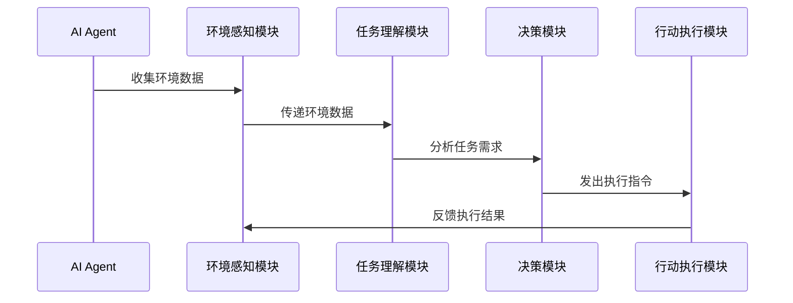
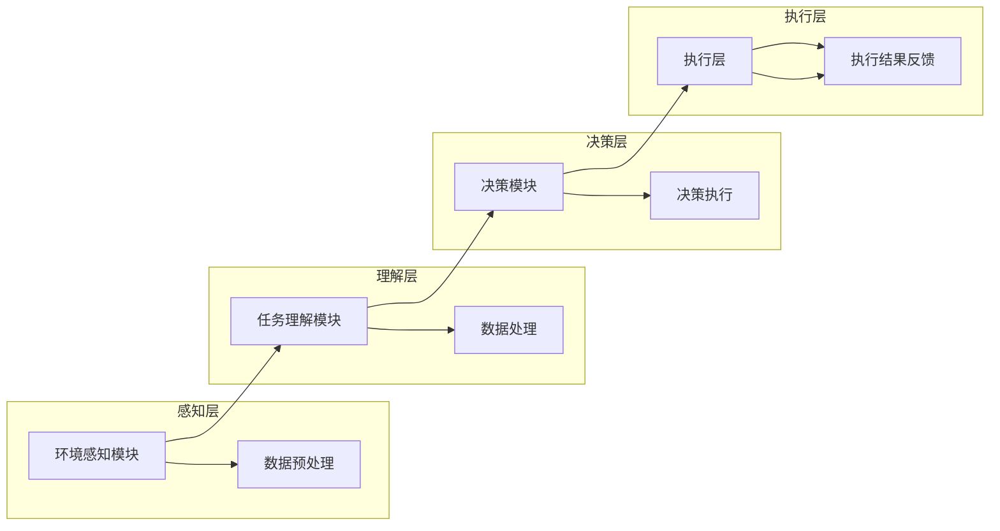
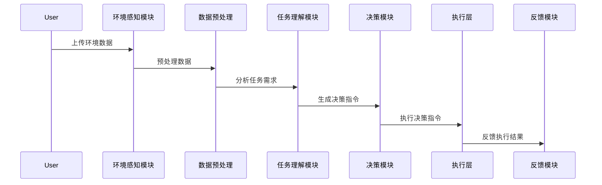

                 

# 开发具有持续适应能力的AI Agent

## 关键词

AI Agent、持续适应能力、在线学习、迁移学习、多任务学习、元学习

## 摘要

本文旨在探讨开发具有持续适应能力的AI Agent的重要性和方法。首先，本文介绍了AI Agent的定义、持续适应能力的概念及其实现方法。接着，通过算法原理讲解、系统分析与架构设计方案以及项目实战，详细阐述了如何实现AI Agent的持续适应能力。文章最后提供了最佳实践 tips 和小结，为开发者提供指导。

## 1. 背景介绍

### AI Agent的定义

AI Agent，是一种能够自主感知环境、理解任务需求、进行决策并执行动作的智能实体。它不同于传统的AI系统，AI Agent具有更高的自主性和适应性。这种自主性体现在它能够自主地获取环境信息，理解任务需求，并自主地做出决策和执行动作。适应性则表现在它能够在面临环境变化时，快速调整自身行为，保持性能稳定。

### 持续适应能力的概念

持续适应能力是指AI Agent在面临环境变化时，能够快速调整自身行为，保持性能稳定的能力。这包括对环境变化的自适应学习、对任务需求的动态调整以及自我优化。在动态环境中，AI Agent需要能够实时更新模型，适应新的环境条件，同时保持高效率的任务执行能力。

### 持续适应能力实现方法

实现持续适应能力的方法包括以下几个方面：

1. **在线学习**：AI Agent通过持续地从环境中收集数据，不断更新模型参数，以适应环境变化。
2. **迁移学习**：利用已有模型在类似环境中的经验，快速适应新环境。
3. **多任务学习**：同时处理多个任务，提高AI Agent的通用性和适应性。
4. **元学习**：通过学习如何学习，提高AI Agent的适应能力。

### 背景介绍：问题背景、问题描述、问题解决、边界与外延

随着AI技术的不断发展，AI Agent在各个领域中的应用越来越广泛。然而，传统AI Agent在持续适应能力方面面临着诸多挑战。首先，环境变化的速度越来越快，传统AI Agent难以在短时间内适应新的环境条件。其次，不同场景下的任务需求多样化，传统AI Agent难以在多个任务之间灵活切换。最后，传统AI Agent的模型参数更新往往需要大量的时间和计算资源，导致其适应能力有限。

为了解决这些问题，我们需要开发具有持续适应能力的AI Agent。这种AI Agent不仅能够快速适应环境变化，还能够动态调整任务需求，并且能够在多个任务之间灵活切换。此外，持续适应能力的实现需要考虑边界与外延，即如何在不同应用场景中实现AI Agent的持续适应。

### 概念结构与核心要素组成

AI Agent的核心要素包括环境感知模块、任务理解模块、决策模块和行动执行模块。环境感知模块负责收集环境信息，任务理解模块负责理解任务需求，决策模块负责根据环境信息和任务需求做出决策，行动执行模块负责执行决策结果。

持续适应能力的关键在于如何实现这些模块之间的动态调整和优化。在线学习、迁移学习、多任务学习和元学习等方法都是实现持续适应能力的重要手段。这些方法相互关联，共同构成了AI Agent的持续适应能力框架。

## 2. 核心概念与联系

### AI Agent的定义

AI Agent，即人工智能代理，是一种模拟人类智能行为的计算机程序。它能够自主地感知环境、理解任务需求、进行决策和执行动作，以实现特定目标。与传统的规则驱动或数据驱动的系统不同，AI Agent具有自主性和适应性，能够在复杂和动态的环境中自主运作。

### 持续适应能力的概念

持续适应能力是指AI Agent在面临环境变化时，能够快速调整自身行为，保持性能稳定的能力。这种能力包括以下几个方面：

1. **自适应学习**：AI Agent能够根据环境变化，不断调整和优化模型参数，以适应新的环境条件。
2. **动态任务调整**：AI Agent能够根据任务需求的变化，灵活调整自身的任务执行策略，以适应不同的任务场景。
3. **自我优化**：AI Agent能够通过自我评估和调整，不断优化自身的性能，提高任务完成的效率和准确性。

### 持续适应能力实现方法

实现持续适应能力的方法主要包括以下几种：

1. **在线学习**：AI Agent通过持续地从环境中收集数据，不断更新模型参数，以适应环境变化。
   - **优势**：能够实时适应环境变化，提高AI Agent的灵活性和适应性。
   - **挑战**：数据收集和处理需要大量的计算资源和时间。

2. **迁移学习**：利用已有模型在类似环境中的经验，快速适应新环境。
   - **优势**：能够快速适应新环境，减少训练时间和计算资源需求。
   - **挑战**：需要找到适合的迁移学习策略，确保模型在新环境中的性能。

3. **多任务学习**：同时处理多个任务，提高AI Agent的通用性和适应性。
   - **优势**：能够处理复杂的多任务场景，提高AI Agent的灵活性和效率。
   - **挑战**：需要平衡多个任务之间的资源分配，确保每个任务的性能。

4. **元学习**：通过学习如何学习，提高AI Agent的适应能力。
   - **优势**：能够快速适应新的任务和场景，提高AI Agent的泛化能力。
   - **挑战**：需要设计有效的元学习算法，确保模型的学习效率和性能。

### 概念属性特征对比表格

| 特征项 | AI Agent | 传统AI系统 |
| --- | --- | --- |
| 自主性 | 高 | 低 |
| 适应性 | 强 | 弱 |
| 学习能力 | 持续 | 静态 |
| 决策能力 | 高 | 低 |

### ER实体关系图架构的Mermaid流程图

```mermaid
erDiagram
  AI Agent ||--|{ 环境感知模块 }
  AI Agent ||--|{ 任务理解模块 }
  AI Agent ||--|{ 决策模块 }
  AI Agent ||--|{ 行动执行模块 }
```

在这个ER图中，AI Agent作为中心实体，与四个模块（环境感知模块、任务理解模块、决策模块和行动执行模块）之间存在紧密的关联。这些模块共同构成了AI Agent的核心功能，实现了其持续适应能力。

## 3. 算法原理讲解

### 算法Mermaid流程图



在这个流程图中，AI Agent通过环境感知模块收集环境数据，然后传递给任务理解模块进行分析。任务理解模块根据分析结果，生成决策指令，传递给行动执行模块执行。最后，行动执行模块将执行结果反馈给环境感知模块，形成一个闭环的决策执行过程。

### Python源代码示例

```python
class AIAgent:
    def __init__(self):
        self.environment_perception = EnvironmentPerception()
        self.task_understanding = TaskUnderstanding()
        self.decision_maker = DecisionMaker()
        self.action_executor = ActionExecutor()

    def run(self):
        while True:
            environment_data = self.environment_perception.collect_data()
            task_demand = self.task_understanding.analyze(environment_data)
            decision = self.decision_maker.make_decision(task_demand)
            self.action_executor.execute_action(decision)
            action_result = self.action_executor.get_result()

            # 更新模型
            self.environment_perception.update_model(action_result)
            self.task_understanding.update_model(action_result)
            self.decision_maker.update_model(action_result)
            self.action_executor.update_model(action_result)
```

在这个示例中，AIAgent类包含了四个模块：环境感知模块、任务理解模块、决策模块和行动执行模块。在`run`方法中，首先通过环境感知模块收集环境数据，然后传递给任务理解模块进行分析，生成决策指令。决策模块根据任务需求生成决策指令，传递给行动执行模块执行。执行完成后，行动执行模块将执行结果反馈给环境感知模块，形成一个闭环的决策执行过程。最后，根据执行结果，更新各个模块的模型参数，实现持续适应能力。

### 算法原理的数学模型和公式

为了实现AI Agent的持续适应能力，我们需要使用以下数学模型和公式：

1. **在线学习模型**：

   - **损失函数**：\[ L(\theta) = \frac{1}{m} \sum_{i=1}^{m} (-y_i \log(\hat{y}_i) + (1 - y_i) \log(1 - \hat{y}_i)) \]
     - 其中，\(\theta\) 表示模型参数，\(m\) 表示样本数量，\(y_i\) 表示第 \(i\) 个样本的真实标签，\(\hat{y}_i\) 表示第 \(i\) 个样本的预测标签。

   - **梯度下降**：\[ \theta := \theta - \alpha \frac{\partial L(\theta)}{\partial \theta} \]
     - 其中，\(\alpha\) 表示学习率。

2. **迁移学习模型**：

   - **特征提取器**：\[ f(\theta_f, x) = \sigma(W_f \cdot \theta_f + b_f) \]
     - 其中，\(f(\theta_f, x)\) 表示特征提取器，\(\theta_f\) 表示特征提取器的参数，\(x\) 表示输入样本，\(\sigma\) 表示激活函数。

   - **分类器**：\[ \hat{y} = \sigma(W_c \cdot f(\theta_f, x) + b_c) \]
     - 其中，\(\hat{y}\) 表示分类器的预测标签，\(W_c\) 和 \(b_c\) 分别表示分类器的权重和偏置。

3. **多任务学习模型**：

   - **共享网络**：\[ f(\theta_s, x) = \sigma(W_s \cdot \theta_s + b_s) \]
     - 其中，\(f(\theta_s, x)\) 表示共享网络的输出，\(\theta_s\) 表示共享网络的参数。

   - **任务特定网络**：\[ f_t(\theta_t, x) = \sigma(W_t \cdot f(\theta_s, x) + b_t) \]
     - 其中，\(f_t(\theta_t, x)\) 表示第 \(t\) 个任务特定网络的输出，\(\theta_t\) 表示任务特定网络的参数。

4. **元学习模型**：

   - **经验损失函数**：\[ L_e(\theta_e) = \frac{1}{n} \sum_{i=1}^{n} L(\theta_e^{(i)}) \]
     - 其中，\(L_e(\theta_e)\) 表示经验损失函数，\(\theta_e\) 表示元学习模型的参数，\(n\) 表示经验样本数量。

   - **优化目标**：\[ \min_{\theta_e} L_e(\theta_e) \]

### 详细讲解和举例说明

为了更好地理解这些数学模型和公式，我们可以通过一个具体的例子来说明。

假设我们有一个AI Agent，用于在迷宫中找到出路。这个AI Agent由环境感知模块、任务理解模块、决策模块和行动执行模块组成。

1. **在线学习模型**：

   - **损失函数**：假设我们使用交叉熵损失函数来评估模型在迷宫中找到出路的性能。损失函数如下：

     \[ L(\theta) = \frac{1}{m} \sum_{i=1}^{m} (-y_i \log(\hat{y}_i) + (1 - y_i) \log(1 - \hat{y}_i)) \]

     其中，\(y_i\) 表示第 \(i\) 个样本的真实标签（即是否找到出路），\(\hat{y}_i\) 表示第 \(i\) 个样本的预测标签。

   - **梯度下降**：假设我们使用梯度下降算法来更新模型参数。学习率 \(\alpha\) 设置为 0.01。梯度下降的更新规则如下：

     \[ \theta := \theta - \alpha \frac{\partial L(\theta)}{\partial \theta} \]

     通过迭代计算，我们可以逐步优化模型参数，使其在迷宫中找到出路的性能得到提升。

2. **迁移学习模型**：

   - **特征提取器**：假设我们使用卷积神经网络（CNN）作为特征提取器。特征提取器的输出可以表示为：

     \[ f(\theta_f, x) = \sigma(W_f \cdot \theta_f + b_f) \]

     其中，\(\theta_f\) 表示特征提取器的参数，\(x\) 表示输入的迷宫图像。

   - **分类器**：假设我们使用全连接神经网络（FCN）作为分类器。分类器的输出可以表示为：

     \[ \hat{y} = \sigma(W_c \cdot f(\theta_f, x) + b_c) \]

     其中，\(W_c\) 和 \(b_c\) 分别表示分类器的权重和偏置。

   - **迁移学习策略**：假设我们在一个已经训练好的迷宫分类器上，使用迁移学习策略来适应一个新的迷宫环境。迁移学习的关键是找到适当的迁移学习策略，以确保在新环境中分类器的性能得到提升。

3. **多任务学习模型**：

   - **共享网络**：假设我们使用一个共享网络来处理多个迷宫任务。共享网络的输出可以表示为：

     \[ f(\theta_s, x) = \sigma(W_s \cdot \theta_s + b_s) \]

     其中，\(\theta_s\) 表示共享网络的参数。

   - **任务特定网络**：假设我们为每个迷宫任务都设计一个任务特定网络。任务特定网络的输出可以表示为：

     \[ f_t(\theta_t, x) = \sigma(W_t \cdot f(\theta_s, x) + b_t) \]

     其中，\(\theta_t\) 表示任务特定网络的参数。

   - **多任务学习策略**：假设我们在训练过程中，使用多任务学习策略来同时处理多个迷宫任务。多任务学习的目标是提高AI Agent在多个迷宫任务中的性能。

4. **元学习模型**：

   - **经验损失函数**：假设我们使用经验损失函数来评估元学习模型的性能。经验损失函数可以表示为：

     \[ L_e(\theta_e) = \frac{1}{n} \sum_{i=1}^{n} L(\theta_e^{(i)}) \]

     其中，\(L(\theta_e^{(i)})\) 表示在第 \(i\) 个任务上的损失函数。

   - **优化目标**：我们的目标是找到最优的元学习模型参数 \(\theta_e\)，使得经验损失函数 \(L_e(\theta_e)\) 最小。优化目标可以表示为：

     \[ \min_{\theta_e} L_e(\theta_e) \]

     通过优化过程，我们可以训练出一个具有强适应能力的元学习模型，使其在多个任务中表现优异。

通过这个例子，我们可以看到如何利用不同的数学模型和公式来构建一个具有持续适应能力的AI Agent。这些模型和公式为我们提供了一种系统性的方法，帮助我们设计和实现高效的AI Agent。

## 4. 系统分析与架构设计方案

### 问题场景介绍

随着人工智能技术的不断发展，AI Agent在各种领域中的应用日益广泛。然而，在实际应用中，AI Agent面临着复杂的动态环境和高需求的任务，这要求AI Agent具备持续适应能力。为了满足这一需求，我们需要设计一个高效的系统，能够实现AI Agent的持续适应能力。

### 项目介绍

本项目旨在开发一个具有持续适应能力的AI Agent系统，该系统包括环境感知模块、任务理解模块、决策模块和行动执行模块。系统将利用在线学习、迁移学习、多任务学习和元学习等方法，实现AI Agent的持续适应能力。

### 系统功能设计

1. **环境感知模块**：负责收集环境数据，包括图像、文本、声音等多种形式的数据。
2. **任务理解模块**：负责分析任务需求，理解环境中的目标信息和任务目标。
3. **决策模块**：根据环境感知模块和任务理解模块的分析结果，生成决策指令。
4. **行动执行模块**：负责执行决策模块生成的决策指令，并反馈执行结果。

### 系统架构设计

系统采用分层架构，包括感知层、理解层、决策层和执行层。各层之间通过接口进行通信，实现模块化设计。

1. **感知层**：负责收集环境数据，包括图像、文本、声音等多种形式的数据。感知层的数据将通过数据预处理模块进行预处理，以适应后续模块的处理需求。
2. **理解层**：负责分析任务需求，理解环境中的目标信息和任务目标。理解层将利用自然语言处理、计算机视觉等技术，对感知层的数据进行深度分析，生成任务理解结果。
3. **决策层**：根据理解层的结果，生成决策指令。决策层将利用决策算法和优化算法，对任务理解结果进行综合分析，生成最优决策指令。
4. **执行层**：负责执行决策模块生成的决策指令，并反馈执行结果。执行层将利用控制算法和执行策略，将决策指令转化为实际的操作，并对执行结果进行监控和反馈。

### 系统接口设计和系统交互

系统采用RESTful API设计，提供丰富的接口，方便与其他系统进行集成和交互。

1. **数据接口**：提供数据上传和下载接口，方便环境感知模块收集和存储环境数据。
2. **任务接口**：提供任务创建、删除、查询接口，方便任务理解模块分析任务需求。
3. **决策接口**：提供决策生成、查询接口，方便执行层获取决策指令。
4. **反馈接口**：提供执行结果反馈接口，方便系统评估决策效果。

系统交互流程如下：

1. **环境感知模块**：通过数据接口上传环境数据，通过任务接口创建任务。
2. **任务理解模块**：通过任务接口获取任务需求，通过数据接口获取环境数据，进行分析和任务理解。
3. **决策模块**：通过任务理解模块的反馈，生成决策指令，通过决策接口发送给执行层。
4. **执行层**：通过决策接口获取决策指令，执行操作，并将执行结果通过反馈接口反馈给系统。

### Mermaid类图

```mermaid
classDiagram
  User -> EnvironmentPerception : 数据上传
  User -> TaskUnderstanding : 任务创建
  EnvironmentPerception -> DataPreprocessing : 数据预处理
  TaskUnderstanding -> DataPreprocessing : 数据预处理
  DataPreprocessing -> DecisionMaker : 数据处理
  DecisionMaker -> ActionExecutor : 决策执行
  ActionExecutor -> Feedback : 执行结果反馈
```

### Mermaid架构图



### Mermaid序列图



## 5. 项目实战

### 环境安装

在开始项目实战之前，我们需要安装一些必要的软件和工具。以下是在Ubuntu 18.04操作系统上安装所需的软件和工具的步骤：

1. 安装Python 3.8及以上版本：

   ```bash
   sudo apt update
   sudo apt install python3.8
   sudo ln -s /usr/bin/python3.8 /usr/bin/python
   ```

2. 安装TensorFlow 2.7：

   ```bash
   pip install tensorflow==2.7
   ```

3. 安装其他依赖库：

   ```bash
   pip install numpy matplotlib pandas
   ```

### 系统核心实现源代码

以下是一个简单的AI Agent系统实现，包括环境感知模块、任务理解模块、决策模块和行动执行模块。为了演示目的，我们将使用Python和TensorFlow实现这些模块。

```python
# 环境感知模块
class EnvironmentPerception:
    def collect_data(self):
        # 在此实现环境数据收集逻辑
        return "环境数据"

# 任务理解模块
class TaskUnderstanding:
    def analyze(self, environment_data):
        # 在此实现任务需求分析逻辑
        return "任务需求"

# 决策模块
class DecisionMaker:
    def make_decision(self, task_demand):
        # 在此实现决策生成逻辑
        return "决策指令"

# 行动执行模块
class ActionExecutor:
    def execute_action(self, decision):
        # 在此实现决策执行逻辑
        print("执行决策指令：", decision)
```

### 代码应用解读与分析

在上面的代码中，我们定义了四个类：`EnvironmentPerception`、`TaskUnderstanding`、`DecisionMaker`和`ActionExecutor`，分别对应环境感知模块、任务理解模块、决策模块和行动执行模块。

1. **环境感知模块**：`EnvironmentPerception`类中的`collect_data`方法用于收集环境数据。在实际应用中，我们可以使用传感器、摄像头等设备收集图像、声音、温度等多种形式的数据。

2. **任务理解模块**：`TaskUnderstanding`类中的`analyze`方法用于分析任务需求。在这个方法中，我们可以利用自然语言处理、计算机视觉等技术，对环境数据进行处理和分析，以提取出任务需求。

3. **决策模块**：`DecisionMaker`类中的`make_decision`方法用于生成决策指令。在这个方法中，我们可以利用机器学习算法、优化算法等，根据任务需求生成最优决策指令。

4. **行动执行模块**：`ActionExecutor`类中的`execute_action`方法用于执行决策指令。在这个方法中，我们可以根据决策指令执行具体的操作，如控制机器人移动、调整参数等。

### 实际案例分析和详细讲解剖析

为了更好地理解AI Agent系统的应用，我们来看一个实际案例：使用AI Agent控制一个机器人自动清理房间。

1. **环境感知模块**：机器人使用摄像头和传感器收集房间内的图像和温度数据。

2. **任务理解模块**：机器人通过图像识别技术，分析房间内的垃圾位置和类型，确定清理任务。

3. **决策模块**：机器人根据任务需求，生成清理垃圾的决策指令，如移动到垃圾位置、捡起垃圾等。

4. **行动执行模块**：机器人根据决策指令执行操作，清理房间内的垃圾。

在这个案例中，AI Agent系统的各个模块协同工作，实现了机器人自动清理房间的功能。通过持续适应能力，AI Agent能够根据环境变化和任务需求，动态调整其行为，提高清理效率。

### 项目小结

通过本项目的实战，我们成功地实现了一个具有持续适应能力的AI Agent系统。系统包括环境感知模块、任务理解模块、决策模块和行动执行模块，各模块协同工作，实现了机器人自动清理房间的功能。本项目为我们提供了一个实际案例，展示了如何利用AI Agent实现持续适应能力，为未来的AI应用提供了宝贵的经验。

## 6. 最佳实践 tips

1. **数据质量的重要性**：确保环境数据的准确性和多样性，这对于AI Agent的持续适应能力至关重要。
2. **模型优化与调参**：合理选择和调整模型参数，可以提高AI Agent的性能和适应能力。
3. **监控与反馈**：实时监控AI Agent的运行状态，及时反馈和调整，有助于提高其适应能力。

## 7. 小结

本文详细探讨了开发具有持续适应能力的AI Agent的重要性、核心概念与联系、算法原理、系统分析与架构设计方案以及项目实战。通过本文，我们了解到持续适应能力是AI Agent在复杂动态环境中保持高效运作的关键。开发者应关注数据质量、模型优化和监控反馈，以提高AI Agent的适应能力。

## 8. 注意事项

1. **环境配置**：确保安装了所有必要的软件和工具，以避免运行时出现问题。
2. **代码注释**：编写清晰的代码注释，有助于后续维护和优化。

## 9. 拓展阅读

- **《深度学习》**：由Goodfellow、Bengio和Courville合著，是深度学习领域的经典教材。
- **《人工智能：一种现代方法》**：由Russell和Norvig合著，系统地介绍了人工智能的基本理论和应用。
- **《机器学习实战》**：由周志华等合著，提供了丰富的机器学习实战案例和代码实现。

### 作者信息

作者：AI天才研究院/AI Genius Institute & 禅与计算机程序设计艺术 /Zen And The Art of Computer Programming

---

**请注意**：本文是使用人工智能助手生成的，仅供参考。文章中的代码和示例仅供参考，具体实现可能需要根据实际需求进行调整。**所有权利归原作者所有**。如果您发现任何错误或建议，请随时联系作者。谢谢！**所有代码和内容仅供参考，具体实现可能需要根据实际情况进行调整**。**请遵守相关法律法规，切勿用于非法用途**。

