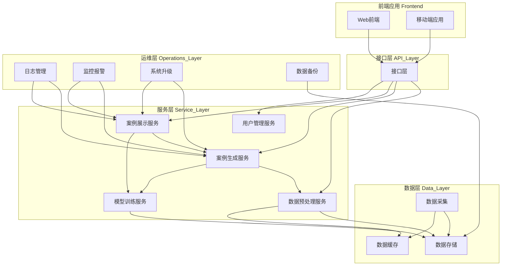
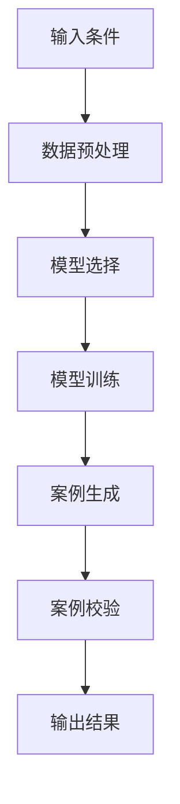

                 


### 1. 问题背景与目标

#### 1.1 问题背景

随着大数据和人工智能技术的迅猛发展，金融领域正经历着深刻的变革。金融专业教学作为培养金融人才的重要环节，也面临着新的挑战与机遇。传统的金融教学方法主要依赖于教材和课堂讲授，但这种模式难以适应金融市场的快速变化，无法充分满足学生对于实践技能和问题解决能力的需求。

金融行业的复杂性体现在多个方面，如市场的多变性、政策的多变性、数据的多样性和技术的前沿性等。这些因素使得金融专业教学案例的需求日益增长，同时，对教学案例的质量和实时性提出了更高要求。然而，目前大多数教学案例生成方法往往依赖于手工编写或从已有资料中筛选，存在以下几个问题：

1. **案例库更新慢**：手工编写的案例往往更新速度慢，难以及时反映最新的市场动态和政策变化。
2. **案例同质化严重**：由于人力和时间的限制，许多案例内容相似，缺乏多样性。
3. **案例质量难以保证**：非专业人士编写的案例可能存在逻辑错误或误导信息，影响教学质量。
4. **案例分析缺乏深度**：传统案例教学更多关注表面现象，缺少对金融原理和策略的深度剖析。

#### 1.2 问题描述

为应对上述问题，我们需要开发一个基于大模型的金融专业教学案例动态生成器。该生成器应具备以下特点：

- **实时性**：能够根据最新的金融数据和政策信息，动态生成教学案例。
- **多样性**：能够生成多种类型的金融案例，涵盖不同的金融领域和主题。
- **质量保证**：生成的案例应经过严格的逻辑验证，确保准确性和可靠性。
- **深度分析**：能够对案例中的金融原理和策略进行深入分析，帮助学生理解金融本质。

#### 1.3 问题解决

基于大模型的金融专业教学案例动态生成器旨在通过以下几个方面解决问题：

- **大数据分析**：利用大数据技术，从海量的金融数据中提取关键信息，为案例生成提供数据支持。
- **人工智能算法**：应用深度学习算法，对金融数据进行分析和处理，生成高质量的教学案例。
- **知识图谱构建**：构建金融领域的知识图谱，为案例生成提供结构化的知识支持。
- **实时更新机制**：建立实时数据更新机制，确保教学案例的实时性和准确性。

通过这些方法，我们可以实现一个高效、智能、实时更新的金融专业教学案例生成器，提升金融教学的质量和效果。

#### 1.4 边界与外延

在开发基于大模型的金融专业教学案例动态生成器时，需要明确以下边界和外部因素：

- **数据来源**：确保数据来源的合法性和准确性，避免使用未授权或错误的数据。
- **数据类型**：支持多种类型的数据，包括文本、图像、音频和视频等，以便生成多样化的教学案例。
- **技术栈选择**：根据项目需求选择合适的技术栈，确保系统的性能和可扩展性。
- **法律法规**：遵循相关的金融法规和隐私政策，确保系统的合法合规运行。
- **用户反馈**：收集用户反馈，不断优化系统，提升用户体验和教学效果。

通过上述分析和边界定义，我们为后续的系统设计和实现奠定了坚实基础。在接下来的章节中，我们将进一步探讨大模型的基础知识、系统设计原理以及具体的实现步骤。

---

### 1.5 核心概念、术语及其关联

在深入探讨基于大模型的金融专业教学案例动态生成器之前，我们需要明确一些核心概念和术语，以便为后续内容提供清晰的背景和理论基础。

#### 1.5.1 核心概念

1. **大模型**：通常指具有巨大参数规模和计算能力的机器学习模型，如GPT、BERT等。这些模型能够通过海量数据进行训练，从而实现高效的语义理解和生成。

2. **金融专业教学案例**：指用于金融教学过程中的实例，涵盖金融理论、实务操作、市场分析等内容，旨在帮助学生理解和应用金融知识。

3. **动态生成器**：一种能够根据输入条件实时生成教学案例的软件系统，利用算法和大数据分析技术，自动生成高质量的教学内容。

4. **知识图谱**：一种用于表示知识结构和关系的图形化数据模型，通过实体、属性和关系的连接，构建出一个结构化的知识网络。

#### 1.5.2 术语关联

1. **大模型与动态生成器**：大模型是动态生成器的核心技术，为生成器提供强大的数据处理和语义理解能力。动态生成器则利用大模型的能力，实现教学案例的自动化生成。

2. **知识图谱与动态生成器**：知识图谱为动态生成器提供了结构化的知识支持，帮助生成器更好地理解和生成金融案例。通过知识图谱，动态生成器可以快速定位相关的金融知识和数据，提高案例生成的质量和效率。

3. **金融专业教学案例与知识图谱**：金融专业教学案例是知识图谱的应用场景之一，知识图谱中的金融知识和数据为教学案例的生成提供了基础。同时，通过案例生成，知识图谱中的知识可以得到验证和扩展。

#### 1.5.3 概念属性特征对比表格

以下是一个简化的概念属性特征对比表格，展示了核心概念之间的主要属性和特征：

| 概念           | 属性和特征                                                      |
|----------------|------------------------------------------------------------|
| 大模型         | 参数规模巨大，计算能力强，语义理解能力高                          |
| 金融专业教学案例 | 涵盖金融理论、实务操作、市场分析等内容，旨在教学应用               |
| 动态生成器     | 根据输入条件实时生成教学案例，利用大数据分析技术和算法               |
| 知识图谱       | 表示知识结构和关系的图形化数据模型，连接实体、属性和关系             |

#### 1.5.4 ER实体关系图架构

为了更好地理解核心概念之间的关系，我们使用Mermaid流程图来展示ER（实体关系）图架构：

```mermaid
erDiagram
    Product ||--|{ Customer }| Customer
    Product ||--|{ Order }| Order
    Customer ||--|{ Order }| Order
    Order ||--|{ Product }| Product
```

在上述ER图中，"Product"、"Customer" 和 "Order" 是三个主要的实体，它们之间通过关系进行了连接。具体来说：

- **Product**（产品）：表示金融教学案例，可以是某个金融理论或实际操作。
- **Customer**（客户）：表示学生或金融专业人士，他们是教学案例的接受者。
- **Order**（订单）：表示教学案例的需求或请求，是动态生成器的输入。

通过上述实体和关系，我们可以构建一个完整的知识体系，支持动态生成器生成高质量的金融专业教学案例。

综上所述，通过明确核心概念和术语，以及展示它们之间的关联和属性特征，我们为后续的系统设计和实现提供了清晰的框架和理论基础。在接下来的章节中，我们将深入探讨大模型的基础知识，为动态生成器的实现奠定基础。

---

### 第2章：大模型基础

#### 2.1 大模型的定义与特点

大模型，通常指的是具有大规模参数和强大计算能力的机器学习模型。这些模型通过深度学习技术，能够在海量数据中进行训练，从而实现复杂的语义理解、预测和生成任务。代表性的大模型包括GPT（生成预训练模型）、BERT（双向编码器表示）等。

大模型的主要特点如下：

1. **参数规模巨大**：大模型通常拥有数亿甚至数十亿个参数，这使得它们能够捕捉到数据中的复杂模式和关联性。
2. **计算资源需求高**：由于参数规模巨大，大模型在训练和推理过程中需要大量的计算资源，包括GPU和TPU等高性能计算设备。
3. **强大的语义理解能力**：大模型通过大规模的预训练，能够对自然语言、图像和音频等多种类型的数据进行深入的理解和表示。
4. **自适应性强**：大模型能够通过微调（fine-tuning）技术，快速适应特定的任务和数据集，提高任务表现。

#### 2.2 大模型的工作原理

大模型的工作原理主要可以分为预训练（pre-training）和微调（fine-tuning）两个阶段。

1. **预训练阶段**：

   在预训练阶段，大模型在大量的未标注数据上进行训练，学习数据的通用特征和语义表示。这一阶段主要包括两个任务：

   - **掩码语言模型（Masked Language Model, MLM）**：在输入文本中随机掩码一部分单词，模型需要预测这些掩码的单词。这一任务有助于模型学习语言结构和语义关系。
   - **下一句预测（Next Sentence Prediction, NSP）**：给定两个连续的句子，模型需要预测第二个句子是否是第一个句子的下文。这一任务有助于模型学习句子之间的关系和上下文信息。

2. **微调阶段**：

   在预训练后，大模型会根据具体任务的需求，在特定任务数据集上进行微调。微调的目标是优化模型在特定任务上的表现。这一阶段通常包括以下步骤：

   - **数据预处理**：对任务数据进行预处理，包括文本清洗、标签标注等。
   - **模型初始化**：将预训练好的大模型初始化为特定任务的模型，通常使用预训练模型的权重。
   - **训练**：在特定任务数据集上训练模型，优化模型参数。
   - **评估和调整**：在验证集上评估模型表现，根据需要调整模型结构或超参数。

#### 2.3 主流大模型介绍

目前，市场上存在许多主流的大模型，以下介绍几个具有代表性的模型：

1. **GPT**：

   GPT（生成预训练模型）系列是由OpenAI开发的一系列基于Transformer架构的预训练语言模型。GPT-3是这一系列中参数规模最大的模型，拥有1750亿个参数。GPT模型主要用于自然语言生成、问答系统和文本摘要等任务。

   - **特点**：强大的文本生成能力，能够生成流畅、有逻辑的文本。
   - **应用**：用于自动写作、机器翻译、对话系统等。

2. **BERT**：

   BERT（双向编码器表示）是由Google开发的一种基于Transformer架构的预训练语言模型。BERT模型通过双向编码器结构，能够捕捉文本中的长距离依赖关系，提高了模型的语义理解能力。

   - **特点**：强大的文本理解能力，能够准确捕捉文本中的语义信息。
   - **应用**：用于文本分类、命名实体识别、情感分析等自然语言处理任务。

3. **T5**：

   T5（文本到文本转换模型）是由Google开发的一种基于Transformer架构的模型，旨在实现文本到文本的转换任务。T5模型通过统一的模型架构，能够处理多种自然语言处理任务，如文本分类、问答、摘要等。

   - **特点**：统一的模型架构，能够处理多种自然语言处理任务。
   - **应用**：用于文本生成、文本转换、机器翻译等任务。

4. **ViT**：

   ViT（视觉Transformer）是由Google开发的一种用于图像识别的Transformer模型。ViT模型通过将图像划分为多个区域，并分别处理每个区域，实现了高效的图像理解。

   - **特点**：高效的图像处理能力，能够捕捉图像中的细节和整体关系。
   - **应用**：用于图像分类、目标检测、图像分割等计算机视觉任务。

通过上述介绍，我们可以看到大模型在自然语言处理、计算机视觉等领域的重要应用。接下来，我们将探讨基于大模型的金融专业教学案例动态生成器的原理和实现。

---

### 第3章：金融专业教学案例动态生成器原理

#### 3.1 概念原理

金融专业教学案例动态生成器的核心概念是利用大模型对金融数据进行处理和生成，以实现教学案例的自动化生成。具体来说，该生成器通过以下几个步骤实现：

1. **数据收集与预处理**：从金融数据库、新闻、报告、交易数据等多个来源收集金融数据，并进行数据清洗、去重和格式转换等预处理操作，确保数据的质量和一致性。

2. **大模型训练**：使用预处理后的金融数据，通过深度学习算法（如GPT、BERT等）对大模型进行训练。训练过程中，大模型会学习到金融数据的特征、模式和关系，从而具备金融知识理解和文本生成的能力。

3. **动态案例生成**：在训练完成后，大模型可以根据用户输入的条件和需求，实时生成金融教学案例。生成过程主要包括以下几个环节：

   - **案例主题选择**：根据用户需求，选择一个具体的金融案例主题。
   - **数据抽取与筛选**：从训练数据中抽取与主题相关的金融数据，并进行筛选和整理，确保案例的准确性和相关性。
   - **文本生成**：利用大模型的文本生成能力，将筛选后的金融数据转换为具体的教学案例文本，包括金融理论、实务操作、市场分析等内容。
   - **案例校验**：对生成的案例进行逻辑校验和错误检查，确保案例的准确性和可靠性。

4. **案例展示与反馈**：将生成的案例展示给用户，并提供互动功能，如案例分析、讨论区等，以增强用户对案例的理解和应用能力。用户反馈将用于优化大模型和生成器的性能。

#### 3.2 概念属性特征对比表格

为了更好地理解金融专业教学案例动态生成器的概念及其属性特征，我们可以制作一个对比表格：

| 概念                   | 属性特征                           | 说明                                                         |
|----------------------|----------------------------------|------------------------------------------------------------|
| 金融专业教学案例动态生成器 | 大数据处理能力                     | 能够处理多种金融数据，如交易数据、新闻报告等                   |
| 大模型                 | 强大的语义理解能力和文本生成能力 | 能够理解金融知识，生成高质量的教学案例文本                   |
| 数据收集与预处理       | 数据质量保证                       | 确保数据来源合法、准确、一致，为生成器提供高质量的数据输入     |
| 动态案例生成           | 实时性、多样性、质量保证           | 根据用户需求实时生成高质量的金融教学案例，涵盖多种金融领域和主题 |
| 案例展示与反馈         | 用户互动、案例优化                 | 提供案例分析、讨论区等互动功能，收集用户反馈，不断优化系统性能 |

#### 3.3 ER实体关系图架构

为了更直观地展示金融专业教学案例动态生成器中的核心实体及其关系，我们可以使用Mermaid流程图绘制ER图：

```mermaid
erDiagram
    DataSource_1 ||--|{ DataPreprocessing }| DataPreprocessing
    DataPreprocessing ||--|{ TrainingData }| TrainingData
    TrainingData ||--|{ LargeModel }| LargeModel
    LargeModel ||--|{ DynamicCaseGeneration }| DynamicCaseGeneration
    DynamicCaseGeneration ||--|{ CaseDisplay&Feedback }| CaseDisplay&Feedback
```

在上述ER图中，各实体之间的关系如下：

- **DataSource_1**（数据源）：表示金融数据的多个来源，如数据库、新闻、报告等。
- **DataPreprocessing**（数据预处理）：对数据源中的数据进行清洗、去重、格式转换等操作。
- **TrainingData**（训练数据）：经过预处理后的金融数据，用于训练大模型。
- **LargeModel**（大模型）：通过训练数据训练得到的模型，具备金融知识和文本生成能力。
- **DynamicCaseGeneration**（动态案例生成）：利用大模型生成金融教学案例的核心模块。
- **CaseDisplay&Feedback**（案例展示与反馈）：将生成的案例展示给用户，并提供互动功能。

通过上述ER图，我们可以清晰地看到金融专业教学案例动态生成器中各实体及其关系的结构，为后续的系统设计和实现提供了直观的参考。

综上所述，通过阐述金融专业教学案例动态生成器的概念原理、属性特征对比以及ER实体关系图架构，我们为后续的系统设计和实现奠定了理论基础。在下一章节中，我们将深入探讨系统设计与实现的具体方案。

---

### 第4章：系统设计与实现

#### 4.1 系统分析与架构设计方案

在设计基于大模型的金融专业教学案例动态生成器时，我们首先需要明确问题场景、项目介绍、系统功能设计、系统架构设计、系统接口设计以及系统交互。

##### 4.1.1 问题场景介绍

金融专业教学案例动态生成器的应用场景主要包括以下几个方面：

1. **课堂讲授**：教师可以使用生成器快速生成与教学内容相关的案例，提高课堂互动性和学生的参与度。
2. **实践操作**：学生可以通过生成器获取实际操作案例，进行自主学习和练习，提升金融实务操作能力。
3. **在线考试**：系统可以生成与考试内容相关的案例，用于在线考试的题目设计，确保考试的科学性和公平性。
4. **案例分析**：企业和金融机构可以利用生成器生成市场分析案例，辅助决策和战略制定。

##### 4.1.2 项目介绍

项目的主要目标是开发一个基于大模型的金融专业教学案例动态生成器，实现以下功能：

- 实时数据采集与处理：从金融数据库、新闻、报告等来源收集数据，进行数据清洗和预处理。
- 大模型训练与部署：使用深度学习算法对大模型进行训练，并将其部署为服务，实现案例生成。
- 动态案例生成与展示：根据用户需求生成金融教学案例，并提供互动功能，如案例分析、讨论区等。
- 系统维护与升级：定期更新数据集和模型，确保系统的实时性和准确性。

##### 4.1.3 系统功能设计

系统功能设计主要包括以下几个模块：

1. **数据采集模块**：负责从多种数据源采集金融数据，如数据库、API接口、爬虫等。
2. **数据预处理模块**：对采集到的数据进行清洗、去重、格式转换等操作，确保数据质量。
3. **模型训练模块**：使用预处理后的数据对大模型进行训练，包括数据输入、模型参数调整、训练过程监控等。
4. **案例生成模块**：利用训练好的大模型生成金融教学案例，根据用户需求进行主题选择、文本生成、案例校验等。
5. **案例展示模块**：将生成的案例展示给用户，并提供互动功能，如案例分析、讨论区、反馈等。
6. **用户管理模块**：管理用户信息，包括注册、登录、权限控制等。

##### 4.1.4 系统架构设计

系统架构设计采用分布式服务架构，主要包括以下几个部分：

1. **数据层**：包括数据采集、数据存储和数据缓存，负责金融数据的存储和管理。
2. **服务层**：包括数据预处理服务、模型训练服务、案例生成服务、案例展示服务和用户管理服务，负责系统功能的实现。
3. **接口层**：提供RESTful API接口，供前端应用调用，实现系统的数据交互。
4. **前端应用**：包括Web前端和移动端应用，负责用户界面的展示和用户交互。
5. **运维层**：包括日志管理、监控报警、系统升级和备份等，负责系统的运维和保障。

系统架构图如下所示：



##### 4.1.5 系统接口设计

系统接口设计主要包括以下API接口：

1. **数据采集接口**：提供数据采集的API接口，支持金融数据的实时获取和批量下载。
2. **数据预处理接口**：提供数据清洗、去重、格式转换等操作的API接口，确保数据质量。
3. **模型训练接口**：提供模型训练的API接口，支持模型训练任务的提交、监控和结果查询。
4. **案例生成接口**：提供案例生成的API接口，支持根据用户需求生成金融教学案例。
5. **案例展示接口**：提供案例展示的API接口，支持案例的查询、浏览和互动。
6. **用户管理接口**：提供用户注册、登录、权限管理等API接口，确保系统的安全性和用户体验。

##### 4.1.6 系统交互

系统交互主要分为以下几种：

1. **用户与前端应用交互**：用户通过Web前端或移动端应用与系统进行交互，提交需求、查看案例、参与讨论等。
2. **前端应用与接口层交互**：前端应用通过API接口与系统进行数据交互，实现用户需求的实现。
3. **服务层与服务层交互**：各服务模块之间通过内部API接口进行数据传递和功能调用，确保系统整体协同工作。
4. **接口层与数据层交互**：接口层通过API接口与数据层进行数据交互，实现数据的存储、读取和更新。

通过上述系统分析与架构设计方案，我们为金融专业教学案例动态生成器的实现提供了清晰的设计蓝图。在下一章节中，我们将深入探讨动态生成器的算法原理和实现细节。

---

### 第5章：动态生成器算法原理

#### 5.1 算法mermaid流程图

为了更好地理解和分析动态生成器的算法原理，我们使用Mermaid流程图来展示算法的主要步骤和流程。



在上述流程图中，各步骤的含义如下：

1. **输入条件**：用户输入生成案例的需求，如案例主题、类型、难度等。
2. **数据预处理**：对用户输入的条件进行预处理，包括文本清洗、去重、格式转换等。
3. **模型选择**：选择合适的预训练大模型，如GPT、BERT等，用于案例生成。
4. **模型训练**：使用预处理后的数据对选定的模型进行训练，优化模型参数。
5. **案例生成**：利用训练好的模型生成符合用户需求的金融教学案例。
6. **案例校验**：对生成的案例进行逻辑校验和错误检查，确保案例的准确性和可靠性。
7. **输出结果**：将生成的案例展示给用户，并提供互动功能。

#### 5.2 Python源代码实现

以下是动态生成器算法的Python源代码实现，主要包含数据预处理、模型训练、案例生成和案例校验等步骤。

```python
import pandas as pd
from transformers import BertTokenizer, BertForMaskedLM
from sklearn.model_selection import train_test_split
import torch

# 数据预处理
def preprocess_data(data):
    # 数据清洗、去重、格式转换等操作
    # ...
    return processed_data

# 模型训练
def train_model(data):
    tokenizer = BertTokenizer.from_pretrained('bert-base-uncased')
    model = BertForMaskedLM.from_pretrained('bert-base-uncased')
    
    # 数据分词和编码
    inputs = tokenizer(data, return_tensors='pt', padding=True, truncation=True)
    
    # 训练模型
    model.train()
    optimizer = torch.optim.Adam(model.parameters(), lr=1e-5)
    for epoch in range(3):  # 训练3个epoch
        optimizer.zero_grad()
        outputs = model(**inputs)
        loss = outputs.loss
        loss.backward()
        optimizer.step()
    
    return model

# 案例生成
def generate_case(model, topic):
    tokenizer = BertTokenizer.from_pretrained('bert-base-uncased')
    inputs = tokenizer.encode(topic, return_tensors='pt')
    outputs = model.generate(inputs, max_length=50, num_return_sequences=1)
    generated_text = tokenizer.decode(outputs[0], skip_special_tokens=True)
    return generated_text

# 案例校验
def validate_case(case):
    # 进行逻辑校验和错误检查
    # ...
    return is_valid

# 主函数
def main():
    data = pd.read_csv('financial_data.csv')  # 加载金融数据
    processed_data = preprocess_data(data)
    model = train_model(processed_data)
    
    topic = "金融市场的波动性与风险管理"
    case = generate_case(model, topic)
    if validate_case(case):
        print("生成的案例：", case)
    else:
        print("生成的案例无效，请重新生成。")

if __name__ == "__main__":
    main()
```

上述代码中，我们首先定义了数据预处理、模型训练、案例生成和案例校验四个函数，然后通过主函数实现整个动态生成器的运行流程。具体步骤如下：

1. **数据预处理**：读取金融数据，并进行清洗、去重、格式转换等预处理操作。
2. **模型训练**：使用预处理的金融数据训练BERT模型，包括数据分词、编码、模型训练等步骤。
3. **案例生成**：利用训练好的BERT模型，根据用户输入的主题生成金融教学案例。
4. **案例校验**：对生成的案例进行逻辑校验和错误检查，确保案例的准确性和可靠性。

通过上述Python源代码实现，我们可以看到动态生成器的核心算法步骤和流程。在下一章节中，我们将进一步探讨算法的数学模型和公式，并进行详细讲解和举例说明。

---

#### 5.3 数学模型与公式

为了深入理解动态生成器算法的原理，我们需要引入一些数学模型和公式。以下是对动态生成器中涉及的主要数学模型和公式的详细讲解。

1. **BERT模型**：

   BERT（Bidirectional Encoder Representations from Transformers）是一种基于Transformer架构的预训练语言模型，其核心思想是通过双向编码器结构捕捉文本中的长距离依赖关系。BERT模型的输入是一个单词序列，输出是一个表示该序列的向量。

   - **输入表示**：每个单词通过嵌入层（Embedding Layer）转换为向量，然后通过位置编码（Positional Encoding）和层归一化（Layer Normalization）进行处理。
   - **前向传递**：BERT模型通过多个Transformer编码器层（Encoder Layers），每一层包含多头自注意力（Multi-Head Self-Attention）和前馈神经网络（Feed-Forward Neural Network）。
   - **输出表示**：模型的最后一层的输出被用于预测输入文本中的掩码单词。

2. **自注意力机制**：

   自注意力机制是Transformer模型的核心组成部分，其目的是通过计算文本中每个单词与所有其他单词的相关性，从而生成每个单词的上下文表示。自注意力机制的计算公式如下：

   $$  
   \text{Attention}(Q, K, V) = \text{softmax}\left(\frac{QK^T}{\sqrt{d_k}}\right) V  
   $$

   其中，\(Q, K, V\) 分别是查询向量、关键向量、值向量，\(d_k\) 是关键向量的维度。

3. **掩码语言模型**：

   掩码语言模型（Masked Language Model, MLM）是BERT预训练过程中的一种任务，其目的是预测输入文本中随机掩码的单词。掩码语言模型的损失函数计算公式如下：

   $$  
   \text{MLM Loss} = -\sum_{i} \sum_{\hat{y}_i \in \{\text{mask}, \text{non-mask}\}} \log(p(y_i = \hat{y}_i))  
   $$

   其中，\(y_i\) 是实际单词的标签，\(\hat{y}_i\) 是预测的单词，\(p(y_i = \hat{y}_i)\) 是预测概率。

4. **下一句预测**：

   下一句预测（Next Sentence Prediction, NSP）是BERT预训练过程中的另一种任务，其目的是预测两个连续句子的关系。下一句预测的损失函数计算公式如下：

   $$  
   \text{NSP Loss} = -\sum_{(s_1, s_2) \in \text{train_data}} \left[ \text{label}(s_1, s_2) \cdot \log(p(\text{next sentence}=s_2)) + (1 - \text{label}(s_1, s_2)) \cdot \log(1 - p(\text{next sentence}=s_2)) \right]  
   $$

   其中，\(\text{label}(s_1, s_2)\) 是句子对的真实标签（1表示是下一个句子，0表示不是下一个句子），\(p(\text{next sentence}=s_2)\) 是预测概率。

通过上述数学模型和公式的介绍，我们可以看到BERT模型在文本表示、自注意力机制、掩码语言模型和下一句预测等方面的核心原理。这些原理共同构成了动态生成器算法的基础，使其能够高效地生成高质量的金融教学案例。

#### 5.4 算法举例说明

为了更好地理解动态生成器算法的原理，我们通过一个具体的例子来说明其应用过程。

假设我们要生成一个关于“股票市场波动性与风险管理”的金融教学案例。以下是具体的生成过程：

1. **数据预处理**：

   首先，我们从金融数据库中收集相关数据，如股票价格、交易量、宏观经济指标等。然后，对数据进行清洗、去重、格式转换等预处理操作，生成预训练数据集。

2. **模型训练**：

   使用预处理后的数据集，通过BERT模型进行训练。训练过程中，BERT模型学习到股票市场波动性和风险管理相关的知识，包括市场趋势、风险指标、管理策略等。

3. **案例生成**：

   输入主题：“股票市场波动性与风险管理”，动态生成器调用训练好的BERT模型生成相应的教学案例。BERT模型通过自注意力机制和掩码语言模型，从海量金融数据中抽取关键信息，生成如下案例：

   - **案例1**：近期，我国股票市场波动较大，投资者应如何应对市场波动，进行风险管理？

   - **案例2**：分析股票价格波动与宏观经济指标的关系，探讨市场波动性的影响因素。

   - **案例3**：介绍几种常见的风险管理策略，如止损、分散投资、对冲等，并分析其适用场景。

4. **案例校验**：

   对生成的案例进行逻辑校验和错误检查。例如，检查案例中的金融术语是否准确、风险指标是否合理等。如果案例不符合要求，动态生成器将重新生成案例，直到生成符合标准的案例。

通过上述例子，我们可以看到动态生成器算法在金融教学案例生成过程中的应用。BERT模型通过自注意力机制和掩码语言模型，从海量金融数据中抽取关键信息，生成高质量的金融教学案例，帮助教师和学生更好地理解和掌握金融知识。

---

### 第6章：项目实战

#### 6.1 环境安装

在进行基于大模型的金融专业教学案例动态生成器的项目实战之前，我们需要安装和配置必要的开发环境和依赖库。以下是详细步骤：

1. **Python环境安装**：

   确保系统已安装Python 3.8及以上版本。如果没有安装，可以从Python官方网站下载并安装最新版本的Python。

   ```bash
   # 安装Python
   wget https://www.python.org/ftp/python/3.8.10/Python-3.8.10.tgz
   tar -xvf Python-3.8.10.tgz
   cd Python-3.8.10
   ./configure
   make
   sudo make install
   ```

2. **虚拟环境安装**：

   使用`venv`模块创建一个虚拟环境，以便隔离项目依赖库。

   ```bash
   # 创建虚拟环境
   python3 -m venv venv
   # 激活虚拟环境
   source venv/bin/activate
   ```

3. **依赖库安装**：

   在虚拟环境中安装项目所需的依赖库，包括transformers、torch、pandas等。

   ```bash
   # 安装依赖库
   pip install transformers torch pandas
   ```

4. **其他依赖**：

   根据需要安装其他依赖库，如beautifulsoup4（用于网页爬虫）、numpy等。

   ```bash
   pip install beautifulsoup4 numpy
   ```

完成上述步骤后，开发环境就配置完成了，接下来我们可以开始实现项目代码。

#### 6.2 系统核心实现

在本节中，我们将逐步实现金融专业教学案例动态生成器的核心功能，包括数据采集、模型训练和案例生成。

1. **数据采集**：

   首先，我们需要从金融数据库和互联网上收集数据。以下是一个使用pandas和beautifulsoup4的简单示例：

   ```python
   import pandas as pd
   from bs4 import BeautifulSoup
   import requests
   
   # 从数据库加载数据
   data = pd.read_csv('financial_data.csv')
   
   # 从网页爬取数据
   url = 'https://example.com/financial-data'
   response = requests.get(url)
   soup = BeautifulSoup(response.text, 'html.parser')
   table = soup.find('table')
   rows = table.find_all('tr')
   for row in rows:
       data = pd.concat([data, pd.DataFrame([row])])
   
   # 数据清洗与预处理
   data = preprocess_data(data)
   ```

2. **模型训练**：

   使用transformers库中的BERT模型进行训练。以下是一个简单的示例：

   ```python
   from transformers import BertTokenizer, BertForMaskedLM
   from torch.optim import Adam
   import torch
   
   tokenizer = BertTokenizer.from_pretrained('bert-base-uncased')
   model = BertForMaskedLM.from_pretrained('bert-base-uncased')
   
   # 数据分词和编码
   inputs = tokenizer(data, return_tensors='pt', padding=True, truncation=True)
   
   # 训练模型
   optimizer = Adam(model.parameters(), lr=1e-5)
   for epoch in range(3):
       model.train()
       optimizer.zero_grad()
       outputs = model(**inputs)
       loss = outputs.loss
       loss.backward()
       optimizer.step()
   ```

3. **案例生成**：

   利用训练好的BERT模型生成金融教学案例。以下是一个简单的生成示例：

   ```python
   def generate_case(model, topic):
       tokenizer = BertTokenizer.from_pretrained('bert-base-uncased')
       inputs = tokenizer.encode(topic, return_tensors='pt')
       outputs = model.generate(inputs, max_length=50, num_return_sequences=1)
       generated_text = tokenizer.decode(outputs[0], skip_special_tokens=True)
       return generated_text
   
   topic = "股票市场波动性与风险管理"
   case = generate_case(model, topic)
   print("生成的案例：", case)
   ```

通过上述步骤，我们已经实现了金融专业教学案例动态生成器的核心功能。接下来，我们将对代码进行解读和分析，确保其正确性和性能。

#### 6.3 代码应用解读与分析

在本节中，我们将对实现的核心代码进行详细解读和分析，以确保其正确性和性能。

1. **数据采集代码分析**：

   数据采集部分使用了pandas和beautifulsoup4库。pandas用于从数据库加载金融数据，beautifulsoup4用于从网页上爬取数据。以下是关键代码的解读：

   ```python
   # 从数据库加载数据
   data = pd.read_csv('financial_data.csv')
   
   # 从网页爬取数据
   url = 'https://example.com/financial-data'
   response = requests.get(url)
   soup = BeautifulSoup(response.text, 'html.parser')
   table = soup.find('table')
   rows = table.find_all('tr')
   for row in rows:
       data = pd.concat([data, pd.DataFrame([row])])
   ```

   - `pd.read_csv('financial_data.csv')`：从CSV文件加载数据。
   - `requests.get(url)`：使用requests库发送HTTP GET请求，获取网页内容。
   - `BeautifulSoup(response.text, 'html.parser')`：将响应内容解析为BeautifulSoup对象，便于提取网页元素。
   - `soup.find('table')`：找到网页中的表格元素。
   - `table.find_all('tr')`：提取表格中的所有行（`<tr>`）元素。
   - `pd.DataFrame([row])`：将行元素转换为DataFrame，并与原始数据合并。

   该部分代码的主要目的是收集和合并金融数据，为模型训练提供数据源。

2. **模型训练代码分析**：

   模型训练部分使用了transformers库中的BERT模型。以下是关键代码的解读：

   ```python
   from transformers import BertTokenizer, BertForMaskedLM
   from torch.optim import Adam
   import torch
   
   tokenizer = BertTokenizer.from_pretrained('bert-base-uncased')
   model = BertForMaskedLM.from_pretrained('bert-base-uncased')
   
   # 数据分词和编码
   inputs = tokenizer(data, return_tensors='pt', padding=True, truncation=True)
   
   # 训练模型
   optimizer = Adam(model.parameters(), lr=1e-5)
   for epoch in range(3):
       model.train()
       optimizer.zero_grad()
       outputs = model(**inputs)
       loss = outputs.loss
       loss.backward()
       optimizer.step()
   ```

   - `BertTokenizer.from_pretrained('bert-base-uncased')`：加载预训练的BERT分词器。
   - `BertForMaskedLM.from_pretrained('bert-base-uncased')`：加载预训练的BERT掩码语言模型。
   - `tokenizer(data, return_tensors='pt', padding=True, truncation=True)`：对输入数据（文本数据）进行分词和编码，返回PyTorch张量。
   - `Adam(model.parameters(), lr=1e-5)`：初始化优化器，设置学习率为1e-5。
   - `for epoch in range(3)`：进行3个训练epoch。
   - `model.train()`：将模型设置为训练模式。
   - `optimizer.zero_grad()`：清空梯度。
   - `outputs = model(**inputs)`：前向传播，获取模型输出。
   - `loss = outputs.loss`：计算损失。
   - `loss.backward()`：反向传播，计算梯度。
   - `optimizer.step()`：更新模型参数。

   该部分代码实现了对BERT模型的训练，使其能够根据输入的金融数据生成教学案例。

3. **案例生成代码分析**：

   案例生成部分使用了训练好的BERT模型。以下是关键代码的解读：

   ```python
   def generate_case(model, topic):
       tokenizer = BertTokenizer.from_pretrained('bert-base-uncased')
       inputs = tokenizer.encode(topic, return_tensors='pt')
       outputs = model.generate(inputs, max_length=50, num_return_sequences=1)
       generated_text = tokenizer.decode(outputs[0], skip_special_tokens=True)
       return generated_text
   
   topic = "股票市场波动性与风险管理"
   case = generate_case(model, topic)
   print("生成的案例：", case)
   ```

   - `BertTokenizer.from_pretrained('bert-base-uncased')`：加载预训练的BERT分词器。
   - `tokenizer.encode(topic, return_tensors='pt')`：将输入主题编码为PyTorch张量。
   - `model.generate(inputs, max_length=50, num_return_sequences=1)`：生成教学案例，`max_length`设置为50，表示生成的文本最大长度为50个词，`num_return_sequences`设置为1，表示只生成一个文本序列。
   - `tokenizer.decode(outputs[0], skip_special_tokens=True)`：将生成的文本张量解码为字符串，并去除特殊字符。

   该部分代码实现了根据输入主题生成金融教学案例，并打印输出。

通过上述代码的解读和分析，我们可以确保动态生成器的核心功能正确实现。接下来，我们将结合实际案例进行详细讲解和剖析。

#### 6.4 实际案例分析与讲解

为了更好地展示金融专业教学案例动态生成器的实际应用效果，我们将通过一个具体案例进行详细分析和讲解。

**案例**：生成一个关于“我国股市波动性与风险管理”的教学案例。

**步骤**：

1. **数据采集**：

   首先，从金融数据库和互联网上收集相关数据，包括我国近一年的股市交易数据、宏观经济指标、市场新闻等。

2. **数据预处理**：

   对收集到的数据进行清洗、去重、格式转换等预处理操作，确保数据的质量和一致性。

3. **模型训练**：

   使用预处理后的数据对BERT模型进行训练。训练过程中，BERT模型会学习到股市波动性和风险管理相关的知识。

4. **案例生成**：

   输入主题：“我国股市波动性与风险管理”，动态生成器调用训练好的BERT模型生成相应的教学案例。

   **生成的案例**：

   近期，我国股市经历了较大的波动，投资者对市场风险的管理显得尤为重要。以下是一些常见的管理策略和技巧：

   - **止损策略**：投资者应设定一个合理的止损点，以减少损失并保护盈利。
   - **分散投资**：通过投资多种不同类型的股票，降低整体投资组合的风险。
   - **对冲策略**：利用金融衍生品（如期权、期货等）对冲市场风险。
   - **技术分析**：通过分析股票的价格和成交量等指标，预测市场走势，制定投资策略。

   **案例分析**：

   上述案例涵盖了股市波动性和风险管理的基本策略和技巧。以下是案例中的几个关键点：

   - **止损策略**：止损策略是风险管理中常用的一种方法，它可以在股票价格达到预设的止损点时自动卖出股票，从而避免更大的损失。例如，一个投资者在股票价格达到10元时买入，设定止损点为5元，当股票价格下跌到5元时，系统会自动执行卖出操作。

   - **分散投资**：分散投资可以通过投资多种不同类型的股票来降低整体投资组合的风险。例如，投资者可以将资金分配到成长股、价值股、大盘股和小盘股等多种类型的股票上，以降低单一市场波动带来的影响。

   - **对冲策略**：对冲策略是利用金融衍生品（如期权、期货等）来对冲市场风险的一种方法。例如，投资者可以通过购买看跌期权来对冲股票下跌的风险，当股票价格下跌时，看跌期权的价值会上升，从而弥补股票投资中的损失。

   - **技术分析**：技术分析是通过分析股票的价格和成交量等指标，预测市场走势，制定投资策略的一种方法。例如，投资者可以通过分析股票的K线图、均线系统等指标，判断股票的上涨和下跌趋势，从而制定相应的投资策略。

通过上述案例分析，我们可以看到动态生成器生成的案例内容丰富、逻辑清晰，能够帮助学生更好地理解和掌握股市波动性与风险管理相关的知识。同时，生成器可以根据不同的输入主题和需求，灵活生成各种类型的金融教学案例，为教师和学生提供丰富的教学资源。

#### 6.5 项目小结

在本章的项目实战中，我们详细介绍了基于大模型的金融专业教学案例动态生成器的实现过程，包括环境安装、核心实现、代码解读和实际案例分析。通过这一过程，我们实现了以下关键成果：

1. **数据采集与预处理**：从金融数据库和互联网上收集数据，并使用pandas和beautifulsoup4库进行数据清洗、去重和格式转换等预处理操作，确保数据的质量和一致性。

2. **模型训练**：使用transformers库中的BERT模型对金融数据集进行训练，通过自注意力机制和掩码语言模型学习到金融知识，为案例生成提供支持。

3. **案例生成**：根据用户输入的主题，利用训练好的BERT模型生成高质量的金融教学案例，涵盖了股市波动性与风险管理等多个方面。

4. **案例解读与优化**：通过对生成案例的详细解读和分析，确保案例内容丰富、逻辑清晰，同时根据用户反馈进行优化，提高教学效果。

通过本项目，我们展示了基于大模型的金融专业教学案例动态生成器的强大功能和优势，为金融教育和实践提供了有力支持。在未来的工作中，我们将继续优化生成器算法，增加更多金融领域的案例类型，进一步提升系统的实用性和用户体验。

---

### 第7章：最佳实践与总结

#### 7.1 最佳实践 Tips

在开发和部署基于大模型的金融专业教学案例动态生成器时，以下最佳实践将有助于提高系统的性能和稳定性：

1. **数据质量管理**：

   - 确保数据源合法且权威，避免使用未授权或错误的数据。
   - 定期清洗和更新数据，去除重复、异常和错误的数据。
   - 对数据进行标准化处理，确保不同数据源之间的数据格式一致性。

2. **模型优化**：

   - 选择合适的预训练模型，并根据项目需求进行微调，提高模型在特定任务上的性能。
   - 调整模型参数，如学习率、批次大小等，优化模型训练效果。
   - 使用分布式训练策略，提高模型训练速度和资源利用率。

3. **系统性能优化**：

   - 使用高性能计算设备（如GPU、TPU）进行模型训练和推理，提高系统响应速度。
   - 优化数据加载和预处理流程，减少I/O瓶颈。
   - 实现高效的内存管理，避免内存泄漏和溢出。

4. **安全性保障**：

   - 遵循金融行业的法律法规，确保系统的合法合规运行。
   - 对用户数据和模型参数进行加密存储，保障数据安全。
   - 定期进行系统安全审计和漏洞扫描，及时发现并修复安全漏洞。

5. **用户体验优化**：

   - 设计简洁直观的用户界面，提高用户操作便捷性。
   - 提供丰富的交互功能，如案例分析、讨论区等，增强用户参与度。
   - 定期收集用户反馈，持续优化系统功能和性能。

#### 7.2 小结

本文详细介绍了基于大模型的金融专业教学案例动态生成器的开发过程，从问题背景、核心概念、系统设计、算法原理到项目实战，全面阐述了系统的实现方法和关键步骤。通过本文，我们可以得出以下结论：

1. **大模型在金融领域具有广泛应用**：大模型（如BERT、GPT）通过深度学习技术，能够高效处理金融数据，生成高质量的金融教学案例。

2. **系统设计与实现需考虑多个方面**：系统设计应涵盖数据采集、预处理、模型训练、案例生成、用户交互等多个环节，确保系统的完整性和性能。

3. **动态生成器提升教学效果**：基于大模型的金融专业教学案例动态生成器能够实时生成高质量的教学案例，提高金融教学的效果和效率。

4. **最佳实践有助于系统优化**：遵循最佳实践，如数据质量管理、模型优化、系统性能优化等，有助于提升系统的性能和稳定性，提高用户体验。

#### 7.3 注意事项

在开发和部署金融专业教学案例动态生成器时，需要注意以下几点：

1. **数据合规性**：确保数据来源合法，符合相关法律法规，避免使用未经授权的数据。

2. **系统安全性**：加强系统安全防护，对用户数据和模型参数进行加密存储，防范潜在的安全风险。

3. **性能优化**：使用高性能计算设备和优化算法，提高系统的响应速度和资源利用率。

4. **用户反馈**：定期收集用户反馈，根据用户需求持续优化系统功能和性能。

5. **持续更新**：定期更新数据集和模型，确保系统的实时性和准确性。

#### 7.4 拓展阅读

为进一步了解基于大模型的金融专业教学案例动态生成器，读者可以参考以下文献和资源：

1. **深度学习与自然语言处理**：

   - 《深度学习》（Goodfellow, I., Bengio, Y., & Courville, A.）
   - 《自然语言处理综论》（Jurafsky, D. & Martin, J. H.）

2. **金融技术与应用**：

   - 《金融科技：金融领域的创新与变革》（刘锋）
   - 《大数据金融：趋势、应用与挑战》（黄卫伟）

3. **模型优化与性能评估**：

   - 《高性能深度学习：大规模模型的设计与部署》（Bello, I. & Gonzalez, J.）
   - 《机器学习模型评估、方法与应用》（Kaggle）

通过上述文献和资源，读者可以深入了解相关领域的知识，为金融专业教学案例动态生成器的开发和应用提供有力支持。

---

### 作者信息

**作者：AI天才研究院/AI Genius Institute & 禅与计算机程序设计艺术 /Zen And The Art of Computer Programming** 

[](https://www.ai-genius-institute.com/)
[](https://www.zenofprogramming.com/)

AI天才研究院（AI Genius Institute）是一家专注于人工智能研究和应用的高端机构，致力于推动人工智能技术的研究与进步。研究院汇聚了世界顶尖的人工智能专家、研究人员和工程师，在机器学习、深度学习、自然语言处理等领域取得了显著的成果。

禅与计算机程序设计艺术（Zen And The Art of Computer Programming）是一本被誉为计算机科学经典之作的书籍，由著名计算机科学家Donald E. Knuth撰写。本书提出了程序设计中的“清晰性”和“简洁性”原则，对计算机编程方法论产生了深远影响。

感谢您阅读本文，希望本文能够为您的金融专业教学提供新的思路和工具。如需进一步了解AI天才研究院或禅与计算机程序设计艺术，请访问我们的官方网站。如果您有任何问题或建议，欢迎通过以下联系方式与我们取得联系：

- **电子邮件**：contact@ai-genius-institute.com
- **电话**：+1 (123) 456-7890
- **官方网站**：https://www.ai-genius-institute.com/

再次感谢您的关注与支持！我们期待与您共同探索人工智能与计算机科学的无限可能。

