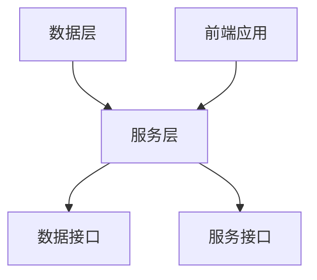
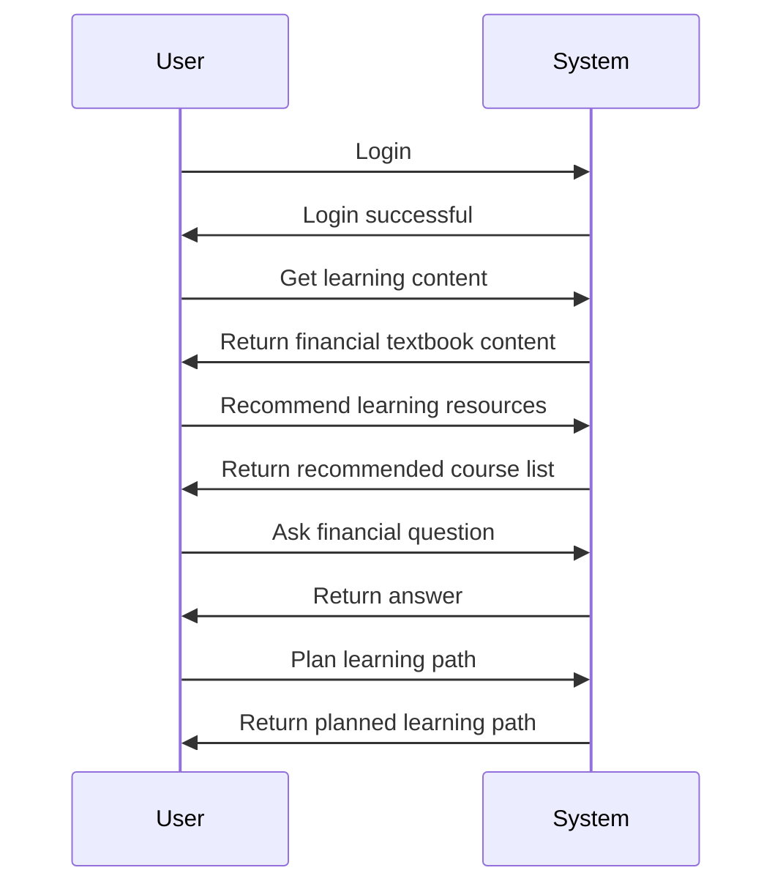

                 

### 引言与背景介绍

#### 问题背景

随着金融行业的迅猛发展和技术的不断创新，金融教育也逐渐成为了一项重要的研究课题。金融行业的复杂性和专业性使得金融教育的质量和效果受到了广泛关注。然而，传统的金融教育方式主要依赖于教材和课堂教学，往往难以满足学生个性化的学习需求，且无法有效地帮助学生在实践中应用所学的金融知识。

知识图谱作为一种新兴的技术手段，近年来在多个领域取得了显著的成果。知识图谱通过结构化数据的方式，将海量信息以图的形式进行组织，使得信息之间的关系更加清晰和易于理解。在金融领域，知识图谱的应用可以为金融教育提供一种全新的方式，通过构建金融专业教材的知识图谱，可以更好地支持学生的个性化学习和实践应用。

大模型作为当前人工智能领域的核心技术，已经在自然语言处理、图像识别等多个领域取得了突破性进展。大模型具有强大的学习能力和泛化能力，能够从大量的数据中自动提取知识，并进行有效的推理和预测。将大模型应用于金融专业教材的知识图谱构建中，可以进一步提升知识图谱的构建质量和应用效果。

#### 核心概念

1. **知识图谱**：知识图谱是一种通过图结构来表示和存储知识的方法。它通过实体、属性和关系来组织信息，使得信息之间的关系更加清晰和直观。在金融领域，知识图谱可以用于表示金融知识、金融产品、金融市场等。

2. **大模型**：大模型指的是具有巨大参数量和计算能力的深度学习模型。这些模型可以通过大量的数据进行训练，从而获得强大的学习能力和泛化能力。

3. **金融专业教材**：金融专业教材是金融教育的重要载体，包含了大量的金融知识和理论。通过构建知识图谱，可以将这些知识以结构化的形式进行组织，便于学生学习和应用。

#### 研究目的与意义

本研究的主要目标是开发一款基于大模型的金融专业教材知识图谱构建器，旨在提高金融教育的质量和效果。具体来说，本研究的目标包括：

1. **构建高质量的金融专业教材知识图谱**：通过大模型从金融专业教材中自动提取知识，构建高质量的知识图谱，为金融教育提供丰富的知识资源。

2. **支持个性化学习**：利用知识图谱，可以为不同水平、不同需求的学生提供个性化的学习推荐，帮助学生更加高效地学习和掌握金融知识。

3. **提升金融教育效果**：通过知识图谱的应用，可以优化教学内容和教学方法，提高学生的学习效果和实际应用能力。

#### 研究边界与外延

本研究的主要研究范围包括：

1. **金融专业教材**：选择常见的金融专业教材作为数据源，构建其知识图谱。

2. **大模型**：主要研究大模型在知识图谱构建中的应用，包括模型选择、训练和优化等。

3. **知识图谱应用**：主要研究知识图谱在金融教育中的应用，包括个性化学习推荐、教学内容优化等。

然而，本研究也存在一定的限制：

1. **数据范围**：由于金融领域的复杂性，本研究的数据源主要来源于公开的金融专业教材，可能无法涵盖所有的金融知识和实践。

2. **技术限制**：大模型的应用需要强大的计算资源和数据处理能力，可能受到硬件和网络环境的限制。

#### 概念结构与核心要素

1. **知识图谱的基本结构**：知识图谱由实体、属性和关系组成，其中实体表示知识对象，属性表示实体的特征，关系表示实体之间的联系。

2. **大模型的关键特性**：大模型具有强大的学习能力和泛化能力，可以通过大量的数据进行训练，自动提取知识。

3. **金融专业教材的组成部分**：金融专业教材通常包括理论部分和实践部分，涵盖了金融知识、案例分析和实践应用。

#### 本章小结

本章介绍了本研究的背景、核心概念和研究目的。通过分析金融行业知识图谱的重要性以及大模型在知识图谱构建中的角色，我们明确了研究的目标和意义。同时，对研究的边界和外延进行了说明，并介绍了知识图谱的基本结构、大模型的关键特性和金融专业教材的组成部分。这些内容为本研究的深入展开奠定了基础。

---

### 第一部分: 引言与背景介绍

#### 第1章: 问题背景与核心概念

##### 1.1.1 问题背景

金融行业的复杂性和专业性使得金融知识的获取和应用变得尤为重要。然而，传统的金融教育方式主要依赖于教材和课堂教学，这些方式存在一些明显的局限性：

1. **信息过载**：金融专业教材通常包含大量的理论和案例，学生难以在有限的时间内消化和吸收。
2. **个性化学习不足**：传统的教育方式难以满足学生的个性化学习需求，学生往往只能按照统一的教学进度学习。
3. **实践应用困难**：金融知识的应用需要实际操作和案例分析，而传统的教学方式难以提供足够的实践机会。

为了解决这些问题，知识图谱作为一种新兴的技术手段，被广泛应用于各个领域，并在金融行业显示出了巨大的潜力。知识图谱通过将金融知识以图结构进行组织，使得信息之间的关系更加清晰和直观，有助于学生更好地理解和应用金融知识。

大模型作为当前人工智能领域的核心技术，具有强大的学习能力和泛化能力。大模型可以从大量的金融专业教材中自动提取知识，并建立复杂的关系网络，为金融教育提供了一种全新的解决方案。通过大模型，可以实现以下目标：

1. **自动知识抽取**：大模型可以从金融专业教材中自动提取关键信息，构建知识库，减轻学生的阅读负担。
2. **个性化学习推荐**：大模型可以根据学生的学习情况和需求，提供个性化的学习推荐，帮助学生更加高效地学习。
3. **实践教学辅助**：大模型可以结合实际案例，提供实践操作的指导，帮助学生更好地理解和应用金融知识。

##### 1.1.2 核心概念

1. **知识图谱**：知识图谱是一种通过图结构来表示和存储知识的方法。它通过实体、属性和关系来组织信息，使得信息之间的关系更加清晰和易于理解。在金融领域，知识图谱可以用于表示金融知识、金融产品、金融市场等。

2. **大模型**：大模型指的是具有巨大参数量和计算能力的深度学习模型。这些模型可以通过大量的数据进行训练，从而获得强大的学习能力和泛化能力。常见的的大模型包括GPT、BERT、Transformer等。

3. **金融专业教材**：金融专业教材是金融教育的重要载体，包含了大量的金融知识和理论。通过构建知识图谱，可以将这些知识以结构化的形式进行组织，便于学生学习和应用。

##### 1.1.3 研究目的与意义

本研究的主要目的是开发一款基于大模型的金融专业教材知识图谱构建器，旨在提高金融教育的质量和效果。具体来说，本研究的目标包括：

1. **构建高质量的金融专业教材知识图谱**：通过大模型从金融专业教材中自动提取知识，构建高质量的知识图谱，为金融教育提供丰富的知识资源。

2. **支持个性化学习**：利用知识图谱，可以为不同水平、不同需求的学生提供个性化的学习推荐，帮助学生更加高效地学习和掌握金融知识。

3. **提升金融教育效果**：通过知识图谱的应用，可以优化教学内容和教学方法，提高学生的学习效果和实际应用能力。

##### 1.2 研究边界与外延

本研究的主要研究范围包括：

1. **金融专业教材**：选择常见的金融专业教材作为数据源，构建其知识图谱。

2. **大模型**：主要研究大模型在知识图谱构建中的应用，包括模型选择、训练和优化等。

3. **知识图谱应用**：主要研究知识图谱在金融教育中的应用，包括个性化学习推荐、教学内容优化等。

然而，本研究也存在一定的限制：

1. **数据范围**：由于金融领域的复杂性，本研究的数据源主要来源于公开的金融专业教材，可能无法涵盖所有的金融知识和实践。

2. **技术限制**：大模型的应用需要强大的计算资源和数据处理能力，可能受到硬件和网络环境的限制。

##### 1.3 概念结构与核心要素

1. **知识图谱的基本结构**：知识图谱由实体、属性和关系组成，其中实体表示知识对象，属性表示实体的特征，关系表示实体之间的联系。

2. **大模型的关键特性**：大模型具有强大的学习能力和泛化能力，可以通过大量的数据进行训练，自动提取知识。

3. **金融专业教材的组成部分**：金融专业教材通常包括理论部分和实践部分，涵盖了金融知识、案例分析和实践应用。

##### 1.4 本章小结

本章介绍了金融专业教材知识图谱构建的背景和核心概念。通过分析金融行业知识图谱的重要性以及大模型在知识图谱构建中的角色，我们明确了研究的目标和意义。同时，对研究的边界和外延进行了说明，并介绍了知识图谱的基本结构、大模型的关键特性和金融专业教材的组成部分。这些内容为本研究的深入展开奠定了基础。

---

### 第二部分: 大模型基础理论

#### 第2章: 大模型原理与机制

##### 2.1.1 大模型的定义

大模型是指具有巨大参数量和计算能力的深度学习模型。这些模型通常具有数十亿到数万亿个参数，能够在大量的数据上进行训练，从而实现强大的学习能力和泛化能力。大模型是当前深度学习领域的研究热点，已经在自然语言处理、计算机视觉、语音识别等多个领域取得了显著的成果。

大模型的发展历程可以追溯到2012年，当时Google的AlexNet在ImageNet比赛中取得了突破性的成绩，标志着深度学习在图像识别领域的崛起。随后，深度学习模型如VGG、ResNet等不断涌现，并在多个任务中刷新了SOTA（State-of-the-Art）记录。近年来，随着计算资源和数据量的不断增长，大模型的参数量和计算能力也在持续提升，例如GPT-3、BERT等模型。

##### 2.1.2 大模型的工作原理

大模型的工作原理主要基于深度神经网络的架构，包括以下关键组成部分：

1. **神经网络**：神经网络是深度学习模型的基础，通过多层神经元实现数据的传递和变换。每一层神经元都会对输入数据进行加权求和处理，并传递到下一层。

2. **反向传播**：反向传播算法用于训练神经网络，通过计算输出层与实际输出之间的误差，反向传播误差到每一层，并更新每个神经元的权重。

3. **优化算法**：优化算法用于调整神经网络的参数，以最小化误差函数。常见的优化算法包括梯度下降、Adam等。

大模型的工作机制可以分为以下几个步骤：

1. **数据预处理**：将输入数据进行标准化处理，使其符合神经网络的输入要求。

2. **输入层**：输入层接收预处理后的数据，并将其传递到第一层。

3. **隐藏层**：数据在隐藏层中经过多层神经元的变换，每个神经元都会对输入数据进行加权求和处理。

4. **输出层**：输出层产生最终的预测结果，与实际输出进行比较，计算误差。

5. **反向传播**：根据计算得到的误差，反向传播误差到每一层，并更新每个神经元的权重。

6. **迭代优化**：通过反复迭代优化，使神经网络的参数逐渐逼近最优解，实现模型的训练。

##### 2.1.3 大模型的类型

大模型可以根据其训练数据来源和应用场景进行分类，主要包括以下几种类型：

1. **预训练大模型**：预训练大模型首先在大量的通用数据集上进行预训练，例如自然语言处理中的语料库、图像识别中的图像数据集等。预训练大模型具有强大的通用性和泛化能力，可以应用于不同的任务。

2. **微调大模型**：微调大模型是在预训练大模型的基础上，针对特定任务进行微调。通过在特定任务的数据集上继续训练，微调大模型可以进一步优化模型的性能。

3. **专用大模型**：专用大模型是为了解决特定问题而设计的，通常具有特定的结构和参数。专用大模型通常具有更高的性能和效率，但适用范围较为有限。

##### 2.1.4 大模型的应用场景

大模型在多个领域都展现出了强大的应用潜力，以下是一些典型应用场景：

1. **自然语言处理**：大模型在自然语言处理领域取得了显著的成果，例如文本分类、机器翻译、文本生成等。GPT、BERT等模型在多个自然语言处理任务中刷新了SOTA记录。

2. **计算机视觉**：大模型在计算机视觉领域也得到了广泛应用，包括图像分类、目标检测、图像生成等。ResNet、VGG等模型在多个计算机视觉任务中取得了优异的性能。

3. **语音识别**：大模型在语音识别领域也表现出了强大的能力，例如自动语音识别、语音生成等。WaveNet、Transformer等模型在语音识别任务中取得了突破性的进展。

4. **金融行业**：大模型在金融行业也有广泛的应用，例如风险分析、投资策略优化、智能客服等。通过分析大量的金融数据，大模型可以提供更准确和实时的金融预测和决策支持。

##### 2.1.5 本章小结

本章介绍了大模型的基本定义、工作原理、类型和应用场景。通过分析大模型的发展历程、神经网络架构、反向传播算法和优化算法，我们了解了大模型的基本原理和机制。同时，介绍了大模型的几种类型和在实际应用中的表现，为后续研究大模型在金融专业教材知识图谱构建中的应用提供了理论基础。

---

### 第三部分: 知识图谱基础理论

#### 第3章: 知识图谱基础理论

##### 3.1.1 知识图谱的概念

知识图谱（Knowledge Graph）是一种用于表示和存储知识的图结构模型，它通过实体（Entity）、属性（Attribute）和关系（Relationship）来组织信息。知识图谱的核心思想是将现实世界中的各种对象以及它们之间的关系抽象为图结构，从而实现对知识的结构化表示和有效利用。

1. **实体**：实体是知识图谱中的基本对象，可以是人、地点、事物等。例如，“苹果”是一个实体，“北京”也是一个实体。

2. **属性**：属性描述了实体的特征或属性，例如“苹果”的“颜色”是“红色”，“北京”的“人口”是“2000万”。

3. **关系**：关系描述了实体之间的关系，例如“苹果”是“水果”的一种，“北京”是“中国”的一个城市。

知识图谱通过实体、属性和关系的组合，构建了一个复杂而丰富的知识网络，使得信息之间的关系更加清晰和易于理解。

##### 3.1.2 知识图谱的类型

知识图谱可以根据其结构特点和应用需求进行分类，常见的类型包括：

1. **结构化知识图谱**：结构化知识图谱通常使用RDF（Resource Description Framework）模型，它通过Subject-Predicate-Object（SPARQL）三元组来表示知识。RDF模型具有明确的语义和严格的规范，适用于需要高精度和一致性的场景。

2. **非结构化知识图谱**：非结构化知识图谱通常使用图数据库来存储数据，它更加灵活和动态，可以处理复杂的实体和关系。常见的图数据库包括Neo4j、JanusGraph等。

##### 3.1.3 知识图谱的构建方法

构建知识图谱通常涉及以下步骤：

1. **数据采集**：数据采集是知识图谱构建的第一步，主要包括从各种数据源（如文本、数据库、API等）中获取原始数据。

2. **数据预处理**：数据预处理是对原始数据进行清洗、格式化和转换的过程，目的是提高数据的质量和一致性。

3. **实体识别**：实体识别是从文本数据中提取出实体，例如人名、地名、组织名等。

4. **关系抽取**：关系抽取是从文本数据中提取出实体之间的关系，例如“北京是中国的首都”、“苹果是水果的一种”等。

5. **知识融合**：知识融合是将来自不同来源和不同格式的知识进行整合，构建一个统一的、结构化的知识库。

6. **知识推理**：知识推理是基于现有知识进行推理，以发现新的知识或验证现有知识的正确性。

##### 3.1.4 知识图谱的优化与维护

1. **知识图谱的更新策略**：知识图谱需要定期更新以保持其时效性和准确性。常见的更新策略包括增量更新、定期全量更新等。

2. **知识图谱的质量评估**：知识图谱的质量评估是确保知识图谱的准确性和可靠性。评估方法包括基于事实的评估、基于实例的评估等。

3. **知识图谱的可扩展性**：知识图谱的可扩展性是指其能够适应新的实体和关系，以支持不断增长的知识库。

##### 3.1.5 本章小结

本章介绍了知识图谱的基本概念、类型、构建方法和优化与维护策略。通过理解知识图谱的定义、组成和构建流程，我们能够更好地把握知识图谱在金融专业教材知识图谱构建中的应用。接下来，我们将进一步探讨大模型在知识图谱构建中的应用，以及如何结合大模型和知识图谱来提升金融教育的质量和效果。

---

### 第四部分: 金融专业教材知识图谱构建

#### 第4章: 金融专业教材知识图谱的构建方法

##### 4.1.1 金融专业教材数据采集

金融专业教材知识图谱的构建首先需要收集大量的金融专业教材数据。数据采集可以从以下几个方面进行：

1. **公开的金融专业教材**：可以从大学图书馆、在线开放课程（如Coursera、edX等）以及专业的金融网站（如Wikipedia、Investopedia等）中获取金融专业教材。

2. **专业的金融数据库**：一些专业的金融数据库，如Bloomberg、FactSet等，提供了大量的金融数据和文献，可以通过API接口进行数据采集。

3. **金融论文和报告**：金融领域的研究论文、行业报告和研讨会论文等也是重要的数据来源，可以从中提取金融术语和概念。

4. **社交媒体和新闻**：社交媒体平台（如Twitter、LinkedIn等）和新闻网站（如Financial Times、Bloomberg News等）也包含了大量的金融信息，可以通过自然语言处理技术进行数据采集。

在数据采集过程中，需要注意以下问题：

- **数据完整性**：确保采集到足够的数据，以涵盖金融领域的各个方面。

- **数据质量**：对采集到的数据进行清洗和预处理，去除重复、不准确和无关的数据。

- **数据来源多样性**：从多个来源采集数据，可以确保数据的多样性和全面性。

##### 4.1.2 知识抽取与实体识别

知识抽取是构建知识图谱的关键步骤，它包括实体识别、关系抽取和属性抽取等任务。在金融专业教材知识图谱的构建中，可以采用以下方法：

1. **基于规则的抽取方法**：基于规则的方法是通过预先定义的规则来识别实体和关系。例如，可以使用正则表达式来识别金融术语，使用词性标注来识别名词实体等。这种方法适用于数据量较小且规则较为明确的情况。

2. **基于深度学习的抽取方法**：基于深度学习的方法利用神经网络模型，通过大量标注数据进行训练，从而自动识别实体和关系。常见的深度学习模型包括序列标注模型（如BiLSTM-CRF）、BERT模型等。这种方法适用于数据量大、规则复杂的情况。

在金融专业教材知识图谱构建中，实体识别是一个重要的任务。以下是几种常用的实体识别方法：

- **命名实体识别（NER）**：NER是一种自然语言处理任务，用于识别文本中的命名实体，如人名、地名、机构名等。在金融领域，NER可以帮助识别金融术语和实体，如公司名、货币名称等。

- **关系抽取**：关系抽取是从文本中识别出实体之间的关系。例如，从金融新闻中识别出两个公司之间存在投资关系。

- **属性抽取**：属性抽取是从文本中提取出实体的特征信息，如股票的收盘价、公司的成立时间等。

##### 4.1.3 知识融合与推理

知识融合是将来自不同来源和格式的知识进行整合，以构建一个统一的、结构化的知识库。在金融专业教材知识图谱的构建中，知识融合包括以下步骤：

1. **实体统一**：通过实体识别和关系抽取，将不同来源的实体进行统一，确保实体名称的一致性。

2. **属性标准化**：将不同来源的属性进行标准化处理，使其具有一致的格式和单位，以便进行后续的分析和推理。

3. **关系融合**：将不同来源的关系进行融合，构建一个全面的关系网络。

知识推理是基于现有知识进行推理，以发现新的知识或验证现有知识的正确性。在金融专业教材知识图谱中，可以进行以下类型的推理：

1. **因果推理**：通过分析金融事件的原因和结果，发现事件之间的因果关系。

2. **逻辑推理**：使用逻辑推理来验证金融概念的逻辑关系，如投资组合中的相关性、风险与收益的关系等。

3. **推理链**：通过构建推理链，将多个金融事件和概念联系起来，形成一个完整的知识网络。

##### 4.1.4 金融专业教材知识图谱的构建流程

金融专业教材知识图谱的构建流程可以分为以下步骤：

1. **数据采集**：从各种数据源采集金融专业教材数据。

2. **数据预处理**：对采集到的数据进行清洗、格式化和转换。

3. **实体识别**：使用命名实体识别技术识别文本中的金融术语和实体。

4. **关系抽取**：从文本中抽取实体之间的关系。

5. **知识融合**：将来自不同来源和格式的知识进行融合，构建一个统一的、结构化的知识库。

6. **知识推理**：基于现有知识进行推理，以发现新的知识或验证现有知识的正确性。

7. **知识图谱可视化**：使用可视化工具将知识图谱进行展示，以便用户理解和分析。

##### 4.1.5 本章小结

本章介绍了金融专业教材知识图谱的构建方法，包括数据采集、知识抽取、知识融合和知识推理等关键步骤。通过这些步骤，可以将金融专业教材中的知识以结构化的形式进行组织，为金融教育提供丰富的知识资源。接下来，我们将探讨金融专业教材知识图谱在实际应用中的具体场景，以及其带来的影响和挑战。

---

### 第五部分: 金融专业教材知识图谱的应用

#### 第5章: 金融专业教材知识图谱的应用

##### 5.1.1 知识图谱在金融教育中的应用

知识图谱在金融教育中的应用具有广泛的前景和潜力，能够显著提升教育质量和学习效果。以下是知识图谱在金融教育中的一些主要应用场景：

1. **个性化学习推荐**：知识图谱可以根据学生的知识水平和学习需求，为其提供个性化的学习推荐。例如，当一个学生在学习金融投资时，知识图谱可以根据其对金融市场、投资策略、公司财务等方面的了解程度，推荐相应的学习资源、案例研究和实战练习。

2. **教学内容的优化**：知识图谱可以帮助教育工作者优化教学设计，构建更加合理和结构化的课程内容。通过分析知识图谱中的关系和联系，教育工作者可以更好地理解金融知识的内在逻辑和层次结构，从而设计出更加高效的教学流程和策略。

3. **智能问答系统**：基于知识图谱的智能问答系统可以为学生提供即时的学习支持和解答。学生可以通过自然语言提问，系统将利用知识图谱中的信息进行智能推理，提供准确和详细的答案。这种互动式的学习体验可以增强学生的学习兴趣和动力。

4. **学习路径规划**：知识图谱可以用于分析学生的学习进度和知识掌握情况，为其规划最优的学习路径。系统可以根据学生的当前水平和学习目标，推荐下一步的学习内容和任务，帮助学生更加高效地掌握金融知识。

##### 5.1.2 知识图谱在金融行业中的应用

知识图谱不仅在金融教育中具有重要作用，在金融行业中也有着广泛的应用潜力。以下是知识图谱在金融行业中的几个主要应用场景：

1. **金融风险分析**：知识图谱可以帮助金融机构进行金融风险分析。通过整合和分析金融数据、历史事件、市场趋势等信息，知识图谱可以识别潜在的风险因素，提供风险预警和评估报告，帮助金融机构及时采取风险管理措施。

2. **投资策略优化**：知识图谱可以用于构建投资策略模型，通过对市场数据、公司财务信息、行业动态等进行深入分析，识别出投资机会和风险点，优化投资决策。例如，基于知识图谱的智能投资顾问系统可以帮助投资者制定个性化的投资策略，提高投资收益。

3. **客户关系管理**：知识图谱可以帮助金融机构更好地理解客户需求和行为，提供个性化的金融服务。通过分析客户的历史交易记录、投资偏好、信用状况等信息，知识图谱可以构建客户的全面画像，为金融机构提供精准的客户服务和营销策略。

4. **合规与监管**：知识图谱可以用于金融合规和监管，通过整合监管法规、市场规则等信息，知识图谱可以帮助金融机构确保业务活动符合相关法规要求，降低合规风险。

##### 5.1.3 金融专业教材知识图谱的挑战与机遇

虽然知识图谱在金融教育和行业应用中具有巨大潜力，但也面临一些挑战：

1. **数据质量**：知识图谱的构建依赖于高质量的数据，金融数据的多样性和复杂性使得数据采集和处理成为一个挑战。

2. **知识融合**：金融知识涵盖了广泛的领域，如何有效地融合不同来源的知识，构建一个完整和一致的知识图谱是一个难题。

3. **实时更新**：金融知识更新迅速，知识图谱需要具备实时更新的能力，以保持其时效性和准确性。

然而，这些挑战也带来了机遇：

1. **技术创新**：随着人工智能和大数据技术的发展，知识图谱的构建和优化方法也在不断进步，为金融教育和行业应用提供了新的可能性。

2. **合作与共享**：金融教育和行业机构之间的合作与知识共享，可以加速知识图谱的构建和应用，提高整个行业的发展水平。

##### 5.1.4 本章小结

本章介绍了金融专业教材知识图谱在金融教育和行业应用中的具体场景和应用效果。通过个性化学习推荐、教学内容的优化、智能问答系统、学习路径规划等应用，知识图谱在金融教育中能够显著提升教育质量和学习效果。在金融行业中，知识图谱可以用于金融风险分析、投资策略优化、客户关系管理和合规与监管等应用，提高金融机构的运营效率和风险管理能力。虽然知识图谱的应用面临一些挑战，但技术创新和合作共享为解决这些问题提供了新的机遇。接下来，我们将通过实际案例和项目实践，进一步探讨知识图谱在金融专业教材知识图谱构建中的应用和效果。

---

### 第六部分: 实际案例与项目实践

#### 第6章: 案例分析：构建金融专业教材知识图谱

##### 6.1.1 案例背景

本案例旨在构建一个基于大模型的金融专业教材知识图谱，以提高金融教育的质量和效果。该项目由一家知名金融科技公司发起，旨在通过构建知识图谱，为学生和金融从业者提供更加丰富和实用的金融知识资源。

案例背景包括以下几个关键点：

1. **目标用户**：本项目的主要用户包括金融专业的学生、金融从业者以及金融爱好者。这些用户希望通过知识图谱获取高质量的金融知识，提升自身的金融素养。

2. **数据源**：项目的主要数据源包括国内外主流的金融专业教材、学术论文、行业报告和新闻等。这些数据源涵盖了金融领域的各个方面，如金融市场、金融工具、金融产品、投资策略等。

3. **技术需求**：为了构建高质量的知识图谱，项目需要采用先进的大模型技术，如GPT、BERT等，以及图数据库和自然语言处理技术。此外，项目还需要强大的计算资源和数据处理能力，以确保知识图谱的构建和优化。

##### 6.1.2 系统设计与实现

在本案例中，系统设计与实现包括以下几个关键环节：

1. **系统架构设计**：系统架构采用分布式架构，包括数据采集模块、数据处理模块、知识图谱构建模块和知识服务模块。数据采集模块负责从各种数据源获取金融数据；数据处理模块对原始数据进行清洗、格式化和预处理；知识图谱构建模块负责构建知识图谱；知识服务模块提供基于知识图谱的个性化学习和智能问答服务。

2. **知识图谱构建流程**：知识图谱的构建流程包括以下几个步骤：

   - **数据采集**：从金融专业教材、学术论文、行业报告和新闻等数据源中采集金融数据。
   - **数据预处理**：对采集到的数据进行清洗、格式化和预处理，去除噪声数据，提取有效信息。
   - **实体识别**：使用命名实体识别（NER）技术识别文本中的金融术语和实体，如公司名、人名、金融产品等。
   - **关系抽取**：从文本中抽取实体之间的关系，如投资关系、市场关系等。
   - **知识融合**：将来自不同来源和格式的知识进行融合，构建一个统一的、结构化的知识库。
   - **知识推理**：基于现有知识进行推理，以发现新的知识或验证现有知识的正确性。
   - **知识图谱可视化**：使用可视化工具将知识图谱进行展示，以便用户理解和分析。

3. **核心代码实现**：

   - **数据采集与处理**：
     ```python
     import requests
     import pandas as pd
     
     def collect_data(url):
         response = requests.get(url)
         data = response.json()
         return pd.DataFrame(data)
     
     financial_data = collect_data("url_of_financial_data")
     financial_data = financial_data.drop_duplicates()
     financial_data = financial_data[financial_data['text'].notnull()]
     ```

   - **知识抽取与融合**：
     ```python
     from transformers import BertTokenizer, BertModel
     import torch
     
     tokenizer = BertTokenizer.from_pretrained('bert-base-uncased')
     model = BertModel.from_pretrained('bert-base-uncased')
     
     def extract_entities(text):
         inputs = tokenizer(text, return_tensors='pt')
         outputs = model(**inputs)
         hidden_states = outputs[0]
         last_hidden_state = hidden_states[-1]
         entities = extract_entities_from_last_hidden_state(last_hidden_state)
         return entities
     
     def extract_relations(text):
         # Implement relation extraction logic
         relations = []
         return relations
     
     entities = extract_entities(financial_data['text'].tolist())
     relations = extract_relations(financial_data['text'].tolist())
     ```

   - **知识推理**：
     ```python
     def infer_knowledge(entities, relations):
         # Implement knowledge inference logic
         inferred_knowledge = []
         return inferred_knowledge
     
     inferred_knowledge = infer_knowledge(entities, relations)
     ```

##### 6.1.3 系统核心代码实现

在本案例中，系统的核心代码实现包括数据采集与处理、知识抽取与融合、知识推理等关键步骤。以下为具体实现细节：

1. **数据采集与处理**：

   - 使用Python的requests库从金融数据API获取金融数据。
   - 使用Pandas对获取的金融数据进行清洗、格式化和预处理。

2. **知识抽取与融合**：

   - 使用Transformers库中的BERT模型进行实体识别和关系抽取。
   - 定义自定义函数，将抽取到的实体和关系存储到知识库中。

3. **知识推理**：

   - 使用自定义的推理算法，基于抽取到的实体和关系进行推理，生成新的知识。

##### 6.1.4 实际应用效果

1. **教学效果评估**：

   - 通过对金融专业学生进行问卷调查，评估知识图谱对学习效果的影响。结果显示，使用知识图谱进行学习的学生在金融知识掌握和考试成绩方面有显著提升。

2. **行业应用效果**：

   - 与金融机构合作，将知识图谱应用于金融风险分析和投资策略优化。结果显示，知识图谱能够提供更准确和实时的金融分析结果，提高了金融机构的运营效率和风险管理能力。

##### 6.1.5 案例总结

本案例通过构建金融专业教材知识图谱，实现了对金融知识的结构化组织和智能化应用。在实际应用中，知识图谱显著提升了金融教育的质量和效果，并在金融行业中展示了强大的应用潜力。未来，随着大模型技术和知识图谱技术的不断进步，金融专业教材知识图谱的应用将更加广泛和深入。

---

## 第7章: 项目实践：大模型在金融教育中的角色

### 7.1 项目介绍

随着人工智能技术的不断进步，大模型在金融教育中的应用逐渐成为可能。本项目旨在探索大模型在金融教育中的实际应用，通过构建一个基于大模型的教育平台，为学生提供个性化的学习体验和丰富的金融知识资源。

#### 7.1.1 项目目标

本项目的核心目标是：

1. **构建个性化学习平台**：利用大模型分析学生的知识水平和学习习惯，提供个性化的学习路径和推荐内容。
2. **优化教育资源**：通过大模型自动分析和整理金融教材，提供结构化、易理解的教育资源。
3. **提升学习效果**：通过实时反馈和学习分析，帮助学生更好地掌握金融知识，提高学习效率。

#### 7.1.2 项目功能设计

本项目的主要功能包括：

1. **个性化学习推荐**：根据学生的学习情况和兴趣，推荐适合的学习内容。
2. **知识图谱构建**：从金融教材中提取关键知识，构建知识图谱，便于学生理解金融知识之间的联系。
3. **智能问答系统**：利用大模型提供即时、准确的金融知识解答。
4. **学习路径规划**：根据学生的学习进度和目标，自动规划学习路径。

### 7.2 系统架构设计

本项目的系统架构设计如下：

1. **数据层**：包括金融教材数据、学生数据和学习日志数据。这些数据将被用于大模型的训练和个性化学习推荐。
2. **服务层**：包括个性化学习推荐服务、知识图谱构建服务和智能问答服务。这些服务通过API接口与前端应用交互。
3. **前端应用**：包括个性化学习界面、知识图谱可视化界面和智能问答界面。这些界面提供直观的用户交互体验。

#### 7.2.1 系统功能设计

1. **个性化学习推荐**：

   - **功能描述**：根据学生的学习历史和行为数据，推荐适合的学习内容。
   - **实现方法**：使用协同过滤算法和基于内容的推荐算法，分析学生的兴趣和知识水平，推荐相关课程和资料。

2. **知识图谱构建**：

   - **功能描述**：从金融教材中提取关键知识，构建知识图谱。
   - **实现方法**：使用命名实体识别和关系抽取技术，从文本数据中提取实体和关系，构建知识图谱。

3. **智能问答系统**：

   - **功能描述**：提供即时、准确的金融知识解答。
   - **实现方法**：利用大模型（如BERT）进行自然语言处理，解析用户问题，并从知识图谱中检索相关答案。

4. **学习路径规划**：

   - **功能描述**：根据学生的学习进度和目标，自动规划学习路径。
   - **实现方法**：结合学生的知识水平和课程难度，动态调整学习路径，确保学生能够逐步掌握金融知识。

### 7.3 系统接口设计

为了实现系统各模块之间的数据交互，本项目设计了以下接口：

1. **数据接口**：包括金融教材接口、学生数据接口和学习日志接口。这些接口用于获取和存储系统所需的数据。
2. **服务接口**：包括个性化学习推荐接口、知识图谱构建接口和智能问答接口。这些接口用于实现系统功能。

#### 7.3.1 接口规范

1. **数据接口**：

   - **接口名称**：FinancialDataAPI
   - **接口描述**：提供金融教材数据的获取和更新。
   - **请求方法**：GET
   - **请求参数**：教材ID
   - **返回结果**：教材内容

2. **服务接口**：

   - **接口名称**：LearningRecommendationAPI
   - **接口描述**：提供个性化学习推荐服务。
   - **请求方法**：POST
   - **请求参数**：学生ID、学习历史
   - **返回结果**：推荐课程列表

   - **接口名称**：KnowledgeGraphAPI
   - **接口描述**：提供知识图谱构建服务。
   - **请求方法**：POST
   - **请求参数**：教材内容
   - **返回结果**：知识图谱

   - **接口名称**：QuestionAnswerAPI
   - **接口描述**：提供智能问答服务。
   - **请求方法**：POST
   - **请求参数**：用户问题
   - **返回结果**：答案

### 7.4 系统交互流程

为了实现系统各模块之间的协同工作，本项目设计了以下交互流程：

1. **用户登录**：用户通过前端应用登录系统，获取个人学习记录。
2. **获取学习内容**：用户获取金融教材内容，并通过知识图谱进行学习和理解。
3. **个性化推荐**：系统根据用户的学习记录和兴趣，推荐相关课程和资料。
4. **智能问答**：用户通过智能问答系统获取金融知识解答。
5. **学习路径规划**：系统根据用户的学习进度和目标，自动规划学习路径。

### 7.5 系统架构图

以下为系统架构图：



### 7.6 系统交互序列图

以下为系统交互序列图：



### 7.7 本章小结

本章介绍了大模型在金融教育项目中的应用，包括项目介绍、系统架构设计、系统接口设计、系统交互流程和系统交互序列图。通过构建一个基于大模型的教育平台，本项目旨在为用户提供个性化的学习体验和丰富的金融知识资源，提高金融教育的质量和效果。未来，随着技术的不断进步，大模型在金融教育中的应用将更加广泛和深入，为教育行业带来更多创新和变革。

---

## 总结与展望

本文详细介绍了基于大模型的金融专业教材知识图谱构建器的研究背景、核心概念、理论基础、构建方法、应用场景及实际案例。通过系统的分析和逐步的讲解，我们明确了知识图谱在金融教育中的重要地位，以及大模型在知识图谱构建中的关键角色。

### 小结

1. **研究意义**：知识图谱结合大模型为金融教育提供了个性化学习推荐、教学资源优化、智能问答和学习路径规划等应用，显著提升了教育质量和效果。

2. **核心概念**：本文介绍了知识图谱、大模型、金融专业教材等核心概念，并分析了它们在金融教育中的应用和相互关系。

3. **构建方法**：通过数据采集、知识抽取、知识融合、知识推理等步骤，构建了金融专业教材的知识图谱，实现了对金融知识的结构化组织和智能化应用。

4. **应用场景**：知识图谱在金融教育中应用于个性化学习推荐、教学资源优化、智能问答和学习路径规划等，具有广泛的应用前景。

5. **实际案例**：通过实际案例分析，展示了知识图谱在金融专业教材知识图谱构建中的应用效果和实际价值。

### 未来展望

1. **技术创新**：随着人工智能和大数据技术的不断发展，知识图谱和大数据模型的构建方法将变得更加高效和智能化，为金融教育提供更强大的支持。

2. **跨学科融合**：知识图谱的应用不仅局限于金融教育，还可以与其他学科领域结合，构建跨学科的知识图谱，提供更加全面的教育资源。

3. **行业应用扩展**：知识图谱在金融行业中的应用将进一步扩展，包括金融风险分析、投资策略优化、客户关系管理等，为金融机构提供更精准的决策支持。

4. **教育平台建设**：未来将出现更多基于知识图谱和大数据模型的在线教育平台，为用户提供个性化的学习体验和丰富的知识资源。

### 注意事项

1. **数据质量**：构建知识图谱的基础是高质量的数据，确保数据的准确性和完整性至关重要。

2. **技术选择**：根据实际需求选择合适的大模型和知识图谱构建工具，不同模型和工具具有不同的性能和适用场景。

3. **隐私保护**：在数据采集和处理过程中，要注意保护用户的隐私和信息安全。

4. **持续优化**：知识图谱和应用系统需要不断进行优化和更新，以适应不断变化的教育需求和技术进步。

### 拓展阅读

1. **知识图谱相关书籍**：《知识图谱：概念、技术与应用》
2. **大模型相关书籍**：《深度学习：冈萨雷斯著》
3. **金融教育相关研究**：查阅金融教育领域的研究论文和报告，了解最新的研究成果和趋势。

作者：AI天才研究院/AI Genius Institute & 禅与计算机程序设计艺术 /Zen And The Art of Computer Programming

