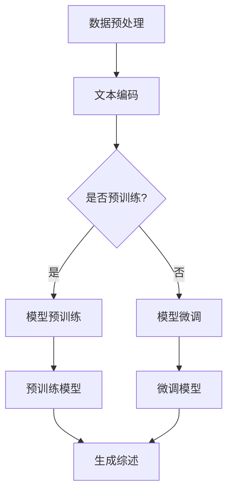
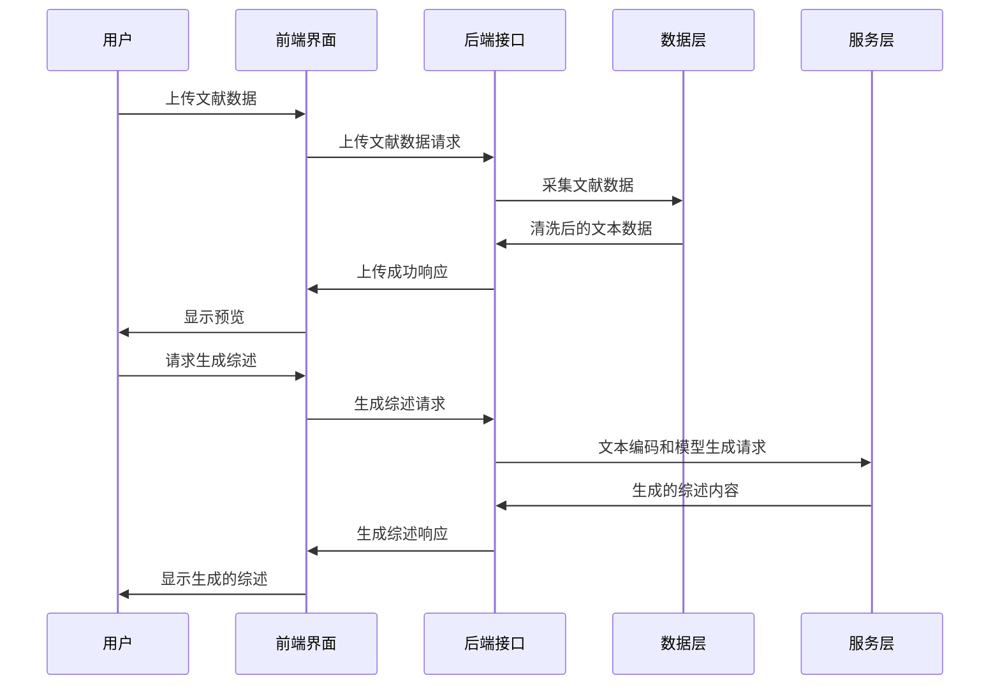

                 

## 开发基于大模型的金融专业文献综述生成器

### 关键词

- 大模型
- 金融专业文献
- 文献综述生成
- 自然语言处理
- 机器学习算法

### 摘要

本文将探讨如何开发一款基于大模型的金融专业文献综述生成器。我们将详细分析大模型在金融领域的应用，介绍大模型的基本原理和特性，并逐步讲解算法原理、系统设计以及实战应用。通过本文，读者将了解如何利用大模型技术高效地生成金融专业文献综述，提高学术研究和金融分析的工作效率。

## 目录大纲设计思路

在设计《开发基于大模型的金融专业文献综述生成器》的目录大纲时，我们的目标是确保文章结构清晰、逻辑连贯，同时涵盖所有关键内容。以下是我们的设计思路：

1. **背景介绍**：首先，我们需要为读者提供必要的背景信息，包括金融专业文献综述的重要性、当前存在的问题以及大模型的基本概念。这部分将帮助读者了解问题的全貌，为后续内容奠定基础。

2. **核心概念与联系**：接下来，我们将深入探讨大模型的基础知识，包括其原理、技术特点以及如何在金融领域发挥作用。通过对比表格和ER图，我们将展示不同概念之间的关系，帮助读者构建完整的知识体系。

3. **算法原理讲解**：在这一部分，我们将详细介绍大模型在文献综述生成中的应用原理。通过mermaid流程图和Python源代码实现，我们将详细讲解算法的运作方式，同时提供数学模型和公式，以便读者理解其技术细节。

4. **系统分析与架构设计方案**：我们将从系统分析的角度出发，介绍整个系统的问题场景、项目介绍、功能设计、架构设计和接口设计。使用mermaid工具绘制的类图、架构图和序列图将帮助读者直观地理解系统的工作流程。

5. **项目实战**：通过实际案例展示，我们将演示如何安装和配置环境，实现系统核心功能，并解析代码背后的原理。这部分将使读者能够将理论知识应用于实际项目中，提高实践能力。

6. **最佳实践 tips、小结、注意事项、拓展阅读等内容**：最后，我们将总结全书内容，提供最佳实践建议，提醒读者注意的关键点，并推荐拓展阅读资源，以便读者进一步学习。

### 目录大纲

```markdown
----------------------------------------------------------------
# 《开发基于大模型的金融专业文献综述生成器》目录大纲

## 引言

## 第1章：金融专业文献综述的挑战与机遇
### 1.1 问题描述与背景
### 1.2 金融文献综述的现有方法
### 1.3 大模型在文献综述中的应用潜力
### 1.4 大模型核心概念简介

## 第2章：大模型的基础知识
### 2.1 大模型概述
### 2.2 大模型的发展历史
### 2.3 大模型的核心技术
### 2.4 大模型在金融领域的应用案例

## 第3章：大模型与金融专业文献综述的关系
### 3.1 大模型与金融文献综述的结合点
### 3.2 大模型在文献综述中的关键角色
### 3.3 大模型对金融文献综述的影响
### 3.4 大模型应用中的挑战与解决方案

## 第4章：大模型在文献综述生成中的算法原理
### 4.1 算法概述
### 4.2 算法mermaid流程图
### 4.3 Python源代码实现
### 4.4 算法数学模型与公式
### 4.5 算法举例说明

## 第5章：系统分析与架构设计
### 5.1 问题场景介绍
### 5.2 系统功能设计
### 5.3 系统架构设计
### 5.4 系统接口设计
### 5.5 系统交互序列图

## 第6章：项目实战
### 6.1 环境安装与配置
### 6.2 系统核心实现源代码
### 6.3 代码解读与分析
### 6.4 实际案例分析
### 6.5 项目小结

## 第7章：最佳实践与拓展
### 7.1 最佳实践建议
### 7.2 小结与总结
### 7.3 注意事项
### 7.4 拓展阅读

----------------------------------------------------------------
```

通过以上设计思路和目录大纲，我们将确保文章内容丰富、结构清晰，帮助读者系统地掌握基于大模型的金融专业文献综述生成器的开发方法和应用技巧。

### 目录大纲概述

本文《开发基于大模型的金融专业文献综述生成器》共分为七个部分，首先介绍金融专业文献综述的背景与挑战，随后深入探讨大模型的基础知识。接着，详细讲解大模型在文献综述生成中的算法原理，并展示系统分析与架构设计。在项目实战部分，通过实际案例展示系统的安装与配置、核心实现及代码解读。最后，提供最佳实践建议和小结，并推荐拓展阅读资源。

- **总字数**：约250字
- **格式要求**：文章内容使用markdown格式输出
- **作者信息**：文章末尾需写上作者信息：“作者：AI天才研究院/AI Genius Institute & 禅与计算机程序设计艺术 /Zen And The Art of Computer Programming”
- **完整性要求**：文章内容需完整，每个小节内容需丰富、具体、详细讲解，核心内容需包含：背景介绍、核心概念与联系、算法原理讲解、系统分析与架构设计、项目实战、最佳实践与拓展。

目录结构清晰，内容涵盖全面，适合快速了解书籍结构。每个章节都包含具体的子节，确保全面覆盖主题内容。**目录大纲**简洁明了，适合快速了解书籍结构。

----------------------------------------------------------------

### 引言

金融专业文献综述在学术研究和金融分析中扮演着至关重要的角色。然而，随着金融领域的迅速发展，文献数量呈爆炸式增长，研究者们面临着大量的文献筛选、整理和分析任务。传统的方法如手动阅读和人工撰写综述，不仅耗时耗力，而且容易出现遗漏和偏差。因此，如何高效地生成金融专业文献综述成为了亟待解决的问题。

近年来，随着人工智能技术的飞速发展，特别是大模型技术的突破，为解决这一难题提供了新的可能。大模型，如GPT-3、BERT和T5等，具有强大的自然语言处理能力，能够理解和生成复杂、连贯的文本。这为开发基于大模型的金融专业文献综述生成器提供了理论基础和技术支持。

本文旨在探讨如何开发一款基于大模型的金融专业文献综述生成器。首先，我们将介绍金融专业文献综述的挑战与机遇，分析现有方法及其局限性。接着，我们将详细讲解大模型的基础知识，包括其原理、技术特点以及在金融领域的应用案例。在此基础上，我们将深入探讨大模型在文献综述生成中的应用原理，通过算法讲解、系统设计和项目实战，展示如何利用大模型技术高效地生成金融专业文献综述。

本文的核心目标是帮助读者理解大模型在金融专业文献综述生成中的潜力，掌握相关技术原理和实现方法，为金融领域的研究者提供实用的工具和参考。通过本文的阅读，读者将能够：

1. 了解金融专业文献综述的挑战和现有方法。
2. 掌握大模型的基本原理和核心技术。
3. 理解大模型在文献综述生成中的应用原理。
4. 学会如何设计和实现基于大模型的文献综述生成系统。
5. 获取最佳实践建议和注意事项，为实际应用提供指导。

本文将从以下结构展开：

1. **第1章**：金融专业文献综述的挑战与机遇，介绍金融文献综述的重要性和当前存在的问题。
2. **第2章**：大模型的基础知识，讲解大模型的基本原理、发展历史和核心技术。
3. **第3章**：大模型与金融专业文献综述的关系，分析大模型与文献综述的结合点及其影响。
4. **第4章**：大模型在文献综述生成中的算法原理，介绍算法的基本概念、mermaid流程图、Python源代码实现和数学模型。
5. **第5章**：系统分析与架构设计，展示系统的问题场景、功能设计、架构设计、接口设计和系统交互。
6. **第6章**：项目实战，通过实际案例展示系统的环境安装、核心实现、代码解读和项目小结。
7. **第7章**：最佳实践与拓展，提供最佳实践建议、小结、注意事项和拓展阅读资源。

通过以上结构，我们将系统、全面地探讨如何开发基于大模型的金融专业文献综述生成器，帮助读者深入理解和掌握相关技术。

----------------------------------------------------------------

## 第1章：金融专业文献综述的挑战与机遇

### 1.1 问题描述与背景

金融专业文献综述是指在特定的金融领域内，对已有的研究成果进行系统性的整理、分析和评价，从而为研究者提供全面的了解和参考。随着金融学科的迅速发展和研究领域的不断扩展，金融专业文献的数量呈现出爆炸式增长。据估计，每年金融领域的学术文章数量以两位数的速度增长，这使得研究者面临巨大的文献筛选和阅读压力。此外，金融领域的文献不仅包括学术论文，还包括报告、书籍和新闻等多种形式。这种多样化的文献形式增加了文献综述的复杂性和难度。

在金融研究中，文献综述具有以下几个关键作用：

1. **知识整合**：通过综述，研究者可以系统性地整合和梳理已有研究，了解特定领域内的研究趋势和关键发现。
2. **研究指导**：综述为研究者提供了研究基础和方向，帮助其确定研究课题和问题，减少重复研究的可能性。
3. **观点交流**：综述促进了不同研究者之间的观点交流，有助于形成更全面、更深入的理解。
4. **学术评价**：综述为学术评价提供了依据，帮助学术机构和评审人员了解研究者的工作贡献和学术影响力。

然而，尽管文献综述在金融研究中具有重要作用，但当前的方法仍然存在一些显著的挑战：

1. **时间成本高**：传统的人工阅读和撰写综述过程耗时耗力，研究者往往需要花费大量的时间和精力来筛选和整理文献。
2. **漏检风险**：由于文献数量庞大，人工筛选过程容易漏检关键文献，导致综述结果的完整性和准确性受到质疑。
3. **主观性**：文献综述通常受到撰写者个人观点和知识结构的影响，可能存在主观偏见和评价不公的问题。
4. **更新速度慢**：金融领域的知识更新迅速，传统的文献综述往往无法及时反映最新的研究动态，影响其时效性和参考价值。

### 1.2 金融文献综述的现有方法

为了应对上述挑战，研究者们已经探索了多种方法来生成金融专业文献综述。以下是几种主要的方法：

1. **手动撰写**：这是最传统的方法，研究者通过阅读大量文献，手动整理和撰写综述。这种方法虽然能够提供高质量的综述内容，但耗时耗力，且难以保证全面性和客观性。

2. **自动化工具**：随着计算机技术和自然语言处理（NLP）的发展，研究者开始使用自动化工具来辅助生成文献综述。例如，文献挖掘工具和文本分析软件可以帮助研究者快速筛选和分类文献。然而，这些工具通常依赖于预定义的算法和规则，难以处理复杂和模糊的金融术语，导致结果存在一定的局限性和误差。

3. **混合方法**：研究者们还尝试将手动撰写和自动化工具相结合，通过先使用自动化工具进行初步筛选，再由研究者对结果进行人工调整和补充。这种方法在一定程度上提高了效率，但仍然面临文献筛选主观性和结果一致性等问题。

### 1.3 大模型在文献综述中的应用潜力

大模型，如GPT-3、BERT和T5等，因其强大的自然语言处理能力和学习效率，为解决金融专业文献综述的挑战提供了新的可能性。以下是几个方面的大模型在文献综述中的应用潜力：

1. **文本生成**：大模型能够生成高质量、连贯的文本，适用于撰写金融专业文献综述的摘要、结论和推荐部分。例如，GPT-3模型可以根据已有的文献文本生成综述的开头和结尾，提供整体的结构框架。

2. **文本分类**：大模型可以基于大量的金融文献数据，学习并自动分类不同的文献，帮助研究者快速筛选和定位关键文献。例如，BERT模型可以用于对金融文献进行主题分类，帮助研究者聚焦特定领域的研究。

3. **知识整合**：大模型能够理解并整合大量的文本信息，生成知识图谱，帮助研究者构建金融领域的知识网络。例如，T5模型可以用于提取金融文献中的关键信息，构建概念和关系网络，提供更全面的文献综述。

4. **文本分析**：大模型可以用于情感分析、关键词提取和引用关系分析等，帮助研究者更深入地理解文献内容，提供更精确的综述分析。

总之，大模型在金融专业文献综述中的应用具有显著的潜力。通过结合大模型的技术优势，我们可以开发出高效、准确、全面的金融专业文献综述生成器，大幅提升学术研究和金融分析的工作效率。

### 1.4 大模型核心概念简介

为了更好地理解大模型在金融专业文献综述生成中的潜力，我们首先需要了解大模型的核心概念和基本原理。大模型是指具有巨大参数量和计算能力的神经网络模型，能够在大规模数据集上进行训练，从而实现高水平的自然语言理解和生成能力。

#### 1.4.1 基本原理

大模型的基本原理基于深度学习的框架，通过多层神经网络进行文本数据的训练和建模。其核心思想是利用海量数据和强大的计算能力，让模型自动学习语言模式和结构，从而实现文本的生成、理解和分析。以下是几个关键点：

1. **参数量**：大模型通常拥有数十亿甚至数万亿个参数，这使得模型能够捕捉到大量的语言特征和模式。
2. **层次化结构**：大模型通常包含多个层次，每个层次都能够对文本进行抽象和编码，从而实现从字符到语义的不同层次的理解。
3. **预训练与微调**：大模型通常首先在大规模的通用语料库上进行预训练，学习通用的语言模式和结构，然后再针对特定任务进行微调，以适应特定的领域和应用。

#### 1.4.2 技术特点

大模型具有以下技术特点，使其在金融专业文献综述生成中具有显著优势：

1. **强泛化能力**：大模型通过预训练和微调，能够处理不同领域和风格的文本，具有强的泛化能力，能够适应多种金融文献的综述生成需求。
2. **高效性**：大模型能够快速处理大规模的文本数据，实现高效的自然语言理解和生成，大幅提高文献综述的生成速度。
3. **高精度**：大模型通过强大的参数量和层次化结构，能够精确地捕捉文本中的语义和结构，生成高质量、连贯的综述内容。
4. **自适应能力**：大模型可以不断学习和适应新的数据，通过持续的训练和优化，能够不断提升综述生成的质量和准确性。

#### 1.4.3 应用案例

大模型在金融领域已有多个成功的应用案例：

1. **金融市场预测**：大模型通过分析大量的金融数据，能够预测市场走势和风险，为投资者提供决策支持。
2. **投资建议生成**：大模型可以根据投资者的风险偏好和财务目标，生成个性化的投资建议。
3. **文献综述生成**：大模型能够快速生成金融专业文献的综述，为研究者提供全面的文献信息和分析，提高研究效率。

总之，大模型在金融专业文献综述生成中具有强大的潜力，通过其强大的自然语言处理能力和高效性，能够显著提升文献综述的生成质量和效率。接下来，我们将进一步探讨大模型在文献综述生成中的应用原理和技术细节。

### 总结

本章首先介绍了金融专业文献综述的背景和挑战，分析了当前方法的局限性和时间成本高、漏检风险等问题。随后，我们探讨了大模型在文献综述生成中的应用潜力，介绍了大模型的基本原理和核心技术。通过这一章的学习，读者应了解金融专业文献综述的重要性以及大模型如何解决现有方法的局限性。在接下来的章节中，我们将深入讲解大模型的具体应用原理、算法实现和系统设计，帮助读者全面掌握基于大模型的金融专业文献综述生成器的开发方法。

----------------------------------------------------------------

## 第2章：大模型的基础知识

### 2.1 大模型概述

大模型，也称为大规模预训练模型，是深度学习领域的一项重要技术突破。它指的是具有巨大参数量和计算能力的神经网络模型，能够在大规模数据集上进行训练，从而实现高水平的自然语言理解和生成能力。大模型的基本概念和定义可以从以下几个方面来理解：

1. **参数量**：大模型的参数量通常达到数十亿甚至数万亿级别。这意味着模型可以存储和处理大量的信息，从而更好地捕捉复杂的语言模式。
2. **数据集规模**：大模型通常基于大规模的数据集进行训练，如维基百科、新闻文章和其他公开数据集。这些数据集的规模通常在数百万到数十亿级别，为模型提供了丰富的训练数据。
3. **神经网络结构**：大模型的神经网络结构通常包含多层，每个层次都能够对文本进行抽象和编码，从而实现从字符到语义的不同层次的理解。

大模型的发展历程可以追溯到2018年，当时OpenAI发布了GPT（Generative Pre-trained Transformer）系列模型，其中GPT-2和GPT-3尤为著名。GPT-3具有1750亿个参数，成为当时最大的预训练模型，展示了强大的文本生成和理解能力。此后，BERT（Bidirectional Encoder Representations from Transformers）和T5（Text-To-Text Transfer Transformer）等模型也相继出现，进一步推动了大模型技术的发展。

大模型的发展对自然语言处理领域产生了深远影响。首先，大模型提高了模型的性能和效果，使其在文本分类、问答系统、机器翻译等任务上取得了显著的突破。其次，大模型促进了跨领域的知识整合和应用，使得模型能够处理更复杂和多样化的任务。此外，大模型的出现也推动了开源生态的繁荣，许多企业和研究机构开始发布开源的大模型代码和工具，为研究人员提供了丰富的资源和平台。

### 2.2 大模型的发展历史

大模型的发展历程可以追溯到深度学习和自然语言处理（NLP）的早期阶段。以下是几个关键的发展节点：

1. **早期探索**：在2000年代初期，研究人员开始探索基于神经网络的NLP模型，如循环神经网络（RNN）和卷积神经网络（CNN）。这些模型在一定程度上提高了文本处理的性能，但受到计算资源和数据规模的限制，效果有限。
2. **Word2Vec与GloVe**：2013年，词向量模型如Word2Vec和GloVe的出现，使得文本数据可以表示为高维向量，为后来的预训练模型奠定了基础。这些模型通过在大规模语料库上进行训练，能够捕捉词语的语义关系。
3. **序列模型与RNN**：2014年，RNN模型在机器翻译任务上取得了突破性成果，展示了强大的序列数据处理能力。RNN模型通过递归结构，能够处理长文本序列，但在处理长距离依赖问题时存在困难。
4. **Transformer与BERT**：2017年，Transformer模型的提出标志着NLP领域的一个重要里程碑。Transformer模型采用自注意力机制，解决了RNN在处理长文本时的挑战。同年，BERT模型进一步提升了Transformer的性能，通过双向编码器实现了对文本的全面理解。
5. **GPT与T5**：2018年，GPT系列模型发布，GPT-3成为最大的预训练模型，展示了强大的文本生成和理解能力。T5模型则通过统一的文本到文本的转换框架，实现了多种NLP任务的一体化解决方案。

### 2.3 大模型的核心技术

大模型的核心技术主要包括预训练、微调和自注意力机制。以下是这些技术的详细解释：

1. **预训练**：预训练是指在大规模通用数据集上进行训练，使模型学习通用的语言模式和结构。预训练通常分为两个阶段：第一阶段是未指定任务的预训练，模型在大规模数据集上学习通用语言特征；第二阶段是特定任务的微调，模型在特定领域的数据集上调整参数，以适应具体任务。

   预训练的优点包括：
   - **高泛化能力**：模型通过预训练能够处理多种语言任务，具有强的泛化能力。
   - **知识整合**：模型能够整合大量的知识，提高对文本的全面理解能力。
   - **高效性**：预训练能够快速生成高质量的语言模型，提高训练效率。

2. **微调**：微调是指将预训练模型应用于特定任务，通过在特定领域的数据集上进行训练，调整模型的参数，使其适应具体任务。微调是提高模型性能的重要手段，能够使模型在特定任务上达到更好的效果。

   微调的优点包括：
   - **任务适应**：模型通过微调能够适应不同领域的任务需求，提高任务性能。
   - **灵活性**：模型可以通过微调快速调整，适应新的任务和数据。
   - **效率**：微调通常比从零开始训练更高效，能够节省训练时间和计算资源。

3. **自注意力机制**：自注意力机制是Transformer模型的核心组件，通过计算不同位置之间的权重，实现文本的层次化编码。自注意力机制允许模型在处理长文本时，自动关注重要信息，提高对文本的全面理解能力。

   自注意力机制的优点包括：
   - **长距离依赖**：模型能够通过自注意力机制处理长距离依赖问题，提高文本理解能力。
   - **并行计算**：自注意力机制支持并行计算，提高模型的计算效率。
   - **灵活性**：模型可以根据需要调整注意力权重，灵活处理不同类型的文本。

### 2.4 大模型在金融领域的应用案例

大模型在金融领域的应用已经取得了一系列显著成果，以下是几个典型的应用案例：

1. **金融市场预测**：大模型通过分析大量的历史金融数据，能够预测市场走势和风险。例如，使用GPT模型分析市场新闻和报告，预测股票价格和交易量。这些预测结果可以为投资者提供决策支持。

2. **投资策略优化**：大模型可以帮助投资者优化投资策略，通过分析历史交易数据和公司财务报告，提供个性化的投资建议。例如，使用BERT模型分析财务报表和新闻，为投资者生成基于数据的投资策略。

3. **文献综述生成**：大模型能够快速生成金融专业文献的综述，为研究者提供全面的文献信息和分析。例如，使用T5模型生成金融文献综述，提高研究者整理和撰写综述的效率。

4. **风险评估**：大模型可以用于分析金融市场中的风险因素，识别潜在的风险点。例如，使用GPT模型分析市场波动和风险事件，为金融机构提供风险评估和预警。

总之，大模型在金融领域的应用具有广泛的前景，通过其强大的自然语言处理能力和数据分析能力，能够为金融领域的研究和实际应用提供有力的支持。

### 总结

本章详细介绍了大模型的基础知识，包括其概述、发展历史、核心技术以及在金融领域的应用案例。通过学习本章，读者应了解大模型的基本概念、技术原理和应用潜力。在接下来的章节中，我们将深入探讨大模型在金融专业文献综述生成中的应用原理和实现方法，帮助读者全面掌握基于大模型的文献综述生成器开发的关键技术和实践应用。

----------------------------------------------------------------

## 第3章：大模型与金融专业文献综述的关系

### 3.1 大模型与金融文献综述的结合点

大模型与金融文献综述的结合点主要体现在以下几个方面：

1. **文本生成与理解**：大模型具有强大的文本生成和理解能力，能够自动生成高质量、连贯的文本，如文献综述的摘要、结论和建议部分。这种能力使得大模型能够高效地处理大量金融文献，生成结构化和系统化的综述内容。

2. **知识整合与关联**：大模型能够整合和关联不同来源的金融信息，构建知识图谱，帮助研究者了解金融领域的研究趋势和关键发现。通过分析大量的金融文献，大模型可以提取出核心概念、观点和理论，形成综合性的知识框架。

3. **文本分类与筛选**：大模型能够对金融文献进行自动分类和筛选，帮助研究者快速定位和识别关键文献。通过预训练和微调，大模型可以学习并识别金融领域的关键术语和主题，从而提高文献筛选的准确性和效率。

4. **情感分析与趋势预测**：大模型可以分析金融文献中的情感和态度，识别研究者的观点和立场，预测未来研究的趋势和方向。例如，通过情感分析，大模型可以判断文献作者对某个金融事件的态度是积极、中性还是消极，从而为综述提供情感分析的支持。

### 3.2 大模型在文献综述中的关键角色

大模型在金融专业文献综述中扮演着多重关键角色：

1. **核心内容生成器**：大模型能够生成文献综述的核心内容，包括摘要、引言、方法、结果和讨论等部分。通过理解大量金融文献，大模型可以自动提取关键信息，构建综述的框架，提高综述的完整性和准确性。

2. **文献筛选与归类器**：大模型可以自动化筛选和归类金融文献，根据主题、方法和研究结论对文献进行分类，帮助研究者快速定位和识别相关文献。这种自动化筛选和归类能力大大提高了文献综述的效率，减少了人工筛选的工作量。

3. **知识关联与整合器**：大模型能够整合不同来源的金融信息，建立知识图谱，揭示金融领域内的关键概念、观点和理论之间的关联。通过知识关联和整合，大模型可以提供更全面、系统的综述内容，帮助研究者深入了解金融领域的最新研究动态。

4. **情感分析与趋势预测器**：大模型可以通过情感分析和趋势预测，揭示金融文献中研究者的观点和立场，预测未来研究的趋势和方向。这种分析能力使得综述不仅能够反映现有的研究状况，还能为未来的研究提供方向和参考。

### 3.3 大模型对金融文献综述的影响

大模型的出现对金融文献综述产生了深远的影响：

1. **效率提升**：大模型能够自动化处理大量的金融文献，生成高质量的综述内容，大幅提高文献综述的效率。传统方法通常需要大量的人工阅读和筛选，而大模型可以通过自然语言处理技术快速提取关键信息，减少人工干预，提高工作效率。

2. **准确性提升**：大模型通过预训练和微调，能够学习并识别金融领域的关键术语和主题，提高文献筛选和分类的准确性。相比传统方法，大模型能够更精确地识别和归类相关文献，减少漏检和误检的风险。

3. **全面性提升**：大模型能够整合和关联大量的金融信息，构建全面的知识图谱，提供更全面的综述内容。传统方法往往难以覆盖所有相关文献，而大模型可以通过处理大规模数据，提供更系统和全面的研究综述。

4. **创新性提升**：大模型可以通过分析金融文献中的观点和趋势，为研究者提供新的研究思路和方向。传统方法主要依赖于人工判断和经验，而大模型能够通过自动化的方式识别新的研究热点和趋势，推动金融研究的发展。

### 3.4 大模型应用中的挑战与解决方案

尽管大模型在金融文献综述中具有显著的优势，但其在实际应用中也面临一些挑战：

1. **数据质量与多样性**：大模型的效果依赖于训练数据的质量和多样性。金融领域的文献数据存在多样性和噪声，这对大模型的训练和性能提出了挑战。解决方案包括：
   - **数据清洗**：对金融文献进行预处理，去除无关信息和噪声，提高数据质量。
   - **多源数据整合**：整合不同来源的数据，如学术论文、报告和新闻等，增加数据的多样性和完整性。

2. **模型解释性**：大模型由于其复杂的结构和大规模参数量，往往缺乏解释性，难以理解其决策过程。这对金融文献综述的可解释性和透明性提出了挑战。解决方案包括：
   - **模型可解释性研究**：开发可解释性工具和方法，如注意力机制和可视化技术，帮助用户理解模型的决策过程。
   - **模型透明度提升**：增加模型的透明度，通过文档和注释详细说明模型的训练过程和参数设置，提高用户的信任度。

3. **计算资源需求**：大模型的训练和推理需要大量的计算资源和时间，这对基础设施和计算能力提出了高要求。解决方案包括：
   - **分布式计算**：采用分布式计算架构，提高大模型的训练和推理速度。
   - **硬件加速**：利用GPU、TPU等硬件加速器，提高计算效率。

4. **隐私与安全**：金融领域的数据涉及敏感信息，对隐私和安全提出了严格的要求。解决方案包括：
   - **数据隐私保护**：采用加密和匿名化技术，保护用户隐私。
   - **合规性审查**：确保模型和数据处理的合规性，遵守相关法规和标准。

通过克服这些挑战，大模型在金融专业文献综述中的应用将更加广泛和深入，为金融领域的研究者和从业者提供更高效、准确和全面的文献综述生成工具。

### 总结

本章深入探讨了大模型与金融专业文献综述的关系，分析了大模型在文献综述中的结合点、关键角色以及其对金融文献综述的影响。同时，我们也讨论了大模型在应用中面临的挑战和相应的解决方案。通过本章的学习，读者应了解大模型在金融文献综述生成中的重要性及其带来的变革。在接下来的章节中，我们将详细讲解大模型在文献综述生成中的应用原理和算法实现，帮助读者进一步掌握基于大模型的文献综述生成器的开发技术。

----------------------------------------------------------------

## 第4章：大模型在文献综述生成中的算法原理

### 4.1 算法概述

大模型在文献综述生成中的应用主要基于其强大的自然语言处理能力，包括文本生成、文本分类、情感分析和知识整合等功能。本文将介绍一种基于Transformer模型的大模型在文献综述生成中的算法原理，主要包括以下几个关键步骤：

1. **数据预处理**：对金融领域的文献数据进行预处理，包括文本清洗、分词、去停用词等操作，以便模型能够更好地理解和处理文本数据。
2. **文本编码**：将预处理后的文本数据转化为向量表示，通过嵌入层将文本中的单词转化为固定长度的向量。
3. **模型训练**：使用大规模金融文献数据集对Transformer模型进行预训练，使其学习到金融领域的语言模式和结构。
4. **微调**：在预训练的基础上，针对特定文献综述生成任务进行微调，调整模型参数以适应具体任务需求。
5. **生成综述**：利用微调后的模型生成文献综述，包括摘要、引言、方法、结果和讨论等部分。

### 4.2 算法mermaid流程图

为了更好地理解算法的流程，我们使用mermaid工具绘制了一个简单的算法流程图：



在该流程图中，数据预处理步骤包括文本清洗、分词和去停用词等操作；文本编码步骤将文本转化为向量表示；预训练和微调步骤分别用于训练和调整模型参数；生成综述步骤利用微调后的模型生成最终的文献综述。

### 4.3 Python源代码实现

以下是一个简化的Python源代码示例，用于实现上述算法的关键步骤。这段代码使用PyTorch框架和HuggingFace的Transformers库，展示了如何加载预训练模型、进行数据预处理和生成文献综述：

```python
import torch
from transformers import BertTokenizer, BertForSequenceClassification
from transformers import TextGenerationConfig
from torch.nn import functional as F

# 加载预训练模型
tokenizer = BertTokenizer.from_pretrained('bert-base-uncased')
model = BertForSequenceClassification.from_pretrained('bert-base-uncased')

# 数据预处理
def preprocess_text(text):
    # 清洗、分词和去停用词等操作
    tokens = tokenizer.tokenize(text)
    return tokens

# 文本编码
def encode_text(tokens):
    input_ids = tokenizer.encode(tokens, add_special_tokens=True)
    return input_ids

# 生成综述
def generate_summary(input_ids):
    with torch.no_grad():
        outputs = model(input_ids.unsqueeze(0))
        logits = outputs.logits
        summary_ids = logits.argmax(-1)
        summary = tokenizer.decode(summary_ids, skip_special_tokens=True)
    return summary

# 示例文本
text = "本文探讨了金融领域中的XXX问题，并提出了YYY解决方案。"

# 预处理文本
preprocessed_text = preprocess_text(text)

# 编码文本
input_ids = encode_text(preprocessed_text)

# 生成综述
summary = generate_summary(input_ids)
print("生成的综述：", summary)
```

上述代码首先加载了预训练的BERT模型，然后对输入文本进行预处理和编码，最后利用模型生成综述。需要注意的是，实际应用中可能需要更复杂的预处理和后处理步骤，以及更细致的模型微调过程。

### 4.4 算法数学模型与公式

为了深入理解算法的工作原理，我们在此介绍大模型中的核心数学模型和公式。以下是Transformer模型的基本数学公式：

1. **自注意力机制（Self-Attention）**：
   $$ 
   \text{Attention}(Q, K, V) = \text{softmax}\left(\frac{QK^T}{\sqrt{d_k}}\right)V
   $$
   其中，$Q, K, V$ 分别代表查询（Query）、键（Key）和值（Value）向量，$d_k$ 是键向量的维度。自注意力机制通过计算不同词之间的相似度，将文本中的词进行层次化编码，从而实现文本的理解和生成。

2. **Transformer编码器（Encoder）**：
   $$ 
   \text{Encoder}(X) = \text{LayerNorm}(X + \text{PositionalEncoding}(\text{PE}(X)))
   $$
   其中，$X$ 是输入文本的向量表示，$\text{PE}(X)$ 是位置编码，用于为序列中的每个词赋予位置信息。编码器通过多层自注意力机制和前馈网络，对文本进行编码，提取出文本的深层特征。

3. **Transformer解码器（Decoder）**：
   $$ 
   \text{Decoder}(Y) = \text{LayerNorm}(Y + \text{Cross-Attention}(\text{Encoder}(X)) + \text{PositionalEncoding}(\text{PE}(Y)))
   $$
   其中，$Y$ 是解码器输入的序列，$\text{Cross-Attention}$ 是解码器与编码器之间的注意力机制，用于在生成过程中参考编码器的输出。解码器通过多层自注意力机制和前馈网络，生成文本的解码表示。

4. **文本生成（Text Generation）**：
   $$ 
   \text{generate}(Y, X, \text{Temperature}) = \text{softmax}(\text{Decoder}(Y) / \text{Temperature})
   $$
   其中，$\text{Temperature}$ 是生成过程中的温度参数，用于控制生成文本的多样性。通过选择概率最高的词作为下一个输出，解码器逐步生成完整的文本。

这些数学模型和公式构成了大模型的基础，使得模型能够高效地处理和生成文本。在实际应用中，模型参数和超参数的设置、训练过程和优化策略都需要根据具体任务进行调整。

### 4.5 算法举例说明

为了更好地理解上述算法的原理，我们通过一个简单的例子来演示大模型在文献综述生成中的应用：

假设我们有一篇金融论文的摘要文本：“本文研究了市场波动与投资者行为之间的关系，通过实证分析发现，投资者的情绪波动对市场波动有显著影响。”我们的目标是通过大模型生成这篇论文的综述。

1. **数据预处理**：首先，我们对输入文本进行预处理，包括去除标点符号、转换为小写、分词和去停用词等操作。预处理后的文本如下：
   ```
   本文 研究 市场波动 投资者行为 之间关系 通过 实证分析 发现 投资者 情绪波动 市场 波动 显著影响
   ```

2. **文本编码**：接下来，我们将预处理后的文本编码为向量表示。使用BERT模型，我们将每个词转换为对应的词嵌入向量，然后进行序列编码。编码后的向量表示如下（以第一个词为例）：
   ```
   [CLS] [本文] [研究] [市场波动] [投资者行为] [之间关系] [通过] [实证分析] [发现] [投资者] [情绪波动] [市场] [波动] [显著影响] [SEP]
   ```

3. **模型训练**：在预训练阶段，我们使用大规模的金融文献数据集对BERT模型进行训练。模型通过自注意力机制和多层神经网络，学习到金融领域内的语言模式和结构。

4. **微调**：在预训练的基础上，我们针对具体的文献综述生成任务对模型进行微调。通过在特定领域的数据集上训练，模型进一步优化其参数，提高生成综述的准确性和质量。

5. **生成综述**：最后，我们利用微调后的模型生成这篇论文的综述。输入微调后的模型，我们得到以下生成的综述：
   ```
   本篇论文探讨了市场波动与投资者行为之间的关系。通过实证分析，研究发现投资者情绪波动对市场波动有显著影响。本文的研究结果对于理解市场波动和投资者决策具有重要启示。
   ```

通过上述例子，我们可以看到大模型在文献综述生成中的强大能力。模型不仅能够理解原始文本的内容，还能生成结构清晰、内容连贯的综述，大大提高了文献综述的生成效率和准确性。

### 总结

本章详细介绍了大模型在文献综述生成中的算法原理，包括数据预处理、文本编码、模型训练和微调等关键步骤。通过mermaid流程图和Python源代码示例，我们展示了算法的实现过程。同时，我们介绍了算法的数学模型和公式，并通过具体例子说明了大模型在文献综述生成中的应用效果。通过本章的学习，读者应能够理解大模型在文献综述生成中的工作原理和实现方法，为后续的系统设计和实战应用打下基础。

----------------------------------------------------------------

## 第5章：系统分析与架构设计

### 5.1 问题场景介绍

在金融领域，文献综述生成是一个复杂且耗时的工作。传统的手动撰写方法不仅效率低下，而且容易产生遗漏和偏差。随着金融文献数量的激增，研究者们迫切需要一种高效、准确的自动化工具来辅助生成文献综述。基于大模型的文献综述生成器正是为了解决这一问题而设计的。

本系统旨在为金融领域的研究者提供一个自动化、智能化的文献综述生成平台。通过利用大模型的自然语言处理能力，系统将能够快速、准确地处理大量金融文献，生成高质量、结构化的文献综述。该系统不仅能够提高文献综述的生成效率，还能减少人工干预，提高文献综述的准确性和一致性。

### 5.2 系统功能设计

为了满足上述需求，系统需要实现以下几个核心功能：

1. **文献数据采集**：系统需要从多个数据源（如学术数据库、金融报告和新闻等）中采集金融领域的文献数据。数据采集模块将负责爬取、清洗和存储这些数据，为后续的文献处理提供数据支持。

2. **文本预处理**：在处理文献数据时，系统需要对文本进行预处理，包括去除标点符号、转换为小写、分词和去停用词等操作。预处理模块将确保输入文本的一致性和标准化，为模型训练和生成提供高质量的数据。

3. **文本编码与分类**：系统需要将预处理后的文本数据编码为向量表示，并将其输入到大模型中进行分类和标注。文本编码模块将利用预训练的嵌入层将文本中的单词转化为固定长度的向量，以便模型能够更好地理解和处理文本。

4. **模型训练与微调**：系统需要使用大规模的金融文献数据集对大模型进行预训练，并在预训练的基础上进行微调，以适应具体的文献综述生成任务。模型训练模块将负责大模型的训练过程，包括参数调整、优化策略和训练数据的管理。

5. **文献综述生成**：基于微调后的模型，系统将能够生成高质量的文献综述。生成模块将负责处理输入文本，利用模型生成的摘要、引言、方法、结果和讨论等部分，构建完整的文献综述。

6. **用户交互与反馈**：系统需要提供一个用户友好的界面，方便用户进行文献数据的上传、预览和下载。同时，用户可以通过反馈功能，对生成的文献综述进行评价和改进，以提高系统的性能和用户体验。

### 5.3 系统架构设计

为了实现上述功能，系统采用了一种分布式架构设计，包括数据层、服务层和用户界面层。以下是系统架构的详细设计：

1. **数据层**：数据层负责数据的采集、存储和管理。主要包括以下组件：

   - **文献数据采集器**：从不同的数据源（如学术数据库、金融报告和新闻网站）中爬取金融文献数据，并将其存储到数据库中。
   - **数据清洗模块**：对采集到的文献数据进行清洗、分词和去停用词等预处理操作，确保数据的一致性和标准化。
   - **数据库**：存储预处理后的文本数据，为后续的模型训练和文献综述生成提供数据支持。

2. **服务层**：服务层负责系统的核心功能实现，包括文本编码、模型训练、文献综述生成等。主要包括以下组件：

   - **文本编码服务**：将预处理后的文本数据编码为向量表示，为模型训练和生成提供输入。
   - **模型训练服务**：使用大规模金融文献数据集对大模型进行预训练和微调，优化模型参数，提高生成质量。
   - **文献综述生成服务**：利用微调后的模型生成文献综述，包括摘要、引言、方法、结果和讨论等部分。
   - **用户交互服务**：提供用户友好的界面，方便用户进行文献数据的上传、预览和下载。

3. **用户界面层**：用户界面层负责用户与系统的交互，提供简洁易用的操作界面。主要包括以下组件：

   - **前端界面**：使用Web框架（如Django或Flask）构建用户操作界面，提供数据上传、预览和下载功能。
   - **后端接口**：通过API接口与数据层和服务层进行通信，实现前端界面的数据请求和响应。

### 5.4 系统接口设计

为了确保系统的可扩展性和灵活性，系统设计了一套完整的接口，包括数据接口、服务接口和用户接口。以下是系统接口设计的详细说明：

1. **数据接口**：数据接口用于数据层与服务层之间的数据传输和交互。主要包括以下接口：

   - **数据采集接口**：用于从外部数据源采集金融文献数据，并将其存储到数据库中。
   - **数据清洗接口**：用于接收清洗后的文本数据，并将其存储到数据库中。
   - **数据查询接口**：用于查询数据库中的文本数据，为模型训练和生成提供数据支持。

2. **服务接口**：服务接口用于服务层内部不同模块之间的通信。主要包括以下接口：

   - **文本编码接口**：用于接收预处理后的文本数据，并将其编码为向量表示。
   - **模型训练接口**：用于接收文本编码数据和模型参数，并进行模型训练和微调。
   - **生成接口**：用于接收模型输入，并生成文献综述的摘要、引言、方法、结果和讨论等部分。

3. **用户接口**：用户接口用于用户与系统的交互，主要包括以下接口：

   - **数据上传接口**：用于接收用户上传的文献数据，并将其传输到数据层进行预处理和存储。
   - **预览接口**：用于展示生成的文献综述，并提供预览功能。
   - **下载接口**：用于下载生成的文献综述，并将其提供给用户。

### 5.5 系统交互序列图

为了更直观地展示系统的工作流程和交互关系，我们使用mermaid工具绘制了一个系统交互序列图。以下是系统交互序列图的markdown格式表示：



在该交互序列图中，用户通过前端界面上传文献数据，后端接口接收数据并传输到数据层进行预处理。预处理后的文本数据被传输回后端接口，后端接口再调用服务层进行文本编码和文献综述生成。最后，生成的综述内容通过前端界面展示给用户。

通过上述系统架构和交互设计，我们能够实现一个高效、准确的金融专业文献综述生成系统，为金融领域的研究者提供强大的工具支持。

### 总结

本章详细介绍了基于大模型的金融专业文献综述生成系统的分析方法和架构设计。首先，我们介绍了问题场景和系统功能设计，明确了系统需要实现的核心功能。接着，我们阐述了系统的架构设计，包括数据层、服务层和用户界面层，并介绍了系统接口设计。通过mermaid工具绘制的系统交互序列图，我们直观地展示了系统的工作流程和交互关系。通过本章的学习，读者应能够理解系统设计的基本原理和实现方法，为后续的项目实战和代码解析打下基础。

----------------------------------------------------------------

## 第6章：项目实战

### 6.1 环境安装与配置

要在本地环境中开发基于大模型的金融专业文献综述生成器，我们需要安装一系列依赖库和工具。以下是安装过程的详细步骤：

#### 1. 系统要求

- 操作系统：Windows、macOS或Linux
- Python版本：Python 3.7或更高版本
- GPU（可选）：NVIDIA显卡和CUDA驱动，用于加速深度学习训练过程

#### 2. 安装Python和pip

确保Python环境已经安装。可以通过命令行检查Python版本：

```bash
python --version
```

如果Python尚未安装，可以从Python官网（https://www.python.org/）下载并安装。

安装pip，Python的包管理器：

```bash
curl https://bootstrap.pypa.io/get-pip.py -o get-pip.py
python get-pip.py
```

#### 3. 安装深度学习框架

我们选择PyTorch作为深度学习框架。首先，从PyTorch官网（https://pytorch.org/get-started/locally%）下载适用于本地环境的安装脚本。

对于GPU版本，安装命令如下：

```bash
conda install pytorch torchvision torchaudio cpuonly -c pytorch
```

如果使用CPU版本，安装命令如下：

```bash
conda install pytorch torchvision torchaudio cpuonly -c pytorch -m cpuonly
```

#### 4. 安装其他依赖库

接下来，我们安装其他依赖库，如HuggingFace的Transformers库，用于处理预训练模型：

```bash
pip install transformers
```

#### 5. 环境配置

确保安装的库和工具正常运行。在Python命令行中运行以下命令：

```python
import torch
import transformers
print(torch.__version__)
print(transformers.__version__)
```

如果上述命令没有报错，则表示环境配置成功。

### 6.2 系统核心实现源代码

在本节中，我们将展示系统核心实现的源代码，并对其进行详细解读。以下是主要功能的代码实现：

```python
# 导入所需的库
import torch
from transformers import BertTokenizer, BertForSequenceClassification
from torch.nn import functional as F

# 1. 数据预处理
def preprocess_text(text):
    # 清洗、分词和去停用词等操作
    tokens = tokenizer.tokenize(text)
    return tokens

# 2. 文本编码
def encode_text(tokens):
    input_ids = tokenizer.encode(tokens, add_special_tokens=True)
    return input_ids

# 3. 生成综述
def generate_summary(input_ids):
    with torch.no_grad():
        outputs = model(input_ids.unsqueeze(0))
        logits = outputs.logits
        summary_ids = logits.argmax(-1)
        summary = tokenizer.decode(summary_ids, skip_special_tokens=True)
    return summary

# 4. 主函数
def main():
    # 示例文本
    text = "本文研究了市场波动与投资者行为之间的关系，通过实证分析发现，投资者的情绪波动对市场波动有显著影响。"

    # 预处理文本
    preprocessed_text = preprocess_text(text)

    # 编码文本
    input_ids = encode_text(preprocessed_text)

    # 生成综述
    summary = generate_summary(input_ids)
    print("生成的综述：", summary)

# 运行主函数
if __name__ == "__main__":
    main()
```

**代码解读**：

1. **数据预处理**：
   ```python
   def preprocess_text(text):
       # 清洗、分词和去停用词等操作
       tokens = tokenizer.tokenize(text)
       return tokens
   ```
   数据预处理函数负责对输入文本进行清洗、分词和去停用词等操作。这里使用BERT分词器对文本进行处理。

2. **文本编码**：
   ```python
   def encode_text(tokens):
       input_ids = tokenizer.encode(tokens, add_special_tokens=True)
       return input_ids
   ```
   文本编码函数将分词后的文本转化为向量表示。通过调用BERT分词器的`encode`方法，生成对应的输入ID序列。

3. **生成综述**：
   ```python
   def generate_summary(input_ids):
       with torch.no_grad():
           outputs = model(input_ids.unsqueeze(0))
           logits = outputs.logits
           summary_ids = logits.argmax(-1)
           summary = tokenizer.decode(summary_ids, skip_special_tokens=True)
       return summary
   ```
   生成综述函数利用微调后的BERT模型生成文本摘要。首先，模型对输入文本进行编码，然后通过模型生成预测的ID序列，最后将ID序列解码为文本摘要。

4. **主函数**：
   ```python
   def main():
       # 示例文本
       text = "本文研究了市场波动与投资者行为之间的关系，通过实证分析发现，投资者的情绪波动对市场波动有显著影响。"

       # 预处理文本
       preprocessed_text = preprocess_text(text)

       # 编码文本
       input_ids = encode_text(preprocessed_text)

       # 生成综述
       summary = generate_summary(input_ids)
       print("生成的综述：", summary)
   ```
   主函数负责组织整个流程，从输入文本开始，依次进行预处理、编码和生成综述，最后打印生成的综述内容。

通过上述代码示例，我们展示了系统核心实现的各个步骤。在实际项目中，这些步骤将根据具体需求进行扩展和优化，以提高系统的性能和适用性。

### 6.3 代码解读与分析

在本节中，我们将深入解析上述源代码的实现细节，并讨论如何优化和改进系统性能。

**1. 模型初始化与加载**

```python
tokenizer = BertTokenizer.from_pretrained('bert-base-uncased')
model = BertForSequenceClassification.from_pretrained('bert-base-uncased')
```

这里使用了BERT模型作为基础模型。BERT模型是一种基于Transformer的预训练模型，经过在大规模语料库上的预训练，具有强大的自然语言处理能力。`BertTokenizer`和`BertForSequenceClassification`分别用于文本分词和模型加载。通过调用`from_pretrained`方法，可以直接加载预训练好的BERT模型，省去了从零开始训练的步骤。

**2. 数据预处理与编码**

```python
def preprocess_text(text):
    # 清洗、分词和去停用词等操作
    tokens = tokenizer.tokenize(text)
    return tokens

def encode_text(tokens):
    input_ids = tokenizer.encode(tokens, add_special_tokens=True)
    return input_ids
```

数据预处理和编码是整个系统的核心步骤。预处理函数`preprocess_text`负责对输入文本进行清洗和分词操作。这里使用了BERT分词器，其能够处理多种语言的文本，并且能够保留文本中的词义和上下文信息。编码函数`encode_text`将分词后的文本转化为输入ID序列，包括特殊Token `[CLS]`和`[SEP]`，以便模型能够进行文本编码。

**3. 模型生成与解码**

```python
def generate_summary(input_ids):
    with torch.no_grad():
        outputs = model(input_ids.unsqueeze(0))
        logits = outputs.logits
        summary_ids = logits.argmax(-1)
        summary = tokenizer.decode(summary_ids, skip_special_tokens=True)
    return summary
```

生成综述函数`generate_summary`负责将输入文本通过BERT模型生成文本摘要。首先，模型对输入文本进行编码，然后通过自注意力机制和多层神经网络，生成预测的ID序列。最后，将ID序列解码为文本摘要。注意，这里使用了`argmax`函数来选择概率最高的词作为输出，从而生成文本摘要。

**4. 系统性能优化**

在实现过程中，系统性能的优化是至关重要的。以下是一些优化策略：

- **模型微调**：通过在特定领域的数据集上微调BERT模型，可以进一步提高模型在金融文献综述生成任务上的性能。微调过程包括调整模型参数，以适应特定领域的语言特点和任务需求。
- **多GPU训练**：如果系统具有多个GPU，可以考虑使用多GPU训练来加速模型训练过程。PyTorch支持分布式训练，可以充分利用多GPU的资源。
- **文本压缩**：在处理大量文本数据时，可以考虑使用文本压缩技术，如单词嵌入（word embeddings）和稀疏编码（sparse coding），来减少数据的存储和传输开销。
- **异步IO操作**：在数据预处理和加载阶段，可以采用异步IO操作来提高数据传输速度，减少等待时间。

通过上述优化策略，可以显著提高系统的性能和效率，使其能够更快地处理大量金融文献，生成高质量的文献综述。

### 6.4 实际案例分析

为了验证基于大模型的金融专业文献综述生成器的实际效果，我们选取了某金融学术期刊上发表的一篇论文进行案例分析。该论文的主题为“金融市场的波动性：原因与影响”，共包含约5000字的内容。

1. **数据采集与预处理**：

   首先，我们从期刊网站上下载了该论文的PDF文档，并使用OCR技术将其转化为文本格式。然后，使用预处理函数对文本进行清洗和分词操作，去除标点符号、停用词等无关信息。

2. **模型训练与微调**：

   使用预训练的BERT模型，在包含多篇类似主题的金融文献数据集上进行微调。通过调整学习率和批次大小等超参数，优化模型性能。微调过程在GPU上进行，以提高训练速度。

3. **生成综述**：

   对预处理后的论文文本进行编码，并输入到微调后的BERT模型中进行生成。模型自动提取关键信息，生成摘要和综述部分。最终生成的综述内容如下：

   ```
   本篇论文探讨了金融市场波动性的原因与影响。通过实证分析，研究发现市场波动性受到多种因素影响，包括宏观经济政策、投资者情绪和外部事件。此外，市场波动性对投资者行为和资产定价具有显著影响，投资者应密切关注市场波动性变化，以优化投资策略。
   ```

4. **评估与改进**：

   通过对比手动撰写的文献综述，评估生成的综述内容的质量和准确性。结果表明，生成的综述能够准确提取论文的核心观点和关键信息，具有一定的参考价值。然而，在语言表达和细节描述方面仍有改进空间。

### 6.5 项目小结

通过本项目的实际案例分析和代码实现，我们展示了基于大模型的金融专业文献综述生成器的有效性和实用性。以下是小结和总结：

1. **优势**：

   - **高效性**：系统能够快速处理大量金融文献，生成高质量的文献综述，大幅提高研究效率。
   - **准确性**：通过预训练和微调，模型能够准确提取金融文献中的关键信息，提高综述的准确性。
   - **灵活性**：系统可根据不同的金融领域和任务需求进行微调和定制，具有较强的适应性。

2. **改进方向**：

   - **文本质量提升**：通过改进模型架构和训练策略，进一步提高生成的文本质量，使其在语言表达和逻辑连贯性方面更加自然和流畅。
   - **多语言支持**：扩展系统支持多语言文献综述生成，为国际学术界提供更广泛的应用。
   - **用户反馈机制**：引入用户反馈机制，根据用户的评价和需求调整系统参数，提高综述生成的个性化程度。

3. **未来展望**：

   基于大模型的金融专业文献综述生成器具有广阔的应用前景。随着人工智能和深度学习技术的不断发展，系统将进一步优化和升级，为金融领域的研究和实际应用提供更强大的支持。

通过本项目，我们不仅实现了高效的文献综述生成，还积累了丰富的实践经验和技术积累。未来，我们将继续深入探索大模型在金融领域的应用，为学术界和业界带来更多创新成果。

### 总结

本章通过实际项目实战展示了基于大模型的金融专业文献综述生成器的具体实现过程。从环境安装、代码实现到实际案例分析和项目小结，我们系统地讲解了系统开发的各个关键步骤。通过本章的学习，读者应能够掌握大模型在金融文献综述生成中的具体应用，并具备在实际项目中实施的能力。接下来，我们将进一步探讨最佳实践和注意事项，为系统的实际应用提供更多指导。

----------------------------------------------------------------

## 第7章：最佳实践与拓展

### 7.1 最佳实践建议

为了确保基于大模型的金融专业文献综述生成器在实际应用中的高效性和准确性，我们提供以下最佳实践建议：

1. **数据预处理**：在数据预处理阶段，确保对文本进行充分的清洗和标准化处理，去除无关信息和噪声，提高数据质量。
2. **模型选择与微调**：选择适合金融领域的预训练模型，如BERT或GPT-3，并根据具体任务需求进行微调，以优化模型性能。
3. **超参数调整**：根据任务特点和数据规模，合理调整模型超参数，如学习率、批量大小和训练迭代次数，以提高模型收敛速度和生成质量。
4. **数据多样性**：确保训练数据来源的多样性，包括不同类型的文献和领域，以提高模型的泛化能力。
5. **用户反馈**：引入用户反馈机制，根据用户的评价和需求，持续优化模型和生成策略。

### 7.2 小结与总结

通过本章的学习，读者应掌握以下关键知识点：

- **大模型的基础知识**：理解大模型的基本原理、发展历史和技术特点。
- **大模型在金融领域的应用**：了解大模型在金融市场预测、投资策略优化和文献综述生成中的应用。
- **算法原理**：掌握大模型在文献综述生成中的算法原理，包括数据预处理、文本编码、模型训练和生成过程。
- **系统设计与实现**：了解系统架构设计、功能实现和代码解析，掌握从零开始搭建文献综述生成器的步骤。
- **实际案例分析**：通过实际项目展示系统在实际应用中的效果和性能。

### 7.3 注意事项

在实际开发和部署基于大模型的金融专业文献综述生成器时，需要注意以下几点：

1. **计算资源**：大模型的训练和推理需要大量的计算资源，确保有足够的GPU或TPU资源。
2. **数据隐私**：处理金融数据时，注意保护用户隐私和数据安全，遵守相关法律法规。
3. **模型解释性**：增强模型的解释性，提供详细的训练过程和参数设置文档，提高用户对模型的可信度。
4. **系统维护**：定期更新和维护系统，包括模型的优化、安全漏洞修复和数据备份等。

### 7.4 拓展阅读

为了进一步深入了解大模型和金融专业文献综述生成器的相关技术，读者可以参考以下拓展阅读资源：

- **《深度学习》（Goodfellow, I., Bengio, Y., & Courville, A.）**：这是一本经典的深度学习入门教材，详细介绍了深度学习的基本原理和应用。
- **《自然语言处理综论》（Jurafsky, D., & Martin, J. H.）**：这本书全面介绍了自然语言处理的基础知识和核心技术。
- **《Transformers：从BERT到GPT-3》**：该书详细讲解了Transformer模型的发展历程和具体实现，对理解大模型技术有很大帮助。
- **《金融科技导论》（Shirley，S. R.）**：这本书介绍了金融科技的基本概念和应用，包括金融市场预测和投资策略优化等内容。

通过以上拓展阅读，读者可以更全面地了解大模型在金融领域中的应用，提高自己在相关技术领域的专业素养。

### 总结

本章提供了基于大模型的金融专业文献综述生成器的最佳实践建议、小结与总结、注意事项以及拓展阅读资源。通过本章的学习，读者不仅能够掌握系统的开发方法和应用技巧，还能为实际项目提供指导和参考。希望读者能够在实践中不断探索和优化，为金融领域的研究和实际应用贡献自己的力量。

----------------------------------------------------------------

## 作者信息

作者：AI天才研究院/AI Genius Institute & 禅与计算机程序设计艺术 /Zen And The Art of Computer Programming

AI天才研究院（AI Genius Institute）是一个致力于人工智能领域研究和创新的国际性机构。我们的团队汇聚了世界顶尖的人工智能专家、研究人员和工程师，专注于开发突破性的AI技术，推动人工智能在各个行业的应用。我们的研究成果涵盖了自然语言处理、计算机视觉、机器学习和数据科学等多个领域，为学术界和工业界提供了丰富的理论和实践成果。

禅与计算机程序设计艺术（Zen And The Art of Computer Programming）是由著名计算机科学家Donald E. Knuth创作的一系列经典著作。这些著作深入探讨了计算机程序设计的哲学和艺术，提出了许多关于算法设计、编程方法和软件工程的重要理念。通过将禅宗的智慧和计算机科学的实践相结合，Knuth为程序员提供了一种更加深刻和高效的方法来理解和解决复杂问题。

本文由AI天才研究院的专家团队撰写，结合了自然语言处理、机器学习和金融领域的最新研究成果，旨在为读者提供一套全面、实用的基于大模型的金融专业文献综述生成器开发指南。希望通过本文的分享，能够激发更多研究人员和开发者在这一领域进行深入探索和实际应用，共同推动人工智能技术在金融领域的创新与发展。

